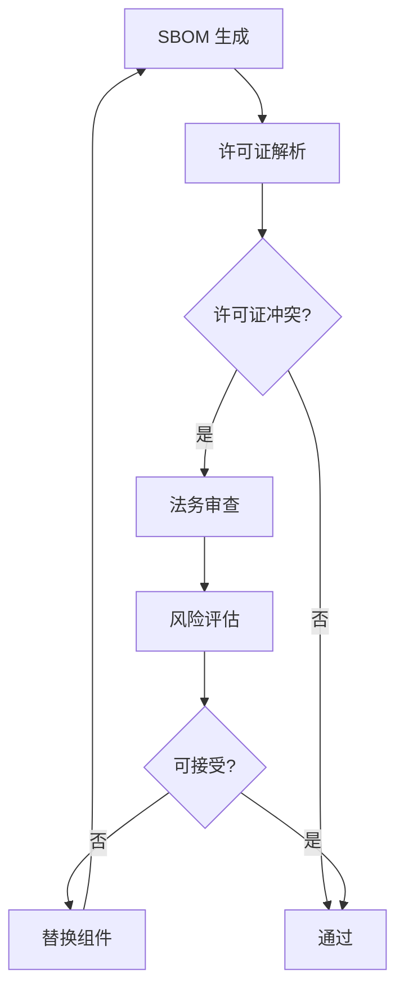
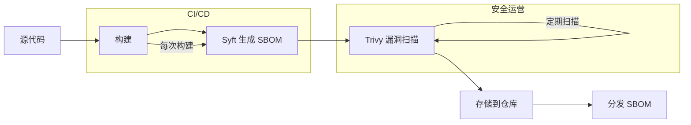

Log4Shell 漏洞爆发后，某公司的安全团队面临一个噩梦般的问题：他们的应用依赖了 Log4j，但没人知道具体哪个应用依赖了它、哪个版本、是否在实际使用。

他们花了三天时间排查所有应用。**这三天里，系统在生产环境中运行着有漏洞的组件**。

**如果他们有 SBOM，这个过程可能只需要几分钟**。

## SBOM 的定义与价值

SBOM（Software Bill of Materials，软件物料清单）是一种标准化文档，记录了软件产品的所有组件、依赖及其关系。

### 为什么需要 SBOM

**漏洞响应**：当新漏洞披露时，快速定位受影响的应用。

**许可证合规**：了解所有组件的许可证，避免法律风险。

**供应链透明**：了解依赖关系，识别供应链风险。

**合规要求**：满足 NTIA、EU Cyber Resilience Act 等法规要求。

### SBOM 的价值矩阵

| 利益相关者 | 价值 |
| --- | --- |
| 安全团队 | 快速定位漏洞影响范围 |
| 开发团队 | 了解依赖风险 |
| 法务团队 | 许可证合规管理 |
| 运营团队 | 变更影响评估 |
| 采购团队 | 供应商评估 |

## SBOM 的格式

### SPDX

SPDX（Software Package Data Exchange）是 Linux 基金会支持的 SBOM 标准格式。

```json title="SPDX 格式示例"
SPDXVersion: SPDX-2.3
DataLicense: CC0-1.0
SPDXID: SPDXRef-DOCUMENT
DocumentName: myapp-sbom
DocumentNamespace: https://example.com/myapp/sbom

Creator: Tool: syft@v0.80.0
Created: 2024-01-15T10:00:00Z

PackageName: myapp
PackageVersion: 1.0.0
PackageDownloadLocation: https://myregistry.com/myapp:v1.0
FilesAnalyzed: false
PRIVATE: false

PackageSupplier: Organization: Example Inc.
PackageLicenseDeclared: Apache-2.0
PackageLicenseConcluded: Apache-2.0

ExternalRef: SECURITY-cpe_vulnerability: cpe:2.3:a:apache:log4j:2.17.0
ExternalRef: SECURITY-cwe: CWE-502
```

### CycloneDX

CycloneDX 是 OWASP 支持的 SBOM 格式，更适合现代应用。

```json title="CycloneDX 格式示例"
{
  "bomFormat": "CycloneDX",
  "specVersion": "1.5",
  "version": 1,
  "metadata": {
    "timestamp": "2024-01-15T10:00:00Z",
    "tools": [
      {
        "name": "syft",
        "version": "0.80.0"
      }
    ],
    "component": {
      "name": "myapp",
      "version": "1.0.0",
      "type": "application"
    }
  },
  "components": [
    {
      "type": "library",
      "name": "log4j-core",
      "version": "2.17.0",
      "group": "org.apache.logging.log4j",
      "purl": "pkg:maven/org.apache.logging.log4j/log4j-core@2.17.0",
      "licenses": [{"license": {"id": "Apache-2.0"}}],
      "vulnerabilities": [
        {
          "id": "CVE-2021-44228",
          "severity": "critical",
          "cvss": {"score": 10.0}
        }
      ]
    }
  ]
}
```

### SWID

SWID（Software Identification）是 ISO/IEC 19770-2 标准定义的标签格式。

```xml title="SWID 格式示例"
<?xml version="1.0" encoding="UTF-8"?>
<SoftwareIdentity
  xmlns="http://standards.iso.org/19770-2/2015/schema.xsd"
  name="myapp"
  version="1.0.0"
  tagId="example.com-myapp-1.0.0">
  <Entity name="Example Inc." role="manufacturer"/>
  <Link href="https://myregistry.com/myapp:v1.0" rel="installationmedia"/>
  <Component name="log4j-core" version="2.17.0"/>
</SoftwareIdentity>
```

### 格式对比

| 格式 | 特点 | 适用场景 |
| --- | --- | --- |
| SPDX | 全面、许可证友好 | 法律合规、供应链审计 |
| CycloneDX | JSON 格式、漏洞集成 | 安全工具集成 |
| SWID | ISO 标准、设备标签 | 资产发现、合规报告 |

## SBOM 的生成方法

### Syft

Syft 是最流行的 SBOM 生成工具，支持多种格式。

```bash title="Syft 生成 SBOM"
# 安装 Syft
brew install syft

# 扫描容器镜像
syft myregistry.com/myapp:v1.0

# 输出 CycloneDX JSON
syft myregistry.com/myapp:v1.0 -o cyclonedx-json > sbom.json

# 输出 SPDX
syft myregistry.com/myapp:v1.0 -o spdx-json > sbom.spdx

# 扫描文件系统
syft dir:/path/to/project -o cyclonedx-json > sbom.json
```

### Trivy

Trivy 可以同时生成镜像扫描报告和 SBOM。

```bash title="Trivy 生成 SBOM"
# 生成 SBOM
trivy image --format cyclonedx myregistry.com/myapp:v1.0 > sbom.json

# 扫描 SBOM 中的漏洞
trivy sbom sbom.json
```

### CI/CD 集成

```yaml title="GitHub Actions 集成 SBOM 生成"
name: Generate SBOM

on:
  push:
    tags:
      - 'v*'

jobs:
  sbom:
    runs-on: ubuntu-latest
    steps:
      - name: Checkout
        uses: actions/checkout@v4
      
      - name: Build image
        run: docker build -t ${{ env.IMAGE_NAME }}:${{ github.ref_name }} .
      
      - name: Generate SBOM
        uses: anchore/sbom-action@v0
        with:
          image: ${{ env.IMAGE_NAME }}:${{ github.ref_name }}
          format: spdx-json
          output-file: sbom.spdx.json
      
      - name: Upload SBOM
        uses: actions/upload-artifact@v4
        with:
          name: sbom
          path: sbom.spdx.json
```

## SBOM 与 CVE 漏洞管理

### 漏洞关联分析

```json title="SBOM 漏洞关联示例"
{
  "vulnerabilities": [
    {
      "id": "CVE-2021-44228",
      "source": "NVD",
      "severity": "critical",
      "cvss": 10.0,
      "affected_packages": [
        "log4j-core@2.14.0",
        "log4j-core@2.15.0"
      ],
      "fixed_in": [
        "log4j-core@2.17.0"
      ]
    }
  ]
}
```

### Java 漏洞管理示例

```java title="SBOM 漏洞查询服务"
import com.fasterxml.jackson.databind.JsonNode;
import com.fasterxml.jackson.databind.ObjectMapper;

public class SbomVulnerabilityService {
    
    private final ObjectMapper mapper = new ObjectMapper();
    
    public List<Vulnerability> findVulnerabilities(File sbomFile, String cveId) 
            throws IOException {
        JsonNode sbom = mapper.readTree(sbomFile);
        List<Vulnerability> results = new ArrayList<>();
        
        JsonNode components = sbom.get("components");
        for (JsonNode component : components) {
            if (component.has("vulnerabilities")) {
                for (JsonNode vuln : component.get("vulnerabilities")) {
                    if (cveId.equals(vuln.get("id").asText())) {
                        results.add(new Vulnerability(
                            component.get("name").asText(),
                            component.get("version").asText(),
                            vuln
                        ));
                    }
                }
            }
        }
        return results;
    }
    
    public record Vulnerability(
        String component,
        String version,
        JsonNode details
    ) {}
}
```

## SBOM 与许可证合规

### 许可证冲突检测

```bash title="许可证检查"
# Syft 许可证分析
syft myregistry.com/myapp:v1.0 -o table

# 输出示例
NAME                    VERSION          TYPE        LICENSES
--------------------------  --------------  ----------  -----------
log4j-core              2.17.0          maven       Apache-2.0
spring-boot             3.2.0           maven       Apache-2.0
mysql-connector         8.0.33          maven       GPL-2.0
commons-codec           1.15            maven       Apache-2.0
```

### 许可证合规工作流



## SBOM 的消费与使用

### 安全扫描集成

```bash title="使用 SBOM 进行漏洞扫描"
# 基于 SBOM 扫描
trivy sbom path/to/sbom.json

# 扫描特定 CVE
trivy sbom path/to/sbom.json --vuln-id CVE-2021-44228

# 输出 JSON 报告
trivy sbom path/to/sbom.json --format json --output vuln-report.json
```

### 软件组成分析

```java title="构建依赖关系图"
import java.util.*;

public class DependencyGraph {
    
    public record Dependency(
        String name,
        String version,
        List<Dependency> children
    ) {}
    
    public Dependency buildFromSbom(JsonNode sbom) {
        Map<String, JsonNode> componentMap = new HashMap<>();
        
        for (JsonNode component : sbom.get("components")) {
            componentMap.put(
                component.get("purl").asText(),
                component
            );
        }
        
        return buildDependencyTree(componentMap);
    }
    
    private Dependency buildDependencyTree(Map<String, JsonNode> components) {
        // 实现依赖树的构建逻辑
        return null;
    }
}
```

## SBOM 的生命周期管理

### 版本控制

SBOM 应该与软件版本关联，形成版本历史。

```json title="版本化 SBOM"
{
  "metadata": {
    "documentName": "myapp-sbom",
    "specVersion": "1.5",
    "version": 1,
    "component": {
      "name": "myapp",
      "version": "1.0.0"
    },
    "build": {
      "buildSystem": "GitHub Actions",
      "buildUrl": "https://github.com/example/myapp/actions/runs/123456",
      "builtOn": "2024-01-15T10:00:00Z"
    }
  }
}
```

### 存储与分发

| 存储位置 | 优点 | 缺点 |
| --- | --- | --- |
| 镜像内嵌入 | 与镜像一起分发 | 更新需要重新构建 |
| 独立文件存储 | 易于更新和查询 | 需要单独管理 |
| SBOM 注册表 | 集中管理、版本控制 | 需要额外的服务 |
| 软件包管理器 | 与依赖管理集成 | 需要工具支持 |

### 自动化更新

```yaml title="定时更新 SBOM"
apiVersion: batch/v1
kind: CronJob
metadata:
  name: sbom-refresh
  namespace: devsecops
spec:
  schedule: "0 2 * * *"
  jobTemplate:
    spec:
      template:
        spec:
          containers:
            - name: refresh-sbom
              image: anchore/syft:latest
              command:
                - sh
                - -c
                - |
                  for image in $(kubectl get images -o name); do
                    syft $image -o cyclonedx-json > /sbom/$(echo $image | tr '/:' '-').json
                  done
              volumeMounts:
                - name: sbom-store
                  mountPath: /sbom
          restartPolicy: OnFailure
```

## NTIA 对 SBOM 的要求

### NTIA SBOM 最小元素

2021 年 NTIA（美国国家电信和信息管理局）发布了 SBOM 最小元素要求：

| 元素 | 说明 |
| --- | --- |
| **数据字段** | 软件名称、版本、依赖关系 |
| **时间戳** | SBOM 创建和更新时间 |
| **作者** | SBOM 生成者信息 |
| **���具** | 生成 SBOM 使用的工具 |

### NTIA 格式要求

- SPDX 或 CycloneDX ���式
- 机器可读
- 支持自动化处理

### 合规建议

1. **自动化生成**：在 CI/CD 流水线中自动生成 SBOM
2. **版本对应**：每个软件版本对应一个 SBOM
3. **安全存储**：SBOM 本身也是敏感数据，需要安全存储
4. **持续更新**：依赖变更时更新 SBOM

## SBOM 的工具链

### 工具矩阵

| 工具 | 功能 | 格式支持 |
| --- | --- | --- |
| Syft | SBOM 生成 | CycloneDX、SPDX |
| Trivy | 镜像扫描 + SBOM | CycloneDX、SPDX |
| Grype | 漏洞扫描 + SBOM | CycloneDX |
| Bomsh | 多语言 SBOM | CycloneDX、SPDX |
| cdxgen | 通用 SBOM 生成 | CycloneDX |

### 完整工具链示例



:::tip SBOM 实施建议
建议从 Syft 开始，它易于使用且支持多种输出格式。在 CI/CD 流水线中集成 SBOM 生成，确保每个构建都生成 SBOM。
:::

## 总结与延伸思考

SBOM 是现代软件供应链安全的基础设施。它让组织能够回答「我们的软件��什么组成」这个关键问题。

实施建议：

1. **从自动化开始**：在 CI/CD 流水线中自动生成 SBOM
2. **选择合适格式**：CycloneDX 更适合安全工具集成
3. **与漏洞管理集成**：使用 SBOM 进行快速漏洞响应
4. **覆盖所有组件**：包括直接依赖和传递依赖

SBOM 的价值在安全事件发生时最为明显——当新的漏洞披露时，拥有 SBOM 的组织可以快速定位受影响范围，而没有 SBOM 的组织可能需要花费数天时间排查。

### 思考题

**问题 1**：为什么说 SBOM 是供应链安全的基础设施？
<details>
<summary>参考答案</summary>

SBOM 提供了软件组成的基础可见性，这是其他供应链安全工作（漏洞响应、许可证合规、SLSA）的前提。没有 SBOM，无法快速定位漏洞影响范围，无法了解许可证风险，无法验证构建完整性。SBOM 类似于制造业的 BOM（物料清单），它不是最终的安全控制，而是支持其他安全功能的基础数据。
</details>

**问题 2**：如何确保 SBOM 本身的真实性？
<details>
<summary>参考答案</summary>

SBOM 的真实性可以通过以下方式保证：1）签名：在 CI/CD 中使用私密密钥签名 SBOM，消费者可以验证签名；2）构建 Provenance：将 SBOM 生成过程纳入 SLSA 构建 provenance，与构建过程一起验证；3）透明日志：使用 Sigstore Rekor 等透明日志记录 SBOM 生成过程；4）来源可追溯：SBOM 应该包含生成工具、生成时间、构建系统等信息，便于审计。
</details>
