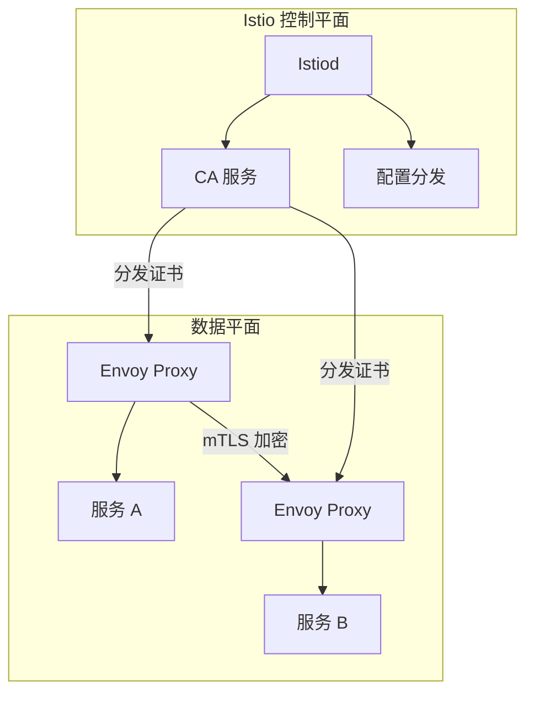
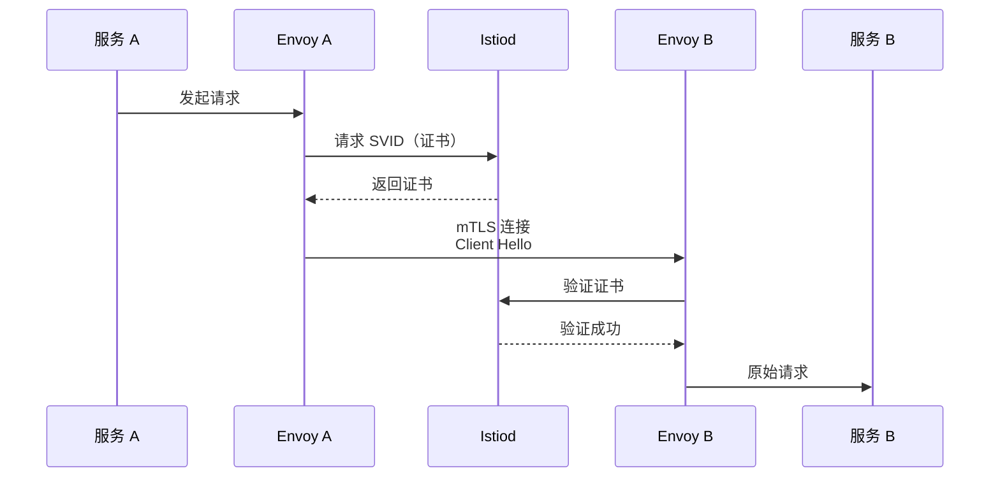

某公司微服务架构运行在 Kubernetes 上，服务间使用 HTTP/gRPC 进行通信。他们认为网络层面的隔离（VPC、安全组）已经足够安全。但一次内部渗透测试暴露了问题：攻击者拿下了其中一个微服务后，发现可以访问所有其他微服务——包括支付服务、用户数据服务。

**问题在于「网络隔离」不等于「服务间认证」**。即使在内部网络中，任何服务都可以向其他服务发起请求，因为它们假设同一网络内的所有服务都是可信的。

服务网格通过 **mTLS（双向 TLS）** 和 **细粒度授权策略** 解决了这个问题——即使服务在同一网络中，服务间的每次通信都需要相互验证身份。

## 服务网格的安全优势

服务网格将安全功能从应用代码中分离出来，下沉到基础设施层。

### mTLS 的核心价值

**双向认证**：不仅服务器验证客户端，客户端也验证服务器，防止中间人攻击和服务冒充。

**自动化证书管理**：证书的发放、轮转、撤销都由服务网格自动处理，不需要应用代码介入。

**透明加密**：服务间通信自动加密，不需要应用代码修改。

### 与传统方案的对比

| 特性 | 传统方案 | 服务网格 |
| --- | --- | --- |
| 证书管理 | 手动、复杂 | 自动、零配置 |
| mTLS | 需要应用集成 SDK | 透明、自动 |
| 授权策略 | RBAC 级别 | L7 细粒度控制 |
| 可见性 | 有限 | 完整流量可见性 |
| 性能开销 | 中等 | 低（eBPF 加速） |

## Istio 的安全架构

Istio 是最成熟的开源服务网格，其安全架构设计值得深入理解。

### 核心组件



### Istiod（控制平面）

Istiod 是 Istio 的核心控制组件，提供以下功能：

**CA 服务**：生成和管理工作负载证书，实现 mTLS。

**配置分发**：将 AuthorizationPolicy、DestinationRule 等配置推送到 Envoy Proxy。

**证书轮转**：自动轮转证书，减少证书过期的风险。

### Envoy（Sidecar 代理）

每个 Pod 中的 Sidecar Proxy 拦截所有入站和出站流量：

**入站处理**：TLS 终止、身份验证、授权检查。

**出站处理**：TLS 发起、流量加密、策略执行。

## mTLS 的工作原理

### 证书分发



### 自动证书轮转

Istiod 会定期轮转证书，服务网格会自动处理这个过程，对应用透明。

```yaml title="PeerAuthentication 配置 mTLS 模式"
apiVersion: security.istio.io/v1beta1
kind: PeerAuthentication
metadata:
  name: default
  namespace: production
spec:
  mtls:
    mode: STRICT  # 强制 mTLS
```

## 授权策略（AuthorizationPolicy）

Istio 的 AuthorizationPolicy 支持细粒度的服务访问控制。

### 工作负载级别授权

```yaml title="允许特定服务访问"
apiVersion: security.istio.io/v1beta1
kind: AuthorizationPolicy
metadata:
  name: api-authz
  namespace: production
spec:
  selector:
    matchLabels:
      app: api
  rules:
    - from:
        - source:
            principals: ["cluster.local/ns/production/sa/web"]
      to:
        - operation:
            methods: ["GET"]
            paths: ["/api/*"]
    - from:
        - source:
            principals: ["cluster.local/ns/production/sa/frontend"]
      to:
        - operation:
            methods: ["GET", "POST"]
            paths: ["/api/*"]
```

### 命名空间级别控制

```yaml title="跨命名空间访问控制"
apiVersion: security.istio.io/v1beta1
kind: AuthorizationPolicy
metadata:
  name: allow-monitoring
  namespace: production
spec:
  rules:
    - from:
        - source:
            namespaces: ["monitoring"]
      to:
        - operation:
            methods: ["GET"]
            paths: ["/health", "/metrics"]
```

### JWT 验证

```yaml title="JWT 认证"
apiVersion: security.istio.io/v1beta1
kind: AuthorizationPolicy
metadata:
  name: require-jwt
  namespace: production
spec:
  selector:
    matchLabels:
      app: api
  rules:
    - from:
        - source:
            requestPrincipals: ["*"]
      to:
        - operation:
            methods: ["POST", "PUT", "DELETE"]
```

## Istio 的流量加密

### TLS 配置级别

```yaml title="DestinationRule TLS 配置"
apiVersion: networking.istio.io/v1beta1
kind: DestinationRule
metadata:
  name: api-tls
  namespace: production
spec:
  host: "api.production.svc.cluster.local"
  trafficPolicy:
    tls:
      mode: ISTIO_MUTUAL  # 使用 Istio 管理的 mTLS
```

### TLS 模式说明

| 模式 | 说明 | 适用场景 |
| --- | --- | --- |
| DISABLE | 不使用 TLS | 测试环境 |
| PERMISSIVE | 可选 TLS | 迁移阶段 |
| SIMPLE | 服务端 TLS | 单向认证 |
| MUTUAL | 双向 TLS | 生产环境 |
| ISTIO_MUTUAL | Istio 管理的 mTLS | 推荐 |

## Ambient 模式的安全特性

Istio 1.18 引入了 Ambient 模式，提供了更轻量的安全方案。

### 与 Sidecar 模式的对比

| 特性 | Sidecar 模式 | Ambient 模式 |
| --- | --- | --- |
| 部署方式 | 每个 Pod 一个 Sidecar | 节点级 ztunnel |
| 资源开销 | 每个 Pod 额外资源 | 节点级共享 |
| 性能开销 | 每个请求额外一跳 | L4 直通 |
| 安全功能 | 完整（L4 + L7） | 完整（L4 + 可选 L7） |

### Ambient 安全特性

**零信任网络**：所有流量默认加密，不需要应用代码修改。

**身份感知路由**：基于服务身份的流量控制。

**全链路 mTLS**：跨命名空间、跨集群的全链路加密。

## Linkerd 与 Istio 安全对比

| 特性 | Linkerd | Istio |
| --- | --- | --- |
| mTLS 实现 | Rust 微代理 | Envoy C++ |
| 性能开销 | 更低 | 略高 |
| 配置复杂度 | 简单 | 复杂 |
| L7 策略 | 有限 | 丰富 |
| CNCF 状态 | 毕业项目 | 毕业项目 |
| 适用场景 | 简单 L4 场景 | 复杂 L7 策略 |

### Linkerd 授权示例

```yaml title="Linkerd ServiceAccount 授权"
apiVersion: policy.linkerd.io/v1beta1
kind: ServerAuthorization
metadata:
  name: web-to-api
  namespace: production
spec:
  server:
    name: api
  client:
    - serviceAccount:
        name: web
```

## 服务网格安全的最佳实践

### 启用 STRICT mTLS

```yaml title="强制 mTLS"
apiVersion: security.istio.io/v1beta1
kind: PeerAuthentication
metadata:
  name: default
  namespace: istio-system
spec:
  mtls:
    mode: STRICT
```

### 最小权限原则

```yaml title="只允许必要的访问"
apiVersion: security.istio.io/v1beta1
kind: AuthorizationPolicy
metadata:
  name: least-privilege
  namespace: production
spec:
  # 默认拒绝
  action: ALLOW
  rules: []
  # 显式声明允许的访问
  rules:
    - from:
        - source:
            principals: ["allowed-sa"]
      to:
        - operation:
            methods: ["GET"]
            paths: ["/api/data"]
```

### 定期审计

```bash title="检查 mTLS 配置"
# 检查 PeerAuthentication
istioctl analyze

# 检查服务间认证状态
istioctl authz check api.production:8080

# 检查证书到期时间
istioctl proxy-config secret <pod-name>
```

:::tip 迁移建议
从 PERMISSIVE 迁移到 STRICT mTLS 时，建议先在测试环境验证，确保所有服务都支持 mTLS。迁移期间可以保留 PERMISSIVE 模式作为回退选项。
:::

## 总结与延伸思考

服务网格将服务间安全从「可选」变为「默认」。mTLS 自动保护所有服务间通信，细粒度授权策略控制访问权限。

选择服务网格时，如果只需要 L4 mTLS 和基本授权，Linkerd 更简单；如果需要复杂的 L7 策略和流量管理，Istio 更强大。Ambient 模式为 Istio 提供了更轻量的选择，适合不想使用 Sidecar 的场景。

### 思考题

**问题 1**：为什么说服务网格的 mTLS 比应用自己实现 TLS 更安全？
<details>
<summary>参考答案</summary>

应用自己实现 TLS 的问题：1）密钥可能硬编码在代码或配置中，泄露风险高；2）证书过期可能无人处理；3）TLS 库可能存在漏洞。服务网格的 mTLS：1）密钥存储在安全硬件或 Kubernetes Secret 中；2）证书自动轮转，不需要应用介入；3）安全团队可以集中管理 TLS 配置和策略；4）应用代码不需要处理 TLS，降低了实现错误的可能性。
</details>

**问题 2**：服务网格的 Ambient 模式相比 Sidecar 模式有什么安全优势？
<details>
<summary>参考答案</summary>

Ambient 模式的安全优势：1）减少攻击面——没有 Sidecar 意味着容器内没有额外的进程可以攻击；2）更小的资源占用意味着更少的潜在漏洞；3）节点级代理可以更好地实现网络隔离；4）配置集中管理，减少配置错误风险。但也有权衡：Ambient 模式的 L7 功能需要 Waypoint Proxy，可能增加复杂性。
</details>
