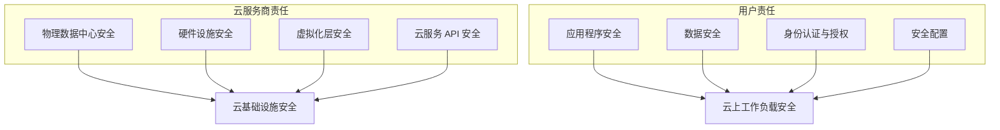
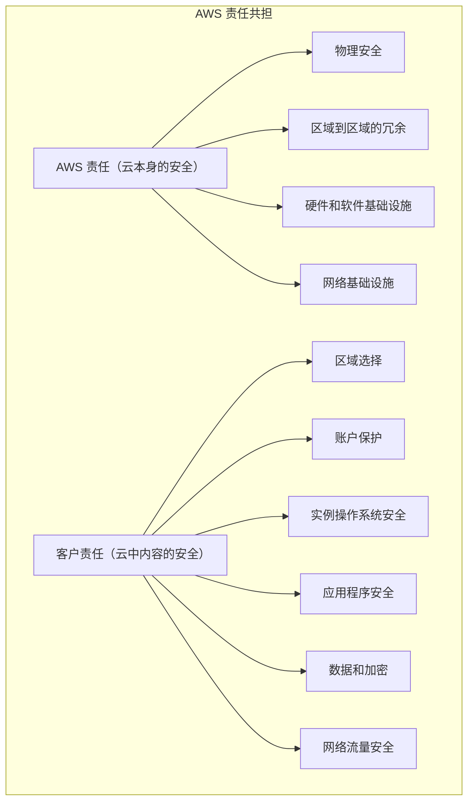

某金融公司在将核心交易系统迁移到云之后，遭遇了一次数据泄露事件。调查发现，云服务商的基础设施是安全的，但该公司将数据库访问凭证硬编码在了代码中，最终导致凭证泄露。

这起事件引发了一场争论：数据泄露的责任应该由谁承担？云服务商认为责任在用户——用户没有妥善保管凭证。云服务商在基础设施层面提供了加密、KMS、IAM 等安全能力，用户没有使用这些能力是自己的问题。而用户则认为云服务商应该提供更安全的默认值，平台层面的安全不足导致了事件发生。

这是一个典型的「责任共担模糊区」案例。在云原生时代，理解责任共担模型比以往任何时候都更加重要。

## 责任共担模型的核心思想

责任共担模型（Shared Responsibility Model）是云安全的基石。它的核心理念是：云安全是云服务商和用户共同的责任，而非���何一方的独角戏。

**云服务商负责云基础设施本身的安全**：包括物理数据中心的安全、网络设备的安全、存储设备的安全、服务器虚拟化层的安全。这些是云服务商的专业领域，通过规模效应和安全投入，他们能够提供比大多数企业自建基础设施更高的安全水平。

**用户负责自己在云上部署的应用和数据的安全**：包括应用程序的安全配置、数据的加密和访问控制、身份认证和授权、安全运营和监控。用户最了解自己的业务和数据，应该对安全后果承担责任。

## IaaS / PaaS / SaaS 的责任边界差异

责任边界取决于用户使用的云服务类型。服务类型越接近 IaaS，用户承担的责任越多；服务类型越接近 SaaS，云服务商承担的责任越多。

| 安全领域 | IaaS | PaaS | SaaS |
| --- | --- | --- | --- |
| 物理安全 | 云服务商 | 云服务商 | 云服务商 |
| 网络安全 | 云服务商 + 用户 | 云服务商 + 用户 | 云服务商 |
| 主机安全 | 用户 | 用户 | 云服务商 |
| 容器编排安全 | 用户 | 云服务商 + 用户 | 云服务商 |
| 应用程序安全 | 用户 | 用户 | 云服务商 |
| 数据安全 | 用户 | 用户 | 云服务商 + 用户 |
| 身份安全 | 云服务商 + 用户 | 云服务商 + 用户 | 云服务商 + 用户 |
| 合规管理 | 云服务商 + 用户 | 云服务商 + 用户 | 云服务商 + 用户 |

### IaaS 场景

在 IaaS（基础设施即服务）模式下，用户租用虚拟机和网络资源，需要自行负责操作系统以上的所有安全配置。

典型场景：EC2 实例、S3 存储、VPC 网络。

用户必须负责：操作系统补丁和加固、防火墙规则配置、密钥管理、访问控制、容器运行时安全、Kubernetes 集群安全配置。

云服务商负责：物理服务器安全、虚拟化隔离、网络设备安全、存储介质安全。

### PaaS 场景

在 PaaS（平台即服务）模式下，云服务商提供了应用运行平台，用户只需关注应用代码和数据安全。

典型场景：AWS Elastic Beanstalk、Google App Engine、Azure App Service。

云服务商额外负责：运行时环境安全、应用框架安全、基础服务安全。

用户仍需负责：应用程序代码安全、数据加密和访问控制、用户身份认证、第三方依赖安全。

### SaaS 场景

在 SaaS（软件即服务）模式下，云服务商提供了完整的应用，用户只需关注数据安全和用户账户管理。

典型场景：Salesforce、Microsoft 365、Google Workspace。

云服务商承担大部分安全责任：应用程序安全、运行时安全、数据存储安全、基础设施安全。

用户需要负责：用户账户安全（MFA 配置）、数据分类和访问控制、审计日志配置、业务连续性计划。

## AWS / Azure / GCP 责任共担图解

三大云服务商都采用了责任共担模型，但具体实现略有差异。

### AWS

AWS 采用「安全责任共担」模式，并通过 AWS Artifact 提供合规报告。AWS 将服务分为三类：基础设施服务（EC2、S3）、容器服务（RDS、EMR）、抽象服务（Lambd、S3）。

AWS 提供了丰富的安全服务来帮助用户履行安全责任：IAM（身份管理）、KMS（密钥管理）、Security Hub（安全态势管理）、CloudTrail（日志审计）。

### Azure

Azure 采用「共同责任」模型，并将责任映射到具体的安全控制领域。Azure 按服务类型将安全责任分配到「Azure 管理的责任」和「客户承担的责任」两类。

Azure 的安全优势在于与 Microsoft 365 的深度集成，用户可以使用 Defender for Cloud 统一管理多云安全。

### GCP

GCP 采用「分层责任」模型，并在每个服务文档中明确标注安全责任边界。GCP 强调「设计安全」理念，通过 BeyondProd 等内部实践确保基础设施安全。

GCP 的安全服务包括：Cloud IAM、Cloud KMS、Security Command Center、BeyondCorp（零信任访问）。

## 用户的常见安全误区

在云安全实践中，用户经常陷入以下误区：

**误区一：数据上了云就安全了**。云的物理安全不等于数据安全。如果不加密、不控制访问，数据在云上可能比在本地更危险。

**误区二：云服务商应该阻止所有攻击**。云服务商提供的是基础设施安全，不是应用程序安全。一个 SQL 注入漏洞无论在本地还是云上都会导致数据泄露。

**误区三：使用云服务就自动合规**。合规是用户的责任，云服务商提供合规工具和认证（如 SOC 2、ISO 27001），但用户需要自己证明合规。

**误区四：配置一次就永久安全**。云安全配置是持续性的，资源变更、合规要求变化、新的威胁出现都需要持续的安全运营。

**误区五：默认配置足够安全**。云服务的默认配置通常是为了易用性而非安全性。例如，AWS S3 默认为私有，但如果用户创建了一个公开访问的 Bucket 策略，默认安全性就被绕过了。

:::warning 典型案例
2017 年 AWS S3 的「配置错误」导致 2 亿美国选民数据泄露。问题不是 AWS 的基础设施不安全，而是用户配置了一个错误的 Bucket 策略，将本应私有的数据公开了。这是一个典型的用户责任事故。
:::

## 合规场景下的责任分配

在合规要求下，责任分配更加明确。

### SOC 2 合规

SOC 2 报告分为两类：

- **Type 1**：评估服务组织在特定日期的安全控制设计合理性
- **Type 2**：评估服务组织在一定时期内（通常 6-12 个月）安全控制的有效性

云服务商通常提供 Type 2 报告，证明其基础设施安全控制的有效性。用户需要在自身 SOC 2 审计中说明如何使用云服务商的安全能力来满足控制要求。

### ISO 27001 / 27017 / 27018

- **ISO 27001**：信息安全管理体系基础标准
- **ISO 27017**：云服务信息安全管理指南，明确了云服务商和用户在云环境中的具体安全责任
- **ISO 27018**：云服务中个人数据保护的行为准则

### PCI DSS

对于处理支付卡数据的组织，PCI DSS 合规是必须的。在云环境中，需要明确：

- 云服务商通过 PCI DSS 认证，不意味着用户自动合规
- 用户必须证明自己正确使用了云服务商提供的 PCI 合规服务
- 持卡人数据环境（CDE）的边界必须清晰定义

## 合同与 SLA 中的安全条款

云服务合同中的安全条款通常包含以下内容：

| 条款类型 | 常见内容 | 注意事项 |
| --- | --- | --- |
| 数据所有权 | 明确数据归用户所有，云服务商不得用于其他目的 | 确认数据删除条款 |
| 数据驻留 | 数据存储的地理位置和跨境传输规则 | 确认合规要求是否满足 |
| 加密要求 | 静态加密和传输加密的要求 | 确认加密算法和密钥管理方 |
| 访问控制 | 云服务商人员的访问权限和审批流程 | 确认是否提供零知识证明 |
| 安全事件通知 | 安全事件的报告时限和通知方式 | 确认通知 SLA |
| 审计权利 | 用户审计云服务商安全控制的权利 | 确认审计方式和频率 |
| 违约责任 | 安全事件发生时的责任分配和赔偿 | 确认赔偿上限和免责条款 |

:::tip 合同审查建议
在签订云服务合同前，建议法务团队和安全团队共同审查安全条款。特别关注：数据泄露责任划分、安全事件通知时效、合同终止后的数据处理。
:::

## 总结与延伸思考

云安全责任共担模型不是「各扫门前雪」的简单划分，而是一种动态协作关系。云服务商提供安全的基础设施和安全工具，用户需要正确使用这些工具并承担应用层的安全责任。

理解责任边界不是为了推卸责任，而是为了明确重点。在 IaaS 模式下，用户需要具备基础设施安全的专业知识；在 SaaS 模式下，用户需要专注于数据安全和身份安全。

关键判断标准是：**谁能够控制和影响这个安全领域，谁就应该负责**。

### 思考题

**问题 1**：一家公司使用 AWS EKS（托管 Kubernetes）部署微服务应用，哪些安全责任属于 AWS，哪些属于用户？

参考答案

属于 AWS 的责任：控制平面安全（API Server 高可用、安全更新）、Etcd 加密、工作节点操作系统安全（EKS 托管节点组）、网络基础设施安全。属于用户的责任：Pod 安全配置（Security Context、NetworkPolicy）、RBAC 配置、Secret 管理、镜像安全、运行时安全、网络策略、CIS 合规配置。建议参考 AWS EKS 文档中的安全责任矩阵。

**问题 2**：为什么说「默认配置足够安全」是一个危险假设？请举出一个具体场景。

参考答案

以 Kubernetes Dashboard 为例：旧版本 Dashboard 默认启用 Heapster 且未配置认证，任何能访问 API Server 的人都可以通过 Dashboard 获得集群管理权限。攻击者通过 Shodan 等搜索引擎发现暴露的 Dashboard 后，可以轻易获取集群完全控制权。这是一个经典的「默认配置危害」案例。正确的做法是：在部署前审查所有默认配置，实施最小权限原则，启用强制认证。

