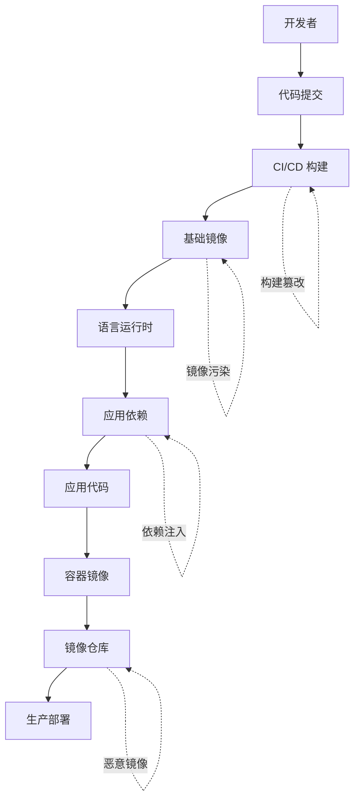
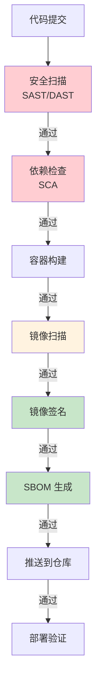

2017 年，NotPetya 勒索软件通过乌克兰会计软件厂商的更新机制传播，最终影响了全球数十亿美元的经济活动。

2021 年，Log4Shell 漏洞影响了数十万应用程序。这个漏洞藏在一个被广泛使用的日志库中——大多数开发者甚至不知道自己的项目依赖了它。

2023 年，XZ Utils 后门事件震惊了整个开源社区。一个默默贡献代码两年的开发者，在 xz-utils 5.6.0 中植入了一个复杂的后门。

**这些事件揭示了一个冷酷的事实：供应链是现代软件系统最脆弱的环节之一**。

## 软件供应链安全的威胁格局

软件供应链攻击（Supply Chain Attack）是指攻击者通过入侵上游供应商或利用供应链中的弱点来影响最终产品的攻击方式。

### 攻击类型分类

| 攻击类型 | 说明 | 案例 |
| --- | --- | --- |
| 依赖混淆 | 发布同名恶意包到公共仓库 | npm、PyPI 攻击事件 |
| 恶意���码注入 | 在合法代码中植入后门 | XZ Utils 后门 |
| 构建篡改 | 修改 CI/CD 流程植入恶意代码 | SolarWinds |
| 基础镜像污染 | 在基础镜像中植入恶意组件 | Docker Hub 恶意镜像 |
| 证书伪造 | 伪造签名证书绕过验证 | |
| 依赖链攻击 | 通过传递依赖引入恶意包 | |

### 容器供应链的特殊风险

**多层依赖**：基础镜像 + 语言运行时 + 框架 + 应用依赖，每层都是潜在攻击面。

**共享镜像仓库**：公共镜像仓库（如 Docker Hub）缺乏严格的身份验证机制。

**自动化构建**：CI/CD 流水线中的构建步骤可能被篡改。

**证书管理**：容器镜像签名需要安全的密钥管理。



## 供应链攻击的案例

### SolarWinds 事件（2020）

**攻击概述**：攻击者通过入侵 SolarWinds 的 CI/CD 流程，在 Orion 软件更新包中植入了恶意代码（Sunburst 后门）。

**影响范围**：超过 18,000 个组织受影响，包括多个美国政府机构。

**关键教训**：

- 构建流程是最薄弱的环节之一
- 签名验证不足以防止供应链攻击（因为攻击者可以替换签名）
- 需要验证构建过程的完整性（而非仅验证产物）

### Log4Shell 漏洞（2021）

**攻击概述**：Apache Log4j 中发现的远程代码执行漏洞，影响了全球数十万个应用程序。

**影响范围**：几乎所有使用 Log4j 的 Java 应用。

**关键教训**：

- 传递依赖风险：开发者可能不知道自己的间接依赖
- 镜像漏洞扫描不足：需要覆盖所有依赖层
- 快速响应能力：需要能够快速定位和修复所有受影响应用

### XZ Utils 后门（2023）

**攻击概述**：攻击者伪装成默默贡献者，在 xz-utils 5.6.0 中植入了一个复杂的后门。

**影响范围**：影响使用 xz-utils 的 Linux 发行版。

**关键教训**：

- 供应链信任的脆弱性
- 需要验证贡献者身份和代码来源
- 长期潜伏的攻击难以检测

## 供应链安全的 CNCF 成熟度模型

CNCF 提供了一个供应链安全成熟度模型，帮助企业评估和改进供应链安全。

### 成熟度等级

| 等级 | 说明 | 关键措施 |
| --- | --- | --- |
| **Bronze** | 基础 | 镜像扫描、基本访问控制 |
| **Silver** | 规范化 | 签名验证、RBAC 配置 |
| **Gold** | 高级 | 完整签名链、SBOM |
| **Platinum** | 领先 | SLSA Level 3+、自动化合规 |

### 各等级详细要求

**Bronze 级别**：

- 构建时进行镜像扫描
- 使用私有镜像仓库
- 基本 RBAC 配置

**Silver 级别**：

- 镜像签名并验证
- 限制基础镜像来源
- 启用审计日志

**Gold 级别**：

- 完整的供应链签名（SLSA Level 2）
- 生成和验证 SBOM
- 密钥安全轮转

**Platinum 级别**：

- SLSA Level 3+
- 自动化合规检查
- 安全情报集成

## 镜像来源控制

### 白名单镜像仓库

```yaml title="限制镜像来源"
# Kyverno 策略：只允许白名单镜像
apiVersion: kyverno.io/v1
kind: ClusterPolicy
metadata:
  name: restrict-image-registries
spec:
  validationFailureAction: enforce
  rules:
    - name: check-registries
      match:
        resources:
          kinds: [Pod]
      validate:
        message: "Only specific registries are allowed"
        pattern:
          spec:
            containers:
              - image: "myregistry.com/* | gcr.io/* | docker.io/*"
```

### 基础镜像签名

```bash title="验证基础镜像签名"
# 使用 Cosign 验证镜像签名
cosign verify --key cosign.pub myregistry.com/base-image:v1.0

# 验证镜像供应链信息
cosign attest --key cosign.pub myregistry.com/base-image:v1.0

# 检查透明日志
rekor-cli get --sha sha256:<image-digest>
```

## 第三方依赖的安全审查

### 依赖扫描

```bash title="使用 Trivy 扫描依赖"
# 扫描文件系统中的依赖
trivy fs --severity HIGH,CRITICAL ./package-lock.json

# 扫描容器镜像的所有依赖层
trivy image --vuln-type os,library myapp:latest
```

### 依赖锁定

```bash title="锁定依赖版本"
# npm 依赖锁定
npm ci  # 使用 package-lock.json

# Maven 依赖锁定
mvn dependency:resolve
mvn dependency:tree > dependency-tree.txt

# Python 依赖锁定
pip freeze > requirements.txt
pip install -r requirements.txt
```

### 传递依赖审查

```bash title="审查传递依赖树"
# npm 查看依赖树
npm audit
npm ls --depth=3

# Maven 查看依赖树
mvn dependency:tree
mvn dependency:analyze
```

## SLSA（Supply-chain Levels for Software Artifacts）

SLSA 是一个供应链安全框架，定义了软件构建过程的完整性保证等级。

### SLSA 等级说明

| 等级 | 说明 | 要求 |
| --- | --- | --- |
| **SLSA 1** | 基础 | 构建过程记录 |
| **SLSA 2** | 签名 | 构建过程签名、可验证来源 |
| **SLSA 3** | 强化 | 防篡改构建、隔离构建 |
| **SLSA 4** | 最高 | 多方验证、隔离构建、密封构建 |

### SLSA 2 核心要求

**来源可追溯**：每个构建产物都有关联的来源记录，包括：

- 代码来源（Git commit）
- 构建步骤（构建命令）
- 构建者身份

**签名验证**：构建过程使用私密密钥签名，可由消费者验证。

### SLSA 3 核心要求

**防篡改构建**：构建过程在隔离环境中进行，不可被外部篡改。

**非共享构建**：构建过程使用独立资源，不与其他构建共享。

### SLSA 验证

```bash title="使用 slsa-verifier 验证构建 provenance"
# 安装 slsa-verifier
go install github.com/slsa-framework/slsa-verifier@latest

# 验证构建 provenance
slsa-verifier verify-image \
  --artifact-image myregistry.com/myapp:v1.0 \
  --provenance-file provenance.intoto.json \
  --expected-sourceuri "github.com/myorg/myapp" \
  --expected-sha "<commit-sha>"
```

## sigstore 与签名透明

### sigstore 组件

**Cosign**：镜像签名工具，使用 OIDC 进行身份认证。

**Rekor**：透明日志服务，记录所有签名操作。

**Fulcio**：代码签名 CA，基于 OIDC 认证。

### 签名透明日志

```bash title="查询签名历史"
# 使用 Rekor CLI 查询签名记录
rekor-cli search --sha sha256:<image-digest>

# 获取签名详细信息
rekor-cli get --uuid <uuid>

# 验证签名包含在透明日志中
rekor-cli verify --sha sha256:<image-digest> --signature <signature>
```

### OIDC 身份验证

```bash title="使用 OIDC 进行签名（无需静态密钥）"
# 安装 Cosign
brew install cosign

# 使用 GitHub OIDC 登录（无需静态密钥）
cosign sign --yes myregistry.com/myapp:v1.0

# Cosign 会自动从 OIDC 提供商获取短期令牌
```

## 供应链安全的 CI/CD 集成

### 完整流水线安全



### CI/CD 流水线配置

```yaml title="GitLab CI 供应链安全"
stages:
  - scan
  - build
  - sign
  - deploy

dependency-check:
  stage: scan
  image: owasp/dependency-check:latest
  script:
    - dependency-check.sh --project myapp --scan . --out report

trivy-scan:
  stage: scan
  image: aquasec/trivy:latest
  script:
    - trivy image --severity HIGH,CRITICAL myapp:$CI_COMMIT_SHA

sign-image:
  stage: sign
  image: cosign/cosign:latest
  script:
    - cosign sign --yes myregistry.com/myapp:$CI_COMMIT_SHA
  needs: [trivy-scan]

sbom-generate:
  stage: sign
  image:anchore/syft:latest
  script:
    - syft myapp:$CI_COMMIT_SHA -o cyclonedx-json > sbom.json
```

:::tip 供应链安全建议
供应链安全是一个持续的工作，需要：1）定期更新依赖；2）持续监控新发现的漏洞；3）验证构建过程的完整性；4）建立响应机制以应对供应链安全事件。
:::

## 总结与延伸思考

供应链安全是云原生安全中最复杂的领域之一。攻击者越来越意识到攻击供应链比直接攻击目标更有效。

建立供应链安全需要：

1. **可视化**：了解所有依赖和构建过程
2. **验证**：签名和 provenance 验证
3. **响应**：快速响应新发现的安全事件
4. **自动化**：将安全检查自动化集成到流水线

### 思考题

**问题 1**：为什么说「只扫描生产镜像」不足以保护供应链安全？
<details>
<summary>参考答案</summary>

生产镜像的漏洞通常在构建时就已经存在。保护供应链需要在整个生命周期中多个环节进行检查：1）源代码安全（SAST/安全编码）；2）依赖安全（SCA/依赖扫描）；3）构建过程安全（SLSA/构建隔离）；4）镜像安全（漏洞扫描/签名）；5）部署安全（准入控制/策略验证）。只关注生产镜像只是最后一道防线，无法防止问题在早期阶段被引入。
</details>

**问题 2**：如何应对新发现的供应链安全事件（如 Log4Shell）？
<details>
<summary>参考答案</summary>

应对供应链安全事件的关键是快速定位和修复：1）建立 SBOM，了解所有应用的依赖组成；2）监控供应链安全情报，及时获取新漏洞信息；3）具备自动化扫描能力，快速在所有应用中搜索受影响组件；4）建立补丁发布流程，能够快速发布修复版本；5）准备回滚能力，快速回退到安全版本。这需要平时就建立好应急响应机制和自动化能力。
</details>
