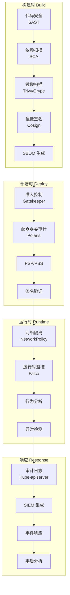
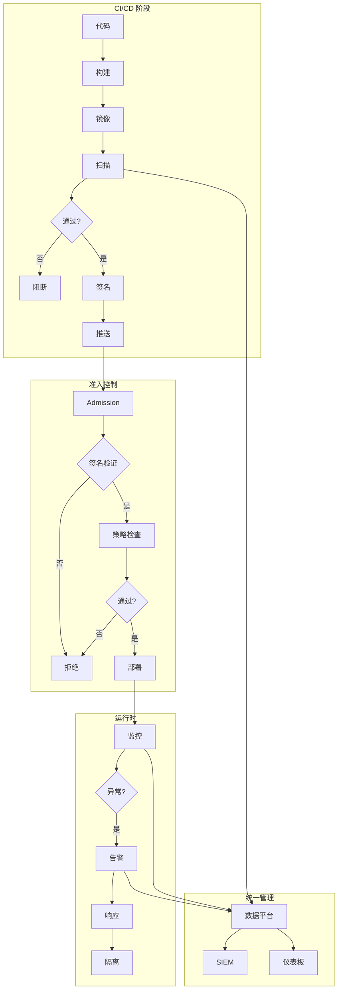
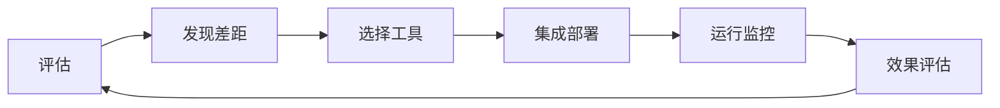

某公司安全团队在过去的两年里，零零散散地部署了十几种安全工具：镜像扫描工具、运行时监控工具、配置审计工具、合规检查工具……

但安全事件仍然频繁发生。调查发现：工具之间没有集成，告警分布在不同系统中，安全状态没有统一视图。

**这就是「工具很多，安全很差」的典型症状**。

**云原生安全不是堆砌工具，而是建立一套完整的安全工具链**——工具之间相互协作，数据统一管理，流程自动化执行。

## 云原生安全工具链全景图

### 按生命周期阶段分类



### 按功能分类

| 功能域 | 主要工具 | 说明 |
| --- | --- | --- |
| **容器安全** | Trivy、Grype、Clair、Anchore | 镜像漏洞扫描 |
| **容器签名** | Cosign、Notary、Sigstore | 镜像签名与验证 |
| **运行时安全** | Falco、Sysdig、Tetragon | 行为监控与检测 |
| **策略引擎** | OPA Gatekeeper、Kyverno | 策略即代码 |
| **合规检查** | kube-bench、Polaris | CIS 合规检查 |
| **渗透测试** | kube-hunter | 攻击面评估 |
| **网络策略** | Calico、Cilium | 网络隔离 |
| **服务网格** | Istio、Linkerd | mTLS 与授权 |
| **密钥管理** | Vault、ESO | Secret 管理 |
| **供应链安全** | Sigstore、SBOM 工具 | 签名与透明 |

## 建设阶段

### 第一阶段：基础安全（0-3 个月）

**目标**：建立基础安全防护，快速提升安全基线。

**核心工具**：

- 镜像扫描（Trivy/Grype）
- 基础配置审计（Polaris）
- PSP/PSS 配置

**优先级**：

1. 集成镜像扫描到 CI/CD 流水线
2. 启用 PSP/PSS 或 PSS
3. 禁止特权容器、HostPath

### 第二阶段：深度防御（3-6 个月）

**目标**：建立多层防护，引入运行时安全。

**核心工具**：

- 运行时监控（Falco）
- 网络策略（Calico/Cilium）
- OPA Gatekeeper
- 审计日志

**优先级**：

1. 部署 Falco 监控
2. 配置 NetworkPolicy
3. 启用 API Server 审计日志
4. 部署 OPA Gatekeeper 策略

### 第三阶段：高级安全（6-12 个月）

**目标**：实现供应链安全和高级防护。

**核心工具**：

- 镜像签名（Cosign）
- SBOM 工具
- 服务网格（Istio/Linkerd）
- CSPM/CWPP

**优先级**：

1. 实施镜像签名
2. 生成和验证 SBOM
3. 集成服务网格 mTLS
4. 部署 CWPP 平台

### 第四阶段：持续安全（12 个月+）

**目标**：实现安全自动化和持续合规。

**核心工具**：

- 完整的 CI/CD 集成
- SIEM 统一管理
- 安全数据湖
- 自动化响应

## 工具选型原则

### 功能维度

| 维度 | 评估要点 |
| --- | --- |
| Kubernetes 感知 | 是否理解 K8s 语义 |
| 部署方式 | Agent vs 无代理 |
| 性能开销 | 对工作负载的影响 |
| 集成能力 | 与其他工具的集成 |

### 安全维度

| 维度 | 评估要点 |
| --- | --- |
| 告警质量 | 误报率、告警上下文 |
| 检测能力 | 覆盖的攻击类型 |
| 响应能力 | 自动化响应的可能性 |

### 运维维度

| 维度 | 评估要点 |
| --- | --- |
| 部署复杂度 | 需要的配置和维护 |
| 升级兼容性 | 与 K8s 版本兼容性 |
| 社区活跃度 | 问题响应速度 |
| 文档质量 | 能否快速上手 |

### 成本维度

| 维度 | 评估要点 |
| --- | --- |
| 授权费用 | 商业工具的授权成本 |
| 运维成本 | 维护所需的人力 |
| 资源消耗 | 计算和存储资源 |

## 开源工具 vs 商业工具

### 开源工具优势

| 优势 | 说明 |
| --- | --- |
| 零授权费用 | 降低初始成本 |
| 社区支持 | 活跃社区解决问题 |
| 可定制 | 源码可修改 |
| 透明性 | 无隐藏功能 |

### 商业工具优势

| 优势 | 说明 |
| --- | --- |
| 完整功能 | 开箱即用的完整方案 |
| 支持服务 | 专业的技术支持 |
| 集成便利 | 与商业产品集成 |
| 合规认证 | 已通过各种认证 |

### 选型建议

**小型团队**（< 10 人）：

- 优先使用开源工具（Trivy、Falco、OPA Gatekeeper）
- 选择社区活跃、有文档的工具
- 接受一定的运维投入

**中型团队**（10-50 人）：

- 核心安全使用开源工具
- 监控和 SIEM 可考虑商业工具
- 注重集成和自动化能力

**大型企业**（> 50 人）：

- 综合使用开源和商业工具
- 考虑 CSPM/CWPP 平台
- 注重报告、合规、自动化能力

## 安全工具的集成架构

### 数据流设计



### 核心集成点

**CI/CD 集成**：

- 代码扫描 → 构建失败阻断
- 镜像扫描 → 镜像拉取前验证
- 策略检查 → 部署前验证

**Kubernetes 集成**：

- Admission Controller → 准入控制
- RBAC → 权限控制
- 审计日志 → 安全事件记录

**运维集成**：

- SIEM → 安全事件聚合
- ITSM → 工单系统
- 监控 → Grafana/Prometheus

## CI/CD 中的安全工具集成

### 完整流水线示例

```yaml title="GitHub Actions 安全流水线"
name: Secure CI/CD Pipeline

on:
  push:
    branches: [main]

jobs:
  security-scans:
    runs-on: ubuntu-latest
    steps:
      - uses: actions/checkout@v4
      
      # 1. 代码安全扫描
      - name: SAST Scan
        uses: secureCodeBot/secureCodeBot-action@main
      
      # 2. 依赖检查
      - name: Dependency Check
        uses: snyk/actions/node@main
        env:
          SNYK_TOKEN: ${{ secrets.SNYK_TOKEN }}
      
      # 3. 镜像构建
      - name: Build and push
        run: |
          docker build -t ${{ env.IMAGE_NAME }}:${{ github.sha }} .
          docker push ${{ env.IMAGE_NAME }}:${{ github.sha }}
      
      # 4. 镜像扫描
      - name: Trivy Scan
        uses: aquasecurity/trivy-action@master
        with:
          image-ref: '${{ env.IMAGE_NAME }}:${{ github.sha }}'
          format: 'sarif'
          severity: 'HIGH,CRITICAL'
          exit-code: '1'
      
      # 5. 镜像签名
      - name: Sign image
        uses: sigstore/cosign-installer@v3
        with:
          cosign-release: 'v2.2.0'
        run: |
          cosign sign --yes \
            --oidc-issuer https://oauth2.sigstore.dev/auth \
            ${{ env.IMAGE_NAME }}:${{ github.sha }}
      
      # 6. 生成 SBOM
      - name: Generate SBOM
        uses: anchore/sbom-action@v0
        with:
          image: ${{ env.IMAGE_NAME }}:${{ github.sha }}
          format: spdx-json
      
      # 7. 推送配置
      - name: Update Deployment
        run: |
          kubectl set image deployment/myapp \
            myapp=${{ env.IMAGE_NAME }}:${{ github.sha }}
          kubectl rollout status deployment/myapp

  compliance-check:
    needs: security-scans
    runs-on: ubuntu-latest
    steps:
      - name: Polaris Audit
        run: |
          polaris audit --audit-path ./deploy/ \
            --webhook-url https://opa-gatekeeper/validate
      
      - name: kube-bench
        uses: aquasec/kube-bench-action@v2
        with:
          targetVersion: "1.28"
```

### 部署流水线

```yaml title="GitOps 部署流水线"
# ArgoCD 应用程序配置
apiVersion: argoproj.io/v1alpha1
kind: Application
metadata:
  name: myapp
  namespace: argocd
spec:
  source:
    repoURL: https://github.com/example/myapp
    targetRevision: main
    path: k8s/production
    kustomize:
      images:
        - myregistry.com/myapp:v1.0.0
  
  destination:
    server: https://kubernetes.default.svc
    namespace: production
  
  syncPolicy:
    automated:
      prune: true
      selfHeal: true
    syncOptions:
      - CreateNamespace=true
```

## 安全数据的统一管理

### SIEM 集成

```yaml title="Elasticsearch + SIEM 配置"
apiVersion: beat.k8s.elastic.co/v1beta1
kind: Beat
metadata:
  name: security-beat
  namespace: security-monitoring
spec:
  type: filebeat
  elasticsearchRef:
    clusterID: elasticsearch
  config:
    filebeat.inputs:
      - type: container
        paths:
          - /var/log/falco*.log
        processors:
          - add_kubernetes_metadata: {}
      - type: container
        paths:
          - /var/log/kubernetes/audit.log
        processors:
          - add_kubernetes_metadata: {}
    output.elasticsearch:
      hosts: ["elasticsearch:9200"]
```

### 统一仪表板

```json title="Kibana 安全仪表板配置"
{
  "title": "Kubernetes Security Overview",
  "panels": [
    {
      "title": "Runtime Alerts",
      "type": "metric",
      "query": "falco-alerts",
      "timeRange": "last 24h"
    },
    {
      "title": "Vulnerabilities by Severity",
      "type": "pie",
      "query": "trivy-results"
    },
    {
      "title": "Top RBAC Violations",
      "type": "table",
      "query": "rbac-violations"
    },
    {
      "title": "Compliance Score Trend",
      "type": "line",
      "query": "kube-bench-score"
    }
  ]
}
```

## 安全工具链的评估框架

### 安全成熟度评估

| 成熟度等级 | 工具覆盖 | 自动化程度 |
| --- | --- | --- |
| **Level 1** | 基础扫描 | 手动 |
| **Level 2** | 多层扫描 | 部分自动化 |
| **Level 3** | 完整防护 | 高度自动化 |
| **Level 4** | 持续安全 | 完全自动化 |

### 评估维度

**覆盖完整性**：每个安全领域是否都有工具覆盖。

**集成深度**：工具之间是否能够协作和共享数据。

**自动化程度**：多少安全操作可以自动化执行。

**响应时效**：从发现到响应的平均时间。

**运维成本**：维护工具链所需的人力和资源。

### 持续改进



:::tip 工具链建设建议
不要试图一次性建立完整的工具链。从最影响业务的风险开始，逐步增加工具覆盖。每个新工具的引入都应该解决一个具体问题，而不是为了「更完整」。
:::

## 总结与延伸思考

云原生安全工具链的建设是一个持续演进的过程。没有完美的工具链，只有适合当前阶段的工具链。

关键成功因素：

1. **从业务风险出发**：工具解决的是实际安全风险，不是为了看起来更安全
2. **渐进式建设**：从基础开始，逐步深化
3. **注重集成**：工具之间的协作比单个工具的功能更重要
4. **持续优化**：定期评估工具效果，淘汰无效工具

最终，一个好的安全工具链应该让安全团队能够回答：

- 我们的安全状态如何？
- 有哪些已知的风险？
- 如何快速响应安全事件？

### 思考题

**问题 1**：为什么说「工具很多但没有集成」比「没有工具」更糟糕？
<details>
<summary>参考答案</summary>

原因有四：1）告警疲劳：大量分散的告警淹没真实威胁，分析师无法有效处理；2）盲区增加：工具之间没有关联分析，可能看不到跨工具的攻击模式；3）运维负担：多个独立工具需要独立维护，分散安全团队的注意力；4）响应延迟：需要登录多个系统收集信息，响应时间增加。真正的安全需要统一的数据视图和协调的响应机制。
</details>

**问题 2**：如何评估现有工具链的有效性？
<details>
<summary>参考答案</summary>

评估有效性的指标：1）MTTD（平均检测时间）：从威胁出现到被发现的时间；2）MTTR（平均响应时间）：从发现到修复的时间；3）误报率：有多少告警是误报；4）覆盖率：有多少安全领域被工具覆盖；5）自动化率：多少响应可以自动执行。建议定期（每季度）收集这些指标，与安全目标对比，识别改进空间。
</details>
