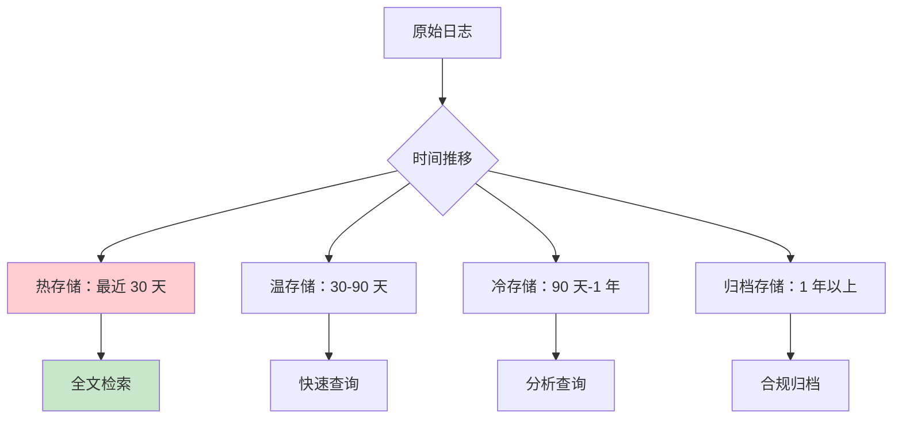
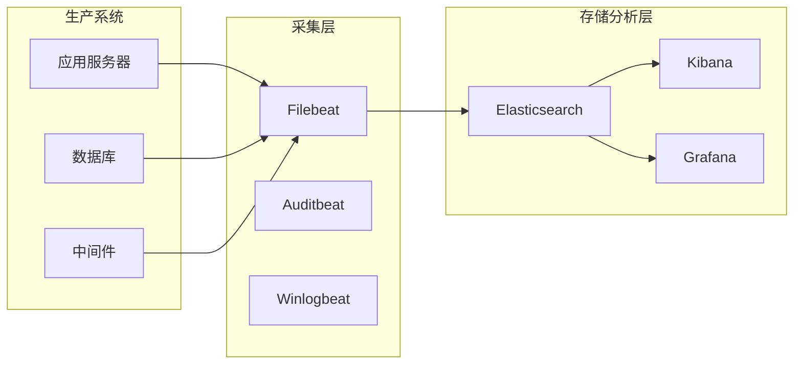

某公司发生数据泄露事故，调查人员需要重建事件时间线。他们向安全团队请求查看相关日志，却被告知日志只保留了 30 天——恰好在事故发生时间之前 35 天被删除了。

这不只是技术问题，更是合规问题。日志是安全的基石——没有足够的日志，安全事件的调查几乎不可能进行。日志保留时间短，意味着无法重建历史事件、无法满足合规要求、无法进行有效的安全分析。

## 合规审计日志的要求

### 为什么需要日志

日志是安全运营和合规的基础：

**事件调查**：还原安全事件的完整时间线，识别攻击路径。

**异常检测**：发现异常行为，如异常登录、异常数据访问。

**合规证明**：向审计师或监管机构证明控制措施的有效性。

**取证分析**：在法律诉讼或内部调查中提供证据。

### 主要法规对日志的要求

**GDPR**：

- 记录数据处理活动
- 保留处理依据的证据
- 记录同意行为和内容

**PCI DSS**：

- 要求 1：审计追踪跟上每个用户对 CHD 的访问
- 要求 10：自动化的审计轨迹，追踪所有个体用户对数据的访问

**HIPAA**：

- 记录 PHI 访问活动
- 保留 6 年的审计日志

**SOC 2**：

- CC6.3：逻辑和物理访问控制的审计轨迹
- CC7.2：系统运行异常的处理和调查

## 日志记录的完整性保护

### 完整性重要性

日志的价值取决于其完整性。如果日志可以被篡改、删除或选择性记录，就失去了作为证据的价值。

### 保护措施

**写入保护**：日志一旦写入，不可直接修改或删除。

**时间戳保护**：使用不可篡改的时间戳（如 NTP 服务器同步 + 数字签名）。

**存储分离**：日志存储与业务系统分离，防止攻击者同时清除日志。

**完整性校验**：定期计算并记录日志文件的哈希值。

```java title="AuditLogIntegrityService.java"
/**
 * 审计日志完整性保护服务
 */
@Service
public class AuditLogIntegrityService {
    
    private final AuditLogRepository auditLogRepository;
    private final IntegrityHashService hashService;
    private final TimestampAuthority timestampAuthority;
    
    /**
     * 写入审计日志
     * 确保日志不可篡改
     */
    public AuditLogEntry writeLog(AuditLogEntry entry) {
        // 生成不可伪造的时间戳
        TimeStampToken tst = timestampAuthority.generate(entry);
        
        // 设置时间戳
        entry.setTimestampToken(tst);
        
        // 生成内容哈希
        String contentHash = hashService.generateContentHash(entry);
        entry.setContentHash(contentHash);
        
        // 写入防篡改存储
        auditLogRepository.append(entry);
        
        return entry;
    }
    
    /**
     * 验证日志完整性
     */
    public IntegrityVerificationResult verify(String logFileId) {
        LogFile file = logFileRepository.findById(logFileId);
        
        // 验证时间戳链
        boolean timestampValid = timestampAuthority.verifyChain(file);
        
        // 验证内容哈希
        boolean hashValid = verifyContentHashes(file);
        
        return new IntegrityVerificationResult(timestampValid, hashValid);
    }
}
```

### 技术实现

**WORM 存储**：Write Once, Read Many，一次写入后不可修改的存储。

**追加写入**：日志只追加，不覆盖或修改。

**数��签名**：对日志内容或日志链进行数字签名。

**区块链存证**：将日志哈希写入区块链，实现不可篡改。

## 日志保留策略

### 保留期限确定

日志保留期限需要平衡多个因素：

**法规要求**：法规可能规定最短保留期限。

**业务需求**：调查和审计需要多长时间的历史日志。

**存储成本**：长期存储的成本是否可接受。

**隐私考量**：日志中可能包含个人数据，需要考虑留存期的隐私保护。

### 常见保留期限

| 日志类型 | 通常保留期 | 说明 |
|----------|------------|------|
| 安全日志 | 1-3 年 | 入侵追溯需要 |
| 审计日志 | 1-5 年 | 合规要求 |
| 访问日志 | 1-2 年 | 分析需要 |
| 应用日志 | 30-90 天 | 运维需要 |
| 错误日志 | 7-30 天 | 调试需要 |

### 分层保留策略



## 日志的访问控制

### 原则

日志中的信息可能包含敏感数据，需要进行访问控制：

**最小权限**：只有必要人员可以访问日志。

**职责分离**：日志管理员与业务管理员分离。

**审计追踪**：所有日志访问行为都应当被记录。

### 实现方式

```java title="AuditLogAccessControl.java"
/**
 * 审计日志访问控制
 */
@Service
public class AuditLogAccessControl {
    
    private final AccessControlService accessControl;
    private final AuditLogService auditLogService;
    
    /**
     * 检查用户是否有权访问特定日志
     */
    public AccessCheckResult checkAccess(Long userId, LogQuery query) {
        // 检查用户角色
        UserRole role = userService.getRole(userId);
        
        // 安全管理员可以访问安全日志
        if (role == SECURITY_ADMIN && query.getLogType() == LogType.SECURITY) {
            return AccessCheckResult.granted();
        }
        
        // 合规官可以访问审计日志
        if (role == COMPLIANCE_OFFICER && query.getLogType() == LogType.AUDIT) {
            return AccessCheckResult.granted();
        }
        
        // 普通用户只能访问自己的日志
        if (role == REGULAR_USER) {
            query.filterByUserId(userId);
            return AccessCheckResult.granted();
        }
        
        return AccessCheckResult.denied("无权限访问该日志类型");
    }
    
    /**
     * 记录所有日志访问行为
     */
    @Around("execution(* AuditLogService.retrieve(..))")
    public Object logAccess(ProceedingJoinPoint joinPoint) throws Throwable {
        Long userId = getCurrentUserId();
        LogQuery query = extractQuery(joinPoint.getArgs());
        
        // 检查访问权限
        AccessCheckResult check = checkAccess(userId, query);
        if (!check.isGranted()) {
            // 记录未授权访问尝试
            securityAlertService.alert("未授权日志访问尝试", userId, query);
            throw new AccessDeniedException(check.getReason());
        }
        
        Object result = joinPoint.proceed();
        
        // 记录成功的访问
        auditLogService.recordAccess(userId, query, result);
        
        return result;
    }
}
```

## 敏感信息的日志脱敏

### 脱敏原则

日志中可能包含敏感信息，需要进行脱敏处理：

**敏感数据脱敏**：密码、令牌、完整卡号等敏感信息必须脱敏。

**个人数据脱敏**：日志中的个人标识符可能需要脱敏或假名化。

**业务数据脱敏**：业务敏感信息可能需要脱敏。

### 脱敏实现

```java title="LogMaskingService.java"
/**
 * 日志脱敏服务
 */
@Service
public class LogMaskingService {
    
    private final Map<Class<?>, List<FieldMaskingRule>> maskingRules;
    
    /**
     * 脱敏日志内容
     */
    public String maskSensitiveData(String logContent, LogContext context) {
        String masked = logContent;
        
        // 脱敏密码
        masked = maskPattern(masked, Pattern.compile("password[=:]\\S+"), "password=***");
        
        // 脱敏令牌
        masked = maskPattern(masked, Pattern.compile("token[=:]\\S+"), "token=***");
        
        // 脱敏信用卡号
        masked = maskPattern(masked, Pattern.compile("\\d{13,19}"), "****-****-****");
        
        // 脱敏身份证号
        masked = maskPattern(masked, Pattern.compile("\\d{15}|\\d{17}[\\dXx]"), "**************");
        
        // 脱敏手机号
        masked = maskPattern(masked, Pattern.compile("1[3-9]\\d{9}"), "138****5678");
        
        return masked;
    }
}
```

## 日志的集中存储与分析

### 集中化的价值

集中日志存储带来多个优势：

**统一视图**：跨系统、跨地域的日志统一查看。

**关联分析**：关联不同系统的日志进行联合分析。

**集中审计**：统一的安全审计和合规检查。

**快速检索**：快速检索历史日志。

### 技术实现



### 日志分析用例

**安全事件检测**：

- 异常登录模式
- 权限提升尝试
- 数据批量导出

**性能分析**：

- 慢查询识别
- 错误率统计
- 容量趋势

**业务分析**：

- 用户行为分析
- 功能使用统计
- 业务指标监控

## SIEM 集成

### SIEM 的价值

SIEM（安全信息和事件管理）系统提供：

**实时监控**：实时收集和分析安全事件。

**告警**：基于规则或机器学习发现异常行为。

**关联分析**：关联多个来源的事件进行深入分析。

**合规报告**：生成满足合规要求的审计报告。

### 集成架构

```java title="SIEMIntegrationService.java"
/**
 * SIEM 集成服务
 */
@Service
public class SIEMIntegrationService {
    
    private final SyslogClient syslogClient;
    private final CEFFormatter cefFormatter;
    
    /**
     * 发送安全事件到 SIEM
     */
    public void sendToSIEM(SecurityEvent event) {
        // 格式化为 CEF 格式
        CEFEvent cefEvent = cefFormatter.format(event);
        
        // 通过 Syslog 发送
        syslogClient.send(cefEvent);
    }
    
    /**
     * 配置合规相关的告警规则
     */
    public void configureComplianceAlerts() {
        // 合规告警规则
        alertRuleService.createRule(
            AlertRule.builder()
                .name("敏感数据访问")
                .condition("log.eventType == 'DATA_ACCESS' && log.dataCategory IN ['PII', 'FINANCIAL']")
                .severity(AlertSeverity.HIGH)
                .action(AlertAction.NOTIFY_COMPLIANCE)
                .build()
        );
        
        alertRuleService.createRule(
            AlertRule.builder()
                .name("日志删除尝试")
                .condition("log.eventType == 'LOG_DELETION'")
                .severity(AlertSeverity.CRITICAL)
                .action(AlertAction.NOTIFY_SECURITY)
                .build()
        );
    }
}
```

### 常见 SIEM 系统

**开源方案**：Elastic SIEM、Wazuh、Security Onion。

**商业方案**：Splunk、IBM QRadar、Microsoft Sentinel、Exabeam。

## 日志审计的流程

### 日志审查流程

**定期审查**：建立定期日志审查机制。

**异常调查**：发现异常后启动调查。

**证据保全**：调查过程中的日志需要保全。

### 合规报告

```java title="ComplianceAuditReportGenerator.java"
//**
 * 合规审计报告生成器
 */
@Service
public class ComplianceAuditReportGenerator {
    
    private final AuditLogRepository auditLogRepository;
    private final ComplianceReportTemplate template;
    
    /**
     * 生成合规审计报告
     */
    public ComplianceAuditReport generateReport(AuditPeriod period, 
                                                String standard) {
        List<AuditLogEntry> logs = auditLogRepository.findByPeriod(period);
        
        return ComplianceAuditReport.builder()
            // 合规控制点覆盖情况
            .controlCoverage(analyzeControlCoverage(logs, standard))
            // 异常事件统计
            .incidentStatistics(analyzeIncidents(logs))
            // 用户访问统计
            .accessStatistics(analyzeAccess(logs))
            // 数据处理活动统计
            .processingStatistics(analyzeProcessing(logs))
            // 发现的问题
            .findings(identifyFindings(logs))
            // 建议
            .recommendations(generateRecommendations(logs))
            .build();
    }
}
```

## 思考题

**问题 1**：某公司的日志系统最近经常出现性能问题，日志量从每天 1GB 增长到每天 10GB。管理层考虑将日志保留期从 1 年缩短到 30 天以减少存储。请分析这个决定的风险。

<details>
<summary>参考答案</summary>

这个决定的风险包括：

**安全风险**：30 天的保留期可能无法覆盖历史安全事件。APT 攻击通常潜伏时间长（数月甚至数年），短期日志无法发现历史攻击痕迹。

**合规风险**：如果公司受 PCI DSS、HIPAA 等法规约束，这些法规通常要求特定的日志保留期限。缩短保留期可能导致不合规。

**调查风险**：如果 30 天前发生了数据泄露事件，无法重建事件时间线进行完整调查。

**建议**：评估哪些日志是「必须保留」的（如安全日志、审计日志），哪些可以缩短保留期（如应用日志）。采用分层存储策略，核心日志保留在冷存储，成本较低的长期保留。

</details>

**问题 2**：如何设计一个既满足合规要求、又保护日志本身安全的访问控制机制？

<details>
<summary>参考答案</summary>

建议的访问控制设计：

**角色分级**：

- 安全运营团队：只能访问安全日志，且访问行为被审计
- 合规团队：只能访问审计日志，用于合规报告
- 系统管理员：只能访问与自己系统相关的日志
- 审计管理员：可以访问所有日志，但所有访问都被详细记录

**技术实现**：

- 基于角色的访问控制（RBAC）实施权限管理
- 日志访问需要多因素认证
- 所有日志访问（成功和失败）都被记录
- 日志访问记录本身被保护，防止篡改
- 定期审查日志访问日志，识别异常

**补偿控制**：

- 职责分离：日志管理员不能同时是业务管理员
- 告警机制：异常日志访问模式触发告警
- 定期审计：定期审查权限分配和访问模式
</details>
