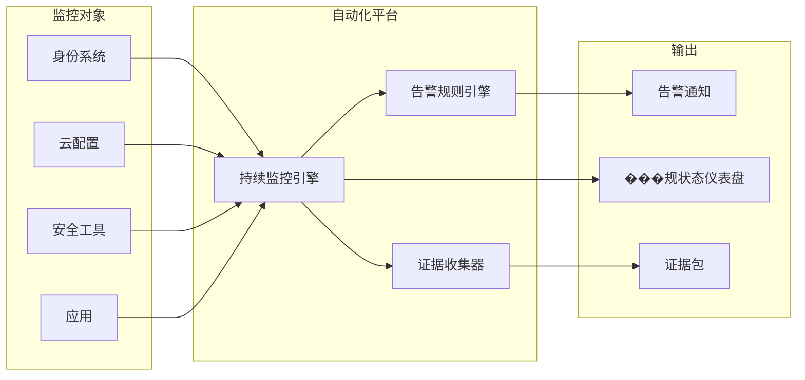
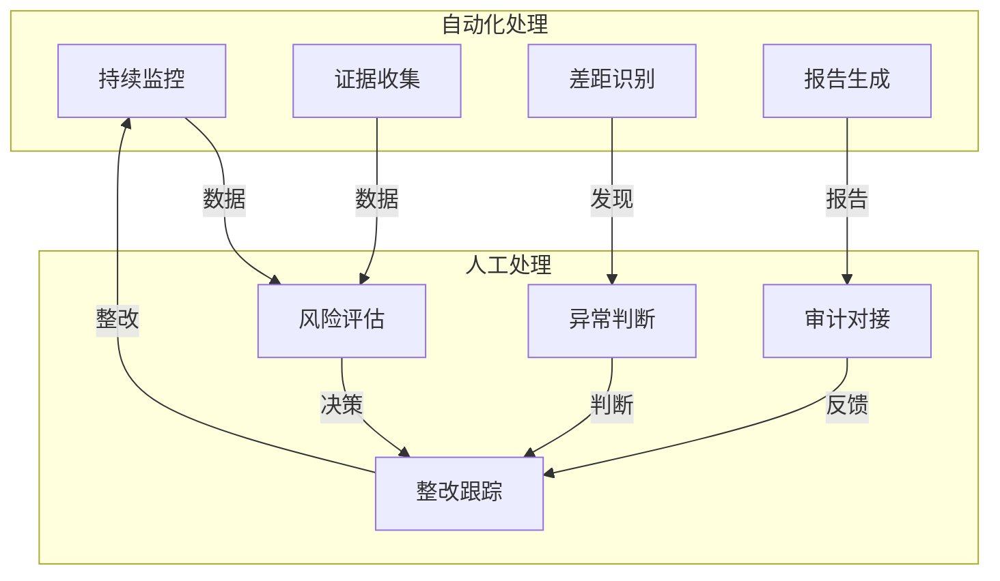

某公司合规团队每月需要投入两周时间手动收集合规证据——从各个系统截图、导出日志、汇总表格、撰写报告。团队成员疲于奔命，却仍经常因遗漏而出错。这不是个例，而是很多企业合规团队的真实写照。

合规自动化正在改变这一现状。通过将证据收集、差距分析、报告生成等重复性工作自动化，企业可以将合规团队从繁琐的事务中解放出来，专注于真正的风险管理。

## 合规自动化的价值

### 传统合规的痛点

**手动证据收集**：从数十个系统手动收集证据，耗时耗力。

**分散的信息**：合规信息分散在多个系统和工具中，难以统一管理。

**持续的监控缺失**：一年一次或两次的合规检查，无法及时发现风险。

**复杂的报告**：不同法规要求不同格式的报告，编写工作量大。

### 合规自动化的价值

**效率提升**：自动化证据收集可将合规准备时间缩短 70% 以上。

**实时可见性**：持续监控替代周期性检查，及时发现风险。

**一致性**：标准化流程确保合规实践的一致性。

**可追溯性**：完整的证据链支持审计和追溯。

**成本节约**：减少人工投入，降低合规成本。

### 投资回报

合规自动化的投资回报体现在：

- 减少人工工作量（人力成本节约）
- 减少审计费用（自动化报告降低审计复杂度）
- 减少罚款（及时发现和修复问题）
- 业务加速（更快通过客户安全评估）

## 主流合规自动化平台对比

### 市场概览

合规自动化市场（GRC Automation）快速发展，主要玩家包括：

**Drata**：专注于 SOC 2、ISO 27001、GDPR 等认证。

**Vanta**：专注于安全态势和合规认证。

**Spr盛（Secureframe）**：提供广泛的合规自动化。

**Sherpath**：专注于 IT 和安全合规。

### 功能对比

| 功能 | Drata | Vanta | Spr盛 | Sherpath |
|------|-------|-------|--------|---------|
| SOC 2 | 支持 | 支持 | 支持 | 支持 |
| ISO 27001 | 支持 | 部分 | 支持 | 支持 |
| HIPAA | 支持 | 支持 | 支持 | 支持 |
| PCI DSS | 支持 | 部分 | 支持 | 支持 |
| GDPR | 支持 | 支持 | 支持 | 支持 |
| 等保 | 不支持 | 不支持 | 不支持 | 不支持 |
| 持续监控 | 支持 | 支持 | 支持 | 支持 |
| 证据自动收集 | 支持 | 支持 | 支持 | 支持 |
| 集成数量 | 100+ | 100+ | 100+ | 50+ |
| 价格层级 | 中高 | 中 | 高 | 中 |

### 选型要点

**法规覆盖**：选择支持你需要满足的法规的平台。

**集成能力**：检查与现有工具的集成情况。

**易用性**：界面是否友好，学习曲线如何。

**自动化深度**：证据收集的自动化程度。

**支持服务**：厂商的支持能力。

## 合规自动化的核心功能

### 持续监控

合规自动化平台持续监控控制措施的有效性：

**身份和访问监控**：监控用户账户、权限变更、多因素认证。

**安全配置监控**：监控防火墙配置、加密设置、访问控制。

**系统状态监控**：监控系统可用性、性能、安全事件。

### 证据收集

自动化平台自动从集成系统收集合规证据：

**配置证据**：直接从云平台、安全工具收集配置截图。

**日志证据**：从 SIEM、日志系统收集相关日志。

**测试证据**：自动化测试结果的自动记录。

**政策证据**：政策文档的自动关联。

### 差距分析

平台自动对比控制状态与合规要求：

**控制映射**：将集成的控制映射到具体合规要求。

**状态评估**：评估每个控制点的当前状态。

**差距识别**：自动识别与要求的差距。

**风险评分**：基于差距评估整体风险。

### 风险评估

平台提供基于数据驱动的风险评估：

**风险评分模型**：基于控制状态、配置、历史事件的风险评分。

**风险趋势**：跟踪风险随时间的趋势。

**风险优先级**：帮助识别优先处理的高风险项。

### 报告生成

自动化生成满足不同需求的报告：

**合规状态报告**：展示当前合规状态。

**审计证据包**：满足审计要求的证据集合。

**管理层报告**：供管理层查看的高层次报告。

**自定义报告**：根据需求自定义的报告格式。

## 集成已有的安全工具

### 集成架构

合规自动化平台通过集成与现有工具协同工作：

**API 集成**：通过系统 API 直接获取数据。

**日志集成**：从 SIEM、日志系统导入日志数据。

**身份集成**：与身份提供商集成获取用户和权限信息。

**云集成**：与云平台集成获取配置信息。

### 常见集成类型

**云平台**：AWS、Azure、GCP。

**身份提供商**：Okta、Azure AD、OneLogin。

**安全工具**：CrowdStrike、SentinelOne、Datadog。

**代码管理**：GitHub、GitLab、Bitbucket。

**协作工具**：Slack、Teams、Jira。

### 集成实施步骤

**第一步：清单梳理**。列出所有需要集成的系统。

**第二步：优先级排序**。按重要性和难度排序集成。

**第三步：集成配置**。配置每个集成的连接和同步。

**第四步：验证数据**。验证从集成系统获取的数据。

**第五步：持续维护**。监控集成健康状态。

## 合规自动化的局限性

### 技术局限

**集成覆盖有限**：并非所有系统都有集成支持。

**配置证据局限**：部分控制只能通过截图证明，自动化程度有限。

**上下文理解不足**：平台可能无法理解复杂的业务上下文。

**新要求响应**：对新法规的响应可能有延迟。

### 流程局限

**文化依赖**：自动化需要标准化的流程支撑。

**人员依赖**：仍需要人员理解和解释合规要求。

**判断力局限**：部分决策需要人工判断。

### 风险

**过度依赖**：认为买了工具就合规了。

**忽视人工控制**：忽视非自动化的控制要求。

**集成复杂性**：大量集成可能带来管理复杂度。

## 合规自动化的选型建议

### 选型流程

**第一步：需求梳理**。明确需要满足的法规和认证。

**第二步：市场调研**。了解市场上的主要玩家和功能。

**第三步：PoC（概念验证）**。选取 2-3 个平台进行 PoC 测试。

**第四步：综合评估**。评估功能、易用性、价格、支持。

**第五步：决策和实施**。选择平台并实施。

### 评估维度

**功能完整性**：是否支持所有需要的合规要求。

**集成能力**：与现有系统的集成难度和覆盖度。

**易用性**：平台的学习曲线和用户友好度。

**可扩展性**：能否支持未来的合规需求扩展。

**安全与合规**：平台本身的安全和隐私保护能力。

**成本**：平台成本和实施成本。

**支持服务**：厂商的技术支持和服务能力。

### 价格考虑

价格通常基于：

**用户数量**：按管理员或终端用户数量收费。

**集成数量**：按集成系统数量收费。

**认证数量**：按需要支持的认证数量收费。

**报告数量**：按生成的报告数量收费。

中型企业的年度成本通常在 2-10 万美元。

## 人工审核的必要性

### 人工的价值

自动化无法替代人的判断：

**上下文理解**：理解业务场景和风险上下文。

**复杂决策**：处理需要综合判断的复杂情况。

**异常处理**：处理自动化无法处理的异常情况。

**关系管理**：与审计师、客户的关系维护。

### 人机协作模式

最佳实践是人机协作：

**自动化处理**：证据收集、差距识别、报告生成。

**人工处理**：风险评估、异常判断、沟通协调。

**共同决策**：重大风险和高优先级问题的决策。

### 团队能力建设

引入自动化工具后，团队需要：

**工具使用能力**：熟练使用合规自动化平台。

**数据分析能力**：分析和解释自动化生成的数据。

**合规理解能力**：深入理解合规要求的内涵。

**风险管理能力**：基于数据做出风险管理决策。

## 思考题

**问题 1**：某中型 SaaS 公司计划引入合规自动化平台，公司规模 100 人，正在申请 SOC 2 Type II 认证。请问应该如何选型和实施？

参考答案

建议的选型和实施步骤：

**需求梳理**：

- SOC 2 Type II 是核心需求
- 可能需要 HIPAA（如果有医疗客户）
- 团队规模较小，没有专职合规人员

**选型优先级**：

- 选择 SOC 2 支持完善的平台
- 选择易用性高的平台，降低学习成本
- 选择自动化程度高的平台，减少人工投入

**PoC 测试**：

- 选取 Drata 和 Vanta 进行 PoC
- 评估 SOC 2 控制覆盖度
- 评估与现有工具的集成情况
- 评估报告生成质量

**实施步骤**：

- 第一阶段：配置核心集成（云平台、身份提供商、代码管理）
- 第二阶段：配置 SOC 2 控制映射
- 第三阶段：运行并验证控制状态
- 第四阶段：准备首次审计

**预期效果**：自动化后，SOC 2 认证准备时间可从 6 个月缩短到 2-3 个月。

**问题 2**：合规自动化平台本身是否需要安全认证？它收集了那么多敏感信息，如何保证平台本身的安全？

参考答案

合规自动化平台本身也需要关注安全：

**平台自身认证**：选择平台时，关注平台自身是否通过 SOC 2、ISO 27001 认证。平台收集了大量敏感信息，其安全性应当得到验证。

**平台安全评估**：在选择平台前，进行安全评估：查看平台的第三方安全审计报告；询问平台的安全实践；检查平台的数据加密、访问控制、日志记录。

**数据保护**：确保平台符合数据保护法规的要求；检查数据存储位置是否符合法规要求；确认数据跨境传输是否有适当机制。

**合同条款**：在采购合同中明确安全要求；要求数据处理协议（DPA）；约定安全事件通知和责任。

**持续监控**：定期评估平台的安全性；关注平台的安全公告和更新。

