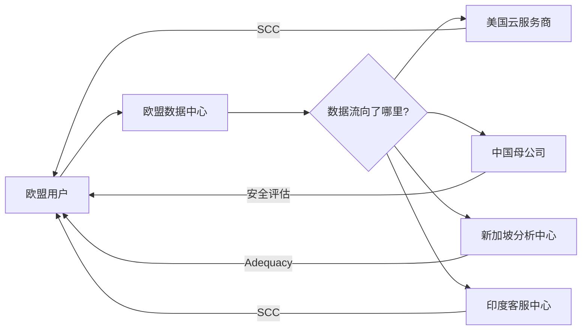
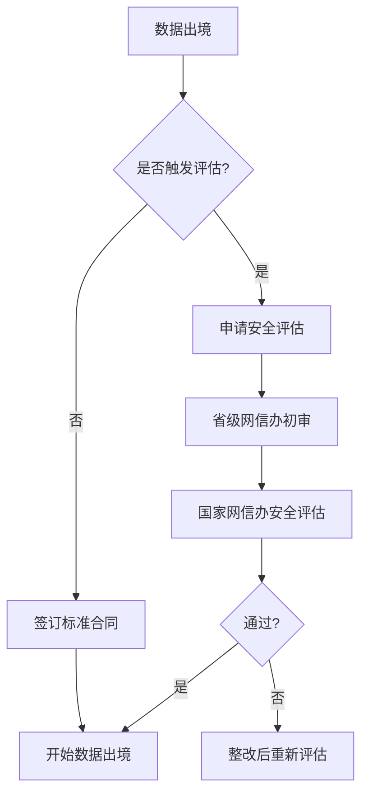

某中国互联网公司向美国企业提供云服务，服务商将服务器部署在新加坡。一天，公司收到欧盟用户的投诉：他们的个人数据被传输到了欧盟以外的地区，违反了 GDPR。

这不是一个简单的问题。数据跨境传输涉及多个司法管辖区的法规——欧盟用户的个人数据，受到 GDPR 约束；中国公司的数据，受到中国数据出境法规约束；流向新加坡的数据，可能受到新加坡 PDPA 约束。跨境数据传输的合规，比任何单一司法管辖区的合规都更复杂。

## 跨境数据传输的合规挑战

### 多法域叠加

跨境数据传输可能同时涉及多个法规体系：

**数据来源地法规**：GDPR 规定向欧盟外传输需要特定机制；中国《个人信息保护法》规定向境外传输需要通过安全评估或标准合同。

**数据目的地法规**：目的地的数据保护水平是否充分，当地法律是否会影响数���保护。

**企业所在地法规**：企业可能需要同时遵守多个司法管辖区的要求。

### 传输链路复杂性



### 主要挑战

**机制选择**：选择哪种传输机制？Adequacy、SCC 还是 BCR？

**补充措施**：即使选择了传输机制，是否还需要补充措施？

**持续监控**：目的地的法律环境变化是否会影响传输有效性？

**文档要求**：如何向监管机构证明传输的合法性？

## 主要司法管辖区的数据本地化要求

### 中国

中国对数据出境有严格要求：

**数据分类**：

- 一般个人信息：可通过标准合同或认证机制出境
- 重要数据：需通过数据出境安全评估
- 核心数据：原则上不准出境

**安全评估触发条件**：

- 向境外提供重要数据
- 关键信息基础设施运营者向境外提供个人信息
- 累计向境外提供 100 万人个人信息
- 自上年 1 月 1 日起累计向境外提供 10 万人个人信息或 1 万人敏感个人信息

**评估程序**：



### 欧盟（GDPR）

GDPR 对向欧盟外第三国传输数据设置了严格限制：

**禁止原则**：向未获充分性认定的国家传输数据，原则上是禁止的。

**例外情况**：存在特定条件时可以使用 SCC、BCR 等机制。

**Schrems II 判决**：2020 年欧盟法院判决 Privacy Shield 无效，要求在使用 SCC 时进行「传输影响评估」。

### 美国

美国联邦层面无统一的数据本地化要求，但部分州有特殊规定：

**加州 CCPA**：要求企业披露个人信息销售是否跨境，无强制本地化。

**其他州**：部分敏感数据（如医疗数据）有本地化要求。

### 俄罗斯

俄罗斯《个人数据法》要求将俄罗斯公民的个人数据存储在俄罗斯境内服务器。需要将数据副本存储在俄罗斯本地，或使用俄罗斯本地服务提供商。

## ��境数据传输的合法性路径

### 充分性认定（Adequacy Decision）

充分性认定是向特定国家或地区自由传输数据的基础。

**已获认定的国家/地区**：

- 加拿大（商业组织部分）
- 阿根廷
- 日本
- 英国
- 韩国
- 美国（局限于特定框架）

**认定标准**：目标国家具有「充分」的数据保护水平。

### 标准合同条款（SCC）

在没有充分性认定的国家，可以使用欧委会批准的标准合同条款。

**类型**：

- 控制器与控制器之间的 SCC（2021 版）
- 控制器与处理器之间的 SCC（2021 版）

**实施要求**：数据发送方和数据接收方均需签署，并承诺遵守条款。

**Schrems II 后的要求**：

- 仅签署 SCC 不够，需要评估目的地法律环境
- 需要实施「补充措施」（如加密）以确保持续保护
- 需要进行「传输影响评估」并记录

### 有约束力的公司规则（BCR）

对于跨国公司集团，可以使用有约束力的公司规则进行集团内部传输。

**要求**：

- 适用于欧盟内的跨国公司集团
- 需要向主管监管机构申请批准
- 审批过程通常需要 6-12 个月

**优势**：一次审批，集团内所有实体均可使用。

### 认证机制

通过特定的数据保护认证也是有效的跨境传输机制。

**实施**：使用符合要求的认证机构认证。

**范围**：认证范围需覆盖跨境传输活动。

## 中国数据出境评估办法

### 适用范围

以下情形需通过数据出境安全评估：

**安全评估**：

- 重要数据的出境
- 关键信息基础设施运营者向境外提供个人信息
- 处理 100 万人以上个人信息的数据处理者向境外提供个人信息
- 自上年 1 月 1 日起累计向境外提供 10 万人个人信息或 1 万人敏感个人信息

**标准合同**：其他个人信息出境情形，可签订标准合同。

### 评估材料

申请数据出境安全评估需提交：

- 数据出境安全评估申报书
- 数据处理者情况（组织架构、数据安全管理制度）
- 数据出境风险评估报告
- 数据处理协议（与境外接收方）
- 其他材料

### 风险评估内容

数据出境风险评估应包括：

- 数据出境的必要性
- 目的地的数据保护水平
- 数据量级和类型
- 境外接收方的情况
- 数据出境可能对国家安全、公共利益、个人权益的影响
- 风险缓解措施

## 跨境数据传输协议的设计

### 标准合同条款要素

跨境数据传输协议应包含：

**数据处理规范**：

- 明确的处理目的和范围
- 数据类型和数据主体
- 处理方式和保留期限

**数据接收方义务**：

- 遵守目的地法律
- 实施适当安全措施
- 配合审计和检查
- 违规通知义务

**补充措施**：

- 加密要求
- 访问控制要求
- 数据本地化要求

**持续监管**：

- 定期评估
- 变更通知义务
- 合同终止时的数据处置

### 协议模板示例

```java title="CrossBorderDataTransferAgreement.java"
/**
 * 跨境数据传输协议模板
 */
public class CrossBorderDataTransferAgreement {
    
    private String sender;           // 数据发送方
    private String receiver;          // 数据接收方
    private List<String> dataTypes;  // 数据类型
    private String transferPurpose;  // 传输目的
    private String legalBasis;       // 法律依据
    private List<SupplementaryMeasure> supplementaryMeasures;
    private Duration retentionPeriod;
    private DataDisposalMethod disposalMethod;
}

/**
 * 补充措施
 */
public class SupplementaryMeasure {
    private MeasureType type;  // 加密、假名化、分区存储
    private String description;
    private Date effectiveDate;
}
```

## 跨境数据传输的风险评估

### 评估框架

**目的国法律环境**：

- 目的国是否已获充分性认定
- 目的国政府是否有强制披露数据的权力
- 目的国法律是否与数据传输目的冲突

**接收方评估**：

- 接收方的规模和资源
- 接收方的数据保护实践
- 接收方是否通过认证

**数据本身评估**：

- 数据类型（一般个人信息、敏感数据）
- 数据量级
- 数据可识别性

### 缓解措施

**技术措施**：

- 加密传输和存储
- 假名化或去标识化
- 访问控制

**合同措施**：

- 明确的数据处理规范
- 严格的保密义务
- 违规责任

**组织措施**：

- 定期审计
- 员工培训
- 事件响应流程

## 思考题

**问题 1**：某中国 SaaS 公司向欧洲企业提供 CRM 服务，欧洲员工的个人数据需要传回中国进行处理。请问该公司如何满足 GDPR 的跨境传输要求？

<details>
<summary>参考答案</summary>

该公司需要满足 GDPR 的跨境传输要求，同时可能还需要满足中国数据出境法规。处理方案如下：

**GDPR 合规**：

1. 进行传输影响评估，评估中国法律环境对数据保护的影响。
2. 与中国母公司签订标准合同条款（SCC）。
3. 实施补充措施，如加密、假名化，确保传输后数据仍受保护。
4. 记录传输活动，准备合规证据。

**中国法规合规**：

1. 评估是否触发安全评估条件（通常不触发）。
2. 签订中国版标准合同并向省级网信办备案。
3. 进行数据出境风险自评估。

**技术实现**：

- 欧洲员工数据存储在欧盟区域数据中心
- 中国总部需要访问时，通过加密通道获取
- 中国境内处理个人信息的范围应最小化
</details>

**问题 2**：在跨境数据传输中，如何评估目的国政府强制披露数据的风险？

<details>
<summary>参考答案</summary>

评估目的国政府强制披露风险的方法：

**法律环境分析**：

- 研究目的国的相关法律，特别是涉及国家安全、税务、司法调查的法律
- 评估政府是否有权要求企业提供个人数据
- 了解当地执法实践和历史案例

**风险等级评估**：

- 高风险：目的国法律对外国企业数据获取限制极少（如美国爱国者法案适用场景）
- 中风险：目的国有相关法律，但执法有一定程序
- 低风险：目的国数据保护法律完善，政府获取数据需通过司法程序

**缓解措施**：

- 对高风险国家，实施更强的技术保护措施，如端到端加密，密钥不存储在目的国
- 数据分区存储，避免将所有敏感数据集中在一处
- 定期评估目的国法律环境变化

**持续监控**：

- 关注目的国法律变化
- 定期更新风险评估
- 准备在法律环境重大变化时调整传输安排
</details>
