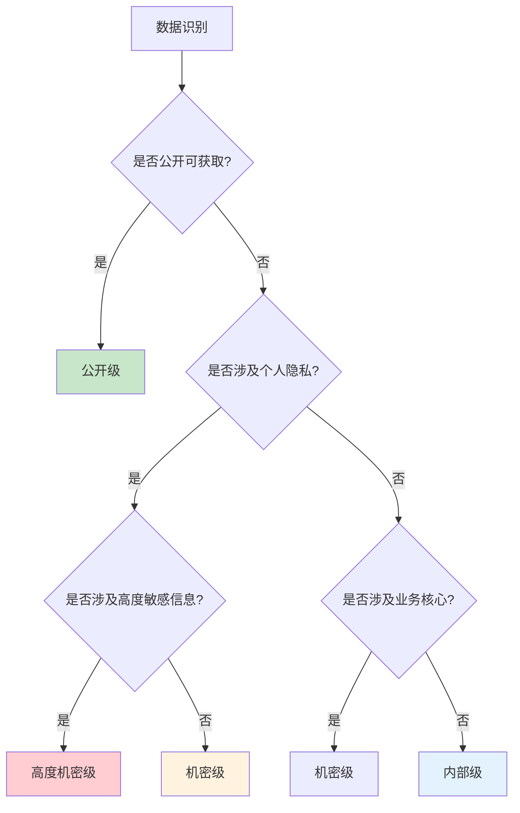

某公司发生数据泄露事件后，调查发现泄露的是一份财务报表——其中包含了大量客户个人信息。奇怪的是，这份报表被标记为「内部资料」，但访问控制却比处理客户个人数据的系统宽松得多。

问题出在哪？答案是数据分类缺失——该公司没有建立统一的数据分类体系，导致不同敏感度的数据被同样对待。高敏感数据没有得到应有的保护。

数据分类是信息安全的基石。不清楚数据有多敏感，就无法保护它。

## 数据分类的目的与价值

### 目的

数据分类（Data Classification）是将数据按照敏感程度和重要程度进行分级，为不同级别的数据制定相应的保护策略。

核心目的是实现「适度保护」——敏感度高的数据获得更强的保护，投入更多资源；敏感度低的数据采用相对简单的保护措施，避免过度保护造成的资源浪费。

### 价值

**精准保护**：不同级别的数据采用不同的保护强度，避免「一刀切」导致的过度或不足保护。

**资源优化**：将有限的资源和注意力集中在真正重要的数据上。

**合规支撑**：满足 GDPR、PCI DSS、等保等法规对数据保护的要求。

**风险评估**：帮助识别和评估数据相关的安全风险。

**事故响应**：泄露发生时，快速判断影响范围和响应优先级。

## 分类标准设计

### 通用分类级别

大多数组织采用四到五级分类标准：

| 级别 | 名称 | 定义 | 保护要求 |
|------|------|------|----------|
| 第一级 | 公开 | 可向公众公开，无泄露风险 | 最低保护 |
| 第二级 | 内部 | 仅限内部人员使用，泄露影响有限 | 基本保护 |
| 第三级 | 机密 | 敏感业务信息，泄露影响较大 | 中等保护 |
| 第四级 | 高度机密 | 核心机密，泄露严重影响 | 最高保护 |

### 分类维度

数据分类应考虑多个维度：

**敏感性**：数据泄露对个人、组织或第三方的影响程度。

**法规要求**：法规对特定数据类型（如个人数据、财务数据、医疗数据）的保护要求。

**业务价值**：数据对业务运营的重要程度。

**可替代性**：数据是否容易重新生成或获取。

### 分类判断矩阵



## 行业特定的分类标准

### 金融行业

金融行业的数据分类通常包括：

**客户金融数据**：账户信息、交易记录、信用记录 → 高度机密。

**个人身份信息**：身份证号、生物特征 → 高度机密。

**业务运营数据**：内部财务、交易策略 → 机密。

**公开信息**：公开市场数据 → 公开。

金融行业受 PCI DSS、反洗钱法规、隐私法规多重约束。

### 医疗健康行业

医疗行业的数据分类通常包括：

**受保护健康信息（PHI）**：诊断、治疗、基因信息 → 高度机密。

**个人身份信息**：患者姓名、联系方式 → 机密。

**医疗研究数据**：脱敏后的研究数据 → 内部或机密。

医疗行业受 HIPAA、GDPR（欧盟患者）约束。

### 政府与公共部门

政府数据分类通常采用更严格的体系：

**公开级**：政府公告、公共服务信息。

**内部级**：一般行政文档。

**秘密级**：涉及公共事务的敏感信息。

**机密级**：涉及国家安全的信息。

**绝密级**：最高级别的国家安全信息。

### 个人信息分类

根据 GDPR 和各国隐私法规，个人数据可分为：

**一般个人数据**：联系方式、购买记录 → 中等敏感。

**敏感个人数据**：健康、宗教、政治观点 → 高度敏感。

**特殊类别数据**（GDPR 范畴）：种族、基因、生物特征、性取向 → 最高保护。

## 数据分类的实施步骤

### 第一步：数据识别

识别组织拥有的所有数据资产：

**数据清单**：建立完整的数据资产清单，包括数据库、文件服务器、云存储等。

**数据流分析**：追踪数据的产生、存储、使用、共享、销毁全生命周期。

**数据负责人**：明确每类数据的业务负责人和数据管理员。

### 第二步：分类标准制定

制定适合组织的分类标准：

**定义各级别**：明确每个级别的定义、判断标准、保护要求。

**制定分类流程**：明确谁来分类、按什么流程分类、多长时间复核一次。

**培训相关人员**：确保数据负责人理解分类标准。

### 第三步：标记与标识

对数据进行分类标记：

**元数据标记**：在数据库字段、数据文件属性中添加分类标记。

**文件标记**：在文档中体现分类级别（如水印、页眉）。

**存储隔离**：不同级别的数据存储在不同区域/系统中。

### 第四步：策略制定

为每个级别制定保护策略：

**访问控制**：不同级别的访问授权流程。

**加密要求**：是否加密、加密强度。

**传输安全**：传输时的保护要求。

**留存期限**：保留多长时间。

**删除要求**：何时删除、如何验证删除。

### 第五步：持续维护

分类不是一次性工作：

**定期复核**：定期检查数据分类是否仍然合理。

**变更管理**：新数据类型及时分类。

**培训更新**：定期培训确保人员理解。

```java title="DataClassificationService.java"
/**
 * 数据分类服务示例
 * 根据数据特征自动推荐分类级别
 */
public class DataClassificationService {
    
    private final ClassificationRules rules;
    
    /**
     * 推荐数据分类级别
     */
    public ClassificationLevel recommendClassification(DataAsset data) {
        // 检查是否有法规要求
        if (rules.hasRegulatoryRequirement(data.getType())) {
            return rules.getRegulatoryLevel(data.getType());
        }
        
        // 检查是否有敏感特征
        if (containsPII(data)) {
            return ClassificationLevel.CONFIDENTIAL;
        }
        
        if (containsBusinessCritical(data)) {
            return ClassificationLevel.CONFIDENTIAL;
        }
        
        if (isInternal(data)) {
            return ClassificationLevel.INTERNAL;
        }
        
        return ClassificationLevel.PUBLIC;
    }
}
```

## 分类后的标签与标记

### 元数据标记

数据库字段应包含分类标记：

```sql
CREATE TABLE customer_data (
    id BIGINT PRIMARY KEY,
    name VARCHAR(100),           -- 分类: CONFIDENTIAL
    id_card VARCHAR(18),         -- 分类: HIGHLY_CONFIDENTIAL
    phone VARCHAR(11),           -- 分类: CONFIDENTIAL
    purchase_history JSON,       -- 分类: CONFIDENTIAL
    email VARCHAR(100),         -- 分类: INTERNAL
    last_login DATETIME,        -- 分类: INTERNAL
    classification VARCHAR(20)  -- 分类标记字段
);
```

### 文件标签

文档应包含分类标识：

**页眉/页脚**：在文档顶部或底部显示分类级别。

**水印**：在页面背景显示分类水印。

**文件名**：在文件名中包含分类标识（如 `Financial_Report_CONFIDENTIAL.pdf`）。

**邮件标记**：在邮件标题和正文开头标注分类级别。

### 视觉标识

使用统一的视觉标识：

- 公开级：无标识或绿色标识
- 内部级：蓝色标识
- 机密级：黄色标识
- 高度机密级：红色标识

## 分类与访问控制策略

### 基于分类的访问控制

数据分类后，应制定相应的访问控制策略：

| 级别 | 访问授权 | 多因素认证 | 加密 | 审计 |
|------|----------|-----------|------|------|
| 公开 | 无限制 | 否 | 否 | 否 |
| 内部 | 部门内默认 | 否 | 传输加密 | 基本 |
| 机密 | 申请审批 | 是 | 全量加密 | 详细 |
| 高度机密 | 最小授权 | 强认证 | 全量+高强度 | 全部 |

### 数据流控制

不同级别的数据应有不同的流转规则：

**公开数据**：可以自由共享和发布。

**内部数据**：仅限组织内部使用，禁止对外共享。

**机密数据**：需要审批流程，方可与特定第三方共享。

**高度机密数据**：严格限制流转，必要时需要加密后通过安全通道传输。

## 分类的持续维护

### 定期复核

数据分类应定期复核：

**年度复核**：每年对数据清单和分类标准进行完整复核。

**重大变更时复核**：系统上线、业务变更、法规变化时重新评估。

**持续监控**：监控数据访问模式，识别异常行为。

### 分类变更管理

数据分类变更需要：

**变更申请**：说明变更原因和新分类建议。

**影响评估**：评估变更对访问控制、数据流转的影响。

**审批**：由数据 owner 或安全委员会审批。

**执行**：更新分类标记和相应的访问控制策略。

### 培训与意识

确保人员理解数据分类：

**入职培训**：新员工入职时学习数据分类政策。

**定期培训**：每年至少一次数据分类培训。

**场景演练**：通过案例演练帮助人员理解具体应用。

## 数据地图（Data Map）

### 定义

数据地图（Data Map）是数据资产的可视化表示，展示数据的分类、存储位置、流转路径。

### 价值

**可见性**：了解组织拥有哪些数据资产。

**流转追踪**：追踪数据的产生、使用、共享、删除流程。

**影响分析**：变更或泄露发生时，快速评估影响范围。

**合规证明**：证明数据处理活动符合法规要求。

### 实现方式

**手动维护**：通过 Excel 或文档维护数据清单。

**工具支持**：使用数据治理工具（如 Collibra、Alation）自动化维护。

**数据库发现**：通过数据库扫描工具发现数据资产。

## 思考题

**问题 1**：某公司正在开发一个新系统，需要将客户数据进行分类后实现访问控制。请设计该系统的数据分类方案。

<details>
<summary>参考答案</summary>

建议采用以下分类方案：

**数据识别阶段**：识别系统涉及的客户数据字段——基本信息（姓名、联系方式）、身份信息（身份证号）、交易数据、行为数据。

**分类标准**：结合业务价值和法规要求——身份证号、银行卡号 → 高度机密；姓名+手机+地址组合可识别个人 → 机密；交易金额、购买记录 → 机密；行为数据（浏览、点击）→ 内部；匿名统计数据 → 公开。

**访问控制设计**：高度机密数据仅核心系统访问，需要审批 + 多因素认证；机密数据部门内默认访问，敏感操作需审批；内部数据全体员工可访问基本权限；公开数据无限制。

**实现要���**：在数据库 schema 中添加 classification 字段；通过 ORM 层自动注入访问���制；记录所有敏感数据访问日志；定期复核分类是否合理。
</details>

**问题 2**：数据分类后发现「高度机密」数据量太大，占总数据量的 40%，导致所有访问都需要严格控制，反而影响了业务效率。应该如何优化？

<details>
<summary>参考答案</summary>

这说明分类标准过于宽泛，需要优化：

**重新审视分类标准**：检查「高度机密」的定义是否过于宽泛。可能需要进一步细分——比如将「高度机密」拆分为「高度机密-法规要求」和「高度机密-业务核心」。

**按数据类型细分**：同一数据字段可能有不同敏感度。如电话号码用于营销时是内部，用于客服时就应该更机密。建议按字段+使用场景细分。

**实施子分类**：在「高度机密」下再设子级别，如「极高机密」「机密-高」，给予不同保护强度。

**聚焦核心数据**：通过风险评估识别真正需要最高保护的数据。不必对所有数据一视同仁，核心数据重点保护，一般数据适度保护。

**持续优化**：数据分类不是一成不变的，应该随着业务发展和风险评估持续优化。
</details>
