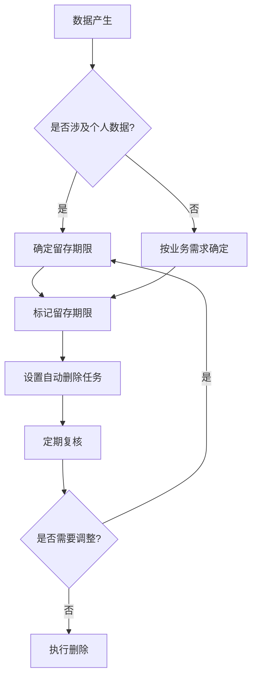

某电商公司在一场数据泄露诉讼中被要求证明用户数据的安全性。公司花了三周时间才找到早已「删除」的备份数据——因为备份被存放在多个位置，且从未建立统一的删除机制。

数据留存与删除不是「用完就删」那么简单。它涉及合规要求、业务需求、技术实现、备份策略等多个维度。建立系统化的留存与删除策略，是数据生命周期管理的重要组成部分。

## 数据留存的合规要求

### 为什么要留存

多数法规并不要求永久保留数据。相反，GDPR 的「存储限制」原则要求数据保留时间「仅限于实现处理目的所必需的时间」。

但某些场景确实要求一定期限的留存：财务记录通常需要保留 5-7 年；劳动合同相关数据需要保留至劳动关系结束后一定年限；医疗记录通常有法定留存期。

### 主要法规要求

**GDPR（通用数据保护条例）**：

- 「存储限制」原则：数据保留时间不超过必要期限
- 「删除权」：数据主体有权要求删除个人数据
- 无明确留存期限，由企业根据处理目的自行确定

**中国《个人信息保护法》**：

- 留存期限应在隐私声明中披露
- 超过留存期限后应当删除或匿名化处理

**PCI DSS**：

- 持卡人数据（CHD）不得留存超过业务需要
- 敏感验证数据（SAD）不得存储

**HIPAA**：

- PHI 通常需要保留 6 年（部分州要求更长）

## 不同数据类型的留存周期

### 财务数据

| 数据类型 | 通常留存期 | 说明 |
|----------|------------|------|
| 交易记录 | 5-7 年 | 满足税务和审计要求 |
| 发票 | 5-7 年 | 满足税务存档要求 |
| 银行对账单 | 5 年 | 满足财务审计要求 |
| 财务报表 | 永久或 7 年 | 取决于公司要求 |

### 人事数据

| 数据类型 | 通常留存期 | 说明 |
|----------|------------|------|
| 劳动合同 | 劳动关系结束后 2 年 | 劳动纠纷追溯期 |
| 工资记录 | 劳动关系结束后 5 年 | 税务和社保要求 |
| 培训记录 | 1-3 年 | 根据内部政策 |
| 绩效评估 | 1-2 年 | 根据内部政策 |

### 个人数据

| 数据类型 | 通常留存期 | 说明 |
|----------|------------|------|
| 账户数据 | 账户活跃期 + 1-3 年 | 便于争议处理 |
| 登录日志 | 6 个月-2 年 | 安全审计需要 |
| 行为数据 | 1-2 年 | 分析价值递减 |
| 个人信息 | 按处理目的确定 | 目的达成后删除 |

### 日志数据

| 日志类型 | 通常留存期 | 说明 |
|----------|------------|------|
| 安全日志 | 1-3 年 | 入侵追溯需要 |
| 审计日志 | 1-5 年 | 合规要求 |
| 应用日志 | 30-90 天 | 运维需要 |
| 错误日志 | 7-30 天 | 调试需要 |

## 数据留存策略的设计

### 策略框架



### 留存期限确定方法

**业务分析**：与业务部门沟通数据的使用场景和业务价值。

**法规要求**：识别适用于数据的法规留存要求。

**风险评估**：评估数据泄露风险和保留价值。

**成本考量**：评估存储成本和删除成本。

### 留存期限标记

数据应当标记��存期限：

```java title="DataRetentionAnnotation.java"
/**
 * 数据留存策略注解
 * 用于标记数据字段的留存要求
 */
@Retention(RetentionPolicy.RUNTIME)
public @interface DataRetention {
    /**
     * 留存期限，如 "P3Y" 表示 3 年
     */
    String retentionPeriod();
    
    /**
     * 留存开始时间类型
     */
    RetentionStartType startType() default RetentionStartType.CREATED_AT;
    
    /**
     * 到期后处理方式
     */
    DisposalAction disposalAction() default DisposalAction.DELETE;
}

/**
 * 留存开始时间类型
 */
public enum RetentionStartType {
    CREATED_AT,    // 数据创建时间
    UPDATED_AT,     // 最后更新时间
    ACCESSED_AT,    // 最后访问时间
    EXPIRED_AT      // 业务截止时间
}
```

## 自动归档与删除

### 归档策略

**冷热分离**：将历史数据迁移到低成本存储（归档存储）。

**分区策略**：按时间分区存储数据，便于清理。

**压缩归档**：对历史数据进行压缩，减少存储成本。

```java title="DataArchivalService.java"
/**
 * 数据归档服务
 * 将满足条件的数据迁移到归档存储
 */
@Service
public class DataArchivalService {
    
    private final DataRepository dataRepository;
    private final ArchivalStorage archivalStorage;
    
    /**
     * 归档超过一年未访问的数据
     */
    @Scheduled(cron = "0 2 0 * * ?")  // 每天凌晨 2 点
    public void archiveInactiveData() {
        LocalDateTime threshold = LocalDateTime.now().minusYears(1);
        
        // 查找待归档数据
        List<DataRecord> records = dataRepository.findInactiveBefore(threshold);
        
        for (DataRecord record : records) {
            // 加密后迁移到归档存储
            ArchivalData encrypted = encryptForArchival(record);
            archivalStorage.save(encrypted);
            
            // 删除主存储中的数据
            dataRepository.deleteById(record.getId());
            
            // 记录归档日志
            archivalLogService.logArchival(record.getId(), threshold);
        }
    }
}
```

### 自动删除策略

**定时任务**：通过定时任务定期清理过期数据。

**基于事件的删除**：触发特定事件（如账户注销）时启动删除流程。

**分层删除**：主数据先删除，归档数据在归档期到期后删除。

```java title="DataDeletionService.java"
/**
 * 数据删除服务
 * 处理 GDPR 删除权和留存期限到期的删除
 */
@Service
public class DataDeletionService {
    
    private final DataRepository dataRepository;
    private final AuditLogService auditLogService;
    
    /**
     * 处理用户删除请求
     * GDPR 删除权实现
     */
    public DeletionResult processUserDeletionRequest(Long userId, DeletionRequest request) {
        List`DataRecord` records = dataRepository.findByUserId(userId);
        
        DeletionResult result = new DeletionResult();
        
        for (DataRecord record : records) {
            // 检查是否有保留数据的合法理由
            if (hasLegalRetentionBasis(record)) {
                result.addDeferredDeletion(record);
            } else {
                performDeletion(record);
                result.addDeleted(record);
            }
        }
        
        // 记录删除审计日志
        auditLogService.logDeletionRequest(userId, result);
        
        return result;
    }
    
    /**
     * 检查是否有法定留存理由
     */
    private boolean hasLegalRetentionBasis(DataRecord record) {
        // 检查是否有税务、诉讼等法定留存要求
        return record.hasTaxRetentionBasis() 
            || record.hasLitigationHold();
    }
}
```

## 备份数据的留存管理

### 备份策略与留存

备份数据是数据留存管理的难点——主数据删除后，备份数据如何处理？

**方案一：加密后保留**。对备份数据进行强加密，密钥由独立方保管，确保即使备份泄露也无法读取数据内容。

**方案二：分阶段删除**。主数据删除后，备份保留一段时间（如 90 天），确保备份已无实际用途后再删除。

**方案三：备份与主数据同步删除**。技术上复杂，但确保完全清除。

### 备份安全

无论采用哪种策略，备份数据必须：

**加密存储**：备份数据必须加密存储。

**安全存储位置**：备份不应存储在容易被访问的位置。

**访问控制**：只有指定人员可以恢复备份。

**定期验证**：定期测试备份可恢复性。

## 数据删除的方法

### 覆写删除

通过多次覆写数据存储位置，使原始数据无法恢复。

**单次覆写**：写入全零或随机数据。快速，但不确保完全清除。

**多次覆写**：如 DoD 5220.22-M 标准要求三次覆写。较慢，但更安全。

**安全标准**：敏感数据通常需要 3-7 次覆写。

### 加密擦除

对数据进行加密后删除密钥，无需覆写数据即可确保无法恢复。

**实施方式**：所有存储数据使用强加密，删除时只删除加密密钥。

**优势**：删除速度快，对 SSD 友好。

**要求**：必须有可靠的密钥管理机制。

### 物理销毁

对于极高敏感数据，物理销毁是最彻底的方式。

**方法**：硬盘粉碎、焚烧、穿刺。

**适用场景**：退役设备、极高敏感数据。

**注意事项**：需要专业设备，确保销毁彻底。

### SSD 删除的特殊考虑

SSD 的工作原理与传统硬盘不同，覆写方法可能无效：

**TRIM**：启用 TRIM 的 SSD，被删除的数据会立即清除。

**安全擦除命令**：ATA Secure Erase，可清除 SSD 上的所有数据。

**加密擦除**：通过删除加密密钥清除数据（推荐）。

## 删除验证与证明

### 删除证明的必要性

合规要求常常要求企业「证明」数据已被删除，而非仅仅「执行」了删除。

GDPR 删除权的响应：需要能够证明数据已被从所有系统和备份中删除。

诉讼保留解除：需要记录数据保留解除并完成删除的证据。

### 删除验证方法

**删除日志**：记录每次删除操作，包括删除时间、删除内容、删除方式。

**抽样验证**：对删除后的存储位置进行抽样检查，确认数据已清除。

**搜索验证**：在系统内���搜索已删除标识（如用户 ID），确认无残留。

**备份验证**：确认备份中的相关数据也已删除或销毁。

### 删除证明文档

```java title="DeletionProofService.java"
/**
 * 删除证明服务
 * 生成符合合规要求的删除证明
 */
@Service
public class DeletionProofService {
    
    private final AuditLogService auditLogService;
    
    /**
     * 生成删除证明
     */
    public DeletionProof generateProof(DeletionRequest request, DeletionResult result) {
        return DeletionProof.builder()
            .requestId(request.getId())
            .userId(request.getUserId())
            .requestedAt(request.getRequestedAt())
            .completedAt(Instant.now())
            .deletedRecords(result.getDeletedRecords().stream()
                .map(this::createRecordProof)
                .collect(Collectors.toList()))
            .deferredRecords(result.getDeferredRecords().stream()
                .map(this::createDeferredProof)
                .collect(Collectors.toList()))
            .digitalSignature(signProof())
            .build();
    }
    
    /**
     * 为每条已删除记录创建证明
     */
    private RecordProof createRecordProof(DataRecord record) {
        return RecordProof.builder()
            .recordId(record.getId())
            .recordType(record.getType())
            .storageLocations(record.getStorageLocations())
            .deletionTime(record.getDeletedAt())
            .verificationMethod("抽样验证")
            .verifiedBy("system")
            .build();
    }
}
```

## 数据留存的审计记录

### 审计记录内容

每次数据删除都应当记录：

**请求来源**：用户请求、系统自动、管理员操作。

**请求详情**：涉及的数据类型、数量、时间范围。

**处理过程**：是否保留、保留理由、删除范围。

**执行结果**：实际删除的数据、仍保留的数据。

**验证信息**：删除验证的方法和结果。

### 合规报告

定期生成数据留存合规报告：

**留存清单**：当前存储的个人数据类型和数量。

**删除记录**：报告期内执行的删除操作。

**异常情况**：未能在规定时间内删除的例外情况。

**证明文件**：删除证明文件的清单。

## 思考题

**问题 1**：某公司收到用户行使 GDPR 删除权的请求，用户要求删除其所有数据。但该用户还有一笔未结清的账户欠款，涉及法务留存要求。请问应该如何处理？

<details>
<summary>参考答案</summary>

这是一个典型的权利冲突场景，处理方案如下：

**区分处理**：将用户数据区分为两类——「法务留存豁免数据」和「可删除数据」。

**可删除数据**：立即删除用户非必要的个人数据，如浏览记录、营销偏好、联系信息。

**法务留存数据**：对于与欠款相关的数据（如交易记录、联系方式），需要告知用户这些数据因法务原因必须保留，并在法务程序完成后删除。

**透明沟通**：向用户清晰说明：哪些数据被删除、哪些数据因法务原因保留、保留期限是多久。

**记录保留**：详细记录保留数据的法律依据和预计保留期限。

**后续删除**：欠款结清后，立即删除相关数据并向用户确认。

</details>

**问题 2**：在云环境中，数据可能存储在多个位置（对象存储、数据库、日志服务、CDN 缓存），如何在云环境中实施统一的数据删除策略？

<details>
<summary>参考答案</summary>

云环境的数据删除需要多层次协调：

**数据清单**：首先建立云环境的数据资产清单，识别所有存储位置。

**分层删除策略**：

- 数据库：使用 DELETE 语句或 DROP TABLE，启用加密时删除密钥
- 对象存储：使用删除标记或版本管理删除
- 日志服务：使用日志服务的生命周期管理功能删除
- CDN 缓存：清除缓存或设置短的缓存过期时间
- 备份：依赖备份的统一删除策略

**工具支持**：使用云服务商的数据管理工具（如 AWS Glue Data Catalog、Azure Purview）统一管理数据生命周期。

**验证机制**：在所有目标位置执行搜索验证，确认无残留。

**自动化编排**：使用云函数或工作流工具编排多步骤删除流程，确保一致性。
</details>
