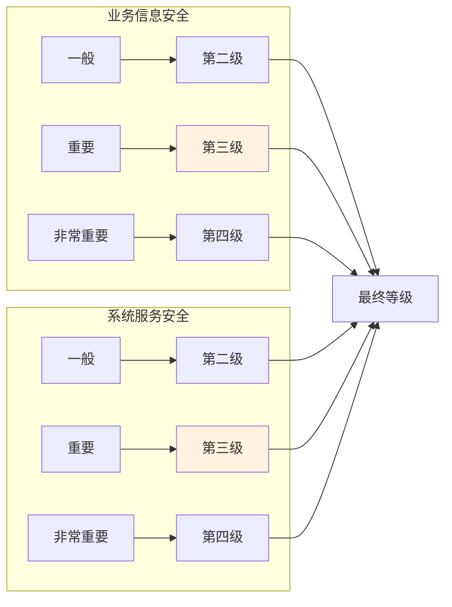
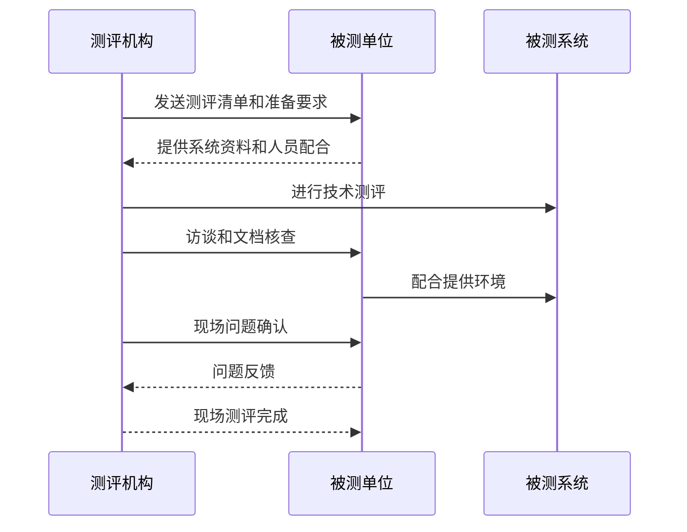

等保测评不是一次考试，而是一次深度体检。很多企业在首次测评后收到厚厚的整改报告，才发现安全工作存在如此多的问题——有些是技术缺陷，有些是管理漏洞，还有些是「以为做了但没做到位」的虚假安全。

真正理解等保测评的企业，会把测评当成改进安全的抓手，而不是应付监管的形式。

## 等保定级流程

定级是等保工作的起点，定级不当会导致后续工作的系列问题：定级过高导致资源浪费和整改负担过重，定级过低则可能无法满足实际安全需求或面临监管风险。

### 定级步骤

等保定级遵循「系统识别 → 等级拟定 → 专家评审 → 主管部门审核 → 公安机关备案」的五步流程：

**第一步：系统识别**

识别需要定级的信息系统，包括：系统边界、业务范围、物理位置、用户群体、数据资产。

这一步需要与业务部门深度沟通，了解系统的实际用途、承载的业务类型、服务的用户群体。

**第二步：等级拟定**

根据业务重要性和安全需求，拟定系统等级。等级拟定采用矩阵法，从「业务信息安全」和「系统服务安全」两个维度分别分析。

**第三步：专家评审**

对于拟定为第三级及以上的系统，应当组织专家进行评审。专家组通常由 5 名以上（含 5 名）信息安全领域的专家组成，其中至少包括 1 名业务主管单位代表。

**第四步：主管部门审核**

系统的主管部门（如金融系统归银保监会、教育系统归教育部）对定级结果进行审核确认。

**第五步：公安机关备案**

将定级结果向所在地设区市级以上公��机关网络安全保卫部门备案，提交《信息系统安全等级保护定级报告》和《信息系统安全等级保护备案表》。

### 定级报告的撰写

定级报告是定级工作的核心文档，需要包含以下内容：

**系统概述**：系统名称、业务类型、承载业务、服务范围、物理位置。

**定级过程**：分析依据、分析方法、定级理由。

**业务信息安全分析**：分析系统被破坏后对国家安全、社会秩序、公共利益、公民法人合法权益的危害程度。

**系统服务安全分析**：分析系统提供服务中断后对上述各利益方的危害程度。

**定级结论**：明确业务信息安全等级、系统服务安全等级、确定的保护等级。

## 等保测评流程

测评是检验系统安全状况的重要手段。等保测评分为四个阶段：测评准备、方案编制、现场测评、报告编制。

### 测评准备阶段

测评机构进场前，需要完成以下准备工作：

**信息收集**：收集系统的网络拓扑图、设备配置、资产清单、管理制度等资料。

**工具准备**：准备漏洞扫描工具、性能测试工具、渗透测试工具。

**人员协调**：确定被测系统负责人、现场配合人员、测评时间安排。

**边界确认**：明确测评范围和边界，避免影响生产系统。

### 方案编制阶段

测评机构根据收集的信息编制测评方案，内容包括：

**测评对象**：本次测评涉及的服务器、网络设备、安全设备、应用系统。

**测评指标**：根据系统等级，对照等保基本要求确定需要测评的控制点。

**测评方法**：针对每个控制点，确定测评方法（访谈、核查、测试）。

**测评工具**：本次测评将使用的工具列表。

**风险分析**：可能存在的测评风险和应对措施。

### 现场测评阶段

测评人员进场实施测评，采用三种方法收集证据：

**访谈**：与系统管理员、安全管理员、运维人员、系统使用者访谈，了解安全管理和操作情况。

**核查**：核查系统配置、文档记录、日志记录、机房环境等。

**测试**：通过技术手段测试系统安全防护能力，包括漏洞扫描、渗透测试、配置核查。

### 报告编制阶段

测评机构根据现场测评结果编制测评报告，包括以下内容：

**测评概述**：测评范围、测评依据、测评方法。

**测评结果汇总**：各控制点的测评结果统计。

**问题清单**：发现的安全问题和整改建议。

**总体评价**：系统的整体安全状况评估。

**风险分析**：安全问题带来的风险等级。

## 测评内容详解

### 技术测评

技术测评覆盖等保要求的技术控制点，重点关注：

**安全物理环境**：机房访问控制、监控记录、温湿度记录、电力供应。

**安全通信网络**：网络架构合理性、通信加密配置。

**安全区域边界**：访问控制策略、入侵防御配置。

**安全计算环境**：身份鉴别配置、访问控制配置、安全审计配置。

**安全管理中心**：集中管理能力、日志采集能力、态势感知能力。

### 管理测评

管理测评覆盖安全管理体系，重点关注：

**安全管理制度**：制度完整性和合理性。

**安全管理机构**：组织架构和职责分工。

**安全管理人员**：人员能力和培训记录。

**安全建设管理**：系统上线前的安全要求落实。

**安全运维管理**：日常运维中的安全控制执行。

### 测评指标体系

每个控制点的测评结果分为三个等级：

**符合**：控制措施完全满足要求。

**部分符合**：控制措施部分满足要求，存在一定风险。

**不符合**：控制措施未实施或完全无效，风险较高。

最终测评结论根据不符合项和部分符合项的数量和风险程度综合评定。

## 测评报告的解读

### 报告结构

一份完整的等保测评报告通常包含以下章节：

1. 测评概要
2. 测评依据
3. 测评范围
4. 测评方法
5. 单元测评结果（逐项列出每个控制点的测评结果）
6. 问题及整改建议（详细描述每个安全问题）
7. 整体测评结果（综合评价）
8. 测评结论（最终结论）

### 问题描述格式

每个安全问题按照以下格式描述：

**问题编号**：PROBLEM-XXX。

**控制点**：对应的等保控制点编号和名称。

**问题描述**：具体的安全问题。

**整改建议**：如何修复该问题。

**优先级**：高/中/低。

**风险等级**：该问题可能造成的风险。

### 测评结论

测评结论分为：

- **差距项（不符合项 + 部分符合项）少，可直接通过**：整体达标，整改后出具通过报告。
- **差距项较多，需要整改后复测**：存在较多安全问题，需要整改后再次测评。
- **问题严重，无法通过**：存在重大安全问题，测评机构可能拒绝出具报告。

## 整改与复测

### 整改策略

收到测评报告后，企业需要制定整改计划：

**优先级排序**：根据问题的风险等级和紧迫程度排序，高风险问题优先整改。

**责任分工**：明确每个问题的整改责任人、技术方案、完成时间。

**资源申请**：评估整改所需的人力、财力和时间资源。

### 整改验收

整改完成后，需要准备整改证据提交测评机构复核：

**整改报告**：描述每个问题的整改措施。

**证据材料**：证明整改措施已落实的截图、配置文档、日志记录。

**复核安排**：与测评机构约定复核时间和方式。

### 复测流程

测评机构对整改项进行复核后，出具复测报告。如果所有高风险问题已整改到位，测评结论可更新为通过。

## 测评周期

不同等级系统的测评周期要求：

| 等级 | 测评周期 | 说明 |
|------|----------|------|
| 第一级 | 自主测评，周期不限 | 无强制要求 |
| 第二级 | 至少每两年一次 | 自主或委托测评 |
| 第三级 | 每年至少一次 | 必须委托测评机构 |
| 第四级 | 每半年至少一次 | 必须委托测评机构 |
| 第五级 | 持续评估 | 专门机构 |

## 选测评机构的注意事项

### 资质要求

测评机构必须持有省级以上公安机关颁发的《等级测评机构推荐证书》。可在「网络安全等级保护网」查询推荐目录。

### 选择要点

**专业能力**：评估机构的行业经验和专业资质（如 CNAS 认可）。

**行业经验**：选择在相关行业有成功案例的机构。

**服务质量**：评估机构的服务响应速度和问题解答能力。

**价格合理**：测评费用通常与系统规模、复杂度相关，价格过低可能意味着服务质量不足。

**独立公正**：测评机构应独立于被测单位，不与安全厂商有利益关联。

## 思考题

**问题 1**：某企业有两个信息系统——用户系统（用户量 500 万，定级为第三级）和内部办公系统���仅供内部员工 200 人使用）。在等保测评中发现用户系统有一项高风险问题，办公系统全部通过。该企业应该如何处理？

参考答案

两个系统是独立的定级对象，需要分别出具测评报告。用户系统存在高风险问题，测评结论为「需整改后复测」；办公系统全部通过，可出具通过报告。

建议处理方式：优先整改用户系统的高风险问题，因为该系统面向公众、用户量大、安全要求高；与测评机构沟通整改计划和时间表；完成整改后申请复测；办公系统保持监控，确保状态不变。

特别注意：用户系统通过测评前，如果该系统已备案且有重大安全问题，可能面临监管风险；建议在此期间加强安全监控，降低被攻击风险。

**问题 2**：在等保测评现场测评阶段，测评人员需要登录服务器查看配置。作为系统管理员，应该如何配合才能既保证测评顺利进行，又确保系统安全？

参考答案

测评过程中的安全配合要点包括：

**权限控制**：为测评人员提供专用临时账号，仅授予最小必需权限；测评账号应配置审计日志，记录所有操作；测评完成后立即禁用或删除临时账号。

**环境准备**：测评前确认生产环境和测试环境的隔离；如需在生产环境测评，安排在业务低峰期；提前备份关键配置和数据。

**全程陪同**：安排技术人员全程陪同，记录测评人员的所有操作；如有异常操作，立即询问并记录。

**敏感数据保护**：评估是否存在敏感数据暴露风险；如有必要，测评前对敏感测试数据进行脱敏处理。

**问题记录**：详细记录测评过程中发现的所有问题，包括测评人员的测试命令和输出，作为后续整改的重要参考。

