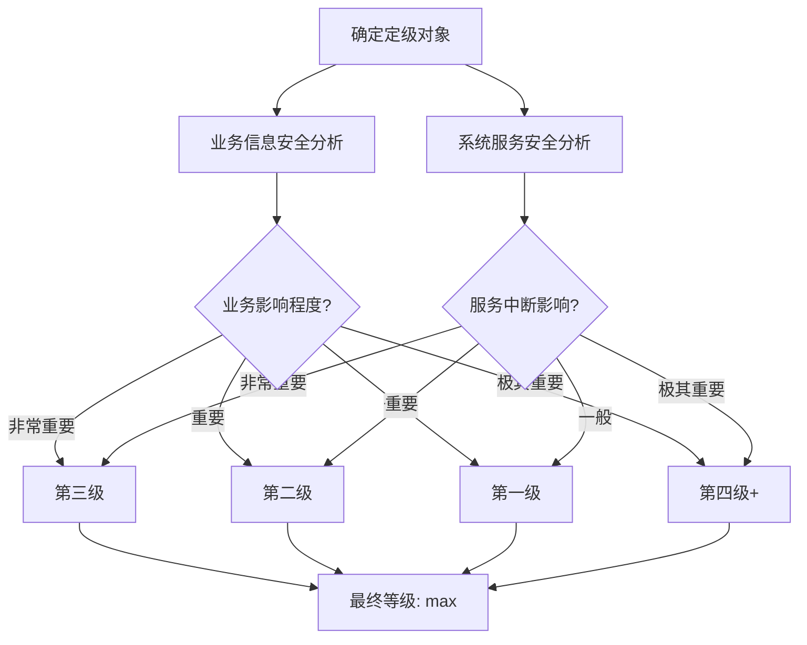

2019 年 5 月，某省级政务云平台因未完成等级保护备案，被主管部门通报批评，相关负责人被约谈。这不是极端案例——等保 2.0 实施以来，未备案、未测评、整改不到位的机构被处罚的案例在全国各地频繁出现。

在中国网络安全领域，等级保护制度不是「加分项」，而是「必答题」。不理解等保，就无法在政府、医疗、教育、金融、能源等关键行业开展业务。

## 等保 2.0 的背景与演进

### 从等保 1.0 到 2.0

中国网络安全等级保护制度（等保）始于 2007 年的《信息安全等级保护管理办法》（等保 1.0）。彼时的信息系统以传统的服务器-客户端架构为主，安全防护的核心是网络边界防护。

2019 年 5 月，《网络安全等级保护基本要求》（GB/T 22239-2019）等系列标准正式实施，标志着等保 2.0 时代到来。2.0 版本针对云计算、大数据、物联网、移动互联、工业控制系统等新型应用场景进行了扩展，同时强化了安全管理要求。

### 等保 2.0 的核心变化

**扩大保护范围**：从传统信息系统扩展到云平台、大数据平台、移动互联网、物联网、工业控制系统。

**强化主动防御**：从「边界防护」转向「整体防控」，强调主动防御和动态安全。

**突出可信计算**：将可信计算技术作为核心安全防护手段。

**简化管理要求**：优化测评流程，减少不必要的文档要求。

## 等级划分

### 五级保护等级

根据信息系统的业务重要性和安全保护需求，等保将系统划分为五个等级：

| 等级 | 名称 | 适用场景 | 监管级别 |
|------|------|----------|----------|
| 第一级 | 自主保护级 | 小型私营、个体等一般信息系统 | 一般监管 |
| 第二级 | 指导保护级 | 涉及重要业务、需指导的小型单位系统 | 指导监管 |
| 第三级 | 监督保护级 | 涉及重要业务、跨区域网络系统 | 强制监管 |
| 第四级 | 强制保护级 | 涉及国家安全、社会秩序的重要系统 | 强制监管 |
| 第五级 | 专控保护级 | 涉及国家安全的核心系统 | 专门监管 |

绝大多数��业企业系统处于第二级或第三级。

### 定级原则

定级采用「业务信息安全」和「系统服务安全」两个维度分别定级，最终等级取两者中较高者：

- **业务信息安全**：关注数据泄露、数据篡改、服务中断对业务的影响
- **系统服务安全**：关注系统提供服务中断对业务的影响

## 技术要求

等保 2.0 的技术要求覆盖四个层面：安全物理环境、安全通信网络、安全区域边界、安全计算环境。

### 安全物理环境

针对物理机房和设施的安全要求：

**物理位置选择**：机房应选择在建筑内不易受洪水、山体滑坡等自然灾害影响的区域。

**物理访问控制**：电子门禁系统、监控报警系统、专人值守。

**防盗窃和防破坏**：线缆隐蔽、关键设备固定、设置报警。

**防雷击、防火、防水、温湿度控制**：温湿度调控设备、烟雾探测、漏水检测。

**电力供应**：稳压、备用电源（UPS）、发电机。

**电磁防护**：电磁屏蔽、屏蔽线缆。

### 安全通信网络

针对网络架构和通信的安全要求：

**网络架构**：分区分域，不同安全级别系统隔离，关键网络设备冗余配置。

**通信传输**：采用加密传输、VPN 隧道保护传输安全。

### 安全区域边界

针对边界防护的安全要求：

**边界防护**：控制对网络层的访问，防止非法接入。

**访问控制**：在区域边界部署访问控制设备，制定访问控制策略。

**入侵防范**：部署入侵检测/防御系统，监控攻击行为。

**恶意代码防范**：部署防病毒网关，检测和过滤恶意代码。

**安全审计**：记录边界访问和操作行为日志。

### 安全计算环境

针对终端和服务器的安全要求：

**身份鉴别**：多因素认证、强制复杂密码、定期更换。

**访问控制**：基于角色的访问控制、最小权限原则。

**安全审计**：记录用户行为、系统操作、资源访问。

**入侵防范**：主机入侵检测、漏洞扫描与修复。

**恶意代码防范**：终端防病毒软件。

**数据安全**：数据加密、敏感数据保护、数据备份恢复。

**资源配置**：关闭不必要的服务和端口，限制用户权限。

## 管理要求

等保 2.0 的管理要求涵盖安全管理制度、安全管理机构、安全管理人员、安全建设管理、安全运维管理。

### 安全管理制度

建立完整的安全管理制度体系：

- 安全策略：总体安全目标和要求
- 安全管理制度：各类操作规范
- 安全管理规程：具体操作指南
- 记录表单：执行记录

制度应当定期修订，保持与业务和威胁环境的适应性。

### 安全管理机构

设立安全管理的组织架构：

- 领导小组：最高管理层，负责安全决策
- 职能部门：信息安全管理、信息安全审计
- 运维团队：安全运维、技术支持

### 安全管理人员

对安全管理人员的要求：

- 背景审查：入职前的身份和背景核查
- 安全培训：定期安全意识和技术培训
- 离岗管理：离职交接、账户清理

## 扩展要求

等保 2.0 针对新型应用场景设计了扩展要求。

### 云计算安全扩展要求

云环境下新增的要求包括：

**虚拟化安全**：虚拟机隔离、虚拟网络安全管理、虚拟镜像安全。

**云平台管理**：统一身份认证、权限分离、审计日志。

**数据安全**：云端数据加密、密钥管理、数据备份。

**服务供应商管理**：SLA 协议、审计权利、数据可迁移性。

### 移动互联安全扩展要求

针对移动终端和移动应用的安全要求：

**无线网关安全**：无线网络边界防护、信号屏蔽。

**移动终端管控**：MDM（移动设备管理）系统、设备安全基线。

**移动应用安全**：应用安全检测、代码签名、应用沙箱。

### 物联网安全扩展要求

针对感知节点和传输网络的安全要求：

**感知节点安全**：节点设备安全、节点物理防护。

**网关节点安全**：汇聚节点安全、协议转换安全。

**数据传输安全**：通信加密、完整性保护。

### 工业控制系统安全扩展要求

针对工业控制系统的安全要求：

**工控设备安全**：设备安全配置、工业协议过滤。

**工控系统安全**：系统日志、补丁管理、访问控制。

**工控通信安全**：工业协议深度检测、安全审计。

## 备案与测评

### 备案流程

定级为第二级及以上的信息系统，需向所��地设区市级以上公安机关网络安全保卫部门备案。

备案材料包括：系统拓扑图、系统定级报告、专家评审意见、安全组织机构等。

### 测评周期

| 等级 | 测评周期 | 测评机构 |
|------|----------|----------|
| 第一级 | 自主测评 | 无要求 |
| 第二级 | 至少两年一次 | 无强制要求 |
| 第三级 | 至少一年一次 | 必须使用等级测评机构 |
| 第四级 | 至少半年一次 | 必须使用等级测评机构 |
| 第五级 | 持续评估 | 专门机构 |

## 思考题

**问题 1**：某互联网公司的用户系统定级为第三级，系统部署在阿里云上。请分析该公司需要满足哪些等保技术要求。

参考答案

该系统需要满足等保 2.0 三级的基本要求，同时满足云计算扩展要求：

安全通信网络：使用阿里云 VPC 进行网络分区分域；使用云安全产品（云防火墙、安全组）进行访问控制；数据传输使用 TLS 加密。

安全区域边界：在云平台边界部署访问控制策略；开启云 WAF 防护；配置云入侵检测；设置安全组访问规则。

安全计算环境：生产环境服务器启用多种身份认证机制；基于 RAM 角色实现最小权限；开启云安全中心进行主机安全防护；使用云数据库加密；启用云审计日志。

云计算扩展要求：使用阿里云 KMS 进行密钥管理；确认云服务商的 SLA 和安全资质；签订数据处理协议；确保数据可迁移性和备份恢复能力。

此外还需要满足管理要求：制定安全管理制度、设置安全管理机构、进行安全人员培训、建立安全运维流程。

**问题 2**：等保 2.0 与 ISO 27001 有什么主要区别？企业是否需要同时通过两项认证？

参考答案

主要区别体现在：法律效力方面，等保是中国法规强制要求，具有法律约束力；ISO 27001 是国际自愿性标准，获取证书是商业行为。适用范围方面，等保侧重中国境内网络运营者；ISO 27001 是国际通用标准。技术要求方面，等保有详细的技术控制点清单；ISO 27001 强调过程方法和风险管理。认证方式方面，等保由公安机关监管，测评机构资质由公安管理；ISO 27001 由认证机构颁发证书。

是否需要同时通过，取决于业务需求：如果企业在中国境内涉及政府、金融、教育、医疗等关键行业，通常是等保必须、ISO 27001 可选；如果企业有国际业务或有 ToB 跨国企业客户，ISO 27001 可能是商业门槛。从成本角度，��者有大量重叠的控制要求，建议「一次实施，满足两项标准」——以 ISO 27001 的框架为基础，同时补充等保特有的技术要求（如可信计算）。

