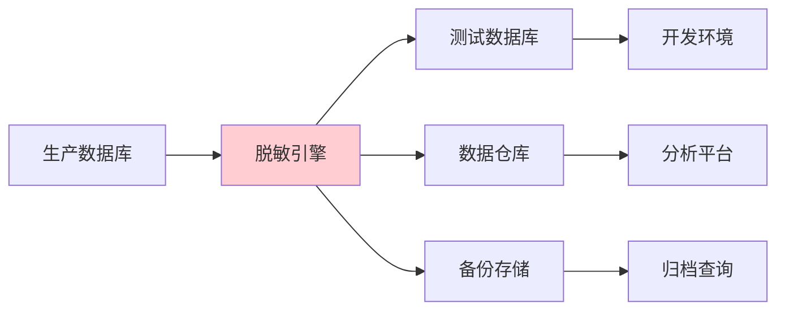
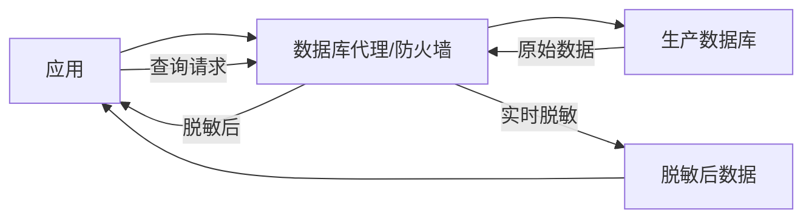
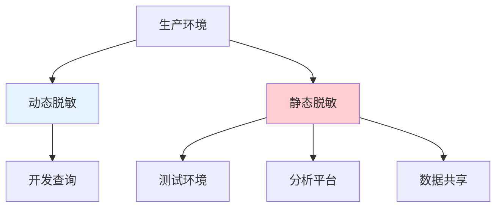

开发人员小王想查询一条用户数据，他打开数据库客户端，输入查询语句——系统实时将身份证号脱敏为 `****`；与此同时，BI 系统生成销售报表，背后调用的数据已被静态脱敏处理，数据仓库里存储的就是脱敏后的数据。

两条路径，两个结果，但都达到了保护敏感数据的目的。动态脱敏和静态脱敏，各有各的战场。

## 静态脱敏

### 定义

静态脱敏（Static Data Masking）是对数据进行一次性脱敏处理，脱敏后的数据替换原始数据存储。脱敏过程发生在数据写入存储之前。

### 工作流程



**典型流程**：从生产数据库提取数据 → 脱敏引擎处理 → 写入目标环境（测试/分析/备份）。

### 优势

**实现简单**：一次性处理，脱敏后数据直接使用，无需额外的实时处理。

**性能无损**：查询时无需实时脱敏，对应用和查询性能无影响。

**离线保障**：备份数据已脱敏，即使备份泄露也能保护原始数据。

**一致性保证**：脱敏结果固定，多系统使用同一脱敏数据，关联关系保持。

### 局限

**数据同步问题**：生产数据变更后需要重新提取和脱敏，存在数据同步延迟。

**存储成本**：脱敏数据占用独立存储空间。

**不可逆**：脱敏后通常无法还原，不适合需要还原的场景。

### 适用场景

**测试环境**：为开发测试提供脱敏数据。

**数据仓库**：用于 BI 分析的历史数据。

**数据共享**：与第三方共享的数据。

**备份归档**：需要长期保存但不需要实时访问的数据。

## 动态脱敏

### 定义

动态脱敏（Dynamic Data Masking）在数据查询时实时脱敏，原始数据保持不变，脱敏只发生在查询结果返回前。

### 工作流程



**典型架构**：数据库代理（如数据脱敏网关）拦截查询请求，根据脱敏规则实时处理结果后返回。

### 优势

**实时性**：数据始终是最新的，无需同步。

**按需脱敏**：可根据用户角色、查询类型动态决定脱敏程度。

**统一管理**：脱敏规则集中管理，易于维护和审计。

**保留原始数据**：原始数据完整保留，支持需要精确数据的场景。

### 局限

**性能开销**：每次查询都需要额外的脱敏处理，存在性能损耗。

**实现复杂度**：需要部署数据库代理或中间件，实现相对复杂。

**一致性挑战**：不同查询可能返回不同脱敏结果，跨系统关联可能出现问题。

### 适用场景

**生产环境查询**：实时查询时保护敏感数据。

**权限分级**：不同权限用户看到不同详细程度的数据。

**API 防护**：对外 API 返回数据时进行脱敏。

**数据库审计**：作为数据库安全监控的一部分。

## 实施方式对比

| 维度 | 静态脱敏 | 动态脱敏 |
|------|----------|----------|
| 实施位置 | 数据写入前 | 查询返回前 |
| 数据状态 | 脱敏后数据存储 | 原始数据存储 |
| 性能影响 | 无（查询时无额外处理） | 有（每次查询需处理） |
| 数据延迟 | 有（需要同步） | 无（实时数据） |
| 实现复杂度 | 中等 | 较高 |
| 适用环境 | 测试、分析、备份 | 生产环境 |

## 数据库代理层的动态脱敏

### 实现方式

动态脱敏通常通过数据库代理实现，代理层负责：

**查询拦截**：捕获发往数据库的查询请求。

**结果改写**：根据脱敏规则改写返回结果。

**权限控制**：基于用户身份决定脱敏程度。

**审计日志**：记录所有查询和脱敏操作。

### 常见实现

**应用层脱敏**：在应用层代码中实现脱敏逻辑。

优点：灵活控制、与业务逻辑结合紧密。

缺点：需要修改代码、分散管理。

**中间件脱敏**：通过数据库中间件（如 MyCat）或 API 网关实现。

优点：统一处理、对应用透明。

缺点：增加架构复杂度。

**数据库代理**：使用专门的脱敏数据库代理（如 DB Firewall）。

优点：专业、功能完整。

缺点：需要部署额外组件。

```java title="DynamicMaskingInterceptor.java"
/**
 * 动态脱敏拦截器示例
 * 在查询返回前对敏感字段进行脱敏
 */
@Component
public class DynamicMaskingInterceptor {
    
    private final MaskingRules maskingRules;
    
    public List<Map`String, Object>> interceptQuery(String userId, 
                                                   List<Map`String, Object>> result) {
        UserRole role = getUserRole(userId);
        
        return result.stream()
            .map(record -> applyMasking(record, role))
            .collect(Collectors.toList());
    }
    
    private Map`String, Object` applyMasking(Map`String, Object` record, UserRole role) {
        Map`String, Object` masked = new HashMap`<>(record);
        
        if (role == UserRole.SUPPORT) {
            // 客服只能看到部分手机号
            masked.put("phone", maskPhone((String) record.get("phone")));
        } else if (role == UserRole.DEVELOPER) {
            // 开发看到脱敏后的手机号
            masked.put("phone", maskPhone((String) record.get("phone")));
            // 开发看到脱敏后的身份证号
            masked.put("id_card", maskIdCard((String) record.get("id_card")));
        } else if (role == UserRole.MANAGER) {
            // 经理可以看完整信息但记录审计
            auditService.logQuery(userId, record);
        }
        
        return masked;
    }
}
```

## 大数据环境的脱敏挑战

### 数据量巨大

大数据平台存储 TB 甚至 PB 级别的数据，静态脱敏需要大量计算资源和时间。

**解决方案**：分布式脱敏处理，利用 Spark、Flink 等分布式计算框架并行脱敏。

### 多种数据源

大数据环境通常包含结构化数据（RDBMS）、半结构化数据（JSON、XML）和非结构化数据（日志、文档）。

**解决方案**：针对不同数据类型使用不同的脱敏策略和工具。

### 实时流处理

流处理平台（如 Kafka、Flink）中的数据需要实时脱敏。

**解决方案**：使用流处理框架内置的脱敏算子，在数据流经时实时处理。

### 数据关联复杂

大数据环境中的数据关联复杂，多表关联后可能重新识别个人。

**解决方案**：在数据进入数仓前完成脱敏，并保持关联一致性。

## 脱敏与数据分析的平衡

### 分析需求 vs 隐私保护

数据分析需要：精确数值、完整关联关系、原始粒度数据。

隐私保护需要：移除可识别信息、保留统计特性、限制数据访问。

两者存在天然张力，需要平衡。

### 平衡策略

**分层授权**：分析人员按角色获得不同详细程度的数据。

**聚合优先**：能用聚合数据的场景，不使用个体数据。

**差分隐私**：在统计查询中加入噪声，保护个体隐私的同时保留统计特性。

**安全查询**：使用安全的多方计算（MPC）实现跨组织数据分析，避免原始数据集中。

## 选型建议

### 选静态脱敏的场景

- 测试环境、数据仓库场景
- 数据量较大，性能敏感
- 一次性脱敏后可长期使用
- 需要与第三方共享数据

### 选动态脱敏的场景

- 生产环境实时查询
- 不同角色需要不同粒度的数据
- 需要保留原始数据支持精确查询
- 监管要求实时监控数据访问

### 组合策略

在实际项目中，静态脱敏和动态脱敏通常组合使用：



**组合模式**：生产环境部署动态脱敏，保护实时查询；测试和分析环境使用静态脱敏的数据副本。

## 思考题

**问题 1**：某公司同时使用静态脱敏和动态脱敏，但测试环境和生产环境的某些用户数据不一致，导致开发人员在测试环境无法重现生产 Bug。应该如何解决？

<details>
<summary>参考答案</summary>

这是一个静态脱敏一致性问题。解决方案包括：

**方案一：一致性脱敏算法**。使用确定性脱敏算法（如 FPE），确保相同的原始值在所有环境中产生相同的脱敏值。这样测试环境和生产环境的数据可以通过某种方式映射对齐。

**方案二：共享脱敏映射表**。所有环境使用同一套脱敏映射表（用户 ID → 脱敏用户 ID），确保关联一致性。

**方案三：脱敏数据同步**。定期将生产环境的静态脱敏结果同步到测试环境，确保数据一致性。

**方案四：仅在必要时脱敏**。对于开发重现 Bug 必需的标识符，保留原始值或使用可逆脱敏（如 FPE），其余字段脱敏。

建议采用方案一或方案二，从根本上解决一致性问题。
</details>

**问题 2**：动态脱敏对查询性能的影响是否可以忽略？如果不可忽略，应该如何优化？

<details>
<summary>参考答案</summary>

动态脱敏的性能影响取决于脱敏规则的复杂度：

**可忽略的场景**：简单脱敏规则（如掩码部分字符）、结果集较小。

**不可忽略的场景**：复杂脱敏规则（多层嵌套、跨表关联）、结果集巨大、并发查询多。

**优化策略**：

**缓存脱敏结果**：对于相同查询和用户组合，缓存脱敏结果。

**异步脱敏**：对非实时要求的查询，使用异步脱敏��列。

**分层策略**：对高并发场景，重要查询走缓存，一般查询实时脱敏。

**硬件加速**：使用专用硬件处理加密脱敏计算。

**规则优化**：简化脱敏规则，减少计算量。

实际项目中，建议进行性能测试评估影响，再决定优化策略。
</details>
