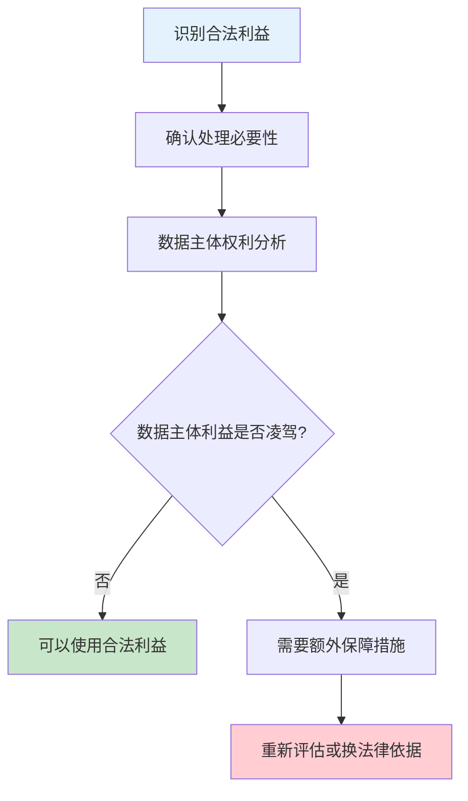

很多企业以为 GDPR 合规就是「加一个勾选框让用户同意」，或者「雇佣一个 DPO」。这是一个危险的误解。GDPR 合规不是一次性动作，而是一套持续运转的系统——从数据收集的第一刻起，到数据处理的每一个环节，再到数据主体行使权利时的响应机制，每个节点都需要设计。

合规不是成本中心，而是产品能力的一部分。

## 数据处理活动的记录（ROPA）

### 记录的目的与要求

ROPA（Record of Processing Activities）是 GDPR 合规的基石。它不是一份应付审计的形式文档，而是企业数据处理活动的全面视图。

根据 GDPR 第 30 条，控制者和处理者必须维护处理活动记录，包括：处理的目的、数据类别（一般个人数据、特殊类别数据）、数据接收者及其进一步传输信息、跨境传输的详情、安全措施、信息留存期限。

### ROPA 的结构设计

一份完整的 ROPA 记录应当包含以下字段：

| 字段 | 说明 | 示例 |
|------|------|------|
| 处理活动ID | 唯一标识符 | PROC-001 |
| 处理活动名称 | 描述性名称 | 用户行为分析 |
| 处理目的 | 收集数据的业务目的 | 改进产品体验 |
| 数据类别 | 涉及的数据类型 | 用户点击流、浏览记录 |
| 数据主体类别 | 涉及的数据主体 | 网站访客、注册用户 |
| 数据接收者 | 数据流向 | Google Analytics |
| 跨境传输 | 是否涉及及机制 | 欧盟→美国，SCC |
| 法律依据 | 合法性基础 | 合法利益 |
| 留存期限 | 数据保留时间 | 26个月 |
| 安全措施 | 技术保护措施 | 加密、访问控制 |

### ROPA 的维护流程

ROPA 不是建立后就束之高阁的文档。企业需要建立定期审查机制：每当新系统上线、新功能发布、或数据流变化时，更新 ROPA 记录。建议每季度进行一次 ROPA 审查，每年进行一次完整的 ROPA 审计。

## 合法性基础的判断

### 六种合法性基础

GDPR 第 6 条规定了六种处理个人数据的合法性基础。理解它们之间的区别和适用场景是合规的核心：

**同意（Consent）**：数据主体明确、知情、自由地给出同意。必须是 affirmative action，不能是 pre-ticked boxes。

适用场景：营销邮件、产品个性化、第三方数据共享。最佳实践：提供 granularity，让用户只同意必要项；同意记录需可验证。

**合同履行（Contract）**：处理是履行与数据主体合同所必需的。

适用场景：配送地址处理、支付信息处理、账户服务。关键点：数据范围必须限于合同必需的最小集。

**法律义务（Legal Obligation）**：处理是控制者履行法律义务所必需的。

适用场景：税务申报、劳动法合规、司法披露。处理范围由法律明确定义。

**重大利益（Vital Interests）**：处理是保护数据主体或其他自然人的重大利益所必需的。

适用场景：医疗急救、食品药品安全。这个基础很少使用，且不适用于商业场景。

**公共任务（Public Task）**：处理是控制者执行公共任务或行使官方权力所必需的。

适用场景：政府部门、公共服务。这个基础不适用于私营商业企业。

**合法利益（Legitimate Interests）**：处理是控制者或第三方的合法利益所必需的，且不被数据主体的权利或利益凌驾。

适用场景：欺诈检测、网络安全、用户分析。**必须进行平衡测试**：控制者的利益是否凌驾于数据主体的权利？��否有更少侵扰的处理方式？

### 平衡测试的流程

当使用合法利益作为法律依据时，需要进行书面平衡测试：



## 隐私影响评估（DPIA）

### DPIA 的触发条件

根据 GDPR 第 35 条，以下情况必须进行 DPIA：

- 系统性、定期性评估个人画像，特别是基于画像的自动化决策
- 大规模处理特殊类别数据（健康、宗教、性取向等）
- 系统性监控公共可访问区域
- 处理儿童数据
- 采用新技术或新技术解决方案
- 涉及「适当匹配」或「大规模」的系统性处理

欧盟数据保护委员会（EDPB）发布了必须进行 DPIA 的场景清单，企业可以参考。

### DPIA 的实施步骤

**第一步：描述处理活动**。详细说明处理的目的、方法、数据类别、接收者。

**第二步：必要性评估**。评估处理是否必要、是否 proporcional（比例相称）。

**第三步：风险识别**。识别可能对数据主体权利和自由造成的风险。

**第四步：应对措施**。确定应对风险的技术和组织措施。

**第五步：咨询 DPO**。在 DPIA 完成后，咨询数据保护官的意见。

**第六步：文档化**。将 DPIA 的完整过程文档化，并在必要时提交给监管机构。

### DPIA 的风险矩阵

常见的 DPIA 风险包括：

| 风险类型 | 风险描述 | 影响 |
|----------|----------|------|
| 识别风险 | 数据可被关联到特定个人 | 中 |
| 歧视风险 | 自动化决策导致歧视 | 高 |
| 经济损失 | 数据泄露导致财务损失 | 中 |
| 隐私侵犯 | 监控范围超出必要 | 高 |
| 声誉损害 | 数据滥用曝光 | 中 |

## 数据主体权利的技术实现

### 访问权的实现

数据主体请求访问其个人数据时，系统需要能够：

- 验证请求者身份
- 定位该用户的所有个人数据（包括日志、行为数据）
- 聚合数据（来自不同系统的数据）
- 生成可读格式的输出（JSON、CSV、PDF）
- 响应时间 `<= 30 天`

技术上，常见实现方式包括：

```java title="UserDataAccessService.java"
@Service
public class UserDataAccessService {
    
    private final UserRepository userRepository;
    private final OrderRepository orderRepository;
    private final AnalyticsRepository analyticsRepository;
    
    /**
     * 聚合用户在多个系统中的个人数据
     * 响应 GDPR 访问权请求
     */
    public UserDataExport exportUserData(Long userId) {
        // 验证用户身份
        User user = userRepository.findById(userId)
            .orElseThrow(() -> new UserNotFoundException(userId));
        
        // 聚合多系统数据
        UserProfile profile = user.getProfile();
        List<Order> orders = orderRepository.findByUserId(userId);
        UserBehavior analytics = analyticsRepository.getBehaviorSummary(userId);
        List<ConsentRecord> consents = consentService.getUserConsents(userId);
        
        return UserDataExport.builder()
            .profile(profile)
            .orders(orders)
            .behaviorSummary(analytics)
            .consentRecords(consents)
            .exportedAt(Instant.now())
            .build();
    }
}
```

### 删除权的实现

删除权（被遗忘权）需要考虑多个层面的删除：

**逻辑删除**：标记数据为已删除状态（如 `deleted_at` 字段），保留审计痕迹。

**物理删除**：真正从数据库中移除数据。

**级联删除**：删除关联数据（如用户订单、评论）。

**缓存清理**：删除 CDN 缓存、应用缓存。

**备份处理**：备份中的数据删除是复杂问题，通常通过加密保证备份安全。

### 可携带权的实现

可携带权要求以「结构化、常用、机器可读」格式导出数据。JSON 和 CSV 是常用格式。

```java title="DataPortabilityService.java"
/**
 * 生成机器可读的 GDPR 数据导出
 * 支持 JSON 和 CSV 格式
 */
public DataExport generatePortabilityExport(Long userId, ExportFormat format) {
    UserDataExport rawData = userDataAccessService.exportUserData(userId);
    
    return switch (format) {
        case JSON -> toJson(rawData);
        case CSV -> toCsv(rawData);
    };
}
```

## 同意管理的最佳实践

### 同意的获取

有效的同意必须满足以下条件：

- **Freely given**：不是以合同履行为条件的同意
- **Specific**：针对特定处理目的的单独同意
- **Informed**：用户了解同意的后果
- **Unambiguous**：明确的 affirmative action

Pre-ticked 复选框是无效的。「继续」按钮不等于同意。

### 同意记录

系统必须记录：谁同意、什么时间同意、同意什么版本、同意什么目的。

```java title="ConsentAuditService.java"
/**
 * 记录用户同意行为
 * 用于证明已获取有效同意
 */
public ConsentRecord recordConsent(Long userId, ConsentPurpose purpose, 
                                    boolean granted, String ipAddress) {
    return consentRepository.save(ConsentRecord.builder()
        .userId(userId)
        .purpose(purpose)
        .granted(granted)
        .consentVersion(getCurrentPolicyVersion())
        .ipAddress(ipAddress)
        .userAgent(getUserAgent())
        .recordedAt(Instant.now())
        .build());
}
```

## 数据最小化与目的限制

### 数据最小化的实现

数据最小化不是一次性的决策，而是贯穿整个数据生命周期的原则：

**收集阶段**：只收集业务必需的最少字段。使用渐进式收集（如只收集注册邮箱，后续需要时再收集更多信息）。

**处理阶段**：在处理时只暴露必要的数据字段。不必要的数据字段应在 DTO 转换时过滤。

**存储阶段**：定期审查留存数据，删除不再需要的数据。建立数据生命周期策略。

### 目的限制的实现

目的限制要求数据只能用于声明的目的。如果需要将数据用于新目的，需要重新评估合法性基础。

实践中，建议在 ROPA 中明确声明每个处理活动的目的，并建立跨系统数据使用的审批流程。

## 安全措施（TOM）

GDPR 第 32 条要求控制者和处理者实施适当的技术和组织措施：

### 技术措施

- **加密**：静态数据加密 + 传输加密
- **访问控制**：最小权限原则、多因素认证
- **伪名化**：降低数据与特定个人的关联性
- **安全测试**：定期渗透测试、漏洞扫描

### 组织措施

- **安全政策**：数据保护政策、访问控制政策
- **培训**：定期安全意识培训
- **流程**：数据泄露响应流程、数据主体请求响应流程
- **问责**：数据处理协议、内部审计

## 思考题

**问题 1**：企业计划上线一个新功能，需要分析用户的健康数据（特殊类别数据）来推荐个性化饮食方案。请设计该场景的 DPIA 流程。

<details>
<summary>参考答案</summary>

该场景必须进行 DPIA，因为涉及大规模特殊类别数据处理。DPIA 流程应包含：处理活动描述（分析健康数据生成饮食推荐）；必要性评估（健康数据对推荐准确性至关重要，且用户主动提供）；风险识别（数据泄露风险、歧视风险、过度收集风险）；应对措施（数据加密、最小化存储、去标识化处���、访问控制）；咨询 DPO 意见。额外建议：使用 pseudonymization，将饮食推荐系统与个人身份信息分离存储；实施数据保留策略，用户退出服务后删除健康数据；提供明确的同意机制，告知数据使用目的；考虑是否可以将分析结果匿名化后使用，避免处理原始健康数据。
</details>

**问题 2**：用户在行使删除权时，其数据���被用于生成聚合统计数据。如何处理这种情况？

<details>
<summary>参考答案</summary>

这是一个常见的合规困境。解决方案取决于数据的具体使用方式：

如果聚合统计数据无法反向识别个人，则不涉及删除权问题——匿名化数据不再是个人数据。但必须验证匿名化的不可逆性。

如果聚合统计仍可关联到个人，则需要区分处理：对于仍可关联到个人的数据，执行删除；对于完全匿名的聚合数据，保留（因为已不是个人数据）。实际操作中，建议在数据处理设计阶段就采用「 pseudonymization 架构」：原始可识别数据与聚合分析数据分离存储，用户请求删除时，删除原始数据，保留已完全聚合的匿名数据用于业务分析。这样可以在满足删除权的同时不影响业务分析功能。

</details>
