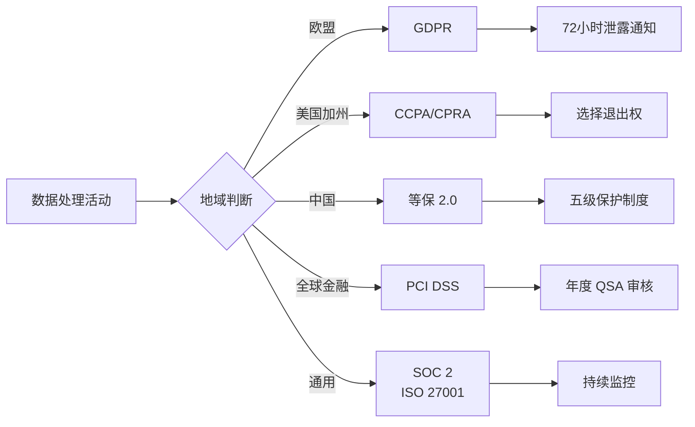

合规不是终点，而是建立有效安全治理的起点。当一个企业面临 GDPR 的巨额罚款威胁时，它被迫建立数据分类分级、访问控制、审计日志等安全基础能力——这些能力反过来也保护了企业自身。

本专题覆盖主要合规框架的深度解析：从 GDPR、CCPA 的数据保护义务，到中国等保 2.0 的技术要求，再到 SOC 2、ISO 27001 等国际认证的审核标准，以及数据脱敏、隐私影响评估等具体的隐私保护实践。

## 核心内容

### 全球合规框架

- [合规概述与重要性](/security/compliance/overview) — 合规管理的目标与框架体系
- [GDPR 通用数据保护条例](/security/compliance/gdpr) — 数据主体权利、合法性基础、违规处罚
- [GDPR 合规要点](/security/compliance/gdpr-compliance) — ROPA、DPIA、安全措施、跨境传输
- [CCPA 加州消费者隐私法案](/security/compliance/ccpa) — 消费者权利与企业义务

### 中国合规

- [等保 2.0 中国等级保护](/security/compliance/djcp) — 五级保护制度与技术要求
- [等保定级与测评](/security/compliance/djcp-assessment) — 定级流程与测评方法

### 国际认证

- [SOC 2 审计报告](/security/compliance/soc2) — Type I vs Type II 报告结构
- [SOC 2 信任服务原则](/security/compliance/soc2-principles) — 安全性、可用性、保密性
- [ISO 27001 信息安全管理体系](/security/compliance/iso27001) — ISMS 建立与认证流程
- [HIPAA 医疗信息保护](/security/compliance/hipaa) — PHI 保护与安全规则
- [PCI DSS 支付卡行业安全标准](/security/compliance/pci-dss) — 12 项要求与等级划分

### 数据治理

- [数据脱敏技术](/security/compliance/data-masking) — 替换、混排、掩码、FPE
- [动态脱敏 vs 静态脱敏](/security/compliance/dynamic-static-masking) — 实施方式对比与选型
- [数据分类分级](/security/compliance/data-classification) — 分类标准与标签管理
- [数据留存与删除策略](/security/compliance/data-retention) — 归档、删除验证、合规保留

### 隐私保护

- [隐私影响评估](/security/compliance/pia) — DPIA 的触发条件与实施步骤
- [隐私设计](/security/compliance/privacy-by-design) — 七项原则与工程实践
- [跨境数据传输合规](/security/compliance/cross-border) — SCC、BCR、 adequacy decision
- [安全审计与日志保留](/security/compliance/audit-logging) — 审计日志的完整性保护

### 工具与自动化

- [合规自动化工具](/security/compliance/automation-tools) — Drata、Vanta、TrustArc 的功能对比

## 合规框架对比

## 思考题

**问题 1**：GDPR 和等保 2.0 在数据跨境传输方面的要求有哪些冲突？在实际项目中应该如何应对？

参考答案

GDPR 要求数据自由流动（充分性认定后），但等保 2.0 对三级及以上系统要求数据本地化存储。冲突点在于：某些行业的等保三级系统存储的数据，GDPR 规定可以流向欧盟境外时，等保要求禁止流出。应对策略包括：建立数据分类分级体系，敏感数据（如金融、医疗）严格遵循更严格的要求；在架构层面将数据按敏感度隔离，低敏感数据可跨境，高敏感数据本地存储；使用数据处理协议（DPA）和标准合同条款（SCC）作为合规依据。

**问题 2**：SOC 2 Type I 和 Type II 报告有什么区别？企业首次选择哪种报告类型更合适？

参考答案

Type I 报告评估控制措施在特定时点的设计有效性（「你的控制措施设计得好不好」）；Type II 报告评估控制措施在一定时期（通常 6-12 个月）内的设计和运行有效性（「你的控制措施实际运行得好不好」）。Type II 更有价值，因为它证明了控制措施在时间维度上持续有效。

首次认证通常先做 Type I，验证控制设计后再进入 Type II 审核周期。因为 Type II 需要至少 6 个月的运行证据，直接做 Type II 会导致审核周期很长。但客户往往更看重 Type II 报告，所以商业压力会推动企业尽快进入 Type II 审核。

