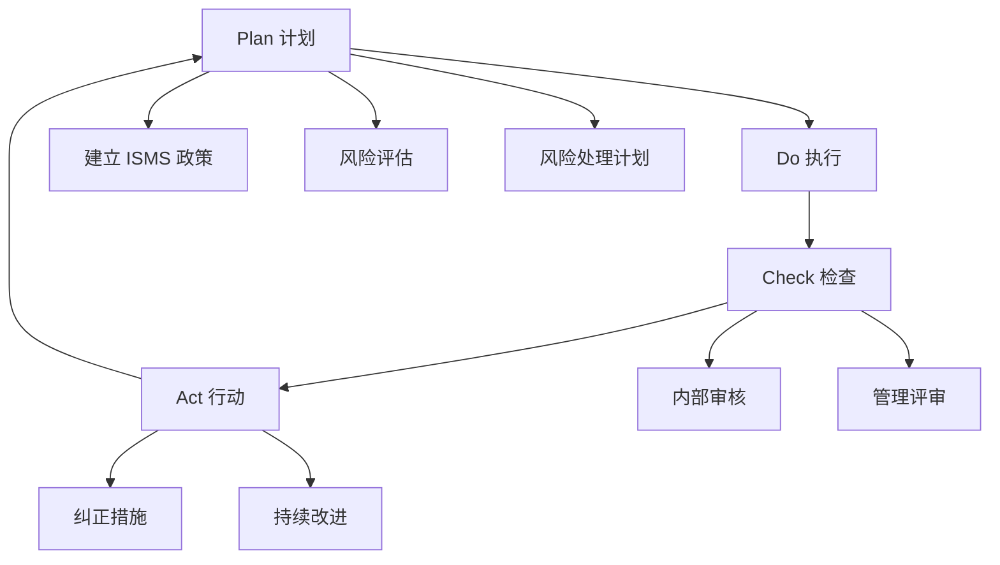
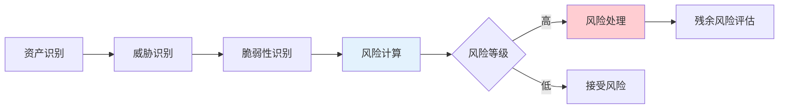
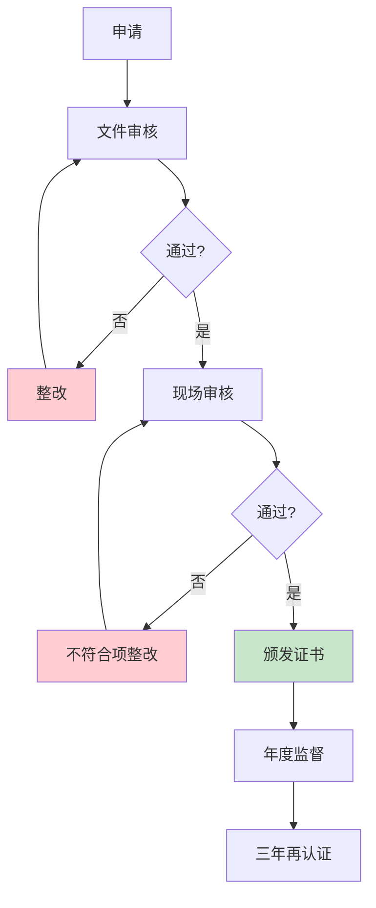

2017 年，某个知名的国际连锁酒店集团遭遇数据泄露，超过 3 亿条宾客信息被泄露。事后调查发现，该集团已通过了 ISO 27001 认证，但认证范围内的安全管理措施并未有效延伸到所有业务单元。ISO 27001 证书不能保证绝对安全，但它代表了一种系统化的安全管理方法论——企业是否真正按照这套方法论在运行，才是关键。

ISO 27001 是全球应用最广泛的信息安全管理体系标准，已有超过 7 万个组织获得认证。理解它的核心思想，才能理解为什么这张证书有说服力，以及它的局限性在哪里。

## ISO 27001 的框架与结构

### 标准发展历程

ISO 27001 起源于英国标准 BS 7799，第一版于 2005 年发布。目前有效版本为 ISO/IEC 27001:2013，2022 年版本正在过渡中。

ISO 27001 是信息安全领域的「母标准」，它定义了建立、实施、维��、持续改进信息安全管理体系（ISMS）的要求。

### 与 ISO 27002 的关系

ISO 27001 定义「要做什么」（What），ISO 27002 定义「怎么做」（How）。

ISO 27001 是可认证的标准（Certifiable Standard），提供 114 个控制要求和适用性声明模板。

ISO 27002 是指南性标准（Guideline Standard），详细解释每个控制的实现方法，不可认证。

### 与 ISO 27701 的关系

ISO 27701:2019 是 ISO 27001 在隐私保护领域的扩展，为 ISO 27001 添加了隐私管理的具体要求。处理个人信息的组织可以同时通过 ISO 27001 和 ISO 27701 认证。

## PDCA 循环

ISO 27001 基于 Deming 的 PDCA（Plan-Do-Check-Act）模型，确保信息安全管理体系持续改进：



### Plan（计划）

建立 ISMS 的策略、目标和流程：定义 ISMS 范围、制定信息安全政策、进行风险评估、确定适用性声明（SoA）。

### Do（执行）

实施计划中确定的控制措施：实施风险处理计划、实施培训和意识活动、实施技术控制。

### Check（检查）

监控和测量 ISMS 的运行效果：进行内部审核、进行管理评审、收集运行证据。

### Act（纠正）

基于检查结果采取纠正措施：实施纠正和预防措施、更新 ISMS、持续改进。

## ISMS 的建立流程

### 第一步：理解组织环境

分析组织的内外部环境：业务目标、监管要求、行业特点、技术架构、利益相关方需求。

这一步决定了 ISMS 的范围和边界。

### 第二步：定义 ISMS 范围

明确 ISMS 覆盖的范围：覆盖哪些业务单元、哪些系统、哪些地点。

范围定义需要考虑：组织的地理分布、业务单元的独立性、共享服务的影响。

### 第三步：制定信息安全政策

信息安全政策是 ISMS 的顶层文件，需要：最高管理层批准、全员发布、定期评审更新。

政策应包含：信息安全目标、风险管理承诺、资源保障承诺、持续改进承诺。

### 第四步：风险评估

风险评估是 ISMS 的核心。ISO 27001 要求组织：识别信息资产、识别威胁和脆弱性、评估风险可能性和影响、确定风险等级、制定风险处理计划。



### 第五步：风险处理计划

针对每个风险，确定处理方式：

- **规避**：消除风险源
- **减轻**：实施控制降低风险
- **转移**：购买保险或分包
- **接受**：在风险偏好范围内接受风险

风险处理后，需要评估残余风险是否可接受。

## 资产识别与风险评估

### 资产分类

信息资产分为以下类别：

**信息资产**：数据库、数据文件、合同协议、系统文档。

**软件资产**：应用软件、系统软件、开发工具。

**物理资产**：计算机设备、通信设备、存储设备、辅助设备。

**无形资产**：品牌声誉、客户信任、知识产权。

**人员资产**：员工知识、技能、经验。

### 风险评估方法

组织可以选择适合自己的风险评估方法，包括：

**定性评估**：高/中/低等级，适合初步评估。

**定量评估**：使用概率和影响数值计算，适合精确分析。

**混合评估**：定量和定性结合。

无论选择哪种方法，都需要确保：评估结果可重复、不同评估者结果一致。

## 适用性声明（SoA）

### SoA 的作用

适用性声明（Statement of Applicability）是 ISO 27001 认证审核的核心文件，列明：每个控制项是否适用、不适用的理由、适用的控制措施。

### 控制项结构

ISO 27001 附录 A 包含 114 个控制项，分为 14 个域：

| 域 | 控制项数量 | 说明 |
|---|------------|------|
| A.5 信息安全政策 | 2 | 政策管理 |
| A.6 信息安全组织 | 7 | 组织角色和职责 |
| A.7 人力资源安全 | 6 | 员工安全要求 |
| A.8 资产管理 | 10 | 信息资产管理 |
| A.9 访问控制 | 14 | 逻辑和物理访问控制 |
| A.10 密码学 | 2 | 加密控制 |
| A.11 物理和环境安全 | 15 | 物理安全 |
| A.12 操作安全 | 14 | 日常操作安全 |
| A.13 通信安全 | 7 | 网络安全 |
| A.14 系统获取和维护 | 3 | 系统生命周期管理 |
| A.15 供应商关系 | 5 | 第三方安全管理 |
| A.16 信息安全事件管理 | 7 | 事件响应 |
| A.17 业务连续性管理 | 4 | 业务连续性 |
| A.18 合规性 | 10 | 法律和合约合规 |

### SoA 格式

```java title="StatementOfApplicability.java"
/**
 * 适用性声明的简化数据模型
 * 记录每个控制项的适用状态和实施情况
 */
public class SOAControl {
    private String controlId;           // 如 "A.9.1"
    private String controlName;         // 如 "访问控制策略"
    private boolean applicable;         // 是否适用
    private String nonApplicableReason;// 不适用的理由（如果不适��）
    private String controlObjective;    // 控制目标
    private String implementationStatus;// 实施状态
    private String controlOwner;       // 控制责任人
}
```

## ISO 27001 认证流程

### 认证阶段

ISO 27001 认证分为四个阶段：

**申请阶段**：向认证机构提交申请，提供 ISMS 范围和基本信息。

**第一阶段审核（文件审核）**：认证机构审核 ISMS 文件的完整性和符合性，提出改进建议。

**第二阶段审核（现场审核）**：认证机构现场验证 ISMS 的实际运行效果。

**持续监督**：获得认证后，每年进行监督审核，三年后进行再认证。



### 认证审核的关键点

**文件审核关注**：ISMS 文件是否完整、是否符合标准要求、风险评估是否充分。

**现场审核关注**：控制措施是否按文件执行、运行证据是否充分、管理评审是否有效。

**常见不符合项**：文件更新不及时、风险评估不充分、运行记录缺失、员工培训不足。

### 认证成本

ISO 27001 认证成本取决于：组织规模（通常按人数和场所数计算）、ISMS 范围、行业复杂度、认证机构选择。

中小企业（50 人以下）的认证成本通常在 5-15 万元人民币；大型企业的成本可能达到数十万元。

## ISO 27001 vs SOC 2

| 维度 | ISO 27001 | SOC 2 |
|------|-----------|-------|
| 性质 | 国际标准，可认证 | 审计报告，不可认证 |
| 关注焦点 | 信息安全管理体系整体 | 特定服务的控制有效性 |
| 有效期 | 三年，年度监督 | 一年 |
| 评估方法 | 体系审核 | 控制测试 |
| 适用范围 | 整个组织 | 特定服务 |
| 输出物 | 认证证书 | 审计报告 |
| 认可度 | 国际通用 | 主要北美市场 |

两者可以协同实施：以 ISO 27001 建立完整管理体系，以 SOC 2 证明特定服务的控制有效性。

## 思考题

**问题 1**：某中型企业的 IT 部门有 20 人，想要获取 ISO 27001 认证。企业内部没有专职的安全人员，应该如何推进认证工作？

<details>
<summary>参考答案</summary>

建议采用「内部主导 + 外部辅助」的策略：

首先，指定一名 IT 同事兼任信息安全负责人（可由技术负责人兼任），负责 ISMS 的整体推进和协调。

其次，聘请外部咨询机构进行指导：帮助建立 ISMS 文件体系（政策、制度、流程）、指导风险评估方法论、培训内部审核员。

在咨询机构的支持下，分阶段推进：第一阶段建立文件体系（约 2-3 个月）；第二阶段试运行并收集证据（约 3-6 个月）；第三阶段进行内部审核和管理评审；第四阶段申请认证审核。

关键成功因素：最高管理层的支持、资源保障、全员参与意识。如果内部资源确实不足，也可以考虑托管方式——将部分安全工作外包给专业安全服务商，但 ISMS 的整体管理和问责仍应在内部。
</details>

**问题 2**：ISO 27001 认证通过后，企业在日常运行中最容易出现哪些问题导致监督审核发现问题？

<details>
<summary>参考答案</summary>

认证通过后最常见的问题包括：

**文件过时**：ISMS 文件未随业务变化更新，如新增系统未纳入范围、新员工未完成培训。需要在业务变更时同步更新 ISMS 文件。

**证据缺失**：控制措施执行了，但未记录或记录不完整。如安全培训举办了但未保存签到表和培训材料。需要在日常工作流程中嵌入证据收集环节。

**风险评估不更新**：风险评估结果长期不变，未反映新的威胁和脆弱性。应每年至少进行一次风险评估复核。

**内部审核形式化**：内部审核沦为走过场，未真正发现问题。应培养有能力的内部审核员，确保审核的有效性。

**不符合项整改不到位**：针对认证审核中发现的不符合项，整改措施未持续执行。应将不符合项整改纳入日常工作监控。

持续改进是关键——ISMS 不是一次性项目，而是持续运营的管理体系。
</details>
