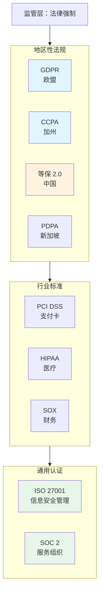

凌晨两点，某互联网公司 CTO 收到监管函：因用户数据泄露未及时通报，面临数千万元罚款。这不是极端案例——过去五年间，全球数据合规处罚金额增长超过 300%，单笔罚款动辄数亿美元。更值得深思的是，这些处罚中相当比例并非源于恶意行为，而是企业「不知道、不清楚、不理解」合规要求。

合规不是选择题，而是企业生存的底线。

## 合规的定义与内涵

**合规（Compliance）** 指的是企业遵守适用法律、法规、标准、规范以及内部规章制度的行为状态。这个看似简单的定义背后，隐藏着三个核心维度：

**法律法规合规**：遵守适用的国家/地区法律、行业法规。GDPR、CCPA、等保 2.0、SOC 2 都属于这一范畴。

**标准规范合规**：遵循行业最佳实践和国际标准，如 ISO 27001、PCI DSS、HIPAA。这些标准虽然不是法律，但往往成为合同要求或行业准入门槛。

**内部制度合规**：执行企业自身制定的安全政策、操作规程、数据管理制度。内部合规是外部合规的落地保障。

这三个维度相互嵌套：法律法规是外部强制力，标准规范是实现路径，内部制度是执行保障。

## 为什么要做合规

做合规的直接原因是**避免处罚**。但仅仅把合规视为「规避罚款」是短视的。成熟的合规体系能带来三重价值：

**风险管控**：合规框架本质上是风险管控的系统化方法论。GDPR 要求数据保护影响评估，等保要求等级保护测评，PCI DSS 要求年度审计——这些机制帮助企业识别、评估、控制风险，而不是等到事故发生才被动应对。

**业务信任**：ToB 业务中，合规认证已成为入围门槛。金融客户在选型时要求 SOC 2 报告，医疗客户要求 HIPAA 合规证明，跨国企业要求 ISO 27001 认证。没有合规资质，连投标资格都没有。

**竞争优势**：在数据敏感行业（如金融、医疗、政府），合规能力本身就是产品能力的一部分。隐私保护做得好，用户才愿意授权更多数据；数据安全有保障，企业才敢上云。

## 监管合规 vs 安全合规

很多人把「合规」和「安全」混为一谈。实际上两者有本质区别：

| 维度 | 监管合规 | 安全合规 |
|------|----------|----------|
| 驱动来源 | 法律法规、监管机构 | 威胁模型、风险评估 |
| 关注焦点 | 合法合规、避免处罚 | 防范威胁、保护资产 |
| 评估标准 | 法规条款、认证要求 | 安全事件、漏洞利用 |
| 响应方式 | 符合性检查、文档证明 | 持续监控、实时防御 |
| 时间维度 | 周期性审核 | 7×24 小时运营 |

两者不是替代关系，而是互补关系。安全合规是技术基础，监管合规是业务保障。一个系统可能很「安全」（没有已知漏洞），但可能不「合规」（缺少必要的审计日志或数据保护措施）；反过来，合规的系统通常也具备基本的安全防护能力。

## 主要合规框架概览

全球合规 landscape 复杂多样，以下是几个核心框架的定位对比：

**通用认证（ISO 27001、SOC 2）**是框架无关的最佳实践，适合作为企业安全体系的基础。**行业标准（PCI DSS、HIPAA）**针对特定数据类型有专门要求。**地区性法规（GDPR、CCPA、等保）**具有地域强制力，违规有明确罚则。

## 合规的管理体系

有效的合规管理需要一套完整的体系支撑，包括四个核心要素：

**治理结构**：明确合规工作的组织架构，包括合规负责人（DPO/CISO）、合规团队、业务部门的合规职责。合规不是安全部门一个部门的事，需要全员参与。

**制度文档**：建立覆盖所有合规要求的制度体系，包括数据保护政策、安全操作规程、应急响应流程、审计跟踪程序。制度文档是向审计师证明合规能力的主要证据。

**技术控制**：通过技术手段落实制度要求，包括访问控制、加密、监控、日志、身份认证等技术措施。技术控制是制度落地的保障。

**持续运营**：合规不是一次性项目，而是持续运营过程。需要定期评估、持续监控、定期审计、持续改进。

## 合规的实施路径

面对复杂的合规要求，建议采用「总体规划、分步实施」的策略：

**第一步：范围确定**。识别适用于企业的所有合规要求。这需要考虑业务所在行业、业务覆盖地域、处理的数据类型、客户合同要求等因素。

**第二步：差距分析**。对照适用标准，评估当前状态与要求之间的差距。差距分析不是走形式，而是发现真实问题的机会。

**第三步：优先级排序**。根据风险程度、业务影响、整改难度，确定整改优先级。高风险、高影响的差距优先处理。

**第四步：整改实施**。制定整改计划、分配资源、实施技术和管理控制。整改过程要做好记录，保留证据。

**第五步：审计认证**。选择合适的认证机构，接受第三方审计，获取合规证明。

**第六步：持续运营**。建立持续监控和改进机制，保持合规状态。

## 合规超载的挑战

面对纷繁复杂的合规要求，企业普遍面临「合规超载」困境：

**要求交叉重叠**：GDPR 要求数据保护影响评估，等保要求安全评估，SOC 2 要求风险评估——本质都是风险评估，但方法论、触发条件、输出格式各不相同。企业被迫维护多套重复的流程文档。

**标准持续演进**：法规在不断修订，标准在持续更新。GDPR 从 1995 年的指令升级为 2018 年的条例，PCI DSS 从 1.0 演进到 4.0。合规团队疲于应对变化。

**资源投入巨大**：完整的 SOC 2 Type II 审计通常需要 6-12 个月准备周期，花费数十万到上百万元。中小企业资源有限，合规成本成为沉重负担。

**解决方案是「合规即代码」**——通过自动化工具持续收集合规证据，减少人工操作；建立统一的合规框架，一次满足多个标准要求；与专业咨询机构合作，降低学习成本。

合规不是终点，而是持续改进的起点。

## 思考题

**问题 1**：如果企业同时受 GDPR 和中国《个人信息保护法》管辖，应该如何设计合规体系来避免重复工作？

参考答案

核心策略是「统一框架、差异补充」。首先识别两个法规的共同要求（如数据分类、访问控制、审计日志），建立统一的控制措施。然后针对各自独有的要求（如 GDPR 的数据保护官、中国的数据出境评估），在统一框架上补充差异内容。具体做法包括：建立统一的数据清单，同时满足 GDPR 的数据处理记录和《个保法》的处理目的说明；采用统一的加密标准，一次部署满足两套要求；使用统一的风险评估方法论，针对不同法规调整评估范围。关键是避免两套独立体系导致的管理复杂度和资源浪费。

**问题 2**：初创公司资源有限，是否应该跳过合规直接开发产品，等到规模做大再补合规？

参考答案

这是一个典型的「技术债」思维误区，合规债比技术债更难偿还。原因有三：其一，合规整改的成本随时间非线性增长——早期建立合规体系只需几万、几十万元，中期补齐可能需要几百万，后期出问题面临的是千万级罚款；其二，合规认证有最短观察期（如 SOC 2 Type II 需要至少 6 个月的运营证据），等产品上线再启动认证会延迟商业化进程；其三，ToB 业务从第一天起就有合规要求，忽视合规会失去大量客户。正确做法是「最小合规集」——选择最适合业务场景的一个标准作为基础（如 SOC 2），建立最小可行的合规体系，随业务发展逐步扩展。

