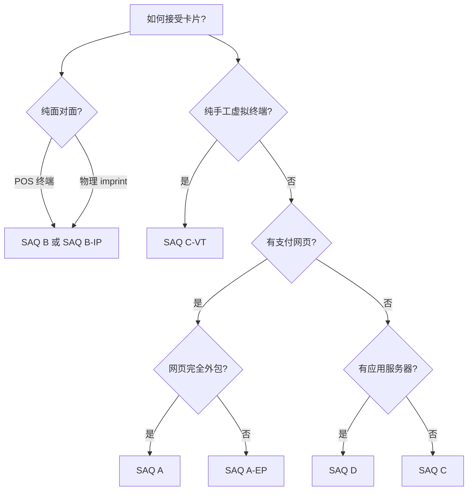
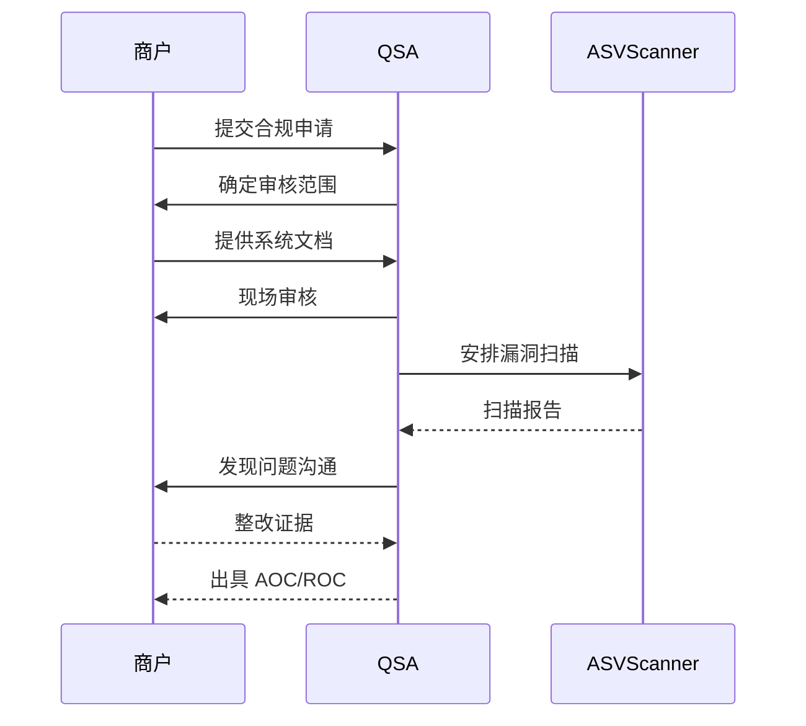

某电商公司在一次大促中创下销量记录，但第二天却收到了银行的紧急通知：与之相连的某支付网关被发现处理过盗刷卡片，该电商公司的交易被全部暂停。调查发现，该公司虽然通过了 PCI DSS 认证，但认证范围内的系统只覆盖了支付流程的一部分——而泄露点恰好在认证范围之外。

PCI DSS 的核心挑战在于：它要求覆盖所有存储、处理或传输持卡人数据的系统。边界划定错误，即使通过认证也无法真正保护支付数据。

## PCI DSS 的背景与适用范围

### 发展历程

PCI DSS（Payment Card Industry Data Security Standard）由 Visa、MasterCard 等主要支付品牌于 2004 年联合发布，旨在统一支付卡行业的安全标准。

目前有效版本为 PCI DSS 4.0（2022 年 3 月发布），正在从 3.2.1 版本过渡。

### 适用范围

任何处理、存储或传输持卡人数据（CHD - Cardholder Data）的实体都受 PCI DSS 约束，包括：商户（处理支付卡的商家）、收单机构（与商户签约的金融机构）、发卡机构（发行支付卡的金融机构）、支付处理商（处理支付交易的第三方）。

### 持卡人数据定义

持卡人数据包括：主账号（PAN - Primary Account Number）、持卡人姓名、过期日期、服务代码。敏感验证数据（SAD）包括磁条数据、CVV2、 PIN 码——SAD 不得存储。

## PCI DSS 的 12 个要求

PCI DSS 4.0 包含 12 个核心要求，分为 6 个目标：

```mermaid
flowchart TB
    subgraph 目标1：网络安全
        A1[要求1：防火墙配置]
        A2[要求2：无默认供应商密码]
    end
    
    subgraph 目标2：数据保护
        A3[要求3：存储数据加密]
        A4[要求4：传输数据加密]
    end
    
    subgraph 目标3：漏洞管理
        A5[要求5：防病毒软件]
        A6[要求6：安全补丁]
    end
    
    subgraph 目标4：访问控制
        A7[要求7：访问控制]
        A8[要求8：身份认证]
        A9[要求9：物理安全]
    end
    
    subgraph 目标5：网络监控
        A10[要求10：日志监控]
        A11[要求11：定期测试]
    end
    
    subgraph 目标6：策略
        A12[要求12：安全策略]
    end
```

### 12 个要求详解

**要求 1：安装并维护网络控制**——配置并维护防火墙，隔离持卡人数据网络。

**要求 2：不使用供应商提供的默认密码**——更改所有默认账户和密码。

**要求 3：保护存储的持卡人数据**——加密 PAN，截断显示，掩码存储。

**要求 4：加密传输中的持卡人数据**——使用 TLS 1.2+，保护传输通道。

**要求 5：维护防病毒程序**——部署并维护防病毒软件。

**要求 6：开发并维护安全系统**——安全补丁、代码安全、开发环境隔离。

**要求 7：按业务需要限制数据访问**——最小权限原则。

**要求 8：识别并验证访问**——唯一 ID、多因素认证、密码策略。

**要求 9：限制物理访问**——物理卡片数据访问控制。

**要求 10：追踪所有数据访问**——日志、审计轨迹、变更追踪。

**要求 11：定期测试安全系统**——渗透测试、漏洞扫描、IDS 监控。

**要求 12：维护信息安全策略**——安全策略、培训、供应商管理。

## 合规等级

PCI DSS 根据商户的交易量和处理方式划分四个合规等级：

| 等级 | 年交易量 | 合规要求 | 审核频率 |
|------|----------|----------|----------|
| 等级一 | Visa 年交易 `$>` 600 万，或符合其他条件 | 年度 QSA/AOC 审核 | 年度 |
| 等级二 | Visa 年交易 100 万至 600 万 | 年度 SAQ + 季度 ASV 扫描 | 季度扫描 |
| 等级三 | Visa 年交易 2 万至 100 万 | 年度 SAQ + 季度 ASV 扫描 | 季度扫描 |
| 等级四 | Visa 年交易 `<` 2 万 | 年度 SAQ + 季度 ASV 扫描 | 季度扫描 |

交易量的计算基于发卡机构的 Visa 交易量，即使商户同时接受 MasterCard 也按 Visa 标准计算。

## SAQ（自评问卷）

### SAQ 类型

SAQ（Self-Assessment Questionnaire）是商户自行评估合规的方式，仅适用于等级二至四的商户。

| SAQ 类型 | 适用场景 | 要求数量 |
|----------|----------|----------|
| SAQ A | 纯外包（所有支付处理外包） | 22 项 |
| SAQ A-EP | 纯外包但通过网站接受卡片 | 22 项 + 补充要求 |
| SAQ B | 仅使用 POS 终端或物理 imprint | 31 项 |
| SAQ B-IP | 仅使用 PTS 批准终端（IP 连接） | 31 项 + IP 要求 |
| SAQ C-VT | 仅通过虚拟终端手动输入 | 33 项 |
| SAQ C | 支付连接系统（非网页、非 IP 终端） | 80 项 |
| SAQ D | 所有其他场景 | 326 项 |

### SAQ 选择指南

选择正确的 SAQ 类型是合规��关键：



**SAQ A 是最简单的形式**——所有卡片处理完全外包，商户只通过第三方支付页面接收卡片，完全不存储、处理或传输持卡人数据。这是最安全的做法，也是合规成本最低的选择。

## QSA 审核流程

### QSA 的角色

QSA（Qualified Security Assessor）是经过 PCI 安全标准委员会认证的安全评估机构。只有 QSA 才能对等级一商户进行正式审核。

### 审核流程

QSA 审核通常分为五个阶段：

**范围界定**：确定覆盖哪些系统、网络和流程。范围界定必须覆盖所有 CHD 存储、处理、传输的系统。

**合规性评估**：逐项检查 12 个要求，收集证据、访谈人员、检查配置。

**漏洞扫描**：使用 ASV（Approved Scanning Vendor）进行漏洞扫描。

**渗透测试**：评估网络安全和应用安全。

**报告编制**：出具 AOC（Attestation of Compliance）和 ROC（Report on Compliance）。



### ASV 漏洞扫描

ASV（Approved Scanning Vendor）是 PCI 委员会认可的漏洞扫描机构。等级一商户必须每季度进行 ASV 扫描，所有商户在合规审核前必须完成扫描。

扫描必须覆盖所有面向互联网的系统，扫描结果必须「最初準拠」（Initial Compliance）或通过重新扫描后达到合规。

## Tokenization 与 PCI DSS

### Tokenization 的概念

Tokenization（令牌化）是用随机生成的令牌替代 PAN 的技术。被替换的 PAN 可以安全存储在令牌化服务器中，令牌本身不是敏感数据。

### 合规优势

正确实施的 tokenization 可以显著减少 PCI DSS 合规范围：商户系统只存储和处理的令牌，而非 PAN，因此合规范围大幅缩小。

### 风险与挑战

但 tokenization 不是万能药：

**令牌化服务器必须合规**：如果令牌化服务器在商户网络内部，服务器本身仍在合规范围内。

**令牌必须是随机值**：如果令牌可以反向推算出 PAN，则失去合规价值。

**范围界定必须准确**：错误认为「用了 tokenization 就不需要合规」会导致严重后果。

### P2PE 方案

P2PE（Point-to-Point Encryption）是一种端到端加密方案：支付终端使用硬件加密，只有授权的解密服务可以还原 PAN。即使被截获也无法读取。

P2PE 方案可以显著减少商户的合规范围，但需要使用经 PCI 认证的 P2PE 解决方案。

## 常见合规误区

### 误区一：合规范围只包括生产系统

PCI DSS 关注所有存储、处理或传输 CHD 的系统，包括测试环境、开发环境和备份系统。

### 误区二：使用外部支付平台就不需要合规

如果商户通过网页或 API 直接发送卡片数据，仍在 PCI DSS 范围内。

### 误区三：合规就是一次性的

PCI DSS 合规是持续的要求——每年重新评估、持续监控、立即响应安全事件。

### 误区四：合规可以转移

商户对自己的 PCI DSS 合规负责，不能将责任转移给收单机构或支付处理商。

## 合规实施建议

### 技术层面

**最小化存储**：尽可能不存储持卡人数据，使用 tokenization 或外包支付页面。

**网络隔离**：将处理 CHD 的系统隔离在单独的网段，通过防火墙控制访问。

**加密传输**：全站 HTTPS，使用 TLS 1.2+。

**访问控制**：最小权限，定期审查账户。

### 管理层面

**安全策略**：制定并维护支付卡安全策略。

**员工培训**：定期培训员工安全意识。

**供应商管理**：确保所有处理 CHD 的第三方签署 PCI 合规协议。

**持续监控**：部署日志监控和告警机制。

## 思考题

**问题 1**：某小型电商公司使用第三方支付页面处理所有支付，月交易量约 5000 笔。该公司应该如何选择 SAQ 类型？

<details>
<summary>参考答案</summary>

根据 SAQ 选择规则：该公司使用纯外包支付页面，所有卡片处理完全通过第三方完成。如果支付页面是该公司运营的网页直接与支付网关交互（而非通过 iframe 嵌入），则属于 SAQ A-EP。

建议：该电商选择 SAQ A-EP 或迁移到更安全的架构（使用 iframe 嵌入第三方支付页面，转为 SAQ A）。SAQ A-EP 有 22 项基础要求加上一系列补充要求，需要季度 ASV 扫描；如果迁移到完全托管的支付页面，可以选择 SAQ A，仅需 22 项要求，显著减少合规负担。

无论哪种方式，该公司应确保其网站不会以任何方式记录、存储或传输卡片数据——包括日志文件、错误信息等。

</details>

**问题 2**：某公司通过了 PCI DSS 合规审核，但一年后发生数据泄露。请问该公司是否仍然需要承担违规责任？

<details>
<summary>参考答案</summary>

需要。PCI DSS 合规是一次性评估，不提供「持续合规证明」或「豁免权」。

合规审核的状态与发生泄露时的实际安全状态可能存在差距。审核通过后，如果系统变更、新增功能或安全措施退化，合规状态可能已经失效。

实际案件中，支付品牌和收单机构会评估泄露的原因和公司的安全实践。即使公司在过去某个时间点通过合规，如果调查显示泄露源于本应通过合规防止的问题（如未打补丁、未加密存储、范围界定错误），公司仍可能面临罚款和处罚。

关键教训：PCI DSS 合规应该是持续的安全实践，而非一次性通过审核。
</details>
