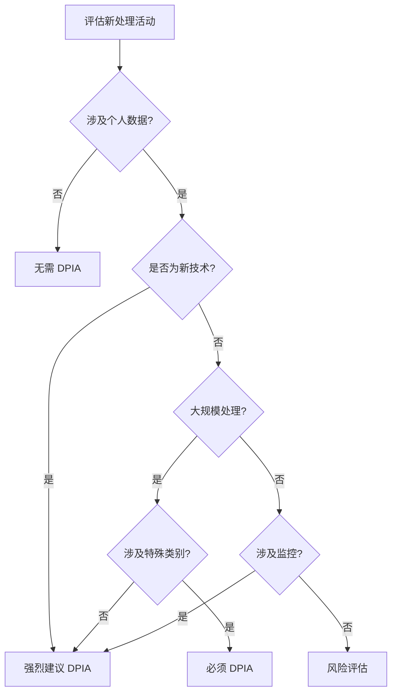
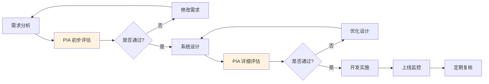

某城市在推行智慧城市项目时，计划在街道上部署人脸识别摄像头。技术团队完成了系统设计，安全团队进行了渗透测试。但在项目上线前，隐私部门提出质疑：这套系统收集的人脸数据是否必要？是否会侵犯公民隐私？有没有替代方案？

这是一个典型的 PIA 介入时机——在系统上线前，而不是上线后才发现问题。

隐私影响评估（PIA）是识别和缓解隐私风险的关键机制。它的价值不是「阻止项目」，而是「让项目以更保护隐私的方式落地」。

## 隐私影响评估的定义

### 什么是 PIA

PIA（Privacy Impact Assessment，隐私影响评估）是一种系统性的评估方法，用于识别数据处理活动可能对个人隐私产生的影响，并提出缓解措施。

PIA 的核心目的是「在设计阶段发现问题」，而非「在事故发生后补救」。

### PIA 的价值

**风险识别**：在项目早期识别潜在的隐私风险。

**决策支持**：为管理层提供隐私风险相关的决策信息。

**合规证明**：证明组织已尽到隐私保护的注意义务。

**设计改进**：帮助优化系统设计，在保护隐私的同时实现业务目标。

### 与 DPIA 的关系

DPIA（Data Protection Impact Assessment）与 PIA 本质上是同一概念：

- **DPIA**：GDPR 第 35 条定义的术语，在欧盟语境下使用
- **PIA**：更通用的术语，在其他司法管辖区（如加拿大、英国）使用

两者核心方法论相同，只是在具体要求上有细微差异。

## PIA 的触发条件

### GDPR 下的 DPIA 触发条件

根据 GDPR 第 35 条，以下情况必须进行 DPIA：

**系统性分析**：对个人数据进行系统性和定期性的评估，包括画像。

**大规模处理特殊类别数据**：健康、宗教、性取向、种族、政治观点等。

**大规模监控公共区域**：系统性地监控公共区域。

**儿童数据**：处理儿童个人数据。

**新技术**：采用可能对个人权利和自由产生高风险的新技术。

**缺乏直接联系的处理**：将个人数据用于与最初收集目的不符的情况。

### 行业触发条件

某些行业对 DPIA 有更具体的要求：

**公共部门**：多数国家要求公共部门的重大数据处理项目进行 PIA。

**高风险行业**：医疗、金融、交通等行业通常有强制 PIA 要求。

### 评估是否需要 DPIA

可以使用「筛查问卷」判断是否需要 DPIA：



## PIA 的实施步骤

### 第一步：描述数据处理

在开始评估前，需要全面描述计划的处理活动：

**处理目的**：为什么需要处理这些数据？处理的合法基础是什么？

**数据类别**：收集哪些类型的个人数据？包括直接标识符和间接标识符。

**数据主体**：涉及哪些群体的数据？

**数据流**：数据从哪里来、经过什么处理、最终流向哪里？

**技术架构**：使用什么系统、存储在哪里、如何访问？

```java title="ProcessingDescription.java"
/**
 * 数据处理活动描述���板
 * 用于 PIA 第一步
 */
public class ProcessingDescription {
    private String processingName;
    private String processingPurpose;
    private String legalBasis;  // 合法性基础
    private List<DataCategory> dataCategories;
    private List<DataSubject> dataSubjects;
    private DataFlow dataFlow;
    private TechnicalArchitecture architecture;
}

/**
 * 数据流描述
 */
public class DataFlow {
    private List<DataSource> sources;
    private List<DataProcessor> processors;
    private List<DataDestination> destinations;
    private List<String> crossBorderTransfers;
}
```

### 第二步：必要性评估

评估数据处理是否真正必要：

**处理必要性**：该处理是否实现声明目的所必需？

**数据最小化**：收集的数据量是否最小化？

**留存期限**：数据保留时间是否合理？

**替代方案**：是否有更保护隐私的替代方案？

### 第三步：风险识别

系统识别可能对数据主体隐私产生的影响：

**风险类型**：

- **隐私侵犯风险**：数据处理是否侵犯数据主体的隐私权？
- **歧视风险**：处理是否可能导致歧视性结果？
- **经济损失风险**：数据泄露是否可能导致数据主体经济损失？
- **声誉损害风险**：数据滥用是否可能损害数据主体声誉？

**风险评估矩阵**：

| 影响程度 | 低可能性 | 中可能性 | 高可能性 |
|----------|----------|----------|----------|
| 高影响 | 中风险 | 高风险 | 高风险 |
| 中影响 | 低风险 | 中风险 | 高风险 |
| 低影响 | 低风险 | 低风险 | 中风险 |

### 第四步：风险缓解

针对识别的风险，提出缓解措施：

**设计层面的缓解**：从设计上减少对隐私的需求。

**技术层面的缓解**：加密、访问控制、脱敏等技术措施。

**管理层面的缓解**：政策、流程、培训等管理措施。

**合同层面的缓解**：与第三方的数据处理协议。

### 第五步：文档化与审查

**文档化**：将评估过程完整记录，形成 PIA 报告。

**内部审查**：由隐私团队或 DPO 审查评估结果。

**管理层批准**：重大风险需要管理层审批。

**公开披露**：部分法规要求公开 PIA 或提供简要版本。

## PIA 文档模板

### 文档结构

```markdown
# 隐私影响评估报告

## 1. 项目概述
- 项目名称
- 项目描述
- 项目负责人

## 2. 处理活动描述
- 处理目的
- 合法性基础
- 数据类别
- 数据主体
- 数据流

## 3. 必要性评估
- ��理必要性分析
- 数据最小化评估
- 留存期限评估

## 4. 风险评估
| 风险编号 | 风险描述 | 可能性 | 影响 | 风险等级 |
|----------|----------|--------|------|--------|
| R-001 | ... | 高 | 中 | 高 |

## 5. 风险缓解措施
| 风险编号 | 缓解措施 | 责任人 | 完成日期 |
|----------|----------|--------|----------|
| R-001 | ... | ... | ... |

## 6. 结论
- 总体风险评估
- 建议
- 审批意见
```

### 关键要素

**数据处理描述**要具体：不是泛泛的「收集用户信息」，而是「收集用户的姓名、手机号和购买历史，用于售后服务」。

**风险评估要有依据**：每个风险评级需要有理由支撑。

**缓解措施要可执行**：每个措施需要有明确的负责人和时间表。

## PIA 的持续更新

### 何时更新 PIA

**项目重大变更**：项目范围、技术架构、处理目的发生重大变化时。

**新风险出现**：外部环境变化（如法规更新）引入新风险时。

**缓解措施失效**：原措施无法有效降低风险时。

### 定期复核

建议对重大处理活动的 PIA 进行年度复核，评估：

- 原评估的风险是否已变为现实
- 缓解措施是否仍然有效
- 是否有新的风险出现

## PIA 的最佳实践

### 时机选择

**越早越好**：PIA 应在项目设计阶段进行，而非开发完成后。

**迭代进行**：对于大型项目，可以在不同阶段分别进行 PIA。

**跨部门参与**：PIA 需要技术、业务、法务、隐私团队的协作。

### 与开发流程整合

将 PIA 整合到项目管理流程中：



### DPO 的角色

数据保护官（DPO）在 PIA 中的角色包括：

- 提供 PIA 方法论指导
- 审核 PIA 报告
- 提出改进建议
- 监管合规

DPO 不应代替业务部门进行 PIA，而应作为咨询和支持角色。

## 思考题

**问题 1**：某公司计划上线一个基于用户行为数据的个性化推荐系统。请设计该场景的 PIA 流程。

<details>
<summary>参考答案</summary>

PIA 流程应包含以下步骤：

**第一步：处理活动描述**——收集用户的浏览、点击、购买等行为数据，通过算法分析生成个性化推荐。合法性基础：合法利益（改善用户体验）或同意。

**第二步：必要性评估**——分析行为数据对推荐准确性的贡献，评估是否有更少侵入的替代方案（如基于商品类别的简单规则）。

**第三步：风险识别**——隐私侵犯风险（用户感觉被监视）、画像风险（算法歧视）、数据泄露风险。

**第四步：风险缓解**——提供用户关闭个性化推荐的选项；使用脱敏数据训练模型；实施数据加密和访问控制。

**第五步：文档化**——形成完整的 PIA 报告，由隐私团队审核，管理层批准后方可上线。
</details>

**问题 2**：在 PIA 过程中，如果发现处理活动的风险非常高，团队应该如何决策？

<details>
<summary>参考答案</summary>

高风险不一定是「否决项目」，而是需要更审慎的决策：

**风险缓解优先**：首先评估是否可以进一步优化设计，降低风险到可接受水平。很多时候，通过调整处理方式、减少数据收集范围、增加用户控制选项，风险可以显著降低。

**管理层决策**：如果风险仍然较高，需要提交管理层决策。管理层需要了解风险的具体内容、潜在影响和缓解措施。

**监管咨询**：对于极高风险的处理活动，可以主动咨询监管机构（如 DPA），获取官方指导。

**选择替代方案**：如果无法有效降低风险，可能需要考虑暂缓项目或采用替代方案（如不收集行为数据，仅使用用户明确提供的信息）。

**文档化**：无论最终决策如何，都需要完整记录 PIA 过程和决策依据，以证明已尽到注意义务。
</details>
