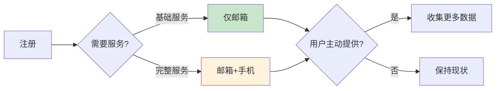
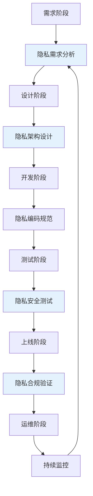

很多安全团队习惯于在系统开发完成后才考虑隐私保护——加一个隐私政策、加一个同意弹窗、加一个数据删除功能。这种「事后补救」的方式往往效果不佳：架构已经定型，改起来代价巨大；隐私政策与实际处理不符，用户投诉不断。

隐私设计（Privacy by Design）提出了一种不同的思路：将隐私保护「嵌入」到系统设计和开发的每一个环节，而不是在最后再加上去。

## 隐私设计的起源与发展

### 起源

隐私设计（Privacy by Design）由加拿大隐私专员 Ann Cavoukian 于 1990 年代提出，随后被整合到 GDPR 中。

GDPR 第 25 条明确规定：「控制者应当……采用适当的技术措施，如假名化……这些措施应当确保在考虑最新技术和实施成本后，能够满足数据最小化原则。」

### 与「事后补救」的区别

**事后补救的问题**：

- 架构已定型，改造代价高
- 功能冲突，改动可能影响业务
- 隐私政策与实际不一致
- 用户体验受损（同意弹窗突兀）

**隐私设计的优势**：

- 从根本上减少隐私问题
- 与系统架构自然融合
- 降低合规成本
- 更好的用户体验

## 隐私设计七项原则

### 原则一：预防优先，而非补救

隐私问题应以预防为主，而非事后补救。设计的系统应当本身就对隐私友好，而不是依赖外部控制来弥补设计缺陷。

**实现方式**：在架构设计阶段就考虑隐私；使用「隐私影响评估」识别潜在问题；默认采用保护隐私的配置。

### 原则二：隐私作为默认设置

系统应当默认保护用户隐私，无需用户主动采取行动。隐私不应该是「可选的附加功能」，而应该是默认状态。

**实现方式**：最小化收集——默认只收集最少数据；默认匿名化——需要时才收集可识别信息；默认保留最短时间——到期末自动删除。

### 原则三：隐私嵌入设计

隐私保护应当嵌入到系统的架构设计和核心功能中，而非作为独立层叠加。隐私不是「加上去的」，而是「内置的」。

**实现方式**：在数据建模阶段考虑隐私；使用假名化和加密技术；架构设计中包含数据隔离。

### 原则四：完整功能——零和、包容，而非零和

隐私设计追求隐私与功能的平衡，而非牺牲一方换取另一方。目标是让隐私保护和业务功能「双赢」。

**实现方式**：使用技术手段在保护隐私的同时保留功能（如联邦学习保留分析能力同时保护原始数据）；渐进式收集（必要时才收集更多数据）；聚合分析替代个体分析。

### 原则五：端到端安全——全生命周期保护

数据从产生到销毁的全生命周期都应当受到保护。安全问题只在一个环节出现，就会影响整个链条。

**实现方式**：安全设计覆盖数据全生命周期；数据分类分级管理；统一的加密、访问控制、审计策略；安全的删除机制。

### 原则六：可见性和透明度

系统应当以透明的方式运行，用户和组织能够了解数据的处理方式。隐私实践应当是可验证的，而非「黑箱」操作。

**实现方式**：清晰的隐私声明；用户可访问的数据报告；可验证的隐私认证；公开的隐私实践报告。

### 原则七：尊重用户隐私——以用户为中心

系统设计应当尊重用户隐私，以用户为中心。强大的隐私保护应当伴随着良好的用户体验。

**实现方式**：用户友好的隐私控制界面；清晰的同意管理；简化的隐私设置。

## 数据最小化原则的实现

### 概念

数据最小化要求只收集实现处理目的所必需的最少数据。不是「先收集再删除」，而是「只收集必要的」。

### 实现策略

**渐进式收集**：在用户旅程的不同阶段逐步收集数据。



**按需收集**：仅在需要时才收集数据，而非提前收集备用。

**字段级评估**：对每个数据字段评估其必要性。

```java title="DataMinimizationValidator.java"
/**
 * 数据最小化验证器
 * 在数据收集时进行必要性检查
 */
@Service
public class DataMinimizationValidator {
    
    private final Map<String, List<RequiredField>> purposeFieldMapping;
    
    /**
     * 验证数据收集请求是否符合最小化原则
     */
    public MinimizationCheckResult validateCollection(CollectionRequest request) {
        List<String> requiredFields = purposeFieldMapping.get(request.getPurpose());
        List<String> requestedFields = request.getFields();
        
        List<String> unnecessaryFields = requestedFields.stream()
            .filter(field -> !requiredFields.contains(field))
            .collect(Collectors.toList());
        
        if (!unnecessaryFields.isEmpty()) {
            return MinimizationCheckResult.failure(
                "以下字段对于 " + request.getPurpose() + " 目的并非必需: " 
                + unnecessaryFields
            );
        }
        
        return MinimizationCheckResult.success();
    }
}
```

## 目的限定原则的实现

### 概念

目的限定原则要求数据只能用于明确的、合法的处理目的，不得用于与目的不符的其他用途。

### 实现策略

**明确的目的定义**：在数据收集时明确声明处理目的。

**目的范围检查**：在数据使用时验证目的一致性。

**重新识别别的限制**：防止去标识化数据被重新识别。

```java title="PurposeLimitedAccess.java"
/**
 * 目的限定访问控制
 * 确保数据仅用于声明的目的
 */
@Service
public class PurposeLimitedAccess {
    
    private final AccessControlService accessControl;
    
    /**
     * 在目的限定下访问数据
     */
    public DataAccessResult accessData(Long userId, String purpose, 
                                      List<String> fields) {
        // 验证用户对该目的的授权
        UserAuthorization auth = accessControl.getAuthorization(userId, purpose);
        
        if (!auth.isAuthorized()) {
            throw new UnauthorizedAccessException(
                "用户无 " + purpose + " 目的的访问权限"
            );
        }
        
        // 限制只能访问该目的所需的字段
        List<String> allowedFields = auth.getAllowedFields();
        List<String> requestedFields = fields.stream()
            .filter(allowedFields::contains)
            .collect(Collectors.toList());
        
        // 记录访问日志
        auditService.logPurposeLimitedAccess(userId, purpose, requestedFields);
        
        return dataRepository.findById(userId, requestedFields);
    }
}
```

## 存储限制原则的实现

### 概念

存储限制原则要求数据保留时间仅限于实现处理目的所必需的时间。目的达成后，数据应当被删除或匿名化。

### 实现策略

**自动化的留存管理**：设置自动化的数据删除机制。

**分层的存储策略**：热数据、温数据、冷数据分别处理。

**留存期限标记**：每个数据字段标记留存期限。

```java title="StorageLimitationService.java"
/**
 * 存储限制服务
 * 实现数据留存期限的自动化管理
 */
@Service
public class StorageLimitationService {
    
    private final DataRepository dataRepository;
    private final ScheduledTaskService scheduledTask;
    
    /**
     * 配置数据留存策略
     */
    public void configureRetentionPolicy(String dataType, 
                                         Duration retentionPeriod,
                                         DisposalMethod disposalMethod) {
        RetentionPolicy policy = RetentionPolicy.builder()
            .dataType(dataType)
            .retentionPeriod(retentionPeriod)
            .disposalMethod(disposalMethod)
            .nextDisposalDate(calculateNextDate(retentionPeriod))
            .build();
        
        retentionPolicyRepository.save(policy);
    }
    
    /**
     * 每日检查并执行过期数据删除
     */
    @Scheduled(cron = "0 0 2 * * ?")  // 每天凌晨 2 点
    public void processExpiredData() {
        List<RetentionPolicy> expiredPolicies = 
            retentionPolicyRepository.findExpiredPolicies();
        
        for (RetentionPolicy policy : expiredPolicies) {
            List<Long> expiredRecordIds = dataRepository
                .findExpiredRecords(policy.getDataType(), policy.getRetentionPeriod());
            
            for (Long recordId : expiredRecordIds) {
                performDisposal(recordId, policy.getDisposalMethod());
            }
            
            auditService.logBatchDisposal(
                policy.getDataType(), 
                expiredRecordIds.size(), 
                policy.getDisposalMethod()
            );
        }
    }
}
```

## 透明原则的实现

### 概念

透明原则要求数据处理活动对数据主体可见。用户应当了解：谁在收集数据、收集什么数据、为什么收集、如何使用。

### 实现策略

**机器可读的隐私声明**：提供结构化的数据使用信息。

**用户数据报告**：让用户查看自己的数据被如何使用。

**实时通知**：数据用途变更时通知用户。

```java title="TransparencyService.java"
/**
 * 透明度服务
 * 向用户提供数据处理信息
 */
@Service
public class TransparencyService {
    
    /**
     * 生成用户数据处理报告
     */
    public DataProcessingReport generateUserReport(Long userId) {
        User user = userRepository.findById(userId);
        
        return DataProcessingReport.builder()
            .userId(userId)
            .generatedAt(Instant.now())
            // 已收集的数据类别
            .dataCategories(dataCategoryRepository.findByUserId(userId))
            // 数据收集来源
            .collectionPurposes(purposeRepository.findActiveByUserId(userId))
            // 数据共享对象
            .dataRecipients(recipientRepository.findByUserId(userId))
            // 数据保留期限
            .retentionPeriods(retentionRepository.findByUserId(userId))
            // 用户权利行使记录
            .rightsExercised(rightsRepository.findByUserId(userId))
            .build();
    }
}
```

## 问责原则的实现

### 概念

问责原则要求控制者能够证明其数据处理活动符合隐私保护原则。仅仅声明合规是不够的，需要有实际的机制来确保和证明合规。

### 实现策略

**文档化的实践**：维护数据处理活动的完整文档。

**内部审计机制**：定期审计隐私实践。

**培训与意识**：确保员工理解隐私责任。

**外部认证**：获取隐私认证（如 ISO 27701）。

```java title="AccountabilityService.java"
/**
 * 问责服务
 * 提供合规证明
 */
@Service
public class AccountabilityService {
    
    private final AuditLogService auditLog;
    
    /**
     * 记录数据处理活动
     * 用于证明合规
     */
    public void recordProcessingActivity(ProcessingActivity activity) {
        ProcessingRecord record = ProcessingRecord.builder()
            .activityType(activity.getType())
            .dataCategories(activity.getDataCategories())
            .purpose(activity.getPurpose())
            .legalBasis(activity.getLegalBasis())
            .timestamp(activity.getTimestamp())
            .performedBy(activity.getPerformedBy())
            .build();
        
        recordRepository.save(record);
        
        // 触发合规检查
        complianceChecker.checkCompliance(record);
    }
    
    /**
     * 生成合规报告
     */
    public ComplianceReport generateComplianceReport(Period period) {
        List<ProcessingRecord> records = recordRepository.findByPeriod(period);
        List<ComplianceViolation> violations = complianceChecker.findViolations(records);
        
        return ComplianceReport.builder()
            .period(period)
            .totalRecords(records.size())
            .violations(violations)
            .compliant(computeCompliantScore(records, violations))
            .build();
    }
}
```

## 隐私设计的工程实践

### 架构层面的实践

**数据分离**：将个人可识别数据与业务数据分离存储。

**假名化架构**：使用假名替代直接标识符存储。

**加密存储**：敏感数据加密存储。

**微服务隔离**：按功能模块隔离数据。

### 开发流程中的实践



### 编码实践

```java title="PrivacyByDesignPatterns.java"
/**
 * 隐私设计的编码实践示例
 */

// 实践 1：最小化参数
public class UserRegistration {
    // 错误：过早收集
    public void register(String email, String phone, String address, 
                        String education, String income) {
        // ...
    }
    
    // 正确：渐进式收集
    public RegistrationResult registerMinimal(String email) {
        // 只收集必要信息
        return userRepository.create(email);
    }
    
    // 补充信息需要用户主动提供
    public void addOptionalInfo(Long userId, OptionalInfo info) {
        // ...
    }
}

// 实践 2：假名化存储
public class AnalyticsService {
    // 错误：直接存储用户标识
    public void record(User user, String action) {
        analyticsLog.save(user.getId(), action);
    }
    
    // 正确：使用假名
    public void record(String pseudonymizedId, String action) {
        String pseudonym = pseudonymizer.generate(user.getId());
        analyticsLog.save(pseudonym, action);
    }
}

// 实践 3：加密敏感字段
@Entity
public class User {
    @Id
    private Long id;
    
    // 普通字段
    private String nickname;
    
    // 敏感字段加密存储
    @Encrypted
    private String phone;
    
    @Encrypted
    private String idCard;
}
```

## 隐私设计与安全设计的结合

### 两者的关系

隐私设计和安全设计有很强的关联，但关注点不同：

| 维度 | 安全设计 | 隐私设计 |
|------|----------|----------|
| 关注点 | 防止数据被攻击者窃取 | 防止数据被滥用 |
| 原则 | CIA（机密性、完整性、可用性） | 隐私七原则 |
| 时间关注 | 全生命周期 | 全生命周期 |
| 核心问题 | 攻击者能看到什么 | 用户应该知道什么 |

### 结合实践

**最小权限 + 最小收集**：安全设计的最小权限原则与隐私设计的数据最小化原则一致。

**加密 + 假名化**：安全设计的加密与隐私设计的假名化可以结合使用。

**审计日志 + 透明性**：安全审计与隐私透明度需求重叠。

**访问控制 + 目的限定**：访问控制是实现目的限定的基础。

## 思考题

**问题 1**：某公司计划开发一个新的社交应用，用户可以发布图文动态并与其他用户互动。请从隐私设计角度设计该应用的数据架构。

<details>
<summary>参考答案</summary>

从隐私设计角度建议：

**数据最小化**：默认匿名发布（只显示昵称）；地理位置可选且模糊化；设备信息不收集。

**目的限定**：发布内容仅用于在应用内展示；如需用于推荐算法，需单独获取同意。

**存储限制**：设置内容自动过期机制（如一年前的动态可选择删除）；用户注销后自动删除内容。

**假名化设计**：使用假名存储分析数据；原始用户标识与分析数据分离。

**用户控制**：提供细致的隐私设置（谁可以看到动态）；提供内容删除和撤回功能。

**透明度**：在用户协议中清晰说明数据使用；提供「我的数据」报告功能。
</details>

**问题 2**：如何向开发团队推广隐私设计的理念和方法？

<details>
<summary>参考答案</summary>

推广隐私设计的策略包括：

**培训教育**：定期举办隐私设计培训；使用真实案例说明隐私问题的影响；将隐私纳入新员工入职培训。

**工具支持**：提供隐私设计检查清单；开发隐私友好的代码库和框架；提供自动化工具检查隐私合规。

**流程整合**：将隐私检查整合到代码评审流程；在技术设计文档中要求包含隐私设计章节；将隐私需求纳入需求管理。

**激励措施**：对优秀隐私设计实践给予认可；在团队内部分享隐私设计最佳实践。

**持续改进**：定期回顾隐私相关事故；根据反馈持续改进隐私设计实践。

关键是让隐私设计成为开发团队日常工作的一部分，而非额外的负担。
</details>
