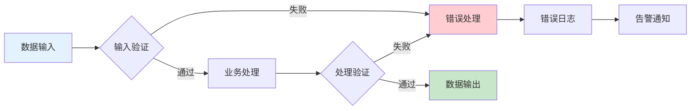

SOC 2 审计的核心是对「控制措施」进行评估。但控制措施不是凭空存在的，它们围绕特定的「信任服务原则」组织。这些原则定义了「好」的控制系统应该具备的特性。理解这些原则，才能理解 SOC 2 审计在评什么、怎么评、以及什么算「通过」。

五大信任服务原则是 SOC 2 的骨架，每个原则都有一套完整的控制要求。

## 信任服务原则概述

AICPA 定义的五大信任服务原则（Trust Services Principles）包括：

| 原则 | 英文 | 核心关注 |
|------|------|----------|
| 安全性 | Security | 系统和数据不被未授权访问 |
| 可用性 | Availability | 系统持续可用的能力 |
| 处理完整性 | Processing Integrity | 数据处理完整、准确、及时 |
| 保密性 | Confidentiality | 敏感信息得到保护 |
| 隐私性 | Privacy | 个人信息的收集和使用符合预期 |

在 SOC 2 审计中，审计师需要说明针对每个适用的原则，控制措施是否有效。

## 安全性原则

### 定义

安全性原则要求系统不被未授权访问，防止信息泄露、篡改或损毁。安全性是最基础、最常用的原则，几乎所有 SOC 2 审计都包含这一原则。

### 详细标准

**逻辑访问控制**：

- 身份识别和认证：用户身份的唯一标识、认证机制
- 授权管理：基于角色的访问控制、最小权限原则
- 密码策略：复杂度要求、更换周期、历史记录
- 多因素认证：高风险访问的多因素认证
- 访问变更管理：变更的审批和记录

**物理访问控制**：

- 数据中心访问：人员识别、访问记录
- 环境控制：温湿度、消防、防水

**网络与系统安全**：

- 网络边界防护：防火墙、入侵检测
- 系统加固：安全配置、补丁管理
- 漏洞管理：扫描、评估、修复

**事件响应**：

- 安全事件检测：日志监控、异常告警
- 事件响应流程：分级、报告、处置
- 沟通和报告：事件相关方的通知

### 常见控制点

```java title="AccessControlExample.java"
/**
 * SOC 2 安全性原则的典型访问控制实现
 * 展示基于角色的访问控制和审计日志
 */
public class AccessControlService {
    
    private final RoleRepository roleRepository;
    private final AuditLogService auditLogService;
    
    /**
     * 授权访问控制
     * 检查用户是否具有访问资源的权限
     */
    public boolean checkAccess(Long userId, String resource, String action) {
        User user = userRepository.findById(userId)
            .orElseThrow(() -> new UserNotFoundException(userId));
        
        List<String> permissions = roleRepository
            .findByUserId(userId)
            .getPermissions();
        
        boolean hasAccess = permissions.contains(resource + ":" + action);
        
        // 记录访问尝试（用于安全审计）
        auditLogService.logAccessAttempt(
            AccessAttempt.builder()
                .userId(userId)
                .resource(resource)
                .action(action)
                .result(hasAccess ? "GRANTED" : "DENIED")
                .timestamp(Instant.now())
                .build()
        );
        
        return hasAccess;
    }
}
```

## 可用性原则

### 定义

可用性原则关注系统持续可用、满足服务水平承诺的能力。不是所有系统都需要关注可用性原则，只有对系���可用性有明确要求的服务才需要。

### 详细标准

**服务级别承诺**：

- 服务级别协议（SLA）：明确的可用性承诺
- 监控和测量：实际可用性的持续监控
- 问题管理：可用性问题的跟踪和报告

**连续性准备**：

- 备份和恢复：数据备份、恢复测试
- 灾难恢复：DR 站点、恢复时间目标（RTO）
- 业务连续性计划：重大中断时的业务保障

**容量管理**：

- 容量监控：资源使用率的监控
- 容量规划：基于增长预测的容量规划
- 性能管理：系统性能的持续优化

### 常见控制点

| 控制类别 | 控制点 | 证据要求 |
|----------|--------|----------|
| 监控 | 系统可用性监控 | 监控仪表盘截图 |
| 监控 | 告警配置 | 告警规则和历史告警记录 |
| 恢复 | 备份策略 | 备份配置和恢复测试记录 |
| 恢复 | 灾难恢复计划 | DR 计划和测试记录 |
| 容量 | 容量规划 | 容量评估报告 |

## 处理完整性原则

### 定义

处理完整性原则关注系统数据处理的完整性、准确性和授权性。数据处理应当完整、准确、及时，且仅用于预期目的。

### 详细标准

**数据处理控制**：

- 输入验证：数据进入系统时的验证
- 处理控制：处理过程中的完整性检查
- 输出验证：处理结果的验证
- 错误处理：处理错误的检测和纠正

**数据完整性和准确性**：

- 事务完整性：关键事务的完整性保障
- 数据校验：数据一致性的校验机制
- 审计追踪：数据变更的完整记录

**定时和及时性**：

- 处理时效：处理在合理时间内完成
- 定时任务管理：批处理的调度和监控

### 常见控制点

处理完整性原则的控制通常围绕「数据从哪里来、经过什么处理、输出到哪里去」的数据流展开：



## 保密性原则

### 定义

保密性原则关注系统对敏感信息的保护，确保信息不被未授权披露。保密性适用于标记为「机密」或「机密」以上的任何信息。

### 详细标准

**信息分类**：

- 分类标准：明确的敏感信息定义
- 分类标记：信息的保密级别标识
- 处理要求：不同保密级别的处理规则

**保密控制**：

- 访问控制：仅授权人员可访问
- 加密控制：静态加密和传输加密
- 数据处置：保密信息的销毁程序

**保密协议**：

- 员工保密协议：全员签署保密协议
- 第三方协议：与第三方的保密条款

### 敏感信息的识别

SOC 2 审计中，敏感信息通常包括：

- 客户数据的备份
- 内部财务信息
- 知识产权和技术文档
- 员工个人信息
- 业务策略和计划

## 隐私性原则

### 定义

隐私性原则关注个人信息的收集、使用、保留、披露和销毁的控制系统。这是五大原则中最复杂的，因为它涉及隐私保护的完整生命周期。

### 详细标准

**通知和选择**：

- 隐私声明：清晰的隐私政策披露
- 用户选择：用户对数据处理的选择权
- 同意管理：收集同意的记录

**个人信息的收集**：

- 收集限制：仅收集必要信息
- 数据最小化：最小化收集的数据量

**个人信息的访问和更正**：

- 数据访问：用户访问个人信息的机制
- 数据更正：用户更正错误信息的能力

**个人信息的保留和处置**：

- 留存期限：明确的留存期限
- 处置程序：过期数据的销毁程序

**数据泄露应对**：

- 检测机制：数据泄露的检测
- 通知机制：相关方的通知程序

### 隐私性 vs 保密性

隐私性和保密性容易混淆，关键区别在于：

| 维度 | 隐私性 | 保密性 |
|------|--------|--------|
| 适用数据 | 个人可识别的信息 | 任何标记为机密的信息 |
| 关注焦点 | 数据主体的权利和期望 | 信息的敏感程度 |
| 原则要求 | 透明度、选择权、可访问性 | 访问控制、加密保护 |

## 通用标准与适用标准

### 通用标准

通用标准（Common Criteria）适用于所有信任服务原则，是所有 SOC 2 审计的基础，包括：

**CC 系列（Common Criteria）**：

- CC1：控制环境（Control Environment）
- CC2：沟通与信息（Communication and Information）
- CC3：风险评估（Risk Assessment）
- CC4：监控活动（Monitoring Activities）
- CC5：控制活动（Control Activities）
- CC6：逻辑和物理访问控制
- CC7：系统操作、变更管理、业务连续性
- CC8：第三方服务管理
- CC9：风险应对

### 适用标准

适用标准（Applicable Criteria）是针对特定信任服务原则的详细要求，包括：

- A 系列：可用性适用标准
- PI 系列：处理完整性适用标准
- C 系列：保密性适用标准
- P 系列：隐私性适用标准

## 控制测试方法

审计师使用四种方法测试控制措施的有效性：

### 检查（Inquiry）

询问相关人员，了解控制的设计和执行情况。

### 观察（Observation）

观察控制执行的操作环境，如人员操作、设备配置。

### 检查文档（Inspection）

检查控制执行的文档证据，如策略文档、配置记录、日志。

### 重新执行（Re-performance）

对控制措施进行重新执行，验证其有效性，如重新执行访问权限检查。

## 实质性漏洞与重大漏洞

### 实质性漏洞

实质性漏洞（Substantive Exception）是指控制措施未能防止或检测到的错误或遗漏。可能导致财务报告错误、信息泄露或其他问题。

### 重大漏洞

重大漏洞（Significant Deficiency）是实质性漏洞的集合，当实质性漏洞累积到一定程度，影响整体控制有效性时，被认定为重大漏洞。

### 影响评估

审计师评估每个漏洞的影响：

- 影响范围：该漏洞影响多少交易或数据
- 影响程度：问题有多严重
- 补偿控制：是否有其他控制缓解该漏洞的影响

## 思考题

**问题 1**：某电商 SaaS 平台选择只覆盖「安全性」和「可用性」两个原则，不覆盖「隐私性」。请分析这种选择的合理性和潜在风险。

<details>
<summary>参考答案</summary>

合理性：该平台如果是面向企业提供服务的 B2B SaaS，核心关注点是系统安全和持续可用；如���平台不直接收集终端用户个人信息，隐私性原则可能不适用。

潜在风险：如果平台处理终端消费者数据（如电商平台的买家信息），不覆盖隐私性原则可能无法满足客户要求；某些行业客户（如医疗、金融）可能要求完整的隐私保护证明。

建议：评估平台是否真正处理个人信息——即使是 B2B SaaS，如果平台存储终端用户数据，仍需考虑隐私性原则；如果客户群体有隐私保护要求，应主动覆盖隐私性原则。
</details>

**问题 2**：SOC 2 审计中发现某控制存在缺陷（exception），但该缺陷的影响范围很小——只影响 3 笔历史交易，占总交易量的 0.001%。审计师仍然出具了保留意见。这种做法是否合理？

<details>
<summary>参考答案</summary>

合理。SOC 2 审计评估的是控制「设计」和「运行」的有效性，而非仅关注财务影响。即使是小范围的缺陷，也可能说明控制存在系统性漏洞——这次只影响 3 笔交易，下次可能影响更多。

审计师评估缺陷时考虑：缺陷的性质——是执行偏差还是设计缺陷；缺陷是否孤立——是否仅为个例还是系统性失效；是否有补偿控制——其他控制是否可以缓解该缺陷；未来风险——缺陷是否可能导致更大的问题。

建议：分析缺陷根因，判断是偶发问题还是系统性问题；如有系统性缺陷，即使当前影响范围小，也应修复。
</details>
