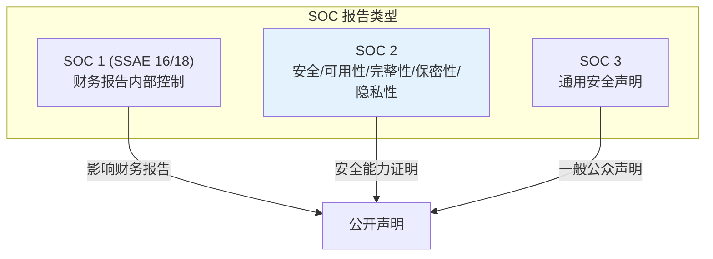
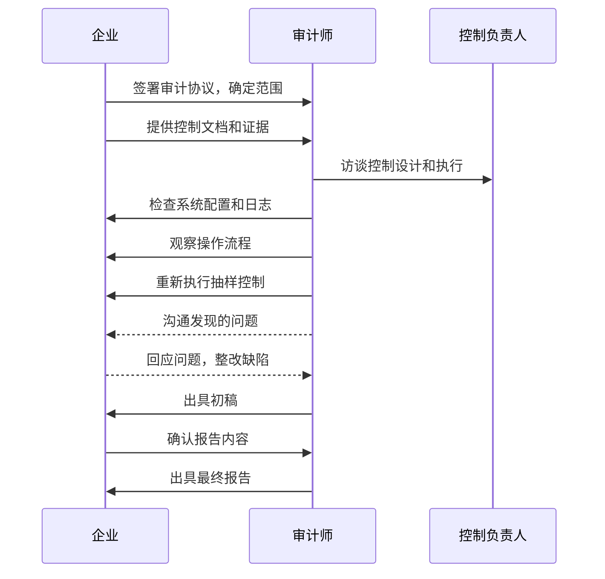

B2B 软件公司如果只能给客户看一份安全证明，这份证明大概率是 SOC 2 报告。SOC 2 是全球 SaaS 企业最常被要求的合规认证——客户在选型时、投资者在尽调时、合作伙伴在评估风险时，都会要求提供 SOC 2 报告。

但 SOC 2 不是万能的。它有明确的适用范围和局限性，理解这些边界，才能正确使用这一认证工具。

## SOC 报告家族

美国注册会计师协会（AICPA）定义了三种 SOC 报告，适用于不同场景：

### SOC 1（SASS 16）

**适用范围**：财务报告相关的内部控制。

**适用场景**：当服务机构（如薪酬服务商、支付处理商）执行影响用户财务报表的内部控制时，用户及其审计师需要了解这些控制。

**报告内容**：服务机构在用户财务报表中的控制点、内部控制的设计和运行有效性。

### SOC 2（SOC 2）

**适用范围**：安全性、可用性、处理完整性、保密性、隐私性相关的控制。

**适用场景**：需要了解服务机构（如 SaaS、云服务商）安全控制有效性的用户和潜在用户。

**报告内容**：服务机构在五大信任服务原则上的控制措施和有效性评估。这是本文重点。

### SOC 3

**适用范围**：与 SOC 2 相同的信任服务原则，但提供较简化的报告。

**适用场景**：需要一般性安全认证证明，不需要详细控制描述的场景。

**报告内容**：服务机构符合 AICPA 信任服务标准的声明，可对外公开，无敏感细节。

## SOC 2 的适用场景

### 什么情况下需要 SOC 2

SOC 2 主要适用于「服务机构」（Service Organizations），即向其他组织提供服务的公司。典型场景包括：

**SaaS 服务商**：向企业提供软件的 SaaS 公司，客户需要了解服务商的 安全控制。

**云服务商**：IaaS、PaaS 服务商，提供基础设施或平台服务。

**数据处理服务商**：提供薪资处理、支付处理、客户服务外包的公司。

**托管服务商**：提供 IT 托管、安全托管的服务商。

### SOC 2 vs 其他认证

| 认证 | 适用场景 | 特点 |
|------|----------|------|
| SOC 2 | SaaS/云服务商向企业客户提供安全证明 | 面向服务，报告详细但有限制使用 |
| ISO 27001 | 任何组织建立信息安全管理体系 | 通用认证，国际认可 |
| PCI DSS | 处理支付卡数据的组织 | 行业特定，严格合规 |
| HIPAA BAA | 处理医疗信息的组织 | 针对医疗行业 |

## SOC 2 报告类型

### Type I 报告

**定义**：评估控制措施在某一特定日期（时点）的设计和运行状态。

**特点**：仅反映评估日期那一刻的情况，不证明控制措施在期间持续有效。

**适用场景**：新成立的公司、首次审计、控制刚实施、需要快速获取证明。

**局限**：报告价值有限，客户更关注控制措施在运行期间的有效性。

### Type II 报告

**定义**：评估控制措施在某一期间（通常为 6-12 个月）的设计和运行有效性。

**特点**：需要至少 6 个月的运营证据，能证明控制措施持续有效运行。

**适用场景**：已成为或希望成为企业客户的供应商。

**优势**：Type II 报告才能真正证明安全控制的持续有效性，是企业客户的首选。

### 类型对比

| 维度 | Type I | Type II |
|------|--------|---------|
| 评估范围 | 某一日期 | 某一期间（至少 6 个月） |
| 证据要求 | 控制存在且设计合理 | 控制存在且运行有效 |
| 报告价值 | 有限 | 较高 |
| 准备周期 | 1-3 个月 | 6-12 个月 |
| 审计成本 | 较低 | 较高 |

## SOC 2 审计流程

SOC 2 审计通常分为四个阶段：评估与范围确定、准备阶段、审计实施、报告编制。

### 阶段一：评估与范围确定

**确定审计范围**：与审计师讨论确定审计涵盖的服务、系统、控制措施。

**确定信任服务原则**：根据业务需求选择适用的原则（通常至少包含安全性）。

**确定报告期间**：Type II 报告需要确定评估的期间（通常为 12 个月）。

**签署审计约定**：与审计师事务所签署审计服务协议。

### 阶段二：准备阶段

**收集文档**：收集内部控制文档、策略、流程、操作记录。

**实施控制**：如控制尚未实施，需要先行实施并运行足够长的时间。

**差距分析**：评估现有控制与 SOC 2 标准要求的差距。

**整改实施**：整改发现的差距。

**证据收集**：为每个控制收集运行证据。

### 阶段三：审计实施

审计师采用以下方法测试控制措施：

**检查**：审阅文档、配置、日志、策略。

**观察**：观察操作人员的实际操作。

**询问**：访谈控制负责人和执行人。

**重新执行**：对某些控制措施重新执行以验证有效性。

### 阶段四：报告编制

审计师编制 SOC 2 报告，包含以下章节：

1. 管理层声明
2. 审计师报告
3. 系统描述
4. 信任服务原则和控制
5. 控制测试结果
6. 审计师意见

## 报告内容结构

### 管理层声明

服务机构管理层对系统描述的准确性和控制措施有效性的声明。

### 审计师报告

独立审计师对以下内容的意见：

**审计意见**：对控制措施设计和运行有效性的意见。

**意见类型**：无保留意见（标准）、保留意见、否定意见。

### 系统描述

对被审计系统、服务、控制的完整描述，包括：

- 系统边界和范围
- 提供的服务
- 使用的组件
- 数据流
- 参与服务的人员、流程、技术

### 控制测试结果

每个控制点的测试方法和测试结果，通常以表格形式呈现：

| 控制编号 | 控制描述 | 测试方法 | 测试结果 | 意见 |
|----------|----------|----------|----------|------|
| CC1.1 | 员工入职背景调查 | 检查记录 | 5/5 通过 | 无保留 |
| CC1.2 | 安全意识培训 | 检查记录 | 2/3 通过 | 保留 |

### 审计师意见

审计师对控制措施整体有效性的结论性意见。Type II 报告需要说明控制是否「在所有重要方面」持续有效运行。

## 审计师的独立性

### 独立性要求

SOC 2 审计要求审计师保持独立性。审计师不得：

- 与被审计单位有财务利益关系
- 为被审计单位设计控制措施
- 执行被审计单位的内部控制
- 提供与审计范围相关的其他服务（除审计外）

### 不兼容服务

审计师不能同时为同一客户提供审计和以下服务：

- 内部审计外包
- IT 系统设计或实施
- 风险管理咨询
- 代编财务报表

这些限制是为了保证审计的独立性和客观性。

## 报告使用限制

### 限制使用条款

SOC 2 报告通常带有「限制使用」声明：报告仅供以下人员使用：当前用户、潜在用户、审计师。

这一限制保护了报告中的敏感信息安全，防止被竞争对手或公众获取。

### 报告时效性

SOC 2 报告具有时效性，Type II 报告通常覆盖 12 个月，到期后需要重新审计。

客户通常要求最近一期的报告，或仍在有效期的报告。

## SOC 2 与 ISO 27001 的关系

### 互补而非替代

SOC 2 和 ISO 27001 关注不同维度：

| 维度 | SOC 2 | ISO 27001 |
|------|-------|----------|
| 关注焦点 | 特定服务的控制有效性 | 信息安全管理体系完整性 |
| 报告性质 | 运营有效性 | 体系认证 |
| 评估方法 | 审计师测试控制 | 认证机构审核体系 |
| 适用范围 | 特定服务 | 整个组织 |
| 有效期 | 一年 | 三年（年度监督审核） |

### 协同策略

两者可以协同实施：以 ISO 27001 建立完整的信息安全管理体系，SOC 2 证明特定服务的控制有效性。一次实施，可同时满足两项认证要求。

## 思考题

**问题 1**：某 SaaS 公司计划向企业客户提供服务，客户在选型时要求提供 SOC 2 报告。该公司成立刚满一年，是否可以直接申请 Type I 报告？

参考答案

可以，但不建议仅做 Type I。该公司应考虑以下因素：

Type I 的局限性：Type I 仅评估某一日期的 控制状态，无法证明控制的持续运行。新成立的公司在客户眼中信任度本就不高，Type I 报告的说服力有限。

Type II 的要求：Type II 需要至少 6 个月的运营证据。如果公司成立满一年，可以选择覆盖最近 12 个月的 Type II 报告。

建议路径：先快速完成 Type I 报告，作为销售阶段的过渡性证明；同时准备 Type II 审计，积累 6 个月运营证据后获取 Type II 报告。Type I 通常需要 1-3 个月准备，Type II 需要 6-12 个月（包括 6 个月运营期）。

成本考虑：Type I 成本约为 Type II 的 30-50%，可以作为 Type II 的前置投入。

**问题 2**：SOC 2 审计发现某控制存在缺陷（exception），审计师出具了保留意见。客户看到保留意见后会如何反应？企业应该如何沟通？

参考答案

客户反应取决于缺陷的性质：如果是高风险缺陷（如访问控制失效、数据加密缺失），客户可能暂停合作或要求立即整改；如果是低风险缺陷（如培训记录缺失），客户可能接受但要求定期更新。

企业与客户的沟通策略：主动披露：不要等客户问，先主动向客户说明；区分重要性：解释该缺陷的影响范围，是否涉及客户数据；说明整改计划：提供具体的整改时间表和责任人；展示其他证据：说明该缺陷是孤立的，其他控制仍然有效；提供补偿措施：说明是否有其他补偿控制或缓解措施。

关键是透明和快速响应。试图隐瞒或淡化缺陷反而会损害信任。

