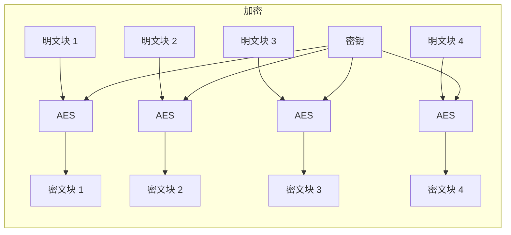
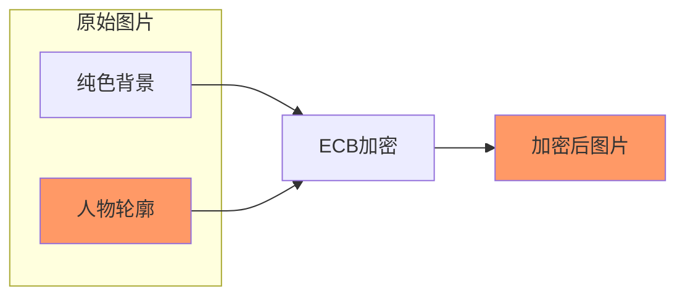
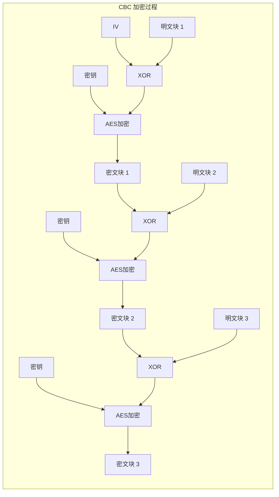
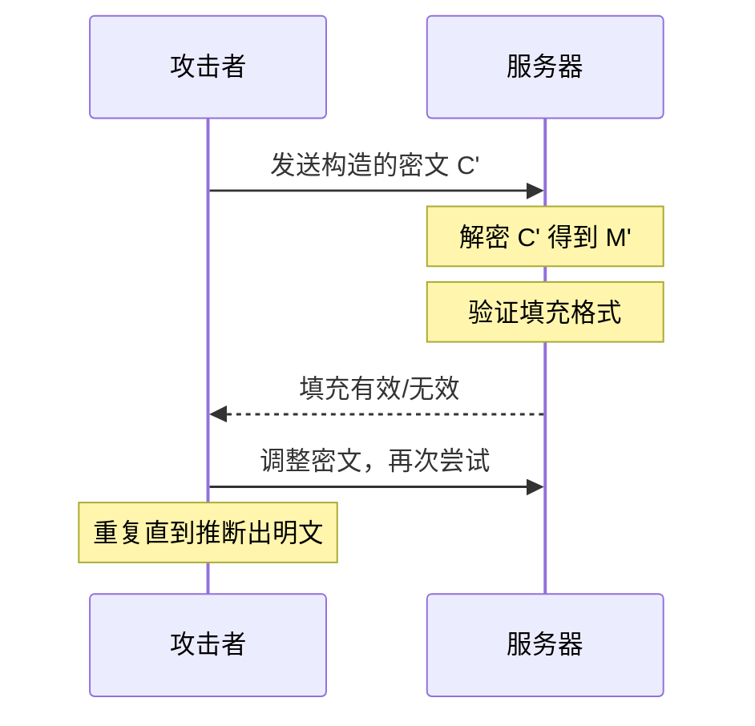
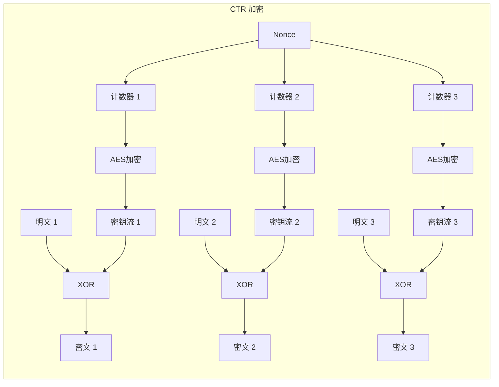
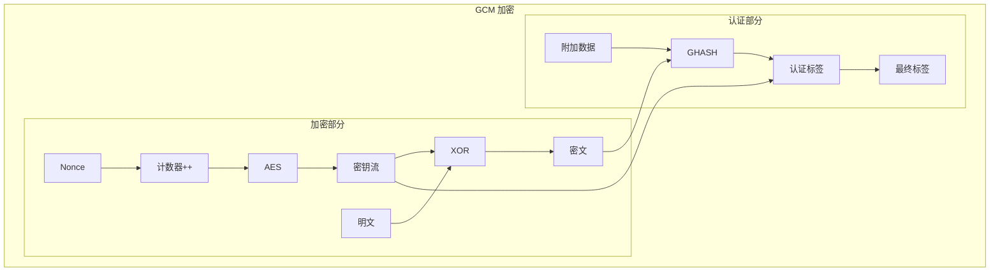
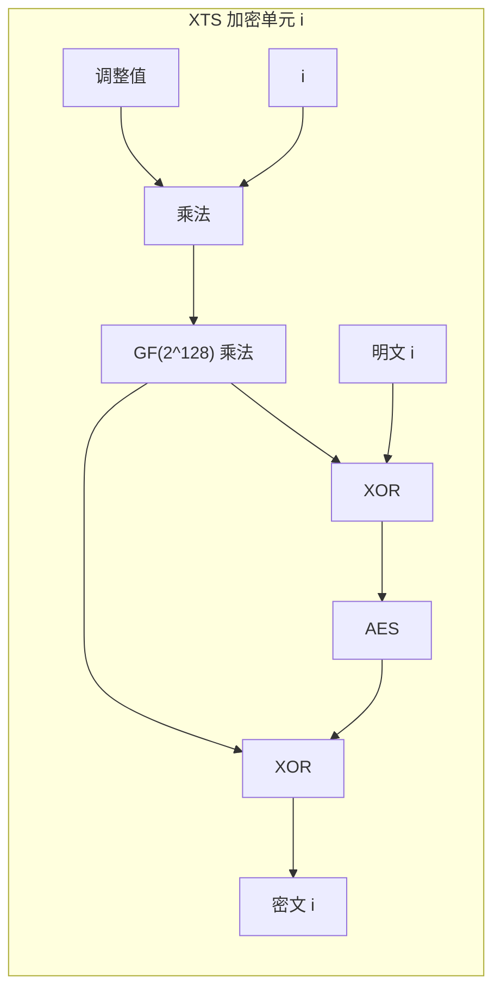

一张未经处理的图片，用 ECB 模式加密后，攻击者不需要破解任何密钥，仅凭肉眼就能看出轮廓。

这不是算法的问题，而是使用方式的问题。

ECB（Electronic Codebook）模式是最直观的分组加密方式——每个分组独立加密——但它也是最危险的加密模式。本文将深入分析各加密模式的设计、缺陷与应用场景。

## ECB 模式：致命的安全缺陷

ECB 模式的工作原理极为简单：



问题是：**相同的明文块总是产生相同的密文块**。



:::danger
**永远不要在生产环境中使用 ECB 模式**

ECB 模式会泄露数据的结构信息。2013 年，Adobe 的密码泄露事件中，超过 1400 万个密码使用 ECB 模式存储，导致相同密码的哈希完全相同——攻击者可以直接识别哪些用户使用相同密码。
:::

## CBC 模式：链接带来随机性

CBC（Cipher Block Chaining）模式通过引入前一个密文块来打破模式：



### CBC 的关键要素

1. **IV（初始化向量）**：必须随机生成，长度等于分组长度（16 字节）
2. **链接依赖**：每个分组的加密依赖于前一个密文块
3. **错误传播**：一个比特错误会影响当前分组和下一个分组

### CBC 的填充问题

由于 AES 的分组长度是 16 字节，而明文长度通常不是 16 的倍数，CBC 需要填充。PKCS#7 填充是最常见的方式：

```java title="Pkcs7Padding.java"
public class Pkcs7Padding {
    
    /**
     * PKCS#7 填充
     * 如果数据长度是 15 字节，需要添加 1 字节的 0x01
     * 如果数据长度是 16 字节，需要添加 16 字节的 0x10
     */
    public static byte[] pad(byte[] data, int blockSize) {
        int padLength = blockSize - (data.length % blockSize);
        byte[] padded = new byte[data.length + padLength];
        System.arraycopy(data, 0, padded, 0, data.length);
        // 填充字节的值等于填充长度
        for (int i = data.length; i < padded.length; i++) {
            padded[i] = (byte) padLength;
        }
        return padded;
    }
    
    /**
     * 去除 PKCS#7 填充
     */
    public static byte[] unpad(byte[] padded) {
        int padLength = padded[padded.length - 1];
        // 验证填充是否有效
        if (padLength < 1 || padLength > 16) {
            throw new IllegalArgumentException("Invalid padding");
        }
        for (int i = padded.length - padLength; i < padded.length; i++) {
            if (padded[i] != padLength) {
                throw new IllegalArgumentException("Invalid padding");
            }
        }
        byte[] data = new byte[padded.length - padLength];
        System.arraycopy(padded, 0, data, 0, data.length);
        return data;
    }
}
```

## 填充 Oracle 攻击：侧信道的威力

CBC 模式的一个致命弱点是**填充验证时机**。

### 攻击原理

攻击者可以向服务器发送精心构造的密文，通过观察服务器的响应时间来判断填充是否有效：

1. **修改密文的最后一个字节**
2. **观察服务器返回「有效填充」还是「解密错误」**
3. **逐步推断出明文**



### 实际案例

2014 年，攻击者利用填充 Oracle 攻击破解了 7000 万个 TalkTalk 用户的密码哈希。这是 CBC 模式最危险的安全漏洞。

### 防护措施

| 防护方法 | 说明 |
|----------|------|
| **使用 GCM 模式** | GCM 有认证标签，填充 Oracle 无法利用 |
| **MAC-then-Encrypt** | 先计算 MAC，再加密（但需要正确实现） |
| **敏感的解密错误** | 返回统一的错误信息，不区分填充错误和内容错误 |
| **速率限制** | 限制解密请求频率 |

## CTR 模式：计数器带来的随机访问

CTR（Counter）模式将分组密码转换为流密码：



### CTR 的优势

| 特性 | 说明 |
|------|------|
| **随机访问** | 可以解密任意分组，不需要按顺序 |
| **无填充** | 流密码模式，不受分组长度限制 |
| **并行化** | 多个分组可以并行加密 |
| **预计算** | 密钥流可以提前计算 |

### CTR 的安全问题

CTR 模式本身不提供完整性保护。如果攻击者修改密文，解密出的明文会变成垃圾值，但无法被检测到。

**必须配合 MAC 使用**，如 HMAC-SHA256。

## GCM 模式：认证加密的标准

GCM（Galois/Counter Mode）是目前**最推荐**的对称加密模式，同时提供加密和完整性保护。

### GCM 的结构



GCM 输出两部分：**密文**和**认证标签（Authentication Tag）**。

### Java 实现

```java title="AesGcmEncryptor.java"
import javax.crypto.Cipher;
import javax.crypto.KeyGenerator;
import javax.crypto.SecretKey;
import javax.crypto.spec.GCMParameterSpec;
import java.security.SecureRandom;
import java.util.Base64;

public class AesGcmEncryptor {
    
    private static final int KEY_SIZE = 256;
    private static final int IV_SIZE = 12;      // GCM 推荐 96 位
    private static final int TAG_SIZE = 128;     // 认证标签长度
    
    public static SecretKey generateKey() throws Exception {
        KeyGenerator keyGen = KeyGenerator.getInstance("AES");
        keyGen.init(KEY_SIZE, new SecureRandom());
        return keyGen.generateKey();
    }
    
    /**
     * AES-GCM 加密
     * @param plaintext 明文
     * @param key 密钥
     * @param associatedData 附加数据（可选，用于认证但不加密）
     * @return Base64编码的 IV + 密文 + 标签
     */
    public static String encrypt(byte[] plaintext, SecretKey key, byte[] associatedData) 
            throws Exception {
        
        // 生成随机 IV
        byte[] iv = new byte[IV_SIZE];
        new SecureRandom().nextBytes(iv);
        
        // 初始化 GCM 参数
        GCMParameterSpec gcmSpec = new GCMParameterSpec(TAG_SIZE, iv);
        Cipher cipher = Cipher.getInstance("AES/GCM/NoPadding");
        cipher.init(Cipher.ENCRYPT_MODE, key, gcmSpec);
        
        // 添加附加数据（可选）
        if (associatedData != null && associatedData.length > 0) {
            cipher.updateAAD(associatedData);
        }
        
        // 加密
        byte[] ciphertext = cipher.doFinal(plaintext);
        
        // 组合 IV + 密文
        byte[] combined = new byte[iv.length + ciphertext.length];
        System.arraycopy(iv, 0, combined, 0, iv.length);
        System.arraycopy(ciphertext, 0, combined, iv.length, ciphertext.length);
        
        return Base64.getEncoder().encodeToString(combined);
    }
    
    /**
     * AES-GCM 解密
     */
    public static byte[] decrypt(String encryptedData, SecretKey key, byte[] associatedData) 
            throws Exception {
        
        byte[] combined = Base64.getDecoder().decode(encryptedData);
        
        // 提取 IV
        byte[] iv = new byte[IV_SIZE];
        byte[] ciphertext = new byte[combined.length - IV_SIZE];
        System.arraycopy(combined, 0, iv, 0, iv.length);
        System.arraycopy(combined, iv.length, ciphertext, 0, ciphertext.length);
        
        // 初始化 GCM
        GCMParameterSpec gcmSpec = new GCMParameterSpec(TAG_SIZE, iv);
        Cipher cipher = Cipher.getInstance("AES/GCM/NoPadding");
        cipher.init(Cipher.DECRYPT_MODE, key, gcmSpec);
        
        // 验证附加数据
        if (associatedData != null && associatedData.length > 0) {
            cipher.updateAAD(associatedData);
        }
        
        // 解密（会自动验证认证标签）
        return cipher.doFinal(ciphertext);
    }
}
```

### GCM 的安全性

| 方面 | 说明 |
|------|------|
| **认证加密** | 同时提供机密性和完整性 |
| **Nonce 重用容忍** | IV 重复会降低安全性，但不像其他模式那样灾难性 |
| **侧信道安全** | 实现正确时，侧信道攻击面较小 |

:::warning
**GCM 的 IV 绝对不能重复**

GCM 的认证标签依赖于加密过程，如果 IV 重复，攻击者可以构造认证标签相同的密文。虽然 GCM 比其他模式更能容忍重复，但仍然存在理论上的安全风险。

每次加密必须使用新的随机 IV。
:::

## XTS 模式：磁盘加密专用

XTS 模式是专门为磁盘加密设计的，IEEE 1619 标准定义。

### 为什么磁盘加密需要特殊模式？

| 场景 | 挑战 |
|------|------|
| **随机访问** | 磁盘扇区可以独立读写，不能有链接依赖 |
| **相同明文** | 相同位置的相同数据会重复出现 |
| **无 IV** | 每个扇区需要独立的安全机制 |

### XTS 的工作原理

XTS 使用两个密钥（通过密钥派生函数从主密钥派生），并引入一个「调整值」（通常是扇区号）：



XTS 的特点是每个 16 字节块使用不同的密钥流。

## 模式选择指南

| 场景 | 推荐模式 | 原因 |
|------|----------|------|
| **通用加密** | AES-GCM | 认证加密、抗填充 Oracle |
| **网络通信** | ChaCha20-Poly1305 | 无硬件要求、侧信道安全 |
| **数据库加密** | AES-GCM 或 XTS | XTS 支持随机访问 |
| **文件加密** | AES-GCM | 认证加密 |
| **磁盘加密** | XTS-AES | 随机访问、无链接 |
| **TLS 1.3** | AES-GCM / ChaCha20-Poly1305 | TLS 1.3 强制要求 AEAD |

## IV/Nonce 的安全要求

| 模式 | IV/Nonce 长度 | 必须随机？ | 能否重复？ |
|------|---------------|-----------|-----------|
| CBC | 16 字节（分组长度） | 必须 | 绝对不行 |
| CTR | 8~16 字节 | 必须 | 绝对不行 |
| GCM | 12 字节（推荐） | 必须 | 绝对不行 |
| XTS | 16 字节（调整值） | 无（使用扇区号） | 同一扇区不能重复 |

## 常见错误与反模式

### 错误 1：使用固定 IV

```java title="❌ 错误：固定 IV"
byte[] iv = new byte[]{1, 2, 3, 4, 5, 6, 7, 8, 9, 10, 11, 12}; // 固定值
Cipher cipher = Cipher.getInstance("AES/GCM/NoPadding");
cipher.init(Cipher.ENCRYPT_MODE, key, new GCMParameterSpec(128, iv));
```

```java title="✓ 正确：随机 IV"
byte[] iv = new byte[12];
new SecureRandom().nextBytes(iv); // 每次加密生成新的随机 IV
```

### 错误 2：ECB 用于数据库列加密

```java title="❌ 错误：ECB 模式"
Cipher cipher = Cipher.getInstance("AES/ECB/PKCS5Padding");
```

```java title="✓ 正确：GCM 模式"
Cipher cipher = Cipher.getInstance("AES/GCM/NoPadding");
```

## 思考题

**问题 1**：假设你在代码审查中发现系统使用 AES-CBC 模式加密用户数据，但没有使用 HMAC。你会建议如何修复这个安全问题？

<details>
<summary>参考答案</summary>

**问题分析**：

AES-CBC 只提供机密性，不提供完整性保护。这意味着：

1. 攻击者可以修改密文，导致解密出无意义的数据
2. 如果应用程序依赖解密后的数据做决策（如权限判断），可能被利用
3. Padding Oracle 攻击风险

**修复方案**：

| 方案 | 说明 | 推荐度 |
|------|------|--------|
| **迁移到 GCM** | 最简单，替换为 AES-GCM | ★★★★★ |
| **HMAC-then-Encrypt** | 先 HMAC，再加密 | ★★★★☆ |
| **Encrypt-then-MAC** | 先加密，再 HMAC | ★★★★★ |

**HMAC-then-MAC 实现**：

```java
// 加密
byte[] iv = generateRandomIv();
byte[] ciphertext = aesCbcEncrypt(plaintext, key, iv);
byte[] mac = hmacSha256(iv + ciphertext, hmacKey);
byte[] message = iv + ciphertext + mac;

// 验证和解密
verifyMac(message, macKey); // 先验证完整性
extractIv(message);
extractCiphertext(message);
aesCbcDecrypt(ciphertext, key, iv);
```

**最佳建议**：直接迁移到 AES-GCM。Java 原生支持，实现简单，安全性高。

</details>

**问题 2**：什么是填充 Oracle 攻击？请解释攻击者如何利用这个漏洞，以及开发者如何防止此类攻击。

<details>
<summary>参考答案</summary>

**填充 Oracle 攻击原理**：

填充 Oracle 攻击利用的是 CBC 模式的一个特性：**解密时，系统会分别报告「填充格式错误」和「解密内容错误」**。

**攻击步骤**：

1. 攻击者截获密文 `(IV, C1, C2, ..., Cn)`
2. 攻击者修改 `Cn` 的最后一个字节，得到 `Cn'`
3. 攻击者将 `(IV, C1, ..., Cn-1, Cn')` 发送给服务器
4. 服务器解密时：
   - `Cn'` 解密为 `Mn'`
   - 验证 `Mn'` 的填充是否有效
   - 如果有效，说明 `Mn'` 最后一个字节 `=` 1
5. 攻击者可以推断 `Cn-1` 的最后一个字节，从而逐步解密

**攻击效率**：

每个字节平均只需 128 次尝试（2^8），解密整个分组只需约 2000 次请求。对于攻击者来说，这是轻而易举的事情。

**防护措施**：

1. **使用认证加密（AES-GCM）**：认证标签验证失败时，直接返回统一错误，不暴露填充信息
2. **统一错误消息**：解密失败时返回相同的错误信息，不区分原因
3. **延迟响应**：添加随机延迟，防止 Timing Attack
4. **速率限制**：限制单 IP 的解密请求频率
5. **迁移到 GCM**：从根本上解决问题

</details>

**问题 3**：在文件加密场景中，如果需要支持随机访问（只解密文件的某一部分），应该选择哪种加密模式？为什么？

<details>
<summary>参考答案</summary>

**随机访问的需求**：

文件加密中，随机访问是常见需求：
- 视频流：用户拖动进度条，只需要解密从该位置开始的内容
- 数据库文件：读取特定记录，不需要解密整个文件
- 大文件处理：只处理文件的一部分

**为什么 CBC/CTR 不适合随机访问**：

| 模式 | 问题 |
|------|------|
| **CBC** | 分组之间有链接依赖，必须从文件开头解密到目标位置 |
| **CTR** | 可以随机访问，但需要为每个块提供不同的 Nonce/计数器 |

**推荐方案：XTS 模式**

XTS 是专为磁盘/文件加密设计的模式：

1. **支持随机访问**：每个 16 字节块独立加密
2. **使用调整值**：基于数据块的位置（索引）生成不同的密钥流
3. **无链接依赖**：不需要前一个密文块

**XTS 的实现原理**：

```java
// 伪代码
for (block in blocks):
    # 使用索引作为调整值
    T = tweakEncrypt(blockIndex, key2)
    # 生成该块的密钥流
    keystream = AES(key1, T)
    # 加密
    ciphertext = plaintext XOR keystream
```

**注意事项**：

1. XTS 不提供认证加密，需要额外考虑完整性保护
2. XTS 不适合小数据加密（最小单位是 16 字节）
3. 某些云存储推荐使用加密后追加 MAC 的方式

**替代方案：信封加密**

将大文件分成多个 chunk，每个 chunk：
1. 用唯一的 DEK 加密
2. 用 KEK 加密 DEK
3. 存储 `encrypted_DEK + nonce + ciphertext + mac`

这样可以随机访问任意 chunk，同时保持密钥管理的灵活性。

</details>
