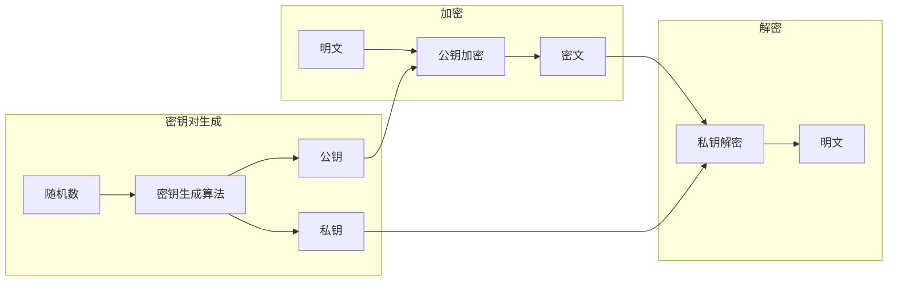
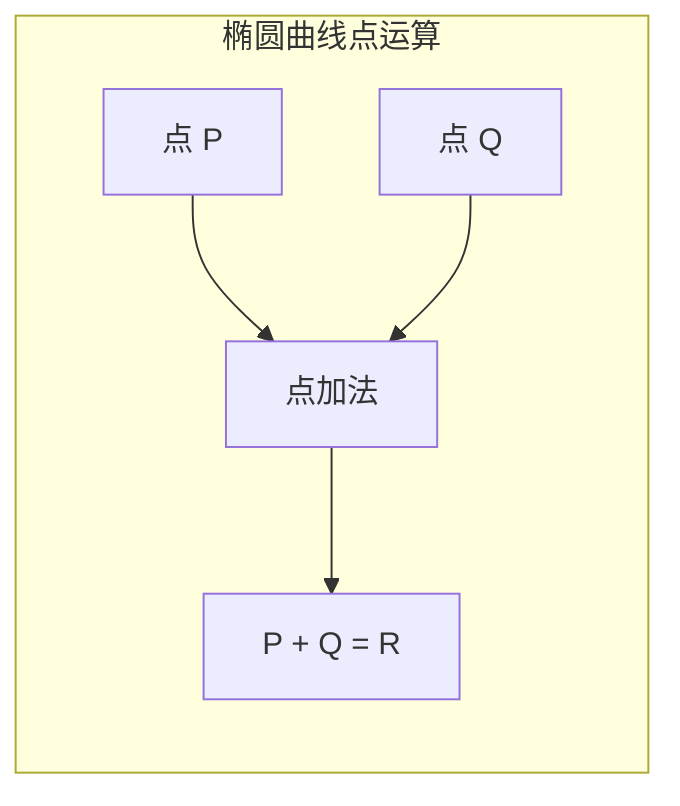
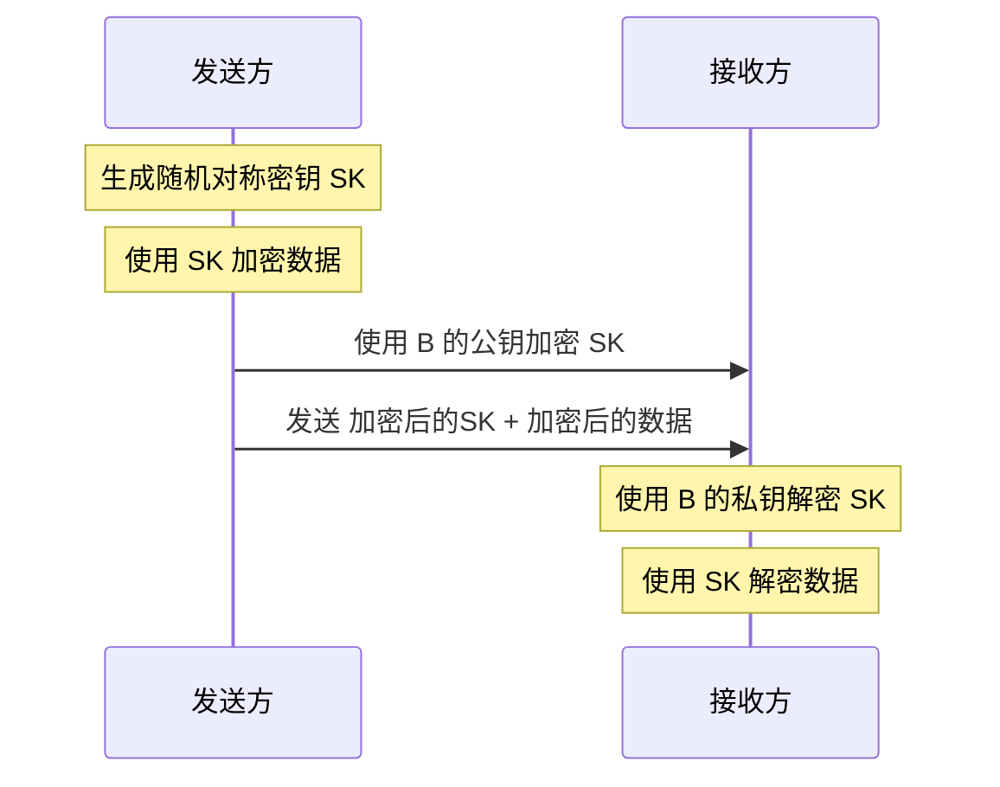

想象一个场景：你要给一个从未见过面的人发送机密信息，而且无法预先建立任何安全通道。传统的对称加密无法解决这个问题——你需要先把密钥安全地传给对方，但连安全通道都没有，怎么传密钥？

1976 年，Diffie 和 Hellman 在《密码学的新方向》中首次提出公钥密码学的概念，彻底改变了这个困局。

## 非对称加密的基本原理

非对称加密使用**一对密钥**：公钥和私钥。这两个密钥在数学上相关联，但从一个密钥无法推导出另一个。



**核心性质**：

- **公钥加密，私钥解密**：任何人都可以用公钥加密信息，但只有私钥持有者能解密
- **私钥签名，公钥验证**：私钥持有者可以签名，任何人都可以用公钥验证签名

## 模运算与数学基础

非对称加密的安全性建立在几个数学难题上。

### 模运算

「模」就是取余数。例如 `17 mod 5 = 2`，表示为 `17 ≡ 2 (mod 5)`。

模运算的关键特性：

| 特性 | 公式 | 说明 |
|------|------|------|
| 加法 | `(a + b) mod n = ((a mod n) + (b mod n)) mod n` | 可以逐步取模 |
| 乘法 | `(a * b) mod n = ((a mod n) * (b mod n)) mod n` | 同上 |
| 幂运算 | `a^k mod n` | 这在 RSA 中很关键 |
| 逆元 | `a * a⁻¹ ≡ 1 (mod n)` | 只有当 a 和 n 互质时存在 |

### 离散对数问题

给定素数 `p`、原根 `g` 和 `y = g^x mod p`，求 `x` 是**离散对数问题**。

例如：给定 `p = 23`, `g = 5`, `y = 8`，求 `x` 使得 `5^x ≡ 8 (mod 23)`。

这个问题的难度是 RSA 体系中 DH 密钥交换和 DSA 签名的安全基础。

### 大数分解问题

给定一个大整数 `n = p * q`（其中 p 和 q 是大素数），求 p 和 q 是**大数分解问题**。

这是 RSA 算法的数学基础。当 n 足够大时（2048 位以上），即使使用超级计算机，分解也需要天文数字的时间。

## RSA 与 ECC 的数学基础

### RSA 的数学原理

RSA 的安全性基于**大数分解问题**：

```
密钥生成：
1. 选择两个大素数 p 和 q
2. 计算 n = p * q
3. 计算 φ(n) = (p-1) * (q-1)
4. 选择公钥指数 e，使得 gcd(e, φ(n)) = 1
5. 计算私钥指数 d，使得 e * d ≡ 1 (mod φ(n))

加密：c = m^e mod n
解密：m = c^d mod n
```

为什么解密能恢复明文？因为 `m = (m^e)^d mod n = m^(e*d) mod n`，而根据欧拉定理，当 `gcd(m, n) = 1` 时，`m^φ(n) ≡ 1 (mod n)`。

### ECC 的数学原理

椭圆曲线密码学（ECC）的安全性基于**椭圆曲线离散对数问题（ECDLP）**。

一条椭圆曲线定义为：`y² = x³ + ax + b (mod p)`，其中 `4a³ + 27b² ≠ 0`。

曲线上有一个特殊的点叫做「无穷远点」O，以及点加法运算：



给定椭圆曲线上的点 G（基点）、整数 k 和点 `k*G`（k 个 G 相加），求 k 是**椭圆曲线离散对数问题**。

ECC 的优势在于：**相同安全强度下，ECC 的密钥长度远短于 RSA**。

## 密钥长度与安全强度

| 安全强度（位） | RSA 密钥长度 | ECC 密钥长度 | 说明 |
|---------------|--------------|--------------|------|
| 80 | 1024 | 160 | 已不安全 |
| 112 | 2048 | 224 | 最小推荐（2025 后） |
| 128 | 3072 | 256 | 推荐（2030 前） |
| 192 | 7680 | 384 | 高安全场景 |
| 256 | 15360 | 512 | 量子安全准备 |

:::tip
**为什么 ECC 密钥更短？**

要理解这个问题，想象在沙滩上找一个特定位置的沙粒——大海捞针。

RSA 的安全性依赖于在 n = p*q 中找到因子 p 和 q。对于 2048 位 RSA，n 大约有 600 位十进制数。

ECC 的安全性依赖于在椭圆曲线上找到 k。当使用 256 位 ECC 时，k 有 2^256 个可能的值——比 RSA 2048 的 2^2048 小，但「挖洞」的难度相当。

换句话说：**ECC 在更短的长度上提供了相同的安全性**。
:::

## 混合加密：结合两者优势

非对称加密有一个致命弱点：**速度慢**。对称加密也有一个致命弱点：**密钥分发难**。

混合加密将两者结合：



**实际效率比较**：

| 操作 | RSA-2048 | AES-128 |
|------|----------|---------|
| 加密 1KB 数据 | ~50ms | ~0.01ms |
| 密钥长度 | 2048 位 | 128 位 |
| 密钥分发 | 公钥加密 | 需要安全通道 |

## Java 实现示例

### RSA 密钥生成与加密

```java title="RsaEncryption.java"
import javax.crypto.Cipher;
import javax.crypto.KeyGenerator;
import javax.crypto.SecretKey;
import java.security.KeyPair;
import java.security.KeyPairGenerator;
import java.security.PrivateKey;
import java.security.PublicKey;
import java.security.SecureRandom;
import java.util.Base64;

public class RsaEncryption {
    
    private static final int KEY_SIZE = 2048;
    
    /**
     * 生成 RSA 密钥对
     */
    public static KeyPair generateKeyPair() throws Exception {
        KeyPairGenerator generator = KeyPairGenerator.getInstance("RSA");
        generator.initialize(KEY_SIZE, new SecureRandom());
        return generator.generateKeyPair();
    }
    
    /**
     * RSA 加密（使用 PKCS1Padding）
     * 注意：RSA 只能加密小于密钥长度的数据
     */
    public static String encrypt(String plaintext, PublicKey publicKey) throws Exception {
        Cipher cipher = Cipher.getInstance("RSA/ECB/PKCS1Padding");
        cipher.init(Cipher.ENCRYPT_MODE, publicKey);
        
        byte[] plaintextBytes = plaintext.getBytes("UTF-8");
        byte[] ciphertext = cipher.doFinal(plaintextBytes);
        
        return Base64.getEncoder().encodeToString(ciphertext);
    }
    
    /**
     * RSA 解密
     */
    public static String decrypt(String encryptedData, PrivateKey privateKey) throws Exception {
        Cipher cipher = Cipher.getInstance("RSA/ECB/PKCS1Padding");
        cipher.init(Cipher.DECRYPT_MODE, privateKey);
        
        byte[] ciphertext = Base64.getDecoder().decode(encryptedData);
        byte[] plaintext = cipher.doFinal(ciphertext);
        
        return new String(plaintext, "UTF-8");
    }
}
```

### 混合加密实现

```java title="HybridEncryption.java"
import javax.crypto.Cipher;
import javax.crypto.KeyGenerator;
import javax.crypto.SecretKey;
import javax.crypto.spec.GCMParameterSpec;
import javax.crypto.spec.SecretKeySpec;
import java.security.KeyPair;
import java.security.KeyPairGenerator;
import java.security.SecureRandom;
import java.util.Base64;

public class HybridEncryption {
    
    private static final int AES_KEY_SIZE = 256;
    private static final int AES_IV_SIZE = 12;
    private static final int AES_TAG_SIZE = 128;
    
    /**
     * 混合加密：RSA 公钥加密 AES 密钥 + AES 加密数据
     * @return Base64(加密的 AES 密钥 + AES IV + 密文 + 标签)
     */
    public static String hybridEncrypt(String plaintext, KeyPair keyPair) throws Exception {
        // 1. 生成随机 AES 密钥
        KeyGenerator keyGen = KeyGenerator.getInstance("AES");
        keyGen.init(AES_KEY_SIZE, new SecureRandom());
        SecretKey aesKey = keyGen.generateKey();
        
        // 2. 用 AES 加密数据
        byte[] iv = new byte[AES_IV_SIZE];
        new SecureRandom().nextBytes(iv);
        
        Cipher aesCipher = Cipher.getInstance("AES/GCM/NoPadding");
        GCMParameterSpec gcmSpec = new GCMParameterSpec(AES_TAG_SIZE, iv);
        aesCipher.init(Cipher.ENCRYPT_MODE, aesKey, gcmSpec);
        byte[] ciphertext = aesCipher.doFinal(plaintext.getBytes("UTF-8"));
        
        // 3. 用 RSA 公钥加密 AES 密钥
        Cipher rsaCipher = Cipher.getInstance("RSA/ECB/OAEPWithSHA-256AndMGF1Padding");
        rsaCipher.init(Cipher.ENCRYPT_MODE, keyPair.getPublic());
        byte[] encryptedAesKey = rsaCipher.doFinal(aesKey.getEncoded());
        
        // 4. 组合所有部分
        byte[] combined = new byte[
            encryptedAesKey.length + AES_IV_SIZE + ciphertext.length
        ];
        int offset = 0;
        System.arraycopy(encryptedAesKey, 0, combined, offset, encryptedAesKey.length);
        offset += encryptedAesKey.length;
        System.arraycopy(iv, 0, combined, offset, AES_IV_SIZE);
        offset += AES_IV_SIZE;
        System.arraycopy(ciphertext, 0, combined, offset, ciphertext.length);
        
        return Base64.getEncoder().encodeToString(combined);
    }
    
    /**
     * 混合解密
     */
    public static String hybridDecrypt(String encryptedData, KeyPair keyPair) throws Exception {
        byte[] combined = Base64.getDecoder().decode(encryptedData);
        
        // 1. 提取加密的 AES 密钥
        // RSA-2048 OAEP 输出长度是 256 字节
        int encryptedKeyLength = 256;
        byte[] encryptedAesKey = new byte[encryptedKeyLength];
        System.arraycopy(combined, 0, encryptedAesKey, 0, encryptedKeyLength);
        
        // 2. 解密 AES 密钥
        Cipher rsaCipher = Cipher.getInstance("RSA/ECB/OAEPWithSHA-256AndMGF1Padding");
        rsaCipher.init(Cipher.DECRYPT_MODE, keyPair.getPrivate());
        byte[] aesKeyBytes = rsaCipher.doFinal(encryptedAesKey);
        SecretKey aesKey = new SecretKeySpec(aesKeyBytes, "AES");
        
        // 3. 提取 IV 和密文
        int offset = encryptedKeyLength;
        byte[] iv = new byte[AES_IV_SIZE];
        System.arraycopy(combined, offset, iv, 0, AES_IV_SIZE);
        
        offset += AES_IV_SIZE;
        byte[] ciphertext = new byte[combined.length - offset];
        System.arraycopy(combined, offset, ciphertext, 0, ciphertext.length);
        
        // 4. 用 AES 解密
        Cipher aesCipher = Cipher.getInstance("AES/GCM/NoPadding");
        GCMParameterSpec gcmSpec = new GCMParameterSpec(AES_TAG_SIZE, iv);
        aesCipher.init(Cipher.DECRYPT_MODE, aesKey, gcmSpec);
        byte[] plaintext = aesCipher.doFinal(ciphertext);
        
        return new String(plaintext, "UTF-8");
    }
}
```

## 非对称加密的性能特点

### 计算复杂度对比

| 操作 | RSA | ECC |
|------|-----|-----|
| 密钥生成 | O(k³) | O(k²) |
| 加密 | O(k²) | O(k) |
| 解密 | O(k³) | O(k²) |
| 签名 | O(k³) | O(k²) |
| 验签 | O(k²) | O(k) |

### 实际性能数据

| 操作 | RSA-2048 | RSA-4096 | ECC-256 | ECC-384 |
|------|----------|----------|---------|---------|
| 密钥生成 | ~500ms | ~3000ms | ~50ms | ~150ms |
| 加密 | ~1ms | ~3ms | ~0.5ms | ~1ms |
| 解密 | ~50ms | ~300ms | ~15ms | ~40ms |
| 签名 | ~50ms | ~300ms | ~15ms | ~40ms |
| 验签 | ~5ms | ~15ms | ~30ms | ~80ms |

:::tip
**性能优化的实际建议**：

1. **TLS 握手优化**：使用 ECDHE（椭圆曲线 Diffie-Hellman Ephemeral）密钥交换，比 RSA 密钥交换快得多
2. **缓存公钥**：公钥验证可以缓存，避免重复计算
3. **选择合适的曲线**：Curve25519 比 NIST 曲线更快
:::

## 非对称加密的局限性

### 1. 只能加密小数据

RSA 的输入大小受密钥长度限制。以 PKCS#1 v1.5 填充为例：

```
可加密数据长度 = 密钥长度(字节) - 11(填充) - 2(填充头)

RSA-2048: 256 - 11 - 2 = 243 字节
RSA-4096: 512 - 11 - 2 = 499 字节
```

这意味着 RSA 本身只能加密很短的数据，必须配合混合加密使用。

### 2. 选择明文攻击

攻击者可以利用 RSA 的确定性加密（相同明文产生相同密文）进行攻击。

**防护**：使用随机填充（OAEP、PSS），确保相同明文每次加密产生不同的密文。

### 3. 前向安全性问题

如果攻击者记录了所有加密流量，后来拿到了服务器的私钥，就可以解密历史通信。

**防护**：使用 ECDHE（临时密钥交换），每次会话生成新的临时密钥，即使长期私钥泄露也不会影响历史通信。

## 常用曲线对比

| 曲线 | 类型 | 安全强度 | 特点 | 应用 |
|------|------|----------|------|------|
| **P-256** | NIST | 128 位 | 广泛支持，FIPS 认证 | 政府、金融 |
| **P-384** | NIST | 192 位 | 高安全场景 | 军方、高敏感 |
| **Curve25519** | Bernstein | 128 位 | 最快、无争议设计 | TLS 1.3、Signal |
| **secp256k1** | SECG | 128 位 | 比特币使用 | 区块链 |

:::warning
**NIST 曲线的争议**

2013 年，Edward Snowden 泄露的文件暗示 NSA 可能在 NIST 曲线的参数生成中做了手脚。虽然没有证据显示这些曲线被破解，但这一争议导致 Curve25519 等非 NIST 曲线更受青睐。

建议在有选择的情况下，优先使用 Curve25519。
:::

## 思考题

**问题 1**：解释为什么 RSA 密钥长度需要比 ECC 长很多才能达到相同的安全强度？这种差异在实际应用中有什么影响？

<details>
<summary>参考答案</summary>

**数学原因**：

RSA 的安全性依赖于大数分解问题的难度。对于 n 位模数，需要大约 `exp(O(n^(1/3)))` 次操作来分解。

ECC 的安全性依赖于椭圆曲线离散对数问题（ECDLP）。对于 k 位曲线，最佳算法需要大约 `O(sqrt(2^k)) = O(2^(k/2))` 次操作。

换句话说：
- **RSA-2048**: 需要 ~2^80 次操作（考虑最新算法）
- **ECC-256**: 需要 ~2^128 次操作

要达到相同的安全强度：
- ECC-256 ≈ RSA-3072
- ECC-384 ≈ RSA-7680

**实际影响**：

| 影响方面 | RSA | ECC |
|----------|-----|-----|
| 密钥大小 | 更大 | 更小 |
| 证书大小 | 更大 | 更小 |
| TLS 握手 | 更慢 | 更快 |
| 移动/IoT 性能 | 较慢 | 更优 |
| 兼容性 | 更好 | 略差（老设备） |
| 实现复杂度 | 较简单 | 较复杂（曲线参数） |

**选择建议**：

1. **现代应用**：优先选择 ECC（Curve25519 或 P-256）
2. **兼容性优先**：必须支持 RSA（如某些老系统）
3. **高性能需求**：ECC 是必选
4. **合规要求**：某些标准强制要求 RSA

</details>

**问题 2**：什么是前向安全性（Forward Secrecy）？为什么 RSA 静态密钥交换没有前向安全性，而 ECDHE 有？

<details>
<summary>参考答案</summary>

**前向安全性的定义**：

前向安全性（Forward Secrecy，简称 FS）指的是：**即使长期密钥（如服务器私钥）被泄露，历史通信记录仍然保持安全**。

**RSA 静态密钥交换的问题**：

```
传统 RSA 握手：
1. 客户端生成 PreMasterSecret
2. 客户端用服务器公钥加密 PreMasterSecret
3. 服务器用私钥解密

问题：
- PreMasterSecret 被服务器长期公钥加密
- 如果后来攻击者获得服务器私钥
- 可以解密所有历史握手中的 PreMasterSecret
- 从而推导出会话密钥
- 解密所有历史通信
```

**ECDHE 的工作原理**：

```
ECDHE 握手：
1. 客户端和服务器各自生成临时密钥对（椭圆曲线）
2. 双方交换临时公钥
3. 双方用自己的私钥和对方的公钥计算共享密钥
4. 握手结束后，临时私钥被销毁

关键：
- 服务器长期私钥只用于签名
- 实际用于加密的密钥（PreMasterSecret）来自临时密钥交换
- 临时私钥在握手结束后销毁
```

**为什么 ECDHE 有前向安全性**：

```
攻击场景：
- 攻击者记录了历史 TLS 流量
- 攻击者后来获得了服务器的长期私钥

RSA 方案：攻击者可以用私钥解密 PreMasterSecret -> 解密历史流量
ECDHE 方案：攻击者只有长期私钥，没有临时私钥 -> 无法推导会话密钥 -> 无法解密
```

**实现前向安全性的要求**：

1. 使用 ECDHE 或 DHE 密钥交换
2. 每次连接使用新的临时密钥对
3. 握手完成后立即销毁临时私钥
4. TLS 1.3 强制要求前向安全性

</details>

**问题 3**：如果你的系统需要支持「加密后检索」（即加密数据仍然可以被搜索），有哪些方案可以实现？各自的优缺点是什么？

<details>
<summary>参考答案</summary>

**问题背景**：

加密数据通常看起来像随机噪声，无法进行搜索。但某些场景（如医疗记录、财务数据）需要在加密状态下进行搜索。

**主流方案对比**：

| 方案 | 原理 | 优点 | 缺点 | 适用场景 |
|------|------|------|------|----------|
| **同态加密** | 直接对密文进行计算 | 理论上最安全 | 性能极慢（1000x+） | 理论研究 |
| **保序加密（OPE）** | 保持密文的顺序关系 | 可排序 | 泄露顺序信息 | 范围查询 |
| **确定性加密（DTE）** | 相同明文产生相同密文 | 可精确匹配 | 泄露频率信息 | 唯一值查询 |
| **可搜索加密（SEARCHable）** | 使用加密索引 | 平衡安全与功能 | 索引管理复杂 | 关键词搜索 |
| **TEE 可信执行环境** | 在隔离环境中解密搜索 | 功能完整 | 依赖硬件信任 | 云环境 |

**实用方案详解**：

**方案 1：确定性加密 + 独立索引**

```
数据库设计：
- 主表：id | encrypted_name | encrypted_email | ...
- 索引表：id | encrypted_search_field | search_field_hash

搜索流程：
1. 对搜索关键词计算确定性哈希
2. 在索引表中查找哈希
3. 如果匹配，返回 id
4. 用 id 在主表中解密数据
```

优点：实现简单，与现有数据库兼容
缺点：相同数据产生相同密文，可能泄露访问模式

**方案 2：可搜索加密（Searchable Encryption）**

```
原理：
1. 为每个关键词生成陷门（trapdoor）
2. 陷门用关键词的哈希作为密钥
3. 搜索时用陷门搜索索引
4. 只有知道关键词的人能生成正确的陷门
```

优点：陷门不泄露关键词信息
缺点：索引构建复杂，查询功能受限

**方案 3：TEE（可信执行环境）**

```
使用 Intel SGX 或 ARM TrustZone：
1. 在 TEE 内运行搜索逻辑
2. 数据传入 TEE 后才解密
3. TEE 外部无法访问明文
```

优点：可以运行任意复杂查询
缺点：依赖特定硬件，存在侧信道攻击风险

**推荐实践**：

1. **低敏感场景**：确定性加密 + 访问控制
2. **中等敏感**：确定性加密 + 噪声注入
3. **高敏感**：可搜索加密或 TEE
4. **极高敏感**：同态加密（接受性能损失）

</details>
