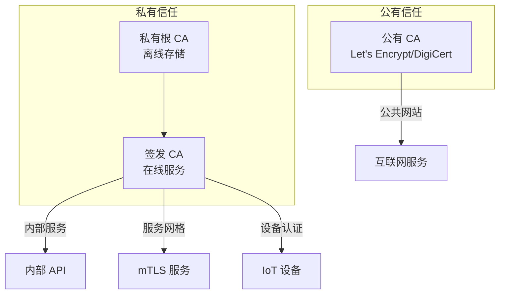
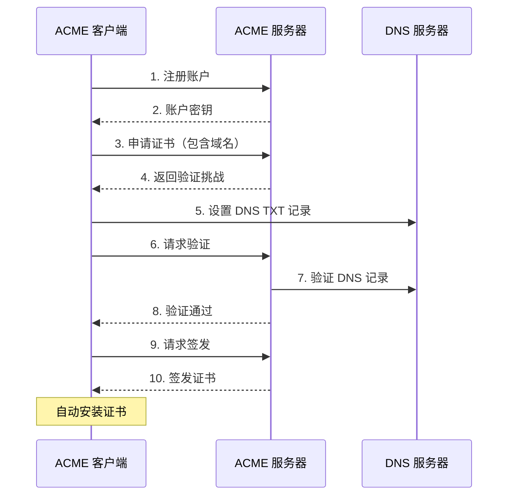

2011 年，荷兰 CA 供应商 DigiNotar 被攻击，攻击者签发了数十张伪造的 Google、Yahoo、Tor 等网站的证书。这起事件导致荷兰政府不得不关闭所有使用 DigiNotar 证书的政府服务。

DigiNotar 最终破产，成为 PKI 历史上最惨烈的教训之一。这个故事告诉我们：**CA 的安全不是可选项，而是生死线**。

本文深入探讨 CA 的实际运营：从搭建私有 CA 到管理证书生命周期，从命令行到自动化。

## 一、公有 CA 与私有 CA

### 公有 CA

公有 CA 为公共互联网签发证书，被所有主流浏览器和操作系统默认信任：

| CA 名称 | 类型 | 市场份额（估计） |
|---------|------|-----------------|
| Let's Encrypt | 非营利 | ~50% |
| DigiCert | 商业 | ~15% |
| Sectigo (Comodo) | 商业 | ~15% |
| GoDaddy | 商业 | ~10% |
| GlobalSign | 商业 | ~5% |

**选择公有 CA 的场景**：
- 公共网站和 Web 应用
- 需要被所有用户和设备信任
- 不想维护自己的 PKI 基础设施

### 私有 CA

私有 CA 用于内部系统和组织间的信任：

**选择私有 CA 的场景**：
- 企业内部系统
- 服务网格（mTLS）
- 移动应用的后端 API
- IoT 设备认证
- 开发/测试环境

**私有 CA 的优势**：
- 完全控制证书策略
- 无需依赖外部 CA
- 无证书费用
- 可实现更严格的安全控制

### 混合方案

大型组织通常采用混合方案：



## 二、OpenSSL 搭建私有 CA

### CA 目录结构

```bash
# 创建标准 CA 目录结构
mkdir -p demoCA/{certs,crl,newcerts,private}
chmod 700 demoCA/private
touch demoCA/index.txt
echo 01 > demoCA/serial
echo 01 > demoCA/crlnumber

# 目录结构说明：
# certs/          - 已签发证书存档
# crl/            - 证书吊销列表
# newcerts/       - 新签发证书
# private/        - CA 私钥（最高权限保护）
# index.txt       - 证书数据库
# serial          - 下一个证书序列号
# crlnumber       - 下一个 CRL 序列号
```

### 生成 CA 根证书

```bash title="generate-root-ca.sh"
#!/bin/bash

# 根 CA 配置文件
cat > ca.cnf << 'EOF'
[ca]
default_ca = CA_default

[CA_default]
dir             = ./demoCA
certs           = $dir/certs
new_certs_dir   = $dir/newcerts
database        = $dir/index.txt
serial          = $dir/serial
RANDFILE        = $dir/private/.rand
private_key     = $dir/private/ca.key
certificate     = $dir/certs/ca.crt
policy          = policy_strict
crlnumber       = $dir/crlnumber
crl             = $dir/crl/ca.crl
crl_extensions  = crl_ext
default_md      = sha256
name_opt        = ca_default
cert_opt        = ca_default
default_crl_days= 30

[policy_strict]
countryName             = match
stateOrProvinceName     = optional
organizationName        = match
organizationalUnitName  = optional
commonName              = supplied
emailAddress            = optional

[req]
default_bits        = 4096
distinguished_name  = req_distinguished_name
string_mask         = utf8only
default_md          = sha256
x509_extensions     = v3_ca

[req_distinguished_name]
countryName                     = Country Name (2 letter code)
stateOrProvinceName             = State or Province Name
localityName                    = Locality Name
0.organizationName              = Organization Name
organizationalUnitName          = Organizational Unit Name
commonName                      = Common Name
emailAddress                    = Email Address

[v3_ca]
subjectKeyIdentifier = hash
authorityKeyIdentifier = keyid:always,issuer
basicConstraints = critical, CA:true, pathlen:2
keyUsage = critical, digitalSignature, cRLSign, keyCertSign

[crl_ext]
authorityKeyIdentifier=keyid:always
EOF

# 生成 CA 私钥
openssl genrsa -aes256 -out demoCA/private/ca.key 4096
# 输入密码保护私钥（生产环境必须）

# 生成 CA 证书（自签名）
openssl req -config ca.cnf \
    -key demoCA/private/ca.key \
    -new -x509 \
    -days 7300 \
    -sha256 \
    -extensions v3_ca \
    -out demoCA/certs/ca.crt \
    -subj "/C=CN/ST=Beijing/L=Beijing/O=MyCompany/OU=Security/CN=My Root CA"
# 需要输入私钥密码
```

### 验证根证书

```bash
# 查看证书详情
openssl x509 -in demoCA/certs/ca.crt -text -noout

# 验证证书结构
openssl x509 -in demoCA/certs/ca.crt -text -noout | grep -A5 "X509v3"
# 应该看到：
# X509v3 Basic Constraints: critical
# CA:TRUE, pathlen:2

# 计算指纹
openssl x509 -in demoCA/certs/ca.crt -fingerprint -sha256 -noout
# SHA256 Fingerprint=XX:XX:XX:...
```

## 三、证书签发流程

### 创建证书签名请求（CSR）

```bash title="create-csr.sh"
#!/bin/bash

# 服务证书 CSR 生成

# 1. 生成私钥
openssl genrsa -out server.key 2048

# 2. 生成 CSR
openssl req -new -sha256 \
    -key server.key \
    -out server.csr \
    -subj "/C=CN/ST=Beijing/L=Beijing/O=MyCompany/OU=IT/CN=api.example.com"

# 3. 创建 SAN 配置文件
cat > server_ext.cnf << 'EOF'
authorityKeyIdentifier=keyid,issuer
basicConstraints=CA:FALSE
keyUsage = digitalSignature, nonRepudiation, keyEncipherment, dataEncipherment
extendedKeyUsage = serverAuth, clientAuth
subjectAltName = @alt_names

[alt_names]
DNS.1 = api.example.com
DNS.2 = *.example.com
DNS.3 = localhost
IP.1 = 127.0.0.1
EOF

# 4. 使用 CA 签发证书
openssl ca -config ca.cnf \
    -in server.csr \
    -out server.crt \
    -extensions server_ext \
    -days 365 \
    -notext

# 5. 验证证书
openssl verify -CAfile demoCA/certs/ca.crt server.crt
```

### 中级 CA 的创建与使用

```bash title="create-intermediate-ca.sh"
#!/bin/bash

# 创建中间 CA

# 1. 生成中间 CA 私钥
openssl genrsa -aes256 -out intermediate.key 4096

# 2. 生成中间 CA CSR
openssl req -new -sha256 \
    -key intermediate.key \
    -out intermediate.csr \
    -subj "/C=CN/ST=Beijing/L=Beijing/O=MyCompany/OU=Intermediate CA/CN=My Issuing CA"

# 3. 创建中间 CA 配置
cat > intermediate.cnf << 'EOF'
basicConstraints = critical, CA:true, pathlen:0
keyUsage = critical, digitalSignature, cRLSign, keyCertSign
subjectKeyIdentifier = hash
EOF

# 4. 使用根 CA 签发中间 CA 证书
openssl ca -config ca.cnf \
    -extensions v3_intermediate_ca \
    -days 1825 \
    -notext \
    -md sha256 \
    -in intermediate.csr \
    -out intermediate.crt

# 5. 创建证书链
cat intermediate.crt demoCA/certs/ca.crt > full_chain.crt

# 6. 验证中间 CA 证书
openssl verify -CAfile demoCA/certs/ca.crt intermediate.crt
```

### 完整证书链构建

```bash
# 查看证书链
openssl storeutl -noout -text -view certstore demoCA/certs/ca.crt

# 验证完整链
openssl verify -CAfile full_chain.crt server.crt

# 导出 PEM 格式的完整证书链
cat server.crt intermediate.crt demoCA/certs/ca.crt > full_server_chain.pem
```

## 四、证书模板设计

### 企业证书模板

```bash title="certificate-profiles.cnf"
# 服务器证书模板
[server_cert]
basicConstraints = CA:FALSE
nsCertType = server
nsComment = "OpenSSL Generated Server Certificate"
subjectKeyIdentifier = hash
authorityKeyIdentifier = keyid,issuer:always
keyUsage = critical, digitalSignature, keyEncipherment
extendedKeyUsage = serverAuth, clientAuth
subjectAltName = @alt_names

# 客户端证书模板
[client_cert]
basicConstraints = CA:FALSE
nsCertType = client, email
nsComment = "OpenSSL Generated Client Certificate"
subjectKeyIdentifier = hash
authorityKeyIdentifier = keyid,issuer
keyUsage = critical, nonRepudiation, digitalSignature, keyEncipherment
extendedKeyUsage = clientAuth, emailProtection, smartcardlogon

# 代码签名证书模板
[code_signing]
basicConstraints = CA:FALSE
nsCertType = objsign
nsComment = "OpenSSL Generated Code Signing Certificate"
subjectKeyIdentifier = hash
authorityKeyIdentifier = keyid,issuer:always
keyUsage = critical, digitalSignature
extendedKeyUsage = codeSigning

# 时间戳授权证书模板
[time_stamping]
basicConstraints = CA:FALSE
nsCertType = timestampsign
nsComment = "OpenSSL Generated Time Stamping Certificate"
subjectKeyIdentifier = hash
authorityKeyIdentifier = keyid,issuer:always
keyUsage = critical, digitalSignature, nonRepudiation
extendedKeyUsage = critical, timeStamping
```

### Java 中的证书配置

```java title="CertificateTemplateBuilder.java"
import java.security.*;
import java.security.spec.*;
import java.time.*;
import java.util.*;

public class CertificateTemplateBuilder {
    
    /**
     * 服务器证书扩展配置
     */
    public static List<Extension> buildServerCertExtensions(
            String domain, List<String> alternativeNames) throws Exception {
        
        List<Extension> extensions = new ArrayList<>();
        
        // 1. 密钥用途
        extensions.add(new Extension(
            "2.5.29.15",
            true,  // critical
            encodeKeyUsage(
                KeyUsage.digitalSignature | 
                KeyUsage.keyEncipherment
            )
        ));
        
        // 2. 扩展密钥用途
        extensions.add(new Extension(
            "2.5.29.37",
            true,
            encodeExtendedKeyUsage(
                ExtendedKeyUsage.serverAuth,
                ExtendedKeyUsage.clientAuth
            )
        ));
        
        // 3. 备用名称
        extensions.add(new Extension(
            "2.5.29.17",
            false,  // not critical
            encodeSubjectAltName(domain, alternativeNames)
        ));
        
        // 4. 基本约束
        extensions.add(new Extension(
            "2.5.29.19",
            true,
            encodeBasicConstraints(false, -1)  // 不是 CA
        ));
        
        return extensions;
    }
    
    private static byte[] encodeKeyUsage(int usage) {
        // DER 编码的密钥用途
        return new byte[] {
            0x03, 0x02, 0x07, 
            (byte)((usage >> 24) & 0xFF),
            (byte)((usage >> 16) & 0xFF),
            (byte)((usage >> 8) & 0xFF),
            (byte)(usage & 0xFF)
        };
    }
}
```

## 五、证书生命周期管理

### 证书状态管理

```java title="CertificateLifecycleManager.java"
@Service
@Slf4j
public class CertificateLifecycleManager {
    
    @Autowired
    private CertificateRepository certificateRepository;
    
    @Autowired
    private AlertService alertService;
    
    /**
     * 证书状态枚举
     */
    public enum CertificateStatus {
        ISSUED,        // 已签发
        ACTIVE,       // 激活使用中
        EXPIRING_SOON, // 即将过期（30 天内）
        EXPIRED,       // 已过期
        REVOKED,       // 已吊销
        RETIRED        // 已退役
    }
    
    /**
     * 证书签发
     */
    @Transactional
    public CertificateIssueResult issueCertificate(CertificateRequest request) {
        
        // 1. 验证请求
        validateRequest(request);
        
        // 2. 生成密钥对（使用 HSM 或 KMS）
        KeyPair keyPair = generateKeyPair(request.getKeyAlgorithm());
        
        // 3. 生成 CSR
        PKCS10CertificationRequest csr = generateCSR(keyPair, request);
        
        // 4. 验证 CSR
        verifyCSR(csr, request);
        
        // 5. 签发证书
        X509Certificate certificate = signCertificate(csr, request);
        
        // 6. 存储证书和私钥
        String encryptedPrivateKey = encryptPrivateKey(
            keyPair.getPrivate(), request.getEncryptionKey());
        
        Certificate cert = Certificate.builder()
            .serialNumber(certificate.getSerialNumber().toString())
            .subject(certificate.getSubjectX500Principal().getName())
            .issuer(certificate.getIssuerX500Principal().getName())
            .notBefore(certificate.getNotBefore().toInstant())
            .notAfter(certificate.getNotAfter().toInstant())
            .status(CertificateStatus.ACTIVE)
            .publicKey(certificate.getPublicKey().getEncoded())
            .encryptedPrivateKey(encryptedPrivateKey)
            .build();
        
        certificateRepository.save(cert);
        
        // 7. 安排过期检查任务
        scheduleExpirationCheck(cert);
        
        return new CertificateIssueResult(certificate, keyPair);
    }
    
    /**
     * 证书吊销
     */
    @Transactional
    public void revokeCertificate(String serialNumber, RevocationReason reason) {
        
        Certificate cert = certificateRepository.findBySerialNumber(serialNumber)
            .orElseThrow(() -> new CertificateNotFoundException(serialNumber));
        
        // 1. 更新状态
        cert.setStatus(CertificateStatus.REVOKED);
        cert.setRevocationDate(Instant.now());
        cert.setRevocationReason(reason);
        
        // 2. 生成新的 CRL
        generateCRL();
        
        // 3. 发送告警
        alertService.sendSecurityAlert(
            SecurityAlertType.CERTIFICATE_REVOKED,
            cert.getSubject(),
            reason.name()
        );
        
        // 4. 触发证书替换流程
        if (reason == RevocationReason.KEY_COMPROMISE) {
            notifyRelatedCertificates(cert);
        }
        
        certificateRepository.save(cert);
    }
    
    /**
     * 证书轮转
     */
    @Transactional
    public CertificateRotationResult rotateCertificate(String serialNumber) {
        
        Certificate oldCert = certificateRepository.findBySerialNumber(serialNumber)
            .orElseThrow(() -> new CertificateNotFoundException(serialNumber));
        
        // 1. 签发新证书
        CertificateRequest newRequest = CertificateRequest.builder()
            .subject(oldCert.getSubject())
            .domain(oldCert.getDomain())
            .validityDays(365)
            .keyAlgorithm(oldCert.getKeyAlgorithm())
            .build();
        
        CertificateIssueResult newCertResult = issueCertificate(newRequest);
        
        // 2. 部署新证书
        deployCertificate(newCertResult.getCertificate(), oldCert.getServiceId());
        
        // 3. 保留旧证书（用于回滚）
        oldCert.setStatus(CertificateStatus.RETIRED);
        oldCert.setReplacementSerialNumber(
            newCertResult.getCertificate().getSerialNumber().toString());
        oldCert.setRetirementDate(Instant.now());
        
        // 4. 启动观察期
        startObservationPeriod(oldCert, newCertResult.getCertificate());
        
        return new CertificateRotationResult(oldCert, newCertResult.getCertificate());
    }
}
```

## 六、证书自动化：ACME 协议

### ACME 协议概述

ACME（Automatic Certificate Management Environment）由 Let's Encrypt 开发，实现了证书申请和签发的完全自动化：



### 使用 acme.sh 管理证书

```bash title="acme-certificate-management.sh"
#!/bin/bash

# 安装 acme.sh
curl https://get.acme.sh | sh -s email=admin@example.com

# 切换到真实 CA（默认使用 Let's Encrypt）
.acme.sh/acme.sh --set-default-ca --server letsencrypt

# 申请证书 - DNS 验证方式
.acme.sh/acme.sh --issue \
    --dns dns_dp \
    -d example.com \
    -d "*.example.com" \
    --keylength ec-256

# 或者 HTTP 验证方式（需要 Web 服务器）
.acme.sh/acme.sh --issue \
    --webroot /var/www/html \
    -d example.com \
    -d api.example.com

# 部署到 Apache
.acme.sh/acme.sh --deploy \
    --deploy-hook apache \
    -d example.com

# 部署到 Nginx
.acme.sh/acme.sh --deploy \
    --deploy-hook nginx \
    -d example.com

# 查看已签发证书
.acme.sh/acme.sh --list

# 手动续期
.acme.sh/acme.sh --renew -d example.com

# 强制续期
.acme.sh/acme.sh --renew -d example.com --force

# 自动续期 cron 任务（自动添加）
crontab -l | grep acme.sh
# 0 0 * * * "/root/.acme.sh"/acme.sh --cron --home "/root/.acme.sh" > /dev/null
```

### Java ACME 客户端实现

```java title="AcmeCertificateClient.java"
import org.shredzone.acme4j.*;
import org.shredzone.acme4j.enums.*;
import org.shredzone.acme4j.util.*;
import java.security.*;

public class AcmeCertificateClient {
    
    private static final String ACME_SERVER = "https://acme-v02.api.letsencrypt.org/directory";
    
    /**
     * 创建 ACME 账户
     */
    public Session createAccount(String email) throws Exception {
        // 创建账户密钥对
        KeyPair accountKeyPair = generateKeyPair("EC", "secp256r1");
        
        // 创建会话
        Session session = new Session(ACME_SERVER, accountKeyPair);
        
        // 注册账户
        Account account = session.login(
            URI.create("mailto:" + email), 
            new AccountBuilder()
                .addEmail(email)
                .agreeToTermsOfService()
                .useKeyPair(accountKeyPair)
                .create(session)
        );
        
        return session;
    }
    
    /**
     * 申请证书（HTTP-01 验证）
     */
    public CertificateRequestResult requestCertificateHttp(
            Session session, 
            List<String> domains) throws Exception {
        
        // 1. 创建订单
        Order order = session.account()
            .newOrder()
            .domains(domains.toArray(new String[0]))
            .create();
        
        // 2. 获取授权
        for (Authorization auth : order.getAuthorizations()) {
            if (auth.getStatus() == Authorization.Status.PENDING) {
                Http01Authorization httpAuth = auth.http01();
                
                // 生成挑战 token 和 key authorization
                String token = httpAuth.getToken();
                String keyAuth = httpAuth.getKeyAuthorization();
                
                // 将 token 保存到 Web 服务器
                saveHttpChallenge(token, keyAuth);
                
                // 触发 ACME 服务器验证
                httpAuth.trigger();
                
                // 等待验证完成
                httpAuth.loopUntilValid();
                
                // 删除 challenge 文件
                deleteHttpChallenge(token);
            }
        }
        
        // 3. 生成证书密钥对
        KeyPair certKeyPair = generateKeyPair("EC", "secp256r1");
        
        // 4. 创建 CSR
        CSRBuilder csrb = new CSRBuilder();
        csrb.addDomain(domains.get(0));
        domains.subList(1, domains.size()).forEach(csrb::addDomain);
        csrb.sign(certKeyPair);
        
        // 5. 请求签发
        order.execute(csrb.getCSR());
        
        // 6. 下载证书
        Certificate cert = order.getCertificate();
        
        return new CertificateRequestResult(cert, certKeyPair);
    }
    
    /**
     * 申请证书（DNS-01 验证）
     */
    public CertificateRequestResult requestCertificateDns(
            Session session,
            List<String> domains) throws Exception {
        
        // 类似 HTTP 验证，但使用 DNS TXT 记录
        // DNS 验证的好处是可以申请通配符证书
        
        Order order = session.account()
            .newOrder()
            .domains(domains.toArray(new String[0]))
            .create();
        
        for (Authorization auth : order.getAuthorizations()) {
            if (auth.getStatus() == Authorization.Status.PENDING) {
                Dns01Authorization dnsAuth = auth.dns01();
                
                String token = dnsAuth.getToken();
                String keyAuth = dnsAuth.getKeyAuthorization();
                
                // 添加 DNS TXT 记录
                addDnsTxtRecord("_acme-challenge." + auth.getDomain(), keyAuth);
                
                dnsAuth.trigger();
                dnsAuth.loopUntilValid();
                
                removeDnsTxtRecord("_acme-challenge." + auth.getDomain());
            }
        }
        
        // 后续步骤同上...
        return null;
    }
}
```

## 七、证书链配置与调试

### 常见问题排查

```bash title="certificate-debugging.sh"
#!/bin/bash

# 1. 检查证书详情
echo "=== 证书信息 ==="
openssl x509 -in server.crt -text -noout

# 2. 检查证书链
echo "=== 证书链 ==="
openssl verify -show_chain -CAfile ca.crt server.crt

# 3. 检查 SNI 配置
echo "=== SNI 测试 ==="
openssl s_client -servername example.com \
    -connect example.com:443 \
    -showcerts 2>/dev/null | \
    openssl x509 -noout -subject -issuer

# 4. 检查中间证书
echo "=== 中间证书验证 ==="
openssl verify -CAfile root.crt -untrusted intermediate.crt server.crt

# 5. 检查私钥匹配
echo "=== 私钥匹配验证 ==="
openssl x509 -noout -modulus -in server.crt | openssl md5
openssl rsa -noout -modulus -in server.key | openssl md5
# 两个 MD5 应该相同

# 6. 检查证书链完整性
echo "=== 完整链检查 ==="
openssl s_client -connect example.com:443 \
    -showcerts 2>/dev/null | \
    openssl x509 -noout -subject

# 7. 检查证书过期
echo "=== 过期检查 ==="
openssl x509 -in server.crt -noout -dates

# 8. 检查支持的协议
echo "=== TLS 版本检查 ==="
openssl s_client -tls1_2 -connect example.com:443 </dev/null 2>&1 | grep "Protocol"
openssl s_client -tls1_3 -connect example.com:443 </dev/null 2>&1 | grep "Protocol"

# 9. 检查密码套件
echo "=== 密码套件 ==="
openssl s_client -connect example.com:443 </dev/null 2>&1 | \
    grep "Cipher" | head -1
```

### Nginx 配置示例

```nginx title="nginx-ssl.conf"
server {
    listen 443 ssl http2;
    server_name example.com;
    
    # 证书配置
    ssl_certificate /etc/ssl/certs/full_chain.pem;
    ssl_certificate_key /etc/ssl/private/server.key;
    
    # TLS 版本配置
    ssl_protocols TLSv1.2 TLSv1.3;
    
    # 密码套件配置（TLS 1.3 自动协商）
    ssl_ciphers 'ECDHE-ECDSA-AES128-GCM-SHA256:ECDHE-RSA-AES128-GCM-SHA256';
    ssl_prefer_server_ciphers off;
    
    # OCSP Stapling
    ssl_stapling on;
    ssl_stapling_verify on;
    resolver 8.8.8.8 8.8.4.4 valid=300s;
    resolver_timeout 5s;
    ssl_trusted_certificate /etc/ssl/certs/ca.crt;
    
    # HSTS 配置
    add_header Strict-Transport-Security "max-age=31536000; includeSubDomains" always;
    
    # 安全头
    add_header X-Frame-Options DENY always;
    add_header X-Content-Type-Options nosniff always;
    add_header X-XSS-Protection "1; mode=block" always;
}
```

---

## 思考题

**问题 1**：假设你需要为一个微服务架构的系统设计 mTLS 证书管理方案。系统有 1000 个微服务实例，每个月会有 20% 的实例会被更新或重新部署。请设计一个自动化的证书管理流程，确保：

1. 服务之间能自动建立 mTLS 连接
2. 证书能够自动续期，不影响服务可用性
3. 被入侵的服务证书能够被快速吊销

<details>
<summary>参考答案</summary>

**mTLS 证书管理架构**：

```
┌─────────────────────────────────────────────────────────────────┐
│                     mTLS 证书管理架构                            │
├─────────────────────────────────────────────────────────────────┤
│                                                                 │
│  ┌─────────────┐                                               │
│  │  SPIFFE     │ ← 标准化身份标识                              │
│  │  Feeder     │                                               │
│  └─────────────┘                                               │
│         │                                                       │
│         ▼                                                       │
│  ┌─────────────┐     ┌─────────────┐     ┌─────────────┐       │
│  │ Vault CA    │────►│ Agent       │────►│ Service     │       │
│  │ (私有 CA)   │     │ (边车)      │     │ (工作负载)  │       │
│  └─────────────┘     └─────────────┘     └─────────────┘       │
│         │                                                       │
│         │                                                       │
│         ▼                                                       │
│  ┌─────────────┐     ┌─────────────┐                           │
│  │ Vault       │────►│ Certificate │                           │
│  │ PKI Engine  │     │ Templates   │                           │
│  └─────────────┘     └─────────────┘                           │
│                                                                 │
└─────────────────────────────────────────────────────────────────┘
```

**自动化证书管理流程**：

```java title="MtlsCertificateManager.java"
@Service
@Slf4j
public class MtlsCertificateManager {
    
    @Autowired
    private VaultClient vaultClient;
    
    @Autowired
    private ServiceRegistry serviceRegistry;
    
    /**
     * 服务启动时获取证书
     */
    public MtlsCertificate bootstrapService(String serviceId, String namespace) {
        
        // 1. 获取服务身份
        SpiffeId spiffeId = SpiffeId.builder()
            .trustDomain("cluster.local")
            .namespace(namespace)
            .serviceAccount(serviceId)
            .build();
        
        // 2. 从 Vault 获取证书
        MtlsCertificate cert = vaultClient.issueCertificate(
            VaultCertificateRequest.builder()
                .commonName(spiffeId.toString())
                .ttl(Duration.ofDays(1))
                .allowedSans(List.of(
                    "dns:" + serviceId + "." + namespace,
                    "spiffe://cluster.local/" + namespace + "/" + serviceId
                ))
                .keyType("ec")
                .keyBits(256)
                .build()
        );
        
        // 3. 配置 mTLS
        configureMtls(cert);
        
        // 4. 启动证书轮转
        startRotation(cert);
        
        // 5. 注册服务
        serviceRegistry.register(serviceId, cert.getSerialNumber());
        
        return cert;
    }
    
    /**
     * 证书轮转（不影响连接）
     */
    @Async
    public void startRotation(MtlsCertificate cert) {
        // 轮转策略：证书 TTL 的 2/3 时长时开始轮转
        Duration rotationInterval = cert.getTtl().multipliedBy(2).dividedBy(3);
        
        ScheduledExecutorService scheduler = Executors.newScheduledThreadPool(1);
        scheduler.scheduleAtFixedRate(() -> {
            try {
                // 1. 获取新证书（不影响当前连接）
                MtlsCertificate newCert = vaultClient.issueCertificate(
                    cert.getRequest());
                
                // 2. 原子性切换（使用 SDS 或挂载卷）
                rotateCertificate(cert, newCert);
                
                // 3. 等待旧连接优雅关闭
                Thread.sleep(TimeUnit.MINUTES.toMillis(5));
                
                // 4. 下线旧证书
                vaultClient.revokeCertificate(cert.getSerialNumber());
                
            } catch (Exception e) {
                log.error("证书轮转失败", e);
                alertService.sendAlert("证书轮转失败", cert.getServiceId());
            }
        }, rotationInterval.toMillis(), rotationMillis, TimeUnit.MILLISECONDS);
    }
    
    /**
     * 紧急吊销
     */
    @Transactional
    public void emergencyRevoke(String serviceId, RevocationReason reason) {
        // 1. 获取服务证书
        List<Certificate> certs = certificateRepository.findByServiceId(serviceId);
        
        // 2. 吊销所有证书
        for (Certificate cert : certs) {
            if (cert.getStatus() != CertificateStatus.REVOKED) {
                // 立即吊销
                vaultClient.revokeCertificate(
                    cert.getSerialNumber(), 
                    reason
                );
                
                cert.setStatus(CertificateStatus.REVOKED);
                cert.setRevocationDate(Instant.now());
                cert.setRevocationReason(reason);
                
                certificateRepository.save(cert);
            }
        }
        
        // 3. 从服务注册表移除
        serviceRegistry.deregister(serviceId);
        
        // 4. 通知其他服务（通过 mTLS 连接或消息队列）
        notifyPeerServices(serviceId, reason);
        
        // 5. 安全告警
        securityAlertService.sendCriticalAlert(
            "服务证书被紧急吊销",
            Map.of(
                "serviceId", serviceId,
                "reason", reason.name(),
                "timestamp", Instant.now().toString()
            )
        );
    }
}
```

**关键设计要点**：

```
1. 短 TTL + 自动轮转
   - 证书 TTL 设置为 24 小时
   - 在 TTL 的 2/3 处自动轮转
   - 确保即使证书泄露，攻击窗口也很短

2. 服务网格集成
   - 使用 Istio/Linkerd 的 mTLS 功能
   - 让服务网格处理证书分发和验证
   - 应用层无需关心证书细节

3. Vault 作为证书颁发机构
   - Vault 提供 PKI 引擎
   - 支持动态证书签发
   - 内置 CRL 支持

4. SPIFFE/SPIRE 身份体系
   - 标准化服务身份
   - 跨集群信任
   - 自动化的 workload attestation
```

</details>

**问题 2**：2017 年，赛门铁克（Symantec）被 Google Chrome 宣布不再信任其签发的证书。原因是 Google 发现赛门铁克错误签发了数千张证书，包括 Google 域名下的证书。请分析这次事件的根本原因，以及 CA 行业应该如何防止类似事件再次发生。

<details>
<summary>参考答案</summary>

**事件回顾**：

```
2015-2017 年：Google 发现赛门铁克错误签发了数十张 Google 域名的证书
2017 年：Google 宣布逐步取消对赛门铁克证书的信任
2018 年：DigiCert 收购赛门铁克 PKI 业务
2018 年：Chrome 66 完全取消信任赛门铁克根证书
```

**根本原因分析**：

```
技术层面：
1. CA 运营系统的安全漏洞
   - 员工钓鱼导致内部系统被入侵
   - 证书签发自动化程度不足，依赖人工操作
   - 缺乏对证书签发行为的有效监控

2. 验证流程的缺失
   - 没有充分的日志记录
   - 没有异常检测机制
   - 审计不及时

管理层面：
1. CA 过度信任下属子公司
   - WoSign（赛门铁克收购的子公司）未经充分审查
   - 子公司可以在根证书下签发任意证书

2. 缺乏有效的外部监督
   - CT 日志记录不完整
   - 同行审查机制缺失
```

**行业应对措施**：

```
1. Certificate Transparency（证书透明度）
   - 所有证书必须记录到公开 CT 日志
   - 任何人都可以监控异常证书签发
   - 阻止"幽灵证书"（在信任被移除后才出现的证书）

2. CAA（Certification Authority Authorization）
   - DNS 记录指定允许签发该域名证书的 CA
   - 未授权的 CA 无法签发证书
   - RFC 6844

3. 自动化和最小权限
   - 证书签发流程完全自动化
   - CA 系统实施零信任架构
   - 私钥离线存储，多人控制

4. 持续的 CA 审计
   - WebTrust 审计
   - 浏览器厂商持续监控
   - 公开的安全事件报告

5. 备份 CA 计划
   - 多 CA 交叉签名
   - 确保一个 CA 问题不影响所有证书
```

**现代 CA 安全框架**：

```
┌─────────────────────────────────────────────────────────────────┐
│                      CA 安全运营框架                              │
├─────────────────────────────────────────────────────────────────┤
│                                                                 │
│  1. 人员安全                                                    │
│     ├── 多因素认证                                             │
│     ├── 职责分离                                               │
│     ├── 背景调查                                                │
│     └── 安全培训                                                │
│                                                                 │
│  2. 技术安全                                                    │
│     ├── HSM 存储私钥                                            │
│     ├── 零信任 CA 系统                                         │
│     ├── 自动化证书签发                                         │
│     └── 实时监控和告警                                         │
│                                                                 │
│  3. 流程安全                                                    │
│     ├── 变更管理                                               │
│     ├── 事件响应                                               │
│     ├── 定期审计                                               │
│     └── 业务连续性                                             │
│                                                                 │
│  4. 透明度                                                      │
│     ├── Certificate Transparency                               │
│     ├── 公开的审计报告                                         │
│     ├── CVE 和事件披露                                         │
│     └── Bug Bounty 计划                                        │
│                                                                 │
└─────────────────────────────────────────────────────────────────┘
```

</details>
