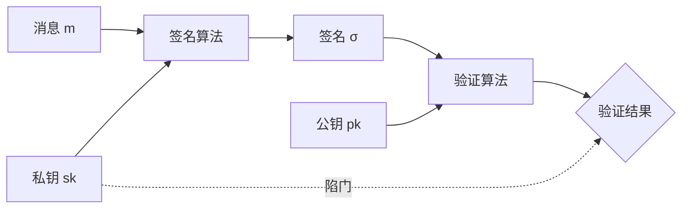

想象一个场景：你收到一份电子合同，用鼠标轻轻一点，合同就「签」好了。但你怎么确定这份合同真的是对方签署的，而不是被中间人篡改过的？

这就是数字签名要解决的问题。**数字签名不是手写签名的电子化，而是一种数学方案，能够证明消息确实来自声称的发送者，且在传输过程中未被篡改**。它是现代互联网信任体系的基石——从代码签名到 HTTPS 证书，从区块链交易到电子合同，处处都有数字签名的身影。

## 数字签名的基本原理

数字签名的核心思想可以用一句话概括：**用私钥「标记」消息，任何人都可以用公钥验证**。

### 签名的数学基础

签名过程涉及三个算法：

1. **密钥生成**：生成签名密钥对（私钥 `sk`、公钥 `pk`）
2. **签名**：使用私钥 `sk` 对消息 `m` 生成签名 `σ = Sign(sk, m)`
3. **验证**：使用公钥 `pk` 验证签名 `Verify(pk, m, σ)` 返回 true/false

签名的数学原理依赖于**陷门函数（Trapdoor Function）**的设计：正向计算容易，逆向计算困难，且只有拥有私钥的人才能进行特定方向的计算。



### 签名必须满足的三个属性

**不可伪造（Unforgeability）**：攻击者在知道公钥和任意消息的情况下，无法计算出有效签名。这基于计算复杂度假设（如大数分解的困难性）。

**不可否认（Non-repudiation）**：签名者无法否认自己签署过的消息。因为只有私钥持有者才能产生有效签名，而私钥是唯一的。

**可验证性（Verifiability）**：任何拥有公钥的人都可以验证签名的有效性，无需私钥参与。

## RSA 签名方案

RSA 既可以用于加密，也可以用于签名。签名过程本质上是「用私钥加密哈希值」。

### PKCS#1 v1.5 签名

这是最经典也是曾经最广泛使用的 RSA 签名方案。

```java title="RSA 签名（PKCS#1 v1.5）"
import java.security.KeyPairGenerator;
import java.security.Signature;
import java.security.KeyPair;
import java.util.Base64;

public class RSASignatureDemo {

    public static void main(String[] args) throws Exception {
        // 生成 RSA 密钥对
        KeyPairGenerator keyGen = KeyPairGenerator.getInstance("RSA");
        keyGen.initialize(2048);
        KeyPair keyPair = keyGen.generateKeyPair();

        String message = "这是一份重要的电子合同，金额 100 万元。";

        // 使用 SHA-256 with RSA 进行签名
        Signature signer = Signature.getInstance("SHA256withRSA");
        signer.initSign(keyPair.getPrivate());
        signer.update(message.getBytes());
        byte[] signature = signer.sign();

        System.out.println("RSA 签名长度: " + signature.length + " 字节");
        System.out.println("签名值: " + Base64.getEncoder().encodeToString(signature));

        // 验证签名
        Signature verifier = Signature.getInstance("SHA256withRSA");
        verifier.initVerify(keyPair.getPublic());
        verifier.update(message.getBytes());
        boolean isValid = verifier.verify(signature);

        System.out.println("签名验证结果: " + isValid);
    }
}
```

### RSA-PSS 签名

PKCS#1 v1.5 签名存在一些理论上的攻击面（如 Bleichenbacher 的百万消息攻击），PSS 签名通过更严谨的填充机制提供了更强的安全保障。

```java title="RSA-PSS 签名"
import java.security.Signature;
import java.security.KeyPairGenerator;
import java.security.KeyPair;

public class RSAPSSDemo {

    public static void main(String[] args) throws Exception {
        KeyPairGenerator keyGen = KeyPairGenerator.getInstance("RSA");
        keyGen.initialize(2048);
        KeyPair keyPair = keyGen.generateKeyPair();

        String message = "需要更高安全性的签名场景";

        // SHA-256 with RSA-PSS
        Signature signer = Signature.getInstance("SHA256withRSA/PSS");
        signer.initSign(keyPair.getPrivate());
        signer.setParameter(new java.security.spec.MGF1ParameterSpec("SHA-256"));
        signer.update(message.getBytes());
        byte[] signature = signer.sign();

        // 验证
        Signature verifier = Signature.getInstance("SHA256withRSA/PSS");
        verifier.initVerify(keyPair.getPublic());
        verifier.setParameter(new java.security.spec.MGF1ParameterSpec("SHA-256"));
        verifier.update(message.getBytes());
        boolean isValid = verifier.verify(signature);

        System.out.println("RSA-PSS 签名验证: " + isValid);
    }
}
```

:::tip RSA 签名最佳实践
- 优先使用 RSA-PSS 而非 PKCS#1 v1.5
- 密钥长度至少 2048 位，敏感场景使用 3072 或 4096 位
- 使用 SHA-256 或更强的哈希算法，不要使用 MD5 或 SHA-1
:::

## ECDSA 签名

椭圆曲线数字签名算法（ECDSA）是 RSA 的高效替代品。相同安全强度下，ECDSA 的密钥长度远小于 RSA。

### ECDSA 的数学原理

ECDSA 基于椭圆曲线离散对数问题（ECDLP）：给定椭圆曲线上一点 `G` 和公钥 `Q = dG`，很难求出私钥 `d`。

```java title="ECDSA 签名示例"
import java.security.KeyPairGenerator;
import java.security.Signature;
import java.security.KeyPair;
import java.security.spec.NamedParameterSpec;
import java.util.Base64;

public class ECDSASignatureDemo {

    public static void main(String[] args) throws Exception {
        // 使用 P-256 曲线
        KeyPairGenerator keyGen = KeyPairGenerator.getInstance("EC");
        keyGen.initialize(new NamedParameterSpec("P-256"));
        KeyPair keyPair = keyGen.generateKeyPair();

        System.out.println("ECDSA P-256 私钥长度: " +
            keyPair.getPrivate().getEncoded().length + " 字节");
        System.out.println("ECDSA P-256 公钥长度: " +
            keyPair.getPublic().getEncoded().length + " 字节");

        String message = "区块链交易内容";

        // 签名
        Signature signer = Signature.getInstance("SHA256withECDSA");
        signer.initSign(keyPair.getPrivate());
        signer.update(message.getBytes());
        byte[] signature = signer.sign();

        System.out.println("ECDSA 签名长度: " + signature.length + " 字节");
        System.out.println("签名值: " + Base64.getEncoder().encodeToString(signature));

        // 验证
        Signature verifier = Signature.getInstance("SHA256withECDSA");
        verifier.initVerify(keyPair.getPublic());
        verifier.update(message.getBytes());
        boolean isValid = verifier.verify(signature);

        System.out.println("验证结果: " + isValid);
    }
}
```

```java title="ECDSA vs RSA 密钥长度对比"
public class KeySizeComparison {

    public static void main(String[] args) {
        System.out.println("===== 相同安全强度下的密钥长度对比 =====");
        System.out.println();
        System.out.println("| 安全强度 | RSA 密钥长度 | ECDSA 曲线 |");
        System.out.println("|----------|---------------|-------------|");
        System.out.println("| 80 位    | 1024 位       | P-160       |");
        System.out.println("| 112 位   | 2048 位       | P-224       |");
        System.out.println("| 128 位   | 3072 位       | P-256       |");
        System.out.println("| 192 位   | 7680 位       | P-384       |");
        System.out.println("| 256 位   | 15360 位      | P-521       |");
        System.out.println();
        System.out.println("P-256 (128 位安全) 的 ECDSA 签名速度约是 RSA-2048 的 4 倍");
    }
}
```

## EdDSA 签名

EdDSA（Edwards-curve Digital Signature Algorithm）是 2011 年提出的新型签名算法，基于 Curve25519 曲线设计，被认为是目前最优雅和高效的签名方案。

EdDSA 的设计目标：

- **签名速度快**：比 ECDSA 和 RSA 快一个数量级
- **签名长度短**：64 字节，比 ECDSA 的 70-72 字节更紧凑
- **侧信道安全**：天然抗时序攻击和缓存攻击
- **安全性可证明**：基于离散对数的困难性，有严格的数学证明

```java title="EdDSA 签名示例"
import java.security.KeyPairGenerator;
import java.security.Signature;
import java.security.KeyPair;
import java.security.spec.NamedParameterSpec;
import java.util.Base64;

public class EdDSADemo {

    public static void main(String[] args) throws Exception {
        // 使用 Ed25519 曲线
        KeyPairGenerator keyGen = KeyPairGenerator.getInstance("EdDSA");
        keyGen.initialize(new NamedParameterSpec("Ed25519"));
        KeyPair keyPair = keyGen.generateKeyPair();

        System.out.println("Ed25519 私钥长度: " +
            keyPair.getPrivate().getEncoded().length + " 字节");
        System.out.println("Ed25519 公钥长度: " +
            keyPair.getPublic().getEncoded().length + " 字节");

        String message = "高性能签名场景，如区块链";

        // 签名
        Signature signer = Signature.getInstance("EdDSA");
        signer.initSign(keyPair.getPrivate());
        signer.update(message.getBytes());
        byte[] signature = signer.sign();

        System.out.println("EdDSA 签名长度: " + signature.length + " 字节");

        // 验证
        Signature verifier = Signature.getInstance("EdDSA");
        verifier.initVerify(keyPair.getPublic());
        verifier.update(message.getBytes());
        System.out.println("验证结果: " + verifier.verify(signature));
    }
}
```

## 签名的应用场景

### 代码签名

软件发布时使用代码签名，让用户能够验证软件的来源和完整性。

```java title="代码签名验证（演示概念）"
import java.security.Signature;
import java.security.cert.CertificateFactory;
import java.security.cert.X509Certificate;
import java.security.PublicKey;
import java.io.InputStream;
import java.nio.file.Files;
import java.nio.file.Path;

public class CodeSigningVerification {

    public static boolean verifySignedJar(Path jarPath, InputStream certStream) throws Exception {
        // 从证书创建 PublicKey
        CertificateFactory cf = CertificateFactory.getInstance("X.509");
        X509Certificate cert = (X509Certificate) cf.generateCertificate(certStream);
        PublicKey publicKey = cert.getPublicKey();

        // 验证 JAR 签名（实际使用 jarsigner 工具）
        // 这里演示签名验证的概念
        Signature sig = Signature.getInstance("SHA256withRSA");
        sig.initVerify(publicKey);

        // 读取 JAR 内容
        byte[] jarContent = Files.readAllBytes(jarPath);
        sig.update(jarContent);

        // 验证
        return sig.verify(readEmbeddedSignature(jarPath));
    }

    private static byte[] readEmbeddedSignature(Path jarPath) {
        // 实际实现：从 JAR 的 META-INF 目录读取签名块
        throw new UnsupportedOperationException("演示用");
    }
}
```

### 文档签名

```java title="PDF 文档签名概念"
public class DocumentSigningService {

    public byte[] signDocument(byte[] pdfContent, PrivateKey privateKey) throws Exception {
        // 计算文档哈希
        MessageDigest digest = MessageDigest.getInstance("SHA-256");
        byte[] hash = digest.digest(pdfContent);

        // 使用私钥签名哈希
        Signature signer = Signature.getInstance("SHA256withRSA");
        signer.initSign(privateKey);
        signer.update(hash);
        byte[] signature = signer.sign();

        // 将签名嵌入 PDF（实际使用 PDF 库如 iText）
        return embedSignatureInPDF(pdfContent, signature);
    }

    public boolean verifyDocument(byte[] signedPdf) throws Exception {
        // 提取签名和文档内容
        byte[] signature = extractSignature(signedPdf);
        byte[] originalContent = extractOriginalContent(signedPdf);

        // 从证书获取公钥
        PublicKey publicKey = extractPublicKeyFromPDF(signedPdf);

        // 验证
        MessageDigest digest = MessageDigest.getInstance("SHA-256");
        byte[] hash = digest.digest(originalContent);

        Signature verifier = Signature.getInstance("SHA256withRSA");
        verifier.initVerify(publicKey);
        verifier.update(hash);

        return verifier.verify(signature);
    }
}
```

## 签名与加密的组合使用

签名和加密是两个独立的过程，它们可以组合使用来同时保证**机密性**和**完整性**。

### 签名然后加密

```java title="签名+加密组合方案"
public class SignAndEncrypt {

    public byte[] signThenEncrypt(byte[] message, KeyPair signingKey, PublicKey recipientKey)
            throws Exception {

        // 1. 签名：使用发送者的私钥
        Signature signer = Signature.getInstance("SHA256withECDSA");
        signer.initSign(signingKey.getPrivate());
        signer.update(message);
        byte[] signature = signer.sign();

        // 2. 组合消息和签名
        ByteArrayOutputStream baos = new ByteArrayOutputStream();
        baos.writeInt(message.length);
        baos.write(message);
        baos.write(signature);
        byte[] combined = baos.toByteArray();

        // 3. 加密：使用接收者的公钥
        Cipher cipher = Cipher.getInstance("ECIES");
        cipher.init(Cipher.ENCRYPT_MODE, recipientKey);
        return cipher.doFinal(combined);
    }
}
```

### 加密然后签名

```java title="加密+签名组合方案"
public class EncryptAndSign {

    public EnvelopedMessage encryptThenSign(byte[] message, KeyPair recipientKey,
                                            KeyPair signingKey, String recipientId, String senderId)
            throws Exception {

        // 1. 加密消息
        Cipher cipher = Cipher.getInstance("ECIES");
        cipher.init(Cipher.ENCRYPT_MODE, recipientKey.getPublic());
        byte[] encrypted = cipher.doFinal(message);

        // 2. 对加密内容签名
        Signature signer = Signature.getInstance("SHA256withECDSA");
        signer.initSign(signingKey.getPrivate());
        signer.update(encrypted);
        byte[] signature = signer.sign();

        // 3. 返回信封消息
        return new EnvelopedMessage(encrypted, signature, senderId);
    }
}
```

:::warning 签名与加密的区别
- **签名**：证明「消息确实来自我」，但不加密内容
- **加密**：保证「只有你能看到内容」，但不证明来源

同时需要机密性和完整性时，必须同时使用签名和加密。
:::

## 证书与签名的关系

数字证书是签名方案的重要应用。证书将**公钥**与**身份**绑定，由**证书颁发机构（CA）**使用 CA 的私钥签名。

```java title="X.509 证书签名验证"
import java.security.cert.X509Certificate;
import java.security.PublicKey;

public class CertificateSignatureVerification {

    public boolean verifyCertificate(X509Certificate cert, X509Certificate issuerCert)
            throws Exception {

        // 获取颁发者的公钥
        PublicKey issuerPublicKey = issuerCert.getPublicKey();

        // 验证证书签名
        cert.checkValidity();  // 检查证书有效期
        cert.verify(issuerPublicKey);  // 验证签名

        // 验证证书用途
        boolean[] keyUsage = cert.getKeyUsage();
        if (keyUsage == null || !keyUsage[0]) {  // digitalSignature 位
            throw new SecurityException("证书不能用于数字签名");
        }

        return true;
    }
}
```

## 思考题

**问题 1**：为什么说「用私钥加密数据」和「用公钥解密」不是 RSA 签名的准确描述？
<details>
<summary>参考答案</summary>

这个描述虽然直观但不准确，原因如下：

1. **数学操作相同，但语义不同**：RSA 签名确实涉及「用私钥计算」的操作，但这个操作的目的是**签名**，而不是解密数据。签名是对消息哈希值进行数学运算，而解密是将密文还原为明文。

2. **签名不提供机密性**：加密的目的是让只有私钥持有者能解密，保护机密性。签名的目的是证明来源，不隐藏任何内容。

3. **签名的验证不等于解密**：任何人都可以用公钥「验证」签名，但不能「解密」出有意义的内容。签名验证返回的是布尔值，而不是原始消息。

正确的理解是：签名是使用私钥对**消息哈希**进行运算；验证是使用公钥检查**哈希值**是否匹配。加密和解密涉及的是完整消息的对称性操作，而签名只涉及哈希值。

NIST 的标准文档明确使用「Sign」和「Verify」而非「Encrypt with Private Key」和「Decrypt with Public Key」，正是为了避免这种混淆。
</details>

**问题 2**：如果私钥泄露了，攻击者可以伪造签名。但签名本身具有不可否认性，这意味着签名者无法否认。矛盾吗？
<details>
<summary>参考答案</summary>

这里涉及**签名者的不可否认性**与**私钥保护义务**之间的权衡。

**不可否认性的前提**：私钥确实是签名者独自持有的。如果私钥泄露，攻击者用泄露的私钥生成的签名，技术上仍是「该私钥持有者的签名」。

**法律层面的处理**：在法律实践中，「不可否认性」通常意味着：

1. 在正常情况下，签名者无法否认自己签署的内容
2. 但如果能证明私钥被窃取或泄露，可以作为抗辩理由
3. 责任通常在签名者：签名者有义务保护私钥安全

**技术层面的缓解措施**：

1. **硬件令牌**：私钥存储在智能卡或 USB Key 中，无法被导出
2. **多因素签名**：签名时需要密码 + 硬件令牌，攻击者即使拿到令牌也需要密码
3. **时间戳**：签名时使用可信时间戳服务，证明签名发生的时间
4. **密钥轮换**：定期更换签名密钥，限制泄露密钥的影响窗口
5. **撤销机制**：私钥泄露后，立即向 CA 申请证书撤销

因此，技术上的不可否认性 + 完善的安全措施 = 法律上的可执行性。
</details>
