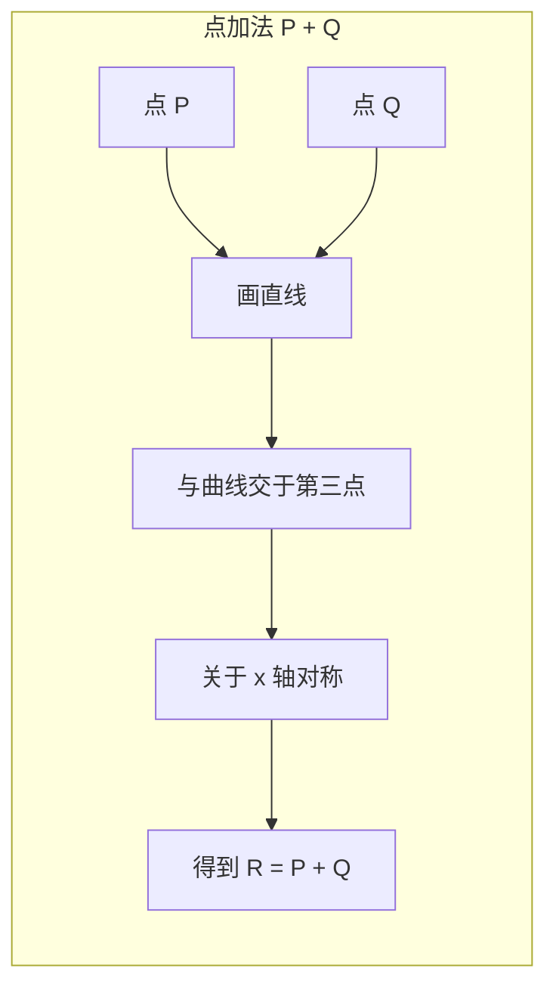
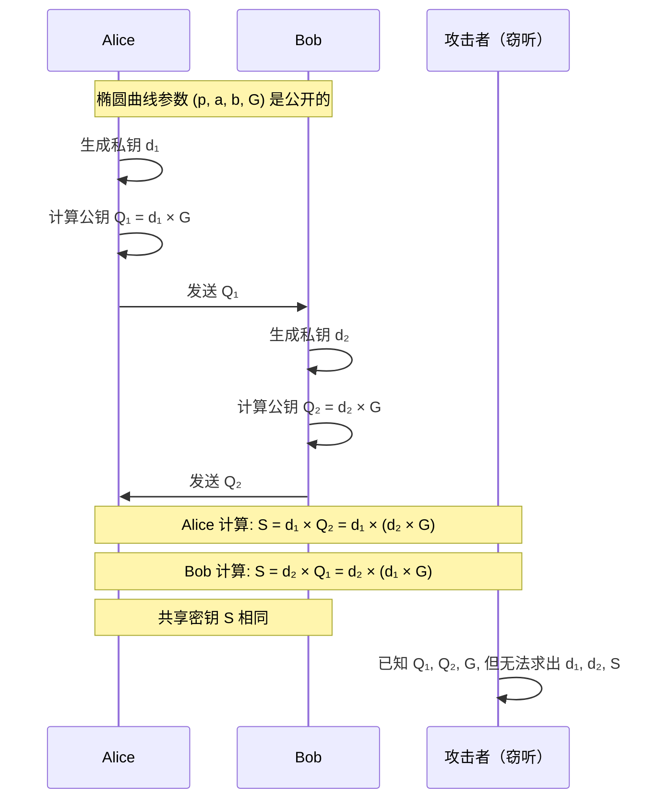

RSA-2048 的公钥长度是 256 字节。但如果我告诉你，有另一种密码学算法，用 32 字节的公钥就能提供相同甚至更高的安全性？

这不是天方夜谭，这就是椭圆曲线密码学（ECC）。

ECC 的安全性依赖于「在椭圆曲线上找一个点，等于基点 G 的 k 倍」这个问题的难度。虽然这个问题的描述只有一句话，但数学家花了数十年才证明它确实很难——比整数分解难得多。

结果是：**ECC-256 的安全性大约等于 RSA-4096，但密钥长度只有后者的 1/8**。

## 一、椭圆曲线数学基础

### 椭圆曲线的定义

椭圆曲线是满足以下方程的点的集合：

```
y² = x³ + ax + b (mod p)

其中：
- a 和 b 是常数
- p 是质数（决定有限域的大小）
- 还需要满足 4a³ + 27b² ≠ 0（确保曲线光滑）
```

这个方程看起来像「椭圆」，但实际上它跟椭圆没有任何关系。这个名字纯粹是因为计算椭圆弧长的积分公式恰好涉及这种形式的方程。

### 椭圆曲线群

椭圆曲线上的点构成一个**阿贝尔群**（Abelian Group），具备以下性质：

- **封闭性**：曲线上任意两点的「加法」结果仍在曲线上
- **结合律**：(P + Q) + R = P + (Q + R)
- **单位元**：存在一个特殊的点 O（无穷远点），使得 P + O = P
- **逆元**：对于任意点 P，存在点 -P，使得 P + (-P) = O
- **交换律**：P + Q = Q + P

### 点加法运算

椭圆曲线的「加法」不是普通的数值加法，而是一种几何运算：



**代数定义**：

对于两个不同的点 P 和 Q（都不是无穷远点），直线 PQ 与曲线的第三个交点为 R'，则 P + Q = -R'。

对于点 P 的倍乘（2P = P + P），取 P 点的切线与曲线的交点，然后关于 x 轴对称。

### 群阶与基点

- **群阶（Order）**：曲线上点的个数
- **基点（Generator/G）**：曲线上一个特殊点，由它生成的循环群包含了曲线的所有点
- **子群阶 n**：由基点生成的循环子群的大小

## 二、椭圆曲线离散对数问题（ECDLP）

### 问题定义

```
给定：
- 椭圆曲线 E
- 基点 G
- 公钥 Q = k * G（k 次点加法）

求：
k = ?
```

这个问题的「正向」计算（给定 k 计算 Q）很快——只需要 k 次点加法。

但「逆向」计算（给定 Q 和 G 求 k）极其困难。目前最好的算法需要指数级时间。

### 为什么 ECDLP 比大数分解更难

| 问题 | RSA | ECC |
|------|-----|-----|
| 数学基础 | 整数分解 | 椭圆曲线离散对数 |
| 最好攻击算法 | General Number Field Sieve | Pollard's Rho |
| 攻击复杂度 | O(exp(n^(1/3))) | O(sqrt(n)) |

对于 n 位安全问题：
- RSA 需要 2^n 次操作
- ECC 需要 2^(n/2) 次操作

这就是为什么 ECC 可以用短得多的密钥提供相同的安全性。

## 三、常用曲线详解

### NIST P-256

P-256 是美国 NIST 推荐的曲线，也是最广泛使用的曲线之一：

```
曲线方程：y² = x³ - 3x + 41058363725152142129326129780047268409166948122772542095317 (mod p)
其中 p = 2^256 - 2^224 + 2^192 + 2^96 - 1
基点阶：n = 115792089210356248762697446949407573529996955224135760342422259061068512053369
```

**特点**：
- 安全强度：128 位
- 广泛支持：所有主流浏览器、TLS 库、移动设备
- FIPS 140-2 认证
- **争议**：参数由 NSA 选择，存在被植入后门的理论可能

### Curve25519

Curve25519 由 Daniel J. Bernstein 设计，是目前最受推崇的曲线：

```
曲线方程：y² = x³ + 486662x² + x (mod p)
其中 p = 2^255 - 19
```

**设计原则**：
- 避免任何可疑的曲线参数
- 使用特殊构造的基点
- 常数通过哈希确定，无法被植入后门
- 性能优化：使用伪蒙特卡罗方法减少汉明权重

**特点**：
- 安全强度：128 位
- 无争议设计
- 性能最优
- 用于 Signal、WireGuard、TLS 1.3

### secp256k1

这是比特币使用的曲线：

```
曲线方程：y² = x³ + 7 (mod p)
其中 p = 2^256 - 2^32 - 977
```

**特点**：
- 安全强度：128 位
- 简单方程，易于实现
- 无「可疑参数」
- 广泛应用于区块链

### 曲线对比

| 曲线 | 推出机构 | 密钥大小 | 安全强度 | 特点 | 应用场景 |
|------|----------|----------|----------|------|----------|
| P-256 | NIST | 256 位 | 128 位 | 广泛支持，FIPS | 政府、金融、企业 |
| P-384 | NIST | 384 位 | 192 位 | 高安全 | 军方、高敏感 |
| Curve25519 | Bernstein | 256 位 | 128 位 | 无争议，最快 | 现代应用、TLS |
| secp256k1 | SECG | 256 位 | 128 位 | 区块链专用 | 比特币、以太坊 |

## 四、ECDH 密钥交换原理

### Diffie-Hellman 的椭圆曲线版本

ECDH 允许双方在公开通道中建立共享密钥：



### Java 实现 ECDH

```java title="EcdhKeyExchange.java"
import javax.crypto.Cipher;
import javax.crypto.KeyAgreement;
import javax.crypto.SecretKey;
import javax.crypto.spec.GCMParameterSpec;
import javax.crypto.spec.SecretKeySpec;
import java.security.*;
import java.security.spec.ECGenParameterSpec;
import java.util.Arrays;

public class EcdhKeyExchange {
    
    /**
     * 生成 ECDH 密钥对
     * 推荐使用 Curve25519 或 P-256
     */
    public static KeyPair generateKeyPair(String curve) throws Exception {
        KeyPairGenerator generator = KeyPairGenerator.getInstance("EC");
        generator.initialize(new ECGenParameterSpec(curve), new SecureRandom());
        return generator.generateKeyPair();
    }
    
    /**
     * 执行 ECDH 密钥交换
     * @return 共享密钥
     */
    public static byte[] deriveSharedSecret(KeyPair ownKeyPair, 
            PublicKey otherPublicKey) throws Exception {
        
        KeyAgreement agreement = KeyAgreement.getInstance("ECDH");
        agreement.init(ownKeyPair.getPrivate());
        agreement.doPhase(otherPublicKey, true);
        
        // 原始 ECDH 输出是 x 坐标，需要 KDF 处理
        byte[] sharedSecret = agreement.generateSecret();
        return kdf(sharedSecret, 32); // 派生 32 字节
    }
    
    /**
     * 密钥派生函数（KDF）
     * NIST SP 800-56A 建议的简单 KDF
     */
    private static byte[] kdf(byte[] z, int keyLength) throws Exception {
        MessageDigest hash = MessageDigest.getInstance("SHA-256");
        byte[] k = new byte[keyLength];
        int hashLen = 32;
        
        for (int i = 0; i < (keyLength + hashLen - 1) / hashLen; i++) {
            hash.update(z);
            hash.update((byte) (i + 1));
            byte[] h = hash.digest();
            
            int copyLen = Math.min(h.length, keyLength - i * hashLen);
            System.arraycopy(h, 0, k, i * hashLen, copyLen);
        }
        
        return k;
    }
    
    /**
     * 完整的 ECDH 密钥交换 + 加密示例
     */
    public static EncryptedData ecdhEncrypt(String plaintext, 
            PublicKey recipientPublicKey) throws Exception {
        
        // 1. 生成临时密钥对
        KeyPair ephemeralKeyPair = generateKeyPair("X25519");
        
        // 2. 计算共享密钥
        byte[] sharedSecret = deriveSharedSecret(ephemeralKeyPair, recipientPublicKey);
        
        // 3. 生成 IV
        byte[] iv = new byte[12];
        new SecureRandom().nextBytes(iv);
        
        // 4. AES-GCM 加密
        SecretKey aesKey = new SecretKeySpec(sharedSecret, "AES");
        Cipher cipher = Cipher.getInstance("AES/GCM/NoPadding");
        cipher.init(Cipher.ENCRYPT_MODE, aesKey, new GCMParameterSpec(128, iv));
        byte[] ciphertext = cipher.doFinal(plaintext.getBytes("UTF-8"));
        
        // 5. 返回加密数据和临时公钥
        return new EncryptedData(
            ciphertext,
            iv,
            ephemeralKeyPair.getPublic().getEncoded()
        );
    }
    
    /**
     * ECDH 解密
     */
    public static String ecdhDecrypt(EncryptedData encryptedData, 
            PrivateKey recipientPrivateKey) throws Exception {
        
        // 1. 恢复临时公钥
        KeyFactory keyFactory = KeyFactory.getInstance("EC");
        PublicKey ephemeralPublicKey = keyFactory.generatePublic(
            new java.security.spec.X509EncodedKeySpec(encryptedData.ephemeralPublicKey));
        
        // 2. 计算共享密钥
        byte[] sharedSecret = deriveSharedSecret(
            KeyPairGenerator.getInstance("EC")
                .generateKeyPair(), // 需要临时私钥
            ephemeralPublicKey
        );
        
        // 3. 解密
        SecretKey aesKey = new SecretKeySpec(sharedSecret, "AES");
        Cipher cipher = Cipher.getInstance("AES/GCM/NoPadding");
        cipher.init(Cipher.DECRYPT_MODE, aesKey, 
            new GCMParameterSpec(128, encryptedData.iv));
        
        return new String(cipher.doFinal(encryptedData.ciphertext), "UTF-8");
    }
    
    public record EncryptedData(
        byte[] ciphertext,
        byte[] iv,
        byte[] ephemeralPublicKey
    ) {}
}
```

## 五、ECDSA 签名原理

### 签名算法

ECDSA（Elliptic Curve Digital Signature Algorithm）是 ECDSA 的签名算法：

```java title="EcdsaSigning.java"
import java.security.*;
import java.security.spec.ECGenParameterSpec;
import java.util.Base64;

public class EcdsaSigning {
    
    /**
     * 生成 ECDSA 签名
     */
    public static byte[] sign(String message, PrivateKey privateKey) 
            throws Exception {
        Signature signature = Signature.getInstance("SHA256withECDSA");
        signature.initSign(privateKey, new SecureRandom());
        signature.update(message.getBytes("UTF-8"));
        return signature.sign();
    }
    
    /**
     * 验证签名
     */
    public static boolean verify(String message, byte[] signatureBytes, 
            PublicKey publicKey) throws Exception {
        Signature signature = Signature.getInstance("SHA256withECDSA");
        signature.initVerify(publicKey);
        signature.update(message.getBytes("UTF-8"));
        return signature.verify(signatureBytes);
    }
    
    /**
     * ECDSA 签名格式转换
     * Java 签名输出为 DER 格式，某些场景需要转换为纯 R|S 格式
     */
    public static byte[] derToRs(byte[] derSignature) {
        // DER 格式: 30 [len] 02 [r_len] r 02 [s_len] s
        int offset = 2; // 跳过 30 和长度
        
        // 读取 r
        if (derSignature[offset++] != 0x02) throw new IllegalArgumentException("Invalid R");
        int rLen = derSignature[offset++];
        byte[] r = new byte[rLen];
        System.arraycopy(derSignature, offset, r, 0, rLen);
        offset += rLen;
        
        // 读取 s
        if (derSignature[offset++] != 0x02) throw new IllegalArgumentException("Invalid S");
        int sLen = derSignature[offset++];
        byte[] s = new byte[sLen];
        System.arraycopy(derSignature, offset, s, 0, sLen);
        
        // 拼接 R|S（32 + 32 = 64 字节）
        byte[] result = new byte[64];
        System.arraycopy(normalize(r, 32), 0, result, 0, 32);
        System.arraycopy(normalize(s, 32), 0, result, 32, 32);
        return result;
    }
    
    private static byte[] normalize(byte[] value, int length) {
        byte[] result = new byte[length];
        System.arraycopy(value, Math.max(0, value.length - length), 
            result, Math.max(0, length - value.length), 
            Math.min(value.length, length));
        return result;
    }
}
```

### ECDSA 签名格式

```
DER 格式（Java 默认）：
30 [总长度] 02 [r长度] [r值] 02 [s长度] [s值]

示例（16 进制）：
30 46 02 21 00 [32字节 r值] 02 21 00 [32字节 s值]

R|S 格式（更紧凑）：
[32字节 r值][32字节 s值]  共 64 字节
```

## 六、ECC vs RSA 对比

### 密钥长度与安全强度

| 安全强度（位） | RSA 密钥长度 | ECC 密钥长度 | 长度比 |
|---------------|--------------|--------------|--------|
| 80 | 1024 | 160 | 6.4:1 |
| 112 | 2048 | 224 | 9.1:1 |
| 128 | 3072 | 256 | 12:1 |
| 192 | 7680 | 384 | 20:1 |
| 256 | 15360 | 512 | 30:1 |

### 性能对比

| 操作 | RSA-2048 | ECC-256 | ECC 优势 |
|------|----------|---------|----------|
| 密钥生成 | ~500ms | ~50ms | 10x |
| 密钥交换 | ~50ms | ~15ms | 3.3x |
| 签名 | ~50ms | ~15ms | 3.3x |
| 验签 | ~5ms | ~30ms | 0.17x |
| 公钥大小 | 256 字节 | 32 字节 | 8x |
| 私钥大小 | 256 字节 | 32 字节 | 8x |
| 签名大小 | 256 字节 | 64 字节 | 4x |

:::tip
**为什么验签反而更慢？**

ECC 的验签涉及椭圆曲线上的倍点运算，而验签需要计算 u1*G + u2*Q，涉及两次大数乘法。在高端硬件上这很快，但在资源受限的环境中可能成为瓶颈。

对于验签性能至关重要的场景（如证书链验证），RSA 可能有优势。
:::

### 应用场景推荐

| 场景 | 推荐算法 | 理由 |
|------|----------|------|
| TLS 握手 | ECC | 更快的密钥交换 |
| 移动/IoT | ECC | 密钥小，适合受限环境 |
| 区块链签名 | ECC (secp256k1) | 比特币标准 |
| 证书链验证 | RSA | 验签性能优势 |
| 大文件签名 | RSA + ECC | 混合方案 |
| 长期档案签名 | RSA-4096 | 更好的历史兼容性 |

## 七、前向保密（PFS）与 ECDH

### 为什么需要前向保密

传统 RSA 密钥交换的问题：

```
问题：
1. 客户端用服务器公钥加密 PreMasterSecret
2. 如果攻击者后来获得服务器私钥
3. 可以解密所有历史通信

原因：所有会话共享同一个长期密钥
```

ECDH 临时密钥交换（ECDHE）解决了这个问题：

```
ECDHE 方案：
1. 每次握手生成新的临时密钥对
2. 服务器长期密钥只用于签名
3. 握手结束后，临时私钥被销毁
4. 历史通信依赖已销毁的临时私钥
```

### Java 实现 ECDHE

```java title="EcdheDemo.java"
/**
 * ECDHE 在 TLS 中的使用
 * 这是 TLS 1.2 及更高版本的标准配置
 */
public class EcdheDemo {
    
    /**
     * TLS 1.3 密码套件
     * TLS_AES_128_GCM_SHA256 使用 ECDH
     * 
     * TLS 1.3 的关键改进：
     * - 1-RTT 握手（比 1.2 快）
     * - 所有密钥交换都是临时的
     * - 强制前向保密
     */
    
    /**
     * 生成 ECDHE 参数
     */
    public static void generateEcdheParams() throws Exception {
        KeyPairGenerator generator = KeyPairGenerator.getInstance("EC");
        generator.initialize(new ECGenParameterSpec("secp384r1"));
        
        KeyPair keyPair = generator.generateKeyPair();
        
        // 公钥用于 TLS 握手的 ServerKeyExchange
        byte[] publicKey = keyPair.getPublic().getEncoded();
        
        // 私钥用于计算共享密钥
        // 握手完成后必须销毁
    }
}
```

## 八、侧信道攻击与防护

### 侧信道攻击类型

侧信道攻击利用密码算法实现的物理泄露：

| 攻击类型 | 泄露来源 | 防护措施 |
|----------|----------|----------|
| 时序攻击 | 执行时间差异 | 恒定时间实现 |
| 功耗分析 | 功耗波动 | 随机掩码 |
| 电磁泄露 | 电磁辐射 | 物理屏蔽 |
| 故障注入 | 错误输出 | 完整性验证 |

### 时序攻击与防护

```java title="ConstantTimeComparison.java"
/**
 * 恒定时间比较
 * 防止时序攻击
 */
public class ConstantTimeComparison {
    
    /**
     * 安全的字符串比较
     * 执行时间与输入无关
     */
    public static boolean constantTimeEquals(String a, String b) {
        if (a.length() != b.length()) {
            // 为了保持恒定时间，仍然执行比较
            byte[] dummy = new byte[Math.max(a.length(), b.length())];
            for (int i = 0; i < dummy.length; i++) {
                dummy[i] = (byte) (a.charAt(i % a.length()) ^ b.charAt(i % b.length()));
            }
            return false;
        }
        
        int result = 0;
        for (int i = 0; i < a.length(); i++) {
            result |= a.charAt(i) ^ b.charAt(i);
        }
        return result == 0;
    }
    
    /**
     * 恒定时间内存清零
     * 防止密钥在内存中残留
     */
    public static void secureZero(byte[] data) {
        if (data == null) return;
        for (int i = 0; i < data.length; i++) {
            data[i] = 0;
        }
    }
}
```

### 曲线实现的侧信道防护

```java title="SecureEccOperations.java"
import org.bouncycastle.jce.spec.ECParameterSpec;

public class SecureEccOperations {
    
    /**
     * 抗侧信道攻击的标量乘法
     * 使用固定窗口算法
     */
    public static ECPoint secureMultiply(ECPoint G, byte[] k) {
        // 使用 Bouncy Castle 等经过审计的库
        // 不要自己实现椭圆曲线运算
        
        // 标量乘法是最容易泄露密钥的操作
        // 实现必须：
        // 1. 使用恒定时间的运算
        // 2. 使用防护（blinding）
        // 3. 随机化执行路径
        
        return G.multiply(k);
    }
}
```

:::warning
**不要自己实现密码学算法**

椭圆曲线密码学的侧信道攻击防护非常复杂。应该始终使用经过审计的库：

- **Java**: Bouncy Castle, Java SE 内置提供
- **Python**: cryptography 库
- **Go**: 标准库 crypto/elliptic
- **JavaScript**: TweetNaCl.js, WebCrypto API

自己实现很难做到完全恒定时间，容易引入侧信道漏洞。
:::

---

## 思考题

**问题 1**：假设你需要为一款资源受限的 IoT 设备设计安全通信方案。设备使用 ARM Cortex-M0 处理器，只有 32KB RAM 和 256KB Flash。在这种约束下，你选择 RSA-2048 还是 ECC-256？请详细说明理由。

<details>
<summary>参考答案</summary>

**选择：ECC-256**

**理由分析**：

**1. 密钥大小对比**

| 指标 | RSA-2048 | ECC-256 | ECC 优势 |
|------|----------|---------|----------|
| 公钥大小 | 256 字节 | 32 字节 | 8 倍 |
| 私钥大小 | 256 字节 | 32 字节 | 8 倍 |
| 签名大小 | 256 字节 | 64 字节 | 4 倍 |

对于 32KB RAM 的设备：
- RSA 需要预留 256 字节存储密钥（可接受）
- 但 ECC 只需要 32 字节，余量更充裕

**2. 性能对比**

| 操作 | RSA-2048 | ECC-256 | 说明 |
|------|----------|---------|------|
| 密钥生成 | ~500ms | ~50ms | 10 倍差距 |
| 签名 | ~50ms | ~15ms | 3.3 倍差距 |
| 验签 | ~5ms | ~30ms | ECC 较慢 |
| 密钥交换 | ~50ms | ~15ms | 3.3 倍差距 |

IoT 设备通常做签名和密钥交换（客户端），不做验签（服务器端）。在这个场景下，ECC 全面优于 RSA。

**3. 通信开销**

每次 TLS 握手需要传输公钥：
- RSA-2048: 256 字节
- ECC-256: 32 字节

对于低带宽的 IoT 场景，8 倍的传输数据差距非常显著。

**4. 代码大小**

| 库 | RSA-2048 | ECC-256 | 说明 |
|----|----------|---------|------|
| mbed TLS | ~25KB | ~20KB | ECC 代码更小 |
| WolfSSL | ~30KB | ~22KB | 同上 |

**实际建议**：

```c
// IoT 设备推荐配置

// 1. 使用 ECC-256（Curve25519 或 P-256）
// 2. TLS 1.3（减少握手轮次）
// 3. AES-128-GCM（设备性能考虑）
// 4. 如果需要与旧设备兼容，可以同时支持 RSA

// 示例 mbed TLS 配置
#define MBEDTLS_ECP_DP_SECP256R1_ENABLED
#define MBEDTLS_KEY_EXCHANGE_ECDHE_RSA_ENABLED
#define MBEDTLS_CIPHER_MODE_GCM_ENABLED
```

**潜在问题及解决方案**：

1. **兼容性**：某些旧系统不支持 ECC
   - 解决方案：双证书，或通过网关协议转换

2. **随机数生成**：Cortex-M0 可能没有硬件随机数
   - 解决方案：使用 TRNG（True Random Number Generator）或 SE（Secure Element）

3. **证书验证**：完整证书链验证开销大
   - 解决方案：证书固定（Certificate Pinning），或简化验证

</details>

**问题 2**：解释ECDSA签名中的 nonce（k值）重用问题。如果同一个私钥对两条不同的消息使用了相同的 k 值，会发生什么？这种攻击在实际中是否可能发生？

<details>
<summary>参考答案</summary>

**Nonce 重用问题分析**：

**数学原理**：

ECDSA 签名中，k 是签名算法使用的随机数：

```
给定消息 m，签名 (r, s) 由以下步骤生成：
1. 选择随机数 k（1 < k < n）
2. 计算 (x, y) = k × G
3. r = x mod n
4. s = k⁻¹ × (H(m) + r × d) mod n

其中 d 是私钥，H 是哈希函数
```

**如果两个消息使用了相同的 k**：

```
签名 1（消息 m1）：s1 = k⁻¹ × (H(m1) + r × d) mod n
签名 2（消息 m2）：s2 = k⁻¹ × (H(m2) + r × d) mod n

从 s2 - s1 可得：
s2 - s1 = k⁻¹ × (H(m2) - H(m1)) mod n

两边乘以 k：
k × (s2 - s1) = H(m2) - H(m1) mod n

由于 k、s1、s2、m1、m2 都知道，可以求出 k：
k = (H(m2) - H(m1)) × (s2 - s1)⁻¹ mod n
```

**从 k 恢复私钥**：

```
已知 k，可以从任意一个签名恢复私钥：
s = k⁻¹ × (H(m) + r × d) mod n

两边乘以 k：
k × s = H(m) + r × d mod n

所以：
d = (k × s - H(m)) × r⁻¹ mod n
```

**实际案例：PlayStation 3 签名泄露**

2010 年，索尼 PlayStation 3 的 ECDSA 签名被破解，原因是所有固件更新都使用相同的 k 值。黑客利用这一漏洞，为 PS3 创建了自制固件，导致索尼损失数亿美元。

**攻击是否可能发生？**

**理论上**：只要遵守规则，k 是随机生成且只使用一次，攻击不可行。

**实践中**：可能发生的情况：

| 场景 | 风险 | 原因 |
|------|------|------|
| 固件随机数故障 | **高** | 硬件 RNG bug 导致 k 重复 |
| 嵌入式系统 | **中** | 弱随机数生成器 |
| 虚拟机克隆 | **高** | 相同的时间种子 |
| 侧信道攻击 | **中** | 通过时序泄露 k |

**防护措施**：

```java title="KValueGeneration.java"
/**
 * RFC 6979: 基于消息哈希的确定性 k 值生成
 * 保证不同消息使用不同的 k，但可确定性计算
 */
public class RFC6979 {
    
    /**
     * 确定性生成 k 值
     * k = HMAC(secret, message) 的某种变体
     * 
     * 优点：
     * 1. 相同私钥和消息，永远得到相同的签名
     * 2. k 不需要随机数生成器
     * 3. 不存在 k 重复的问题
     */
    public static BigInteger generateK(BigInteger privateKey, 
            byte[] messageHash, String curve) {
        
        // RFC 6979 算法实现
        // 这里展示核心思路
        
        // 1. 初始化
        byte[] V = new byte[32];  // 填充 0x01
        byte[] K = new byte[32];  // 填充 0x00
        
        // 2. 第一次 HMAC
        K = HMAC(K, V, 0x00, intToBytes(privateKey), messageHash);
        V = HMAC(K, V);
        
        // 3. 第二次 HMAC
        K = HMAC(K, V, 0x00, intToBytes(privateKey), messageHash);
        V = HMAC(K, V);
        
        // 4. 循环直到得到有效 k
        while (true) {
            V = HMAC(K, V);
            byte[] T = V;
            
            // 尝试将 T 转换为 k
            BigInteger k = new BigInteger(1, T);
            
            // k 必须在 [1, n-1] 范围内
            if (k.compareTo(BigInteger.ONE) >= 0 && 
                k.compareTo(CURVES.get(curve).getN()) < 0) {
                return k;
            }
            
            // 重新哈希
            K = HMAC(K, V, 0x00);
        }
    }
}
```

**最佳实践总结**：

1. **使用 RFC 6979**：大多数现代密码学库默认使用确定性 k 值生成
2. **强随机数**：如果不用 RFC 6979，必须使用高质量随机数
3. **k 值验证**：某些实现会验证 k 是否重复，但效率低
4. **硬件安全**：使用 HSM 或安全芯片生成签名

</details>
