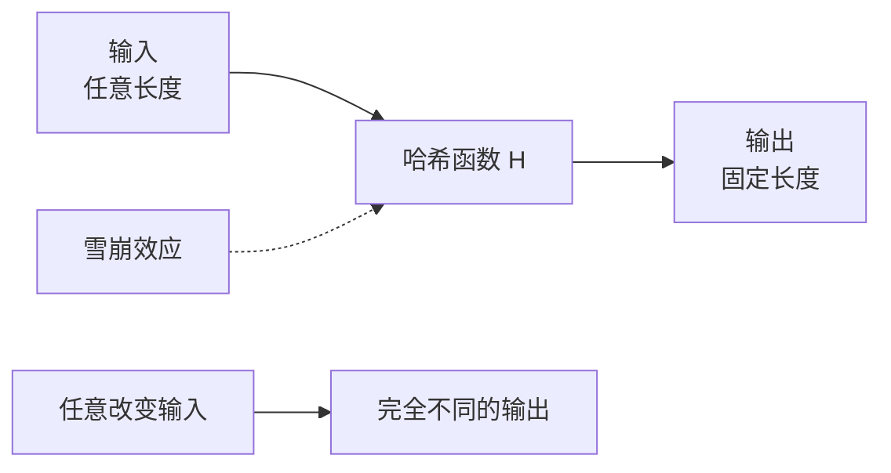

凌晨 2 点，某互联网公司的数据库被拖库。泄露的密码数据让整个安全团队夜不能寐——但三个月后，黑客拿着这些数据却无法登录任何账户。因为密码使用了 Bcrypt 存储，即使哈希值泄露，也需要数万年才能破解。这个案例揭示了哈希算法在安全系统中的核心价值：**哈希不是加密，而是单方向的「数字指纹」**。

## 哈希函数的基本属性

哈希函数将任意长度的输入映射为固定长度的输出，这个过程必须满足三个核心安全属性。

**单向性（Pre-image Resistance）**：给定哈希值 `h`，无法在合理时间内计算出原始输入 `m`，使得 `hash(m) = h`。这意味着哈希函数不能逆向运算，拿到哈希值也无法还原原始数据。

**抗碰撞（Collision Resistance）**：无法找到两个不同的输入 `m1` 和 `m2`，使得 `hash(m1) = hash(m2)`。碰撞虽然客观存在（因为输入空间远大于输出空间），但找到碰撞在计算上不可行。

**雪崩效应（Avalanche Effect）**：输入的每一个比特变化，都应导致输出约一半比特的随机变化。改变输入的一个字符，哈希值应该完全不同。这保证了哈希值能「敏感地」反映输入的微小变化。



## MD5 的衰落史

MD5 由 Ronald Rivest 于 1991 年设计，输出 128 位哈希值，曾是互联网最广泛使用的哈希算法。但它的辉煌在 2004 年戛然而止。

中国密码学家王小云等人提出了首个实际可行的碰撞攻击方法。研究人员可以在几分钟内找到两个不同的 PDF 文件，它们的 MD5 哈希值完全相同。更致命的是 **构造前缀碰撞**：给定任意前缀，可以构造两个不同文件，具有相同的 MD5 哈希值。

2008 年，安全研究人员演示了伪造 SSL 证书的攻击：在 MD5 被用于证书签名的年代，攻击者可以构造出与合法 CA 证书具有相同 MD5 哈希值的恶意证书。这意味着攻击者可以伪造任意域名的 SSL 证书。

```java title="MD5 碰撞演示（仅供理解原理）"
import java.security.MessageDigest;
import java.nio.file.Files;
import java.nio.file.Path;

public class MD5CollisionDemo {

    public static String md5(byte[] input) throws Exception {
        MessageDigest md = MessageDigest.getInstance("MD5");
        byte[] hash = md.digest(input);
        return bytesToHex(hash);
    }

    // 已知前缀碰撞攻击：给定相同前缀，可以构造两个不同消息产生相同 MD5
    public static void main(String[] args) throws Exception {
        // 实际碰撞构造需要专业工具，这里演示 MD5 的禁用
        System.out.println("MD5 已不安全，不应用于任何安全场景");
    }
}
```

:::warning MD5 已被淘汰
MD5 只适合用于非密码学场景的数据完整性校验（如文件完整性检查），绝对不能用于密码存储、数字签名或任何安全认证场景。
:::

## SHA-1：从标准到弃用

SHA-1 由 NSA 设计，输出 160 位哈希值，在 1993 年成为联邦标准。它比 MD5 更长，看起来更安全，但历史总是惊人的相似。

2005 年，王小云团队再次发表了对 SHA-1 的碰撞攻击论文，虽然还不是实际攻击，但证明了理论可行性。2017 年，Google 宣布完成了首次 SHA-1 真实碰撞攻击，发布了两份 PDF 文件，它们的 SHA-1 值完全相同。

更糟糕的是，SHA-1 的碰撞成本在持续下降。2020 年，研究人员可以在约 4.5 万美元的成本内完成一次碰撞攻击。随着云计算和硬件发展，这个数字只会越来越低。

```java title="SHA-1 vs SHA-256 性能对比"
import java.security.MessageDigest;

public class SHAComparison {

    public static void main(String[] args) throws Exception {
        // SHA-1: 160 位输出（已淘汰）
        MessageDigest sha1 = MessageDigest.getInstance("SHA-1");
        // SHA-256: 256 位输出（当前推荐）
        MessageDigest sha256 = MessageDigest.getInstance("SHA-256");

        byte[] testData = "Hello, Cryptography!".getBytes();

        // SHA-1 输出长度
        byte[] sha1Hash = sha1.digest(testData);
        System.out.println("SHA-1 长度: " + sha1Hash.length * 8 + " 位");

        // SHA-256 输出长度
        byte[] sha256Hash = sha256.digest(testData);
        System.out.println("SHA-256 长度: " + sha256Hash.length * 8 + " 位");
    }
}
```

## SHA-2 家族：当前主流标准

SHA-2 是 SHA-1 的后继者，包含四个变体，输出长度不同：

| 算法 | 输出长度 | 状态 |
| --- | --- | --- |
| SHA-224 | 224 位 | 可接受 |
| SHA-256 | 256 位 | **主流推荐** |
| SHA-384 | 384 位 | 高安全场景 |
| SHA-512 | 512 位 | 高安全场景 |
| SHA-512/224 | 224 位 | 特定场景 |
| SHA-512/256 | 256 位 | 特定场景 |

SHA-2 的核心改进是更复杂的内部结构：64 步迭代操作，每一步使用不同的常数和消息调度。与 SHA-1 的 80 步虽然少了，但每一步更复杂，安全性更高。

目前没有已知的对 SHA-2 的实际攻击。但在学术界，它被认为理论上可能受到长度扩展攻击（Length Extension Attack），这在某些特定场景下是安全隐患。

```java title="SHA-256 标准用法"
import java.security.MessageDigest;
import java.util.HexFormat;

public class SHA256Demo {

    public static String sha256(String input) throws Exception {
        MessageDigest digest = MessageDigest.getInstance("SHA-256");
        byte[] hash = digest.digest(input.getBytes());
        return HexFormat.of().formatHex(hash);
    }

    public static void main(String[] args) throws Exception {
        String password = "UserPassword123!";
        String hash = sha256(password);
        System.out.println("SHA-256: " + hash);
        System.out.println("长度: " + hash.length() + " 字符（16进制）");
    }
}
```

## SHA-3 与 Keccak 算法

SHA-3 于 2015 年成为标准，但它不是 SHA-2 的简单升级，而是基于完全不同的设计理念——**海绵结构（Sponge Construction）**。

Keccak 算法由 Guido Bertoni、Joan Daemen、Michaël Peeters 和 Gilles Van Assche 设计，在 2012 年的 SHA-3 竞赛中胜出。海绵结构的独特之处在于：输入数据被「吸收」进状态数组，然后「挤出」哈希输出。这种结构天生免疫长度扩展攻击。

SHA-3 的四个标准变体：SHA3-224、SHA3-256、SHA3-384、SHA3-512。

```java title="SHA-3 示例"
import java.security.MessageDigest;

public class SHA3Demo {

    public static void main(String[] args) throws Exception {
        // SHA-3 标准算法
        MessageDigest sha3_256 = MessageDigest.getInstance("SHA3-256");
        byte[] hash = sha3_256.digest("test".getBytes());

        System.out.println("SHA3-256: " + bytesToHex(hash));
    }

    private static String bytesToHex(byte[] bytes) {
        StringBuilder sb = new StringBuilder();
        for (byte b : bytes) {
            sb.append(String.format("%02x", b));
        }
        return sb.toString();
    }
}
```

:::info SHA-3 vs SHA-2
SHA-3 与 SHA-2 安全性相当，但 SHA-3 的海绵结构提供了更好的理论安全保障（免疫长度扩展攻击）。如果系统需要「深度防御」，可以同时使用两者——即计算 `SHA3(SHA256(data))`。
:::

## Bcrypt：专为密码存储设计

MD5 和 SHA 系列是通用哈希算法，设计目标是快速计算。但**密码哈希恰恰需要慢速**——因为这能有效对抗暴力破解。一台现代 GPU 每秒可以计算数十亿次 SHA-256 哈希，但只能计算数万次 Bcrypt 哈希。

Bcrypt 由 Niels Provos 和 David Mazières 于 1999 年设计，基于 Blowfish 对称加密算法。它引入了两个关键特性：

**自适应成本因子（Cost Factor）**：Bcrypt 的核心参数 `cost` 控制计算迭代次数。公式为 `iterations = 2^cost`。当硬件性能提升时，只需增加 cost 值，哈希计算就会变慢。这意味着 Bcrypt 可以抵抗摩尔定律。

**内置盐值（Built-in Salt）**：Bcrypt 自动生成 128 位随机盐，与哈希值一起存储。这意味着相同的密码每次会生成不同的哈希值，有效防止彩虹表攻击。

```java title="Bcrypt 密码哈希"
import org.springframework.security.crypto.bcrypt.BCryptPasswordEncoder;

public class BcryptDemo {

    public static void main(String[] args) {
        BCryptPasswordEncoder encoder = new BCryptPasswordEncoder();

        String rawPassword = "MySecurePassword123!";

        // 哈希密码
        String hashedPassword = encoder.encode(rawPassword);
        System.out.println("Bcrypt 哈希: " + hashedPassword);
        // 输出类似: $2a$12$LQv3c1yqBWVHxkd0LHAkCOYz6TtxMQJqhN8/LewKyNiiGTMwFYjfe

        // 验证密码
        boolean matches = encoder.matches(rawPassword, hashedPassword);
        System.out.println("验证结果: " + matches); // true

        // 相同密码的不同哈希（因为随机盐）
        String anotherHash = encoder.encode(rawPassword);
        System.out.println("相同密码的另一个哈希: " + anotherHash);
        System.out.println("两个哈希相等: " + hashedPassword.equals(anotherHash)); // false
    }
}
```

```java title="Bcrypt 成本因子对比"
import org.springframework.security.crypto.bcrypt.BCryptPasswordEncoder;

public class BcryptCostDemo {

    public static void main(String[] args) {
        String password = "test";

        // 成本因子 10（早期默认值，现在偏小）
        BCryptPasswordEncoder lowCost = new BCryptPasswordEncoder(10);
        long start10 = System.currentTimeMillis();
        lowCost.encode(password);
        long time10 = System.currentTimeMillis() - start10;

        // 成本因子 12（当前推荐）
        BCryptPasswordEncoder stdCost = new BCryptPasswordEncoder(12);
        long start12 = System.currentTimeMillis();
        stdCost.encode(password);
        long time12 = System.currentTimeMillis() - start12;

        // 成本因子 14（高安全场景）
        BCryptPasswordEncoder highCost = new BCryptPasswordEncoder(14);
        long start14 = System.currentTimeMillis();
        highCost.encode(password);
        long time14 = System.currentTimeMillis() - start14;

        System.out.println("cost=10 耗时: " + time10 + "ms");
        System.out.println("cost=12 耗时: " + time12 + "ms (推荐)");
        System.out.println("cost=14 耗时: " + time14 + "ms");
    }
}
```

Bcrypt 的哈希格式为 `$2a$12$...`：2a 是版本号，12 是成本因子，后面的 22 个字符是盐值，剩余部分是哈希值。

## Argon2：内存硬哈希算法

2015 年，Argon2 赢得了密码哈希竞赛（Password Hashing Competition），成为新一代密码哈希标准。与 Bcrypt 不同，Argon2 有三种变体：

**Argon2d**：数据依赖内存访问，GPU 友好度最低，更抗 GPU 破解。
**Argon2i**：数据独立内存访问，适合密钥派生，不易被侧信道攻击。
**Argon2id**：混合模式，兼具两者优点，是大多数场景的推荐选择。

Argon2 的核心优势在于**内存硬（Memory-hard）**：它需要占用大量内存来计算哈希，即使算法本身不复杂，也难以用 GPU 或 ASIC 高效并行化。

```java title="Argon2 密码哈希"
import de.mkammerer.argon2.Argon2;
import de.mkammerer.argon2.Argon2Factory;

public class Argon2Demo {

    public static void main(String[] args) {
        Argon2 argon2 = Argon2Factory.create(Argon2Factory.Argon2Types.ARGON2ID);

        // Argon2 参数
        int iterations = 3;        // 迭代次数
        int memory = 65536;        // 内存消耗（64 MB）
        int parallelism = 4;       // 并行度

        String rawPassword = "MySecurePassword123!";
        char[] password = rawPassword.toCharArray();

        try {
            // 生成哈希
            String hash = argon2.hash(iterations, memory, parallelism, password);
            System.out.println("Argon2id 哈希: " + hash);

            // 验证密码
            boolean matches = argon2.verify(hash, password);
            System.out.println("验证结果: " + matches);

        } finally {
            // 清除密码内存
            argon2.wipeArray(password);
        }
    }
}
```

```java title="Argon2 vs Bcrypt 内存占用对比"
public class MemoryHardComparison {

    public static void main(String[] args) {
        // Bcrypt: 固定约 4 KB 内存
        System.out.println("Bcrypt 内存占用: ~4 KB");

        // Argon2id: 可配置，默认 64 MB
        System.out.println("Argon2id 内存占用: 64 MB（可配置）");

        System.out.println("内存差异: 16000 倍");
        System.out.println("这使得 Argon2 对 GPU/ASIC 破解有更强的抵抗力");
    }
}
```

:::tip Argon2 参数选择建议
- **内存**：至少 64 MB（`memory = 65536`）
- **迭代次数**：1-3 次
- **并行度**：CPU 核心数
- **盐值长度**：至少 16 字节
- **哈希输出长度**：至少 32 字节
:::

## 哈希算法选型指南

| 场景 | 推荐算法 | 原因 |
| --- | --- | --- |
| 密码存储 | Bcrypt、Argon2 | 自适应成本因子，防暴力破解 |
| 数字签名/证书 | SHA-256、SHA-384、SHA-512 | SHA-2 家族 |
| 区块链 | SHA-256（Bitcoin）、Keccak-256（Ethereum） | 特定算法匹配特定场景 |
| HMAC | SHA-256 + HMAC | 需要密钥的哈希 |
| 文件完整性 | SHA-256 | 足够快，足够安全 |
| 旧系统兼容性 | SHA-256 | 不要使用 MD5/SHA-1 |

:::danger 不要使用的算法
- MD5：已被完全破解，用于密码存储等于明文
- SHA-1：碰撞攻击可行，用于数字签名等于不安全
- 任何自创哈希算法：没有经过密码学社区审计
:::

### 常见错误

**错误 1：使用 MD5 存储密码**
MD5 太快了，现代 GPU 每秒可以计算数百亿次。攻击者可以使用预计算的彩虹表，在秒级破解常见密码。

**错误 2：不加盐直接哈希**
如果不加盐，相同密码的哈希值相同。攻击者可以构建常见密码的彩虹表，一次查询破解所有相同密码。

**错误 3：混淆哈希与加密**
哈希是单向的，无法还原；加密是双向的，可以解密。密码存储必须用哈希，而不是加密。

**错误 4：忽略成本因子的演进**
Bcrypt 的 cost=10 在 2010 年是安全的，现在可能不够。建议定期评估并增加成本因子。

## 思考题

**问题 1**：为什么说 Bcrypt 的「慢」特性是密码存储的核心需求？
<details>
<summary>参考答案</summary>

密码哈希的目的是即使攻击者拿到数据库，也无法快速破解密码。如果哈希计算足够快（比如 MD5 每秒数百亿次），攻击者可以用 GPU 高效地尝试所有常见密码（暴力破解）、使用预计算的彩虹表（查表攻击）。

Bcrypt 的慢速特性使得攻击成本急剧上升：一台现代 GPU 对 SHA-256 可以达到每秒 100 亿次哈希计算，但对 Bcrypt（cost=12）只能达到约 7 万次。这意味着暴力破解一个密码可能需要几万年而非几天。「慢」是对抗暴力破解的最有效手段。
</details>

**问题 2**：如果系统已经在使用 Bcrypt（cost=10），应该如何安全地升级到 cost=12？
<details>
<summary>参考答案</summary>

不能直接修改 cost 强制重新哈希旧密码。正确做法是**惰性迁移（Lazy Migration）**：

1. 用户登录时，使用当前 cost（10）验证密码
2. 验证成功后，使用新的 cost（12）重新生成哈希，替换存储的哈希值
3. 随着用户陆续登录，所有密码会逐渐迁移到新 cost

这个过程不需要强制用户修改密码，用户无感知，但系统安全性逐步提升。

```java
if (encoder.matches(rawPassword, storedHash)) {
    if (needsRehash(storedHash)) {
        String newHash = encoder.encode(rawPassword);
        updateUserPasswordHash(userId, newHash);
    }
    return true;
}
```
</details>
