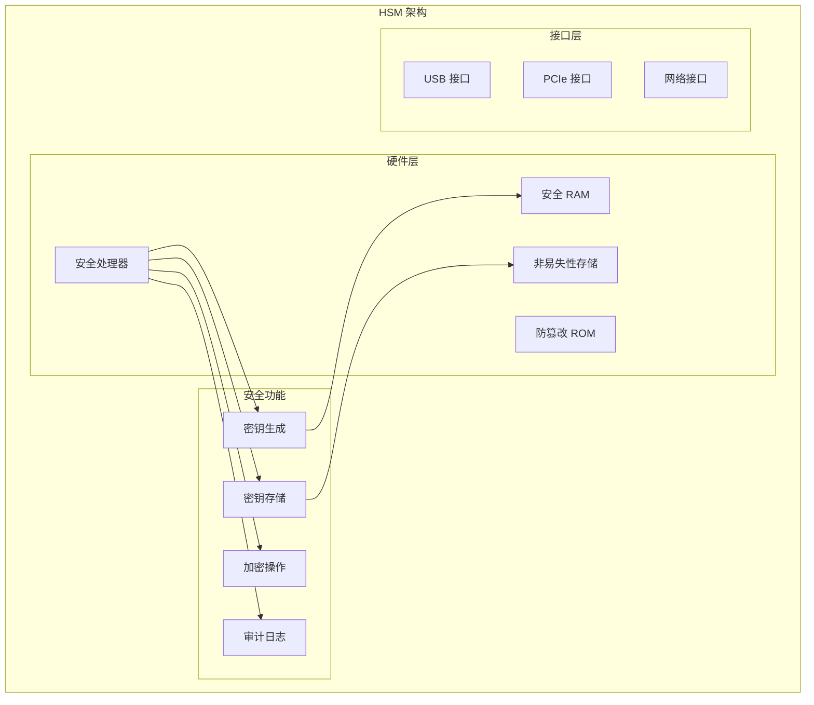
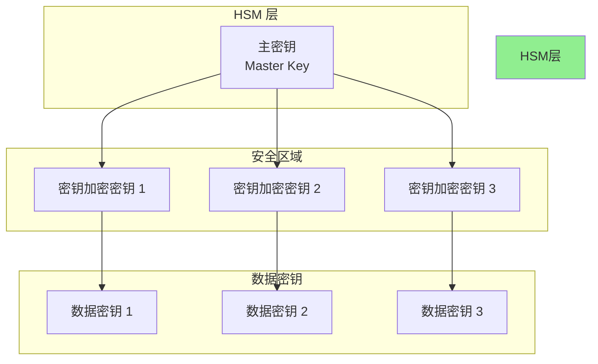

2014 年，心脏出血漏洞（Heartbleed）席卷互联网，数百万人使用的服务器私钥暴露在危险之中。但有一个地方始终安全：**硬件安全模块（HSM）**。

HSM 是密码学世界的保险箱。它的核心设计哲学是：**即使攻击者完全控制了服务器操作系统，也无法获取存储在 HSM 中的密钥**。

理解 HSM，是构建真正安全系统的必经之路。

## 一、HSM 的定义与作用

### 什么是 HSM

硬件安全模块（Hardware Security Module）是一种专用硬件设备，用于安全地生成、存储和管理加密密钥，以及执行加密操作。



### HSM 的核心作用

| 功能 | 说明 | 安全价值 |
|------|------|----------|
| 密钥生成 | 在硬件内安全生成密钥 | 私钥从不离开 HSM |
| 密钥存储 | 防篡改存储加密密钥 | 即使服务器被入侵，密钥安全 |
| 加密操作 | 在 HSM 内执行加密/签名 | 签名操作无法被篡改 |
| 访问控制 | 多因素认证访问 HSM | 防止未授权使用密钥 |
| 审计日志 | 记录所有 HSM 操作 | 完整的操作审计轨迹 |

### 为什么需要 HSM

```
普通软件密钥存储的问题：

1. 服务器被攻破 → 密钥泄露
   攻击者获取服务器 root 权限 → 读取密钥文件 → 完全控制

2. 内存攻击 → 密钥泄露
   冷启动攻击 → 从内存中提取密钥

3. 内部威胁 → 密钥泄露
   运维人员复制密钥文件 → 密钥泄露

4. 备份泄露 → 密钥泄露
   密钥备份未加密 → 备份泄露

HSM 的解决方案：

1. 密钥永不离开 HSM
   - 加密操作在 HSM 内完成
   - 签名数据送入 HSM，签名结果送出

2. 防篡改硬件
   - 物理篡改会触发密钥删除
   - 入侵检测触发密钥删除

3. 多因素认证
   - 必须有物理访问和认证凭证才能使用密钥
   - 操作员分离原则

4. 完整审计
   - 所有操作都有日志
   - 不可抵赖
```

## 二、HSM 的类型

### PCI-E 卡式 HSM

直接插入服务器的 PCI Express 插槽：

```bash
# 示例：Thales Luna PCIe HSM

# 查看 HSM 设备
ls -la /dev/tempest/

# 常用命令
# ctconf -h <slot>   # 配置 HSM
# ctu -h <slot>       # 初始化 HSM
# ctk -h <slot>       # 管理密钥
# cts -h <slot>       # 状态查询
```

**特点**：
- 最高性能（直接 PCIe 访问）
- 最低延迟
- 需要物理访问服务器
- 单点故障（服务器故障则 HSM 不可用）

### 网络 HSM

通过网络访问的独立 HSM 设备：

```bash
# 示例：Thales Luna Network HSM

# 通过 REST API 访问
curl -k -X POST https://hsm.example.com:8443 \
  -H "Content-Type: application/json" \
  -d '{"command": "generateKey", "params": {...}}'
```

**特点**：
- 独立于服务器生命周期
- 可被多台服务器共享
- 网络延迟（通常可接受）
- 高可用配置（多台 HSM 集群）

### 云 HSM

云服务商提供的 HSM 即服务：

| 服务 | 提供商 | 技术 | 说明 |
|------|--------|------|------|
| CloudHSM | AWS | FIPS 140-2 Level 3 | 单租户，VPC 内部署 |
| Azure Dedicated HSM | Azure | FIPS 140-2 Level 3 | 单租户，Azure 托管 |
| Cloud KMS | GCP | FIPS 140-2 Level 3 | 多租户托管 KMS |
| Azure Key Vault | Azure | FIPS 140-2 Level 2 | 完全托管，多租户 |
| AWS KMS | AWS | FIPS 140-2 Level 2 | 完全托管，多租户 |

### HSM 类型对比

| 维度 | PCI-E HSM | 网络 HSM | 云 HSM |
|------|------------|----------|---------|
| 性能 | 最高 | 高 | 中 |
| 延迟 | 最低 | 低 | 中 |
| 可用性 | 依赖服务器 | 独立高可用 | 云 SLA |
| 管理 | 自管理 | 自管理 | 托管 |
| 成本 | 硬件采购 | 硬件 + 维护 | 按量付费 |
| 合规 | 完全控制 | 完全控制 | 部分控制 |

## 三、HSM 的安全认证

### FIPS 140-2 认证级别

FIPS 140-2（Federal Information Processing Standard Publication 140-2）是美国政府的安全认证标准：

| 级别 | 安全要求 | 典型应用 |
|------|----------|----------|
| Level 1 | 基础安全要求 | 普通软件密码学库 |
| Level 2 | 篡改证据涂层 | 智能卡、USB Token |
| Level 3 | 篡改响应/移除检测 | 大多数 HSM |
| Level 4 | 物理安全环境 | 极端安全环境 |

**Level 2 vs Level 3 vs Level 4**：

```
Level 2：
- 需要防篡改涂层或密封
- 篡改后有明显证据
- 角色认证（用户/管理员）

Level 3：
- 需要篡改响应机制
- 检测到篡改时删除密钥
- 身份认证（多因素）
- 防功率分析

Level 4：
- 需要完整防篡改包围
- 环境故障检测（温度、电压）
- 更强的防功率分析
- 最严苛的安全环境
```

### Common Criteria 认证

Common Criteria（CC）是国际通用的 IT 安全认证标准：

```
CC 认证级别（EAL）：

EAL 1 - 功能测试
EAL 2 - 结构化测试
EAL 3 - 系统地测试和检查
EAL 4 - 系统地设计、测试和审查
EAL 5 - 半形式化设计和测试
EAL 6 - 半形式化验证设计和测试
EAL 7 - 形式化验证设计和测试

HSM 常见的 CC 认证：
- EAL 4+：大多数企业 HSM
- EAL 5+：高安全 HSM
```

### 合规性要求

| 合规标准 | HSM 要求 | 场景 |
|----------|----------|------|
| PCI DSS | 推荐使用 HSM | 支付处理 |
| GDPR | 推荐加密密钥保护 | 欧盟数据处理 |
| SOC 2 | 密钥管理控制 | 云服务审计 |
| ISO 27001 | 加密密钥安全存储 | 信息安全管理 |
| 中国等保 | 密码模块认证 | 国内关键基础设施 |

## 四、HSM 在密钥保护中的角色

### 密钥分层架构



### HSM 保护模式

**模式一：HSM 存储主密钥**

```
工作原理：
1. HSM 生成并存储主密钥（MK）
2. MK 用于加密其他密钥（KEK）
3. 加密后的 KEK 存储在数据库/文件
4. 实际加密操作可用 KEK 在服务器完成

优点：
- HSM 只存储少量关键密钥
- 大部分加密操作在服务器完成，性能高
- MK 泄露风险低

缺点：
- 服务器被攻破可能泄露 KEK
```

**模式二：所有密钥存储在 HSM**

```
工作原理：
1. 所有密钥存储在 HSM
2. 所有加密操作在 HSM 完成
3. 原始数据送入 HSM，结果返回

优点：
- 最高安全性
- 密钥从不离开 HSM

缺点：
- 性能受限（HSM 吞吐量）
- HSM 故障影响所有操作
```

**模式三：HSM 作为加密加速器**

```
工作原理：
1. 大部分数据加密用服务器软件完成
2. 关键操作（如签名）在 HSM 完成
3. HSM 提供高性能加密硬件

优点：
- 平衡安全性和性能
- HSM 资源高效利用

缺点：
- 部分密钥仍在服务器内存
```

## 五、HSM 的 API 接口

### PKCS#11 接口

PKCS#11 是最广泛使用的 HSM 接口标准：

```java title="HsmClientPKCS11.java"
import iaik.pkcs.pkcs11.*;
import iaik.pkcs.pkcs11.objects.*;
import iaik.pkcs.pkcs11.wrapper.*;

public class HsmClientPKCS11 {
    
    private Session session;
    private Slot[] slots;
    private Token token;
    
    /**
     * 初始化 PKCS#11 连接
     */
    public void initialize(String pkcs11LibraryPath) throws Exception {
        // 1. 加载 PKCS#11 库
        PKCS11Module module = PKCS11Module.getInstance(pkcs11LibraryPath);
        module.initialize(null);
        
        // 2. 获取可用插槽
        slots = module.getSlotList(Module.SlotRequirement.TOKEN_PRESENT);
        
        // 3. 获取 token
        token = slots[0].getToken();
        
        // 4. 打开会话
        session = token.openSession(Token.O_Session_Public);
    }
    
    /**
     * 用户认证
     */
    public void login(char[] pin) throws Exception {
        // PKCS#11 标准登录
        session.login(Session.UserMode.USER, pin);
    }
    
    /**
     * 生成 RSA 密钥对
     */
    public KeyPair generateRSAKeyPair(int keySize) throws Exception {
        
        // 1. 创建密钥属性
        RSAPublicKey publicKeyTemplate = new RSAPublicKey();
        publicKeyTemplate.getLabel().setCharArrayValue("RSA Key".toCharArray());
        publicKeyTemplate.getModulusBits().setLongValue(keySize);
        publicKeyTemplate.getToken().setBooleanValue(true);
        publicKeyTemplate.getPrivate().setBooleanValue(false);
        
        RSAPrivateKey privateKeyTemplate = new RSAPrivateKey();
        privateKeyTemplate.getLabel().setCharArrayValue("RSA Key".toCharArray());
        privateKeyTemplate.getModulusBits().setLongValue(keySize);
        privateKeyTemplate.getToken().setBooleanValue(true);
        privateKeyTemplate.getPrivate().setBooleanValue(true);
        // 密钥不可导出（始终留在 HSM）
        privateKeyTemplate.getExtractable().setBooleanValue(false);
        
        // 2. 生成密钥
        KeyPair generatedKeyPair = session.generateKeyPair(
            Mechanism.RSA_PKCS_KEY_PAIR_GEN,
            publicKeyTemplate,
            privateKeyTemplate
        );
        
        return new KeyPair(
            generatedKeyPair.getPublic(),
            generatedKeyPair.getPrivate()
        );
    }
    
    /**
     * 生成 ECC 密钥对
     */
    public KeyPair generateECCKeyPair(String curve) throws Exception {
        
        Mechanism mechanism = switch (curve) {
            case "P-256" -> Mechanism.ECDSA_KEY_PAIR_GEN;
            case "P-384" -> Mechanism.ECDSA_KEY_PAIR_GEN;
            default -> throw new IllegalArgumentException("不支持的曲线");
        };
        
        // 创建 ECC 密钥属性...
        // 类似 RSA 密钥生成
        return null;
    }
    
    /**
     * RSA 签名
     */
    public byte[] signRSA(PrivateKey privateKey, byte[] data) throws Exception {
        
        // 1. 找到 HSM 中的私钥对象
        PrivateKey privKeyObj = (PrivateKey) session.findObjects(new PrivateKey())[0];
        
        // 2. 初始化签名
        Mechanism signMechanism = Mechanism.RSA_PKCS;
        session.signInit(signMechanism, privKeyObj);
        
        // 3. 执行签名
        // 数据送入 HSM，签名在 HSM 内完成
        byte[] signature = session.sign(data);
        
        return signature;
    }
    
    /**
     * 加密密钥导入
     */
    public void importKey(byte[] encryptedKey, String keyLabel) throws Exception {
        
        // 用于导入在外部生成的密钥
        // 密钥以加密形式传入，HSM 解密后存储
        SecretKey keyTemplate = new SecretKey();
        keyTemplate.getLabel().setCharArrayValue(keyLabel.toCharArray());
        keyTemplate.getToken().setBooleanValue(true);
        keyTemplate.getSensitive().setBooleanValue(true);
        keyTemplate.getExtractable().setBooleanValue(false);
        
        // 设置加密的密钥值
        keyTemplate.getValue().setByteArrayValue(encryptedKey);
        
        session.createObject(keyTemplate);
    }
}
```

### Java JCA Provider

Java 提供了通过 JCA（Java Cryptography Architecture）访问 HSM 的方式：

```java title="HsmJcaProvider.java"
import java.security.*;
import java.security.spec.*;
import javax.crypto.*;
import java.util.*;

public class HsmJcaProvider {
    
    /**
     * 注册 PKCS#11 JCA Provider
     */
    public static void registerProvider(String pkcs11Library) {
        // SunPKCS11 读取配置文件
        String config = """
            name = HsmProvider
            library = %s
            slot = 1
            """.formatted(pkcs11Library);
        
        // 写入临时配置文件
        Path configFile = Files.createTempFile("pkcs11", ".cfg");
        Files.writeString(configFile, config);
        
        // 动态添加 Provider
        int result = Security.addProvider(
            new sun.security.pkcs11.SunPKCS11(configFile.toString())
        );
        
        System.out.println("Provider 注册结果: " + result);
    }
    
    /**
     * 使用 HSM Provider 生成密钥
     */
    public static KeyPair generateKeyPairInHSM(String algorithm, int keySize) 
            throws Exception {
        
        KeyPairGenerator generator = KeyPairGenerator.getInstance(algorithm, "HsmProvider");
        generator.initialize(keySize);
        
        return generator.generateKeyPair();
    }
    
    /**
     * 使用 HSM Provider 签名
     */
    public static byte[] signInHSM(PrivateKey privateKey, byte[] data) 
            throws Exception {
        
        Signature signature = Signature.getInstance("SHA256withRSA", "HsmProvider");
        signature.initSign(privateKey);
        signature.update(data);
        
        // 签名在 HSM 内完成
        return signature.sign();
    }
    
    /**
     * 使用 HSM Provider 解密
     */
    public static byte[] decryptInHSM(PrivateKey privateKey, byte[] ciphertext) 
            throws Exception {
        
        Cipher cipher = Cipher.getInstance("RSA/ECB/OAEPWithSHA-256AndMGF1Padding", 
            "HsmProvider");
        cipher.init(Cipher.DECRYPT_MODE, privateKey);
        
        // 解密在 HSM 内完成
        return cipher.doFinal(ciphertext);
    }
}
```

### AWS CloudHSM 操作示例

```java title="AwsCloudHsmClient.java"
import com.amazonaws.cloudhsm.jce.*;
import javax.crypto.*;
import java.security.*;
import java.security.spec.*;

public class AwsCloudHsmClient {
    
    // AWS CloudHSM 使用 PKCS#11 或 JCE Provider
    private static final String PROVIDER = "CloudHSMProvider";
    
    /**
     * 初始化 AWS CloudHSM
     */
    public void initialize() throws Exception {
        // 从环境变量读取配置
        String config = System.getenv("AWS_cloudhsm_mtls_config");
        
        // 注册 Provider
        Security.addProvider(new CloudHSMProvider());
    }
    
    /**
     * 生成密钥并标记为不可导出
     */
    public SecretKey generateKey() throws Exception {
        KeyGenerator keyGen = KeyGenerator.getInstance("AES", PROVIDER);
        
        // 使用 KeyGenParameterSpec 设置属性
        // 标记为不可导出，即使提取也无效
        keyGen.init(256);
        
        return keyGen.generateKey();
    }
    
    /**
     * 批量加密操作
     */
    public byte[] encryptBatch(byte[]... plaintexts) throws Exception {
        Cipher cipher = Cipher.getInstance("AES/GCM/NoPadding", PROVIDER);
        
        byte[] combined = new byte[0];
        for (byte[] pt : plaintexts) {
            cipher.init(Cipher.ENCRYPT_MODE, getKey());
            byte[] ct = cipher.doFinal(pt);
            
            // 拼接：IV + 密文 + TAG
            combined = concat(combined, ct);
        }
        
        return combined;
    }
}
```

## 六、云 HSM 服务对比

### AWS CloudHSM vs AWS KMS

```
┌─────────────────────────────────────────────────────────────────┐
│               AWS CloudHSM vs AWS KMS 对比                       │
├─────────────────────────────────────────────────────────────────┤
│                                                                 │
│  AWS KMS（托管服务）                                           │
│  ├─ 多租户，共享基础设施                                       │
│  ├─ 完全托管，无需运维                                         │
│  ├─ FIPS 140-2 Level 2                                        │
│  ├─ 自动备份和密钥轮转                                         │
│  ├─ 与 AWS 服务深度集成                                        │
│  └─ 按 API 调用计费                                            │
│                                                                 │
│  AWS CloudHSM（专用硬件）                                      │
│  ├─ 单租户，专用 HSM 硬件                                     │
│  ├─ 自管理（需要维护 HSM 软件）                               │
│  ├─ FIPS 140-2 Level 3                                        │
│  ├─ 完整的 PKCS#11 接口                                       │
│  ├─ 完全控制密钥生命周期                                       │
│  └─ 按小时计费 + HSM 硬件费用                                  │
│                                                                 │
│  选择建议：                                                     │
│  - 普通加密需求 → KMS（成本低、易用）                          │
│  - 合规要求（PCI DSS）→ CloudHSM                              │
│  - 需要 PKCS#11 → CloudHSM                                     │
│  - 需要完全控制 → CloudHSM                                      │
│                                                                 │
└─────────────────────────────────────────────────────────────────┘
```

### 各云服务商对比

| 特性 | AWS CloudHSM | Azure Dedicated HSM | GCP Cloud HSM |
|------|--------------|---------------------|---------------|
| 部署模式 | 单租户 VPC | 单租户 Azure | 单租户 Google |
| FIPS 认证 | Level 3 | Level 3 | Level 3 |
| 接口 | PKCS#11, JCE | PKCS#11, JCE | PKCS#11, CNG |
| 高可用 | 多 HSM 集群 | 多 HSM 集群 | 多 HSM 集群 |
| 备份 | 自动 | 自动 | 自动 |
| 监控 | CloudWatch | Azure Monitor | Cloud Logging |
| 价格 | ~$1.45/小时 | ~$1.45/小时 | ~$0.75/小时 |

## 七、HSM 的性能特征

### 典型性能指标

| 操作类型 | 入门级 HSM | 企业级 HSM | 说明 |
|----------|------------|------------|------|
| RSA-2048 签名 | ~100/秒 | ~10,000/秒 | 取决于密钥长度 |
| RSA-4096 签名 | ~20/秒 | ~2,000/秒 | 密钥更长，计算更慢 |
| ECC P-256 签名 | ~1,000/秒 | ~50,000/秒 | ECC 更快 |
| AES-256 加密 | ~100 Mbps | ~1 Gbps | 取决于型号 |
| 密钥生成 | ~5/秒 | ~50/秒 | RSA 大数运算慢 |

### 性能优化策略

```
HSM 性能瓶颈：
1. HSM 吞吐量有限
2. 网络延迟（网络 HSM）
3. 会话建立开销

优化方案：

1. 连接池
   ┌─────────────────────────────────────┐
   │     应用服务器                       │
   │  ┌─────────┬─────────┬─────────┐    │
   │  │ Session │ Session │ Session │    │
   │  │   1     │   2     │   3     │    │
   │  └────┬────┴────┬────┴────┬────┘    │
   └────────┼────────┼────────┼──────────┘
            └────────┴────────┘
                 │ HSM
                 ▼
            ┌─────────┐
            │  HSM    │
            └─────────┘
   
2. 本地缓存
   - 缓存解密后的对称密钥（在安全区域内）
   - 批量加密用缓存密钥
   - HSM 处理关键操作（密钥交换、签名）

3. 异步操作
   - 将签名请求放入队列
   - 批量处理
   - 返回预签名结果
```

## 八、HSM vs 软件密钥存储

### 安全性对比

| 维度 | HSM | 软件存储 | 说明 |
|------|-----|---------|------|
| 防篡改 | 物理防篡改 | 无 | HSM 硬件保护 |
| 密钥导出 | 可配置禁止 | 可能 | HSM 可锁定密钥 |
| 内存攻击 | 受保护 | 脆弱 | HSM 密钥不在主机内存 |
| 物理攻击 | 防篡改检测 | 无 | HSM 物理保护 |
| 审计 | 完整操作日志 | 有限 | HSM 内置审计 |

### 成本对比

| 维度 | HSM | 软件存储 |
|------|-----|---------|
| 初始成本 | 高（$5K-$50K） | 低（几乎为零） |
| 运维成本 | 高 | 低 |
| 性能成本 | 需要 HSM | 需要更多服务器 |
| 合规成本 | 低 | 高（可能需要额外审计） |

### 选择决策

```bash
# 以下场景建议使用 HSM：

1. 合规要求
   - 支付行业（PCI DSS）
   - 金融服务（FIPS 140-2 Level 3）
   - 政府和军事
   - 法律/合规明确要求

2. 高价值密钥
   - CA 根证书私钥
   - 文档签名密钥
   - 代码签名密钥
   - 主密钥（用于加密其他密钥）

3. 高风险环境
   - 面向公众的 Web 服务
   - 第三方密钥托管
   - 关键基础设施

# 以下场景可使用软件存储：

1. 非关键密钥
   - 开发/测试环境
   - 低价值数据加密
   - 内部测试密钥

2. 性能敏感场景
   - 高吞吐量场景
   - 延迟敏感场景
   - 可接受一定风险

3. 成本敏感场景
   - 初创公司
   - MVP 产品
   - 非敏感数据
```

---

## 思考题

**问题 1**：假设你的组织正在评估 HSM 采购方案，预算有限但合规要求必须使用 FIPS 140-2 Level 3 认证的 HSM。请分析以下三种方案的权衡：

A. 采购一台企业级 HSM，所有密钥集中管理
B. 采购多台入门级 HSM，分布在不同的数据中心
C. 使用云 HSM 服务（如 AWS CloudHSM）

<details>
<summary>参考答案</summary>

**三种方案对比分析**：

```
┌─────────────────────────────────────────────────────────────────┐
│                    HSM 方案对比                                   │
├─────────────────────────────────────────────────────────────────┤
│                                                                 │
│  方案 A：单台企业级 HSM                                         │
│  ├─ 优点：                                                     │
│  │   - 性能强，单台可处理所有需求                              │
│  │   - 集中管理，运维简单                                       │
│  │   - 高可靠性，企业级硬件                                    │
│  │   - 长期成本可能较低                                       │
│  │                                                             │
│  └─ 缺点：                                                     │
│      - 单点故障（需要配置 HA）                                 │
│      - 扩展性有限                                              │
│      - 需要专业运维人员                                        │
│      - 采购成本高                                              │
│                                                                 │
│  方案 B：多台入门级 HSM                                        │
│  ├─ 优点：                                                     │
│  │   - 地理分布，故障隔离                                      │
│  │   - 灵活扩展，按需添加                                      │
│  │   - 负载分担                                               │
│  │   - 单台成本低                                             │
│  │                                                             │
│  └─ 缺点：                                                     │
│      - 运维复杂，多台设备需要协调                              │
│      - 性能分散，总体可能不如单台企业级                        │
│      - 密钥同步挑战                                            │
│      - 分布式事务复杂性                                        │
│                                                                 │
│  方案 C：云 HSM                                                │
│  ├─ 优点：                                                     │
│  │   - 无硬件采购成本                                         │
│  │   - 按需扩展                                               │
│  │   - 云服务商负责硬件维护                                    │
│  │   - 内置高可用                                             │
│  │   - 快速部署                                               │
│  │                                                             │
│  └─ 缺点：                                                     │
│      - 长期成本可能更高                                        │
│      - 合规需要确认云 HSM 满足要求                             │
│      - 密钥控制权的法律问题                                    │
│      - 网络延迟                                                │
│      - 供应商锁定                                              │
│                                                                 │
└─────────────────────────────────────────────────────────────────┘
```

**详细分析**：

**方案 A：单台企业级 HSM**

```
适用场景：
- 小到中型组织
- 密钥数量有限
- 有专业运维团队
- 预算相对充裕

成本估算（10 年）：
- 采购：$30,000（企业级 HSM）
- 运维：$5,000/年 × 10 = $50,000
- HA 备机：$30,000（可选）
- 总成本：~$110,000

风险：
- 单台故障需要备用机
- 建议配置主备模式
```

**方案 B：多台入门级 HSM**

```
适用场景：
- 大型组织，多数据中心
- 需要地理冗余
- 密钥需要区域化
- 预算分散

成本估算（10 年）：
- 采购：4 台 × $10,000 = $40,000
- 运维：$3,000/年/台 × 4 × 10 = $120,000
- 网络配置：$20,000
- 总成本：~$180,000

设计要点：
- 主备模式：每数据中心至少 2 台
- 密钥分区：不同数据中心管理不同密钥
- 同步机制：定期备份到其他数据中心
```

**方案 C：云 HSM**

```
适用场景：
- 云原生应用
- 快速扩展需求
- 无专业运维团队
- 愿意接受供应商管理

成本估算（10 年）：
- AWS CloudHSM：$1.45/小时 × 24 × 365 × 10 = $126,700
- + 数据传输和其他费用
- 总成本：~$150,000+

注意事项：
- 需要 VPC 和 HSM 配置知识
- 合规需要评估云 HSM 是否满足要求
```

**推荐方案**：

```
基于预算有限 + 合规要求，推荐混合方案：

┌─────────────────────────────────────────────────────────────────┐
│                    推荐的混合方案                                 │
├─────────────────────────────────────────────────────────────────┤
│                                                                 │
│  1. 云 HSM 作为主力                                            │
│     - 使用 AWS CloudHSM                                        │
│     - 按需使用，灵活计费                                        │
│     - 内置 HA 和备份                                           │
│                                                                 │
│  2. 本地 HSM 用于备份关键密钥                                  │
│     - 采购一台入门级 HSM                                       │
│     - 用于离线备份根密钥                                        │
│     - 紧急恢复使用                                             │
│                                                                 │
│  3. 成本优化                                                   │
│     - 使用云 KMS 处理大部分加密需求                            │
│     - CloudHSM 只用于最高安全要求的密钥                        │
│                                                                 │
└─────────────────────────────────────────────────────────────────┘

理由：
1. 合规要求：由云服务商保证 FIPS 140-2 Level 3 认证
2. 成本控制：按需使用，避免大量前期投入
3. 运维简化：云服务商负责硬件维护
4. 本地备份：解决对云服务商的信任问题
```

</details>

**问题 2**：解释 HSM 的防篡改机制是如何工作的。如果攻击者物理访问了一台运行中的 HSM，HSM 如何保护密钥安全？

<details>
<summary>参考答案</summary>

**HSM 防篡改机制详解**：

```
┌─────────────────────────────────────────────────────────────────┐
│                    HSM 防篡改层级                                 │
├─────────────────────────────────────────────────────────────────┤
│                                                                 │
│  Level 3+ 防篡改特性：                                         │
│                                                                 │
│  1. 物理密封层                                                 │
│     ┌─────────────────────────────────────────────────────┐   │
│     │  ╔═══════════════════════════════════════════════╗  │   │
│     │  ║           防篡改密封和涂层                     ║  │   │
│     │  ║   ┌─────────────────────────────────────────┐   ║  │   │
│     │  ║   │         篡改检测传感器                   │   ║  │   │
│     │  ║   │   ┌─────────────────────────────────┐   │   ║  │   │
│     │  ║   │   │        安全处理器芯片              │   │   ║  │   │
│     │  ║   │   │   ┌─────────────────────────┐   │   │   ║  │   │
│     │  ║   │   │   │      密钥存储 (NVM)     │   │   │   ║  │   │
│     │  ║   │   │   └─────────────────────────┘   │   │   ║  │   │
│     │  ║   │   └─────────────────────────────────┘   │   ║  │   │
│     │  ║   └─────────────────────────────────────────┘   ║  │   │
│     │  ╚═══════════════════════════════════════════════╝  │   │
│     └─────────────────────────────────────────────────────┘   │
│                                                                 │
│  2. 篡改检测机制                                               │
│     - 光敏传感器：检测外壳打开                                   │
│     - 电压传感器：检测异常电压                                  │
│     - 温度传感器：检测过热或过冷                                │
│     - 振动传感器：检测物理冲击                                  │
│     - 封条传感器：检测外壳密封破坏                              │
│                                                                 │
└─────────────────────────────────────────────────────────────────┘
```

**攻击场景与 HSM 响应**：

```
场景 1：外壳打开尝试

攻击者动作：
1. 尝试打开 HSM 外壳
2. 移除芯片以读取 NVM

HSM 响应：
┌─────────────────────────────────────────────────────────────────┐
│  检测到篡改 → 触发防护机制                                     │
│       │                                                         │
│       ├──► 立即清除所有密钥（zeroize）                        │
│       ├──► 锁定 HSM，进入不可恢复状态                         │
│       ├──► 记录篡改事件到审计日志                             │
│       └──► 可能触发物理告警                                    │
│                                                                 │
│  结果：即使攻击者拿到芯片，数据已被清除，无法使用              │
└─────────────────────────────────────────────────────────────────┘

场景 2：功率分析攻击

攻击者动作：
1. 测量 HSM 操作时的功耗曲线
2. 通过功耗特征推断密钥位

HSM 响应：
┌─────────────────────────────────────────────────────────────────┐
│  防护措施：                                                     │
│                                                                 │
│  1. 功率平衡                                                   │
│     - 使用恒定时间算法                                          │
│     - 故意添加无关操作以混淆功耗曲线                           │
│                                                                 │
│  2. 随机掩码                                                   │
│     - 在计算中引入随机噪声                                      │
│     - 使功耗曲线无法关联到具体密钥位                           │
│                                                                 │
│  3. 主动屏蔽                                                   │
│     - 持续检测异常操作模式                                      │
│     - 检测到攻击时触发清除                                      │
└─────────────────────────────────────────────────────────────────┘

场景 3：电磁分析攻击

攻击者动作：
1. 测量 HSM 发出的电磁辐射
2. 通过 EM 信号恢复密钥

HSM 响应：
┌─────────────────────────────────────────────────────────────────┐
│  防护措施：                                                     │
│                                                                 │
│  1. 电磁屏蔽                                                   │
│     - 金属外壳提供基础屏蔽                                      │
│     - 内部电路布局优化以减少 EM 泄漏                           │
│                                                                 │
│  2. 信号噪声                                                   │
│     - 添加随机操作以淹没有用信号                               │
│     - 间歇性空闲操作以增加噪声                                 │
│                                                                 │
│  3. Level 4 HSM：                                             │
│     - 更强的屏蔽要求                                            │
│     - 专门的防 EM 攻击设计                                      │
└─────────────────────────────────────────────────────────────────┘

场景 4：故障注入攻击

攻击者动作：
1. 故意引入计算错误（如电压毛刺）
2. 通过错误结果推断密钥

HSM 响应：
┌─────────────────────────────────────────────────────────────────┐
│  防护措施：                                                     │
│                                                                 │
│  1. 冗余计算                                                   │
│     - 关键操作重复执行                                          │
│     - 比较结果，不一致则触发清除                                │
│                                                                 │
│  2. 错误检测                                                   │
│     - 奇偶校验、CRC 等                                          │
│     - 检测到错误时重试或清除                                    │
│                                                                 │
│  3. 环境检查                                                   │
│     - 电压/温度异常时拒绝操作                                   │
│     - 逐步降级而不是突然失败                                    │
└─────────────────────────────────────────────────────────────────┘
```

**密钥清除（Zeroization）机制**：

```java
/**
 * 典型的 HSM 密钥清除过程
 * 实际实现在固件层，硬件保证执行
 */

// 当检测到任何篡改信号时，触发以下过程：

void zeroize() {
    // 1. 立即停止所有操作
    haltAllOperations();
    
    // 2. 覆盖密钥存储（NVM）
    for (int i = 0; i < keyStorage.length; i++) {
        keyStorage[i] = 0x00;  // 写零
        keyStorage[i] = 0xFF;  // 写一
        keyStorage[i] = random();  // 随机
        keyStorage[i] = 0x00;  // 再次写零
    }
    
    // 3. 清除安全 RAM
    memset(secureRAM, 0, sizeof(secureRAM));
    
    // 4. 清除密钥材料
    clearKeyRegisters();
    
    // 5. 锁定 HSM 状态
    lockHSM();
    // HSM 状态锁定后不可恢复，必须返厂
    
    // 6. 记录事件（如果还有能力）
    if (auditLogStillWritable()) {
        writeAuditLog(EVENT_ZEROIZATION_TRIGGERED);
    }
    
    // 7. 物理指示
    setAlarmIndicator(true);
}
```

**HSM 安全级别总结**：

```
┌─────────────────────────────────────────────────────────────────┐
│                    HSM 安全能力矩阵                               │
├─────────────────────────────────────────────────────────────────┤
│                                                                 │
│  能力                 │ Level 2  │ Level 3  │ Level 4        │
│  ──────────────────────────────────────────────────────────    │
│  防篡改证据           │    ✓     │    ✓     │    ✓           │
│  篡改响应             │          │    ✓     │    ✓           │
│  密钥自动清除         │          │    ✓     │    ✓           │
│  身份认证             │          │    ✓     │    ✓           │
│  防功率分析           │          │    ✓     │    ✓           │
│  环境故障检测         │          │          │    ✓           │
│  完整防篡改包围       │          │          │    ✓           │
│                                                                 │
│  ✓ = 支持                                           │
│                                                                 │
└─────────────────────────────────────────────────────────────────┘
```

</details>
