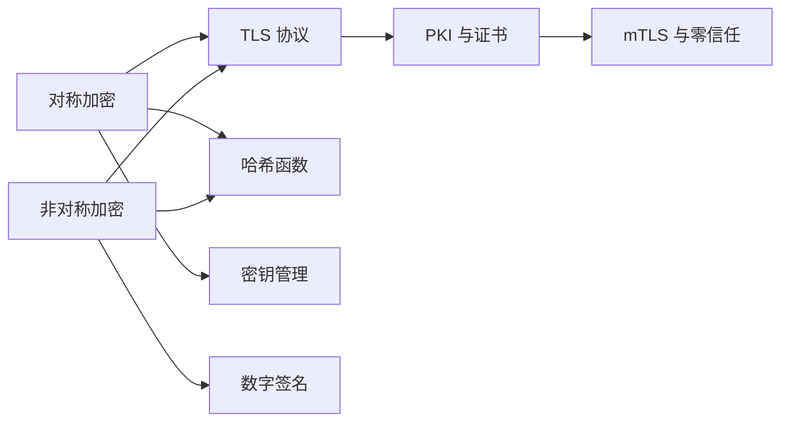

密码学是信息安全的基石。一个 HTTPS 连接背后，隐藏着 AES-256-GCM、TLS 1.3、ECDHE 密钥交换等一整套密码学机制的协同工作。理解这些机制的原理与权衡，才能真正设计出安全可靠的系统——而不是把安全寄托于「用了加密」这个模糊的判断上。

本专题覆盖密码学的完整知识体系：从对称加密的分组密码与工作模式，到非对称加密的数学原理，再到 TLS 协议的完整握手流程，以及 HSM、KMS 等密钥管理实践，帮助你从算法层面理解安全的本质。

## 核心内容

### 加密算法

- [密码学基础概述](/security/cryptography/overview) — 密码学四大领域：对称、非对称、哈希、数字签名
- [对称加密算法](/security/cryptography/symmetric) — AES、ChaCha20 的原理与选型
- [AES 加密模式](/security/cryptography/aes-modes) — ECB/CBC/GCM 等模式的安全性分析
- [非对称加密算法](/security/cryptography/asymmetric) — RSA、ECC 的数学基础与适用场景
- [RSA 原理与最佳实践](/security/cryptography/rsa) — 密钥长度选择、填充方案、安全实践
- [ECC 椭圆曲线密码学](/security/cryptography/ecc) — 椭圆曲线的数学原理与 ECDSA 签名

### 哈希与签名

- [哈希算法](/security/cryptography/hash) — SHA 家族、Bcrypt、Argon2 的安全特性
- [数字签名](/security/cryptography/digital-signature) — RSA 签名、ECDSA、EdDSA 的原理与应用

### TLS 与 PKI

- [TLS/SSL 协议深度解析](/security/cryptography/tls) — TLS 的演进与核心功能
- [TLS 握手流程详解](/security/cryptography/tls-handshake) — TLS 1.2 vs TLS 1.3 的握手差异
- [TLS 版本对比](/security/cryptography/tls-versions) — 各版本的安全特性与升级策略
- [证书与 PKI](/security/cryptography/pki) — X.509 证书结构、证书链、信任模型
- [CA 证书签发与管理](/security/cryptography/ca) — 私有 CA 搭建与证书生命周期管理
- [mTLS 双向 TLS](/security/cryptography/mtls) — 服务网格与零信任网络的基础

### 密钥管理

- [HSM 硬件安全模块](/security/cryptography/hsm) — 密钥的物理保护与 FIPS 认证
- [密钥管理最佳实践](/security/cryptography/kms) — 云 KMS 与信封加密的设计
- [密钥轮转策略](/security/cryptography/key-rotation) — 基于时间的自动轮转与兼容性处理

### 专题前沿

- [国密算法](/security/cryptography/sm) — SM2/SM3/SM4 的原理与合规要求
- [量子计算对密码学的挑战](/security/cryptography/quantum) — 后量子密码学的进展与迁移策略

## 学习路径

## 思考题

**问题 1**：AES-GCM 模式同时提供了加密和完整性保护，而 AES-CBC 只提供加密。如果使用 AES-CBC，需要额外做什么来保证数据完整性？GCM 模式的「认证加密」带来了哪些额外的安全保证？

参考答案

AES-CBC 需要单独添加 MAC（Message Authentication Code）来实现完整性保护，通常使用 HMAC-SHA256。但这种组合容易出现安全问题，例如 Encrypt-then-MAC 与 Encrypt-and-MAC 的选择不当。GCM 的「认证加密」（AEAD）将加密和认证统一在一个算法中，通过 Galois Counter Mode 实现，认证标签在解密时自动验证，确保密文未被篡改。如果认证标签验证失败，解密会失败，攻击者无法获取任何明文信息。

**问题 2**：TLS 1.3 强制要求前向保密（PFS），这意味着什么？为什么 TLS 1.2 中静态 RSA 握手不具备前向保密？

参考答案

前向保密（PFS）指即使长期密钥（服务器的私钥）泄露，历史会话的密钥也不会被攻破。TLS 1.3 强制使用 ECDHE/ DHE 密钥交换，每次会话使用临时密钥，服务器的私钥只用于签名，不会话密钥。TLS 1.2 的静态 RSA 握手中，客户端用服务器的公钥加密 PreMasterSecret 生成会话密钥，一旦服务器私钥泄露，攻击者可以解密所有历史流量。这就是为什么 TLS 1.3 废弃了静态 RSA 握手。

