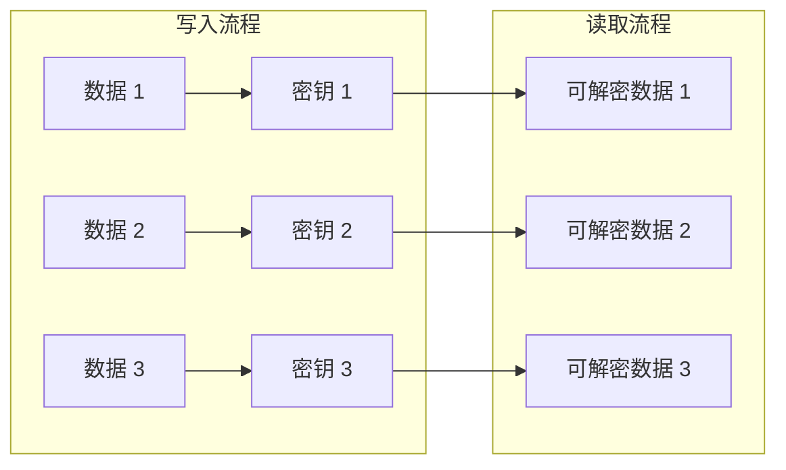
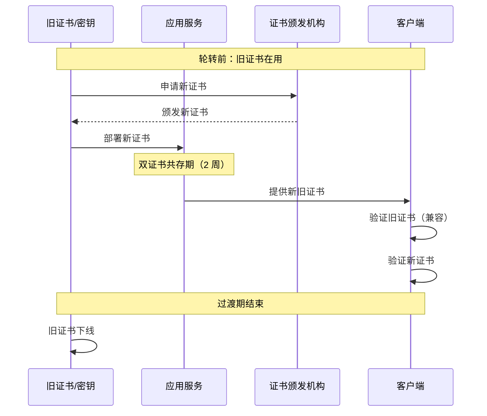

2020 年，某公司发现一名离职员工在任职期间窃取了大量客户数据。调查发现，该员工有权限访问存储客户数据的数据库，而数据库加密密钥在三年内从未轮转过。

这个案例揭示了一个关键问题：**密钥的使用时间越长，泄露风险越高，轮转是降低风险的关键手段**。

## 一、密钥轮转的必要性

### 长期密钥的风险

```
密钥泄露的窗口期：
┌─────────────────────────────────────────────────────────────────┐
│                                                                  │
│  创建 ───────────────────────────────────────────────────► 轮转  │
│    │                                                          │
│    │◄───────────── 泄露风险窗口 ──────────────────────────►│
│                                                                  │
│    问题：密钥使用时间越长，以下风险越高：                        │
│                                                                  │
│    1. 内部威胁：员工窃取、权限滥用                           │
│    2. 外部攻击：攻击者积累攻击能力                            │
│    3. 密钥管理漏洞：备份泄露、配置错误                        │
│    4. 算法弱点：随着时间发现的密码学漏洞                     │
│                                                                  │
└─────────────────────────────────────────────────────────────────┘
```

### 轮转的价值

```
轮转的作用：
┌─────────────────────────────────────────────────────────────────┐
│                                                                  │
│  轮转前：                                                      │
│  ┌─────────────────────────────────────────────────────────┐    │
│  │ 密钥 K 使用 3 年，泄露风险累积                          │    │
│  └─────────────────────────────────────────────────────────┘    │
│                                                                  │
│  轮转后：                                                      │
│  ┌─────────────────────────────────────────────────────────┐    │
│  │ 密钥 K1（2年前）  │  密钥 K2（1年前）  │  密钥 K3（当前）│
│  │    ◄── 3年 ──►    │   ◄── 2年 ──►     │   ◄── 1年 ──►  │
│  └─────────────────────────────────────────────────────────┘    │
│                                                                  │
│  效果：                                                        │
│  - 泄露风险窗口最多 = 轮转周期                                  │
│  - 历史数据仍可解密（保留旧密钥用于解密）                      │
│  - 新数据使用新密钥                                            │
│                                                                  │
└─────────────────────────────────────────────────────────────────┘
```

## 二、密钥轮转策略类型

### 基于时间的轮转

最常见的轮转策略，定期轮转密钥：

```java title="TimeBasedRotation.java"
@Service
@Slf4j
public class TimeBasedKeyRotationScheduler {
    
    @Autowired
    private KeyRotationService keyRotationService;
    
    /**
     * 定时任务：检查需要轮转的密钥
     */
    @Scheduled(cron = "0 0 2 * * *")  // 每天凌晨 2 点
    public void checkKeysForRotation() {
        
        List<Key> keysNeedingRotation = keyRepository
            .findKeysForRotation(
                Instant.now().minus(Duration.ofDays(90)), // 90 天轮转周期
                KeyState.ACTIVE
            );
        
        for (Key key : keysNeedingRotation) {
            try {
                // 检查是否满足轮转条件
                if (canRotate(key)) {
                    log.info("开始轮转密钥: {}", key.getKeyId());
                    keyRotationService.rotateKey(key.getKeyId());
                }
            } catch (Exception e) {
                log.error("密钥轮转失败: {}", key.getKeyId(), e);
                alertService.sendAlert("密钥轮转失败", key.getKeyId());
            }
        }
    }
    
    /**
     * 检查是否可以轮转
     */
    private boolean canRotate(Key key) {
        // 检查是否有正在进行的操作
        if (key.isRotationInProgress()) {
            return false;
        }
        
        // 检查是否有依赖的未完成操作
        if (hasPendingDependencies(key)) {
            return false;
        }
        
        return true;
    }
}
```

### 基于使用量的轮转

当密钥使用次数达到阈值时触发轮转：

```java title="UsageBasedRotation.java"
@Service
@Slf4j
public class UsageBasedKeyRotation {
    
    @Autowired
    private KeyUsageTracker usageTracker;
    
    /**
     * 使用量计数器（Redis 实现）
     */
    public void incrementUsageCount(String keyId) {
        String counterKey = "key:usage:" + keyId;
        long count = redisTemplate.opsForValue().increment(counterKey);
        
        // 检查是否达到阈值
        Key key = keyRepository.findByKeyId(keyId);
        if (count >= key.getRotationThreshold()) {
            log.info("密钥 {} 使用次数达到阈值 {}，触发轮转", 
                keyId, key.getRotationThreshold());
            triggerRotation(keyId);
        }
    }
    
    /**
     * 使用量配置示例
     */
    public Map<String, Object> getRotationThresholds() {
        return Map.of(
            "payment-keys", 100_000,     // 支付密钥：10 万次后轮转
            "session-keys", 1_000_000,  // 会话密钥：100 万次后轮转
            "archive-keys", 10_000       // 归档密钥：1 万次后轮转
        );
    }
}
```

### 基于事件的轮转

特定安全事件触发密钥轮转：

```java title="EventBasedRotation.java"
@Service
@Slf4j
public class EventBasedKeyRotation {
    
    @Autowired
    private SecurityEventHandler securityEventHandler;
    
    @PostConstruct
    public void registerEventHandlers() {
        // 人员变动事件
        securityEventHandler.on(EmployeeOffboardingEvent.class, this::onEmployeeOffboarding);
        
        // 安全告警事件
        securityEventHandler.on(SecurityAlertEvent.class, this::onSecurityAlert);
        
        // 漏洞发现事件
        securityEventHandler.on(VulnerabilityDiscoveredEvent.class, this::onVulnerability);
    }
    
    /**
     * 员工离职时轮转相关密钥
     */
    public void onEmployeeOffboarding(EmployeeOffboardingEvent event) {
        log.info("员工离职，轮转相关密钥: {}", event.getEmployeeId());
        
        // 查找该员工有权限使用的密钥
        List<String> keyIds = keyPermissionRepository
            .findKeysWithAccess(event.getEmployeeId());
        
        for (String keyId : keyIds) {
            // 立即轮转这些密钥
            keyRotationService.emergencyRotate(keyId, 
                "员工离职: " + event.getEmployeeId());
        }
    }
    
    /**
     * 安全告警时轮转密钥
     */
    public void onSecurityAlert(SecurityAlertEvent event) {
        if (event.getSeverity() == Severity.CRITICAL) {
            log.warn("严重安全告警，轮转所有生产密钥");
            
            // 紧急轮转所有生产环境密钥
            List<String> prodKeyIds = keyRepository.findProductionKeyIds();
            for (String keyId : prodKeyIds) {
                keyRotationService.emergencyRotate(keyId, 
                    "安全告警: " + event.getAlertId());
            }
        }
    }
}
```

### 轮转策略对比

| 策略 | 优点 | 缺点 | 适用场景 |
|------|------|------|----------|
| 定时轮转 | 可预测、易自动化 | 不够灵活 | 大多数密钥 |
| 使用量轮转 | 更精确控制风险 | 实现复杂 | 高频密钥 |
| 事件轮转 | 响应及时 | 需要事件系统 | 特殊场景 |

## 三、对称密钥轮转

### 加密方案设计

对称密钥轮转的核心挑战是：**如何让新密钥加密的数据能被旧密钥解密**？



### Java 实现

```java title="SymmetricKeyRotation.java"
@Service
@Slf4j
public class SymmetricKeyRotation {
    
    private final Map<String, List<KeyVersion>> keyVersions = new ConcurrentHashMap<>();
    
    /**
     * 加密数据（使用当前版本密钥）
     */
    public EncryptedBlob encrypt(String keyId, byte[] plaintext) throws Exception {
        
        // 获取当前活动版本的密钥
        KeyVersion currentKey = getCurrentVersion(keyId);
        
        // 生成新的 DEK（数据加密密钥）
        byte[] dek = generateDek(256);
        
        // 用 KEK 加密 DEK
        EncryptedDek encryptedDek = encryptDekWithKek(dek, currentKey.getKeyMaterial());
        
        // 用 DEK 加密数据
        byte[] iv = generateIv(12);
        byte[] ciphertext = encryptAesGcm(plaintext, dek, iv);
        
        // 返回加密结果和加密的 DEK
        return EncryptedBlob.builder()
            .keyId(keyId)
            .keyVersion(currentKey.getVersion())
            .encryptedDek(encryptedDek.getEncryptedDek())
            .encryptedDekKeyId(encryptedDek.getKeyId())
            .iv(iv)
            .ciphertext(ciphertext)
            .build();
    }
    
    /**
     * 解密数据（尝试所有版本密钥）
     */
    public byte[] decrypt(EncryptedBlob encryptedBlob) throws Exception {
        
        String keyId = encryptedBlob.getKeyId();
        
        // 获取所有版本密钥（按版本号降序，优先尝试新版本）
        List<KeyVersion> versions = keyVersions.getOrDefault(keyId, Collections.emptyList())
            .stream()
            .sorted(Comparator.comparing(KeyVersion::getVersion).reversed())
            .collect(Collectors.toList());
        
        List<Exception> errors = new ArrayList<>();
        
        for (KeyVersion version : versions) {
            try {
                // 尝试用这个版本的密钥解密 DEK
                byte[] dek = decryptDek(
                    encryptedBlob.getEncryptedDek(),
                    version.getKeyMaterial()
                );
                
                // 用 DEK 解密数据
                return decryptAesGcm(
                    encryptedBlob.getCiphertext(),
                    dek,
                    encryptedBlob.getIv()
                );
                
            } catch (Exception e) {
                errors.add(e);
                log.debug("用密钥版本 {} 解密失败，尝试下一个版本", version.getVersion());
            }
        }
        
        // 所有版本都失败
        throw new DecryptionException(
            "无法解密数据，尝试了 " + versions.size() + " 个密钥版本", 
            errors
        );
    }
    
    /**
     * 执行密钥轮转
     */
    @Transactional
    public KeyRotationResult rotateKey(String keyId) {
        
        // 1. 生成新版本密钥
        byte[] newKeyMaterial = generateKey(256);
        int newVersion = getNextVersion(keyId);
        
        KeyVersion newKeyVersion = KeyVersion.builder()
            .keyId(keyId)
            .version(newVersion)
            .keyMaterial(newKeyMaterial)
            .createdAt(Instant.now())
            .createdBy(getCurrentPrincipal())
            .state(KeyVersionState.ACTIVE)
            .build();
        
        // 2. 将当前版本标记为轮转中
        KeyVersion currentVersion = getCurrentVersion(keyId);
        currentVersion.setState(KeyVersionState.ROTATED);
        currentVersion.setRotatedAt(Instant.now());
        
        // 3. 保存新版本
        keyVersions.computeIfAbsent(keyId, k -> new ArrayList<>()).add(newKeyVersion);
        
        // 4. 审计日志
        auditService.logKeyRotation(keyId, currentVersion.getVersion(), newVersion);
        
        log.info("密钥 {} 轮转完成: {} -> {}", keyId, 
            currentVersion.getVersion(), newVersion);
        
        return new KeyRotationResult(keyId, currentVersion.getVersion(), newVersion);
    }
}
```

## 四、非对称密钥轮转

### 证书更新流程

非对称密钥（尤其是证书）轮转需要特别注意：



### 证书链轮转

```java title="CertificateRotation.java"
@Service
@Slf4j
public class CertificateRotation {
    
    /**
     * 执行证书轮转（双证书模式）
     */
    @Transactional
    public CertificateRotationResult rotateCertificate(String serviceId) {
        
        // 1. 生成新的私钥和 CSR
        KeyPair newKeyPair = generateKeyPair("RSA", 2048);
        PKCS10CertificationRequest csr = generateCSR(newKeyPair, serviceId);
        
        // 2. 向 CA 申请新证书
        Certificate newCert = caClient.issueCertificate(csr);
        
        // 3. 部署新证书（同时保留旧证书）
        deploymentService.deployCertificate(
            serviceId,
            newCert,
            newKeyPair.getPrivate()
        );
        
        // 4. 记录轮转
        CertificateRecord record = CertificateRecord.builder()
            .serviceId(serviceId)
            .serialNumber(newCert.getSerialNumber().toString())
            .validFrom(newCert.getNotBefore().toInstant())
            .validTo(newCert.getNotAfter().toInstant())
            .publicKey(newCert.getPublicKey().getEncoded())
            .state(CertificateState.ACTIVE)
            .build();
        certificateRepository.save(record);
        
        // 5. 发送通知
        notificationService.notifyCertificateDeployed(serviceId, newCert);
        
        log.info("证书轮转完成: service={}, serial={}", 
            serviceId, newCert.getSerialNumber());
        
        return new CertificateRotationResult(record, newCert);
    }
    
    /**
     * 下线旧证书（过渡期结束后）
     */
    @Transactional
    public void retireOldCertificate(String serviceId, String serialNumber) {
        
        CertificateRecord oldCert = certificateRepository
            .findByServiceIdAndSerialNumber(serviceId, serialNumber)
            .orElseThrow(() -> new CertificateNotFoundException());
        
        // 检查是否满足下线条件
        if (!canRetire(oldCert)) {
            throw new IllegalStateException("证书尚未满足下线条件");
        }
        
        // 下线旧证书
        oldCert.setState(CertificateState.RETIRED);
        oldCert.setRetiredAt(Instant.now());
        certificateRepository.save(oldCert);
        
        // 从服务移除旧证书
        deploymentService.removeCertificate(serviceId, oldCert);
        
        auditService.logCertificateRetired(serviceId, serialNumber);
        
        log.info("旧证书已下线: service={}, serial={}", serviceId, serialNumber);
    }
}
```

## 五、AWS KMS 自动轮转

### 启用自动轮转

```java title="AwsKmsAutoRotation.java"
/**
 * AWS KMS 自动轮转配置
 */
public class AwsKmsAutoRotation {
    
    private final AWSKMS kmsClient = AWSKMSClientBuilder.defaultClient();
    
    /**
     * 启用自动轮转（仅适用于对称密钥 CMK）
     */
    public void enableAutoRotation(String keyId) {
        
        EnableKeyRotationRequest request = EnableKeyRotationRequest.builder()
            .keyId(keyId)
            .build();
        
        kmsClient.enableKeyRotation(request);
        
        System.out.println("已启用自动轮转: " + keyId);
    }
    
    /**
     * 获取密钥轮转状态
     */
    public KeyRotationStatus getRotationStatus(String keyId) {
        
        GetKeyRotationStatusRequest request = GetKeyRotationStatusRequest.builder()
            .keyId(keyId)
            .build();
        
        GetKeyRotationStatusResponse response = 
            kmsClient.getKeyRotationStatus(request);
        
        return new KeyRotationStatus(
            keyId,
            response.keyRotationEnabled(),
            Instant.now()  // 上次轮转时间需要从 CloudTrail 获取
        );
    }
}
```

### CloudTrail 追踪轮转

```java title="KmsRotationAudit.java"
/**
 * 通过 CloudTrail 获取密钥轮转历史
 */
public class KmsRotationAudit {
    
    private final CloudTrailClient cloudTrail = CloudTrailClient.builder().build();
    
    /**
     * 查询密钥轮转事件
     */
    public List<KeyRotationEvent> getRotationHistory(String keyId, 
            Instant from, Instant to) {
        
        LookupAttributes filter = LookupAttributes.builder()
            .attributeKey("ResourceName")
            .attributeValue(keyId)
            .build();
        
        LookupEventsRequest request = LookupEventsRequest.builder()
            .lookupAttributes(filter)
            .startTime(from)
            .endTime(to)
            .build();
        
        LookupEventsIterable response = cloudTrail.lookupEventsPaginator(request);
        
        return response.stream()
            .flatMap(event -> event.events().stream())
            .filter(event -> event.eventName().contains("KeyRotation"))
            .map(this::parseRotationEvent)
            .collect(Collectors.toList());
    }
}
```

## 六、密钥版本管理

### 版本数据结构

```java title="KeyVersionModel.java"
/**
 * 密钥版本模型
 */
@Entity
@Table(name = "key_versions")
public class KeyVersion {
    
    @Id
    private String versionId;  // 主键
    
    @Column(name = "key_id")
    private String keyId;     // 所属密钥 ID
    
    @Column(name = "version_number")
    private int versionNumber; // 版本号
    
    @Enumerated(EnumType.STRING)
    private KeyVersionState state;  // ACTIVE, ROTATED, DELETED
    
    @Column(name = "key_material_encrypted")
    private byte[] encryptedKeyMaterial;  // 加密的密钥材料
    
    @Column(name = "created_at")
    private Instant createdAt;
    
    @Column(name = "rotated_at")
    private Instant rotatedAt;
    
    @Column(name = "deleted_at")
    private Instant deletedAt;
    
    @Column(name = "created_by")
    private String createdBy;
    
    @Column(name = "deletion_scheduled_at")
    private Instant deletionScheduledAt;
    
    @Column(name = "deletion_reason")
    private String deletionReason;
}

public enum KeyVersionState {
    ACTIVE,      // 当前使用的版本
    ROTATED,     // 已被轮转，但仍可用于解密
    DELETED,     // 已删除
    PENDING_DELETION  // 待删除
}
```

### 版本列表查询

```java title="KeyVersionService.java"
@Service
@Slf4j
public class KeyVersionService {
    
    /**
     * 获取密钥的所有版本
     */
    public List<KeyVersionSummary> getKeyVersions(String keyId) {
        
        List<KeyVersion> versions = keyVersionRepository
            .findByKeyIdOrderByVersionNumberDesc(keyId);
        
        return versions.stream()
            .map(this::toSummary)
            .collect(Collectors.toList());
    }
    
    /**
     * 版本摘要
     */
    public record KeyVersionSummary(
        String versionId,
        int versionNumber,
        KeyVersionState state,
        Instant createdAt,
        Instant rotatedAt,
        String createdBy,
        long usedForDecryptionCount  // 解密使用次数
    ) {}
}
```

## 七、轮转过程中的兼容性处理

### 向后兼容策略

```java title="CompatibilityHandler.java"
@Service
@Slf4j
public class KeyCompatibilityHandler {
    
    /**
     * 轮转时的兼容性检查
     */
    public CompatibilityCheckResult checkCompatibility(String keyId) {
        
        List<CompatibilityRequirement> requirements = 
            compatibilityRepository.findByKeyId(keyId);
        
        boolean compatible = true;
        List<String> issues = new ArrayList<>();
        
        for (CompatibilityRequirement req : requirements) {
            // 检查消费者是否支持轮转
            if (!req.getConsumer().supportsKeyRotation()) {
                issues.add(req.getConsumer().getName() + 
                    " 不支持密钥轮转，需要提前升级");
                compatible = false;
            }
            
            // 检查是否有未完成的请求
            if (req.hasPendingOperations()) {
                issues.add(req.getConsumer().getName() + 
                    " 有未完成的操作，需等待完成");
            }
        }
        
        return new CompatibilityCheckResult(compatible, issues);
    }
    
    /**
     * 消费者兼容性接口
     */
    public interface Consumer {
        String getName();
        boolean supportsKeyRotation();
        boolean hasPendingOperations();
        Duration getMaxTransitionPeriod();
    }
}
```

## 八、轮转失败的恢复策略

### 失败处理机制

```java title="RotationFailureHandler.java"
@Service
@Slf4j
public class RotationFailureHandler {
    
    @Autowired
    private AlertService alertService;
    
    /**
     * 处理轮转失败
     */
    public void handleRotationFailure(String keyId, Exception error) {
        
        log.error("密钥轮转失败: {}", keyId, error);
        
        // 1. 发送告警
        alertService.sendCriticalAlert(
            "密钥轮转失败",
            Map.of(
                "keyId", keyId,
                "error", error.getMessage(),
                "timestamp", Instant.now().toString()
            )
        );
        
        // 2. 记录失败事件
        rotationFailureRepository.save(RotationFailure.builder()
            .keyId(keyId)
            .failureTime(Instant.now())
            .errorType(error.getClass().getSimpleName())
            .errorMessage(error.getMessage())
            .retryCount(0)
            .build());
        
        // 3. 安排重试
        scheduleRetry(keyId, error);
    }
    
    /**
     * 指数退避重试
     */
    private void scheduleRetry(String keyId, Exception error) {
        int retryCount = getRetryCount(keyId);
        
        if (retryCount >= MAX_RETRIES) {
            log.error("密钥轮转重试次数超过上限: {}", keyId);
            escalateToSecurityTeam(keyId);
            return;
        }
        
        // 指数退避：1min, 5min, 15min, 1h, 4h...
        Duration delay = Duration.ofMinutes(
            (long) Math.pow(3, retryCount)
        );
        
        scheduler.schedule(
            () -> retryRotation(keyId),
            delay.toMillis(),
            TimeUnit.MILLISECONDS
        );
        
        log.info("安排重试: keyId={}, retryCount={}, delay={}", 
            keyId, retryCount + 1, delay);
    }
}
```

---

## 思考题

**问题 1**：假设你的系统使用信封加密保护大量数据。设计一个密钥轮转方案，确保：

1. 轮转过程不影响在线业务
2. 历史数据仍然可以被解密
3. 可以安全地回收不再需要的旧密钥版本

<details>
<summary>参考答案</summary>

**信封加密密钥轮转方案设计**：

```
┌─────────────────────────────────────────────────────────────────┐
│                    信封加密密钥轮转方案                             │
├─────────────────────────────────────────────────────────────────┤
│                                                                 │
│  核心设计原则：                                                 │
│                                                                 │
│  1. KEK（密钥加密密钥）定期轮转                                 │
│  2. DEK（数据加密密钥）可以按需或定期轮转                       │
│  3. 新数据使用新密钥                                            │
│  4. 旧 KEK 保留用于解密历史数据                                 │
│  5. 旧 KEK 在确认无使用后可安全删除                             │
│                                                                 │
└─────────────────────────────────────────────────────────────────┘
```

**实现方案**：

```java title="EnvelopeEncryptionRotation.java"
@Service
@Slf4j
public class EnvelopeEncryptionRotation {
    
    private final Map<String, List<KekVersion>> kekVersions = new ConcurrentHashMap<>();
    
    /**
     * 执行 KEK 轮转
     */
    @Transactional
    public KekRotationResult rotateKek(String kekId) {
        
        // 1. 创建新版本的 KEK
        byte[] newKeyMaterial = generateKey(256);
        int newVersion = getNextKekVersion(kekId);
        
        KekVersion newKek = KekVersion.builder()
            .kekId(kekId)
            .version(newVersion)
            .keyMaterial(newKeyMaterial)
            .state(KekState.ACTIVE)
            .createdAt(Instant.now())
            .build();
        
        // 2. 将当前版本标记为 ROTATED（可用于解密，不可用于加密新数据）
        KekVersion currentKek = getCurrentKek(kekId);
        if (currentKek != null) {
            currentKek.setState(KekState.ROTATED);
            currentKek.setRotatedAt(Instant.now());
        }
        
        // 3. 保存新版本
        kekVersions.computeIfAbsent(kekId, k -> new ArrayList<>()).add(newKek);
        
        // 4. 重新加密所有活动的 DEK
        reEncryptAllDek(kekId, currentKek, newKek);
        
        log.info("KEK 轮转完成: {}, 版本 {} -> {}", 
            kekId, currentKek.getVersion(), newVersion);
        
        return new KekRotationResult(kekId, currentKek.getVersion(), newVersion);
    }
    
    /**
     * 重新加密 DEK（数据密钥）
     */
    private void reEncryptAllDek(String kekId, 
            KekVersion oldKek, KekVersion newKek) {
        
        // 获取所有活动的 DEK
        List<DekRecord> activeDeks = dekRepository.findActiveByKekId(kekId);
        
        for (DekRecord dek : activeDeks) {
            try {
                // 1. 用旧 KEK 解密 DEK
                byte[] dekMaterial = decryptDek(dek.getEncryptedDek(), oldKek.getKeyMaterial());
                
                // 2. 用新 KEK 重新加密 DEK
                byte[] newEncryptedDek = encryptDek(dekMaterial, newKek.getKeyMaterial());
                
                // 3. 更新 DEK 记录
                dek.setEncryptedDek(newEncryptedDek);
                dek.setEncryptedByKekVersion(newKek.getVersion());
                dek.setLastReEncryptedAt(Instant.now());
                dekRepository.save(dek);
                
            } catch (Exception e) {
                log.error("重新加密 DEK 失败: {}", dek.getDekId(), e);
                throw new RuntimeException("DEK 重新加密失败", e);
            }
        }
        
        log.info("DEK 重新加密完成: {} 个 DEK", activeDeks.size());
    }
    
    /**
     * 加密数据（使用当前 KEK）
     */
    public EncryptedBlob encrypt(String kekId, byte[] data) {
        
        KekVersion currentKek = getCurrentKek(kekId);
        
        // 生成新的 DEK
        byte[] dek = generateKey(256);
        
        // 用当前 KEK 加密 DEK
        EncryptedDek encryptedDek = encryptDek(dek, currentKek.getKeyMaterial());
        
        // 用 DEK 加密数据
        byte[] ciphertext = encryptAesGcm(data, dek, generateIv(12));
        
        return EncryptedBlob.builder()
            .encryptedDek(encryptedDek.getEncryptedDek())
            .encryptedByKekVersion(currentKek.getVersion())
            .ciphertext(ciphertext)
            .build();
    }
    
    /**
     * 解密数据（尝试所有 KEK 版本）
     */
    public byte[] decrypt(EncryptedBlob blob) {
        
        List<KekVersion> versions = getAllKekVersions(blob.getKekId());
        
        for (KekVersion kek : versions) {
            try {
                // 尝试用这个版本的 KEK 解密
                byte[] dek = decryptDek(blob.getEncryptedDek(), kek.getKeyMaterial());
                return decryptAesGcm(blob.getCiphertext(), dek, blob.getIv());
            } catch (Exception e) {
                log.debug("用 KEK 版本 {} 解密失败", kek.getVersion());
            }
        }
        
        throw new DecryptionException("无法解密：没有可用的 KEK 版本");
    }
    
    /**
     * 安全删除旧 KEK 版本
     */
    @Transactional
    public void safelyDeleteKekVersion(String kekId, int version) {
        
        // 1. 确认该版本已轮转超过指定天数
        KekVersion kek = getKekVersion(kekId, version);
        
        Duration sinceRotated = Duration.between(
            kek.getRotatedAt(), Instant.now());
        
        if (sinceRotated.compareTo(Duration.ofDays(30)) < 0) {
            throw new IllegalStateException(
                "密钥版本轮转后需要等待 30 天才能删除");
        }
        
        // 2. 确认没有仍在使用这个版本的 DEK
        long usageCount = dekRepository.countByEncryptedByKekVersion(kekId, version);
        if (usageCount > 0) {
            throw new IllegalStateException(
                "仍有 " + usageCount + " 个 DEK 使用此密钥版本");
        }
        
        // 3. 确认没有未完成的解密操作
        if (hasPendingDecryptOperations(kekId, version)) {
            throw new IllegalStateException("有待处理的解密操作");
        }
        
        // 4. 标记为待删除（软删除）
        kek.setState(KekState.PENDING_DELETION);
        kek.setDeletionScheduledAt(Instant.now());
        
        // 5. 实际删除（经过等待期后）
        scheduler.schedule(
            () -> performActualDeletion(kekId, version),
            Duration.ofDays(7).toMillis(),
            TimeUnit.MILLISECONDS
        );
        
        log.info("密钥版本待删除: kek={}, version={}, effectiveDate={}", 
            kekId, version, Instant.now().plus(Duration.ofDays(7)));
    }
}
```

**关键设计要点**：

```
1. 无缝轮转
   - 使用双 KEK 版本：当前版本用于加密，旧版本保留用于解密
   - 重新加密 DEK：避免存储多个版本的加密 DEK
   - 应用无感知：应用始终使用「当前」密钥

2. 历史数据解密
   - 保留旧 KEK 版本（ROTATED 状态）
   - 解密时尝试所有版本
   - 定期清理不再需要的旧版本

3. 安全回收
   - 轮转后等待期（30 天）
   - 检查使用情况
   - 软删除 + 硬删除的两阶段删除
```

</details>

**问题 2**：解释为什么非对称密钥的轮转比对称密钥更复杂，并设计一个非对称密钥轮转方案，确保服务之间的 TLS 连接不会因为证书轮转而中断。

<details>
<summary>参考答案</summary>

**非对称密钥轮转的复杂性**：

```
对称密钥 vs 非对称密钥轮转对比：

┌─────────────────────────────────────────────────────────────────┐
│                        对称密钥轮转                               │
├─────────────────────────────────────────────────────────────────┤
│                                                                 │
│  特点：                                                         │
│  - 单一密钥                                                    │
│  - 轮转后旧密钥可以立即标记为失效                               │
│  - 新旧密钥可以共存                                            │
│  - 数据重新加密即可                                            │
│                                                                 │
│  复杂度：低                                                    │
│                                                                 │
└─────────────────────────────────────────────────────────────────┘

┌─────────────────────────────────────────────────────────────────┐
│                      非对称密钥轮转                               │
├─────────────────────────────────────────────────────────────────┤
│                                                                 │
│  特点：                                                         │
│  - 公钥证书与私钥配对                                           │
│  - 公钥需要被其他人知道（证书分发）                             │
│  - 私钥泄露意味着整个身份泄露                                   │
│  - 证书有有效期（固定时间点）                                   │
│  - 轮转时需要考虑客户端兼容性                                   │
│                                                                 │
│  复杂度：高                                                     │
│                                                                 │
│  原因：                                                         │
│  1. 公钥分发问题                                               │
│     - 客户端需要知道新的公钥                                    │
│     - 证书链验证需要完整链                                      │
│     - DNS/CRL/OCSP 需要更新                                    │
│                                                                 │
│  2. 客户端缓存问题                                              │
│     - 客户端可能缓存旧证书                                       │
│     - 不更新客户端无法接受新证书                                │
│     - 强制更新可能影响用户体验                                   │
│                                                                 │
│  3. 证书链依赖                                                 │
│     - 中间 CA 证书可能也需要轮转                               │
│     - 根证书轮转影响最大                                       │
│     - 需要交叉签名等过渡方案                                    │
│                                                                 │
│  4. 时间点依赖                                                 │
│     - 证书在特定时间点失效                                      │
│     - 必须在旧证书过期前完成新证书部署                           │
│     - 时钟偏差可能导致验证失败                                  │
│                                                                 │
└─────────────────────────────────────────────────────────────────┘
```

**TLS 证书零中断轮转方案**：

```
┌─────────────────────────────────────────────────────────────────┐
│                   TLS 证书零中断轮转                               │
├─────────────────────────────────────────────────────────────────┤
│                                                                 │
│  策略：                                                         │
│                                                                 │
│  1. 提前部署                                                   │
│     新证书提前 2 周部署，与旧证书共存                           │
│                                                                 │
│  2. 双证书服务                                                 │
│     服务器同时提供新旧证书                                       │
│                                                                 │
│  3. 客户端平滑过渡                                             │
│     客户端自然切换到新证书                                       │
│                                                                 │
│  4. 旧证书优雅下线                                             │
│     确认无客户端使用后移除旧证书                                 │
│                                                                 │
└─────────────────────────────────────────────────────────────────┘
```

**详细实现**：

```java title="TlsCertificateRotation.java"
@Service
@Slf4j
public class TlsCertificateRotation {
    
    /**
     * 证书轮转状态
     */
    public enum RotationPhase {
        STABLE,           // 稳定运行
        PRE_DEPLOYMENT,   // 预部署（新证书已安装）
        TRANSITION,       // 过渡期（新旧并存）
        POST_DEPLOYMENT   // 过渡期结束
    }
    
    /**
     * 配置 TLS 证书轮转
     */
    @Configuration
    public class TlsRotationConfig {
        
        @Bean
        public TomcatServletWebServerFactory tomcatFactory(
                CertificateRotationProperties props) {
            
            TomcatServletWebServerFactory factory = new TomcatServletWebServerFactory();
            
            factory.setProtocol("org.apache.coyote.http11.Http11NioProtocol");
            
            // 配置 SSL
            factory.setSsl(sslProperties(props));
            
            return factory;
        }
    }
    
    /**
     * 获取当前有效的证书配置（支持双证书）
     */
    public Ssl sslProperties(CertificateRotationProperties props) {
        
        Ssl ssl = new Ssl();
        
        // 当前（主）证书
        ssl.setKeyStore(props.getCurrentKeyStore());
        ssl.setKeyStorePassword(props.getCurrentKeyStorePassword());
        ssl.setKeyPassword(props.getCurrentKeyPassword());
        
        // 如果有预部署的证书，一并配置
        // Nginx/Tomcat 可以配置多个证书
        // 这里使用 PKCS12 证书链文件
        
        return ssl;
    }
}
```

**Nginx 配置（支持双证书）**：

```nginx title="nginx-ssl-rotation.conf"
# nginx.conf

# 当前有效的证书（包含新旧证书）
ssl_certificate /etc/nginx/certs/server-bundle.pem;
ssl_certificate_key /etc/nginx/keys/server.key;

# 证书链
ssl_trusted_certificate /etc/nginx/certs/ca-chain.pem;

# TLS 配置
ssl_protocols TLSv1.2 TLSv1.3;
ssl_ciphers 'ECDHE-ECDSA-AES128-GCM-SHA256:ECDHE-RSA-AES128-GCM-SHA256';
ssl_prefer_server_ciphers on;

# OCSP Stapling
ssl_stapling on;
ssl_stapling_verify on;
```

**证书链构建**：

```bash title="build-cert-bundle.sh"
#!/bin/bash

# 证书轮转脚本

# 1. 安装新证书
mv new-cert.pem /etc/nginx/certs/server.crt.new
mv new-key.pem /etc/nginx/keys/server.key.new

# 2. 合并证书（按顺序：新证书在前）
cat server.crt.new > server-bundle.pem
cat intermediate.crt >> server-bundle.pem
cat ca.crt >> server-bundle.pem

# 3. 创建新的私钥文件
ln -sf server.key.new server.key

# 4. 重新加载 Nginx
nginx -s reload

echo "证书已更新，使用 server-bundle.pem"
```

**客户端兼容性处理**：

```java title="CertificateUpdateNotifier.java"
/**
 * 通知客户端证书即将轮转
 */
@Service
@Slf4j
public class CertificateUpdateNotifier {
    
    /**
     * 发送证书更新通知
     */
    public void notifyClientsOfUpdate(CertificateUpdate update) {
        
        // 1. 邮件通知
        emailService.sendToAllClients(new CertificateUpdateEmail(update));
        
        // 2. 更新状态页面
        statusPageService.updateSSLCertificateStatus(update);
        
        // 3. 提供新证书下载
        certificateDownloadService.publishNewCertificate(update);
        
        // 4. API 端点更新 /.well-known/ocsp-response
        updateOcspEndpoint(update);
        
        // 5. 更新 DNS CAA 记录（如果使用）
        if (update.hasCaaChange()) {
            updateCaaRecords(update);
        }
    }
}

/**
 * 客户端证书更新通知内容
 */
public record CertificateUpdateNotification(
    String domain,
    Instant effectiveFrom,
    Instant effectiveUntil,
    String fingerprintNew,
    String fingerprintOld,
    String downloadUrl,
    String changeReason
) {}
```

**监控和验证**：

```bash title="certificate-rotation-monitor.sh"
#!/bin/bash

# 监控证书轮转状态

# 检查新证书是否已被接受
check_new_cert_accepted() {
    local domain=$1
    local new_fingerprint=$2
    
    # 尝试使用新证书连接
    result=$(echo | openssl s_client -connect $domain:443 2>/dev/null | \
        openssl x509 -noout -fingerprint -sha256 2>/dev/null)
    
    if echo "$result" | grep -q "$new_fingerprint"; then
        echo "OK: 新证书已生效"
        return 0
    else
        echo "WARN: 新证书尚未被客户端接受"
        return 1
    fi
}

# 检查旧证书使用情况
check_old_cert_usage() {
    local domain=$1
    local old_fingerprint=$2
    
    # 通过 OCSP 检查旧证书吊销情况
    ocsp_response=$(openssl ocsp \
        -issuer ca.crt \
        -cert old-cert.crt \
        -url http://ocsp.example.com \
        2>/dev/null)
    
    if echo "$ocsp_response" | grep -q "good"; then
        echo "INFO: 旧证书仍正常"
        return 0
    else
        echo "INFO: 旧证书已吊销或无效"
        return 1
    fi
}
```

**轮转时间线**：

```
┌─────────────────────────────────────────────────────────────────┐
│                   TLS 证书轮转时间线                              │
├─────────────────────────────────────────────────────────────────┤
│                                                                 │
│  Day 0          Day 7          Day 14         Day 21    Day 28  │
│    │              │              │              │         │     │
│    ▼              ▼              ▼              ▼         ▼     │
│  ┌──────────┐  ┌──────────┐  ┌──────────┐  ┌───────┐  ┌───┐ │
│  │ 部署新证书│  │ 过渡开始  │  │ 验证完成 │  │ 通知  │  │下线│ │
│  │ 双证书   │  │ 新证书   │  │ 客户端   │  │ 客户端│  │旧  │ │
│  │ 共存    │  │ 为主     │  │ 已接受   │  │ 切换  │  │证书│ │
│  └──────────┘  └──────────┘  └──────────┘  └───────┘  └───┘ │
│                                                                 │
│  说明：                                                         │
│  - Day 0-7:  新证书部署，与旧证书共存                           │
│  - Day 7-14: 过渡期，新证书优先                                 │
│  - Day 14-21: 确认客户端已接受新证书                            │
│  - Day 21-28: 通知仍使用旧证书的客户端                         │
│  - Day 28:    旧证书下线                                        │
│                                                                 │
└─────────────────────────────────────────────────────────────────┘
```

</details>
