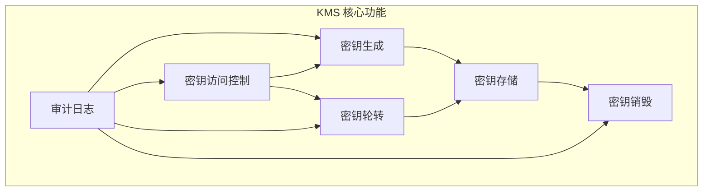
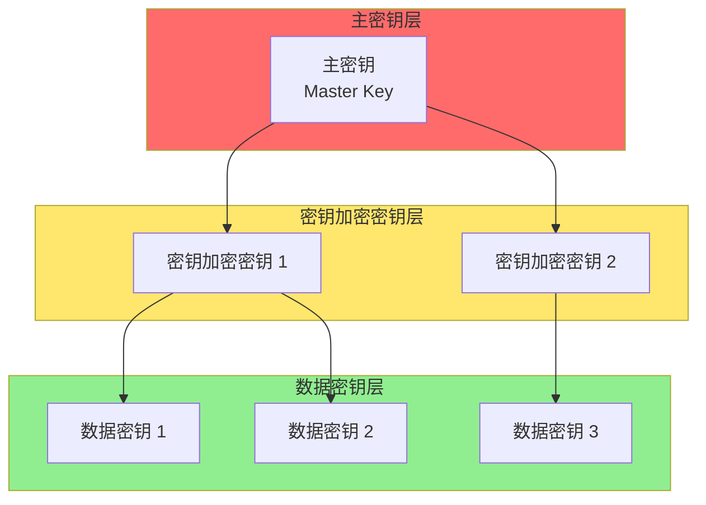
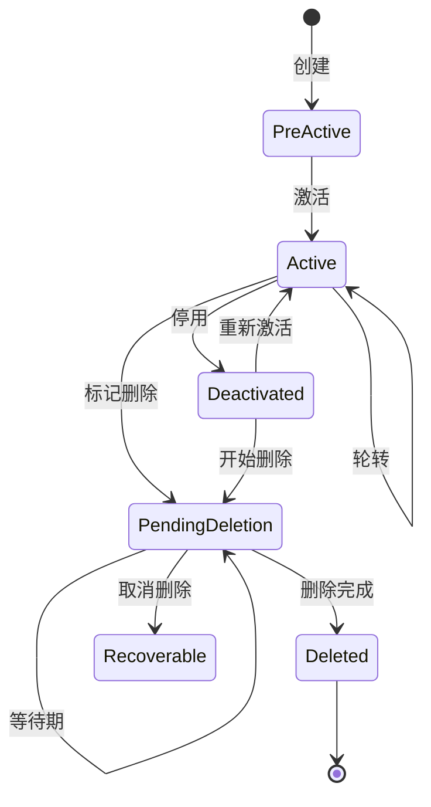
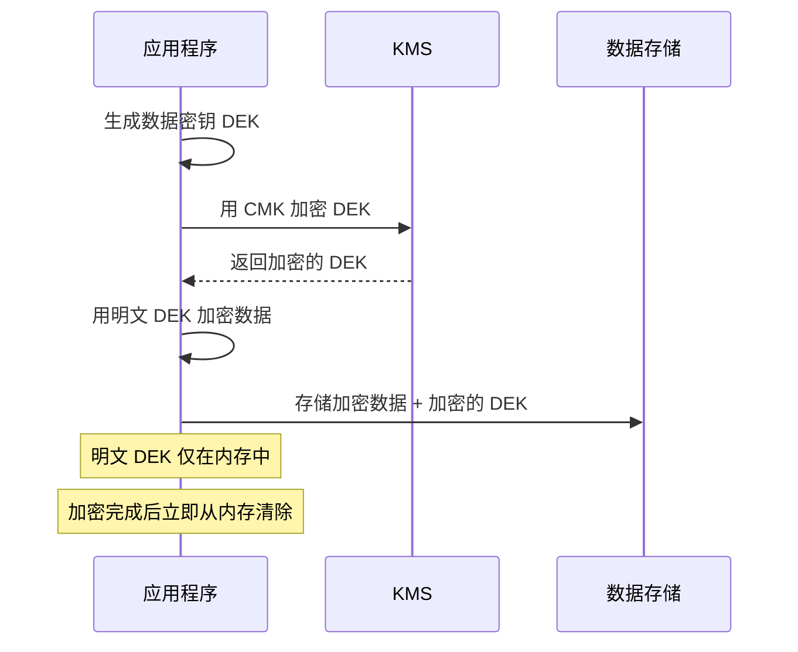

2017 年，一家科技公司的加密货币交易所被攻击，损失了价值 4 亿美元的比特币。事后调查发现，攻击者获取了服务器的管理员权限，进而访问了存储在数据库中的钱包私钥。

这个案例揭示了一个残酷的事实：**数据加密不等于数据安全**。如果没有安全的密钥管理，黑客只需要绕过加密直接获取密钥。

密钥管理（KMS）是加密系统的「命门」。本文深入探讨密钥管理的最佳实践。

## 一、KMS 的定位与核心功能

### KMS 是什么

密钥管理服务（Key Management Service）是一个专门用于创建、管理、保护加密密钥的系统。它解决了密钥管理的核心挑战：

- **密钥安全存储**：如何防止密钥泄露？
- **密钥访问控制**：谁可以使用哪些密钥？
- **密钥生命周期**：如何管理密钥的创建、使用、轮转、销毁？
- **密钥审计**：谁在什么时间使用了什么密钥？



### KMS 与 HSM 的关系

KMS 和 HSM 常被一起提及，但职责不同：

```
┌─────────────────────────────────────────────────────────────────┐
│                        KMS vs HSM                                │
├─────────────────────────────────────────────────────────────────┤
│                                                                 │
│  HSM（硬件安全模块）                                           │
│  ├─ 职责：密钥的安全存储和密码学操作                           │
│  ├─ 位置：物理硬件                                             │
│  └─ 角色：KMS 的「保险箱」                                    │
│                                                                 │
│  KMS（密钥管理服务）                                          │
│  ├─ 职责：密钥的生命周期管理、访问控制、审计                   │
│  ├─ 位置：软件服务                                             │
│  └─ 角色：密钥管理的「指挥官」                                 │
│                                                                 │
│  关系：                                                         │
│  ┌─────────────────────────────────────────────────────────┐   │
│  │  KMS ←→ HSM                                            │   │
│  │   │           │                                        │   │
│  │   │  使用 HSM │ 存储主密钥                             │   │
│  │   │           │                                        │   │
│  │   ▼           ▼                                        │   │
│  │  ┌─────────────────────────────┐                       │   │
│  │  │       HSM（硬件）          │                       │   │
│  │  │  - 主密钥存储              │                       │   │
│  │  │  - 密码学运算             │                       │   │
│  │  │  - 防篡改保护             │                       │   │
│  │  └─────────────────────────────┘                       │   │
│  └─────────────────────────────────────────────────────────┘   │
│                                                                 │
└─────────────────────────────────────────────────────────────────┘
```

## 二、密钥分类体系

### 密钥层次结构



### 密钥类型详解

| 密钥类型 | 英文 | 作用 | 生命周期 | 示例 |
|----------|------|------|----------|------|
| 主密钥 | Master Key | 加密其他密钥 | 最长（数年） | HSM 中的根密钥 |
| 密钥加密密钥 | Key Encryption Key | 加密数据密钥 | 长（数月到数年） | AWS KMS CMK |
| 数据密钥 | Data Encryption Key | 加密实际数据 | 短（数小时到数天） | 数据库加密密钥 |
| 签名密钥 | Signing Key | 数字签名 | 中（数月） | 代码签名密钥 |
| 认证密钥 | Authentication Key | 认证协议 | 中（数月） | Kerberos 密钥 |

### 密钥标识设计

```java title="KeyMetadata.java"
/**
 * 密钥元数据模型
 */
public class KeyMetadata {
    
    private String keyId;           // 全局唯一标识
    private String keyType;         // 密钥类型
    private String algorithm;       // 算法（RSA-2048, AES-256 等）
    private KeyUsage usage;        // 用途（ENCRYPT/DECRYPT/SIGN）
    private int keyLength;         // 密钥长度
    private String protectionLevel; // 保护级别（HARDWARE/SOFTWARE）
    private KeyState state;        // 状态（CREATED/ACTIVE/DELETED）
    private Instant createdAt;      // 创建时间
    private Instant rotatedAt;      // 最近轮转时间
    private Instant expiresAt;      // 过期时间（可选）
    
    // 访问控制
    private List<String> allowedPrincipals;   // 允许使用的主体
    private List<String> allowedServices;      // 允许使用的服务
    private String region;                    // 所属区域
    private String environment;               // 环境（prod/staging/dev）
    
    // 审计
    private String createdBy;        // 创建者
    private String rotationPolicy;    // 轮转策略
    private int rotationPeriodDays;  // 轮转周期（天）
}
```

## 三、密钥生命周期管理

### 密钥状态机



### 生命周期管理实现

```java title="KeyLifecycleManager.java"
@Service
@Slf4j
public class KeyLifecycleManager {
    
    @Autowired
    private KeyRepository keyRepository;
    
    @Autowired
    private AuditService auditService;
    
    @Autowired
    private NotificationService notificationService;
    
    /**
     * 创建新密钥
     */
    @Transactional
    public Key createKey(KeyCreateRequest request) {
        
        // 1. 验证请求
        validateCreateRequest(request);
        
        // 2. 检查配额
        checkKeyQuota(request.getOwner(), request.getKeyType());
        
        // 3. 调用 HSM/KMS 生成密钥
        KeyMaterial keyMaterial = kmsClient.generateKey(
            KeyGenerationRequest.builder()
                .algorithm(request.getAlgorithm())
                .length(request.getKeyLength())
                .protectionLevel(request.getProtectionLevel())
                .build()
        );
        
        // 4. 创建密钥元数据
        Key key = Key.builder()
            .keyId(UUID.randomUUID().toString())
            .keyType(request.getKeyType())
            .algorithm(request.getAlgorithm())
            .state(KeyState.PRE_ACTIVE)
            .createdAt(Instant.now())
            .createdBy(request.getRequesterPrincipal())
            .rotationPolicy(request.getRotationPolicy())
            .rotationPeriodDays(request.getRotationPeriodDays())
            .build();
        
        // 5. 存储密钥元数据（不存储密钥材料）
        key = keyRepository.save(key);
        
        // 6. 将密钥材料存入 HSM/KMS
        kmsClient.importKeyMaterial(key.getKeyId(), keyMaterial);
        
        // 7. 激活密钥
        key.setState(KeyState.ACTIVE);
        key = keyRepository.save(key);
        
        // 8. 审计日志
        auditService.logKeyOperation(
            KeyOperation.CREATE, key.getKeyId(), request.getRequesterPrincipal());
        
        // 9. 通知
        notificationService.notifyKeyCreated(key);
        
        return key;
    }
    
    /**
     * 密钥轮转
     */
    @Transactional
    public KeyRotationResult rotateKey(String keyId) {
        
        Key currentKey = keyRepository.findByKeyId(keyId)
            .orElseThrow(() -> new KeyNotFoundException(keyId));
        
        // 1. 检查是否允许轮转
        if (currentKey.getState() != KeyState.ACTIVE) {
            throw new KeyStateException("密钥必须处于 ACTIVE 状态才能轮转");
        }
        
        // 2. 创建新版本密钥
        Key newKey = createKeyVersion(currentKey);
        
        // 3. 保留旧版本（用于解密历史数据）
        currentKey.setState(KeyState.PENDING_DELETION);
        currentKey.setReplacementKeyId(newKey.getKeyId());
        keyRepository.save(currentKey);
        
        // 4. 记录轮转
        auditService.logKeyOperation(
            KeyOperation.ROTATE, keyId, "SYSTEM");
        
        return new KeyRotationResult(currentKey, newKey);
    }
    
    /**
     * 密钥删除（软删除）
     */
    @Transactional
    public void scheduleKeyDeletion(String keyId, int pendingPeriodDays) {
        
        Key key = keyRepository.findByKeyId(keyId)
            .orElseThrow(() -> new KeyNotFoundException(keyId));
        
        // 1. 检查是否可以删除
        validateDeletion(key);
        
        // 2. 设置删除状态
        key.setState(KeyState.PENDING_DELETION);
        key.setDeletionScheduledAt(Instant.now());
        key.setDeletionEffectiveAt(
            Instant.now().plus(Duration.ofDays(pendingPeriodDays)));
        keyRepository.save(key);
        
        // 3. 通知相关方
        notificationService.notifyKeyDeletionScheduled(key, pendingPeriodDays);
        
        // 4. 安排定时任务
        scheduler.scheduleKeyDeletion(keyId, pendingPeriodDays);
        
        // 5. 审计日志
        auditService.logKeyOperation(
            KeyOperation.SCHEDULE_DELETE, keyId, getCurrentPrincipal());
    }
    
    /**
     * 密钥恢复
     */
    @Transactional
    public void recoverKey(String keyId) {
        
        Key key = keyRepository.findByKeyId(keyId)
            .orElseThrow(() -> new KeyNotFoundException(keyId));
        
        if (key.getState() != KeyState.PENDING_DELETION) {
            throw new KeyStateException("只能恢复处于 PENDING_DELETION 状态的密钥");
        }
        
        if (Instant.now().isAfter(key.getDeletionEffectiveAt())) {
            throw new KeyStateException("密钥已过期，无法恢复");
        }
        
        // 恢复密钥状态
        key.setState(KeyState.ACTIVE);
        key.setDeletionScheduledAt(null);
        key.setDeletionEffectiveAt(null);
        keyRepository.save(key);
        
        // 取消删除任务
        scheduler.cancelKeyDeletion(keyId);
        
        auditService.logKeyOperation(
            KeyOperation.RECOVER, keyId, getCurrentPrincipal());
    }
}
```

## 四、密钥隔离策略

### 为什么需要密钥隔离

```
未隔离的风险：
┌─────────────────────────────────────────────────────────────┐
│  单一密钥用于所有数据                                       │
│  ┌─────────────────────────────────────────────────────┐  │
│  │  ┌───────┐  ┌───────┐  ┌───────┐  ┌───────┐      │  │
│  │  │ 数据A  │  │ 数据B  │  │ 数据C  │  │ 数据D  │      │  │
│  │  └───┬───┘  └───┬───┘  └───┬───┘  └───┬───┘      │  │
│  │      │          │          │          │             │  │
│  │      └──────────┴──────────┴──────────┘             │  │
│  │                      │                               │  │
│  │                      ▼                               │  │
│  │                 ┌─────────┐                          │  │
│  │                 │ 密钥 K  │                          │  │
│  │                 └─────────┘                          │  │
│  └─────────────────────────────────────────────────────┘  │
│                                                             │
│  问题：密钥泄露影响所有数据                                  │
└─────────────────────────────────────────────────────────────┘

隔离后的优势：
┌─────────────────────────────────────────────────────────────┐
│  密钥隔离                                                 │
│  ┌─────────┐  ┌─────────┐  ┌─────────┐  ┌─────────┐     │
│  │ 数据A   │  │ 数据B   │  │ 数据C   │  │ 数据D   │     │
│  │ └──┬──┘  │ └──┬──┘  │ └──┬──┘  │ └──┬──┘     │
│  │    ▼       │    ▼       │    ▼       │    ▼       │
│  │ 密钥 KA    │ 密钥 KB    │ 密钥 KC    │ 密钥 KD    │
│  └─────────┘  └─────────┘  └─────────┘  └─────────┘     │
│                                                             │
│  优势：密钥泄露只影响部分数据                                │
└─────────────────────────────────────────────────────────────┘
```

### 隔离维度

```java title="KeyIsolationStrategy.java"
public class KeyIsolationStrategy {
    
    /**
     * 基于数据的隔离策略
     */
    public enum IsolationDimension {
        // 按数据类型隔离
        DATA_TYPE,      // PII、财务、健康数据分开
        
        // 按环境隔离
        ENVIRONMENT,     // dev/staging/prod
        
        // 按服务隔离
        SERVICE,         // 每个微服务独立密钥
        
        // 按租户隔离
        TENANT,          // 多租户场景下按租户隔离
        
        // 按区域隔离
        REGION          // 不同地理区域
    }
    
    /**
     * 推荐隔离策略
     */
    public static Map<IsolationDimension, String> getRecommendedIsolation(
            String useCase) {
        
        return switch (useCase) {
            case "payment" -> Map.of(
                IsolationDimension.DATA_TYPE, "FINANCIAL",
                IsolationDimension.ENVIRONMENT, "prod",
                IsolationDimension.SERVICE, "payment-service"
            );
            
            case "pii-data" -> Map.of(
                IsolationDimension.DATA_TYPE, "PII",
                IsolationDimension.ENVIRONMENT, "prod",
                IsolationDimension.TENANT, "dynamic"
            );
            
            case "general-data" -> Map.of(
                IsolationDimension.ENVIRONMENT, "dynamic",
                IsolationDimension.SERVICE, "dynamic"
            );
            
            default -> Map.of(
                IsolationDimension.ENVIRONMENT, "dynamic"
            );
        };
    }
}
```

## 五、云 KMS 服务对比

### AWS KMS vs Azure Key Vault vs GCP Cloud KMS

| 特性 | AWS KMS | Azure Key Vault | GCP Cloud KMS |
|------|---------|-----------------|---------------|
| **密钥类型** | 对称、非对称、HmacKey | 对称、非对称、PGP | 对称、非对称 |
| **HSM 保护** | CloudHSM（独立） | Managed HSM（独立） | 集成 Cloud HSM |
| **FIPS 认证** | Level 2（托管）/ Level 3（CloudHSM） | Level 2（托管）/ Level 3（HSM） | Level 2 |
| **密钥轮转** | 自动（CMK） | 自动/手动 | 自动/手动 |
| **访问控制** | IAM Policy | RBAC + Access Policy | IAM + Cloud KMS permissions |
| **审计** | CloudTrail | Azure Monitor | Cloud Logging |
| **可用性** | 99.9999999% | 99.99% | 99.95% |
| **区域** | 全球 | 全球 | 全球 |
| **定价** | 按 API 调用 | 按操作 + 存储 | 按操作 + 存储 |

### Java SDK 对比

```java title="CloudKmsComparison.java"
/**
 * AWS KMS Java SDK
 */
public class AwsKmsExample {
    
    private final AWSKMS kms = AWSKMSClientBuilder.defaultClient();
    
    // 生成 CMK
    public String createKey() {
        CreateKeyRequest request = CreateKeyRequest.builder()
            .description("Database encryption key")
            .keyUsage(KeyUsageType.ENCRYPT_DECRYPT)
            .keySpec(KeySpec.SYMMETRIC_DEFAULT)
            .enableKeyRotation(true)
            .build();
        
        return kms.createKey(request).keyMetadata().keyId();
    }
    
    // 加密
    public byte[] encrypt(String keyId, byte[] plaintext) {
        EncryptRequest request = EncryptRequest.builder()
            .keyId(keyId)
            .plaintext(ByteBuffer.wrap(plaintext))
            .build();
        
        return kms.encrypt(request).ciphertextBlob().array();
    }
    
    // 解密
    public byte[] decrypt(String keyId, byte[] ciphertext) {
        DecryptRequest request = DecryptRequest.builder()
            .keyId(keyId)
            .ciphertextBlob(ByteBuffer.wrap(ciphertext))
            .build();
        
        return kms.decrypt(request).plaintext().array();
    }
}

/**
 * Azure Key Vault Java SDK
 */
public class AzureKeyVaultExample {
    
    private final SecretClient secretClient = new SecretClientBuilder()
        .vaultUrl("https://myvault.vault.azure.net/")
        .credential(new DefaultAzureCredential())
        .buildClient();
    
    // 设置密钥
    public void setKey(String keyName, byte[] keyMaterial) {
        KeyVaultKey key = new KeyVaultKey(keyName, 
            Base64.getEncoder().encodeToString(keyMaterial));
        secretClient.setKey(key);
    }
    
    // 获取密钥
    public byte[] getKey(String keyName) {
        KeyVaultKey key = secretClient.getKey(keyName);
        return Base64.getDecoder().decode(key.getKeyMaterial());
    }
}

/**
 * GCP Cloud KMS Java SDK
 */
public class GcpKmsExample {
    
    private final KeyManagementServiceClient kms = 
        KeyManagementServiceClient.create();
    
    // 加密
    public ByteString encrypt(String keyRingName, String cryptoKeyName, 
            ByteString plaintext) {
        
        CryptoKeyName name = CryptoKeyName.of("[PROJECT]", "[LOCATION]", 
            keyRingName, cryptoKeyName);
        
        EncryptRequest request = EncryptRequest.newBuilder()
            .setName(name.toString())
            .setPlaintext(plaintext)
            .build();
        
        return kms.encrypt(request).getCiphertext();
    }
}
```

## 六、信封加密

### 什么是信封加密

信封加密（Envelope Encryption）是一种高效的加密方法：

- 用数据密钥加密大量数据
- 用主密钥加密数据密钥
- 数据密钥与加密数据一起存储



### Java 实现

```java title="EnvelopeEncryption.java"
@Service
@Slf4j
public class EnvelopeEncryptionService {
    
    private final AwsKmsClient kmsClient;
    private final SecretGenerator secretGenerator;
    
    /**
     * 加密数据
     */
    public EncryptedData encrypt(byte[] plaintext) throws Exception {
        
        // 1. 生成随机数据密钥
        byte[] dek = secretGenerator.generateSymmetricKey(256);
        
        // 2. 用 DEK 加密数据
        byte[] encryptedData = encryptWithDek(plaintext, dek);
        
        // 3. 用 CMK 加密 DEK
        EncryptedDek encryptedDek = kmsClient.encrypt(
            "customer-master-key-id",
            dek
        );
        
        // 4. 清除内存中的明文 DEK
        Arrays.fill(dek, (byte) 0);
        
        // 5. 返回加密数据和加密的 DEK
        return new EncryptedData(
            encryptedData,
            encryptedDek.getCiphertext(),
            encryptedDek.getKeyId()
        );
    }
    
    /**
     * 解密数据
     */
    public byte[] decrypt(EncryptedData encryptedData) throws Exception {
        
        // 1. 用 CMK 解密 DEK
        byte[] dek = kmsClient.decrypt(
            encryptedData.getKeyId(),
            encryptedData.getEncryptedDek()
        );
        
        // 2. 用 DEK 解密数据
        byte[] plaintext = decryptWithDek(
            encryptedData.getCiphertext(),
            dek
        );
        
        // 3. 清除内存中的 DEK
        Arrays.fill(dek, (byte) 0);
        
        return plaintext;
    }
    
    private byte[] encryptWithDek(byte[] data, byte[] dek) throws Exception {
        // 使用 AES-GCM 加密
        SecretKey key = new SecretKeySpec(dek, "AES");
        Cipher cipher = Cipher.getInstance("AES/GCM/NoPadding");
        GCMParameterSpec spec = new GCMParameterSpec(128, new byte[12]);
        cipher.init(Cipher.ENCRYPT_MODE, key, spec);
        return cipher.doFinal(data);
    }
}
```

## 七、密钥权限管理

### Key Policy vs IAM Policy

以 AWS KMS 为例：

```
┌─────────────────────────────────────────────────────────────────┐
│                    AWS KMS 权限模型                                │
├─────────────────────────────────────────────────────────────────┤
│                                                                 │
│  Key Policy（密钥级别）                                        │
│  ├─ 定义谁可以管理密钥                                          │
│  ├─ 定义谁可以使用密钥加密/解密                                │
│  ├─ 定义是否可以删除密钥                                        │
│  └─ 每个 KMS 密钥必须有 Key Policy                            │
│                                                                 │
│  IAM Policy（用户/角色级别）                                   │
│  ├─ 定义 IAM 用户/角色可以做什么                               │
│  ├─ 通过 Grant 授予临时权限                                    │
│  └─ 需要 Key Policy 允许才能生效                               │
│                                                                 │
│  两层都需要满足！                                               │
│                                                                 │
│  Key Policy ──────────────────────► KMS 密钥                   │
│       │                                                        │
│       │ 允许                                                  │
│       ▼                                                        │
│  IAM Policy ──────────────────────► IAM 用户/角色              │
│                                                                 │
└─────────────────────────────────────────────────────────────────┘
```

### 权限设计

```java title="KeyPermissionManager.java"
@Service
@Slf4j
public class KeyPermissionManager {
    
    /**
     * 授予密钥使用权限
     */
    public void grantKeyUsage(String keyId, String principal, 
            KeyPermission permission) {
        
        // 1. 创建 Grant
        Grant grant = Grant.builder()
            .keyId(keyId)
            .granteePrincipal(principal)
            .operations(permission.getOperations())
            .constraints(GrantConstraints.builder()
                .encryptionContextSubset(
                    Map.of("department", permission.getDepartment()))
                .build())
            .build();
        
        // 2. 提交 Grant
        String grantToken = kmsClient.createGrant(grant);
        
        // 3. 记录授权
        auditService.logGrantCreated(keyId, principal, permission);
    }
    
    /**
     * 权限级别定义
     */
    public enum KeyPermission {
        
        ENCRYPT_DECRYPT(
            "encrypt", "decrypt", "ReEncrypt", 
            "DescribeKey", "GenerateDataKey"
        ),
        
        SIGN_VERIFY(
            "Sign", "Verify",
            "DescribeKey"
        ),
        
        KEY_ADMIN(
            "CreateKey", "DeleteKey", "UpdateKey",
            "GetKeyPolicy", "PutKeyPolicy",
            "DescribeKey", "ListKeys"
        ),
        
        KEY_USER(
            "Encrypt", "Decrypt", "ReEncrypt",
            "GenerateDataKey", "GenerateDataKeyWithoutPlaintext",
            "DescribeKey", "CreateGrant"
        );
        
        private final Set<String> operations;
        
        KeyPermission(String... ops) {
            this.operations = Set.of(ops);
        }
        
        public Set<String> getOperations() {
            return operations;
        }
    }
}
```

## 八、审计与监控

### 审计日志设计

```java title="KeyAuditService.java"
@Service
@Slf4j
public class KeyAuditService {
    
    /**
     * 记录密钥操作
     */
    public void logKeyOperation(KeyOperation operation, String keyId, 
            String performedBy) {
        
        KeyAuditEvent event = KeyAuditEvent.builder()
            .eventId(UUID.randomUUID().toString())
            .timestamp(Instant.now())
            .operation(operation)
            .keyId(keyId)
            .performedBy(performedBy)
            .ipAddress(getCurrentIpAddress())
            .userAgent(getCurrentUserAgent())
            .success(true)
            .build();
        
        // 异步写入审计日志
        auditLogPublisher.publish(event);
    }
    
    /**
     * 查询密钥操作历史
     */
    public Page<KeyAuditEvent> getKeyHistory(String keyId, 
            Instant from, Instant to, Pageable pageable) {
        
        return auditRepository.findByKeyIdAndTimestampBetween(
            keyId, from, to, pageable);
    }
    
    /**
     * 异常访问检测
     */
    public List<SecurityAlert> detectAnomalies(String keyId) {
        List<SecurityAlert> alerts = new ArrayList<>();
        
        // 1. 异常时间访问
        List<KeyAuditEvent> events = auditRepository
            .findRecentEvents(keyId, Duration.ofHours(24));
        
        if (hasUnusualTimeAccess(events)) {
            alerts.add(SecurityAlert.builder()
                .type(AlertType.UNUSUAL_TIME_ACCESS)
                .keyId(keyId)
                .description("检测到非工作时间的密钥访问")
                .severity(Severity.HIGH)
                .build());
        }
        
        // 2. 异常地点访问
        if (hasUnusualLocationAccess(events)) {
            alerts.add(SecurityAlert.builder()
                .type(AlertType.UNUSUAL_LOCATION_ACCESS)
                .keyId(keyId)
                .description("检测到异地密钥访问")
                .severity(Severity.HIGH)
                .build());
        }
        
        // 3. 批量访问
        if (hasBulkAccess(events)) {
            alerts.add(SecurityAlert.builder()
                .type(AlertType.BULK_ACCESS)
                .keyId(keyId)
                .description("检测到异常的批量密钥操作")
                .severity(Severity.MEDIUM)
                .build());
        }
        
        return alerts;
    }
}
```

### 监控指标

| 指标 | 说明 | 告警阈值 |
|------|------|----------|
| key_usage_count | 密钥使用次数 | 异常峰值 |
| failed_decrypt_attempts | 失败解密次数 | > 10/分钟 |
| key_expiring_soon | 即将过期密钥数 | > 0 |
| key_rotation_overdue | 轮转超期密钥数 | > 0 |
| unauthorized_access_attempts | 未授权访问尝试 | > 0 |
| bulk_operations | 批量操作次数 | 异常峰值 |

---

## 思考题

**问题 1**：某公司正在从传统的数据库加密方案迁移到信封加密方案。在迁移过程中，需要处理一个挑战：现有的历史数据使用旧密钥加密，新数据使用新密钥加密。请设计一个数据密钥迁移方案，确保：

1. 迁移过程不影响业务运行
2. 数据不会因为迁移而丢失
3. 迁移完成后可以安全地清理旧密钥

<details>
<summary>参考答案</summary>

**数据密钥迁移方案设计**：

```
┌─────────────────────────────────────────────────────────────────┐
│                    信封加密密钥迁移流程                            │
├─────────────────────────────────────────────────────────────────┤
│                                                                 │
│  Phase 1：准备阶段                                             │
│  ├─ 生成新的 DEK（新 DEK）                                    │
│  ├─ 配置 KMS 支持新旧 DEK                                      │
│  └─ 部署支持双密钥的应用程序                                   │
│                                                                 │
│  Phase 2：双密钥运行阶段                                       │
│  ├─ 新数据使用新 DEK 加密                                      │
│  ├─ 旧数据仍然可以被新应用解密                                 │
│  └─ 逐步迁移旧数据                                             │
│                                                                 │
│  Phase 3：过渡阶段                                             │
│  ├─ 旧数据全部迁移完成                                         │
│  └─ 验证所有新数据使用新 DEK                                   │
│                                                                 │
│  Phase 4：清理阶段                                             │
│  ├─ 确认旧 DEK 不再被使用                                      │
│  ├─ 标记旧 DEK 为待删除                                       │
│  └─ 等待期结束后删除旧 DEK                                     │
│                                                                 │
└─────────────────────────────────────────────────────────────────┘
```

**详细实现方案**：

```java title="KeyMigrationService.java"
@Service
@Slf4j
public class KeyMigrationService {
    
    private final EnvelopeEncryptionService encryptionService;
    private final DataRepository dataRepository;
    private final AuditService auditService;
    
    /**
     * 迁移单个数据项
     * 支持双密钥读取，单密钥写入
     */
    @Transactional
    public void migrateDataItem(String dataId) throws Exception {
        
        // 1. 获取当前数据
        EncryptedData currentData = dataRepository.findEncryptedData(dataId);
        
        // 2. 检查当前使用的密钥版本
        String currentKeyVersion = currentData.getKeyVersion();
        
        if (CURRENT_KEY_VERSION.equals(currentKeyVersion)) {
            // 已经是最新密钥，无需迁移
            return;
        }
        
        // 3. 用旧密钥解密
        byte[] plaintext = encryptionService.decryptWithVersion(
            currentData.getEncryptedData(),
            currentKeyVersion
        );
        
        // 4. 用新密钥重新加密
        EncryptedData newData = encryptionService.encryptWithCurrentVersion(plaintext);
        
        // 5. 原子性更新
        currentData.setEncryptedData(newData.getCiphertext());
        currentData.setEncryptedDek(newData.getEncryptedDek());
        currentData.setKeyVersion(CURRENT_KEY_VERSION);
        currentData.setMigratedAt(Instant.now());
        currentData.setKeyVersion(CURRENT_KEY_VERSION);
        
        dataRepository.save(currentData);
        
        // 6. 审计
        auditService.logKeyMigration(dataId, currentKeyVersion, CURRENT_KEY_VERSION);
    }
    
    /**
     * 批量迁移（后台任务）
     */
    @Async
    public void batchMigrate(int batchSize, int maxBatches) {
        
        // 分批处理，避免影响在线服务
        int processed = 0;
        int batchNumber = 0;
        
        while (processed < maxBatches * batchSize) {
            
            List<String> pendingIds = dataRepository
                .findDataIdsPendingMigration(batchSize);
            
            if (pendingIds.isEmpty()) {
                break;  // 没有更多数据需要迁移
            }
            
            for (String dataId : pendingIds) {
                try {
                    migrateDataItem(dataId);
                    processed++;
                    
                } catch (Exception e) {
                    log.error("迁移数据项失败: {}", dataId, e);
                    // 记录失败，继续处理下一项
                    recordMigrationFailure(dataId, e);
                }
            }
            
            batchNumber++;
            log.info("批次 {} 完成，已迁移 {} 项", batchNumber, processed);
            
            // 批次间暂停，避免资源竞争
            Thread.sleep(1000);
        }
    }
    
    /**
     * 清理旧密钥
     * 只在确认所有数据迁移完成后调用
     */
    @Transactional
    public void cleanupOldKeys() {
        
        // 1. 验证迁移完成
        long pendingCount = dataRepository.countPendingMigration();
        if (pendingCount > 0) {
            throw new IllegalStateException(
                "仍有 " + pendingCount + " 项数据未迁移完成");
        }
        
        // 2. 检查是否有应用仍在使用旧密钥
        boolean stillInUse = keyUsageTracker.hasRecentUsage(OLD_KEY_ID);
        if (stillInUse) {
            throw new IllegalStateException(
                "旧密钥仍在被使用，请等待所有应用更新");
        }
        
        // 3. 标记旧密钥为待删除
        kmsClient.scheduleKeyDeletion(OLD_KEY_ID, 7);  // 7 天等待期
        
        // 4. 审计
        auditService.logKeyScheduledForDeletion(OLD_KEY_ID);
        
        // 5. 通知
        notificationService.notifyOldKeyDeletionScheduled(
            OLD_KEY_ID, Instant.now().plus(Duration.ofDays(7)));
    }
}
```

**关键设计要点**：

```
1. 原子性更新
   - 使用版本号确保一致性
   - 失败时保留旧版本数据
   - 不丢失任何数据

2. 批量处理
   - 分批迁移，避免长时间锁定
   - 设置处理速率限制
   - 监控迁移进度

3. 双密钥读取
   - 应用需要支持读取旧密钥加密的数据
   - 新数据使用新密钥
   - 向后兼容

4. 安全清理
   - 验证迁移完成才能清理
   - 检查密钥使用情况
   - 设置等待期防止误删
```

</details>

**问题 2**：解释密钥管理中的「最小权限原则」如何在实践中实现。设计一个企业级 KMS 权限模型，确保：

1. 开发人员只能使用密钥，不能管理密钥
2. 安全管理员可以管理密钥，但不能使用密钥解密生产数据
3. 审计人员可以查看所有操作日志，但不能操作密钥

<details>
<summary>参考答案</summary>

**最小权限原则在 KMS 中的实现**：

```
┌─────────────────────────────────────────────────────────────────┐
│                    KMS 最小权限原则实现                           │
├─────────────────────────────────────────────────────────────────┤
│                                                                 │
│  核心思想：                                                     │
│                                                                 │
│  1. 角色分离                                                   │
│     - 不同职责使用不同的密钥和权限                                │
│     - 开发密钥 vs 生产密钥                                      │
│     - 加密权限 vs 解密权限                                      │
│                                                                 │
│  2. 范围限制                                                   │
│     - 限制可访问的密钥范围                                      │
│     - 限制可执行的操作类型                                      │
│     - 限制访问时间窗口                                          │
│                                                                 │
│  3. 即时权限                                                   │
│     - Just-in-Time (JIT) 访问                                  │
│     - 临时凭证替代长期凭证                                      │
│     - 自动回收权限                                             │
│                                                                 │
└─────────────────────────────────────────────────────────────────┘
```

**企业级 KMS 权限模型设计**：

```java title="KmsPermissionModel.java"
/**
 * KMS 权限模型定义
 */
public class KmsPermissionModel {
    
    /**
     * 角色定义
     */
    public enum KmsRole {
        
        /**
         * 密钥管理员
         * - 可以创建、删除、轮转密钥
         * - 可以管理密钥策略
         * - 不能使用密钥加密/解密数据
         */
        KEY_ADMIN(
            Set.of(
                "kms:CreateKey",
                "kms:DeleteKey",
                "kms:DescribeKey",
                "kms:GetKeyPolicy",
                "kms:PutKeyPolicy",
                "kms:EnableKeyRotation",
                "kms:ScheduleKeyDeletion"
            ),
            "负责密钥的生命周期管理"
        ),
        
        /**
         * 密钥用户
         * - 可以使用密钥加密/解密数据
         * - 不能管理密钥
         * - 仅限特定环境（dev/staging）
         */
        KEY_USER_DEV(
            Set.of(
                "kms:Encrypt",
                "kms:Decrypt",
                "kms:GenerateDataKey",
                "kms:DescribeKey"
            ),
            "开发环境密钥使用者"
        ),
        
        /**
         * 密钥用户 - 生产
         * - 仅加密权限（解密需要额外审批）
         */
        KEY_USER_PROD_ENCRYPT(
            Set.of(
                "kms:Encrypt",
                "kms:GenerateDataKey",
                "kms:DescribeKey"
            ),
            "生产环境仅加密"
        ),
        
        /**
         * 审计管理员
         * - 可以查看所有审计日志
         * - 不能操作任何密钥
         */
        AUDIT_ADMIN(
            Set.of(
                "kms:GetKeyRotationStatus",
                "cloudtrail:LookupEvents"
            ),
            "仅审计权限"
        );
        
        private final Set<String> permissions;
        private final String description;
    }
    
    /**
     * 环境隔离策略
     */
    public enum Environment {
        DEV("dev-*"),
        STAGING("staging-*"),
        PROD("prod-*");
        
        private final String keyIdPattern;
    }
}
```

**具体 IAM Policy 设计**：

```json title="kms-iam-policies.json"
{
  "Version": "2012-10-17",
  "Statement": [
    {
      "Sid": "DeveloperKeyUsage",
      "Effect": "Allow",
      "Principal": {
        "AWS": "arn:aws:iam::123456789:group/developers"
      },
      "Action": [
        "kms:Encrypt",
        "kms:Decrypt",
        "kms:GenerateDataKey"
      ],
      "Resource": "arn:aws:kms:*:123456789:key/dev-*",
      "Condition": {
        "StringEquals": {
          "kms:ViaService": "lambda.us-east-1.amazonaws.com"
        }
      }
    },
    {
      "Sid": "ProductionEncryptOnly",
      "Effect": "Allow",
      "Principal": {
        "AWS": "arn:aws:iam::123456789:role/production-service"
      },
      "Action": [
        "kms:Encrypt",
        "kms:GenerateDataKey"
      ],
      "Resource": "arn:aws:kms:*:123456789:key/prod-*"
    },
    {
      "Sid": "SecurityAdminKeyManagement",
      "Effect": "Allow",
      "Principal": {
        "AWS": "arn:aws:iam::123456789:role/security-admin"
      },
      "Action": [
        "kms:CreateKey",
        "kms:DeleteKey",
        "kms:EnableKeyRotation",
        "kms:ScheduleKeyDeletion",
        "kms:GetKeyPolicy",
        "kms:PutKeyPolicy"
      ],
      "Resource": "*",
      "Condition": {
        "StringEquals": {
          "aws:PrincipalTag/department": "security"
        }
      }
    }
  ]
}
```

**Key Policy 设计**：

```json title="key-policy.json"
{
  "Version": "2012-10-17",
  "Id": "key-policy-production-db",
  "Statement": [
    {
      "Sid": "Enable IAM User Permissions",
      "Effect": "Allow",
      "Principal": {
        "AWS": "arn:aws:iam::123456789:root"
      },
      "Action": "kms:*",
      "Resource": "*"
    },
    {
      "Sid": "AllowEncryptedDataAccess",
      "Effect": "Allow",
      "Principal": {
        "AWS": [
          "arn:aws:iam::123456789:role/database-service",
          "arn:aws:iam::123456789:role/application-service"
        ]
      },
      "Action": [
        "kms:Decrypt",
        "kms:Encrypt"
      ],
      "Resource": "*",
      "Condition": {
        "Bool": {
          "kms:EncryptionContextEquals": {
            "environment": "production"
          }
        }
      }
    },
    {
      "Sid": "AllowSecurityTeamAudit",
      "Effect": "Allow",
      "Principal": {
        "AWS": "arn:aws:iam::123456789:role/security-audit"
      },
      "Action": [
        "kms:DescribeKey",
        "kms:GetKeyRotationStatus"
      ],
      "Resource": "*"
    },
    {
      "Sid": "DenyProductionDecryptOutsideHours",
      "Effect": "Deny",
      "Principal": "*",
      "Action": "kms:Decrypt",
      "Resource": "*",
      "Condition": {
        "StringNotEquals": {
          "aws:PrincipalTag/shift": "day-shift"
        },
        "Bool": {
          "kms:EncryptionContextEquals": {
            "classification": "restricted"
          }
        }
      }
    }
  ]
}
```

**JIT 访问实现**：

```java title="JustInTimeAccess.java"
@Service
@Slf4j
public class KmsJustInTimeAccess {
    
    private final AWSKMS kms = AWSKMSClientBuilder.defaultClient();
    private final STSClient sts = STSClient.builder().build();
    
    /**
     * 请求临时解密权限
     */
    public TemporaryAccessToken requestDecryptAccess(
            String keyId, 
            Duration validFor,
            String reason) {
        
        // 1. 验证请求者身份
        String requester = getCurrentPrincipal();
        validateRequesterAuthorization(requester, "decrypt-request");
        
        // 2. 记录权限申请
        auditService.logAccessRequest(keyId, "decrypt", requester, reason);
        
        // 3. 发送审批请求（如果需要）
        ApprovalResult approval = sendForApproval(keyId, requester, reason);
        if (!approval.isApproved()) {
            throw new AccessDeniedException("解密权限申请未获批准");
        }
        
        // 4. 生成临时凭证
        GetContextForEncryptionGrantRequest grantRequest = 
            GetContextForEncryptionGrantRequest.builder()
                .encryptionContext(Map.of(
                    "key-id", keyId,
                    "requester", requester,
                    "approved-by", approval.getApprovedBy()
                ))
                .grantTypes(GrantType.DECRYPT)
                .keyId(keyId)
                .operations(List.of(GrantOperation.DECRYPT))
                .IssuingPrincipal(requester)
                .build();
        
        GrantToken grantToken = kms.createGrant(grantRequest);
        
        // 5. 返回临时令牌（有效期短）
        return TemporaryAccessToken.builder()
            .grantToken(grantToken.getGrantToken())
            .keyId(keyId)
            .expiresAt(Instant.now().plus(validFor))
            .build();
    }
    
    /**
     * 使用临时令牌解密
     */
    public byte[] decryptWithTemporaryAccess(
            String keyId, 
            byte[] ciphertext,
            TemporaryAccessToken token) {
        
        // 1. 验证令牌
        if (Instant.now().isAfter(token.getExpiresAt())) {
            throw new TokenExpiredException("临时访问令牌已过期");
        }
        
        // 2. 执行解密
        DecryptRequest request = DecryptRequest.builder()
            .keyId(keyId)
            .ciphertext(ByteBuffer.wrap(ciphertext))
            .grantToken(token.getGrantToken())
            .build();
        
        ByteBuffer plaintext = kms.decrypt(request).plaintext();
        
        // 3. 审计
        auditService.logDecryptWithTemporaryAccess(keyId, token.getRequester());
        
        return plaintext.array();
    }
}
```

**权限矩阵总结**：

```
┌─────────────────────────────────────────────────────────────────┐
│                    KMS 权限矩阵                                    │
├─────────────────────────────────────────────────────────────────┤
│                                                                 │
│  角色            │ 创建 │ 删除 │ 加密 │ 解密 │ 审计 │ 策略       │
│  ─────────────────────────────────────────────────────────────  │
│  开发人员        │  ✗   │  ✗   │  ✓   │  ✓   │  ✗   │  ✗       │
│  生产服务账号    │  ✗   │  ✗   │  ✓   │  ✓   │  ✗   │  ✗       │
│  安全管理员      │  ✓   │  ✓   │  ✗   │  ✗   │  ✓   │  ✓       │
│  审计人员        │  ✗   │  ✗   │  ✗   │  ✗   │  ✓   │  ✗       │
│  DBA（生产）    │  ✗   │  ✗   │  ✗   │  ✓*  │  ✗   │  ✗       │
│                                                                 │
│  * = 需要额外的审批和即时权限                                  │
│                                                                 │
└─────────────────────────────────────────────────────────────────┘
```

</details>
