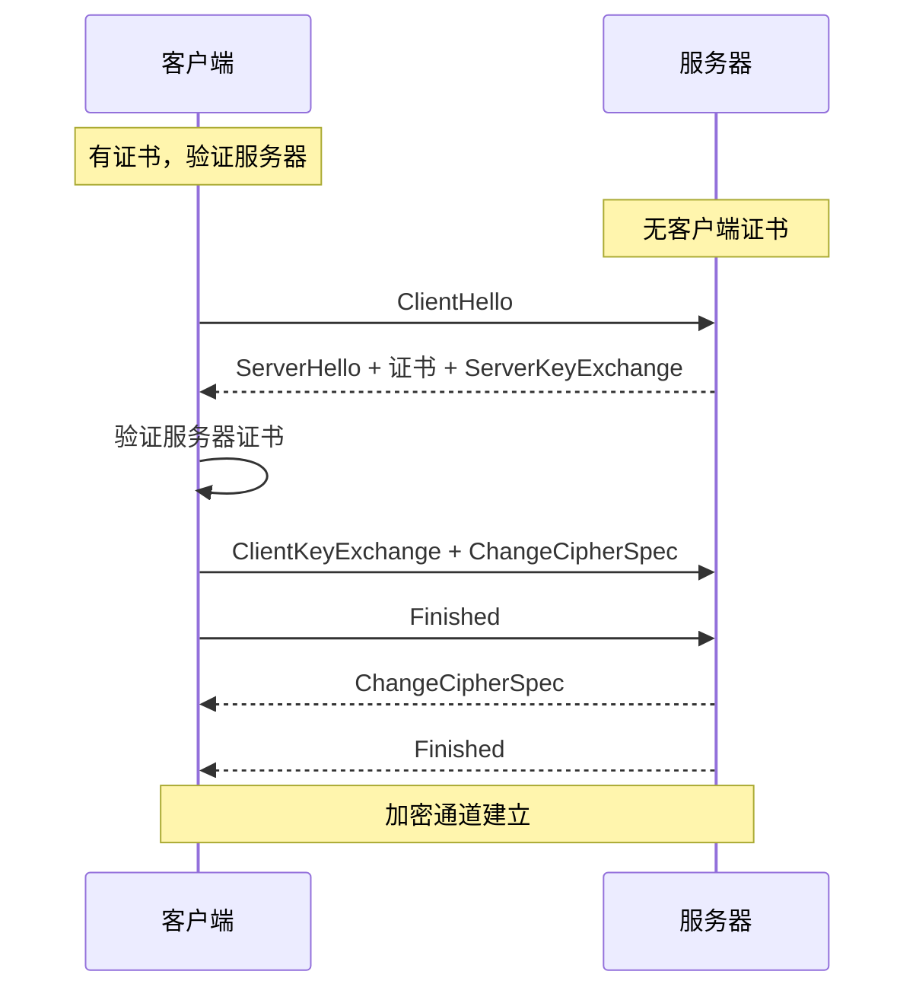
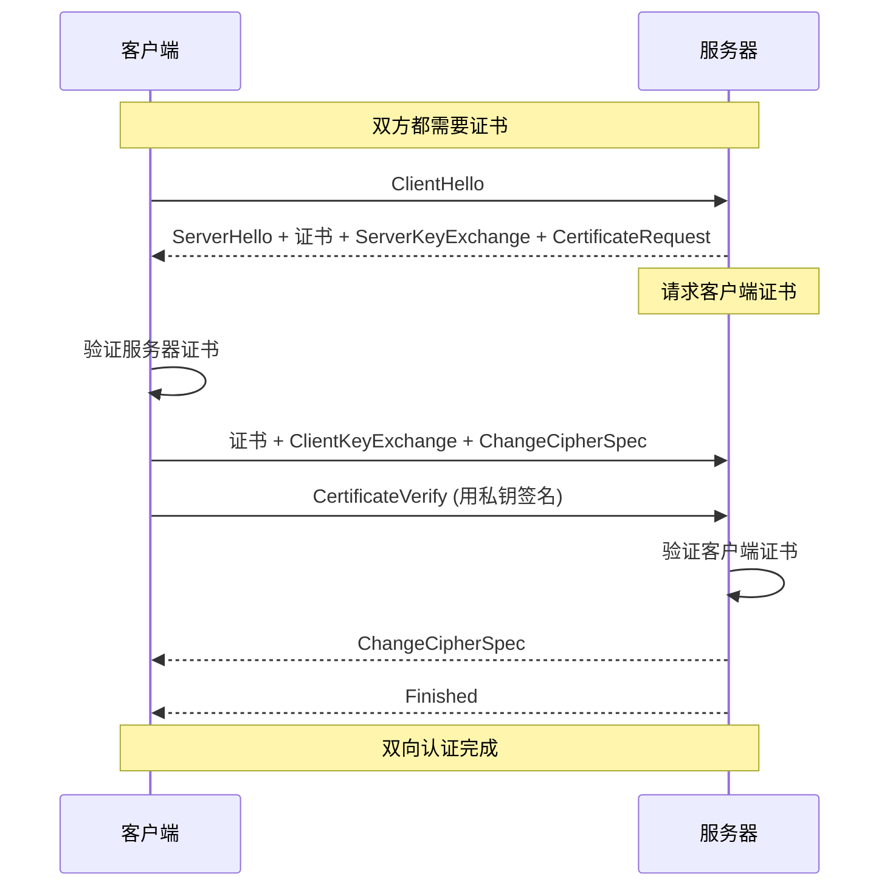
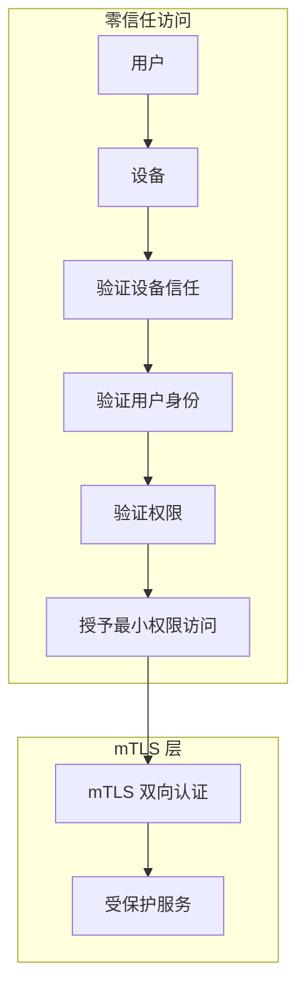
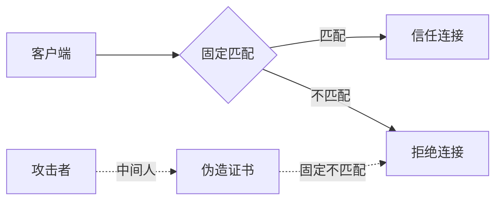

2019 年，某金融机构遭遇了一次APT攻击。攻击者通过钓鱼邮件获取了员工VPN凭证，进入了内网。然后他们在内网中横向移动，最终到达了存储客户数据的核心数据库。

这次攻击的根源在于：VPN 验证了外部人员的身份，但进入内网后，服务之间的通信没有任何身份验证。攻击者只需要能够连接，就能访问任何服务。

mTLS（双向 TLS）正是解决这个问题的方案。它确保不仅服务器的身份被验证，客户端的身份也必须被验证。

## 一、单向 TLS vs 双向 TLS

### 单向 TLS（服务端认证）

传统 TLS 是单向认证：客户端验证服务器的身份，但服务器不验证客户端的身份。



**适用场景**：
- Web 浏览（HTTPS）
- 用户访问公共 API
- 服务提供商向消费者提供服务

### 双向 TLS（客户端认证）

mTLS 在单向 TLS 基础上增加了客户端认证：服务器也验证客户端的身份。



**mTLS 增加的步骤**：
1. 服务器发送 `CertificateRequest`（请求客户端证书）
2. 客户端发送自己的证书
3. 客户端发送 `CertificateVerify`（用私钥证明拥有证书）

## 二、mTLS 的应用场景

### 服务网格

在微服务架构中，服务之间需要相互认证。mTLS 确保只有具有有效证书的服务才能相互通信。

```mermaid
flowchart LR
    subgraph 服务网格
        A[服务 A] <--mTLS--> B[服务 B]
        A <--mTLS--> C[服务 C]
        B <--mTLS--> C
        A <--mTLS--> D[服务 D]
    end
    
    A -.->|无有效证书| E[恶意服务]
    E -.x A
```

### API 安全

对于敏感的 API，mTLS 提供了比 API Key 更强的安全性：

| 维度 | API Key | mTLS |
|------|---------|------|
| 身份验证 | 静态密钥 | 动态证书 |
| 密钥分发 | 需安全通道 | PKI 自动分发 |
| 撤销能力 | 困难（依赖轮转） | 容易（CRL/OCSP） |
| 仿冒难度 | 低 | 高 |
| 设备绑定 | 否 | 是 |

### 零信任网络

零信任的核心理念是「永不信任，始终验证」。mTLS 是零信任网络的基础设施：



## 三、mTLS 握手流程详解

### TLS 1.2 mTLS 握手

```
完整握手流程：

1. ClientHello
   - 客户端支持的 TLS 版本
   - 支持的密码套件列表
   - 客户端随机数
   - SNI (Server Name Indication)
   - ALPN (Application-Layer Protocol Negotiation)

2. ServerHello
   - 选定的 TLS 版本和密码套件
   - 服务器随机数
   - 服务器证书链

3. CertificateRequest (mTLS 特有)
   - 证书类型 (rsa_sign, ecdsa_sign)
   - 支持的签名算法
   - 可接受的 CA 列表

4. ServerKeyExchange
   - ECDHE 参数（如果使用 ECDHE）

5. ServerHelloDone
   - 服务器握手完成

6. Client Certificate (mTLS 特有)
   - 客户端证书链

7. ClientKeyExchange
   - 客户端 ECDHE 公钥（或 RSA 预主密钥）

8. CertificateVerify (mTLS 特有)
   - 用客户端私钥签名的所有握手消息哈希
   - 服务器用客户端公钥验证

9. ChangeCipherSpec
   - 客户端切换到加密模式

10. Finished
    - 加密的握手摘要

11. ChangeCipherSpec (服务器)
    - 服务器切换到加密模式

12. Finished (服务器)
    - 加密的握手摘要
```

### TLS 1.3 mTLS 握手

TLS 1.3 简化了握手流程，将往返次数从 2-RTT 减少到 1-RTT：

```
TLS 1.3 mTLS 握手：

1. ClientHello
   - TLS 版本、密码套件、客户端随机数
   - 客户端证书和公钥（在 1-RTT 内发送）

2. ServerHello
   - 选定密码套件、服务器随机数
   - 服务器证书、签名、服务器公钥

3. 双方计算主密钥
   - 无需额外的握手往返

4. ChangeCipherSpec + Finished
   - 双方验证握手完整性

优势：
- 1-RTT 完成握手
- 更少的往返延迟
- 更强的安全性（废弃了不安全的密码套件）
```

## 四、Java 实现 mTLS

### 基础配置

```java title="MtlsServer.java"
import javax.net.ssl.*;
import java.security.*;
import java.security.cert.*;
import java.io.*;

public class MtlsServer {
    
    /**
     * 创建 mTLS 服务器 SSLContext
     */
    public SSLContext createServerSSLContext(
            String keyStorePath, 
            String keyStorePassword,
            String trustStorePath,
            String trustStorePassword) throws Exception {
        
        // 1. 创建 KeyManagerFactory
        KeyManagerFactory kmf = KeyManagerFactory.getInstance(
            KeyManagerFactory.getDefaultAlgorithm());
        
        KeyStore keyStore = KeyStore.getInstance("PKCS12");
        try (FileInputStream fis = new FileInputStream(keyStorePath)) {
            keyStore.load(fis, keyStorePassword.toCharArray());
        }
        kmf.init(keyStore, keyStorePassword.toCharArray());
        
        // 2. 创建 TrustManagerFactory
        TrustManagerFactory tmf = TrustManagerFactory.getInstance(
            TrustManagerFactory.getDefaultAlgorithm());
        
        KeyStore trustStore = KeyStore.getInstance("PKCS12");
        try (FileInputStream fis = new FileInputStream(trustStorePath)) {
            trustStore.load(fis, trustStorePassword.toCharArray());
        }
        tmf.init(trustStore);
        
        // 3. 创建 SSLContext
        SSLContext sslContext = SSLContext.getInstance("TLSv1.3");
        sslContext.init(kmf.getKeyManagers(), tmf.getTrustManagers(), 
            new SecureRandom());
        
        return sslContext;
    }
    
    /**
     * 创建 mTLS HttpsURLConnection
     */
    public HttpsURLConnection createMtlsConnection(String url) throws Exception {
        SSLContext sslContext = createServerSSLContext(...);
        
        URL connectionUrl = new URL(url);
        HttpsURLConnection conn = (HttpsURLConnection) connectionUrl.openConnection();
        
        // 设置 SSL Socket Factory
        conn.setSSLSocketFactory(sslContext.getSocketFactory());
        
        // 启用客户端认证
        // （通过 SSLContext 配置自动完成）
        
        return conn;
    }
}
```

### 客户端证书认证

```java title="MtlsClient.java"
import javax.net.ssl.*;
import java.security.cert.*;
import java.security.*;
import java.net.*;

public class MtlsClient {
    
    /**
     * 创建 mTLS 客户端 SSLContext
     */
    public SSLContext createClientSSLContext(
            String clientKeyStorePath,
            String clientKeyPassword,
            String trustStorePath,
            String trustStorePassword) throws Exception {
        
        // 1. 加载客户端证书（用于认证）
        KeyManagerFactory kmf = KeyManagerFactory.getInstance("NewSunX509");
        KeyStore clientKeyStore = KeyStore.getInstance("PKCS12");
        try (FileInputStream fis = new FileInputStream(clientKeyStorePath)) {
            clientKeyStore.load(fis, clientKeyPassword.toCharArray());
        }
        kmf.init(clientKeyStore, clientKeyPassword.toCharArray());
        
        // 2. 加载受信任的 CA 证书（用于验证服务器）
        TrustManagerFactory tmf = TrustManagerFactory.getInstance(
            TrustManagerFactory.getDefaultAlgorithm());
        KeyStore trustStore = KeyStore.getInstance("PKCS12");
        try (FileInputStream fis = new FileInputStream(trustStorePath)) {
            trustStore.load(fis, trustStorePassword.toCharArray());
        }
        tmf.init(trustStore);
        
        // 3. 初始化 SSLContext
        SSLContext sslContext = SSLContext.getInstance("TLSv1.3");
        sslContext.init(kmf.getKeyManagers(), tmf.getTrustManagers(), null);
        
        return sslContext;
    }
    
    /**
     * 自定义 TrustManager（验证客户端证书）
     */
    public X509TrustManager createCustomTrustManager(
            X509Certificate... acceptedIssuers) {
        
        return new X509TrustManager() {
            
            @Override
            public void checkClientTrusted(X509Certificate[] chain, 
                    String authType) throws CertificateException {
                
                // 1. 验证证书链
                // 2. 验证证书有效期
                // 3. 验证证书用途
                // 4. 可选：检查吊销状态
                
                for (X509Certificate cert : chain) {
                    // 检查证书是否在有效期内
                    cert.checkValidity();
                    
                    // 检查证书是否由受信任的 CA 签发
                    // X500Principal issuer = cert.getIssuerX500Principal();
                    // ...
                }
            }
            
            @Override
            public void checkServerTrusted(X509Certificate[] chain, 
                    String authType) throws CertificateException {
                // 标准服务器证书验证
            }
            
            @Override
            public X509Certificate[] getAcceptedIssuers() {
                return acceptedIssuers;
            }
        };
    }
}
```

## 五、Spring Boot 配置 mTLS

### 服务器端配置

```java title="MtlsServerConfig.java"
@Configuration
public class MtlsServerConfig {
    
    @Value("${server.ssl.key-store}")
    private String keyStorePath;
    
    @Value("${server.ssl.key-store-password}")
    private String keyStorePassword;
    
    @Value("${server.ssl.trust-store}")
    private String trustStorePath;
    
    @Value("${server.ssl.trust-store-password}")
    private String trustStorePassword;
    
    /**
     * 配置双向 TLS
     */
    @Bean
    public SSLContext sslContext() throws Exception {
        // 服务器密钥库（包含服务器证书和私钥）
        KeyStore serverKeyStore = KeyStore.getInstance("PKCS12");
        serverKeyStore.load(
            new FileInputStream(keyStorePath), 
            keyStorePassword.toCharArray()
        );
        
        // 服务器密钥管理器
        KeyManagerFactory kmf = KeyManagerFactory.getInstance(
            KeyManagerFactory.getDefaultAlgorithm());
        kmf.init(serverKeyStore, keyStorePassword.toCharArray());
        
        // 客户端信任库（包含受信任的客户端 CA）
        KeyStore trustStore = KeyStore.getInstance("PKCS12");
        trustStore.load(
            new FileInputStream(trustStorePath), 
            trustStorePassword.toCharArray()
        );
        
        TrustManagerFactory tmf = TrustManagerFactory.getInstance(
            TrustManagerFactory.getDefaultAlgorithm());
        tmf.init(trustStore);
        
        // 创建 SSLContext
        SSLContext sslContext = SSLContext.getInstance("TLSv1.3");
        sslContext.init(kmf.getKeyManagers(), tmf.getTrustManagers(), null);
        
        return sslContext;
    }
    
    @Bean
    public ServletWebServerFactory servletContainer() throws Exception {
        TomcatServletWebServerFactory factory = 
            new TomcatServletWebServerFactory();
        
        factory.setProtocol("org.apache.coyote.http11.Http11NioProtocol");
        factory.setSsl(sslContextProperties());
        
        return factory;
    }
    
    private Ssl sslContextProperties() {
        Ssl ssl = new Ssl();
        ssl.setEnabled(true);
        ssl.setKeyStore(keyStorePath);
        ssl.setKeyStorePassword(keyStorePassword);
        ssl.setTrustStore(trustStorePath);
        ssl.setTrustStorePassword(trustStorePassword);
        
        // 强制客户端认证
        ssl.setClientAuth(ClientAuth.NEED);
        
        // TLS 版本配置
        ssl.setEnabledProtocols(new String[]{"TLSv1.3", "TLSv1.2"});
        
        // 密码套件配置
        ssl.setCiphers(new String[]{
            "TLS_AES_256_GCM_SHA384",
            "TLS_AES_128_GCM_SHA256",
            "TLS_ECDHE_RSA_WITH_AES_256_GCM_SHA384"
        });
        
        return ssl;
    }
}
```

### 获取客户端证书信息

```java title="ClientCertificateController.java"
@RestController
@RequestMapping("/api")
public class ClientCertificateController {
    
    /**
     * 获取客户端证书信息
     * 用于业务逻辑中识别调用方
     */
    @GetMapping("/client-info")
    public ClientInfo getClientInfo(HttpServletRequest request) {
        
        X509Certificate[] clientCerts = 
            (X509Certificate[]) request.getAttribute(
                "jakarta.servlet.request.X509Certificate");
        
        if (clientCerts == null || clientCerts.length == 0) {
            throw new SecurityException("客户端证书未提供");
        }
        
        X509Certificate clientCert = clientCerts[0];
        
        return ClientInfo.builder()
            .subject(clientCert.getSubjectX500Principal().getName())
            .issuer(clientCert.getIssuerX500Principal().getName())
            .serialNumber(clientCert.getSerialNumber().toString())
            .validFrom(clientCert.getNotBefore())
            .validTo(clientCert.getNotAfter())
            .fingerprint(sha256Fingerprint(clientCert))
            .build();
    }
    
    /**
     * 验证客户端证书特定字段
     */
    @PostMapping("/secure-action")
    public ResponseEntity<?> secureAction(
            HttpServletRequest request,
            @RequestBody ActionRequest actionRequest) {
        
        X509Certificate[] clientCerts = 
            (X509Certificate[]) request.getAttribute(
                "jakarta.servlet.request.X509Certificate");
        
        X509Certificate clientCert = clientCerts[0];
        
        // 1. 验证证书序列号在白名单中
        if (!isCertificateAllowed(clientCert.getSerialNumber().toString())) {
            return ResponseEntity.status(HttpStatus.FORBIDDEN)
                .body("证书未授权");
        }
        
        // 2. 验证证书包含特定扩展（如 OID）
        if (!hasRequiredExtension(clientCert)) {
            return ResponseEntity.status(HttpStatus.FORBIDDEN)
                .body("证书缺少必要扩展");
        }
        
        // 3. 提取调用方身份
        String callerId = extractCallerId(clientCert);
        
        // 4. 执行业务逻辑
        return executeAction(callerId, actionRequest);
    }
    
    private String sha256Fingerprint(X509Certificate cert) {
        try {
            MessageDigest md = MessageDigest.getInstance("SHA-256");
            byte[] digest = md.digest(cert.getEncoded());
            return Base64.getEncoder().encodeToString(digest);
        } catch (Exception e) {
            throw new RuntimeException("计算证书指纹失败", e);
        }
    }
}
```

## 六、证书固定

### 证书固定的原理

证书固定（Certificate Pinning）将服务器的证书或公钥嵌入客户端，防止中间人攻击和 CA 被攻破的风险：



### Java 实现证书固定

```java title="PinnedCertificateTrustManager.java"
public class PinnedCertificateTrustManager implements X509TrustManager {
    
    private final Set<String> pinnedPublicKeyHashes;
    private final X509TrustManager defaultTrustManager;
    
    public PinnedCertificateTrustManager(
            List<String> pinnedPublicKeyHashes,
            X509TrustManager defaultTrustManager) {
        this.pinnedPublicKeyHashes = new HashSet<>(pinnedPublicKeyHashes);
        this.defaultTrustManager = defaultTrustManager;
    }
    
    @Override
    public void checkServerTrusted(X509Certificate[] chain, String authType) 
            throws CertificateException {
        
        if (chain.length == 0) {
            throw new CertificateException("证书链为空");
        }
        
        // 1. 首先验证证书链的标准有效性
        defaultTrustManager.checkServerTrusted(chain, authType);
        
        // 2. 提取叶证书的公钥
        X509Certificate leafCert = chain[0];
        PublicKey publicKey = leafCert.getPublicKey();
        String publicKeyHash = sha256Base64(publicKey.getEncoded());
        
        // 3. 检查是否与固定值匹配
        if (!pinnedPublicKeyHashes.contains(publicKeyHash)) {
            // 固定不匹配，可能是中间人攻击
            throw new CertificateException(
                "服务器证书公钥与固定值不匹配，可能存在中间人攻击");
        }
    }
    
    @Override
    public void checkClientTrusted(X509Certificate[] chain, String authType) 
            throws CertificateException {
        defaultTrustManager.checkClientTrusted(chain, authType);
    }
    
    @Override
    public X509Certificate[] getAcceptedIssuers() {
        return defaultTrustManager.getAcceptedIssuers();
    }
    
    /**
     * 计算公钥的 SHA-256 哈希（Base64 编码）
     */
    private String sha256Base64(byte[] data) {
        try {
            MessageDigest digest = MessageDigest.getInstance("SHA-256");
            byte[] hash = digest.digest(data);
            return Base64.getEncoder().encodeToString(hash);
        } catch (NoSuchAlgorithmException e) {
            throw new RuntimeException("SHA-256 算法不可用", e);
        }
    }
}
```

### 固定值的安全存储

```java title="PinnedKeyManager.java"
@Service
@Slf4j
public class PinnedKeyManager {
    
    /**
     * 从配置文件加载固定值
     */
    @PostConstruct
    public void loadPinnedKeys() {
        String pinnedKeysConfig = environment.getProperty("security.pinned.keys");
        if (pinnedKeysConfig == null) {
            throw new IllegalStateException("未配置证书固定值");
        }
        
        // 解析固定值列表
        // 格式：公钥哈希，用逗号分隔
        String[] hashes = pinnedKeysConfig.split(",");
        for (String hash : hashes) {
            pinnedPublicKeyHashes.add(hash.trim());
        }
        
        log.info("已加载 {} 个证书固定值", pinnedPublicKeyHashes.size());
    }
    
    /**
     * 动态更新固定值（支持证书轮转）
     */
    public void updatePinnedKeys(List<String> newHashes) {
        log.info("更新证书固定值: {} -> {}", pinnedPublicKeyHashes, newHashes);
        pinnedPublicKeyHashes.clear();
        pinnedPublicKeyHashes.addAll(newHashes);
    }
}
```

## 七、mTLS 性能优化

### 性能开销分析

mTLS 相比单向 TLS 的额外开销：

| 阶段 | 单向 TLS | mTLS | 额外开销 |
|------|----------|------|----------|
| 握手往返 | 1-RTT (TLS 1.3) | 1-RTT (TLS 1.3) | 无 |
| 握手数据 | ~4KB | ~8KB | 2x |
| CPU 计算 | ~5ms | ~10ms | 2x |
| 证书验证 | ~1ms | ~2ms | 2x |
| 连接建立 | ~15ms | ~20ms | 5ms |

### 优化策略

**1. 会话恢复**

```java title="MtlsSessionResumption.java"
@Configuration
public class MtlsSessionResumptionConfig {
    
    @Bean
    public SSLContext sslContext() throws Exception {
        // 配置会话恢复
        SSLContext sslContext = SSLContext.getInstance("TLSv1.3");
        
        // 设置会话缓存
        SSLSessionContext serverSessionContext = 
            sslContext.getServerSessionContext();
        serverSessionContext.setSessionCacheSize(10000);  // 缓存 10000 个会话
        serverSessionContext.setSessionTimeout(3600);   // 1 小时过期
        
        // 配置会话票据（0-RTT 恢复）
        // TLS 1.3 PSK 模式
        sslContext.init(...);
        
        return sslContext;
    }
}
```

**2. 证书缓存**

```java title="CertificateCache.java"
@Service
@Slf4j
public class CertificateCacheService {
    
    private LoadingCache<String, X509Certificate> certCache;
    private LoadingCache<String, PublicKey> publicKeyCache;
    
    @PostConstruct
    public void initCaches() {
        // 证书缓存
        certCache = Caffeine.newBuilder()
            .maximumSize(1000)
            .expireAfterWrite(Duration.ofMinutes(10))
            .build(cert -> loadCertificate(cert));
        
        // 公钥缓存
        publicKeyCache = Caffeine.newBuilder()
            .maximumSize(1000)
            .expireAfterWrite(Duration.ofMinutes(10))
            .build(key -> loadPublicKey(key));
    }
    
    /**
     * 获取证书（带缓存）
     */
    public X509Certificate getCertificate(String serialNumber) {
        return certCache.get(serialNumber, this::loadCertificate);
    }
}
```

**3. OCSP Stapling**

```java title="OcspStaplingConfig.java"
/**
 * 启用 OCSP Stapling 减少吊销检查延迟
 * 服务器在 TLS 握手时直接提供证书状态
 */
// Nginx 配置
// ssl_stapling on;
// ssl_stapling_verify on;
// ssl_trusted_certificate /path/to/ca.crt;
```

## 八、Istio 服务网格中的 mTLS

### Istio mTLS 配置

```yaml title="istio-mtls-policy.yaml"
# 全局 mTLS 模式
apiVersion: security.istio.io/v1beta1
kind: PeerAuthentication
metadata:
  name: default
  namespace: istio-system
spec:
  mtls:
    mode: STRICT  # 强制 mTLS，不允许明文流量
---
# 特定命名空间的 mTLS
apiVersion: security.istio.io/v1beta1
kind: PeerAuthentication
metadata:
  name: default
  namespace: production
spec:
  mtls:
    mode: STRICT
---
# 特定工作负载的 mTLS
apiVersion: security.istio.io/v1beta1
kind: PeerAuthentication
metadata:
  name: frontend-only-mtls
  namespace: production
spec:
  selector:
    matchLabels:
      app: frontend
  mtls:
    mode: STRICT
```

### 目标规则配置

```yaml title="istio-destination-rule.yaml"
apiVersion: networking.istio.io/v1beta1
kind: DestinationRule
metadata:
  name: reviews
  namespace: production
spec:
  host: reviews
  trafficPolicy:
    tls:
      mode: ISTIO_MUTUAL  # 使用 Istio 管理的证书
    portLevelSettings:
    - port:
        number: 8080
      tls:
        mode: SIMPLE  # 某些服务只需要单向 TLS
```

### 验证 mTLS 配置

```bash
# 检查命名空间 mTLS 状态
istioctl authn tls-check <pod-name> -n <namespace>

# 示例输出：
# HOST:PORT                  POLICY           RESULT
# details:8080               STRICT           OK
# ratings:7080              STRICT           OK

# 检查服务间 mTLS
istioctl x authz check <pod-name>
```

---

## 思考题

**问题 1**：在微服务架构中实施 mTLS 时，需要考虑哪些关键的设计决策？假设你的系统有 500 个微服务，每月会有 20% 的服务版本更新。请分析证书管理、服务发现和故障处理的设计方案。

<details>
<summary>参考答案</summary>

**关键设计决策分析**：

```
1. 证书管理方案选择
   ┌─────────────────────────────────────────┐
   │ 方案对比                                 │
   ├─────────────────────────────────────────┤
   │ 方案 A：每个服务独立 CA                  │
   │ - 优点：完全隔离，单点风险低             │
   │ - 缺点：管理复杂，500 个 CA             │
   │ - 适用：极高安全要求                    │
   ├─────────────────────────────────────────┤
   │ 方案 B：共享 Issuing CA（推荐）          │
   │ - 优点：管理简单，运维成本低            │
   │ - 缺点：CA 被攻破影响所有服务           │
   │ - 适用：大多数场景                     │
   └─────────────────────────────────────────┘

2. 证书生命周期
   - TTL 设置：24 小时（平衡安全和运维）
   - 轮转时机：TTL 的 2/3 时开始轮转
   - 轮转方式：热更新，不影响连接

3. 服务身份设计
   - 使用 SPIFFE ID 标准化身份
   - 格式：spiffe://cluster.local/ns/production/sa/service-name
   - 便于跨集群信任
```

**证书管理架构**：

```java title="MicroserviceMtlsManager.java"
@Service
@Slf4j
public class MicroserviceMtlsManager {
    
    /**
     * 服务启动时的证书初始化
     */
    public void bootstrapService(ServiceContext context) {
        // 1. 获取服务 SPIFFE ID
        SpiffeId serviceId = SpiffeId.builder()
            .trustDomain("cluster.local")
            .namespace(context.getNamespace())
            .serviceAccount(context.getServiceAccount())
            .build();
        
        // 2. 从 SPIRE（SPIFFE Runtime Environment）获取证书
        // SPIRE 负责：
        // - workload attestation（验证服务身份）
        // - 证书签发
        // - 证书轮转
        
        SvidResponse svid = spireClient.getSvid(serviceId);
        
        // 3. 配置 Envoy 代理
        configureEnvoy(svid);
        
        // 4. 注册健康检查
        registerHealthCheck(svid);
    }
    
    /**
     * 证书轮转（无停机）
     */
    public void rotateCertificate(ServiceIdentity identity) {
        // 1. SPIRE 签发新证书
        SvidResponse newSvid = spireClient.renewSvid(identity.getSpiffeId());
        
        // 2. 原子性更新证书
        atomicCertificateUpdate(identity.getServiceId(), newSvid);
        
        // 3. 等待连接优雅切换
        waitForConnectionDrain();
        
        // 4. 旧证书过期
        scheduleCertificateExpiry(identity);
    }
}
```

**故障处理设计**：

```
┌─────────────────────────────────────────────────────────────────┐
│                       mTLS 故障处理策略                          │
├─────────────────────────────────────────────────────────────────┤
│                                                                 │
│  1. 证书过期处理                                                │
│     - 证书过期前 24 小时开始告警                                 │
│     - 证书过期前 1 小时触发紧急轮转                              │
│     - 证书过期后：                                              │
│       - 服务拒绝新连接                                          │
│       - 允许已有连接继续（grace period）                        │
│       - grace period 后服务退出                                 │
│                                                                 │
│  2. CA 不可用处理                                              │
│     - 本地缓存证书（TTL + buffer）                             │
│     - 服务可以使用缓存证书继续运行                              │
│     - 记录错误，触发告警                                        │
│                                                                 │
│  3. 网络分区处理                                               │
│     - 服务可以使用缓存证书处理请求                              │
│     - 拒绝新连接（mTLS 无法验证对方）                           │
│     - 使用单向 TLS 作为降级方案                                 │
│                                                                 │
│  4. 证书吊销响应                                               │
│     - 实时 CRL/OCSP 更新                                       │
│     - 被吊销证书的连接立即断开                                  │
│     - 通知相关服务                                              │
│                                                                 │
└─────────────────────────────────────────────────────────────────┘
```

</details>

**问题 2**：解释 mTLS 和 OAuth 2.0/OIDC 在 API 认证中的角色差异。在什么场景下应该选择 mTLS？在什么场景下应该选择 OAuth 2.0？请分析混合使用两种技术的方案。

<details>
<summary>参考答案</summary>

**mTLS vs OAuth 2.0 角色差异**：

```
┌─────────────────────────────────────────────────────────────────┐
│                        认证层对比                                 │
├─────────────────────────────────────────────────────────────────┤
│                                                                 │
│  mTLS（传输层）                                                │
│  ┌─────────────────────────────────────────────────────────┐   │
│  │ 验证的是：「这个连接的来源是谁？」                        │   │
│  │                                                            │   │
│  │ 身份绑定：证书 → 设备/服务                                │   │
│  │ 验证方式：公钥密码学（私钥签名）                          │   │
│  │ 生命周期：证书有效期（通常数小时到数天）                  │   │
│  │ 适用：服务间、设备间、高安全场景                         │   │
│  └─────────────────────────────────────────────────────────┘   │
│                                                                 │
│  OAuth 2.0（应用层）                                           │
│  ┌─────────────────────────────────────────────────────────┐   │
│  │ 验证的是：「这个请求代表谁？有什么权限？」                │   │
│  │                                                            │   │
│  │ 身份绑定：Token → 用户/应用                               │   │
│  │ 验证方式：Token 验证（JWT 签名或 Introspection）         │   │
│  │ 生命周期：Token 有效期（通常分钟级）                    │   │
│  │ 适用：用户认证、细粒度授权、第三方访问                  │   │
│  └─────────────────────────────────────────────────────────┘   │
│                                                                 │
└─────────────────────────────────────────────────────────────────┘
```

**场景选择矩阵**：

| 场景 | mTLS | OAuth 2.0 | 说明 |
|------|------|-----------|------|
| 服务网格内部通信 | **首选** | 不用 | mTLS 更简单、更快 |
| 移动 App 调用 API | 可选 | **首选** | OAuth 有更好的用户体验 |
| IoT 设备认证 | **首选** | 可选 | 设备证书天然适合 mTLS |
| 微服务间 API | **首选** | 可选 | mTLS + 服务标识 |
| 用户登录 Web 应用 | 不用 | **首选** | OAuth/OIDC 更适合 |
| 第三方 API 访问 | 可选 | **首选** | OAuth 授权码流程 |
| 高安全金融交易 | **首选** | 可选 | 双重验证 |
| CI/CD 流水线 | **首选** | 可选 | 服务账号证书 |

**mTLS 优势场景**：

```
为什么服务间通信首选 mTLS：

1. 零信任网络的核心
   - 不依赖网络位置判断信任
   - 每个请求都验证身份
   - 无法伪造证书身份

2. 自动化友好
   - 证书自动分发和轮转（SPIRE）
   - 无需管理 OAuth 客户端密钥
   - 无需处理 Token 刷新

3. 性能优势
   - 握手后无需 Token 验证
   - 证书验证由 TLS 层完成
   - 减少应用层开销

4. 服务网格原生支持
   - Istio/Linkerd 内置 mTLS
   - 应用无感知
   - 配置简单
```

**OAuth 2.0 优势场景**：

```
为什么用户/应用认证首选 OAuth：

1. 用户体验
   - SSO（单点登录）
   - 社交登录（Google/GitHub）
   - 无需管理密码

2. 细粒度授权
   - Scope 控制权限范围
   - Claims 携带用户信息
   - 资源所有者授权

3. 第三方集成
   - 授权码流程
   - Token 撤销
   - 作用域限制

4. 审计和合规
   - Token 包含用户身份
   - 易于日志记录
   - 符合监管要求
```

**混合使用方案**：

```
┌─────────────────────────────────────────────────────────────────┐
│                    mTLS + OAuth 混合架构                         │
├─────────────────────────────────────────────────────────────────┤
│                                                                 │
│  外层：mTLS（服务/设备身份）                                     │
│  └─ 验证：「这个连接来自哪台设备/哪个服务？」                   │
│                                                                 │
│  内层：OAuth 2.0（用户/应用身份）                                │
│  └─ 验证：「这个请求代表哪个用户？有什么权限？」                 │
│                                                                 │
│  ┌─────────────────────────────────────────────────────────┐   │
│  │ 示例：内部 API 访问                                      │   │
│  │                                                          │   │
│  │ 1. 服务 A 用 mTLS 证书连接 API 网关                    │   │
│  │ 2. API 网关验证服务 A 的 mTLS 证书                     │   │
│  │ 3. 服务 A 在请求中携带 OAuth Access Token              │   │
│  │ 4. API 网关验证 OAuth Token（用户身份 + 权限）         │   │
│  │ 5. 组合身份：服务 A + 用户 Bob + write 权限           │   │
│  └─────────────────────────────────────────────────────────┘   │
│                                                                 │
└─────────────────────────────────────────────────────────────────┘
```

```java title="MtlsOAuthHybridController.java"
@RestController
@RequestMapping("/api")
public class MtlsOAuthHybridController {
    
    /**
     * 双重认证端点
     * 
     * 1. mTLS 验证：确认请求来自授权服务
     * 2. OAuth 验证：确认用户身份和权限
     */
    @PostMapping("/sensitive-operation")
    public ResponseEntity<?> sensitiveOperation(
            // mTLS 证书信息（由 servlet container 提供）
            @RequestAttribute("javax.servlet.request.X509Certificate") 
            X509Certificate[] clientCerts,
            
            // OAuth Token 信息（由 OAuth 过滤器提供）
            @AuthenticationPrincipal OAuth2AuthenticatedPrincipal principal,
            
            @RequestBody OperationRequest request) {
        
        // 1. 验证 mTLS 证书
        String serviceId = extractServiceId(clientCerts[0]);
        if (!isAuthorizedService(serviceId)) {
            return ResponseEntity.status(HttpStatus.FORBIDDEN)
                .body("服务未授权");
        }
        
        // 2. 验证 OAuth Token 和权限
        if (!principal.getAuthorities().contains(new SimpleGrantedAuthority("SCOPE_write"))) {
            return ResponseEntity.status(HttpStatus.FORBIDDEN)
                .body("权限不足");
        }
        
        // 3. 组合身份进行审计
        auditLog.log("sensitive_operation", 
            Map.of(
                "service", serviceId,
                "user", principal.getName(),
                "action", request.getAction()
            ));
        
        // 4. 执行操作
        return executeOperation(serviceId, principal.getName(), request);
    }
}
```

**最佳实践总结**：

```
┌─────────────────────────────────────────────────────────────────┐
│                       选择决策树                                  │
├─────────────────────────────────────────────────────────────────┤
│                                                                 │
│  请求来自哪里？                                                 │
│  │                                                               │
│  ├─ 另一个内部服务 ──► 使用 mTLS                               │
│  │                                                               │
│  ├─ 移动/Web 客户端 ──► 使用 OAuth 2.0                         │
│  │                                                               │
│  ├─ IoT 设备 ──► 使用 mTLS（设备证书）                         │
│  │                                                               │
│  └─ 第三方系统 ──► 使用 OAuth 2.0（授权码流程）                 │
│                                                                 │
│  ─────────────────────────────────────────────────────────────  │
│                                                                 │
│  特殊场景：同时需要两层认证？                                    │
│                                                                 │
│  高安全场景：                                                    │
│  ┌─────────────────────────────────────────────────────────┐   │
│  │ mTLS（服务身份） + OAuth（用户身份）                     │   │
│  │                                                          │   │
│  │ 示例：内部系统的高敏感操作                               │   │
│  │ - 财务系统：需要服务认证 + 审批人认证                    │   │
│  │ - 运维系统：需要服务认证 + 管理员认证                   │   │
│  └─────────────────────────────────────────────────────────┘   │
│                                                                 │
└─────────────────────────────────────────────────────────────────┘
```

</details>
