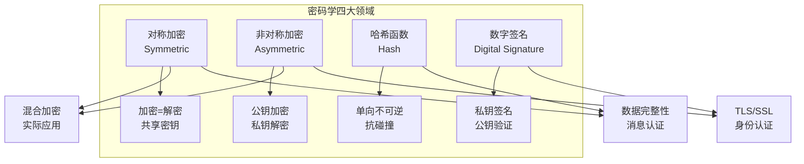
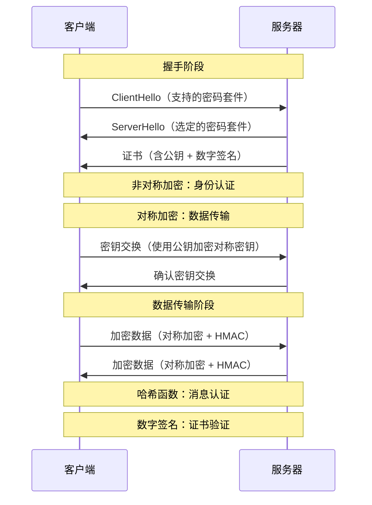

凌晨 2 点，某大型电商平台的数据库被拖库。攻击者拿到了完整的用户表，包括密码哈希。三个月后，用户的信用卡信息开始在暗网流通。

这不是电影情节。2013 年的 Target 超市数据泄露、2017 年的 Uber 数据泄露、2019 年的 Facebook 超 5 亿用户数据泄露——这些事件的共同点是：**攻击者拿到数据后，密码学成为了最后一道防线**。

密码学不是万能的，但没有密码学是万万不能的。

## 密码学在安全体系中的地位

密码学是信息安全的基石。现代信息安全体系可以比作一座城堡：

| 层级 | 技术 | 作用 |
|------|------|------|
| 边界层 | 防火墙、WAF、IDS/IPS | 阻止外部攻击 |
| 身份层 | IAM、MFA、SSO | 验证身份 |
| **密码学层** | **加密、签名、PKI** | **保护数据的机密性和完整性** |
| 应用层 | 输入验证、输出编码 | 防止注入攻击 |
| 审计层 | 日志、监控、SIEM | 发现和追踪攻击 |

密码学之所以位于核心层，是因为它保护的是**数据的本质**——无论攻击者如何突破其他防线，只要数据被正确加密，攻击者拿到的也只是密文，无法直接使用。

## 密码学的四大领域

现代密码学可以划分为四个核心领域：

### 1. 对称加密（Symmetric Encryption）

加密和解密使用**相同的密钥**。特点是速度快、效率高，适合加密大量数据。代表算法：AES、ChaCha20。

**核心问题**：密钥如何安全地传递给接收方？（密钥分发问题）

### 2. 非对称加密（Asymmetric Encryption）

加密和解密使用**不同的密钥**——公钥和私钥。公钥可以公开，私钥必须保密。代表算法：RSA、ECC。

**核心优势**：解决了密钥分发问题。可以用公钥加密、私钥解密，也可以反过来（用于签名）。

### 3. 哈希函数（Hash Function）

将任意长度的输入转换为固定长度的输出（摘要）。特点是**单向不可逆**，无法从摘要还原原始数据。代表算法：SHA-256、SM3、Bcrypt。

**核心作用**：验证数据完整性、密码存储。

### 4. 数字签名（Digital Signature）

使用私钥对消息进行签名，任何拥有公钥的人都可以验证签名是否有效。代表算法：RSA 签名、ECDSA。

**核心作用**：身份认证、不可否认性、完整性保护。

## 密码学的历史演进

### 古典密码学（古代 ~ 1949）

古典密码学的核心特征是**算法即秘密**。

| 密码 | 原理 | 破解方法 |
|------|------|----------|
| 凯撒密码 | 字母平移 | 频率分析 |
| 维吉尼亚密码 | 多表替换 | 卡西斯基试验 |
| Enigma 机 | 机械转子 | 波兰密码学家突破 |

这些密码的共同问题是：一旦算法泄露，所有使用该算法的通信都变得不安全。

### 近代密码学（1949 ~ 1976）

1949 年，香农发表《保密系统的通信理论》，将密码学建立在数学基础之上。这一时期的代表是 **DES（Data Encryption Standard）**，1977 年成为美国联邦标准。

但 DES 的密钥长度只有 56 位，随着计算能力提升，已被暴力破解。

### 现代密码学（1976 至今）

1976 年，Diffie 和 Hellman 发表了《密码学的新方向》，提出了**公钥密码学**的概念，解决了密钥分发的核心问题。这是密码学史上的最重要里程碑。

同年，Kerckhoffs 原则被重新强调，成为现代密码学设计的核心原则。

## Kerckhoffs 原则

1883 年，荷兰密码学家 Auguste Kerckhoffs 提出了一个原则：

> ** cryptosystem should be secure even if everything about the system, except the key, is public knowledge.**

翻译：一个密码系统的安全性应该只依赖于密钥的保密性，而不是算法的保密性。

### 为什么这个原则如此重要？

| 原则 | 好处 |
|------|------|
| 算法公开 | 全世界的密码学家可以审查、寻找漏洞 |
| 密钥保密 | 即使算法被完全了解，只要密钥安全，系统仍然安全 |
| 便于标准化 | AES、SSL/TLS 等标准得以广泛采用 |
| 密钥可更换 | 发现漏洞时，只需更换密钥，不需要更换整个系统 |

这个原则的另一个含义是：**密钥是安全的关键，必须妥善保护**。这直接催生了 HSM（硬件安全模块）和 KMS（密钥管理系统）这些基础设施。

:::warning
实际开发中的反面案例：某公司使用自定义加密算法，并对算法保密。结果是算法被逆向工程破解后，所有历史数据全部泄露——因为密钥管理和算法保密都失败了。
:::

## 密码学的基本假设

现代密码学的安全性建立在几个公认的计算复杂度假设上：

| 假设 | 问题 | 应用 |
|------|------|------|
| **大数分解问题** | 给定两个大素数乘积 n，很难分解出 p 和 q | RSA |
| **离散对数问题（DLP）** | 给定 g、p、g^x mod p，很难求出 x | DSA、DH |
| **椭圆曲线离散对数问题（ECDLP）** | 椭圆曲线上的离散对数问题更难 | ECDSA、ECDH |
| **哈希碰撞阻力** | 很难找到两个不同的输入有相同哈希输出 | SHA-256 |

这些问题的「难」是**计算意义上**的难——在经典计算机上，解决这些问题的时间复杂度是指数级的。

但量子计算正在改变这一假设。

## 现代密码学与古典密码学的区别

| 维度 | 古典密码学 | 现代密码学 |
|------|-----------|-----------|
| **安全性来源** | 算法保密 | 密钥保密 + 数学假设 |
| **设计方法** | 经验、隐藏 | 严格数学证明、可证明安全 |
| **攻击模型** | 仅考虑密文攻击 | 已知明文、选择明文、选择密文攻击 |
| **标准程度** | 各自为政 | AES、RSA 等国际标准 |
| **应用范围** | 军事、外交 | 互联网、电子商务、金融 |

现代密码学还引入了几个重要概念：

**可证明安全性（Provable Security）**：密码方案的安全性可以通过数学证明与某个已知难题联系起来。例如，「如果有人能破解这个加密方案，就意味着他能解决大数分解问题」。

**计算安全性（Computational Security）**：在有限的计算资源下，破解密码需要的时间足够长（如 10^30 年），以至于实际上不可行。

## 密码学在 TLS 中的综合应用

TLS（Transport Layer Security）是密码学四大领域的综合应用典范：

在这个过程中：

- **非对称加密**用于密钥交换
- **对称加密**用于加密实际数据
- **哈希函数**用于消息认证（HMAC）
- **数字签名**用于验证服务器证书

## 思考题

**问题 1**：如果一个攻击者能够物理访问服务器的内存，他可能绕过哪些密码学保护措施？硬件级别的保护（如 HSM）如何应对这种威胁？

参考答案

物理访问带来的威胁：

1. **内存中的密钥**：即使加密存储，运行时密钥仍在内存中。Cold Boot 攻击可以通过冷却内存后读取残留数据。
2. **未加密的数据**：内存中的明文数据直接可见。
3. **密钥在 swap 文件中的残留**：系统将内存页换出时可能包含密钥。

HSM 的应对措施：

1. 密钥永不离开 HSM：所有加密操作在 HSM 内部完成，只返回结果。
2. 防篡改硬件：HSM 有物理防篡改机制，被打开时会删除密钥。
3. 白盒攻击防护：即使攻击者能运行代码，也无法提取密钥。

**最佳实践**：将敏感密钥存储在 HSM 中，使用信封加密减少 HSM 调用压力。

**问题 2**：Kerckhoffs 原则说「算法可以公开」，但在现实中，为什么有些公司仍然选择使用专有加密算法？这种做法有什么风险？

参考答案

公司选择专有算法的原因：

1. **专利保护**：通过知识产权保护获得竞争优势。
2. **避免标准化审查**：标准化意味着算法弱点会被快速发现。
3. **合规要求**：某些行业法规要求使用「经批准」的算法（往往是专有的）。
4. **性能优化**：为特定硬件或场景定制优化。

这种做法的风险：

1. **Security through obscurity（隐蔽式安全）**：一旦算法泄露，整个系统崩塌。
2. **缺乏同行评审**：未被广泛审查的算法可能存在未知漏洞。
3. **无法标准化集成**：无法与现有安全基础设施（如 PKI）互操作。
4. **人才稀缺**：只有内部人员能维护，人员流动造成知识断层。
5. **合规风险**：金融、医疗等行业可能不认可专有算法。

**结论**：除非有非常特殊的业务需求，否则应该使用 AES、RSA 等标准化算法。专有算法只应用于算法层之上（如自定义密钥派生流程），而非底层加密原语。

**问题 3**：现代密码学假设大数分解是困难的，但这个「困难」是建立在经典计算机基础上的。量子计算的发展如何威胁这些假设？

参考答案

量子计算对密码学的威胁分为两类：

**1. 对非对称加密的威胁（Shor 算法）**

Shor 算法可以在多项式时间内分解大整数和求解离散对数。这意味着：

- RSA：可被量子计算机在数小时内破解
- 椭圆曲线密码（ECC）：同样可被 Shor 算法破解
- 威胁程度：极高，因为非对称加密是互联网安全的基础（TLS 握手、证书签名等）

**2. 对称加密和哈希的威胁（Grover 算法）**

Grover 算法可以将暴力搜索复杂度从 O(N) 降低到 O(sqrt(N))。这意味着：

- AES-128：相当于 AES-64 的强度
- SHA-256：相当于 SHA-128 的强度
- 威胁程度：中等，只需将密钥长度翻倍即可应对

**应对措施**：

1. **后量子密码学（Post-Quantum Cryptography）**：NIST 已标准化 CRYSTALS-Dilithium（签名）、CRYSTALS-Kyber（密钥交换）等算法。
2. **立即行动**：敏感数据需要考虑「现在收集、未来解密」的威胁模型。
3. **混用方案**：先用传统算法加密，再用后量子算法加密（双重保险）。

