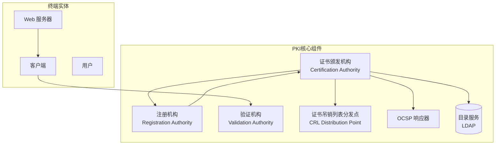
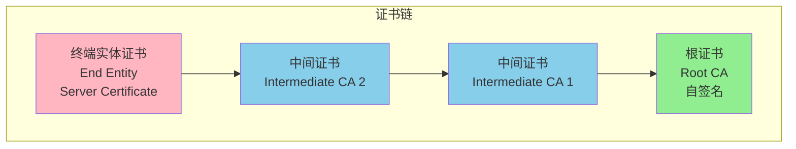
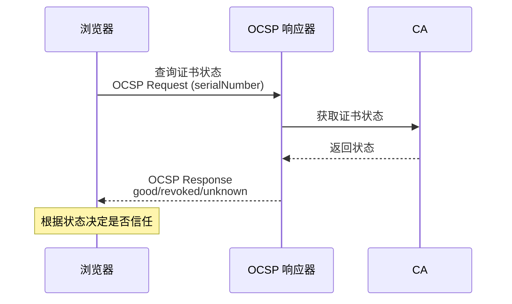
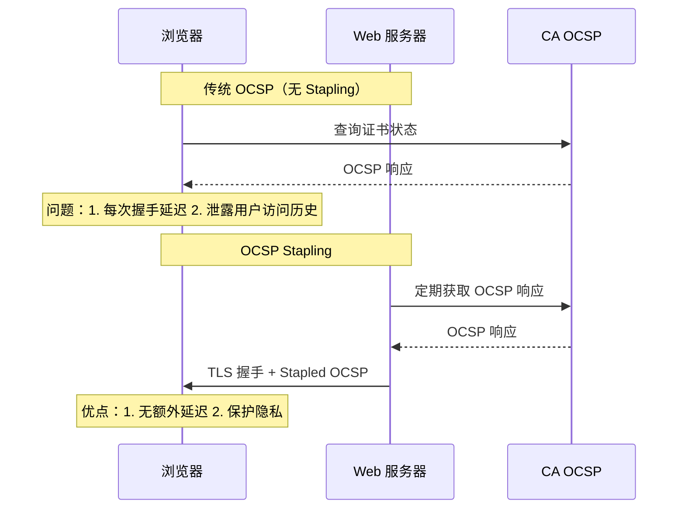
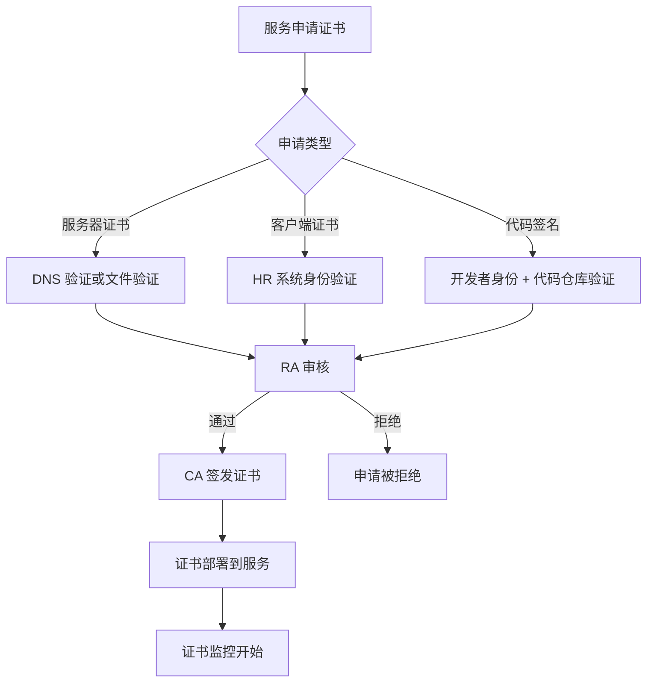

2017 年，Google Chrome 宣布将所有使用 HTTP 的网站标记为「不安全」。那天起，全球数十亿用户开始意识到一个小小的锁图标的重要性。

但很少有人知道，这个锁图标背后是一个复杂得令人难以置信的系统——它将全球数十亿台设备、数百万个网站、数千家证书颁发机构编织成一张信任网。这就是公钥基础设施（PKI）。

理解 PKI，不仅是安全工程师的基本功，也是每个架构师都应该掌握的知识。

## 一、PKI 的定义与组成

### PKI 是什么

公钥基础设施（Public Key Infrastructure）是一套用于创建、管理、分发、使用、存储和撤销数字证书的系统。

PKI 解决了互联网信任的核心问题：**在没有物理接触的情况下，如何确认「这个人真的是他声称的那个人」？**

### PKI 的核心组件



**各组件职责**：

| 组件 | 英文全称 | 职责 |
|------|----------|------|
| CA | Certification Authority | 签发、撤销、管理证书 |
| RA | Registration Authority | 验证证书申请者身份 |
| VA | Validation Authority | 提供证书状态查询 |
| CRL DP | CRL Distribution Point | 分发证书吊销列表 |
| OCSP | Online Certificate Status Protocol | 提供实时证书状态 |

## 二、X.509 证书结构

### 证书字段详解

一张 X.509 证书包含以下核心字段：

```java title="CertificateStructure.java"
import java.security.cert.X509Certificate;
import java.security.cert.CertificateFactory;
import java.util.Base64;
import java.io.FileInputStream;

public class CertificateStructure {
    
    public static void parseCertificate(String certPath) throws Exception {
        CertificateFactory factory = CertificateFactory.getInstance("X.509");
        
        try (FileInputStream fis = new FileInputStream(certPath)) {
            X509Certificate cert = (X509Certificate) factory.generateCertificate(fis);
            
            System.out.println("=== X.509 证书结构 ===");
            
            // 1. 版本 (Version)
            System.out.println("版本: V" + cert.getVersion());
            // V1: 0, V2: 1, V3: 2
            
            // 2. 序列号 (Serial Number)
            System.out.println("序列号: " + cert.getSerialNumber());
            // CA 分配的唯一编号
            
            // 3. 签名算法 (Signature Algorithm)
            System.out.println("签名算法: " + cert.getSigAlgName());
            // SHA256withRSA, SHA384withECDSA
            
            // 4. 签发者 (Issuer)
            System.out.println("签发者: " + cert.getIssuerX500Principal().getName());
            // 如: C=US, O=Let's Encrypt, CN=R3
            
            // 5. 有效期 (Validity)
            System.out.println("生效时间: " + cert.getNotBefore());
            System.out.println("过期时间: " + cert.getNotAfter());
            
            // 6. 主题 (Subject)
            System.out.println("主题: " + cert.getSubjectX500Principal().getName());
            // 如: CN=example.com, O=Example Inc, C=US
            
            // 7. 公钥信息 (Subject Public Key Info)
            System.out.println("公钥算法: " + cert.getPublicKey().getAlgorithm());
            System.out.println("公钥格式: " + cert.getPublicKey().getFormat());
            
            // 8. 扩展 (Extensions)
            System.out.println("扩展数量: " + cert.getCriticalExtensionOIDs().size());
        }
    }
}
```

### 证书扩展详解

V3 证书引入了扩展字段，提供更丰富的元数据：

```java title="CertificateExtensions.java"
import java.security.cert.X509Certificate;
import java.util.Set;
import java.util.Collections;

public class CertificateExtensions {
    
    /**
     * 常用证书扩展
     */
    public static void analyzeExtensions(X509Certificate cert) throws Exception {
        
        // 1. 主题备用名称 (Subject Alternative Name)
        // 允许多个域名对应同一证书
        Set<String> sans = cert.getSubjectAlternativeNames()
            .stream()
            .map(entry -> entry.get(1).toString())
            .collect(java.util.stream.Collectors.toSet());
        System.out.println("SAN: " + sans);
        // 用途: example.com, www.example.com, api.example.com
        
        // 2. 密钥用途 (Key Usage)
        // 定义证书公钥的用途
        System.out.println("Key Usage: " + cert.getKeyUsage());
        // 如: digitalSignature, keyEncipherment
        
        // 3. 扩展密钥用途 (Extended Key Usage)
        // 更细粒度的用途定义
        System.out.println("Extended Key Usage: " + cert.getExtendedKeyUsage());
        // 如: serverAuth (TLS 服务器), clientAuth (TLS 客户端)
        
        // 4. 基本约束 (Basic Constraints)
        // 标识是否为 CA 证书
        // pathLenConstraint 限制 CA 链的深度
        int pathLen = cert.getBasicConstraints();
        System.out.println("CA: " + (pathLen >= 0) + ", 路径长度: " + pathLen);
        
        // 5. 证书策略 (Certificate Policies)
        // 标识证书的验证级别和策略
        System.out.println("Certificate Policies: " + cert.getCertificatePolicies());
    }
}
```

### 常用扩展对照表

| 扩展 OID | 名称 | 说明 | 关键性 |
|----------|------|------|--------|
| 2.5.29.14 | Subject Key Identifier | 公钥指纹 | 建议 |
| 2.5.29.15 | Key Usage | 密钥用途 | 关键 |
| 2.5.29.17 | Subject Alternative Name | 备用域名 | 建议 |
| 2.5.29.19 | Basic Constraints | CA 标识 | 关键 |
| 2.5.29.31 | CRL Distribution Points | 吊销列表位置 | 建议 |
| 2.5.29.32 | Certificate Policies | 证书策略 | 建议 |
| 2.5.29.35 | Authority Key Identifier | 签发者指纹 | 建议 |
| 2.5.29.37 | Extended Key Usage | 扩展用途 | 建议 |

## 三、证书链与信任模型

### 证书链结构

证书链是从终端实体证书到根证书的信任路径：



**为什么需要中间证书**：

```
直接用根证书签发终端证书的问题：
1. 根证书私钥必须一直在线，暴露风险大
2. 根证书有效期通常很长（10-20年），无法快速吊销
3. 如果根证书被滥用，影响范围极大

使用中间证书的好处：
1. 根私钥可以离线存储，最多每年使用几次
2. 中间证书可以定期轮换
3. 即使中间证书泄露，可以吊销并用备用中间证书
```

### 信任模型

**模型一：层级信任（Hierarchical Trust）**

```
最常见的 PKI 信任模型

                    根 CA
                      │
           ┌───────────┼───────────┐
           │           │           │
      中间 CA 1   中间 CA 2   中间 CA 3
           │
     ┌─────┴─────┐
     │           │
  终端证书    终端证书
```

**模型二：网状信任（Mesh Trust / Cross-Certification）**

```
多个 CA 互相签发证书

    CA A ◄───────► CA B
     │               │
     │               │
     └───────┬───────┘
             │
         CA C
```

**模型三：混合模型（实际使用）**

```
Let's Encrypt 的证书链：

DST Root CA X3 (自签名根证书)
        │
        │ 签发
        ▼
  R3 (Let's Encrypt 中间证书)
        │
        │ 签发
        ▼
  example.com (终端证书)
```

### Java 验证证书链

```java title="CertificateChainValidation.java"
import java.security.*;
import java.security.cert.*;
import java.util.*;

public class CertificateChainValidation {
    
    /**
     * 完整证书链验证
     */
    public static PKIXCertPathBuilderResult validateChain(
            X509Certificate endEntityCert,
            X509Certificate[] chain,
            TrustAnchor[] trustAnchors) throws Exception {
        
        // 1. 创建 CertStore（包含中间证书）
        List<Certificate> certList = new ArrayList<>();
        for (X509Certificate cert : chain) {
            certList.add(cert);
        }
        CertStore certStore = CertStore.getInstance("Collection",
            new CollectionCertStoreParameters(certList));
        
        // 2. 配置 PKIX 路径验证器
        CertPathBuilder builder = CertPathBuilder.getInstance("PKIX");
        PKIXRevocationChecker revocationChecker = 
            (PKIXRevocationChecker) builder.getRevocationChecker();
        
        // 3. 设置吊销检查选项
        revocationChecker.setOptions(Set.of(
            PKIXRevocationChecker.Option.PREFER_CRLS,  // 优先 CRL
            PKIXRevocationChecker.Option.SOFT_FAIL      // 离线时软失败
        ));
        
        // 4. 构建验证参数
        PKIXBuilderParameters params = new PKIXBuilderParameters(
            Set.of(trustAnchors.toArray(new TrustAnchor[0])),
            new X509CertSelector());
        params.addCertPathChecker(revocationChecker);
        params.addCertStore(certStore);
        params.setDate(new Date());
        
        // 5. 设置策略
        params.setPolicyQualifiersRejected(false);
        params.setAnyPolicyInhibited(false);
        
        // 6. 验证路径
        return (PKIXCertPathBuilderResult) builder.build(params);
    }
    
    /**
     * 手动验证证书
     */
    public static ValidationResult manualValidation(
            X509Certificate cert,
            X509Certificate issuerCert) throws Exception {
        
        // 1. 检查时间有效性
        cert.checkValidity();
        
        // 2. 验证签名
        cert.verify(issuerCert.getPublicKey());
        
        // 3. 检查吊销状态
        RevocationStatus status = checkRevocation(cert);
        
        // 4. 验证基本约束
        if (cert.getBasicConstraints() == -1) {
            // 非 CA 证书不能签发其他证书
            System.out.println("警告: 非 CA 证书用于签发");
        }
        
        return new ValidationResult(cert, status);
    }
}
```

## 四、证书类型详解

### DV 证书（域名验证）

**验证内容**：申请者对域名的控制权

**验证方式**：
- **DNS 验证**：在域名的 DNS 配置中添加特定 TXT 记录
- **文件验证**：在域名对应的 Web 服务器上放置特定文件

**特点**：
- 签发速度快（几分钟到几小时）
- 成本低（Let's Encrypt 免费）
- 只证明域名控制权，不证明组织身份

**证书示例**：
```
Subject: CN=example.com
Issuer: C=US, O=Let's Encrypt, CN=R3
Certificate Policies: 2.23.140.1.2.1 (Baseline Requirements)
                        (DV 证书标准 OID)
```

### OV 证书（组织验证）

**验证内容**：域名的控制权 + 组织的真实存在

**验证方式**：
- 注册机构验证（检查 DNBS/鄧等数据库）
- 电话验证
- 物理地址验证

**特点**：
- 签发时间较长（1-5 天）
- 成本中等
- 证书中包含组织信息

**证书示例**：
```
Subject: CN=example.com, O=Example Inc, L=San Francisco, ST=California, C=US
Issuer: C=US, O=DigiCert Inc, CN=DigiCert Global G2 TLS RSA SHA256 2020 CA1
Certificate Policies: 
  - 2.23.140.1.2.2 (OV 证书标准 OID)
  - 1.3.6.1.4.1.47832.1.1 (OV 验证标准)
Organization Info:
  - Registry Expiry Date: 2025-12-31
  - Jurisdiction: US, California
```

### EV 证书（扩展验证）

**验证内容**：最严格的组织身份验证

**验证方式**：
- 法律存在验证
- 物理存在验证
- 操作存在验证
- 授权验证（确认申请者被授权申请证书）

**特点**：
- 签发时间最长（1-7 天）
- 成本最高
- 浏览器地址栏显示绿色公司名称

**证书示例**：
```
Subject: 
  serialNumber=1234567,
  jurisdictionOfIncorporationStateOrProvince=Delaware,
  jurisdictionOfIncorporationCountry=US,
  businessCategory=Private Organization,
  C=US,
  ST=California,
  L=Mountain View,
  O=Google LLC,
  CN=www.google.com

Enhanced Validation:
  - EV 证书 OID: 1.3.6.1.4.1.47832.1.2
  - 验证标准: EV Guidelines v1.7
```

### 证书类型对比

| 维度 | DV | OV | EV |
|------|-----|-----|-----|
| 验证内容 | 域名控制权 | 域名 + 组织 | 域名 + 组织 + 法律 |
| 签发时间 | 分钟-小时 | 1-5 天 | 1-7 天 |
| 成本 | 免费-低 | 中 | 高 |
| 证书信息 | 仅有域名 | 组织名称 | 完整组织信息 |
| 浏览器显示 | 锁图标 | 锁图标 | 绿色公司名（已取消） |
| 适用场景 | 个人站点、测试 | 企业网站 | 金融、电商、政府 |

:::note
**EV 证书的式微**

由于 Chrome 和其他浏览器在 2020 年取消了 EV 证书的绿色地址栏显示，EV 证书的价值大幅下降。目前大多数网站选择 DV 或 OV 证书。

但在某些高安全场景（如金融行业），EV 证书仍然是合规要求。
:::

## 五、证书吊销机制

### 为什么需要吊销

证书可能在以下情况下失去信任：

- 私钥泄露
- 证书所有者不再是合法主体
- CA 发现证书签发错误
- 域名所有权变更

### CRL（证书吊销列表）

CRL 是最古老的吊销机制，包含已被吊销证书的序列号列表：

```java title="CrlValidation.java"
import java.security.cert.*;
import java.net.URL;
import java.util.*;

public class CrlValidation {
    
    /**
     * 下载并验证 CRL
     */
    public static Set<String> downloadCRL(String crlUrl) throws Exception {
        // 1. 下载 CRL
        URL url = new URL(crlUrl);
        try (java.security.cert.CertificateFactory cf = 
                CertificateFactory.getInstance("X.509")) {
            
            X509CRL crl = (X509CRL) cf.generateCRL(url.openStream());
            
            // 2. 验证 CRL 签名
            // 通常由签发该 CRL 的 CA 验证
            
            // 3. 提取吊销序列号
            Set<String> revokedSerials = new HashSet<>();
            for (X509CRLEntry entry : crl.getRevokedCertificateSamples()) {
                revokedSerials.add(entry.getSerialNumber().toString(16));
            }
            
            // 4. 检查 CRL 本身的有效期
            crl.checkValidity();
            
            return revokedSerials;
        }
    }
    
    /**
     * 检查证书是否被吊销
     */
    public static boolean isCertificateRevoked(
            X509Certificate cert,
            X509CRL crl) {
        
        X509CRLEntry entry = crl.getRevokedCertificate(cert.getSerialNumber());
        
        if (entry != null) {
            System.out.println("证书已吊销:");
            System.out.println("  序列号: " + entry.getSerialNumber());
            System.out.println("  吊销时间: " + entry.getRevocationDate());
            System.out.println("  原因: " + entry.getReasonCode());
            return true;
        }
        
        return false;
    }
}
```

### OCSP（在线证书状态协议）

OCSP 提供实时证书状态查询，比 CRL 更高效：



**OCSP 请求格式**：
```
OCSPRequest:
  - TBSRequest:
    - version: v1
    - requestorName: (可选)
    - requestList:
      - CertID:
        - hashAlgorithm: SHA-1
        - issuerNameHash: H(Issuer)
        - issuerKeyHash: H(IssuerPublicKey)
        - serialNumber: 证书序列号
```

**OCSP 响应状态**：
| 状态 | 说明 |
|------|------|
| good | 证书未吊销 |
| revoked | 证书已被吊销，包含吊销时间和原因 |
| unknown | 响应器不知道该证书 |

### OCSP Stapling

OCSP Stapling 解决了传统 OCSP 的隐私和性能问题：



```java title="OcspStapling.java"
import javax.net.ssl.*;
import java.security.cert.*;
import java.net.URL;
import java.io.*;

public class OcspStaplingConfig {
    
    /**
     * 在 Tomcat/Undertow 中启用 OCSP Stapling
     * 
     * 配置 SSLHostConfig:
     * <SSLHostConfig>
     *   <Certificate 
     *     certificateKeyFile="server.key"
     *     certificateFile="server.crt"
     *     certificateChainFile="chain.crt"
     *     type="RSA" />
     *   <OcspCacheSize>1000</OcspCacheSize>
     *   <OcspResponderURL>http://ocsp.example.com</OcspResponderURL>
     * </SSLHostConfig>
     */
    
    /**
     * 手动验证 OCSP Stapling 响应
     */
    public static byte[] getStapledOCSPResponse(SSLSession session) {
        for (Certificate cert : session.getPeerCertificates()) {
            if (cert instanceof X509Certificate) {
                // OCSP 响应附加在证书扩展中
                try {
                    byte[] ocspResponse = ((X509Certificate) cert)
                        .getExtensionValue("1.3.6.1.5.5.7.48.1.1")
                        .getEncoded();
                    return ocspResponse;
                } catch (Exception e) {
                    // 没有 stapled OCSP 响应
                }
            }
        }
        return null;
    }
}
```

### 吊销检查策略对比

| 维度 | CRL | OCSP | OCSP Stapling |
|------|-----|------|---------------|
| 实时性 | 低（缓存时间长） | 高 | 高 |
| 隐私保护 | 好 | 差（泄露访问历史） | 好 |
| 性能 | 差（需要下载整个列表） | 好 | 最好 |
| 可靠性 | 高 | 依赖 OCSP 服务可用性 | 高 |
| 失败处理 | 使用缓存 | 软失败/硬失败 | 使用缓存 |

## 六、证书透明度（Certificate Transparency）

### 什么是 CT

证书透明度（Certificate Transparency）解决了 PKI 的信任问题：CA 可能在用户不知情的情况下签发证书（如赛门铁克事件）。

CT 要求所有签发的证书必须记录到公开的日志服务器中，任何人都可以查询。

### CT 日志结构

```mermaid
flowchart LR
    subgraph 证书生命周期
        CSR[证书签名请求] --> CA[CA 签发证书]
        CA --> Log[提交到 CT Log]
        Log --> SCT[SCT (签名证书时间戳)]
        SCT --> Deploy[部署证书]
    end
```

**SCT（Signed Certificate Timestamp）**：
```
SCT 包含：
- 日志服务器 ID
- 时间戳
- 日志服务器签名

证书可以通过三种方式携带 SCT：
1. X.509 扩展（单独签发的证书）
2. TLS 扩展（CT 扩展）
3. OCSP Stapling
```

### Java 验证 CT

```java title="CertificateTransparency.java"
import java.security.cert.*;
import java.util.*;

public class CertificateTransparency {
    
    /**
     * 检查证书是否有有效的 SCT
     */
    public static boolean hasValidSCT(X509Certificate cert) {
        try {
            // 尝试从 X.509 扩展获取 SCT
            byte[] sctExtension = cert.getExtensionValue("1.3.6.1.4.1.11129.2.4.2");
            if (sctExtension != null) {
                return true;
            }
            
            // SCT 也可以通过其他方式传输
            return false;
        } catch (Exception e) {
            return false;
        }
    }
    
    /**
     * 验证证书是否记录在 CT 日志中
     * 使用 Google 的 CT 公开 API
     */
    public static boolean isInCertificateTransparency(
            X509Certificate cert,
            List<String> acceptableLogs) throws Exception {
        
        String issuerName = cert.getIssuerX500Principal().getName();
        String subjectName = cert.getSubjectX500Principal().getName();
        String serialHex = cert.getSerialNumber().toString(16);
        
        // 使用 crt.sh 公开 API 查询
        String url = String.format(
            "https://crt.sh/?q=%s&output=json",
            URLEncoder.encode("DNSNAME=" + subjectName, "UTF-8")
        );
        
        // 实际实现需要解析 JSON 响应
        // 检查证书是否在已知日志中记录
        
        return true;
    }
}
```

---

## 思考题

**问题 1**：2017 年，Google 决定在 Chrome 中逐步取消 EV 证书的绿色地址栏显示。分析这一决定背后的安全考量，以及 DV/OV 证书的局限性。

<details>
<summary>参考答案</summary>

**EV 绿色地址栏的历史**：

- 2010 年前：EV 证书使地址栏变为绿色，并显示公司名称
- 2017 年：Chrome 70 开始取消绿色显示，改为普通锁图标
- 2019 年：Chrome 77 开始完全取消 EV 证书的特殊 UI

**Google 取消 EV 特殊显示的原因**：

**1. EV 证书的安全保障并不像预期那么强**

```
EV 证书验证的局限：
1. DV 部分仍然可能被攻击（如 DNS 被劫持）
2. 验证标准不一致：不同 CA 对 OV/EV 的验证严格程度不同
3. 证书信息可能被伪造：某些 DV 证书也能显示公司信息
4. 用户无法区分真正的 EV 和伪造的"看起来像 EV"的信息
```

**2. 用户无法正确理解绿色地址栏的含义**

```
用户研究显示：
- 大多数用户不理解绿色地址栏的含义
- 用户更关注地址栏中的内容（如品牌名）
- 攻击者可以利用用户对绿色地址栏的盲目信任
- 钓鱼网站可以使用 DV 证书获得锁图标，足以欺骗普通用户
```

**3. 安全 UI 的"警报疲劳"**

```
如果所有证书都有"绿色"标识，那么绿色就不再有意义。
真正的安全问题需要更明显的警告来吸引用户注意。
```

**DV/OV 证书的局限性分析**：

| 证书类型 | 验证内容 | 局限性 |
|----------|----------|--------|
| DV | 域名控制权 | 无法证明组织身份 |
| OV | 域名 + 组织 | 组织信息不显示在地址栏，用户无法直接验证 |
| EV | 域名 + 组织 + 法律 | UI 已被取消，实际保护有限 |

**现代安全建议**：

```
1. 不要依赖证书类型作为信任的唯一依据
2. 关注证书链的完整性和有效性
3. 启用 HSTS（HTTP Strict Transport Security）
4. 使用 CT 日志监控异常证书签发
5. 实现证书固定（Certificate Pinning）用于高敏感应用
6. 实施 MTLS 进行双向认证
```

</details>

**问题 2**：假设你负责设计一个企业内部 PKI 系统，需要为数百个服务和数千名员工签发证书。请设计这个 PKI 的拓扑结构和运维流程。

<details>
<summary>参考答案</summary>

**PKI 拓扑设计**：

```
┌─────────────────────────────────────────────────────────────────┐
│                        离线根 CA                                │
│  ┌─────────────────────────────────────────────────────────┐    │
│  │  Root CA (SHA-384, RSA-4096)                          │    │
│  │  - 存储在 HSM 中                                      │    │
│  │  - 私钥从不离开 HSM                                   │    │
│  │  - 仅在年度证书更新时使用                             │    │
│  │  - 有效期：20 年                                     │    │
│  └─────────────────────────────────────────────────────────┘    │
└─────────────────────────────────────────────────────────────────┘
                              │
                              │ 年度使用
                              ▼
┌─────────────────────────────────────────────────────────────────┐
│                      在线中间 CA                                 │
│  ┌─────────────────────────────────────────────────────────┐    │
│  │  Issuing CA 1 (SHA-256, RSA-2048)                     │    │
│  │  - 签发服务器证书                                      │    │
│  │  - 有效期：5 年                                       │    │
│  │  - 每日签发量限额                                     │    │
│  └─────────────────────────────────────────────────────────┘    │
│                              │                                  │
│              ┌───────────────┼───────────────┐                  │
│              ▼               ▼               ▼                  │
│  ┌─────────────────┐ ┌─────────────────┐ ┌─────────────────┐   │
│  │  中间 CA 2     │ │  中间 CA 3     │ │  中间 CA 4     │   │
│  │  (客户端证书)   │ │  (代码签名)     │ │  (野野生证书)   │   │
│  │  有效期：3 年   │ │  有效期：3 年   │ │  有效期：1 年   │   │
│  └─────────────────┘ └─────────────────┘ └─────────────────┘   │
└─────────────────────────────────────────────────────────────────┘
```

**运维流程设计**：

**1. 证书签发流程**



**2. 密钥生命周期管理**

```
┌─────────────────────────────────────────────────────────────────┐
│                       密钥生命周期                               │
├─────────────────────────────────────────────────────────────────┤
│                                                                 │
│  生成 ──► 使用 ──► 轮转 ──► 退役 ──► 销毁                      │
│                                                                 │
│  生成阶段：                                                     │
│  - 使用 HSM 或云 KMS 生成                                        │
│  - 符合安全标准的算法和密钥长度                                  │
│                                                                 │
│  使用阶段：                                                      │
│  - 持续监控证书有效期                                            │
│  - 提前 30 天开始自动轮转                                       │
│                                                                 │
│  轮转阶段：                                                      │
│  - 新旧证书共存期（2 周）                                       │
│  - 验证新证书后再下线旧证书                                      │
│                                                                 │
│  退役阶段：                                                      │
│  - 从服务中移除证书                                             │
│  - 证书链更新                                                   │
│  - 保留证书 用于历史验证                                        │
│                                                                 │
│  销毁阶段：                                                      │
│  - 删除私钥                                                     │
│  - 记录销毁日志                                                 │
│                                                                 │
└─────────────────────────────────────────────────────────────────┘
```

**3. 吊销响应流程**

```java title="RevocationResponseProcedure.java"
@Service
@Slf4j
public class RevocationResponseProcedure {
    
    /**
     * 吊销响应流程
     */
    public void handleRevocationRequest(RevocationRequest request) {
        
        // 1. 立即响应
        AlertResult alert = alertSecurityTeam(request);
        
        // 2. 评估影响
        List<ServiceImpact> impacts = assessImpact(request.getCertSerialNumber());
        
        // 3. 吊销证书
        if (request.isUrgent()) {
            // 紧急吊销：使用 OCSP 和 CRL 立即发布
            publishRevocation(request, RevocationReason.KEY_COMPROMISE);
        } else {
            // 常规吊销：24 小时内完成
            scheduleRevocation(request);
        }
        
        // 4. 评估是否需要吊销其他证书
        if (request.getReason() == RevocationReason.KEY_COMPROMISE) {
            List<String> relatedSerials = findRelatedCertificates(
                request.getSubjectKeyIdentifier());
            for (String serial : relatedSerials) {
                scheduleRevocation(new RevocationRequest(serial, 
                    RevocationReason.CA_COMPROMISE));
            }
        }
        
        // 5. 事后分析
        postIncidentAnalysis(request);
    }
}
```

**4. 监控和告警**

| 监控项 | 阈值 | 动作 |
|--------|------|------|
| 证书即将过期 | < 30 天 | 警告 |
| 证书即将过期 | < 7 天 | 严重警告 + 自动告警 |
| 证书已过期 | - | 严重告警 + 阻断 |
| 吊销状态查询失败 | > 5% 失败率 | 警告 |
| 异常签发模式 | 超出正常基线 | 安全告警 |
| CA 证书即将过期 | < 180 天 | 计划更新 |

**5. 审计和合规**

```
审计日志必须记录：
1. 所有证书签发（包括申请者、批准者、理由）
2. 所有证书吊销
3. 所有密钥操作
4. 所有策略变更
5. 所有访问 CA 系统的事件

保留周期：
- 证书相关日志：7 年
- 审计报告：10 年
- 私钥（已销毁的）：仅记录销毁事实，保留 3 年
```

</details>
