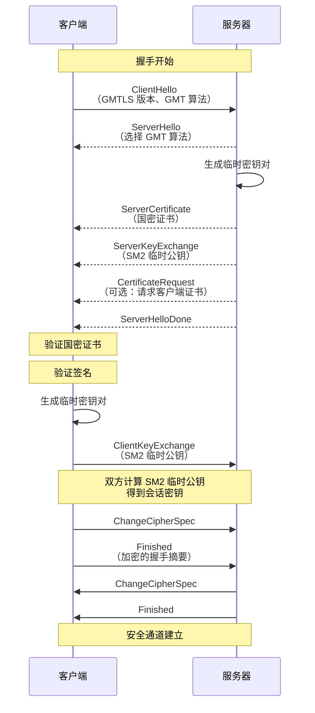

2019 年，《密码法》正式通过，密码技术作为国家战略资源的重要性被正式确立。对于在中国运营的信息系统来说，国密算法不再是可选项，而是合规的必选项。

但很多工程师对国密算法的理解停留在「国产」这个标签上，对于 SM2、SM3、SM4 的原理和使用场景并不清楚。

本文深入解析国密算法的技术细节，帮助你理解为什么要用国密，以及如何在实际项目中应用。

## 一、国密算法概述

### 为什么需要国密算法

```
传统密码学 vs 国密算法：

┌─────────────────────────────────────────────────────────────────┐
│  问题：                                                         │
│                                                                 │
│  1. 供应链风险                                                 │
│     - RSA/ECC 等算法由美国公司主导                             │
│     - NSA 可能影响算法设计                                      │
│     - 加密标准可能被植入后门                                   │
│                                                                 │
│  2. 合规要求                                                   │
│     - 《密码法》要求关键信息基础设施使用国密                    │
│     - 等保 2.0 对密码使用有明确要求                            │
│     - 政府采购要求国密支持                                     │
│                                                                 │
│  3. 主权自主                                                   │
│     - 密码技术是信息安全的基石                                  │
│     - 自主可控是国家安全的基本要求                             │
│                                                                 │
└─────────────────────────────────────────────────────────────────┘
```

### 国密算法体系

| 算法 | 类型 | 用途 | 对应国际算法 |
|------|------|------|--------------|
| SM1 | 对称加密 | 数据加密 | AES |
| SM2 | 非对称加密 | 签名/密钥交换 | RSA/ECC |
| SM3 | 哈希算法 | 消息认证 | SHA-256 |
| SM4 | 对称加密 | 数据加密 | AES |
| SM7 | 对称加密 | 身份认证 | - |
| SM9 | 非对称加密 | 标识密码 | - |

:::note
**注意**：SM1 算法未公开，本文不涉及。SM2、SM3、SM4 是目前最广泛使用的国密算法。
:::

## 二、SM2 椭圆曲线公钥密码算法

### SM2 曲线参数

SM2 使用一条特殊的椭圆曲线，其参数经过国家密码管理局严格审定：

```
曲线方程：y² = x³ + ax + b (mod p)

参数：
p = FFFFFFFE FFFFFFFF FFFFFFFF FFFFFFFF FFFFFFFF 00000000 FFFFFFFF FFFFFFFF
a = FFFFFFFE FFFFFFFF FFFFFFFF FFFFFFFF FFFFFFFF 00000000 FFFFFFFF FFFFFFFC
b = 28E9FA9E 9D9F5E34 4D5A9E4B CF6509A7 F39789F5 15AB8F92 DDBCBD41 4D940E93

n = FFFFFFFE FFFFFFFF FFFFFFFF FFFFFFFF 7203DF6B 21C6052B 53BBF409 39D54123
Gx = 32C4AE2C 1F198119 5F990446 6A39C994 8F30C347 87830B21 F5553193 68A23E16
Gy = BC3736A2 F4F6779C 59BDCEE3 6B692153 D0A9877C C62A4740 02DF32E5 2139F0A0
```

### SM2 签名算法

SM2 签名基于椭圆曲线，与 ECDSA 类似但不完全相同：

```java title="Sm2Signature.java"
import org.bouncycastle.crypto.signers.SM2Signer;
import org.bouncycastle.crypto.params.ECPublicKeyParameters;
import org.bouncycastle.crypto.params.ECPrivateKeyParameters;
import org.bouncycastle.jce.spec.ECParameterSpec;
import org.bouncycastle.util.encoders.Hex;

/**
 * SM2 签名实现
 */
public class Sm2Signature {
    
    /**
     * SM2 签名
     */
    public static byte[] sign(byte[] message, byte[] privateKey) throws Exception {
        
        // 1. 初始化签名器
        SM2Signer signer = new SM2Signer();
        
        // 2. 设置私钥
        ECPrivateKeyParameters privateKeyParams = new ECPrivateKeyParameters(
            new BigInteger(1, privateKey),  // 去掉前导 0
            Sm2Constants.EC_PARAMS
        );
        
        // 3. 初始化签名（传入用户 ID 和椭圆曲线参数）
        // 用户 ID 用于签名的一部分，增强安全性
        byte[] userId = "1234567812345678".getBytes();  // 默认 ID
        signer.init(true, new ParametersWithID(privateKeyParams, userId));
        
        // 4. 签名
        signer.update(message, 0, message.length);
        byte[] signature = signer.generateSignature();
        
        return signature;
    }
    
    /**
     * SM2 验签
     */
    public static boolean verify(byte[] message, byte[] signature, byte[] publicKey) {
        
        SM2Signer signer = new SM2Signer();
        
        // 1. 设置公钥
        ECPublicKeyParameters publicKeyParams = new ECPublicKeyParameters(
            Sm2Constants.EC_CURVE.decodePoint(publicKey),
            Sm2Constants.EC_PARAMS
        );
        
        // 2. 初始化验签
        byte[] userId = "1234567812345678".getBytes();
        signer.init(false, new ParametersWithID(publicKeyParams, userId));
        
        // 3. 验签
        signer.update(message, 0, message.length);
        return signer.verifySignature(signature);
    }
}
```

### SM2 密钥交换协议

SM2 还定义了密钥交换协议，用于双方协商会话密钥：

```java title="Sm2KeyExchange.java"
/**
 * SM2 密钥交换
 */
public class Sm2KeyExchange {
    
    /**
     * 密钥交换参与者
     */
    public static class Party {
        private final byte[] privateKey;  // 临时私钥
        private final ECPoint publicKey;   // 临时公钥
        private final ECPoint theirPublicKey;  // 对方公钥
        
        public Party(byte[] privateKey, ECPoint publicKey, ECPoint theirPublicKey) {
            this.privateKey = privateKey;
            this.publicKey = publicKey;
            this.theirPublicKey = theirPublicKey;
        }
        
        public byte[] getSharedSecret() {
            // SM2 密钥交换协议
            // 计算 S = (dB + dA * RA) * PB
            // 其中 dA 是己方私钥，dB 是对方私钥（隐藏在 PB 中）
            return calculateSharedSecret();
        }
    }
    
    /**
     * 执行密钥交换
     */
    public static byte[] performKeyExchange(
            byte[] initiatorPrivateKey,
            byte[] responderPrivateKey,
            byte[] userIdA,
            byte[] userIdB) {
        
        // 1. 初始化椭圆曲线
        SM2Curve curve = new SM2Curve(Sm2Constants.P, Sm2Constants.A, Sm2Constants.B);
        SM2Point G = new SM2Point(Sm2Constants.GX, Sm2Constants.GY);
        
        // 2. 生成临时密钥对
        BigInteger dA = new BigInteger(1, initiatorPrivateKey);
        ECPoint RA = curve.multiply(G, dA);
        
        BigInteger dB = new BigInteger(1, responderPrivateKey);
        ECPoint RB = curve.multiply(G, dB);
        
        // 3. 计算共享密钥
        // KDF 是密钥派生函数
        byte[] ZA = calculateZ(userIdA);
        byte[] ZB = calculateZ(userIdB);
        
        // 计算 S = Hash(dA * (RB + h * dB * RA))
        BigInteger h = Sm2Constants.N;  // 协子阶
        ECPoint temp = curve.add(RB, curve.multiply(curve.multiply(G, h.multiply(dB)), dA));
        ECPoint S = curve.multiply(temp, dA);
        
        // KDF(S.x || ZA || ZB, klen)
        byte[] sharedKey = KDF(new byte[][]{S.getX().toByteArray(), ZA, ZB}, 32);
        
        return sharedKey;
    }
}
```

### SM2 vs RSA/ECC

| 维度 | SM2 | RSA-2048 | ECC-P256 |
|------|-----|----------|----------|
| 密钥长度 | 256 位 | 2048 位 | 256 位 |
| 签名长度 | 64 字节 | 256 字节 | 64 字节 |
| 安全性 | 约 128 位 | 约 112 位 | 约 128 位 |
| 签名速度 | 快 | 慢 | 快 |
| 验签速度 | 快 | 中 | 中 |
| 曲线参数 | 国密标准 | 无固定曲线 | 多种选择 |

## 三、SM3 密码杂凑算法

### SM3 算法原理

SM3 是一种 Merkle-Damgard 结构的哈希算法，与 SHA-256 类似但使用了不同的压缩函数：

```java title="Sm3Hash.java"
import org.bouncycastle.crypto.digests.SM3Digest;

/**
 * SM3 哈希实现
 */
public class Sm3Hash {
    
    /**
     * 计算 SM3 哈希
     */
    public static byte[] hash(byte[] message) {
        
        SM3Digest digest = new SM3Digest();
        digest.update(message, 0, message.length);
        
        byte[] hash = new byte[digest.getDigestSize()];
        digest.doFinal(hash, 0);
        
        return hash;
    }
    
    /**
     * 计算 SM3 哈希（十六进制字符串）
     */
    public static String hashHex(byte[] message) {
        byte[] hash = hash(message);
        return Hex.toHexString(hash);
    }
    
    /**
     * 计算 SM3 带盐哈希（用于密码存储）
     */
    public static byte[] hashWithSalt(byte[] message, byte[] salt, int iterations) {
        
        SM3Digest digest = new SM3Digest();
        
        // 初始值 = SM3(salt || message)
        byte[] input = new byte[salt.length + message.length];
        System.arraycopy(salt, 0, input, 0, salt.length);
        System.arraycopy(message, 0, input, salt.length, message.length);
        
        digest.update(input, 0, input.length);
        byte[] result = new byte[digest.getDigestSize()];
        digest.doFinal(result, 0);
        
        // 迭代哈希
        for (int i = 1; i < iterations; i++) {
            digest.reset();
            digest.update(result, 0, result.length);
            digest.doFinal(result, 0);
        }
        
        return result;
    }
}
```

### SM3 vs SHA-256

| 维度 | SM3 | SHA-256 |
|------|------|---------|
| 输出长度 | 256 位 | 256 位 |
| 分组长度 | 512 位 | 512 位 |
| 状态大小 | 256 位 | 256 位 |
| 轮数 | 64 | 64 |
| 设计机构 | 中国国家密码管理局 | NIST |
| 应用场景 | 中国政府、金融 | 全球 |

## 四、SM4 分组密码算法

### SM4 算法原理

SM4 是一种分组密码算法，与 AES 相同采用 Substitution-Permutation Network (SPN) 结构：

```java title="Sm4Encryption.java"
import org.bouncycastle.crypto.engines.SM4Engine;
import org.bouncycastle.crypto.modes.GMCipherMode;
import org.bouncycastle.crypto.params.KeyParameter;
import org.bouncycastle.crypto.params.ParametersWithIV;

/**
 * SM4 加密实现
 */
public class Sm4Encryption {
    
    private static final int KEY_SIZE = 128;
    private static final int IV_SIZE = 128;
    
    /**
     * SM4 ECB 模式加密
     */
    public static byte[] encryptECB(byte[] plaintext, byte[] key) {
        
        SM4Engine engine = new SM4Engine();
        engine.init(true, new KeyParameter(key));  // true = 加密模式
        
        // ECB 模式需要填充
        byte[] padded = pkcs7Pad(plaintext, 16);
        
        byte[] ciphertext = new byte[padded.length];
        int offset = 0;
        
        // 分组加密
        while (offset < padded.length) {
            engine.processBlock(padded, offset, ciphertext, offset);
            offset += 16;
        }
        
        return ciphertext;
    }
    
    /**
     * SM4 CBC 模式加密
     */
    public static byte[] encryptCBC(byte[] plaintext, byte[] key, byte[] iv) {
        
        SM4Engine engine = new SM4Engine();
        GMCipherMode mode = new GMCipherMode.CBCBlockCipher(new SM4Engine());
        mode.init(true, new ParametersWithIV(new KeyParameter(key), iv));
        
        byte[] padded = pkcs7Pad(plaintext, 16);
        byte[] ciphertext = new byte[padded.length];
        
        int offset = 0;
        while (offset < padded.length) {
            mode.processBlock(padded, offset, ciphertext, offset);
            offset += 16;
        }
        
        return ciphertext;
    }
    
    /**
     * SM4 GCM 模式加密（带认证）
     */
    public static EncryptedData encryptGCM(byte[] plaintext, byte[] key, byte[] iv) {
        
        SM4Engine engine = new SM4Engine();
        GCMBlockCipher gcm = new GCMBlockCipher(engine);
        
        // 参数：密钥、IV 长度（12 字节推荐）、认证标签长度（16 字节）
        GCMParameters params = new GCMParameters(iv, 12);
        gcm.init(true, params);
        
        byte[] ciphertext = new byte[gcm.getOutputSize(plaintext.length)];
        byte[] tag = new byte[16];
        
        int len = gcm.processBytes(plaintext, 0, plaintext.length, ciphertext, 0);
        len += gcm.doFinal(ciphertext, len);
        
        // 前 len 字节是密文，后 16 字节是 tag
        byte[] result = new byte[len - 16];
        System.arraycopy(ciphertext, 0, result, 0, len - 16);
        System.arraycopy(ciphertext, len - 16, tag, 0, 16);
        
        return new EncryptedData(result, tag);
    }
    
    /**
     * PKCS#7 填充
     */
    private static byte[] pkcs7Pad(byte[] data, int blockSize) {
        int padding = blockSize - (data.length % blockSize);
        byte[] padded = new byte[data.length + padding];
        System.arraycopy(data, 0, padded, 0, data.length);
        for (int i = data.length; i < padded.length; i++) {
            padded[i] = (byte) padding;
        }
        return padded;
    }
    
    public record EncryptedData(byte[] ciphertext, byte[] tag) {}
}
```

### SM4 模式对比

| 模式 | 安全性 | 并行性 | 适用场景 |
|------|--------|--------|----------|
| ECB | 低（相同块产生相同密文） | 高 | 不推荐 |
| CBC | 中 | 低 | 文件加密 |
| CFB | 中 | 低 | 流加密 |
| OFB | 中 | 中 | 流加密 |
| CTR | 高 | 高 | 流加密 |
| GCM | 高（带认证） | 高 | 网络通信 |

## 五、国密 SSL/TLS 协议

### GMTLS 概述

国密 TLS（GMTLS）是中国基于 TLS 1.1 协议修改的国密版本：



### GMTLS vs TLS 1.2

| 维度 | GMTLS | TLS 1.2 |
|------|-------|----------|
| 版本号 | 0x0101 | 0x0303 |
| 签名算法 | SM2withSM3 | RSA/ECDSA |
| 密钥交换 | SM2 DH | RSA/ECDHE |
| 对称加密 | SM1/SM4 | AES |
| 哈希算法 | SM3 | SHA-256 |
| 证书格式 | 国密证书（GB/T 20518） | X.509 |

### Java 国密 TLS 配置

```java title="GmTlsConfig.java"
import org.bouncycastle.jsse.provider.GMJSSEProvider;
import javax.net.ssl.*;

/**
 * 国密 TLS 配置
 */
public class GmTlsConfig {
    
    /**
     * 注册国密 provider
     */
    public static void registerGmProvider() {
        Security.insertProviderAt(new GMJSSEProvider(), 1);
    }
    
    /**
     * 创建国密 SSLContext
     */
    public static SSLContext createGmSSLContext(
            String keyStorePath,
            char[] keyStorePassword,
            String trustStorePath,
            char[] trustStorePassword) throws Exception {
        
        // 1. 加载国密密钥库
        KeyStore keyStore = KeyStore.getInstance("GMKEYSTORE");
        keyStore.load(new FileInputStream(keyStorePath), keyStorePassword);
        
        KeyStore trustStore = KeyStore.getInstance("GMTRUSTSTORE");
        trustStore.load(new FileInputStream(trustStorePath), trustStorePassword);
        
        // 2. 创建 KeyManager
        KeyManagerFactory kmf = KeyManagerFactory.getInstance("SunX509");
        kmf.init(keyStore, keyStorePassword);
        
        // 3. 创建 TrustManager
        TrustManagerFactory tmf = TrustManagerFactory.getInstance("SunX509");
        tmf.init(trustStore);
        
        // 4. 创建 SSLContext（使用 GMTLS）
        SSLContext sslContext = SSLContext.getInstance("GMTLS");
        sslContext.init(kmf.getKeyManagers(), tmf.getTrustManagers(), null);
        
        return sslContext;
    }
}
```

## 六、国密算法的 Java 实现

### Bouncy Castle 实现

```java title="GmAlgorithmExamples.java"
import org.bouncycastle.asn1.gm.*;
import org.bouncycastle.crypto.signers.*;
import org.bouncycastle.jce.provider.*;
import java.security.*;

/**
 * 国密算法使用示例
 */
public class GmAlgorithmExamples {
    
    /**
     * 生成 SM2 密钥对
     */
    public static KeyPair generateSm2KeyPair() throws Exception {
        // 注册国密 Provider
        Security.addProvider(new BouncyCastleProvider());
        
        // 使用 KeyPairGenerator
        KeyPairGenerator generator = KeyPairGenerator.getInstance("SM2", "BC");
        generator.initialize(256, new SecureRandom());
        
        return generator.generateKeyPair();
    }
    
    /**
     * SM2 签名
     */
    public static byte[] signSm2(byte[] data, PrivateKey privateKey) throws Exception {
        Signature signature = Signature.getInstance("SM3WithSM2", "BC");
        signature.initSign(privateKey);
        signature.update(data);
        return signature.sign();
    }
    
    /**
     * SM2 验签
     */
    public static boolean verifySm2(byte[] data, byte[] signature, PublicKey publicKey) 
            throws Exception {
        Signature sig = Signature.getInstance("SM3WithSM2", "BC");
        sig.initVerify(publicKey);
        sig.update(data);
        return sig.verify(signature);
    }
    
    /**
     * SM3 哈希
     */
    public static byte[] hashSm3(byte[] data) throws Exception {
        MessageDigest digest = MessageDigest.getInstance("SM3", "BC");
        return digest.digest(data);
    }
    
    /**
     * SM4 加密
     */
    public static byte[] encryptSm4(byte[] data, byte[] key) throws Exception {
        Cipher cipher = Cipher.getInstance("SM4/ECB/PKCS5Padding", "BC");
        SecretKey secretKey = new SecretKeySpec(key, "SM4");
        cipher.init(Cipher.ENCRYPT_MODE, secretKey);
        return cipher.doFinal(data);
    }
    
    /**
     * SM4 解密
     */
    public static byte[] decryptSm4(byte[] data, byte[] key) throws Exception {
        Cipher cipher = Cipher.getInstance("SM4/ECB/PKCS5Padding", "BC");
        SecretKey secretKey = new SecretKeySpec(key, "SM4");
        cipher.init(Cipher.DECRYPT_MODE, secretKey);
        return cipher.doFinal(data);
    }
}
```

### Maven 依赖

```xml title="pom.xml"
<dependency>
    <groupId>org.bouncycastle</groupId>
    <artifactId>bcprov-jdk15on</artifactId>
    <version>1.70</version>
</dependency>

<dependency>
    <groupId>org.bouncycastle</groupId>
    <artifactId>bcpg-jdk15on</artifactId>
    <version>1.70</version>
</dependency>

<dependency>
    <groupId>org.bouncycastle</groupId>
    <artifactId>bcpkix-jdk15on</artifactId>
    <version>1.70</version>
</dependency>
```

## 七、双证书体系

### 为什么需要双证书

中国 PKI 采用双证书体系：

```
┌─────────────────────────────────────────────────────────────────┐
│                      双证书体系                                    │
├─────────────────────────────────────────────────────────────────┤
│                                                                 │
│  签名证书：                                                     │
│  ├─ 用于数字签名                                               │
│  ├─ 私钥由用户自己生成和保管                                    │
│  └─ 证书包含签名公钥                                           │
│                                                                 │
│  加密证书：                                                     │
│  ├─ 用于密钥交换和加密                                         │
│  ├─ 私钥由 CA 代为生成和保管                                  │
│  └─ 证书包含加密公钥                                           │
│                                                                 │
│  目的：                                                         │
│  1. 密钥恢复：CA 持有加密私钥，可用于恢复加密数据              │
│  2. 法律合规：特定场景需要 CA 能够解密通信内容                │
│  3. 审计追溯：CA 可追溯所有加密通信                           │
│                                                                 │
└─────────────────────────────────────────────────────────────────┘
```

### 双证书生成流程

```java title="DualCertificateGeneration.java"
/**
 * 双证书生成
 */
public class DualCertificateGeneration {
    
    /**
     * 生成签名证书
     * 私钥由用户自己生成
     */
    public static CertificateRequest generateSigningCertificate(String userId) 
            throws Exception {
        
        // 1. 用户自己生成签名密钥对
        KeyPair signingKeyPair = KeyPairGenerator.getInstance("SM2", "BC")
            .generateKeyPair();
        
        // 2. 生成 CSR（用户持有私钥）
        PKCS10CertificationRequest csr = generateCSR(
            signingKeyPair.getPublic(),
            signingKeyPair.getPrivate(),
            userId,
            "signing"
        );
        
        // 3. 保存私钥（用户本地存储）
        savePrivateKey(signingKeyPair.getPrivate(), "signing-key.pem");
        
        return new CertificateRequest(csr, signingKeyPair.getPublic());
    }
    
    /**
     * 生成加密证书
     * 私钥由 CA 代为生成
     */
    public static EncryptedCertificateRequest generateEncryptionCertificate(
            String userId) throws Exception {
        
        // 1. CA 生成加密密钥对
        KeyPair encryptionKeyPair = KeyPairGenerator.getInstance("SM2", "BC")
            .generateKeyPair();
        
        // 2. CA 生成加密证书 CSR
        PKCS10CertificationRequest csr = generateCSR(
            encryptionKeyPair.getPublic(),
            encryptionKeyPair.getPrivate(),
            userId,
            "encryption"
        );
        
        // 3. 加密私钥并安全传输给用户
        byte[] encryptedPrivateKey = encryptPrivateKeyForUser(
            encryptionKeyPair.getPrivate(),
            userId
        );
        
        // 4. 返回加密证书请求和加密的私钥
        return new EncryptedCertificateRequest(
            csr, 
            encryptedPrivateKey,
            encryptionKeyPair.getPrivate()  // CA 保留用于密钥恢复
        );
    }
    
    /**
     * 用户接收加密证书
     */
    public static void receiveEncryptionCertificate(
            byte[] encryptedPrivateKey,
            byte[] encryptedCertificate,
            String userId) throws Exception {
        
        // 1. 解密私钥（使用用户口令和解密密钥）
        byte[] privateKey = decryptPrivateKey(encryptedPrivateKey, userId);
        
        // 2. 保存私钥
        savePrivateKey(privateKey, "encryption-key.pem");
        
        // 3. 保存证书
        saveCertificate(encryptedCertificate, "encryption-cert.pem");
    }
}
```

---

## 思考题

**问题 1**：某金融机构需要将现有的国际密码体系迁移到国密算法。系统目前使用 RSA-2048 + AES-256 + SHA-256。请设计一个平滑迁移方案，确保：

1. 迁移过程中不影响现有业务
2. 能够同时支持国密和国际算法（双轨制）
3. 未来能够完全切换到国密算法

<details>
<summary>参考答案</summary>

**平滑迁移方案设计**：

```
┌─────────────────────────────────────────────────────────────────┐
│                    密码算法迁移路线图                               │
├─────────────────────────────────────────────────────────────────┤
│                                                                 │
│  Phase 1：基础准备（1-2 个月）                                 │
│  ├─ 部署国密算法库                                            │
│  ├─ 升级密钥管理系统支持双密钥                                │
│  └─ 制定密钥映射策略                                          │
│                                                                 │
│  Phase 2：试点验证（1-2 个月）                                │
│  ├─ 选择非核心业务试点                                        │
│  ├─ 验证国密算法兼容性                                        │
│  └─ 性能基准测试                                              │
│                                                                 │
│  Phase 3：双轨运行（3-6 个月）                                │
│  ├─ 新增数据使用国密算法                                      │
│  └─ 历史数据保持不变                                          │
│                                                                 │
│  Phase 4：历史迁移（持续）                                    │
│  ├─ 逐步重新加密历史数据                                      │
│  └─ 配合密钥轮转完成                                         │
│                                                                 │
│  Phase 5：完全切换                                            │
│  └─ 确认无遗留数据后，关闭国际算法                            │
│                                                                 │
└─────────────────────────────────────────────────────────────────┘
```

**技术实现方案**：

```java title="DualAlgorithmSupport.java"
@Service
@Slf4j
public class DualAlgorithmCryptography {
    
    /**
     * 算法类型枚举
     */
    public enum AlgorithmSuite {
        INTERNATIONAL("RSA-2048", "AES-256", "SHA-256", "ECDH", "ECDSA"),
        GM("SM2", "SM4", "SM3", "SM2", "SM2");
        
        private final String asymmetricAlgo;
        private final String symmetricAlgo;
        private final String hashAlgo;
        private final String keyExchangeAlgo;
        private final String signatureAlgo;
    }
    
    /**
     * 根据配置选择算法套件
     */
    public AlgorithmSuite getAlgorithmSuite(String dataClassification) {
        // 高敏感数据使用国密
        if ("restricted".equals(dataClassification)) {
            return AlgorithmSuite.GM;
        }
        
        // 根据全局配置决定
        return cryptographyConfig.getPreferredSuite();
    }
    
    /**
     * 双轨加密
     */
    public EncryptedData encrypt(byte[] data, String keyId, String dataClassification) {
        
        AlgorithmSuite suite = getAlgorithmSuite(dataClassification);
        
        switch (suite) {
            case GM:
                return encryptWithGM(data, keyId);
            case INTERNATIONAL:
                return encryptWithInternational(data, keyId);
            default:
                throw new IllegalArgumentException("不支持的算法套件");
        }
    }
    
    /**
     * 国密加密实现
     */
    private EncryptedData encryptWithGM(byte[] data, String keyId) throws Exception {
        // 1. 获取国密密钥
        byte[] gmKey = keyManager.getGMKey(keyId);
        
        // 2. SM4 加密
        byte[] iv = generateIV(16);
        byte[] ciphertext = Sm4Encryption.encryptCBC(data, gmKey, iv);
        
        return EncryptedData.builder()
            .ciphertext(ciphertext)
            .iv(iv)
            .keyId(keyId)
            .algorithm(AlgorithmSuite.GM)
            .keyVersion(keyManager.getCurrentVersion(keyId, AlgorithmSuite.GM))
            .build();
    }
    
    /**
     * 国际算法加密实现
     */
    private EncryptedData encryptWithInternational(byte[] data, String keyId) 
            throws Exception {
        // 类似实现，使用 AES-256
        return null;
    }
    
    /**
     * 自动解密（根据数据元数据选择算法）
     */
    public byte[] decrypt(EncryptedData encryptedData) throws Exception {
        
        if (encryptedData.getAlgorithm() == AlgorithmSuite.GM) {
            return decryptWithGM(encryptedData);
        } else {
            return decryptWithInternational(encryptedData);
        }
    }
}
```

</details>

**问题 2**：解释为什么中国 PKI 采用双证书体系（签名证书 + 加密证书），这对密钥管理和法律合规有什么影响？

<details>
<summary>参考答案</summary>

**双证书体系分析**：

```
┌─────────────────────────────────────────────────────────────────┐
│                      双证书体系设计                                │
├─────────────────────────────────────────────────────────────────┤
│                                                                 │
│  签名证书：                                                     │
│  ┌─────────────────────────────────────────────────────────┐   │
│  │                                                         │   │
│  │  私钥：用户自己生成，自己保管                            │   │
│  │                                                         │   │
│  │  特点：                                                   │   │
│  │  - 只有用户知道私钥                                      │   │
│  │  - 用于签名具有法律效力                                  │   │
│  │  - CA 无法伪造签名                                      │   │
│  │                                                         │   │
│  └─────────────────────────────────────────────────────────┘   │
│                                                                 │
│  加密证书：                                                     │
│  ┌─────────────────────────────────────────────────────────┐   │
│  │                                                         │   │
│  │  私钥：CA 代为生成，用户获取后保存                       │   │
│  │                                                         │   │
│  │  特点：                                                   │   │
│  │  - CA 持有私钥副本                                      │   │
│  │  - 用于数据加密                                          │   │
│  │  - CA 可解密所有加密数据                                 │   │
│  │                                                         │   │
│  └─────────────────────────────────────────────────────────┘   │
│                                                                 │
└─────────────────────────────────────────────────────────────────┘
```

**法律合规影响**：

```
1. 电子证据的可追溯性

双证书体系使 CA 能够追溯所有使用加密证书的通信：
- 法院可以要求 CA 提供解密协助
- 满足《电子签名法》对电子证据的要求
- 便于打击网络犯罪

2. 密钥托管的法律基础

《密码法》规定：
- 商业密码不得损害国家安全
- CA 有义务在法律要求时提供解密协助
- 用户同意密钥托管作为使用服务的条件

3. 数据恢复能力

当用户：
- 忘记密码
- 私钥丢失
- 意外死亡

CA 可以恢复加密数据：
- 保护用户资产
- 满足继承、破产等法律场景
```

**与国际 PKI 的对比**：

```
┌─────────────────────────────────────────────────────────────────┐
│                      PKI 体系对比                                  │
├─────────────────────────────────────────────────────────────────┤
│                                                                 │
│  国际 PKI（如 PKI/CA）：                                       │
│  ├─ 单证书（签名和加密用同一密钥对）                          │
│  ├─ 私钥由用户生成和保管                                      │
│  ├─ CA 无法访问私钥                                           │
│  └─ 优点：真正的隐私保护                                      │
│                                                                 │
│  中国双证书 PKI：                                             │
│  ├─ 双证书（签名和加密分离）                                  │
│  ├─ 加密私钥由 CA 代为生成                                    │
│  ├─ CA 持有加密私钥副本                                       │
│  └─ 优点：密钥恢复、法律追溯                                  │
│                     ↓                                           │
│                   权衡：                                        │
│  - 隐私性 vs 可追溯性                                          │
│  - 用户控制 vs 法律合规                                        │
│                                                                 │
└─────────────────────────────────────────────────────────────────┘
```

**密钥管理影响**：

```java title="DualKeyManagement.java"
/**
 * 双证书密钥管理
 */
public class DualKeyManagement {
    
    /**
     * 生成签名密钥对（用户本地）
     */
    public KeyPair generateSigningKeyPair() {
        // 用户自己生成
        // 私钥直接存储在用户设备上
        // CA 只接收公钥
    }
    
    /**
     * 生成加密密钥对（CA 协助）
     */
    public EncryptedPrivateKey generateEncryptionKeyPair(String userId) {
        // 1. CA 生成密钥对
        KeyPair keyPair = CA.generateKeyPair();
        
        // 2. CA 加密私钥
        byte[] encryptedPrivateKey = CA.encryptForUser(
            keyPair.getPrivate(), 
            userId
        );
        
        // 3. CA 保留私钥副本用于恢复
        CA.storeKeyRecoveryCopy(userId, keyPair.getPrivate());
        
        // 4. 返回加密私钥给用户
        return new EncryptedPrivateKey(
            encryptedPrivateKey,
            keyPair.getPublic()
        );
    }
    
    /**
     * 密钥恢复（法律场景）
     */
    public byte[] recoverEncryptedData(
            String certificateId,
            String legalBasis) {
        
        // 1. 验证法律依据
        if (!isValidLegalRequest(legalBasis)) {
            throw new SecurityException("无效的法律请求");
        }
        
        // 2. 获取加密私钥副本
        byte[] privateKey = CA.getRecoveryCopy(certificateId);
        
        // 3. 解密数据
        return decryptWithRecoveredKey(privateKey, certificateId);
    }
}
```

</details>
