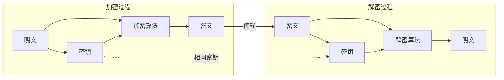

为什么 TLS 握手完成后，浏览器和服务器之间的数据传输用的是另一套密钥系统？

答案藏在一个看似矛盾的设计中：非对称加密（如 RSA、ECC）解决了密钥分发难题，但速度比对称加密慢 100~1000 倍。因此，现代加密系统采用**混合架构**：用非对称加密交换对称密钥，后续通信全部使用对称加密。

这是对称加密在现代密码学体系中的核心定位——用它来保护实际的数据传输。

## 对称加密的工作原理

对称加密的核心模型极为简洁：



加密过程：`C = E(K, P)`，其中 K 是密钥，P 是明文，C 是密文
解密过程：`P = D(K, C)`，其中 D 是解密算法

**关键约束**：发送方和接收方必须持有相同的密钥，且密钥必须保密。

## 分组密码 vs 流密码

对称加密算法分为两大类：分组密码（Block Cipher）和流密码（Stream Cipher）。

| 特性 | 分组密码 | 流密码 |
|------|----------|--------|
| **处理方式** | 固定长度分组（如 128 位） | 逐位或逐字节加密 |
| **典型算法** | AES、DES、SM4 | ChaCha20、RC4 |
| **输出长度** | 与输入长度相同 | 与输入长度相同 |
| **错误传播** | 一个比特错误影响整个分组 | 只影响该比特 |
| **适用场景** | 数据库加密、文件加密 | 网络通信、流媒体 |

### 分组密码的工作模式

由于明文通常比一个分组长，分组密码需要配合工作模式使用：

- **ECB（Electronic Codebook）**：每个分组独立加密，**有严重安全缺陷**（相同明文产生相同密文）
- **CBC（Cipher Block Chaining）**：使用 IV 链接分组
- **GCM（Galois/Counter Mode）**：提供认证加密，现代推荐
- **XTS**：磁盘加密专用

这些工作模式的详细内容将在 [AES 加密模式](/security/cryptography/aes-modes) 中深入讲解。

### 流密码的工作原理

流密码的核心思想是用密钥流（Keystream）与明文逐位 XOR：

```
Keystream:  101101001101...
Plaintext:  011010100111...
            XOR
Ciphertext: 110111101010...
```

流密码的关键是如何生成高质量的密钥流。ChaCha20 使用**伪随机数生成器**，基于密钥和 nonce（一次性数字）生成确定性的密钥流。

## AES 算法详解

AES（Advanced Encryption Standard）是目前最广泛使用的对称加密算法，2001 年被选为美国联邦标准，取代了 DES。

### AES 的基本参数

| 参数 | 值 |
|------|-----|
| **分组长度** | 128 位（16 字节） |
| **密钥长度** | 128 / 192 / 256 位 |
| **轮数** | 10 / 12 / 14（对应密钥长度） |
| **结构** | SP 网络（代换-置换网络） |

### AES 的核心操作

每轮 AES 包含四个步骤：

1. **SubBytes（字节代换）**：使用 S-Box 进行非线性变换，抗线性分析
2. **ShiftRows（行移位）**：对状态矩阵的行进行循环移位
3. **MixColumns（列混合）**：在 GF(2^8) 域上进行矩阵乘法
4. **AddRoundKey（轮密钥加）**：将轮密钥与状态 XOR

最后一轮不执行 MixColumns（等效解密）。

### AES 的密钥长度与安全强度

| 密钥长度 | 轮数 | 安全强度（传统计算机） | 安全强度（量子计算机） |
|----------|------|------------------------|------------------------|
| AES-128 | 10 | 2^128 operations | 2^64 operations（Grover） |
| AES-192 | 12 | 2^192 operations | 2^96 operations |
| AES-256 | 14 | 2^256 operations | 2^128 operations |

**量子计算的影响**：Grover 算法可以将暴力搜索复杂度降低一半。因此，AES-128 理论上可被量子计算机在 2^64 次操作内破解——这在现实中仍然是安全的，但考虑到「现在收集、未来解密」的威胁模型，建议使用 AES-256。

### 为什么 AES 仍然是安全的？

AES 的设计经受住了 20 多年的密码分析考验：

1. **没有已知的实用攻击**：对完整 AES 的最佳攻击需要 2^126 次操作（比暴力破解略好）
2. **侧信道攻击需要物理访问**：Timing Attack、Power Analysis 等需要攻击者接近设备
3. **简洁的设计**：AES 的设计非常简洁，容易审计，没有隐藏的后门

## ChaCha20 的设计优势

ChaCha20 是由 Daniel J. Bernstein 于 2008 年设计的流密码，后来被 IETF 标准化为 RFC 7539。

### ChaCha20 vs AES 的核心差异

| 特性 | AES | ChaCha20 |
|------|-----|----------|
| **硬件加速** | AES-NI 指令集（现代 CPU） | 软件实现 |
| **实现复杂度** | 需要查表（S-Box） | 仅需加法和移位 |
| **侧信道攻击面** | 查表操作可能泄露信息 | 无查表，抗侧信道 |
| **移动设备性能** | 需要专用硬件 | 软件实现更高效 |
| **设计简洁度** | 复杂 | 简单 |

### ChaCha20 的优势场景

**1. 没有 AES-NI 硬件的设备**

在低端 ARM 设备、物联网芯片上，AES 可能需要软件模拟，性能很差。ChaCha20 的软件实现可以达到 AES 硬件加速的水平。

**2. 侧信道攻击防护**

AES 的 S-Box 查表操作可能泄露密钥信息（通过缓存时序攻击）。ChaCha20 只使用加法、移位和 XOR 操作，没有查表操作，侧信道攻击面更小。

**3. 抗Nonce重复**

ChaCha20-Poly1305（带认证的版本）在Nonce重复时仍然安全，而某些 AES 模式（如 GCM）在Nonce重复时存在严重风险。

### ChaCha20 在 TLS 中的应用

TLS 1.3 的推荐密码套件之一是 `TLS_CHACHA20_POLY1305_SHA256`，它使用 ChaCha20 进行加密，Poly1305 进行认证。

## Java 实现示例

### AES 加密实现

```java title="AesEncryptor.java"
import javax.crypto.Cipher;
import javax.crypto.KeyGenerator;
import javax.crypto.SecretKey;
import javax.crypto.spec.GCMParameterSpec;
import javax.crypto.spec.SecretKeySpec;
import java.security.SecureRandom;
import java.util.Base64;

public class AesEncryptor {
    
    private static final int GCM_IV_LENGTH = 12; // 96 bits recommended
    private static final int GCM_TAG_LENGTH = 128; // bits
    
    /**
     * 生成随机 AES 密钥
     * 使用 AES-256 以抵御量子计算攻击
     */
    public static SecretKey generateKey() throws Exception {
        KeyGenerator keyGen = KeyGenerator.getInstance("AES");
        keyGen.init(256, new SecureRandom());
        return keyGen.generateKey();
    }
    
    /**
     * AES-GCM 加密
     * GCM 是现代推荐的认证加密模式
     */
    public static String encrypt(byte[] plaintext, SecretKey key) throws Exception {
        // 生成随机 IV
        byte[] iv = new byte[GCM_IV_LENGTH];
        new SecureRandom().nextBytes(iv);
        
        // 初始化 Cipher
        Cipher cipher = Cipher.getInstance("AES/GCM/NoPadding");
        GCMParameterSpec spec = new GCMParameterSpec(GCM_TAG_LENGTH, iv);
        cipher.init(Cipher.ENCRYPT_MODE, key, spec);
        
        // 加密
        byte[] ciphertext = cipher.doFinal(plaintext);
        
        // 将 IV 和密文拼接（IV 需要传递给解密方）
        byte[] combined = new byte[iv.length + ciphertext.length];
        System.arraycopy(iv, 0, combined, 0, iv.length);
        System.arraycopy(ciphertext, 0, combined, iv.length, ciphertext.length);
        
        return Base64.getEncoder().encodeToString(combined);
    }
    
    /**
     * AES-GCM 解密
     */
    public static byte[] decrypt(String encryptedData, SecretKey key) throws Exception {
        byte[] combined = Base64.getDecoder().decode(encryptedData);
        
        // 提取 IV
        byte[] iv = new byte[GCM_IV_LENGTH];
        byte[] ciphertext = new byte[combined.length - GCM_IV_LENGTH];
        System.arraycopy(combined, 0, iv, 0, iv.length);
        System.arraycopy(combined, iv.length, ciphertext, 0, ciphertext.length);
        
        // 解密
        Cipher cipher = Cipher.getInstance("AES/GCM/NoPadding");
        GCMParameterSpec spec = new GCMParameterSpec(GCM_TAG_LENGTH, iv);
        cipher.init(Cipher.DECRYPT_MODE, key, spec);
        
        return cipher.doFinal(ciphertext);
    }
}
```

### ChaCha20 加密实现

```java title="ChaCha20Encryptor.java"
import javax.crypto.Cipher;
import javax.crypto.SecretKey;
import javax.crypto.spec.ChaCha20ParameterSpec;
import javax.crypto.spec.SecretKeySpec;
import java.security.SecureRandom;
import java.util.Base64;

public class ChaCha20Encryptor {
    
    private static final int NONCE_LENGTH = 12; // IETF standard nonce
    
    /**
     * ChaCha20 加密
     * Java 11+ 原生支持
     */
    public static String encrypt(byte[] plaintext, SecretKey key, byte[] nonce) 
            throws Exception {
        if (nonce.length != NONCE_LENGTH) {
            throw new IllegalArgumentException("Nonce must be 12 bytes");
        }
        
        Cipher cipher = Cipher.getInstance("ChaCha20");
        ChaCha20ParameterSpec spec = new ChaCha20ParameterSpec(nonce, 0); // counter starts at 0
        cipher.init(Cipher.ENCRYPT_MODE, key, spec);
        
        byte[] ciphertext = cipher.update(plaintext);
        return Base64.getEncoder().encodeToString(ciphertext);
    }
    
    /**
     * ChaCha20 解密
     */
    public static byte[] decrypt(String encryptedData, SecretKey key, byte[] nonce) 
            throws Exception {
        byte[] ciphertext = Base64.getDecoder().decode(encryptedData);
        
        Cipher cipher = Cipher.getInstance("ChaCha20");
        ChaCha20ParameterSpec spec = new ChaCha20ParameterSpec(nonce, 0);
        cipher.init(Cipher.DECRYPT_MODE, key, spec);
        
        return cipher.update(ciphertext);
    }
    
    /**
     * 生成随机 Nonce
     * 每次加密必须使用新的 Nonce
     */
    public static byte[] generateNonce() {
        byte[] nonce = new byte[NONCE_LENGTH];
        new SecureRandom().nextBytes(nonce);
        return nonce;
    }
}
```

:::tip
**Nonce 重用是致命的**

Nonce（Number used once）是流密码的关键参数。每个密钥必须配对唯一的 Nonce 值。如果 nonce 重复，攻击者可以通过 XOR 两个密文来消除密钥流，从而获得两个明文的 XOR——这可能泄露大量信息。
:::

## 对称密钥的生成与管理

密钥生成是密码学系统中最关键的环节之一。

### 密钥生成的黄金法则

| 原则 | 说明 |
|------|------|
| **使用真随机数** | 必须使用 CSPRNG（Cryptographically Secure PRNG） |
| **足够的长度** | AES-256 是目前的推荐选择 |
| **不要自己实现** | 使用标准库，不要自己造轮子 |

### Java 中的安全随机数

```java title="SecureKeyGeneration.java"
import javax.crypto.KeyGenerator;
import javax.crypto.SecretKey;
import java.security.SecureRandom;
import java.security.KeyPairGenerator;

public class SecureKeyGeneration {
    
    /**
     * 生成 AES 密钥的正确方式
     */
    public static SecretKey generateAesKey(int keySize) throws Exception {
        KeyGenerator generator = KeyGenerator.getInstance("AES");
        generator.init(keySize, new SecureRandom());
        return generator.generateKey();
    }
    
    /**
     * 生成预主密钥（TLS 握手使用）
     */
    public static byte[] generatePremasterSecret() {
        byte[] premaster = new byte[48];
        new SecureRandom().nextBytes(premaster);
        return premaster;
    }
}
```

### 密钥存储的常见方式

| 存储方式 | 优点 | 缺点 | 适用场景 |
|----------|------|------|----------|
| **内存中** | 最安全（运行时密钥不可提取） | 重启后丢失 | 短期密钥、会话密钥 |
| **文件系统** | 简单易用 | 文件可能被盗 | 开发环境、低敏感场景 |
| **KeyStore/TrustStore** | Java 原生支持、受口令保护 | 管理复杂 | Java 应用 |
| **KMS** | 云原生、高可用、审计 | 依赖外部服务、有成本 | 生产环境 |
| **HSM** | 最高安全等级、防篡改 | 成本高、延迟 | 金融、政务 |

## 权衡矩阵：何时选择 AES vs ChaCha20

| 场景 | 推荐算法 | 理由 |
|------|----------|------|
| **通用场景** | AES-256-GCM | 硬件加速、广泛支持 |
| **低端移动设备** | ChaCha20-Poly1305 | 无需专用硬件 |
| **物联网设备** | ChaCha20 | 软件实现高效 |
| **侧信道敏感环境** | ChaCha20 | 无查表操作 |
| **需要 FIPS 认证** | AES | FIPS 140-2/3 认证 |
| **TLS 1.3 推荐** | AES-256-GCM 或 ChaCha20 | 两者都支持 |

## 思考题

**问题 1**：在数据库加密场景中，如果使用相同的密钥加密所有用户数据，会有什么安全风险？如何设计密钥管理策略来降低这种风险？

<details>
<summary>参考答案</summary>

**相同密钥加密所有数据的风险**：

1. **密钥泄露影响范围大**：一旦密钥泄露，所有用户数据都会被解密
2. **无法精确吊销**：无法单独吊销某个用户的数据访问权限
3. **密码分析风险**：相同密钥下，相同内容产生相同密文，可能泄露模式信息

**改进的密钥管理策略**：

1. **数据加密密钥（DEK）**：为每个用户或每组数据生成独立的 DEK
2. **密钥加密密钥（KEK）**：用 KEK 加密所有 DEK，KEK 存储在 HSM/KMS 中
3. **信封加密**：
   - 用 DEK 加密数据
   - 用 KEK 加密 DEK
   - 将加密后的 DEK 与密文一起存储

这样，即使某个 DEK 泄露，只影响该用户的数据；KEK 在 HSM 中，安全性更高。

</details>

**问题 2**：假设你发现公司系统还在使用 ECB 模式加密用户敏感信息，你会如何评估风险并提出改进方案？

<details>
<summary>参考答案</summary>

**ECB 模式的安全缺陷**：

ECB 模式下，相同的明文块总是产生相同的密文块。这意味着：
- 攻击者可以识别重复的模式（如固定格式的密码、盐值）
- 可能识别加密的协议结构
- 不能隐藏数据的位置和大小信息

**风险评估维度**：

1. **数据敏感性**：加密的是什么数据？（身份证、银行卡、生物特征？）
2. **攻击者能力**：攻击者能获取密文吗？（中间人、SQL注入、数据库拖库？）
3. **模式可识别性**：明文是否有固定格式？（如「卡号:」开头）

**改进方案**：

| 当前模式 | 推荐替换 | 原因 |
|----------|----------|------|
| AES-ECB | AES-GCM | GCM 提供认证加密，防止篡改 |
| AES-ECB | AES-CBC | CBC 隐藏模式，但无认证 |

**迁移步骤**：

1. 设计新的密钥（不要复用旧密钥）
2. 实现 AES-GCM 加密（包含 IV 和认证标签）
3. 重新加密历史数据（可能需要停机窗口）
4. 更新加密配置，禁用 ECB
5. 监控解密错误率，确保平滑切换

</details>

**问题 3**：为什么流密码（如 ChaCha20）的 Nonce 不能重复使用？如果 Nonce 重复了，攻击者可以做什么？

<details>
<summary>参考答案</summary>

**Nonce 重复的后果**：

流密码的加密过程是：`C = P XOR Keystream`

如果同一个密钥 K 下，Nonce1 和 Nonce2 相同，那么：
- `Keystream1 = Keystream2`（确定性算法）
- `C1 = P1 XOR Keystream`
- `C2 = P2 XOR Keystream`
- `C1 XOR C2 = P1 XOR P2`

攻击者得到的是两个明文的 XOR。

**攻击者可以做什么**：

1. **消除密钥流**：XOR 两个密文可以消除密钥流
2. **部分信息泄露**：如果知道其中一个明文，可以计算出另一个
3. **协议攻击**：许多协议有固定格式，攻击者可以利用这一点还原明文

**实际案例**：

WEP（Wired Equivalent Privacy）的崩溃就是因为 802.11 协议建议使用 IV（类似 Nonce），但 IV 空间太小（24 位），导致大量重复。攻击者收集足够的重复 IV 后，可以还原出密钥流，进而解密所有通信。

**正确做法**：

1. 每个加密会话使用唯一的 Nonce
2. Nonce 长度要足够（ChaCha20 用 96 位，重复概率极低）
3. 不要手动管理 Nonce，使用安全的随机数生成器

</details>
