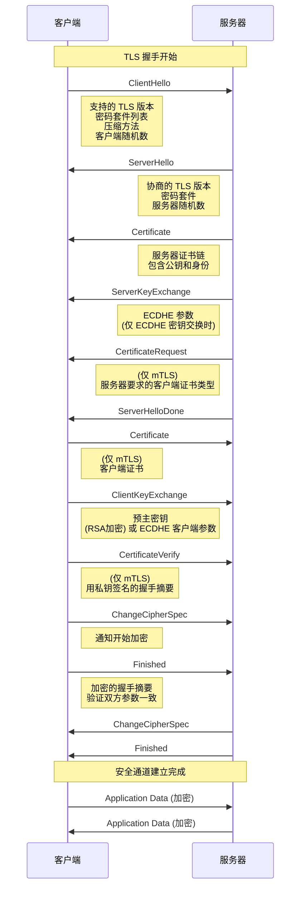
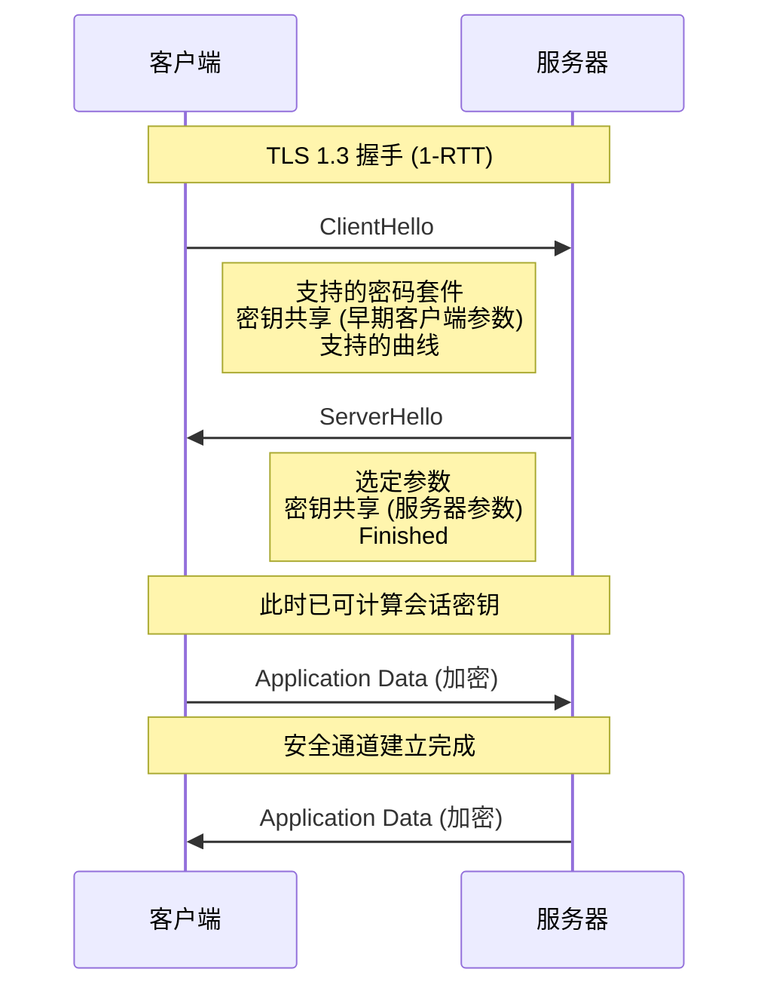
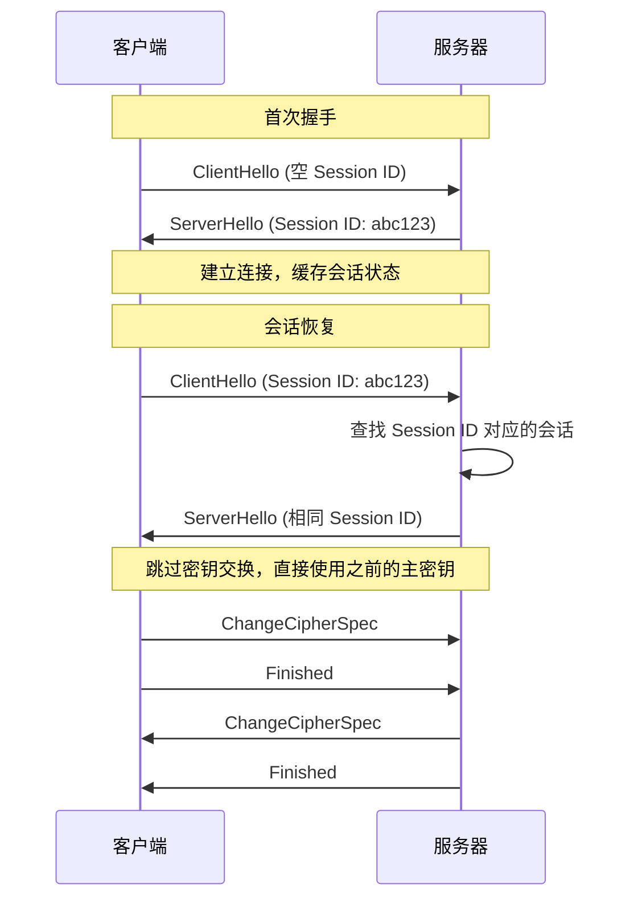
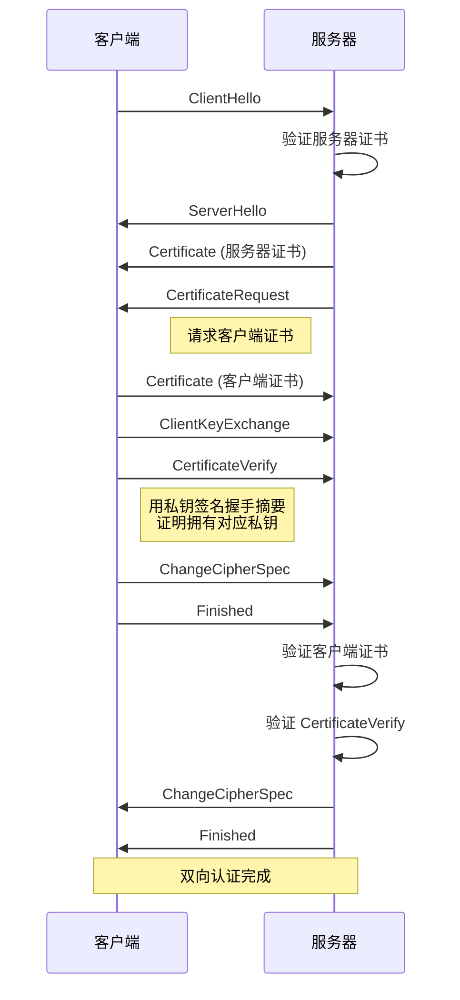

想象你第一次去银行开户。柜员会要求你出示身份证，验证你的身份，然后才能为你开设账户。这个「验证身份、建立信任」的过程，在 TLS 协议中被称为**握手（Handshake）**。

TLS 握手是建立安全连接的核心过程：在几毫秒到几秒内，客户端和服务器需要协商加密参数、验证身份、建立会话密钥。这个过程看似简单，背后却蕴含了密码学几十年的研究成果。

## TLS 1.2 握手流程详解

TLS 1.2 的完整握手需要两次网络往返（2-RTT）。



### 1. ClientHello

客户端发送 ClientHello 消息，这是握手的起点。

```java title="ClientHello 消息内容"
public class ClientHelloMessage {

    public static void main(String[] args) {
        System.out.println("===== ClientHello 消息结构 =====");
        System.out.println();

        System.out.println("1. TLS 版本: TLS 1.2");
        System.out.println("   - 告诉服务器客户端支持的最高版本");
        System.out.println();

        System.out.println("2. 客户端随机数 (32 字节)");
        System.out.println("   - 用于后续密钥派生");
        System.out.println("   - 必须是真随机 (SecureRandom)");
        System.out.println();

        System.out.println("3. Session ID");
        System.out.println("   - 空: 新建会话");
        System.out.println("   - 有值: 恢复已有会话");
        System.out.println();

        System.out.println("4. 密码套件列表 (按优先级排序)");
        System.out.println("   - TLS_ECDHE_RSA_WITH_AES_128_GCM_SHA256");
        System.out.println("   - TLS_ECDHE_RSA_WITH_AES_256_GCM_SHA384");
        System.out.println("   - ...");
        System.out.println();

        System.out.println("5. 压缩方法");
        System.out.println("   - null (TLS 1.3 已废弃压缩)");
        System.out.println();

        System.out.println("6. 扩展");
        System.out.println("   - SNI (Server Name Indication)");
        System.out.println("   - ALPN (应用协议协商)");
        System.out.println("   - 签名算法列表");
        System.out.println("   - ...");
    }
}
```

**SNI（Server Name Indication）**是一个关键扩展，因为同一个 IP 可能托管了多个网站：

```
Extension: server_name
  Server Name Indication (SNI):
    Server Name: www.example.com
```

### 2. ServerHello

服务器收到 ClientHello 后，选择双方都支持的参数，回复 ServerHello。

```java title="ServerHello 消息内容"
public class ServerHelloMessage {

    public static void main(String[] args) {
        System.out.println("===== ServerHello 消息结构 =====");
        System.out.println();

        System.out.println("1. TLS 版本: TLS 1.2");
        System.out.println("   - 实际协商的版本");
        System.out.println();

        System.out.println("2. 服务器随机数 (32 字节)");
        System.out.println("   - 参与会话密钥派生");
        System.out.println();

        System.out.println("3. Session ID");
        System.out.println("   - 新建会话时返回空");
        System.out.println("   - 支持会话恢复时返回会话 ID");
        System.out.println();

        System.out.println("4. 选定的密码套件");
        System.out.println("   - 例如: TLS_ECDHE_RSA_WITH_AES_128_GCM_SHA256");
        System.out.println();

        System.out.println("5. 选定的压缩方法");
        System.out.println("   - 通常是 null");
    }
}
```

### 3. 服务器证书

服务器必须证明自己的身份。证书包含服务器的公钥和 CA 的签名。

```java title="Certificate 消息结构"
public class CertificateMessage {

    public static void main(String[] args) {
        System.out.println("===== Certificate 消息结构 =====");
        System.out.println();

        System.out.println("证书链 (从叶证书到根证书):");
        System.out.println();
        System.out.println("1. 叶证书 (服务器证书)");
        System.out.println("   - Subject: CN=www.example.com");
        System.out.println("   - Subject Alternative Name: www.example.com");
        System.out.println("   - Public Key: 服务器公钥");
        System.out.println("   - Issuer: 中间 CA 或根 CA");
        System.out.println();

        System.out.println("2. 中间证书 (如果有)");
        System.out.println("   - 签署叶证书");
        System.out.println();

        System.out.println("3. 根证书 (通常不发送)");
        System.out.println("   - 浏览器已内置");
        System.out.println("   - 发送会增加握手延迟");
    }
}
```

### 4. ServerKeyExchange（ECDHE 时需要）

如果使用 ECDHE 密钥交换，服务器需要发送 ECDHE 参数。

```java title="ServerKeyExchange 消息"
public class ServerKeyExchangeMessage {

    public static void main(String[] args) {
        System.out.println("===== ServerKeyExchange 消息 (ECDHE) =====");
        System.out.println();

        System.out.println("ECDHE 参数:");
        System.out.println("1. 椭圆曲线: secp256r1 (P-256)");
        System.out.println();

        System.out.println("2. 服务器公钥点 (ECPoint)");
        System.out.println("   - 服务器随机生成私钥 d_s");
        System.out.println("   - 计算公钥 Q_s = d_s * G");
        System.out.println("   - 发送 Q_s");
        System.out.println();

        System.out.println("3. 签名");
        System.out.println("   - 用服务器私钥签名所有 ECDHE 参数");
        System.out.println("   - 防止 ECDHE 参数被篡改");
    }
}
```

### 5-8. 客户端响应与 Finished

客户端完成剩余的密钥交换步骤：

```java title="客户端密钥交换"
public class ClientKeyExchange {

    public static void main(String[] args) {
        System.out.println("===== ClientKeyExchange =====");
        System.out.println();

        System.out.println("RSA 密钥交换:");
        System.out.println("1. 客户端生成 48 字节 PreMasterSecret");
        System.out.println("2. 用服务器公钥加密 PreMasterSecret");
        System.out.println("3. 发送给服务器");
        System.out.println();

        System.out.println("ECDHE 密钥交换:");
        System.out.println("1. 客户端随机生成私钥 d_c");
        System.out.println("2. 计算公钥 Q_c = d_c * G");
        System.out.println("3. 发送 Q_c 给服务器");
        System.out.println("4. 双方计算共享密钥: d_c * Q_s = d_s * Q_c = P");
        System.out.println();
        System.out.println("关键: 服务器和客户端各自生成临时密钥对");
        System.out.println("私钥不传输，即使被截获也无法计算 P");
    }
}
```

### 会话密钥派生

握手双方使用「主密钥」派生所有会话密钥：

```java title="密钥派生流程"
import javax.crypto.KeyGenerator;
import javax.crypto.SecretKey;
import javax.crypto.spec.SecretKeySpec;
import java.security.MessageDigest;
import java.security.SecureRandom;
import java.util.Arrays;

public class KeyDerivation {

    public static void main(String[] args) throws Exception {
        // 握手阶段产生的材料
        byte[] clientRandom = new byte[32];
        byte[] serverRandom = new byte[32];
        byte[] preMasterSecret = new byte[48]; // RSA 方式
        // 或 ECDHE 共享密钥

        new SecureRandom().nextBytes(clientRandom);
        new SecureRandom().nextBytes(serverRandom);
        new SecureRandom().nextBytes(preMasterSecret);

        // 1. 生成主密钥 (Master Secret)
        // MasterSecret = PRF(pre_master_secret, "master secret", client_random + server_random)
        byte[] masterSecret = PRF(preMasterSecret, "master secret",
            concat(clientRandom, serverRandom), 48);
        System.out.println("主密钥: " + bytesToHex(masterSecret));

        // 2. 派生会话密钥
        byte[] keyBlock = PRF(masterSecret, "key expansion",
            concat(serverRandom, clientRandom), 192);

        // 3. 分割密钥块
        byte[] clientWriteMACKey = Arrays.copyOfRange(keyBlock, 0, 32);
        byte[] serverWriteMACKey = Arrays.copyOfRange(keyBlock, 32, 64);
        byte[] clientWriteKey = Arrays.copyOfRange(keyBlock, 64, 80);
        byte[] serverWriteKey = Arrays.copyOfRange(keyBlock, 80, 96);
        byte[] clientWriteIV = Arrays.copyOfRange(keyBlock, 96, 104);
        byte[] serverWriteIV = Arrays.copyOfRange(keyBlock, 104, 112);

        System.out.println("派生密钥: client_write_key, server_write_key, client_write_mac, server_write_mac");
    }

    private static byte[] PRF(byte[] secret, String label, byte[] seed, int length) {
        // TLS 1.2: HMAC-based PRF
        // TLS 1.3: HKDF
        return new byte[length]; // 简化
    }

    private static byte[] concat(byte[] a, byte[] b) {
        byte[] c = new byte[a.length + b.length];
        System.arraycopy(a, 0, c, 0, a.length);
        System.arraycopy(b, 0, c, a.length, b.length);
        return c;
    }

    private static String bytesToHex(byte[] bytes) {
        StringBuilder sb = new StringBuilder();
        for (byte b : bytes) sb.append(String.format("%02x", b));
        return sb.toString();
    }
}
```

## RSA 握手 vs ECDHE 握手

TLS 支持多种密钥交换方法，最常见的是 RSA 和 ECDHE。

```java title="两种密钥交换对比"
public class KeyExchangeComparison {

    public static void main(String[] args) {
        System.out.println("===== RSA vs ECDHE 握手对比 =====");
        System.out.println();

        System.out.println("| 特性 | RSA 密钥交换 | ECDHE 密钥交换 |");
        System.out.println("|------|--------------|----------------|");
        System.out.println("| 握手次数 | 2-RTT | 2-RTT (同) |");
        System.out.println("| 前向保密 | 不支持 | 支持 |");
        System.out.println("| 服务器负载 | 较低 | 较高 |");
        System.out.println("| 私钥作用 | 解密 PreMasterSecret | 签名 ECDHE 参数 |");
        System.out.println("| 私钥泄露风险 | 历史流量可解密 | 历史流量安全 |");
        System.out.println("| TLS 1.3 支持 | 已废弃 | 唯一支持 |");
        System.out.println();

        System.out.println("结论:");
        System.out.println("- 生产环境: 务必使用 ECDHE");
        System.out.println("- TLS 1.3: 仅支持 ECDHE");
    }
}
```

:::warning RSA 握手的安全隐患
RSA 握手的最大问题是**没有前向保密**：如果服务器的 RSA 私钥泄露，攻击者可以解密所有历史流量（包括那些「安全」记录下来的流量）。这就是为什么 TLS 1.3 完全禁止了 RSA 密钥交换。
:::

## TLS 1.3 的握手优化

TLS 1.3 对握手进行了重大优化，从 2-RTT 减少到 1-RTT。



### TLS 1.3 的核心改进

```java title="TLS 1.3 握手改进"
public class TLS13Improvements {

    public static void main(String[] args) {
        System.out.println("===== TLS 1.3 握手改进 =====");
        System.out.println();

        System.out.println("1. 1-RTT 握手");
        System.out.println("   - 客户端在 ClientHello 中直接发送密钥参数");
        System.out.println("   - 服务器可以立即计算出密钥");
        System.out.println();

        System.out.println("2. 0-RTT 恢复会话");
        System.out.println("   - 恢复会话时可直接发送加密数据");
        System.out.println("   - 但存在重放攻击风险");
        System.out.println("   - 仅适用于幂等请求");
        System.out.println();

        System.out.println("3. 密码套件简化");
        System.out.println("   - 仅指定 AEAD 算法 + 哈希");
        System.out.println("   - 如: TLS_AES_128_GCM_SHA256");
        System.out.println();

        System.out.println("4. 废弃不安全的算法");
        System.out.println("   - 静态 RSA/DH 密钥交换");
        System.out.println("   - CBC 模式加密");
        System.out.println("   - RC4、3DES、MD5、SHA-1");
        System.out.println();
    }
}
```

## 会话恢复机制

建立 TLS 连接的成本较高（一次完整的握手需要多次网络往返）。TLS 支持会话恢复，避免重复握手。

### Session ID 恢复



### Session Ticket 恢复

Session ID 的问题是服务器需要存储会话状态。使用 Session Ticket，状态存储在客户端。

```java title="Session Ticket 机制"
public class SessionTicketMechanism {

    public static void main(String[] args) {
        System.out.println("===== Session Ticket 机制 =====");
        System.out.println();

        System.out.println("首次握手:");
        System.out.println("1. 服务器生成加密的会话状态");
        System.out.println("2. 服务器发送 NewSessionTicket");
        System.out.println("3. 客户端存储 Session Ticket");
        System.out.println();

        System.out.println("会话恢复:");
        System.out.println("1. 客户端在 ClientHello 中携带 Session Ticket");
        System.out.println("2. 服务器解密 Ticket，恢复会话状态");
        System.out.println("3. 跳过密钥交换");
        System.out.println();

        System.out.println("优势:");
        System.out.println("- 服务器无需存储会话状态");
        System.out.println("- 适合分布式服务器集群");
        System.out.println("- 单点登录场景更友好");
    }
}
```

## mTLS 的握手差异

双向 TLS（mTLS）要求客户端也提供证书，握手流程会多一些步骤。



```java title="mTLS 握手关键差异"
public class MTLSHandshakeDifferences {

    public static void main(String[] args) {
        System.out.println("===== mTLS 握手关键差异 =====");
        System.out.println();

        System.out.println("服务器端变化:");
        System.out.println("1. 发送 CertificateRequest");
        System.out.println("   - supported_signature_algorithms: 支持的签名算法");
        System.out.println("   - certificate_authorities: 信任的 CA 列表");
        System.out.println();

        System.out.println("2. 验证客户端证书");
        System.out.println("   - 检查证书链");
        System.out.println("   - 检查证书用途 (clientAuth)");
        System.out.println("   - 检查 OCSP 状态");
        System.out.println();

        System.out.println("客户端变化:");
        System.out.println("1. 发送 Certificate");
        System.out.println("   - 客户端证书链");
        System.out.println();

        System.out.println("2. 发送 CertificateVerify");
        System.out.println("   - 签名: Handshake Messages 的哈希");
        System.out.println("   - 服务器用公钥验证签名");
        System.out.println("   - 证明客户端拥有对应私钥");
    }
}
```

## 握手失败的处理

TLS 握手可能因为各种原因失败，正确的错误处理至关重要。

```java title="常见握手失败原因"
public class HandshakeFailureReasons {

    public static void main(String[] args) {
        System.out.println("===== 常见握手失败原因 =====");
        System.out.println();

        System.out.println("| 错误类型 | 原因 | 解决方案 |");
        System.out.println("|----------|------|----------|");
        System.out.println("| 证书过期 | 服务器证书超过有效期 | 更新证书 |");
        System.out.println("| 证书链不完整 | 缺少中间 CA | 配置完整证书链 |");
        System.out.println("| 主机名不匹配 | CN/SAN 与访问域名不符 | 检查证书配置 |");
        System.out.println("| 不支持的 TLS 版本 | 客户端版本过低 | 升级客户端/服务器配置 |");
        System.out.println("| 密码套件不匹配 | 无共同支持的密码套件 | 检查服务器密码套件配置 |");
        System.out.println("| 客户端证书无效 | mTLS 客户端证书问题 | 检查客户端证书 |");
        System.out.println();

        System.out.println("调试建议:");
        System.out.println("1. 使用 openssl s_client -debug 连接");
        System.out.println("2. 检查握手流程和警报消息");
        System.out.println("3. 验证证书链: openssl s_client -showcerts");
    }
}
```

## 思考题

**问题 1**：TLS 握手过程中，客户端是如何验证服务器证书链的有效性的？
<details>
<summary>参考答案</summary>

客户端验证服务器证书链需要检查以下几个方面：

**1. 证书链完整性**
- 从叶证书开始，验证每个证书的签名是否由其「签发者」（Issuer）签发
- 递归验证直到根证书
- 根证书由客户端信任库（如操作系统或浏览器内置的 CA 根证书）提供

**2. 证书有效性**
- **时间验证**：检查 NotBefore 和 NotAfter，确认当前时间在有效期内
- **吊销检查**（可选）：通过 CRL（Certificate Revocation List）或 OCSP（Online Certificate Status Protocol）检查证书是否被吊销

**3. 证书用途验证**
- 检查 keyUsage 扩展，确认证书可用于 TLS 服务器认证（digitalSignature）
- 检查 extendedKeyUsage 扩展中的 serverAuth

**4. 主机名验证**
- 检查 Subject CN 或 Subject Alternative Name（SAN）是否与访问的域名匹配
- 支持通配符证书（如 `*.example.com`）

如果任何一步验证失败，TLS 连接将被拒绝。

```java
// 简化的证书验证逻辑
public boolean verifyCertificate(X509Certificate cert, TrustAnchor[] trustAnchors) {
    // 1. 构建证书链
    // 2. 验证每个证书的签名
    // 3. 检查有效期
    // 4. 检查吊销状态
    // 5. 检查主机名匹配
}
```
</details>

**问题 2**：TLS 1.3 的 0-RTT 恢复听起来很美，但为什么不是所有场景都推荐使用？
<details>
<summary>参考答案</summary>

TLS 1.3 的 0-RTT（Early Data）允许客户端在首次握手中就发送加密数据，显著降低延迟。但它引入了一个重要的安全风险：**重放攻击（Replay Attack）**。

**重放攻击的原理**：

1. 客户端向服务器发送 0-RTT 数据（通常是 HTTP GET 请求）
2. 攻击者截获这个加密的请求
3. 攻击者将相同的请求多次发送给服务器
4. 服务器每次都认为是有效的请求并执行

这对于**幂等操作**（如 GET 请求、只读操作）是可以接受的，但对于**非幂等操作**（如 POST 请求、转账操作）可能是灾难性的。

**缓解措施**：

1. **请求 ID + 状态验证**：服务器记录已处理的请求 ID，拒绝重复请求
2. **一次性令牌**：客户端在 0-RTT 数据中包含一次性令牌
3. **请求签名**：使用请求序列号或时间戳，服务器拒绝旧请求
4. **限制 0-RTT 的使用场景**：只在 GET 请求等幂等操作中使用

```java title="0-RTT 重放攻击防护"
public class ZeroRTTReplayProtection {

    public static void main(String[] args) {
        System.out.println("===== 0-RTT 重放攻击防护 =====");
        System.out.println();

        System.out.println("1. 请求 ID 去重");
        System.out.println("   - 服务端记录已处理的 early_data 请求 ID");
        System.out.println("   - 重复请求返回错误");
        System.out.println();

        System.out.println("2. 时间窗口限制");
        System.out.println("   - 仅接受一定时间窗口内的 0-RTT 请求");
        System.out.println("   - 降低重放的有效窗口");
        System.out.println();

        System.out.println("3. 限制使用场景");
        System.out.println("   - 仅对 GET/HEAD 请求启用 0-RTT");
        System.out.println("   - POST/PUT 等非幂等请求禁用 0-RTT");
        System.out.println();

        System.out.println("大多数 CDN 和 API 网关采用方式 1 + 3 的组合");
    }
}
```
</details>
