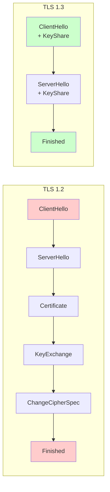
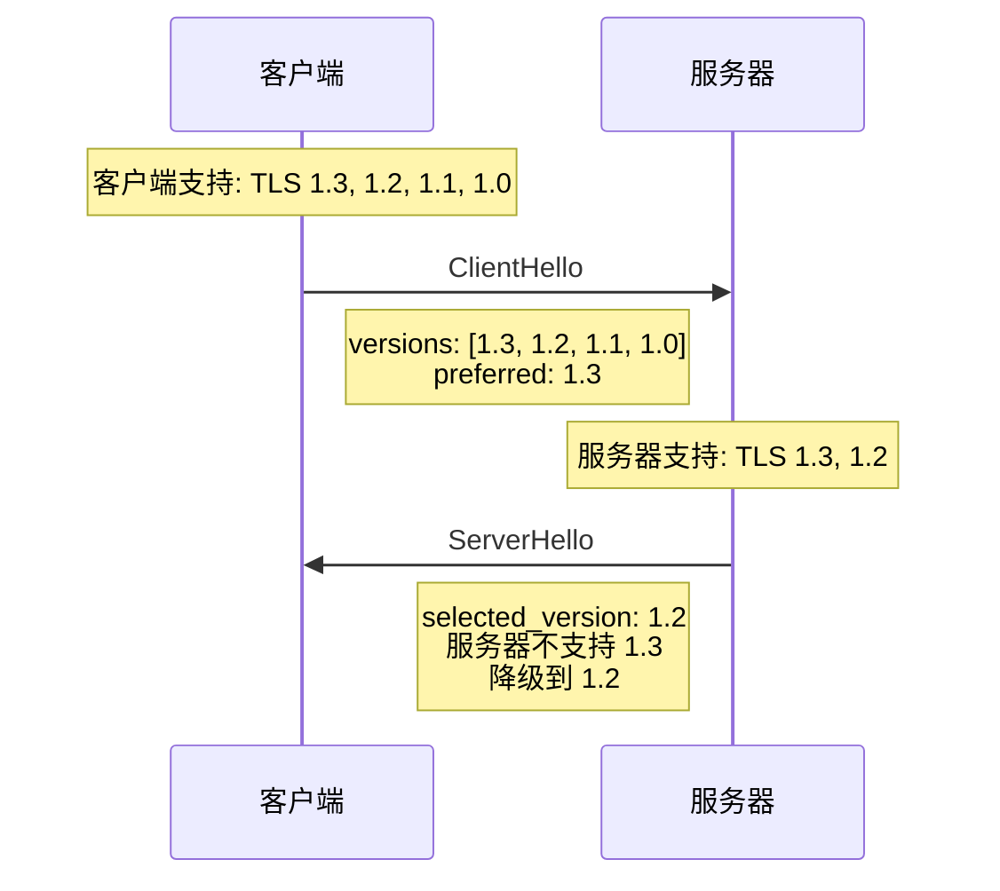

2014 年，一个名为「POODLE」的漏洞让整个互联网为之震动。使用 SSL 3.0 的浏览器，在特定条件下可能被攻击者降级到 SSL 3.0，然后被破解。这个漏洞让人们意识到：**一个三十年前设计的协议，在现代攻击面前是多么脆弱**。

TLS 协议的演进史，就是一部与时俱进的安全攻防史。从 SSL 3.0 到 TLS 1.3，每个版本的更迭都伴随着新的安全特性和对旧版本的逐步废弃。理解这些差异，是正确配置 TLS 的前提。

## TLS 1.0/1.1 的历史遗留问题

TLS 1.0 和 1.1 在设计时未能预见到后来的攻击手段，留下了多个安全隐患。

```java title="旧版本 TLS 的已知漏洞"
public class OldTLSVulnerabilities {

    public static void main(String[] args) {
        System.out.println("===== TLS 1.0/1.1 已知漏洞 =====");
        System.out.println();

        System.out.println("| 漏洞名称 | 公布年份 | 影响版本 | 攻击类型 |");
        System.out.println("|----------|----------|----------|----------|");
        System.out.println("| BEAST | 2011 | TLS 1.0 | 明文恢复 |");
        System.out.println("| POODLE | 2014 | SSL 3.0 | CBC 填充 |");
        System.out.println("| POODLE TLS | 2015 | TLS 1.0/1.1 | CBC 填充 |");
        System.out.println("| RC4 偏差攻击 | 2015 | TLS 1.0/1.1 | 恢复明文 |");
        System.out.println("| DROWN | 2016 | SSL 2.0 | 跨协议攻击 |");
        System.out.println("| ROBOT | 2017 | RSA 密钥交换 | 签名解密 |");
        System.out.println();

        System.out.println("TLS 1.0/1.1 于 2020 年被正式废弃");
    }
}
```

**BEAST 攻击**（Browser Exploit Against SSL/TLS）：利用 CBC 模式的预测性问题，在 TLS 1.0 中可以恢复部分明文（如 Cookie）。

**POODLE 攻击**（Padding Oracle On Downgraded Legacy Encryption）：利用 CBC 填充验证的侧信道泄漏，攻击者可以解密数据。

**ROBOT 攻击**（Return of Bleichenbacher's Oracle Threat）：利用 RSA 密钥交换中 PKCS#1 v1.5 填充的错误处理时序差异，逐步恢复 PreMasterSecret。

:::warning TLS 1.0/1.1 的现状
截至 2024 年，主流浏览器已完全禁用 TLS 1.0 和 1.1。PCI DSS 标准要求 2018 年后禁用 TLS 1.0。
:::

## TLS 1.2 的安全改进

TLS 1.2（2008 年发布）针对旧版本进行了多项安全改进：

**主要改进**：

1. **增强的握手扩展**：支持 SNI、ALPN 等扩展
2. **SHA-256 强制使用**：废弃 MD5/SHA-1 在握手签名中的使用
3. **更强的密码套件**：支持 AES-GCM、ChaCha20-Poly1305 等 AEAD 算法
4. **支持前向保密**：ECDHE 成为推荐密钥交换方式

```java title="TLS 1.2 典型配置"
public class TLS12CipherSuites {

    public static void main(String[] args) {
        System.out.println("===== TLS 1.2 推荐的密码套件 =====");
        System.out.println();

        System.out.println("ECDHE + RSA + AESGCM (主流):");
        System.out.println("- TLS_ECDHE_RSA_WITH_AES_128_GCM_SHA256");
        System.out.println("- TLS_ECDHE_RSA_WITH_AES_256_GCM_SHA384");
        System.out.println();

        System.out.println("ECDHE + ECDSA + AESGCM (现代):");
        System.out.println("- TLS_ECDHE_ECDSA_WITH_AES_128_GCM_SHA256");
        System.out.println("- TLS_ECDHE_ECDSA_WITH_AES_256_GCM_SHA384");
        System.out.println();

        System.out.println("ECDHE + AES + CHACHA20 (移动端优化):");
        System.out.println("- TLS_ECDHE_RSA_WITH_CHACHA20_POLY1305_SHA256");
        System.out.println("- TLS_ECDHE_ECDSA_WITH_CHACHA20_POLY1305_SHA256");
    }
}
```

## TLS 1.3 的核心改进

TLS 1.3（2018 年发布，RFC 8446）是 TLS 协议自 1999 年以来最大的一次修订。

### 1. 握手优化：从 2-RTT 到 1-RTT



TLS 1.3 在 ClientHello 中直接包含密钥共享参数，服务器可以立即计算会话密钥，将握手从 2-RTT 减少到 1-RTT。

### 2. 密码套件简化

TLS 1.2 的密码套件名称包含大量信息，但 TLS 1.3 大幅简化：

```java title="TLS 1.3 vs TLS 1.2 密码套件对比"
public class CipherSuiteComparison {

    public static void main(String[] args) {
        System.out.println("===== TLS 1.3 vs TLS 1.2 密码套件 =====");
        System.out.println();

        System.out.println("TLS 1.2 (复杂命名):");
        System.out.println("TLS_ECDHE_RSA_WITH_AES_128_GCM_SHA256");
        System.out.println("  - 密钥交换: ECDHE");
        System.out.println("  - 认证算法: RSA");
        System.out.println("  - 加密算法: AES-128-GCM");
        System.out.println("  - MAC 算法: SHA-256");
        System.out.println();

        System.out.println("TLS 1.3 (简化命名):");
        System.out.println("TLS_AES_128_GCM_SHA256");
        System.out.println("  - 加密算法: AES-128-GCM");
        System.println("  - 哈希算法: SHA-256");
        System.out.println("  - 密钥交换: 通过扩展协商 (默认 ECDHE)");
        System.out.println();

        System.out.println("TLS 1.3 支持的密码套件只有 5 个:");
        System.out.println("1. TLS_AES_128_GCM_SHA256");
        System.out.println("2. TLS_AES_256_GCM_SHA384");
        System.out.println("3. TLS_CHACHA20_POLY1305_SHA256");
        System.out.println("4. TLS_AES_128_CCM_SHA256");
        System.out.println("5. TLS_AES_128_CCM_8_SHA256");
    }
}
```

### 3. 废弃不安全的密码套件

TLS 1.3 明确禁止了以下机制：

| 废弃内容 | 原因 |
| --- | --- |
| 静态 RSA 密钥交换 | 无前向保密，私钥泄露可解密历史流量 |
| 静态 DH 密钥交换 | 无前向保密 |
| 3DES | 64 位块大小，易受 Sweet32 攻击 |
| RC4 | 偏差攻击可恢复明文 |
| MD5 | 碰撞攻击 |
| SHA-1 | 碰撞攻击 |
| CBC 模式 | BEAST、POODLE 等填充攻击 |
| RSA PKCS#1 v1.5 填充 | Bleichenbacher 攻击家族 |
| 压缩 | CRIME、BREACH 等压缩侧信道攻击 |

### 4. 前向保密强制要求

TLS 1.3 只支持 ECDHE（和后量子密钥交换），所有连接都默认具有前向保密。

```java title="TLS 1.3 前向保密保证"
public class ForwardSecrecyGuarantee {

    public static void main(String[] args) {
        System.out.println("===== TLS 1.3 前向保密保证 =====");
        System.out.println();

        System.out.println("前向保密 (PFS) 的含义:");
        System.out.println("- 即使服务器长期私钥泄露");
        System.out.println("- 攻击者也无法解密之前捕获的加密流量");
        System.out.println();

        System.out.println("TLS 1.3 的实现方式:");
        System.out.println("1. 每次会话使用临时的 ECDHE 密钥对");
        System.out.println("2. 临时私钥在会话结束后销毁");
        System.out.println("3. 服务器长期私钥只用于签名");
        System.out.println();

        System.out.println("数学保证:");
        System.out.println("- 攻击者需要知道会话的 ECDHE 共享密钥");
        System.out.println("- 这需要知道客户端或服务器的临时私钥");
        System.out.println("- 临时私钥已销毁，无法获取");
        System.out.println("- ECDLP 难题保证了安全性");
    }
}
```

### 5. 0-RTT 恢复会话

TLS 1.3 支持 0-RTT 恢复，客户端可以在首次握手中发送数据：

```java title="0-RTT 机制"
public class ZeroRTTMechanism {

    public static void main(String[] args) {
        System.out.println("===== TLS 1.3 0-RTT 机制 =====");
        System.out.println();

        System.out.println("工作原理:");
        System.out.println("1. 客户端在 ClientHello 中包含 PSK (Pre-Shared Key)");
        System.out.println("2. 服务器确认 PSK 后，直接使用派生密钥加密数据");
        System.out.println("3. 客户端可以立即发送应用数据，无需等待服务器响应");
        System.out.println();

        System.out.println("应用场景:");
        System.out.println("- HTTPS 重连: 减少约 50% 的延迟");
        System.out.println("- 物联网设备: 降低连接建立开销");
        System.out.println();

        System.out.println("注意事项:");
        System.out.println("- 存在重放攻击风险");
        System.out.println("- 仅适用于幂等请求");
        System.out.println("- 不应用于敏感写操作");
    }
}
```

## TLS 1.3 的兼容性问题

尽管 TLS 1.3 更好，但仍有兼容性问题需要注意。

### 中间设备兼容性问题

```java title="中间设备兼容性问题"
public class MiddleboxCompatibility {

    public static void main(String[] args) {
        System.out.println("===== TLS 1.3 中间设备兼容性问题 =====");
        System.out.println();

        System.out.println("问题来源:");
        System.out.println("- 企业防火墙/代理可能检查 TLS 握手包");
        System.out.println("- 它们可能不理解 TLS 1.3 的新行为");
        System.out.println();

        System.out.println("常见问题:");
        System.out.println("1. 中间设备认为 TLS 1.3 的握手异常，阻断连接");
        System.out.println("2. 某些设备不理解 0-RTT，丢弃 Early Data");
        System.out.println("3. 某些设备强制降级到 TLS 1.2");
        System.out.println();

        System.out.println("解决方案:");
        System.out.println("- 使用 TLS 1.3 兼容模式（延迟 0-RTT）");
        System.out.println("- 在防火墙配置白名单");
        System.out.println("- 监控握手失败率");
    }
}
```

### 客户端兼容性问题

```java title="TLS 版本支持情况"
public class ClientCompatibility {

    public static void main(String[] args) {
        System.out.println("===== TLS 版本客户端支持情况 =====");
        System.out.println();

        System.out.println("TLS 1.3 支持 (截至 2024):");
        System.out.println("- Chrome 117+");
        System.out.println("- Firefox 115+");
        System.out.println("- Safari 14.1+");
        System.out.println("- iOS 14+");
        System.out.println("- Android 10+");
        System.out.println();

        System.out.println("配置建议:");
        System.out.println("1. 优先使用 TLS 1.3");
        System.out.println("2. TLS 1.2 作为后备");
        System.out.println("3. 完全禁用 TLS 1.0/1.1");
        System.out.println("4. 使用现代密码套件");
    }
}
```

## 密码套件命名规则

理解密码套件命名是正确配置 TLS 的基础。

```java title="密码套件命名解析"
public class CipherSuiteNaming {

    public static void main(String[] args) {
        System.out.println("===== TLS 1.2 密码套件命名规则 =====");
        System.out.println();

        System.out.println("格式: TLS_密钥交换_认证_WITH_加密_MAC");
        System.out.println();

        System.out.println("示例: TLS_ECDHE_RSA_WITH_AES_128_GCM_SHA256");
        System.out.println("  - TLS_: 协议前缀");
        System.out.println("  - ECDHE: ECDHE-RSA 密钥交换");
        System.out.println("  - RSA: RSA 签名认证");
        System.out.println("  - WITH_: 连接符");
        System.out.println("  - AES_128_GCM: AES-128-GCM 对称加密");
        System.out.println("  - SHA256: SHA-256 哈希/PRF");
        System.out.println();

        System.out.println("密钥交换算法:");
        System.out.println("- RSA: RSA 密钥交换 (已废弃)");
        System.out.println("- DHE: 临时 DH");
        System.out.println("- ECDHE: 临时 ECDH");
        System.out.println();

        System.out.println("认证算法:");
        System.out.println("- RSA: RSA 证书");
        System.out.println("- ECDSA: ECDSA 证书");
        System.out.println("- DHE: 无证书认证");
        System.out.println();

        System.out.println("加密算法:");
        System.out.println("- AES_128_GCM: AES-128-GCM (AEAD)");
        System.out.println("- AES_256_GCM: AES-256-GCM (AEAD)");
        System.out.println("- CHACHA20_POLY1305: ChaCha20-Poly1305 (AEAD)");
        System.out.println("- 3DES: 3DES (已废弃)");
        System.out.println("- RC4: RC4 (已废弃)");
    }
}
```

## 如何在服务器上启用 TLS 1.3

### Nginx 配置

```nginx title="Nginx TLS 配置"
server {
    listen 443 ssl http2;

    # 证书配置
    ssl_certificate /path/to/certificate.pem;
    ssl_certificate_key /path/to/private.key;

    # TLS 版本配置
    ssl_protocols TLSv1.2 TLSv1.3;

    # TLS 1.3 密码套件 (最高优先级)
    ssl_ciphers 'TLS_AES_256_GCM_SHA384:TLS_CHACHA20_POLY1305_SHA256:TLS_AES_128_GCM_SHA256';

    # TLS 1.2 密码套件 (后备)
    ssl_ciphers 'ECDHE-ECDSA-AES128-GCM-SHA256:ECDHE-RSA-AES128-GCM-SHA256:ECDHE-ECDSA-AES256-GCM-SHA384:ECDHE-RSA-AES256-GCM-SHA384';

    # ECDH 曲线
    ssl_ecdh_curve secp384r1:secp256r1;

    # OCSP Stapling
    ssl_stapling on;
    ssl_stapling_verify on;

    # HSTS
    add_header Strict-Transport-Security "max-age=31536000; includeSubDomains; preload" always;
}
```

### Java 配置

```java title="Java TLS 1.3 配置"
public class JavaTLS13Config {

    public static void main(String[] args) throws Exception {
        SSLContext sslContext = SSLContexts.custom()
            .setProtocol("TLSv1.3")
            .setSecureRandom(new SecureRandom())
            .build();

        SSLParameters params = sslContext.getSupportedSSLParameters();
        params.setProtocols(new String[]{"TLSv1.3", "TLSv1.2"});

        // TLS 1.3 密码套件
        params.setCipherSuites(new String[]{
            "TLS_AES_256_GCM_SHA384",
            "TLS_CHACHA20_POLY1305_SHA256",
            "TLS_AES_128_GCM_SHA256"
        });

        System.out.println("Java 已原生支持 TLS 1.3");
        System.out.println("JDK 11+ 默认启用 TLS 1.3");
    }
}
```

## 版本协商机制

客户端在 ClientHello 中声明支持的最高版本，服务器选择双方都支持的最高版本。



```java title="版本协商说明"
public class VersionNegotiation {

    public static void main(String[] args) {
        System.out.println("===== TLS 版本协商机制 =====");
        System.out.println();

        System.out.println("TLS 1.3 之前的协商 (向下兼容):");
        System.out.println("1. 客户端在 ClientHello 中声明支持的最高版本");
        System.out.println("2. 服务器选择双方都支持的版本");
        System.out.println("3. 如果服务器不支持 1.3，自动降级");
        System.out.println();

        System.out.println("TLS 1.3 的版本列表扩展:");
        System.out.println("1. 客户端使用 'supported_versions' 扩展");
        System.out.println("2. 列出所有支持的版本，按优先级排序");
        System.out.println("3. 服务器在响应中指定选定的版本");
        System.out.println();

        System.out.println("降级检测:");
        System.out.println("- TLS 1.3 服务器降级到 1.2 时");
        System.out.println("- 在 ServerRandom 中插入特殊标记");
        System.out.println("- 客户端检测到标记，知道发生了降级");
        System.out.println("- 防止降级攻击");
    }
}
```

## 权衡矩阵表

| 场景 | 推荐配置 | 原因 |
| --- | --- | --- |
| 新建系统 | TLS 1.3 only | 最新、最安全 |
| 需要兼容旧客户端 | TLS 1.3 + TLS 1.2 | 兼容优先 |
| 企业内网 | TLS 1.2 + 现代密码套件 | 性能优先 |
| 移动应用 | TLS 1.3 + CHACHA20 | 省电优化 |
| IoT 设备 | TLS 1.2 + ECDHE | 兼容性 |
| 高安全场景 | TLS 1.3 + P-256/P-384 | 最高安全 |

## 思考题

**问题 1**：为什么 TLS 1.3 要完全废弃 RSA 密钥交换？这导致了什么问题？
<details>
<summary>参考答案</summary>

TLS 1.3 废弃 RSA 密钥交换的核心原因是**缺乏前向保密（Forward Secrecy）**。

**RSA 密钥交换的问题**：

1. 客户端用服务器的公钥加密 PreMasterSecret
2. 只有服务器能用私钥解密
3. 看起来安全，但...

**隐患**：

1. 如果攻击者记录了加密流量
2. 多年后，服务器私钥泄露（服务器被入侵、员工拷贝、退役设备）
3. 攻击者用泄露的私钥解密所有历史流量

这就是「先记录，后解密」（Store-now-decrypt-later）攻击。虽然看似遥远，但对高价值数据（金融记录、医疗数据、国家机密）来说是现实威胁。

**TLS 1.3 的解决**：

1. 强制使用 ECDHE 密钥交换
2. 每次会话生成临时的 ECDHE 密钥对
3. 会话结束后，临时私钥销毁
4. 即使长期私钥泄露，攻击者也无法获取历史会话密钥

**废弃后的影响**：

1. 某些旧系统（不支持 ECDHE）无法连接
2. 服务器证书可以只用签名功能，不需要解密功能
3. 这实际上简化了证书使用

TLS 1.3 只支持 ECDHE，意味着所有连接都默认具有前向保密。
</details>

**问题 2**：TLS 1.3 禁止了压缩算法，为什么？这对性能有什么影响？
<details>
<summary>参考答案</summary>

TLS 1.3 禁止压缩有两个核心原因：**侧信道攻击风险**和**压缩比增益有限**。

**压缩带来的安全风险**：

1. **CRIME 攻击**（2012）：利用压缩的上下文信息泄露 Cookie 内容。攻击者通过观察密文长度变化，推断出明文中是否包含特定字符序列。

2. **BREACH 攻击**（2013）：利用 HTTP 压缩泄露敏感数据。攻击者构造大量请求，通过观察响应密文长度变化，逐步推断出隐藏的秘密（如 CSRF token）。

3. **攻击原理**：压缩会在密文中保留明文的统计特征。如果明文中包含攻击者可以控制的部分（如 URL 参数），通过构造请求并观察密文长度，可以推断出其他敏感内容（如 Cookie）。

**性能影响**：

压缩的带宽节省通常在 30-60%，但现代网络带宽已经非常充足。TLS 1.3 的 1-RTT 优化带来的延迟收益远大于压缩的带宽收益。

| 特性 | 压缩 | TLS 1.3 |
| --- | --- | --- |
| 带宽节省 | 30-60% | 无 |
| 延迟影响 | 增加处理时间 | 减少 RTT |
| 安全性 | 引入 CRIME/BREACH 风险 | 更安全 |

**实际影响**：大多数现代 HTTPS 流量已经是压缩的（gzip/brotli 在应用层），TLS 层的压缩是冗余的。禁用 TLS 压缩不会对实际用户体验产生可感知的影响。
</details>
