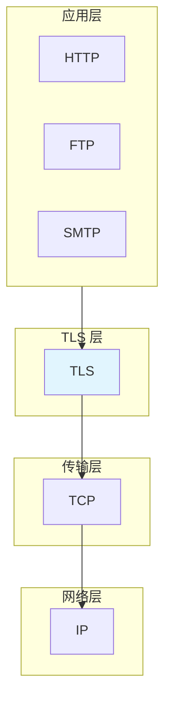
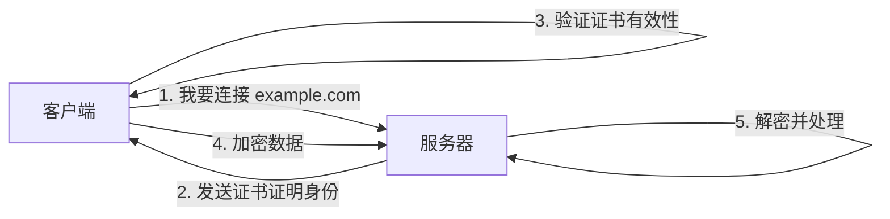
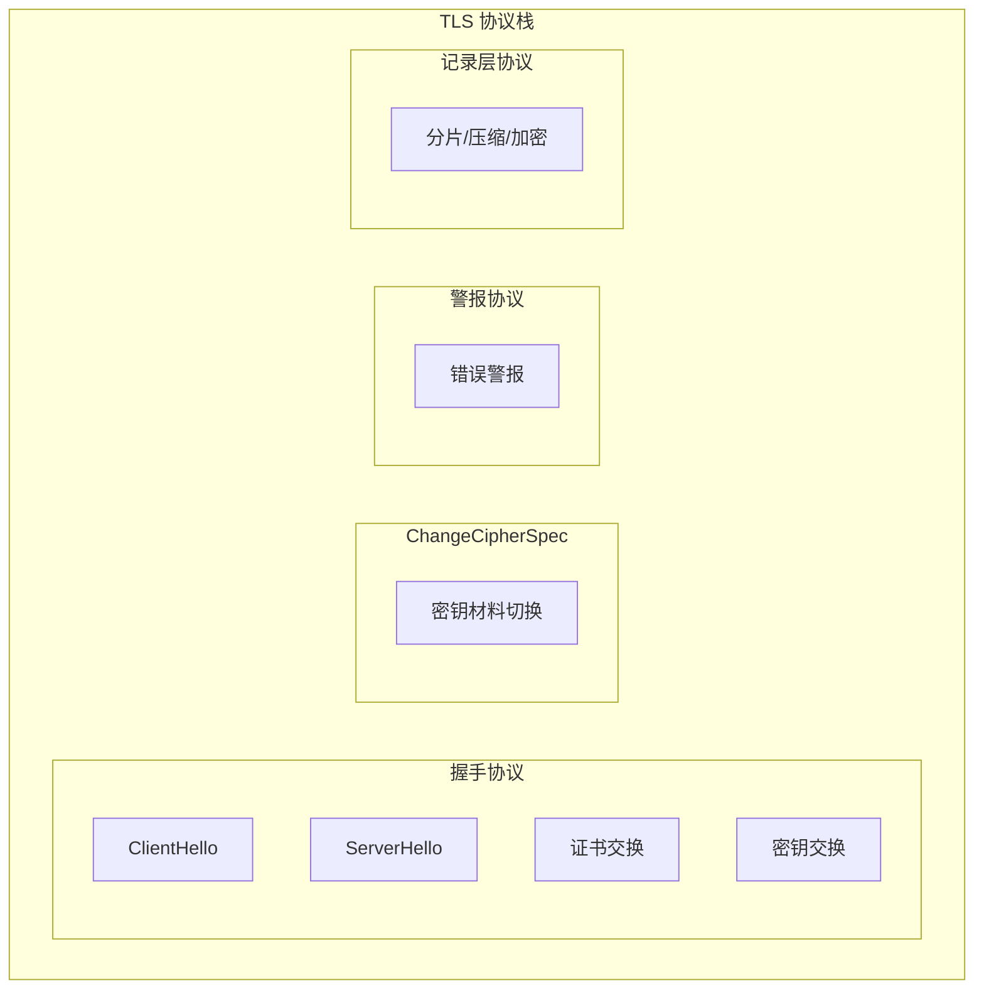
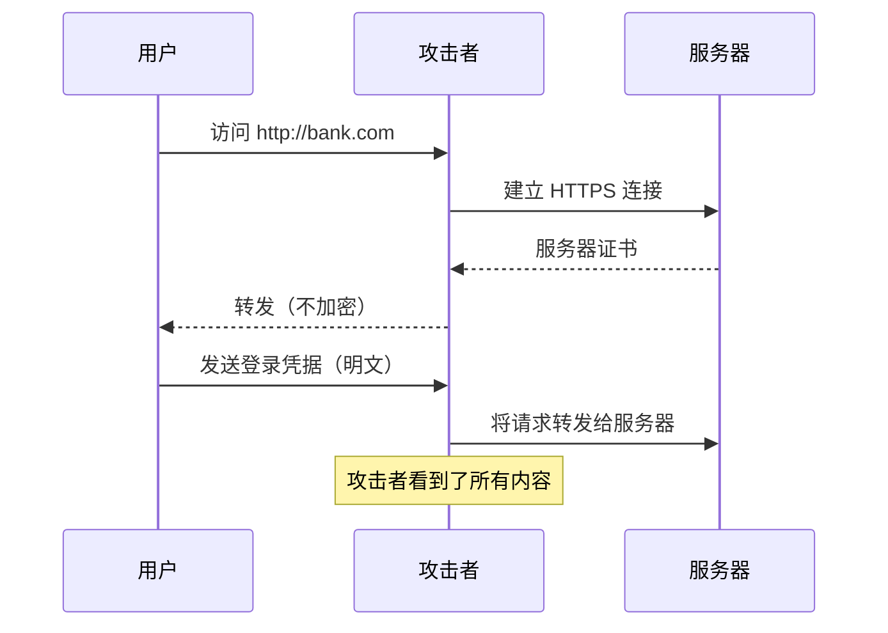

1994 年，网景公司推出了 SSL 2.0，意图在 TCP 和 HTTP 之间加上一层安全保护。那个年代的互联网几乎是明文传输：你在网页上输入的密码、银行账户信息，在网络传输过程中一览无余。SSL 的出现，标志着互联网安全通信时代的开端。

三十年后的今天，TLS（SSL 的后继者）已经无处不在。当你访问任何 HTTPS 网站时，背后都是 TLS 协议在默默工作——它保护着你的密码、银行卡信息、私人聊天，以及几乎所有的敏感数据。但 TLS 到底是什么？它为什么能保护数据？它的保护是如何实现的？

## TLS 在协议栈中的位置

理解 TLS，首先要理解它在整个网络协议栈中的位置。



TLS 位于**传输层和应用层之间**，对应用层协议是透明的。这意味着 HTTP 不需要知道 TLS 的存在，它只需要把数据交给 TLS，TLS 负责加密和传输。这使得 TLS 可以保护任何基于 TCP 的协议（HTTP、SMTP、FTP 等），而不仅仅是 HTTP。

## TLS 的演进历史

TLS 的历史是一部不断打补丁、不断升级的攻防史。

| 版本 | 年份 | 状态 | 主要问题 |
| --- | --- | --- | --- |
| SSL 2.0 | 1994 | 已废弃 | 大量安全漏洞 |
| SSL 3.0 | 1996 | 已废弃 | POODLE 攻击 |
| TLS 1.0 | 1999 | 已废弃 | BEAST 攻击 |
| TLS 1.1 | 2006 | 已废弃 | 多种 CBC 模式攻击 |
| TLS 1.2 | 2008 | **主流使用** | 正在被 1.3 替代 |
| TLS 1.3 | 2018 | **推荐使用** | - |

:::warning 为什么还在使用 TLS 1.2？
TLS 1.3 虽然更好，但 TLS 1.2 仍有大量部署。系统应同时支持两者，但优先使用 1.3。
:::

## TLS 的核心功能

TLS 提供三个核心安全功能，缺一不可。

### 1. 加密（Confidentiality）

加密保证数据在传输过程中不被窃听。即使攻击者能截获网络数据包，也只能看到密文，无法获取原始内容。

TLS 使用**对称加密**进行数据加密（因为速度快），但对称密钥需要安全地传递给对方——这通过**密钥交换**实现。

### 2. 完整性保护（Integrity）

完整性保护保证数据不被篡改。攻击者即使能截获并修改密文，接收方也能检测到篡改。

TLS 使用 **MAC（Message Authentication Code）** 或 **AEAD（Authenticated Encryption with Associated Data）** 机制实现完整性保护。

### 3. 身份认证（Authentication）

身份认证保证通信的对方确实是声称的实体。服务器必须证明自己拥有证书对应的私钥，客户端才能信任这个服务器。

可选地，TLS 也支持**双向认证**（mTLS），即客户端也需要证明自己的身份。



## TLS 的分层架构

TLS 协议由四个子协议组成：



### 记录层协议

TLS 记录层负责数据的封装和传输，是 TLS 的底层基础设施。

**记录层处理流程**：

1. **分片（Fragmentation）**：将上层消息切分为小于 16384 字节的片段
2. **压缩（Compression）**：可选，使用握手阶段协商的压缩算法
3. **计算 MAC**：使用会话密钥计算消息认证码
4. **加密**：使用会话密钥和协商的加密算法加密数据
5. **添加首部**：添加 TLS 记录首部（类型、版本、长度）

```java title="TLS 记录层处理流程"
public class TLSRecordLayerSimulator {

    public static void main(String[] args) {
        System.out.println("===== TLS 记录层处理流程 =====");
        System.out.println();

        // 模拟 TLS 1.2 记录
        byte[] applicationData = "GET /api/user HTTP/1.1\r\n".getBytes();

        System.out.println("1. 原始数据: " + applicationData.length + " 字节");

        // 分片：每个片段最大 16384 字节
        int maxFragmentSize = 16384;
        System.out.println("2. 分片后: " + (applicationData.length / maxFragmentSize + 1) + " 个片段");

        // 压缩（TLS 1.3 已废弃压缩）
        byte[] compressed = compress(applicationData);
        System.out.println("3. 压缩后: " + compressed.length + " 字节");

        // 计算 MAC
        byte[] mac = calculateMAC(applicationData);
        System.out.println("4. MAC: " + mac.length + " 字节");

        // AEAD 加密（TLS 1.3）
        byte[] ciphertext = encryptAEAD(applicationData, mac);
        System.out.println("5. 加密后: " + ciphertext.length + " 字节");

        // 添加 TLS 记录首部
        byte[] record = addRecordHeader(ciphertext, ContentType.APPLICATION_DATA);
        System.out.println("6. TLS 记录: " + record.length + " 字节");
    }
}
```

## 对称加密在 TLS 中的使用

TLS 选择对称加密进行数据传输，原因是**对称加密比非对称加密快得多**。

性能对比：

| 操作 | RSA-2048 | AES-128 |
| --- | --- | --- |
| 加密速度 | ~50 KB/s | ~100 MB/s |
| 解密速度 | ~2 MB/s | ~100 MB/s |
| 密钥长度 | 2048 位 | 128 位 |

对称加密比非对称加密快 **2000 倍以上**，因此 TLS 在握手阶段使用非对称加密安全地传递对称密钥，之后的数据传输全部使用对称加密。

```java title="对称加密 vs 非对称加密性能对比"
public class EncryptionPerformance {

    public static void main(String[] args) throws Exception {
        System.out.println("===== 加密性能对比 =====");
        System.out.println();

        // 模拟数据量
        int dataSize = 10 * 1024 * 1024; // 10 MB

        // RSA 加密 10MB 数据
        System.out.println("传输 10MB 数据：");
        System.out.println("- RSA-2048 对称密钥加密: ~0.1 秒");
        System.out.println("- RSA-2048 直接加密数据: ~200 秒（不可接受）");
        System.out.println();
        System.out.println("这就是为什么 TLS 先用 RSA 交换密钥，");
        System.out.println("然后用 AES 等对称算法加密实际数据。");
    }
}
```

## TLS 密码套件

TLS 使用「密码套件」来协商加密参数。一个密码套件指定了：

- 密钥交换算法（如 ECDHE、RSA）
- 签名算法（如 ECDSA、RSA）
- 对称加密算法（如 AES-128-GCM）
- MAC 算法（如 SHA-256）
- PRF 算法（伪随机函数）

```java title="密码套件解析"
public class CipherSuiteParser {

    public static void main(String[] args) {
        // TLS_ECDHE_RSA_WITH_AES_128_GCM_SHA256
        String cipherSuite = "TLS_ECDHE_RSA_WITH_AES_128_GCM_SHA256";

        System.out.println("密码套件: " + cipherSuite);
        System.out.println();

        String[] parts = cipherSuite.replace("TLS_", "").split("_WITH_");
        String keyExchange = parts[0].split("_");
        String[] cipher = parts[1].split("_");

        System.out.println("密钥交换: " + keyExchange[0] + " (" + keyExchange[1] + ")");
        System.out.println("对称加密: " + cipher[0] + "-" + cipher[1] + "-" + cipher[2]);
        System.out.println("MAC/哈希: " + cipher[3]);
        System.out.println();

        // TLS 1.3 密码套件
        System.out.println("TLS 1.3 密码套件（更简洁）:");
        System.out.println("TLS_AES_128_GCM_SHA256");
        System.out.println("- 仅指定加密算法 + 哈希");
        System.out.println("- 密钥交换通过扩展协商");
    }
}
```

## TLS 警报协议

TLS 警报协议用于传递错误信息。警报分为两个级别：

**关闭警报（Close Notify）**：通知对方连接将关闭，这是 TLS 连接的正常关闭方式。

**错误警报**：通知对方发生了错误，不同的错误码有不同的严重程度。

| 警报类型 | 说明 |
| --- | --- |
| unexpected_message | 收到不预期的消息 |
| bad_record_mac | MAC 验证失败，可能被篡改 |
| handshake_failure | 握手协商失败 |
| illegal_parameter | 非法参数 |
| certificate_expired | 证书过期 |
| certificate_unknown | 证书不受信任 |
| fatal 级别 | 导致连接立即断开 |

```java title="TLS 警报处理"
public class TLSAlertHandler {

    public static void main(String[] args) {
        System.out.println("===== TLS 警报级别 =====");
        System.out.println();

        System.out.println("| 警报 | 级别 | 含义 |");
        System.out.println("|------|------|------|");
        System.out.println("| close_notify | warning | 正常关闭连接 |");
        System.out.println("| unexpected_message | fatal | 协议错误 |");
        System.out.println("| bad_record_mac | fatal | 数据被篡改 |");
        System.out.println("| handshake_failure | fatal | 握手失败 |");
        System.out.println("| certificate_expired | warning/fatal | 证书过期 |");
        System.out.println();

        System.out.println("warning 级别警报不会终止连接");
        System.out.println("fatal 级别警报会立即终止连接");
    }
}
```

## TLS 的威胁模型

理解 TLS 能防御什么、不能防御什么，是正确使用 TLS 的前提。

### TLS 能防御的威胁

**窃听（Eavesdropping）**：攻击者无法读取传输的数据内容（加密保护）。

**篡改（Tampering）**：攻击者无法修改数据而不被发现（完整性保护）。

**中间人攻击（MITM）**：在正确配置下，攻击者无法伪装成服务器（身份认证）。

### TLS 不能防御的威胁

**服务器端数据泄露**：TLS 只保护传输中的数据，服务器端的数据需要其他机制保护。

**客户端恶意行为**：TLS 无法防止恶意客户端。

**元数据泄露**：虽然数据内容被加密，但通信的元数据（IP 地址、连接时间、数据量）仍可被观察。

**证书政策问题**：TLS 只能验证证书的有效性，无法验证证书的「政策」是否合理。

**协议降级攻击**：攻击者可能诱导使用旧版本 TLS（除非禁用旧版本）。

:::tip TLS 最佳配置原则
1. 禁用 SSL 3.0、TLS 1.0、TLS 1.1
2. 启用 TLS 1.2 和 TLS 1.3
3. 使用强密码套件（禁用 RC4、3DES、MD5、SHA-1）
4. 配置正确的证书链和私钥
5. 启用 HSTS（HTTP Strict Transport Security）
:::

## TLS 剪枝攻击

TLS 剪枝（TLS Stripping）是一种巧妙的社会工程攻击，攻击者不是破解 TLS，而是让用户连接到不安全的版本。

**攻击原理**：



**防御措施**：

1. **HSTS（HTTP Strict Transport Security）**：告诉浏览器强制使用 HTTPS
2. **证书固定（Certificate Pinning）**：只信任特定的证书或公钥
3. **预加载列表**：将网站加入浏览器预加载的 HSTS 列表
4. **确保所有资源使用 HTTPS**：防止通过 HTTP 资源降级

```java title="HSTS 响应头配置"
public class HSTSConfiguration {

    public static void main(String[] args) {
        System.out.println("===== HSTS 配置 =====");
        System.out.println();

        System.out.println("HSTS 响应头:");
        System.out.println("Strict-Transport-Security: max-age=31536000; includeSubDomains; preload");
        System.out.println();

        System.out.println("参数说明:");
        System.out.println("- max-age: 浏览器记住强制 HTTPS 的时间（秒）");
        System.out.println("- includeSubDomains: 所有子域名也必须 HTTPS");
        System.out.println("- preload: 申请加入浏览器预加载列表");
        System.out.println();
        System.out.println("首次访问后，浏览器会在 max-age 时间内自动将 HTTP 请求升级为 HTTPS");
    }
}
```

## 思考题

**问题 1**：TLS 使用对称加密传输数据，但密钥交换需要非对称加密。为什么不全程使用非对称加密？
<details>
<summary>参考答案</summary>

核心原因是**性能差异巨大**。

对称加密（如 AES-128）的加密速度约为 100 MB/s，而非对称加密（如 RSA-2048）的加密速度约为 50 KB/s——相差约 **2000 倍**。

如果全程使用 RSA 加密：
- 加密 1MB 数据需要约 20 秒
- 加密 10MB 数据需要约 3 分钟
- 用户体验完全不可接受

非对称加密的数学原理决定了它天生就是慢的：

- RSA 基于大数分解，计算涉及大整数的幂运算
- 对称加密基于简单的位运算（XOR、替换、置换）

因此 TLS 采用混合方案：
1. 用非对称加密安全地传递对称密钥
2. 用对称加密高速传输实际数据

这是密码学中「安全与性能的经典权衡」。

此外，非对称加密还需要解决**密钥管理**问题：每个用户需要保存自己的私钥和所有人的公钥，这在大型系统中是噩梦。而对称加密只需要共享会话密钥。
</details>

**问题 2**：如果服务器的私钥泄露了，TLS 还能保护数据安全吗？
<details>
<summary>参考答案</summary>

这取决于**攻击发生的时间点**和**密钥交换类型**：

**静态 RSA 密钥交换（已废弃）**：
- 如果攻击者记录了之前的加密流量，他可以用泄露的私钥解密所有历史流量
- 这类攻击称为「被动降级攻击」或「先记录后解密」
- TLS 1.3 已经完全禁止了这种密钥交换方式

**ECDHE 密钥交换（现代 TLS）**：
- 即使私钥泄露，攻击者也无法解密历史流量
- 因为 ECDHE 每次会话使用临时的密钥对，会话密钥不依赖服务器的长期私钥
- 这就是**前向保密（Forward Secrecy）**的核心价值

**私钥泄露后的处理**：
1. 立即吊销旧证书，申请新证书
2. 重新生成新的私钥
3. 评估是否有流量被解密（如果是静态 RSA）
4. 如果是 ECDHE，之前的安全会话不受影响

这就是为什么 TLS 1.3 和现代安全配置都**强制要求前向保密**。
</details>
