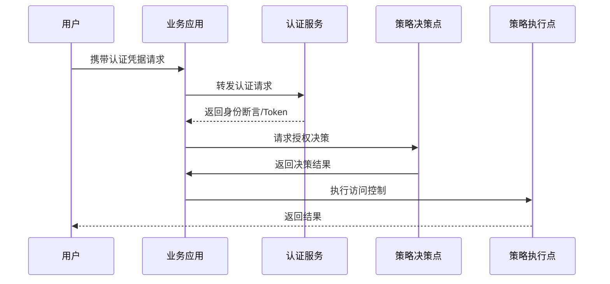

某技术博客曾做过一个实验：在公共场所放置一个「免费 WiFi」，连接到该网络的用户只需要输入任意密码就能上网。实际上，这个 WiFi 没有任何网络连接，只是为了收集用户输入的密码。结果在一周内，有超过 500 人尝试连接，其中 60% 使用了他们在其他重要服务（如邮箱、银行）中的相同密码。

这个实验揭示了一个根本性的问题：**大多数人并不理解认证与授权的区别。** 他们以为设了一个密码就万事大吉，却不知道密码只是认证因素之一，而认证只是安全访问的第一步。

## 一、认证与授权的区别与联系

认证和授权是访问控制的两块基石，但它们解决的问题完全不同。

**认证（Authentication，AuthN）** 回答的问题是「你是谁？」它的核心任务是验证请求者声称的身份与真实身份一致。认证发生在他试图访问系统的那一刻，通过验证凭证来完成。

**授权（Authorization，AuthZ）** 回答的问题是「你能做什么？」它的核心任务是在身份确认后，决定该身份是否被允许执行特定操作或访问特定资源。授权发生在认证通过之后。

用一个生活场景类比：机场安检时，你出示身份证（认证），安检人员验证你的身份真实有效；登机口检票时，工作人员查看你的机票和目的地（授权），决定你是否被允许登上这架飞机。没有认证，授权就成了无本之木；没有授权，认证就毫无意义。

从技术实现角度，认证和授权通常是解耦的。认证服务专门负责验证身份，授权服务专门负责决策。应用程序先调用认证服务验证用户，再调用授权服务判断用户是否有权访问请求的资源。这种分离带来几个好处：认证逻辑可以复用，多个应用共享同一套认证体系；授权策略可以集中管理，实现细粒度的权限控制；安全审计可以统一进行，所有访问决策都有记录。

## 二、认证因素：知识、持有、生物

根据认证因素的来源，身份验证分为三类：知识因素（你知道什么）、持有因素（你拥有什么）、生物因素（你是什么）。

**知识因素** 是最常见的认证方式，用户需要回答只有自己知道的问题。密码是最典型的知识因素，但广义的密码还包括 PIN 码、安全问题的答案、一次性密码（OTP）等。知识因素的优点是实现简单、成本低，缺点是容易被窃取（键盘记录器、肩窥）、猜测（弱密码爆破）、欺骗（钓鱼网站）。

**持有因素** 要求用户证明自己拥有某个物理设备。手机验证码（SMS OTP）、硬件令牌（如 RSA SecurID）、智能卡都属于持有因素。持有因素的优点是攻击者即使知道密码，没有设备也无法通过认证。缺点是设备可能丢失、被盗、被克隆。SIM 卡交换攻击就是针对手机持有因素的攻击：攻击者诱骗运营商将目标号码转移到自己的 SIM 卡，从而接收验证码。

**生物因素** 利用人体固有的生理或行为特征进行身份验证。生理特征包括指纹、虹膜、人脸、掌纹；行为特征包括声纹、签名笔迹、击键节奏。生物因素的优点是便捷性高，用户无需记忆密码或携带设备。缺点是误识率（False Acceptance Rate）和拒识率（False Rejection Rate）无法同时降为零；生物特征一旦泄露无法更换，不像密码那样可以随意重置。

多因素认证（MFA）要求同时验证两个或以上的因素。常见的组合是「密码 + 手机验证码」，结合了知识因素和持有因素。单一因素无论多强，都存在被攻破的可能；多因素组合大幅提高了攻击成本。

## 三、认证方法深度解析

**密码认证** 是最广泛的认证方法，但也是被误解最深的。很多人认为「密码越复杂越好」，实际上密码长度比复杂度更重要。研究表明，`Tr0ub4dor&3` 和 `correcthorsebatterystaple` 相比，前者看似复杂但可被字典攻击快速破解，后者虽然简单但熵值更高。更重要的是，不要在多个服务间重用密码，因为密码泄露是常见的安全事件。

现代密码存储必须使用强哈希算法。MD5 和 SHA1 由于计算速度太快，已被证明不适合用于密码存储。bcrypt、scrypt、Argon2 是专门为密码设计的慢哈希算法，通过引入计算成本使暴力破解变得不切实际。

```java title="PasswordHasher.java"
import org.springframework.security.crypto.bcrypt.BCryptPasswordEncoder;
import org.springframework.security.crypto.argon2.Argon2PasswordEncoder;
import org.springframework.security.crypto.scrypt.SCryptPasswordEncoder;

public class PasswordHasher {
    
    public static void main(String[] args) {
        String rawPassword = "UserPassword123!";
        
        BCryptPasswordEncoder bcrypt = new BCryptPasswordEncoder();
        String bcryptHash = bcrypt.encode(rawPassword);
        System.out.println("bcrypt: " + bcryptHash);
        System.out.println("bcrypt matches: " + bcrypt.matches(rawPassword, bcryptHash));
        
        Argon2PasswordEncoder argon2 = new Argon2PasswordEncoder();
        String argon2Hash = argon2.encode(rawPassword);
        System.out.println("argon2: " + argon2Hash);
        
        SCryptPasswordEncoder scrypt = new SCryptPasswordEncoder();
        String scryptHash = scrypt.encode(rawPassword);
        System.out.println("scrypt: " + scryptHash);
    }
}
```

**无密码认证（Passwordless Authentication）** 是近年来兴起的新范式。用户无需记忆密码，而是通过其他方式证明身份：邮箱或手机接收 Magic Link、SMS OTP、FIDO2/WebAuthn 安全密钥等。无密码认证消除了密码泄露和钓鱼攻击的风险，同时提升了用户体验。但它并不是「无认证因素」，只是用其他因素替代了密码。

**生物认证** 的准确性通过两个指标衡量：误识率（FAR）指将冒名者错误识别为合法用户的比率；拒识率（FRR）指将合法用户错误拒绝的比率。这两个指标是此消彼长的关系，可通过调整阈值在两者间取得平衡。认假率（False Acceptance Rate）与误识率同义，拒真率（False Rejection Rate）与拒识率同义。

移动设备上常见的指纹识别采用电容式传感器，读取皮肤表层的电容变化生成指纹图像。Face ID 使用结构光技术，投射数万个不可见光点到脸上，构建三维面部模型，安全性比纯二维图像识别高出几个数量级。

## 四、授权模型

授权模型定义了如何描述和执行访问控制策略。

**ACL（Access Control List，访问控制列表）** 是最基础的模型。每个资源维护一个列表，记录哪些身份可以执行什么操作。ACL 直观简单，但随着系统规模增长，管理成本急剧上升。当有数千个用户和数万个资源时，手工维护 ACL 变得不可行。

**RBAC（Role-Based Access Control，基于角色的访问控制）** 引入「角色」作为用户和权限之间的中介。用户被分配角色，角色拥有权限。这种模型大大简化了权限管理：权限授予角色，角色授予用户，不需要为每个用户单独配置权限。但 RBAC 的局限性在于角色是预定义的，缺乏灵活性，难以表达「资源创建者可以访问自己创建的资源」这种动态关系。

```java title="RbacService.java"
import java.util.*;

public class RbacService {
    
    private Map<String, Set<String>> userRoles = new HashMap<>();
    private Map<String, Set<Permission>> rolePermissions = new HashMap<>();
    
    public boolean hasPermission(String userId, String resource, String action) {
        Set<String> roles = userRoles.getOrDefault(userId, Collections.emptySet());
        for (String role : roles) {
            Set<Permission> permissions = rolePermissions.getOrDefault(role, Collections.emptySet());
            for (Permission p : permissions) {
                if (p.matches(resource, action)) {
                    return true;
                }
            }
        }
        return false;
    }
    
    public void assignRole(String userId, String role) {
        userRoles.computeIfAbsent(userId, k -> new HashSet<>()).add(role);
    }
    
    public void grantPermission(String role, String resource, String action) {
        rolePermissions.computeIfAbsent(role, k -> new HashSet<>())
            .add(new Permission(resource, action));
    }
    
    record Permission(String resource, String action) {
        boolean matches(String res, String act) {
            return resource.equals("*") || resource.equals(res);
        }
    }
}
```

**ABAC（Attribute-Based Access Control，基于属性的访问控制）** 使用属性作为授权决策的依据。属性可以来自用户（部门、职位、安全级别）、资源（敏感等级、所有者、创建时间）、环境（时间、位置、设备状态）、操作本身（读取、修改、删除）。ABAC 的表达能力远强于 RBAC，可以实现复杂的业务规则。但 ABAC 策略的编写和调试难度较高，策略冲突的处理也较为复杂。

**PBAC（Policy-Based Access Control，基于策略的访问控制）** 可以看作是 ABAC 的一种实现方式，使用声明式策略语言（如 Rego、AWS IAM Policy）定义访问规则。Open Policy Agent（OPA）是 PBAC 的典型实现，被广泛应用于微服务、Kubernetes、API 网关等场景。

## 五、认证与授权的分离架构

现代安全架构强调认证与授权的职责分离。认证服务（IdP）专注于身份验证，不关心用户被允许做什么；授权服务（PDP，Policy Decision Point）专注于权限决策，不关心用户如何证明身份。

这种分离带来了架构上的灵活性。应用可以对接多个 IdP（企业用户用 AD/SAML，个人用户用社交登录），授权逻辑保持不变。不同的业务系统可以使用同一套授权策略，实现权限的集中管控。



实际项目中，PEP（Policy Enforcement Point，策略执行点）通常集成在应用或 API 网关中，拦截每个请求并向 PDP 查询授权结果。为了性能，PDP 通常会缓存决策结果，但缓存需要考虑令牌的撤销场景。

---

## 思考题

**问题 1**：如果你是一家电商平台的安全架构师，需要设计用户权限体系。用户有买家和卖家两种角色，买家可以购买商品，卖家可以上架商品。买家和卖家都需要能够查看自己的订单和账户信息。请分析使用 RBAC 能否满足这个需求，如果能，给出角色-权限设计；如果不能，指出 RBAC 的局限性并提出改进方案。

<details>
<summary>参考答案</summary>

RBAC 可以满足基本需求。设计两个角色：买家角色拥有「购买商品」「查看自己订单」「查看账户信息」权限；卖家角色拥有「上架商品」「查看自己订单」「查看账户信息」权限。但存在一个边界问题：如何控制用户只能查看自己的订单？RBAC 的「角色-权限」二层结构无法表达「只能访问自己创建的资源」这种约束。可以引入 RBAC 的扩展——RBAC96 标准中的「角色层级」或「约束」机制，或者引入 ABAC 补充：增加资源属性判断（order.owner = currentUser）。
</details>

**问题 2**：多因素认证（MFA）是否越多越好？讨论添加更多认证因素的边际收益递减问题，以及在实际产品中如何平衡安全性与用户体验。

<details>
<summary>参考答案</summary>

MFA 并非越多越好。当认证因素从 1 个增加到 2 个时，安全性提升显著，攻击成本呈几何级数增长。但从 2 个增加到 3 个甚至更多时，边际收益递减明显——攻击者如果有能力同时攻破两个因素，往往也能搞定第三个。更重要的是，过多的认证步骤会严重影响用户体验，导致用户跳过或绕过 MFA。企业应根据资产价值和威胁模型选择合适的因素数量：敏感操作（如转账）使用强 MFA，普通操作使用单因素或双因素。同时可以通过上下文感知减少不必要的认证（如可信设备、已知网络环境下简化流程）。
</details>
