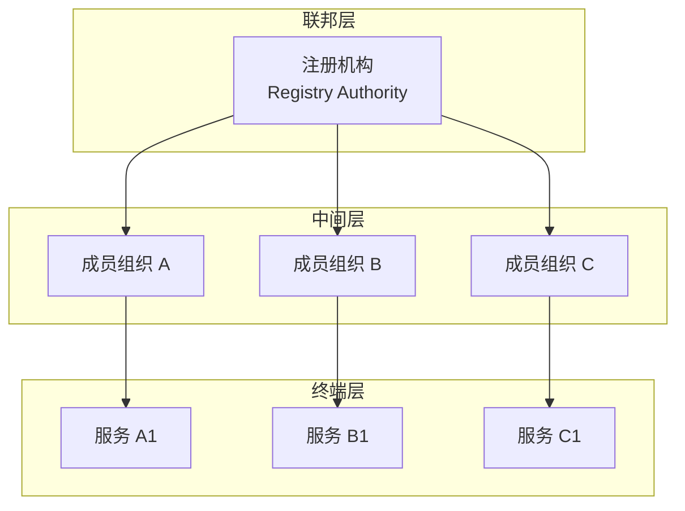
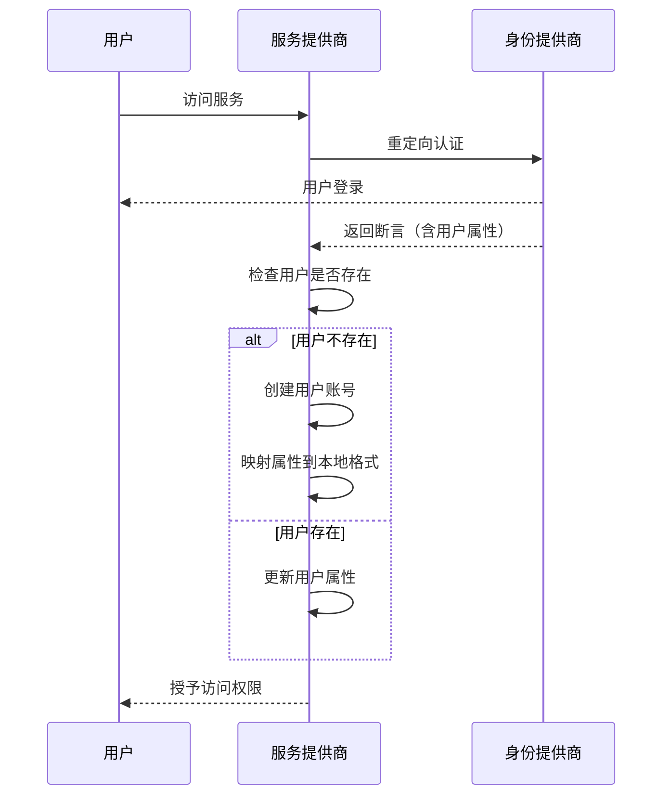
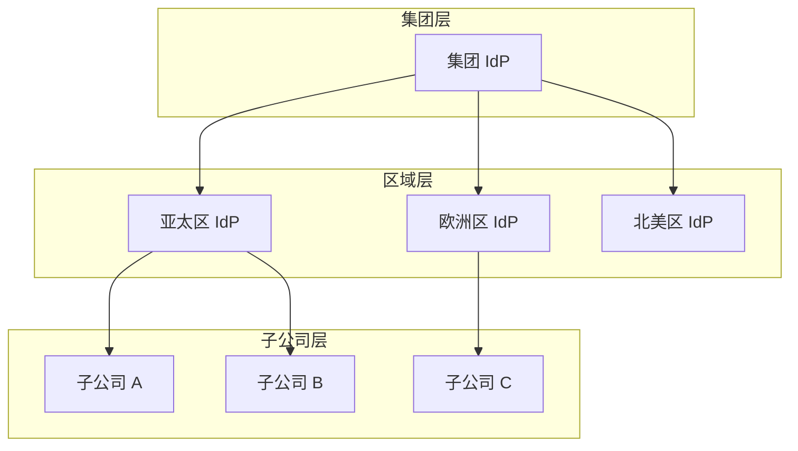

某跨国公司拥有分布在 50 个国家的子公司，每个子公司都有自己独立的身份管理系统。IT 部门每天处理大量账户开通、权限变更和离职账户清理工作。更糟糕的是，当审计人员需要跨子公司检查权限时，发现每个子公司的用户标识格式都不一样——有的用员工编号，有的用邮箱前缀，有的用部门代码。

这不仅是效率问题，更是合规噩梦。身份联邦（Identity Federation）正是解决这类跨组织身份管理问题的标准方案。

## 一、身份联邦的定义与价值

### 什么是身份联邦

身份联邦是一种让多个独立组织共享身份信息的技术框架，而无需建立统一的身份存储。在联邦模型中：

- 每个组织保留对自己身份数据的控制权
- 用户使用本地凭证登录，但可以访问其他组织的资源
- 身份信息以标准化的格式在组织间安全传递

**核心概念澄清**：

| 术语 | 定义 |
|------|------|
| 本地身份 | 用户在原始 IdP 中的账号 |
| 联邦身份 | 映射到其他组织后的身份 |
| 信任链 | IdP 之间的信任关系 |
| 用户 Provisioning | 在目标系统创建联邦用户账号 |

### 身份联邦的核心价值

```
没有联邦：
┌─────────┐     ┌─────────┐     ┌─────────┐
│ 分公司 A │     │ 分公司 B │     │ 分公司 C │
│ 独立账号  │     │ 独立账号  │     │ 独立账号  │
└─────────┘     └─────────┘     └─────────┘

员工入职：每个系统单独开通 → N 个步骤
员工离职：每个系统单独清理 → N 个步骤
审计：跨系统数据不一致 → 难以追溯

有联邦：
┌─────────┐
│ 总部 IdP │
└─────────┘
    │
    ▼
┌─────────┐     ┌─────────┐     ┌─────────┐
│ 分公司 A │     │ 分公司 B │     │ 分公司 C │
│ 联邦账号  │     │ 联邦账号  │     │ 联邦账号  │
└─────────┘     └─────────┘     └─────────┘

员工入职：总部开通 → 自动分发 → 1 个步骤
员工离职：总部关闭 → 自动同步 → 1 个步骤
审计：统一身份 → 数据一致 → 完整追溯
```

## 二、联邦身份模型

### SAML Federation

SAML 2.0 Federation 是企业环境中最成熟的联邦方案：

**元数据交换**：参与联邦的组织交换 XML 元数据文档，声明：
- EntityID（实体标识符）
- 支持的绑定（HTTP-POST、HTTP-Redirect、SOAP）
- 签名证书
- 断言消费服务（ACS）地址
- 单点登录服务地址

```xml title="SAML IdP 元数据示例"
<EntityDescriptor 
    entityID="https://idp.example.com/federation">
    
    <IDPSSODescriptor 
        protocolSupportEnumeration="urn:oasis:names:tc:SAML:2.0:protocol">
        
        <KeyDescriptor use="signing">
            <KeyInfo>
                <X509Data>
                    <X509Certificate>MIIC...</X509Certificate>
                </X509Data>
            </KeyInfo>
        </KeyDescriptor>
        
        <SingleSignOnService 
            Binding="urn:oasis:names:tc:SAML:2.0:bindings:HTTP-Redirect"
            Location="https://idp.example.com/sso"/>
        
        <SingleSignOnService 
            Binding="urn:oasis:names:tc:SAML:2.0:bindings:HTTP-POST"
            Location="https://idp.example.com/sso-post"/>
    </IDPSSODescriptor>
</EntityDescriptor>
```

### OIDC Federation

OIDC Federation 是更现代的选择，基于 OAuth 2.0 和 OpenID Connect：

**-discovery endpoint**：

```json
{
  "issuer": "https://idp.example.com",
  "authorization_endpoint": "https://idp.example.com/authorize",
  "token_endpoint": "https://idp.example.com/token",
  "userinfo_endpoint": "https://idp.example.com/userinfo",
  "jwks_uri": "https://idp.example.com/.well-known/jwks.json",
  "response_types_supported": ["code", "token"],
  "subject_types_supported": ["public"],
  "id_token_signing_alg_values_supported": ["RS256"]
}
```

**OIDC Federation 1.0 扩展**（draft）：
- 支持自动发现 IdP 配置
- 实体配置签名验证
- 信任链自动构建

## 三、元数据交换与信任链

### 信任模型设计



**信任传递规则**：
1. 所有成员信任注册机构
2. 注册机构信任的成员，自动被其他成员信任
3. 终端服务信任其所在组织的 IdP
4. 不存在跨组织的直接信任（需要通过联邦层）

### 元数据签名与验证

联邦元数据必须被签名，确保传输过程中不被篡改：

```java title="MetadataVerifier.java"
public class MetadataVerifier {
    
    /**
     * 验证元数据签名
     */
    public boolean verifyMetadataSignature(
            String metadataXml, 
            X509Certificate signingCertificate) {
        
        try {
            DocumentBuilderFactory dbf = DocumentBuilderFactory.newInstance();
            dbf.setNamespaceAware(true);
            Document doc = dbf.newDocumentBuilder().parse(
                new InputSource(new StringReader(metadataXml)));
            
            NodeList signatureNodes = doc.getElementsByTagNameNS(
                "http://www.w3.org/2000/09/xmldsig#", "Signature");
            
            if (signatureNodes.getLength() == 0) {
                return false; // 元数据必须有签名
            }
            
            DOMValidateContext valContext = new DOMValidateContext(
                signingCertificate.getPublicKey(), 
                signatureNodes.item(0));
            
            XMLSignature signature = XMLSignatureFactory.unmarshalDOMSignature(
                (Element) signatureNodes.item(0));
            
            return signature.validate(valContext);
        } catch (Exception e) {
            log.error("元数据签名验证失败", e);
            return false;
        }
    }
}
```

## 四、身份提供者发现

### IdP Discovery 的挑战

当用户从未知来源访问服务时，如何确定用户的 IdP？

**方案一：直接选择**
- 用户从下拉列表中选择 IdP
- 简单但不适合大规模联邦

**方案二：域名推测**
- 根据用户邮箱域名推测 IdP
- 例如：`user@company.com` → `https://idp.company.com`
- 需要域名到 IdP 的映射表

**方案三：WAYF/DS（Where Are You From / Discovery Service）**
- 中央 Discovery Service 存储域名到 IdP 的映射
- 服务重定向用户到 Discovery Service 选择 IdP
- 常用实现：eduGAIN、SAML Federation Hub

### Discovery Service 实现

```java title="DiscoveryService.java"
@Service
@Slf4j
public class DiscoveryService {
    
    private final Map<String, String> domainToIdpMapping = new ConcurrentHashMap<>();
    
    /**
     * 根据邮箱域名查找 IdP
     */
    public Optional<String> findIdpByEmail(String email) {
        String domain = email.substring(email.indexOf('@') + 1);
        return Optional.ofNullable(domainToIdpMapping.get(domain));
    }
    
    /**
     * 构建 Discovery 响应 URL
     * 返回用户应该重定向到的 IdP
     */
    public String buildIdpRedirectUrl(String email) {
        return findIdpByEmail(email)
            .map(idpUrl -> idpUrl + "/sso?return_url=" + returnUrl)
            .orElseThrow(() -> new IdpNotFoundException("找不到 IdP: " + email));
    }
    
    /**
     * 注册域名到 IdP 的映射
     */
    public void registerDomainMapping(String domain, String idpUrl) {
        domainToIdpMapping.put(domain.toLowerCase(), idpUrl);
        log.info("注册域名映射: {} -> {}", domain, idpUrl);
    }
}
```

## 五、Attribute Mapping 与用户 Provisioning

### 属性映射设计

联邦身份交换中，最关键的是属性映射。每个 IdP 可能有不同的用户属性命名：

| IdP 属性 | 标准属性 | 说明 |
|----------|----------|------|
| `objectGUID` | `uid` | 用户唯一标识 |
| `mail` | `email` | 邮箱地址 |
| `displayName` | `name` | 显示名称 |
| `memberOf` | `groups` | 组成员关系 |
| `employeeType` | `role` | 员工类型 |

```java title="AttributeMapper.java"
@Configuration
public class AttributeMapper {
    
    @Bean
    public AttributeMappingRegistry attributeMappingRegistry() {
        AttributeMappingRegistry registry = new AttributeMappingRegistry();
        
        // SAML 到标准属性的映射
        registry.registerSamlMapping("urn:oid:0.9.2342.19200300.100.1.1", "uid");
        registry.registerSamlMapping("urn:oid:0.9.2342.19200300.100.1.3", "email");
        registry.registerSamlMapping("urn:oid:2.16.840.1.113730.3.1.241", "displayName");
        registry.registerSamlMapping("urn:oid:1.3.6.1.4.1.5923.1.5.12.1", "groups");
        
        // OIDC 到标准属性的映射
        registry.registerOidcMapping("sub", "uid");
        registry.registerOidcMapping("email", "email");
        registry.registerOidcMapping("name", "displayName");
        registry.registerOidcMapping("groups", "groups");
        
        return registry;
    }
    
    /**
     * 映射用户属性
     */
    public FederationUser mapAttributes(
            Map<String, Object> rawAttributes,
            FederationType type) {
        
        FederationUser user = new FederationUser();
        
        Map<String, Object> standardAttrs = attributeMappingRegistry()
            .mapToStandard(rawAttributes, type);
        
        user.setUid(standardAttrs.get("uid").toString());
        user.setEmail(standardAttrs.get("email").toString());
        user.setDisplayName(standardAttrs.getOrDefault("displayName", "").toString());
        user.setGroups(mapGroups(standardAttrs.getOrDefault("groups", Collections.emptyList())));
        
        return user;
    }
}
```

### 即时 Provisioning vs 预 Provisioning

**即时 Provisioning（JIT）**：

用户在首次登录时自动创建本地账号，不需要预先配置。



```java title="JitProvisioningFilter.java"
@Component
public class JitProvisioningFilter extends OncePerRequestFilter {
    
    @Autowired
    private UserRepository userRepository;
    
    @Autowired
    private AttributeMapper attributeMapper;
    
    @Override
    protected void doFilterInternal(HttpServletRequest request,
                                     HttpServletResponse response,
                                     FilterChain filterChain) 
            throws ServletException, IOException {
        
        // 从 SAML/OIDC 响应中提取用户属性
        FederationUser fedUser = extractFederationUser(request);
        
        if (fedUser != null) {
            User localUser = userRepository.findByExternalId(fedUser.getUid())
                .orElseGet(() -> createUser(fedUser));
            
            // 更新属性（如果 IdP 中的信息变了）
            updateUserAttributes(localUser, fedUser);
            
            // 将本地用户设置到安全上下文中
            SecurityContextHolder.getContext().setAuthentication(
                new FederatedUserAuthentication(localUser));
        }
        
        filterChain.doFilter(request, response);
    }
    
    private User createUser(FederationUser fedUser) {
        User user = new User();
        user.setExternalId(fedUser.getUid()); // 关联到联邦 ID
        user.setEmail(fedUser.getEmail());
        user.setDisplayName(fedUser.getDisplayName());
        user.setEnabled(true);
        
        // 默认角色
        user.setRoles(Collections.singletonList("USER"));
        
        return userRepository.save(user);
    }
}
```

**预 Provisioning**：

提前在目标 SP 创建用户账号，再与联邦身份关联。

| 维度 | 即时 Provisioning | 预 Provisioning |
|------|------------------|-----------------|
| 用户体验 | 首次登录即可使用 | 需要等待账号开通 |
| 管理复杂度 | 低（自动创建） | 高（手动创建） |
| 合规控制 | 难以预审 | 可提前审计 |
| 适用场景 | 内部员工、外部合作方 | 高安全要求场景 |
| 属性控制 | 依赖 IdP 数据 | 可自定义映射 |

## 六、跨组织联邦的信任模型

### eduGAIN 模型

eduGAIN 是教育领域的国际身份联邦：

```
┌─────────────────────────────────────────────────────────────┐
│                        eduGAIN                              │
│                  (International Federation)                  │
└─────────────────────────────────────────────────────────────┘
        │                    │                    │
        ▼                    ▼                    ▼
┌───────────────┐    ┌───────────────┐    ┌───────────────┐
│   RENATER     │    │    SURFnet    │    │    Internet2  │
│   (法国)      │    │   (荷兰)      │    │    (美国)      │
└───────────────┘    └───────────────┘    └───────────────┘
        │                    │                    │
        ▼                    ▼                    ▼
┌───────────────┐    ┌───────────────┐    ┌───────────────┐
│   大学 A       │    │   大学 D       │    │   大学 G       │
└───────────────┘    └───────────────┘    └───────────────┘
        │
        ▼
┌───────────────┐    ┌───────────────┐
│   大学 B       │    │   大学 C       │
└───────────────┘    └───────────────┘
```

**信任传递**：
- 任何 eduGAIN 成员大学的师生可以访问其他成员大学的资源
- 无需单独建立双边信任关系
- 各国联邦内部成员互相信任，通过 eduGAIN 桥接实现国际互操作

### 企业联邦模型

大型企业通常采用分层联邦：



**信任级别**：

| 信任级别 | 说明 | 典型场景 |
|----------|------|----------|
| 集团全局 | 最高信任，所有子公司 | 集团管理系统 |
| 区域信任 | 区域内部共享 | 区域协作项目 |
| 子公司信任 | 仅限单一子公司 | 内部系统 |

## 七、企业身份联邦实践

### SAML Federation Hub 模式

对于拥有多个 IdP 的企业，Federation Hub 提供统一的联邦入口：

```java title="FederationHubConfig.java"
@Configuration
public class FederationHubConfig {
    
    /**
     * 定义联邦成员
     */
    @Bean
    public FederationMemberRegistry federationMemberRegistry() {
        FederationMemberRegistry registry = new FederationMemberRegistry();
        
        registry.registerMember(FederationMember.builder()
            .entityId("https://partner-a.com/saml")
            .name("合作伙伴 A")
            .metadataUrl("https://partner-a.com/metadata.xml")
            .trustLevel(TrustLevel.STRATEGIC)
            .attributeReleasePolicy(releaseAllPolicy())
            .build());
        
        registry.registerMember(FederationMember.builder()
            .entityId("https://partner-b.com/saml")
            .name("合作伙伴 B")
            .metadataUrl("https://partner-b.com/metadata.xml")
            .trustLevel(TrustLevel.VERIFIED)
            .attributeReleasePolicy(restrictedPolicy())
            .build());
        
        return registry;
    }
    
    /**
     * 属性发布策略
     */
    private AttributeReleasePolicy releaseAllPolicy() {
        return new SelectiveAttributeReleasePolicy(List.of(
            "uid", "email", "displayName", "groups"
        ));
    }
    
    private AttributeReleasePolicy restrictedPolicy() {
        return new SelectiveAttributeReleasePolicy(List.of(
            "uid", "email"
        ));
    }
}
```

### 企业 IdP 集成示例

```java title="EnterpriseIdPIntegration.java"
@Service
@Slf4j
public class EnterpriseIdPIntegration {
    
    @Autowired
    private KeycloakClient keycloakClient;
    
    /**
     * 配置企业 SAML Federation
     */
    public void configureSamlFederation(String idpMetadataUrl, 
                                         String spEntityId) {
        try {
            // 获取 IdP 元数据
            IDPSSODescriptor idpDescriptor = fetchAndParseIdPMetadata(idpMetadataUrl);
            
            // 验证元数据签名
            if (!verifyMetadataSignature(idpDescriptor)) {
                throw new SecurityException("IdP 元数据签名验证失败");
            }
            
            // 创建或更新 SAML IdP 配置
            keycloakClient.importIdentityProvider(
                IdentityProviderRepresentation.builder()
                    .alias(extractAlias(idpDescriptor))
                    .displayName(idpDescriptor.getOrganization().getDisplayName())
                    .providerId("saml")
                    .config(Map.of(
                        "idpMetadata", idpMetadataUrl,
                        "spEntityId", spEntityId,
                        "wantAssertionsSigned", "true",
                        "signatureAlgorithm", "RSA_SHA256"
                    ))
                    .build()
            );
            
            log.info("成功配置企业 SAML Federation: {}", idpDescriptor.getEntityID());
        } catch (Exception e) {
            log.error("配置 SAML Federation 失败", e);
            throw new RuntimeException("联邦配置失败", e);
        }
    }
    
    /**
     * 配置企业 OIDC Federation
     */
    public void configureOidcFederation(String issuerUrl) {
        // OIDC 通过自动发现简化配置
        keycloakClient.importIdentityProvider(
            IdentityProviderRepresentation.builder()
                .alias(extractHost(issuerUrl))
                .displayName("Enterprise OIDC")
                .providerId("oidc")
                .config(Map.of(
                    "issuer", issuerUrl,
                    "clientAuthMethod", "client_secret_post",
                    "syncMode", "IMPORT"
                ))
                .build()
        );
    }
}
```

## 八、联邦安全的考虑

### 元数据签名验证

始终验证收到的元数据签名，防止中间人攻击：

| 检查项 | 说明 |
|--------|------|
| 签名证书可信 | 证书在信任链中或预先注册 |
| 签名有效 | XML Signature 验证通过 |
| 证书未过期 | 验证 NotBefore 和 NotOnOrAfter |
| 证书未吊销 | 检查 CRL 或 OCSP |

### 证书生命周期管理

联邦实体的证书会定期轮换，需要自动化管理：

```java title="CertificateLifecycleManager.java"
@Component
@Slf4j
public class CertificateLifecycleManager {
    
    /**
     * 监听证书更新事件
     */
    @EventListener
    public void onMetadataUpdated(MetadataUpdatedEvent event) {
        String entityId = event.getEntityId();
        log.info("检测到元数据更新: {}", entityId);
        
        // 重新加载元数据
        IdentityProvider idp = loadIdentityProvider(entityId);
        
        // 验证新证书
        List<X509Certificate> newCerts = extractCertificates(idp.getMetadata());
        for (X509Certificate cert : newCerts) {
            if (!validateCertificate(cert)) {
                log.error("新证书验证失败: entity={}, cert={}", 
                    entityId, cert.getSubjectX500Principal());
                alertSecurityTeam(entityId, cert);
            }
        }
        
        // 平滑切换到新证书
        scheduleCertificateRotation(entityId, newCerts);
    }
    
    /**
     * 证书切换策略
     * 新旧证书共存一段时间，确保平稳过渡
     */
    private void scheduleCertificateRotation(String entityId, 
            List<X509Certificate> newCerts) {
        Instant switchTime = Instant.now().plus(24, ChronoUnit.HOURS);
        
        scheduledTasks.schedule(entityId, switchTime, () -> {
            updateIdentityProviderCertificates(entityId, newCerts);
            log.info("证书已更新: {}", entityId);
        });
    }
}
```

---

## 思考题

**问题 1**：在身份联邦中，属性映射是核心环节。请分析以下场景：

某跨国企业收购了一家海外子公司，子公司使用 LDAP 属性 `uidNumber` 作为用户唯一标识，而集团标准是 `employeeID`。子公司员工在访问集团系统时应该使用哪个标识符？为什么？

<details>
<summary>参考答案</summary>

**分析**：

这个场景涉及两个层面的标识符问题：

**标识符的类型区分**：

| 标识符类型 | 来源 | 用途 |
|------------|------|------|
| 本地标识符 | 各 IdP/子公司内部 | 内部系统关联 |
| 联邦标识符 | 跨组织通用 | 集团系统识别 |
| 标准标识符 | 联盟定义 | 跨组织互操作 |

**推荐方案**：

1. **保留本地标识符用于内部关联**
   - 子公司的 `uidNumber` 继续用于子公司内部系统的关联
   - 内部系统（考勤、财务）仍然使用 `uidNumber`

2. **使用标准映射到集团标识符**
   - 在联邦断言中使用 `employeeID` 作为跨组织标识符
   - 集团系统只看到 `employeeID`，不暴露子公司内部标识符
   - 映射规则：
   ```
   子公司 LDAP: uidNumber → 集团标准: employeeID
   ```

3. **持久化名标识符（推荐）**
   - 使用 `urn:oid:employeeID` 作为持久化名标识符
   - 即使员工编号格式变了，只要员工不变，标识符不变
   - 避免使用可能变化的属性（如邮箱、用户名）

**为什么不用子公司 uidNumber**：

1. **标识符冲突风险**：如果未来再收购其他公司，可能使用相同的 uidNumber 范围
2. **信息泄露**：暴露内部实现细节给集团系统
3. **治理困难**：子公司可能随意更改 uidNumber 格式

**安全考虑**：

- 映射表应该存储在集团 IdP 中，而不是暴露给所有子系统
- 属性发布策略应该只释放必要的标识符
- 审计日志应记录属性映射过程

</details>

**问题 2**：设计一个企业身份联邦的安全审计方案，需要满足以下要求：（1）记录所有跨组织认证事件；（2）能够追溯用户的完整访问路径；（3）支持异常行为检测。请给出审计数据模型和系统架构设计。

<details>
<summary>参考答案</summary>

**审计数据模型设计**：

```java title="FederationAuditModel.java"
@Entity
@Table(name = "federation_audit_log")
public class FederationAuditLog {
    
    @Id
    @GeneratedValue(strategy = GenerationType.UUID)
    private String id;
    
    // 时间维度
    private Instant timestamp;
    
    // 身份维度
    private String federationId;       // 联邦身份标识（跨组织通用）
    private String localUserId;         // 本地用户 ID（如果有）
    private String identityProvider;    // IdP EntityID
    private String relyingParty;         // SP EntityID
    
    // 认证维度
    private AuthenticationMethod method; // SAML/OIDC/SSO
    private String authenticationContext;
    private boolean authenticationSucceeded;
    private String failureReason;
    
    // 属性维度
    @Column(columnDefinition = "JSON")
    private String releasedAttributes;   // 发布的属性（脱敏）
    
    // 设备维度
    private String userAgent;
    private String deviceFingerprint;
    private String ipAddress;
    private String geoLocation;
    
    // 风险维度
    private int riskScore;
    private List<String> riskIndicators; // 风险指标列表
    
    // 追溯维度
    private String sessionId;           // 关联会话
    private String traceId;              // 分布式追踪 ID
    private String previousAuditId;      // 上一步审计记录（构建访问链）
}

enum AuthenticationMethod {
    SAML_SSO,
    OIDC_AUTHENTICATION,
    FEDERATION_ASSERTION,
    ATTRIBUTE_QUERY
}
```

**完整访问路径追溯**：

```java title="AccessChainBuilder.java"
@Service
@Slf4j
public class AccessChainBuilder {
    
    @Autowired
    private FederationAuditRepository auditRepository;
    
    /**
     * 构建用户完整访问路径
     * 用于追溯一个用户的全部访问活动
     */
    public AccessChain buildAccessChain(String federationId, 
            Instant startTime, Instant endTime) {
        
        List<FederationAuditLog> logs = auditRepository
            .findByFederationIdAndTimestampBetween(federationId, startTime, endTime)
            .stream()
            .sorted(Comparator.comparing(FederationAuditLog::getTimestamp))
            .collect(Collectors.toList());
        
        AccessChain chain = new AccessChain();
        chain.setUserId(federationId);
        chain.setStartTime(startTime);
        chain.setEndTime(endTime);
        chain.setNodes(buildNodes(logs));
        chain.setTotalVisitedSystems(logs.stream()
            .map(FederationAuditLog::getRelyingParty)
            .distinct()
            .count());
        
        return chain;
    }
    
    /**
     * 检测异常访问模式
     */
    public List<AnomalyAlert> detectAnomalies(String federationId) {
        List<AnomalyAlert> alerts = new ArrayList<>();
        
        // 1. 地理异常检测
        alerts.addAll(detectGeoAnomalies(federationId));
        
        // 2. 时间异常检测
        alerts.addAll(detectTimeAnomalies(federationId));
        
        // 3. 频率异常检测
        alerts.addAll(detectFrequencyAnomalies(federationId));
        
        // 4. 跨组织跳转异常
        alerts.addAll(detectCrossOrgAnomalies(federationId));
        
        return alerts;
    }
    
    private List<AnomalyAlert> detectGeoAnomalies(String federationId) {
        // 获取最近 10 次登录的地理位置
        List<String> recentLocations = getRecentLocations(federationId, 10);
        
        // 如果最新登录位置与前一次登录位置距离超过阈值
        if (recentLocations.size() >= 2) {
            double distance = calculateDistance(
                recentLocations.get(0), recentLocations.get(1));
            
            if (distance > MAX_REASONABLE_DISTANCE) {
                return List.of(AnomalyAlert.builder()
                    .type(AnomalyType.IMPOSSIBLE_TRAVEL)
                    .severity(Severity.HIGH)
                    .description("检测到不可能的旅行: 从 " + 
                        recentLocations.get(1) + " 到 " + recentLocations.get(0))
                    .build());
            }
        }
        
        return Collections.emptyList();
    }
}
```

**系统架构设计**：

```
┌─────────────────────────────────────────────────────────────────┐
│                        审计收集层                                │
│  ┌──────────────┐  ┌──────────────┐  ┌──────────────┐          │
│  │ SAML 审计拦截 │  │ OIDC 审计拦截 │  │ 应用层审计SDK │          │
│  └──────────────┘  └──────────────┘  └──────────────┘          │
└─────────────────────────────────────────────────────────────────┘
                              │
                              ▼
┌─────────────────────────────────────────────────────────────────┐
│                        事件处理层                                │
│  ┌──────────────┐  ┌──────────────┐  ┌──────────────┐          │
│  │  事件缓冲    │  │   事件路由    │  │   事件富化    │          │
│  └──────────────┘  └──────────────┘  └──────────────┘          │
└─────────────────────────────────────────────────────────────────┘
                              │
          ┌───────────────────┼───────────────────┐
          ▼                   ▼                   ▼
┌─────────────────┐  ┌─────────────────┐  ┌─────────────────┐
│     存储层      │  │    实时分析层    │  │    批量分析层    │
│   Elasticsearch │  │    Apache Flink │  │    Apache Spark │
│   + ClickHouse  │  │                  │  │                  │
└─────────────────┘  └─────────────────┘  └─────────────────┘
          │                   │                   │
          ▼                   ▼                   ▼
┌─────────────────┐  ┌─────────────────┐  ┌─────────────────┐
│   可视化查询    │  │   实时告警      │  │   历史分析报告    │
│     Kibana      │  │   AlertManager  │  │    Grafana       │
└─────────────────┘  └─────────────────┘  └─────────────────┘
```

**核心告警规则**：

| 告警规则 | 触发条件 | 严重级别 |
|----------|----------|----------|
| Impossible Travel | 两次登录地理位置不可能在时间内到达 | 高 |
| Unusual Access Time | 非工作时间从新位置登录 | 中 |
| Attribute Change | 关键属性（角色、部门）突然变化 | 高 |
| Cross-Border Anomaly | 从受限地区访问 | 高 |
| Burst Access | 短时间内访问大量不同系统 | 中 |
| Failed Auth Flood | 频繁认证失败 | 中 |

</details>
