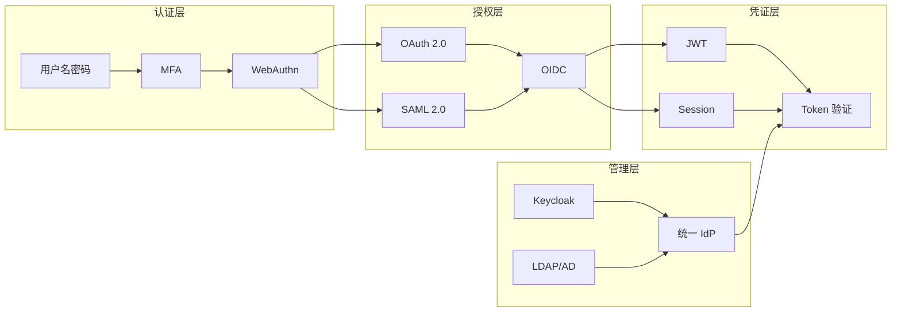

凌晨三点，一封来自安全团队的紧急告警邮件打破了宁静：某员工账号被恶意登录，核心数据库遭到拖取。事后溯源发现，攻击者利用的是一枚早已泄露的 API Token——它的主人早已离职，但凭证从未被回收。

这并非孤例。根据 Verizon 数据泄露报告，**超过 80% 的安全事件与身份凭证滥用直接相关**。在云原生和零信任理念深入人心的今天，身份不再只是「用户名+密码」的简单组合，而是涵盖认证协议、授权模型、凭证生命周期、合规审计的完整体系。本章节将系统梳理 IAM 领域的技术栈与最佳实践。

## 核心内容概述

### 认证与授权

**认证（Authentication）**解决的是「你是谁」的问题，**授权（Authorization）**解决的是「你能做什么」的问题。两者职责明确，但实践中常常被混淆。详见 [认证与授权](./authn-authz)。

### 标准化协议

当代 IAM 体系建立在几个核心协议之上：

| 协议 | 定位 | 适用场景 |
|---|---|---|
| OAuth 2.0 | 授权协议，允许第三方应用访问用户资源 | 开放平台、API 授权 |
| OIDC | 在 OAuth 2.0 基础上叠加身份层 | SSO、社交登录 |
| SAML 2.0 | 企业级 SSO 协议，XML 基于 | 企业内网、传统应用 |
| JWT | 轻量级令牌格式 | 微服务间认证、无状态 API |

### 凭证与 MFA

传统的用户名+密码已经千疮百孔。多因素认证（MFA）通过叠加「你知道的」「你拥有的」「你是谁」三个要素，大幅提升认证安全。WebAuthn 则代表了无密码认证的未来方向——用公钥密码学替代共享密钥。详见 [多因素认证设计](./mfa) 和 [生物认证与 WebAuthn](./webauthn)。

### 统一身份管理

企业级场景需要统一身份平台（IdP）来集中管理用户生命周期、认证流程、授权策略。Keycloak 是开源领域的标杆选择，提供了完整的 Identity Provider 功能。详见 [Keycloak 深度解析](./keycloak)。

### 零信任身份

零信任的核心理念是「永不信任，始终验证」。身份成为最核心的安全边界，需要持续验证、最小权限、微隔离。详见 [零信任身份架构](./zero-trust-identity)。

## 子主题列表

### 认证协议

- [IAM 概述与核心概念](./overview)
- [认证（Authentication）与授权（Authorization）](./authn-authz)
- [OAuth 2.0 协议深度解析](./oauth2)
- [OAuth 2.0 四种授权模式](./oauth2-grant-types)
- [OAuth 2.0 安全最佳实践](./oauth2-security)
- [OIDC（OpenID Connect）深度解析](./oidc)
- [OAuth2 vs OIDC 对比](./oauth2-vs-oidc)
- [SAML 2.0 协议深度解析](./saml)
- [SAML vs OIDC 选型对比](./saml-vs-oidc)

### 令牌与凭证

- [JWT（JSON Web Token）深度解析](./jwt)
- [JWT 签名与加密](./jwt-sign-encrypt)
- [JWT 安全风险与防范](./jwt-security)
- [API Key 与 Token 管理](/security/api/api-key)

### 单点登录

- [SSO（单点登录）架构设计](./sso)
- [SSO 实现方案对比](./sso-comparison)
- [Keycloak 深度解析](./keycloak)
- [Keycloak 部署与配置](./keycloak-deployment)
- [Spring Security OAuth2 实战](./spring-security-oauth2)

### 高级认证

- [LDAP 与 Active Directory](./ldap)
- [多因素认证（MFA）设计](./mfa)
- [生物认证与 WebAuthn](./webauthn)
- [身份联邦（Identity Federation）](./federation)

### 零信任与架构

- [零信任身份架构](./zero-trust-identity)

## 思考题

**问题 1**：OAuth 2.0 的授权码模式是目前最安全的授权模式，但在 SPA（单页应用）场景下，后端服务稀缺的情况下，如何安全地实现授权码 + PKCE 流程？

参考答案

SPA 实现安全的 OAuth 2.0 授权需要以下几点：

1. **始终使用授权码模式 + PKCE**：即使没有后端，也要使用授权码 + PKCE，而非隐式流或密码模式。
2. **code_verifier 存储**：使用 sessionStorage 而非 localStorage 存储 code_verifier（刷新后需重新授权）。
3. **短生命周期 + 刷新令牌**：访问令牌有效期设为 15 分钟以内，刷新令牌存放在 HttpOnly Cookie 中。
4. **绑定 redirect_uri**：服务端严格校验 redirect_uri，阻止攻击者伪造回调地址。
5. **使用 State 参数**：防止 CSRF 攻击，state 应包含随机值并验证。
6. **优先使用后端代理**：如果可以搭建轻量后端服务（如 Serverless），将令牌存储逻辑移至后端，避免前端暴露敏感逻辑。

**问题 2**：JWT 的「无状态」特性看似完美解决了分布式服务的会话问题，但在实际生产中会遇到哪些挑战？

参考答案

JWT 无状态带来几个经典挑战：

1. **令牌无法主动失效**：用户登出或管理员强制下线时，令牌在到期前仍然有效。解决方案：短期令牌 + 黑名单（Redis）或配合 OAuth 2.0 刷新令牌机制。
2. **令牌刷新窗口**：访问令牌过期后，用户体验面临中断。需要在业务逻辑中捕获 401 错误并触发刷新流程。
3. **敏感信息泄露**：JWT Payload 是 Base64 编码但不加密，不能存放敏感信息。如需保密，应使用 JWE（加密的 JWT）。
4. **重放攻击**：攻击者截获令牌后可重复使用。解决方案：结合 nonce + timestamp，或在网关层记录已使用令牌 ID。
5. **令牌大小**：JWT 体积较大，每次请求都携带会增加网络开销。在极端高 QPS 场景下需权衡。

**问题 3**：在企业从传统 VPN + 内网模式向零信任架构迁移过程中，身份层是最关键的改造点。你会如何设计迁移路径？

参考答案

零信任身份迁移建议分三阶段推进：

**第一阶段：身份基础设施统一（1-3 个月）**
- 统一 IdP（推荐 Keycloak 或 Okta），整合现有 LDAP/AD
- 强制所有应用走统一认证，禁止硬编码凭证
- 上线 MFA，覆盖所有管理员账号

**第二阶段：强化网络层身份感知（3-6 个月）**
- 部署零信任网关（如 BeyondCorp Enterprise 或国内方案）
- 将 VPN 逐步替换为 ZTNA，按业务优先级迁移
- 实施最小权限原则，清理过度授权的 Service Account

**第三阶段：持续验证与自动化（6-12 个月）**
- 上线实时风险评估（基于设备状态、地理位置、行为分析）
- 自动化身份生命周期管理（入职/转岗/离职自动Provisioning/Deprovisioning）
- 建立身份安全度量体系，持续监控异常行为

关键原则：不要追求一步到位，零信任是旅程而非终点；优先保护高价值资产，逐步扩大覆盖范围。

