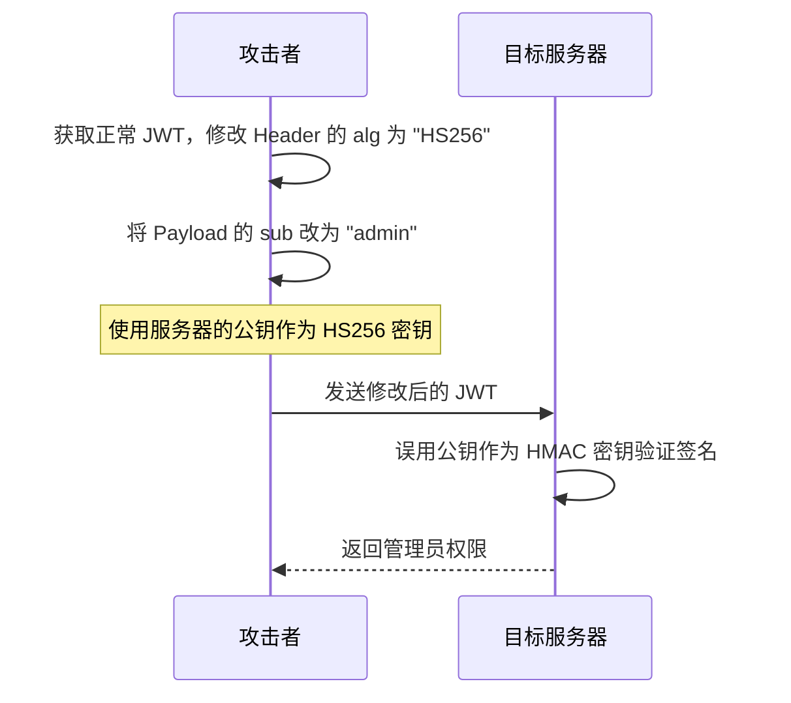
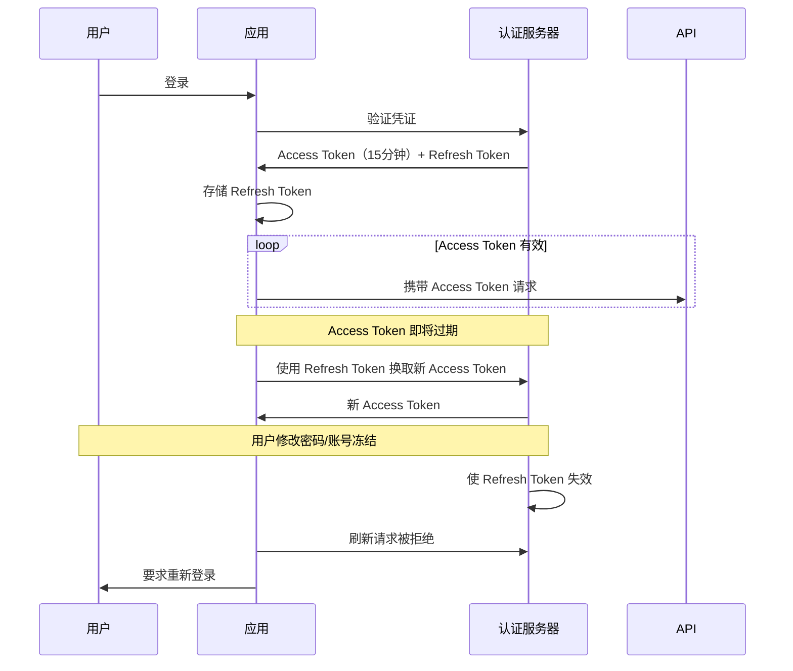

2015 年，Stripe 工程师在博客上分享了一个惊心动魄的案例：他们的某个客户通过修改 JWT 的 `sub` 字段，将自己的用户 ID 改成了管理员的 ID，成功绕过了身份验证拿到了管理员权限。更可怕的是，这个问题在他们的系统中存在了整整一年才被发现。

JWT 的设计本身是安全的，但错误的实现方式会让它成为系统的致命漏洞。本文将剖析 JWT 最常见的安全风险，并给出经过实战验证的防护方案。

## 一、算法篡改攻击（Algorithm Tampering）

### 攻击原理

JWT Header 中的 `alg` 字段告诉验证方「用什么算法验证签名」。正常情况下，签发方用私钥签发，验证方用对应的公钥验证。但问题出在——有些验证方会根据 Header 中的 `alg` 动态选择验证算法。

攻击流程：



### 攻击代码演示

原始 Token：

```json
{
  "alg": "RS256",
  "typ": "JWT"
}
```

```json
{
  "sub": "12345",
  "role": "user"
}
```

攻击者篡改后：

```json
{
  "alg": "HS256",
  "typ": "JWT"
}
```

```json
{
  "sub": "admin",
  "role": "admin"
}
```

攻击者将 `alg` 改为 `HS256`，然后用自己的服务器验证（服务器会用 `alg` 指定的 HS256 算法和**同一个公钥**去验证签名，从而绕过验证）。

### 防护措施

**方案一：强制指定算法**。验证时明确要求只能使用特定算法，拒绝其他算法：

```java title="SecureJwtValidator.java"
public class JwtValidator {
    // 强制要求只使用 RS256
    private static final String EXPECTED_ALGORITHM = "RS256";
    private static final Set<String> FORBIDDEN_ALGORITHMS = Set.of("none", "HS256", "HS384", "HS512");

    public DecodedJWT validate(String token) {
        DecodedJWT jwt = JWT.decode(token);
        String algorithm = jwt.getAlgorithm();

        // 拒绝危险算法
        if (FORBIDDEN_ALGORITHMS.contains(algorithm.toLowerCase())) {
            throw new SecurityException("Forbidden algorithm: " + algorithm);
        }

        // 确保算法与预期一致
        if (!algorithm.equals(EXPECTED_ALGORITHM)) {
            throw new SecurityException("Unexpected algorithm: " + algorithm);
        }

        // 使用公钥验证（RS256 场景下不会使用对称密钥）
        return verifier.verify(jwt);
    }
}
```

**方案二：使用白名单**。只允许预定义的、安全的算法：

```java
// 只允许 RSA 和 ECDSA 系列
private static final Set<String> ALLOWED_ALGORITHMS = Set.of(
    "RS256", "RS384", "RS512",
    "ES256", "ES384", "ES512",
    "PS256", "PS384", "PS512"
);
```

## 二、Token 存储与泄露

### 常见泄露场景

| 存储位置 | 风险 | 攻击方式 |
|---|---|---|
| localStorage | XSS 攻击 | 攻击者注入脚本读取 localStorage |
| sessionStorage | XSS 攻击 | 同上（页面关闭后丢失，但攻击窗口仍在） |
| Cookie（无 HttpOnly） | XSS 攻击 | JavaScript 可读取 |
| Cookie（带 HttpOnly） | CSRF 攻击 | 跨站请求自动携带 Cookie |

### 最佳存储方案

**方案一：HttpOnly + Secure Cookie**

```java title="TokenCookieConfig.java"
import jakarta.servlet.http.Cookie;

public class TokenCookieConfig {

    public Cookie createAccessTokenCookie(String token) {
        Cookie cookie = new Cookie("access_token", token);
        cookie.setHttpOnly(true);    // 禁止 JavaScript 读取
        cookie.setSecure(true);       // 仅 HTTPS 传输
        cookie.setPath("/");
        cookie.setMaxAge(15 * 60);   // 15 分钟过期
        cookie.setSameSite("Strict"); // 防止 CSRF
        return cookie;
    }
}
```

**方案二：内存存储 + 请求头**

Token 存放在 JavaScript 内存中，每次请求通过 `Authorization` 头部发送。需要配合 XSS 防护（如 CSP）：

```html
<!-- Content Security Policy -->
<meta http-equiv="Content-Security-Policy" content="default-src 'self'; script-src 'self';">
```

### Cookie vs localStorage 对比

| 维度 | HttpOnly Cookie | localStorage |
|---|---|---|
| XSS 防护 | 有效 | 无效 |
| CSRF 防护 | 需要 SameSite + CSRF Token | 无需考虑 |
| 移动端支持 | 原生支持 | 需要桥接 |
| 跨域请求 | 自动携带 | 需手动添加 |

## 三、Token 永不过期

Access Token 设置过长的过期时间（甚至没有过期时间），会导致「签发即永久有效」的问题。

### 风险场景

用户 A 登录后获得 Token，过了半年用户 A 离职，但 Token 仍然有效。攻击者获取到这个 Token，就可以一直以用户 A 的身份访问系统。

### 解决方案：Refresh Token 机制



### Refresh Token 存储策略

```java title="RefreshTokenManager.java"
public class RefreshTokenManager {
    private final RedisTemplate<String, RefreshTokenData> redisTemplate;

    public void saveRefreshToken(String userId, String refreshToken, Duration ttl) {
        RefreshTokenData data = new RefreshTokenData();
        data.setUserId(userId);
        data.setCreatedAt(Instant.now());
        data.setTokenVersion(getCurrentVersion(userId)); // 用于密码修改后失效

        String key = "refresh_token:" + refreshToken;
        redisTemplate.opsForValue().set(key, data, ttl);
    }

    public void revokeAllUserTokens(String userId) {
        // 递增版本号，使所有旧 Refresh Token 失效
        Long newVersion = redisTemplate.opsForValue()
            .increment("user:token_version:" + userId);

        // 记录版本变更时间，用于验证时比对
        redisTemplate.opsForValue().set(
            "user:version_timestamp:" + userId,
            Instant.now().toString(),
            Duration.ofDays(30)
        );
    }
}
```

## 四、无撤销机制

JWT 的无状态性是优势，但也带来了无法单方面撤销的难题。

### 场景分析

用户在线看视频，突然发现自己账号被盗用。但由于 Token 还在有效期内，系统无法立即阻止攻击者。

### 解决方案对比

| 方案 | 原理 | 代价 |
|---|---|---|
| Token 黑名单 | 将 `jti` 存入 Redis | 损失部分无状态性 |
| 短过期时间 | Access Token 15 分钟内过期 | 增加刷新频率 |
| Token 版本号 | 密码修改时递增版本号 | 配合数据库查询 |
| 用户在线列表 | 记录活跃用户 + Token 版本 | 需要额外存储 |

### 生产级黑名单方案

```java title="JwtBlacklistService.java"
@Service
public class JwtBlacklistService {
    private final RedisTemplate<String, String> redisTemplate;
    private static final String BLACKLIST_PREFIX = "jwt:blacklist:";

    public void blacklistToken(String jti, Instant exp) {
        long ttlSeconds = exp.getEpochSecond() - Instant.now().getEpochSecond();
        if (ttlSeconds > 0) {
            // 设置过期时间等于 Token 剩余有效期
            redisTemplate.opsForValue().set(
                BLACKLIST_PREFIX + jti,
                "revoked",
                Duration.ofSeconds(ttlSeconds)
            );
        }
    }

    public boolean isBlacklisted(String jti) {
        return Boolean.TRUE.equals(redisTemplate.hasKey(BLACKLIST_PREFIX + jti));
    }
}
```

## 五、敏感信息泄露

JWT 的 Payload 只是 Base64URL 编码，不是加密。任何人都可以解码查看内容。

### 危险示例

```json
{
  "sub": "user123",
  "email": "ceo@company.com",
  "salary": 500000,
  "creditCard": "4111111111111111"
}
```

将敏感信息放入 JWT，等于向所有人公开。

### 安全实践

1. **不存储敏感信息**：密码、信用卡号、完整身份证号等绝不能放入 JWT。
2. **仅存储必要标识**：使用用户 ID 而非邮箱、手机号。
3. **使用 JWE**：对必须传输的敏感数据使用加密 JWT。

```java
// 错误做法
Map<String, Object> claims = new HashMap<>();
claims.put("password", user.getPassword()); // 绝不能这样做

// 正确做法
Map<String, Object> claims = new HashMap<>();
claims.put("sub", user.getId());
claims.put("email", user.getEmail()); // 邮箱可以，但密码不行
```

## 六、实战：JWT 安全检查清单

### 签发侧

- [ ] 强制使用非对称算法（RS256/ES256）而非对称算法（HS256）
- [ ] 禁止 `none` 算法
- [ ] 设置合理的过期时间（Access Token `<=` 1 小时）
- [ ] 设置 `iss`（签发者）和 `aud`（受众）声明
- [ ] 使用 `jti` 作为唯一标识符
- [ ] 不在 Payload 中存储敏感信息

### 验证侧

- [ ] 强制要求特定算法，不接受动态算法
- [ ] 验证 `exp`（过期时间）
- [ ] 验证 `nbf`（生效时间）
- [ ] 验证 `aud`（受众）是否匹配
- [ ] 验证 `iss`（签发者）是否可信
- [ ] 使用恒定时间比较签名
- [ ] 记录验证失败的日志（用于安全审计）

### 存储侧

- [ ] Access Token 使用 HttpOnly Cookie 或安全的前端存储
- [ ] Refresh Token 使用加密存储
- [ ] 所有传输使用 HTTPS

---

## 思考题

**问题 1**：某公司系统遭受到「Token 重放攻击」，攻击者截获了有效的 Access Token 后反复使用直到过期。如何在不改变 JWT 协议本身的情况下解决这个问题？

<details>
<summary>参考答案</summary>

有几种有效方案：

**方案一：nonce + 时间窗口验证**

在请求中加入一次性随机数（nonce）和时间戳，验证方记录已使用的 nonce 和时间窗口内的请求：

```java
public class ReplayProtection {
    private final RedisTemplate<String, Long> redisTemplate;

    public boolean validateAndRecord(String jti, Instant iat) {
        // 检查是否在允许的时间窗口内（防止旧 Token 重放）
        long ageSeconds = Instant.now().getEpochSecond() - iat.getEpochSecond();
        if (ageSeconds > MAX_TOKEN_AGE_SECONDS) {
            return false;
        }

        // 检查 nonce 是否已使用（防止同一 Token 重放）
        String nonceKey = "used_nonce:" + jti;
        Boolean isNew = redisTemplate.opsForValue().setIfAbsent(
            nonceKey,
            1L,
            Duration.ofSeconds(MAX_TOKEN_AGE_SECONDS)
        );
        return Boolean.TRUE.equals(isNew);
    }
}
```

**方案二：JWT 用量限制**

结合设备指纹和用户 ID，记录每个 Token 的使用次数或频率，超过阈值则拒绝：

```java
// 记录 Token 使用
String usageKey = "token_usage:" + jti;
Long count = redisTemplate.opsForValue().increment(usageKey);
if (count > MAX_USAGE_COUNT) {
    throw new SecurityException("Token usage limit exceeded");
}
```

**最佳实践**：组合使用 nonce + 短过期时间 + 频率监控，形成多层防护。

</details>

**问题 2**：为什么说「将 JWT 存放在 localStorage」比「存放在 Cookie 中」更容易受到攻击？在什么情况下 localStorage 反而是更好的选择？

<details>
<summary>参考答案</summary>

**localStorage 更易受攻击的原因**：

1. **XSS 获取 localStorage 无需特殊条件**。只要页面存在 XSS 漏洞，`localStorage.getItem('token')` 就可以直接获取 Token。

2. **Cookie 的 HttpOnly 屏障**。设置 `HttpOnly=true` 后，JavaScript 无法读取 Cookie，XSS 漏洞无法直接获取 Token。

**localStorage 反而更合适的场景**：

1. **API 开放平台**。如果后端 API 需要被第三方 JavaScript 应用调用，Cookie 无法跨域传递，只能使用 Authorization 头部或 localStorage。

2. **纯静态 SPA**。后端不维护会话，希望完全由前端控制 Token 生命周期，且前端有完善的 CSP 防护 XSS。

3. **多个子域共享**。localStorage 可以通过 postMessage 安全地在同源页面间共享，而 Cookie 的跨域需要特殊配置。

**总结**：localStorage 本身不是问题，XSS 才是。只要做好 XSS 防护（输入校验、输出编码、CSP），两种方案都可以安全使用。

</details>
