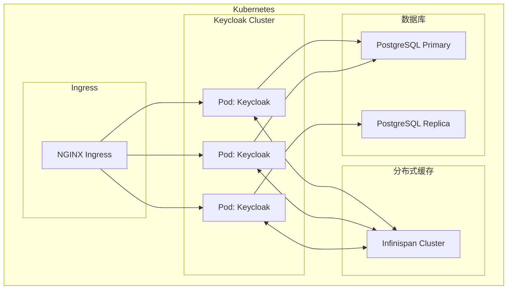

当你在本地跑通 Keycloak，用管理员账号创建了第一个 Realm，加载了示例用户，满心欢喜地以为大功告成——部署到生产环境时才发现，一切才刚刚开始。

PostgreSQL 连接池怎么配？多节点部署时 Session 如何共享？TLS 证书从哪来？频繁 Full GC 是怎么回事？

本文从实战出发，覆盖从开发环境到生产高可用的完整部署方案。

## 一、部署模式

### 1. Standalone 模式

单实例部署，适合开发/测试环境：

```bash
bin/kc.sh start \
  --db=postgres \
  --db-url=jdbc:postgresql://localhost:5432/keycloak \
  --db-username=keycloak \
  --db-password=secret \
  --https-key-store-file=keystore.p12 \
  --https-key-store-password=password \
  --hostname=auth.example.com
```

### 2. Standalone-HA 模式

多节点集群部署，使用 Infinispan 进行会话复制：

```bash
bin/kc.sh start \
  --db=postgres \
  --db-url=jdbc:postgresql://pg1:5432,pg2:5432/keycloak \
  --db-url-database=keycloak \
  --db-username=keycloak \
  --db-password=secret \
  --host-master \
  --start-index=1
```

### 3. Kubernetes 部署（推荐生产）

使用 Operator 或手动部署，结合外部数据库和缓存：



## 二、Docker 部署

### 基础 Docker Compose

```yaml title="docker-compose.yml"
version: '3.8'

services:
  keycloak:
    image: quay.io/keycloak/keycloak:24.0
    container_name: keycloak
    environment:
      KEYCLOAK_ADMIN: admin
      KEYCLOAK_ADMIN_PASSWORD: ${KEYCLOAK_PASSWORD}
      KC_DB: postgres
      KC_DB_URL: jdbc:postgresql://postgres:5432/keycloak
      KC_DB_USERNAME: keycloak
      KC_DB_PASSWORD: keycloak
      KC_HOSTNAME_STRICT: "false"
      KC_PROXY: edge
      KC_HEAP_ENABLED: "true"
      KC_HEAP_SIZE: "2g"
      KC_METASPACE_SIZE: "256m"
    ports:
      - "8080:8080"
    depends_on:
      postgres:
        condition: service_healthy
    command: start-dev

  postgres:
    image: postgres:16
    container_name: keycloak-postgres
    environment:
      POSTGRES_DB: keycloak
      POSTGRES_USER: keycloak
      POSTGRES_PASSWORD: keycloak
    volumes:
      - postgres_data:/var/lib/postgresql/data
      - ./postgres.conf:/etc/postgresql/postgresql.conf
    healthcheck:
      test: ["CMD-SHELL", "pg_isready -U keycloak"]
      interval: 10s
      timeout: 5s
      retries: 5
    ports:
      - "5432:5432"

volumes:
  postgres_data:
```

### 生产级 Docker Compose

```yaml title="docker-compose.prod.yml"
version: '3.8'

services:
  keycloak:
    image: quay.io/keycloak/keycloak:24.0
    container_name: keycloak
    environment:
      # 数据库配置
      KC_DB: postgres
      KC_DB_URL: jdbc:postgresql://pg-cluster:5432/keycloak?ssl=true&sslmode=require
      KC_DB_USERNAME: keycloak
      KC_DB_PASSWORD: ${DB_PASSWORD}
      # 连接池配置
      KC_DB_POOL_MIN_SIZE: 5
      KC_DB_POOL_MAX_SIZE: 20
      # 主机名配置
      KC_HOSTNAME: auth.example.com
      KC_HOSTNAME_STRICT: "false"
      KC_HOSTNAME_STRICT_BACKCHANNEL: "false"
      # 代理模式
      KC_PROXY: edge
      # HTTPS 配置
      KC_HTTPS_ENABLED: "true"
      KC_HTTPS_KEY_STORE_FILE: /opt/keycloak/conf/keystore.p12
      KC_HTTPS_KEY_STORE_PASSWORD: ${KEYSTORE_PASSWORD}
      KC_HTTPS_PROTOCOL: TLSv1.3
      # 缓存配置
      KC_CACHE: ispn
      KC_CACHE_STACK: kubernetes
      # 堆内存配置
      JAVA_OPTS_APPEND: "-Xms2g -Xmx2g -XX:+UseG1GC -XX:+ExitOnOutOfMemoryError"
    volumes:
      - ./keystore.p12:/opt/keycloak/conf/keystore.p12:ro
      - keycloak_data:/opt/keycloak/data
    healthcheck:
      test: ["CMD-SHELL", "exec 3<>/dev/tcp/127.0.0.1/9000;echo -e 'GET /health/ready HTTP/1.1\r\nhost: localhost\r\n\r\n' >&3;timeout 1 --signal=0 cat <&3|grep -q '\"status\":\"UP\"'"]
      interval: 30s
      timeout: 10s
      retries: 3
    restart: unless-stopped
    deploy:
      resources:
        limits:
          cpus: '2'
          memory: 3G
        reservations:
          cpus: '1'
          memory: 2G

  postgres:
    image: postgres:16
    environment:
      POSTGRES_DB: keycloak
      POSTGRES_USER: keycloak
      POSTGRES_PASSWORD: ${DB_PASSWORD}
    volumes:
      - pg_data:/var/lib/postgresql/data
      - ./backup:/var/backups/postgresql
    command:
      - "postgres"
      - "-c"
      - "max_connections=200"
      - "-c"
      - "shared_buffers=512MB"
      - "-c"
      - "effective_cache_size=1GB"
      - "-c"
      - "maintenance_work_mem=128MB"
      - "-c"
      - "checkpoint_completion_target=0.9"
      - "-c"
      - "wal_buffers=16MB"
      - "-c"
      - "default_statistics_target=100"
      - "-c"
      - "random_page_cost=1.1"
      - "-c"
      - "effective_io_concurrency=200"
      - "-c"
      - "max_worker_processes=8"
    restart: unless-stopped

volumes:
  pg_data:
  keycloak_data:
```

## 三、Kubernetes 部署

### Deployment 配置

```yaml title="keycloak-deployment.yaml"
apiVersion: apps/v1
kind: Deployment
metadata:
  name: keycloak
  namespace: auth
  labels:
    app: keycloak
spec:
  replicas: 3
  selector:
    matchLabels:
      app: keycloak
  template:
    metadata:
      labels:
        app: keycloak
      annotations:
        prometheus.io/scrape: "true"
        prometheus.io/port: "9000"
    spec:
      topologySpreadConstraints:
        - maxSkew: 1
          topologyKey: topology.kubernetes.io/zone
          whenUnsatisfiable: ScheduleAnyway
          labelSelector:
            matchLabels:
              app: keycloak
      containers:
        - name: keycloak
          image: quay.io/keycloak/keycloak:24.0
          imagePullPolicy: IfNotPresent
          args: ["start", "--optimized"]
          ports:
            - name: https
              containerPort: 8443
            - name: http
              containerPort: 8080
            - name: metrics
              containerPort: 9000
          env:
            - name: KC_HEAP_ENABLED
              value: "true"
            - name: KC_HEAP_SIZE
              value: "2g"
            - name: KC_METASPACE_SIZE
              value: "256m"
            - name: KC_DB
              value: "postgres"
            - name: KC_DB_URL
              value: "jdbc:postgresql://postgres.primary:5432/keycloak"
            - name: KC_DB_USERNAME
              valueFrom:
                secretKeyRef:
                  name: keycloak-secrets
                  key: db-username
            - name: KC_DB_PASSWORD
              valueFrom:
                secretKeyRef:
                  name: keycloak-secrets
                  key: db-password
            - name: KC_HOSTNAME
              value: "auth.example.com"
            - name: KC_HOSTNAME_STRICT
              value: "false"
            - name: KC_PROXY
              value: "edge"
            - name: JAVA_OPTS_APPEND
              value: "-XX:+UseG1GC -Djava.net.preferIPv4Stack=true -Djboss.modules.system.pkgs=org.jboss.bytesian"
          readinessProbe:
            httpGet:
              path: /health/ready
              port: 9000
              scheme: HTTPS
            initialDelaySeconds: 30
            periodSeconds: 10
            timeoutSeconds: 5
            failureThreshold: 3
          livenessProbe:
            httpGet:
              path: /health/live
              port: 9000
              scheme: HTTPS
            initialDelaySeconds: 60
            periodSeconds: 30
            timeoutSeconds: 5
            failureThreshold: 5
          resources:
            requests:
              cpu: "500m"
              memory: "2Gi"
            limits:
              cpu: "2000m"
              memory: "3Gi"
          volumeMounts:
            - name: keystore
              mountPath: /opt/keycloak/conf/keystore.p12
              subPath: keystore.p12
              readOnly: true
      volumes:
        - name: keystore
          secret:
            secretName: keycloak-tls
      affinity:
        podAntiAffinity:
          preferredDuringSchedulingIgnoredDuringExecution:
            - weight: 100
              podAffinityTerm:
                labelSelector:
                  matchLabels:
                    app: keycloak
                topologyKey: kubernetes.io/hostname
```

### Service 和 Ingress

```yaml title="keycloak-service-ingress.yaml"
---
apiVersion: v1
kind: Service
metadata:
  name: keycloak
  namespace: auth
  labels:
    app: keycloak
spec:
  type: ClusterIP
  ports:
    - name: https
      port: 443
      targetPort: 8443
      protocol: TCP
    - name: http
      port: 80
      targetPort: 8080
      protocol: TCP
  selector:
    app: keycloak

---
apiVersion: networking.k8s.io/v1
kind: Ingress
metadata:
  name: keycloak-ingress
  namespace: auth
  annotations:
    nginx.ingress.kubernetes.io/ssl-redirect: "true"
    nginx.ingress.kubernetes.io/proxy-buffer-size: "128k"
    nginx.ingress.kubernetes.io/proxy-buffering: "on"
    nginx.ingress.kubernetes.io/backend-protocol: "HTTPS"
    nginx.ingress.kubernetes.io/force-ssl-redirect: "true"
spec:
  ingressClassName: nginx
  tls:
    - hosts:
        - auth.example.com
      secretName: wildcard-tls
  rules:
    - host: auth.example.com
      http:
        paths:
          - path: /
            pathType: Prefix
            backend:
              service:
                name: keycloak
                port:
                  number: 443
```

## 四、数据库配置

### PostgreSQL 推荐配置

```sql title="postgresql.conf"
-- 连接配置
max_connections = 200
superuser_reserved_connections = 3

-- 内存配置
shared_buffers = 512MB
effective_cache_size = 1.5GB
maintenance_work_mem = 128MB
work_mem = 16MB

-- 写性能
wal_buffers = 16MB
checkpoint_completion_target = 0.9
max_wal_size = 4GB
min_wal_size = 1GB

-- 并行查询
max_worker_processes = 8
max_parallel_workers_per_gather = 4
max_parallel_workers = 8

-- 日志配置
log_destination = 'csvlog'
logging_collector = on
log_directory = 'log'
log_filename = 'postgresql-%Y-%m-%d.log'
log_statement = 'none'
log_min_duration_statement = 1000

-- 认证配置
password_encryption = scram-sha-256
```

### Keycloak 数据库连接池

```properties title="keycloak.conf"
# HikariCP 连接池配置
kc.db.pool.type=hikari
# 最小空闲连接数
db.pool.min-size=5
# 最大连接数
db.pool.max-size=20
# 连接超时（毫秒）
db.pool.connection-timeout=30000
# 空闲超时（毫秒）
db.pool.idle-timeout=600000
# 最大生命周期（毫秒）
db.pool.max-lifetime=1800000
```

## 五、TLS 配置

### 生成自签名证书（测试环境）

```bash
# 生成 PKCS12 格式证书
keytool -genkeypair \
  -alias keycloak \
  -keyalg RSA \
  -keysize 2048 \
  -validity 365 \
  -keystore keystore.p12 \
  -storetype PKCS12 \
  -storepass password \
  -keypass password \
  -dname "CN=auth.example.com,OU=Auth,O=Company,L=City,ST=State,C=CN"
```

### 使用 Let's Encrypt（生产环境）

```yaml title="cert-manager-issuer.yaml"
apiVersion: cert-manager.io/v1
kind: ClusterIssuer
metadata:
  name: letsencrypt-prod
spec:
  acme:
    server: https://acme-v02.api.letsencrypt.org/directory
    email: admin@example.com
    privateKeySecretRef:
      name: letsencrypt-prod-account-key
    solvers:
      - http01:
          ingress:
            class: nginx

---
apiVersion: cert-manager.io/v1
kind: Certificate
metadata:
  name: keycloak-tls
  namespace: auth
spec:
  secretName: wildcard-tls
  issuerRef:
    name: letsencrypt-prod
    kind: ClusterIssuer
  dnsNames:
    - auth.example.com
    - "*.auth.example.com"
```

## 六、生产环境关键配置

```properties title="production.conf"
# ===================
# 核心配置
# ===================

# 启用生产模式
kc.db.pool.type=hikari

# 启用 HTTPS
https.enabled=true
https.protocols=TLSv1.3
https.ciphers=TLS_AES_256_GCM_SHA384,TLS_AES_128_GCM_SHA256,TLS_CHACHA20_POLY1305_SHA256

# ===================
# 会话配置
# ===================

# Access Token：5 分钟
access-token-lifespan=300

# Refresh Token 最大 lifespan：8 小时
sso-session-max-lifespan=28800

# 空闲会话超时：30 分钟
sso-session-idle-timeout=1800

# Offline Session：30 天
offline-session-max-lifespan=2592000

# ===================
# 安全配置
# ===================

# 密码策略：最小长度、必须包含数字、大写字母、特殊字符
password-policy=length(12) and specialChars(1) and digits(1) and upperCase(1) and notUsername()

# 暴力破解保护
brute-force-protected=true
# 失败次数后锁定
failure-factor=5
# 锁定时间（秒）
max-login-failures=5
wait-increment-seconds=60

# 注册配置
registration-allowed=false
registration-email-as-username=true

# ===================
# 缓存配置
# ===================

# 使用 Infinispan 分布式缓存
cache=ispn
cache-stack=kubernetes

# 模板缓存
kc.cache.template-strategy=file

# ===================
# 日志配置
# ===================

# 减少日志输出
log-level=INFO
log-console-output=DEFAULT
```

## 七、备份与恢复

### 备份脚本

```bash title="backup.sh"
#!/bin/bash
set -e

BACKUP_DIR="/var/backups/keycloak"
DATE=$(date +%Y%m%d_%H%M%S)
RETENTION_DAYS=30

# 创建备份目录
mkdir -p ${BACKUP_DIR}

# 备份 Keycloak 数据库
echo "Backing up Keycloak database..."
pg_dump -h postgres -U keycloak -d keycloak -Fc -f ${BACKUP_DIR}/keycloak_db_${DATE}.dump

# 备份 Keycloak 配置
echo "Backing up Keycloak configuration..."
tar -czf ${BACKUP_DIR}/keycloak_config_${DATE}.tar.gz /opt/keycloak/data

# 备份 TLS 证书
echo "Backing up TLS certificates..."
cp /path/to/wildcard-tls.crt ${BACKUP_DIR}/tls_${DATE}.crt

# 清理过期备份
echo "Cleaning up old backups..."
find ${BACKUP_DIR} -name "*.dump" -mtime +${RETENTION_DAYS} -delete
find ${BACKUP_DIR} -name "*.tar.gz" -mtime +${RETENTION_DAYS} -delete
find ${BACKUP_DIR} -name "*.crt" -mtime +${RETENTION_DAYS} -delete

echo "Backup completed: ${DATE}"
```

### 恢复流程

```bash
# 1. 停止 Keycloak
kubectl scale deployment keycloak --replicas=0 -n auth

# 2. 恢复数据库
pg_restore -h postgres -U keycloak -d keycloak -c /path/to/keycloak_db_*.dump

# 3. 恢复配置
tar -xzf /path/to/keycloak_config_*.tar.gz -C /

# 4. 重启 Keycloak
kubectl scale deployment keycloak --replicas=3 -n auth
```

---

## 思考题

**问题 1**：Keycloak 在 Kubernetes 中运行时，使用默认的嵌入式 Infinispan 作为缓存。当 Pod 发生滚动更新时，用户可能会被强制登出。请分析原因并给出解决方案。

<details>
<summary>参考答案</summary>

**问题原因**：

Keycloak 使用 Infinispan 进行分布式缓存，缓存数据存储在 Pod 的本地内存中。当滚动更新导致 Pod 重启时：

1. Pod A 中的缓存数据（用户会话、Token 等）随着 Pod 重启丢失
2. 如果使用 `embedded` 模式，Pod 之间不共享缓存
3. 用户请求被路由到没有缓存数据的 Pod 时，需要重新认证

**解决方案**：

**方案一：外部化 Infinispan 集群**

```yaml title="infinispan-cache.yaml"
apiVersion: infinispan.org/v1
kind: InfinispanCluster
metadata:
  name: keycloak-cache
  namespace: auth
spec:
  replicas: 3
  security:
    endpointAuthenticationEnabled: false
  service:
    type: DataGrid
    container:
      storage:
        2Gi:
          persistent:
            storageClassName: fast-ssd
  config:
    clusters:
      - name: keycloak-datagrid
        size: 3
        sites:
          local:
            name: us-east-1
```

Keycloak 配置：

```properties
cache=ispn
cache-stack=kubernetes
# 指向外部 Infinispan 集群
infinispan.host.name=keycloak-cache
infinispan.port.name=hotrod
```

**方案二：使用 Redis 作为缓存**

Keycloak 从 21+ 版本开始支持 Redis 作为缓存后端：

```yaml
KC_CACHE=redis
KC_CACHE_REDIS_HOST=redis-cluster
KC_CACHE_REDIS_PORT=6379
KC_CACHE_REDIS_SSL=true
KC_CACHE_REDIS_DATABASE=0
```

**方案三：数据库作为 Session 存储**

禁用缓存，完全依赖数据库：

```properties
KC_CACHE=local
```

这会影响性能，但可以保证会话一致性。

**推荐方案**：生产环境使用外部 Infinispan 集群，配合跨 Zone 复制，实现高可用和会话持久化。

</details>

**问题 2**：在 Keycloak 生产部署中，数据库连接池配置不当可能导致严重的性能问题。请分析常见的连接池配置陷阱，并给出调优建议。

<details>
<summary>参考答案</summary>

**常见陷阱**：

**陷阱一：连接池太小**

```properties
# 错误配置
db.pool.min-size=1
db.pool.max-size=5
```

当并发请求超过 5 个时，后续请求需要等待可用连接，导致响应时间剧增。

**陷阱二：连接超时设置过短**

```properties
# 错误配置
db.pool.connection-timeout=5000
```

高负载时，5 秒超时可能不够，导致大量请求失败。

**陷阱三：最大生命周期太短**

```properties
# 错误配置
db.pool.max-lifetime=300000  # 5分钟
```

频繁重建连接增加开销。

**调优建议**：

**估算连接池大小公式**：

```
连接池大小 = ((核心数 * 2) + 有效磁盘数)
```

对于 8 核 CPU + SSD：连接池 ≈ 20-30

**推荐配置**：

```properties
# 适中连接池
db.pool.min-size=5
db.pool.max-size=30
# 较长超时
db.pool.connection-timeout=30000      # 30秒
# 较长空闲超时
db.pool.idle-timeout=600000          # 10分钟
# 较长生命周期
db.pool.max-lifetime=1800000         # 30分钟
```

**监控指标**：

1. **活动连接数**：`pool_active_count`
2. **空闲连接数**：`pool_idle_count`
3. **等待获取连接的线程数**：`pool_pending_thread`
4. **连接获取时间**：`pool_acquisition_time`
5. **连接创建时间**：`pool_creation_time`

**调优流程**：

```bash
# 1. 基准测试：观察正常负载下的连接池使用情况
# 2. 压测：模拟峰值负载
# 3. 观察指标：
#    - 如果 pool_pending_thread 经常 > 0，增加 max-size
#    - 如果 pool_acquisition_time 很长，增加 max-size
#    - 如果连接经常重建，减少 max-lifetime
# 4. 微调：逐步调整参数
```

**PostgreSQL 侧配合**：

```sql
-- 监控当前连接数
SELECT count(*) FROM pg_stat_activity;

-- 设置最大连接数（应大于 Keycloak 连接池上限）
ALTER SYSTEM SET max_connections = 200;

-- 推荐配置
ALTER SYSTEM SET shared_buffers = '512MB';
ALTER SYSTEM SET effective_cache_size = '1.5GB';
ALTER SYSTEM SET maintenance_work_mem = '128MB';
```

</details>
