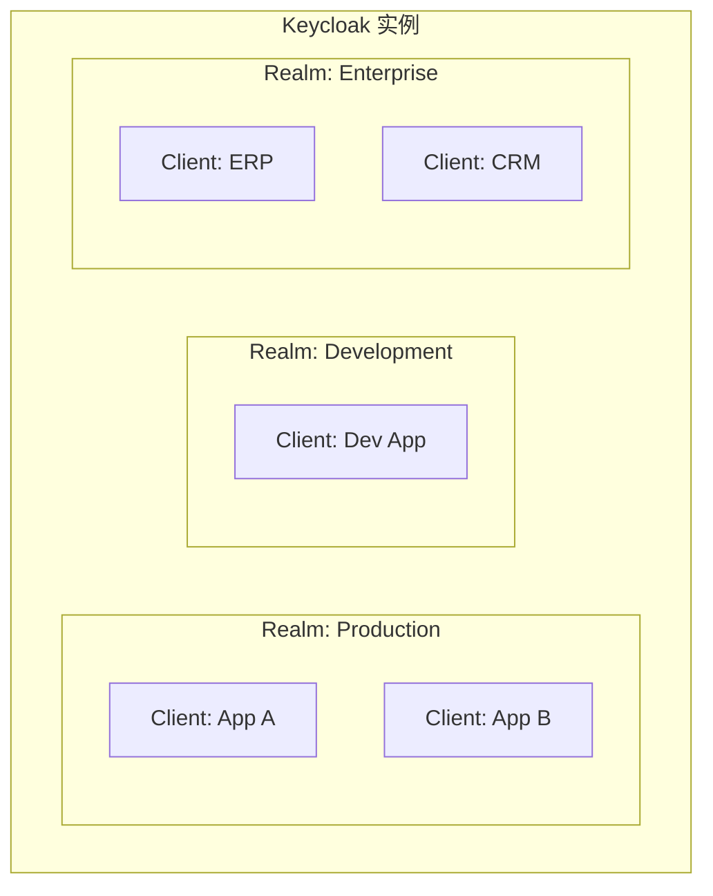
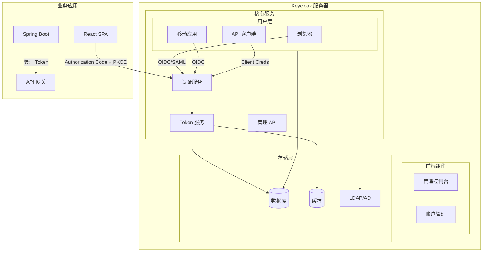
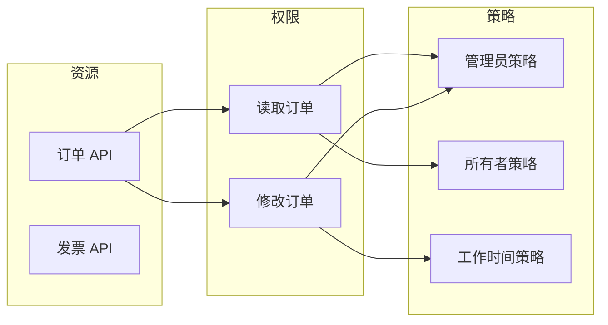
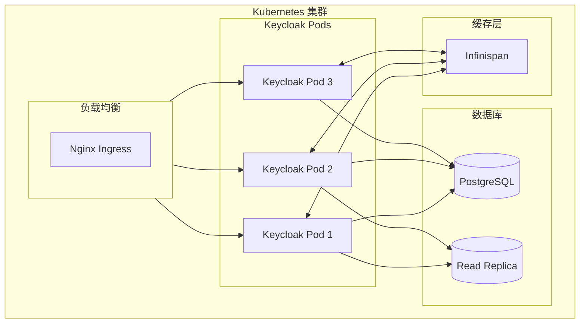

Netflix 每月处理数十亿次 API 请求，背后是数百个微服务在协同工作。在这样的规模下，身份认证不再是「用户登录后放行」这么简单——你需要统一的身份提供者，支持多协议、多租户、细粒度授权，还要能在几毫秒内完成 token 验证。

开源社区给出了一个答案：Keycloak。

## 一、Keycloak 定位与特点

Keycloak 是 Red Hat 赞助的开源身份与访问管理（IAM）解决方案，提供：

- **身份提供者（IdP）**功能：用户认证、注册、社交登录
- **单点登录（SSO）**：OIDC、SAML、CAS 协议支持
- **用户联盟（Identity Brokering）**：对接外部 IdP
- **细粒度授权（Authorization）**：基于策略的资源保护
- **账户管理**：用户自助服务、密码策略、MFA

### 与商业方案的对比

| 维度 | Keycloak | Okta | Azure AD |
|---|---|---|---|
| 成本 | 免费开源 | 按用户收费 | 按用户/功能收费 |
| 部署模式 | 自托管 + 云 | 仅云 | 云 + 混合 |
| 协议支持 | OIDC/SAML/CAS | OIDC/SAML | OIDC/SAML |
| 用户联盟 | 支持 | 支持 | 支持 |
| 细粒度授权 | 原生支持 | 有限 | Azure RMS |
| 社区活跃度 | 活跃（Apache 2.0） | N/A | N/A |

## 二、核心概念与术语

### Realm（领域）

Realm 是 Keycloak 中隔离的管理单元，类似租户概念：



**最佳实践**：

- 至少隔离 `production` 和 `development` 两个 Realm
- 不同业务线可以使用独立 Realm
- master Realm 用于管理其他 Realm

### Client（客户端）

Client 是需要使用 Keycloak 认证的应用或服务：

| Client 类型 | 说明 | 示例 |
|---|---|---|
| confidential | 需要客户端密钥 | 后端服务（Spring Boot） |
| public | 前端应用（SPA） | Vue/React 应用 |
| bearer-only | 只验证 Token | API 网关 |

```json title="Client 配置示例"
{
  "clientId": "order-service",
  "name": "订单服务",
  "description": "处理订单相关请求",
  "clientAuthenticatorType": "client-secret",
  "protocol": "openid-connect",
  "publicClient": false,
  "serviceAccountsEnabled": true,
  "authorizationServicesEnabled": true,
  "redirectUris": [
    "https://order.example.com/*"
  ],
  "webOrigins": [
    "https://order.example.com"
  ]
}
```

### Role（角色）与 Group（组）

**Role**：定义权限的抽象概念

```json
{
  "name": "order-admin",
  "description": "订单管理员权限",
  "composite": true,
  "composites": {
    "client": {
      "order-service": ["order:read", "order:write", "order:delete"]
    }
  }
}
```

**Group**：用户组织结构

```
├── Engineering
│   ├── Frontend
│   │   ├── user1@example.com
│   │   └── user2@example.com
│   └── Backend
│       └── user3@example.com
└── Product
    └── user4@example.com
```

**Role vs Group**：

| 维度 | Role | Group |
|---|---|---|
| 用途 | 权限抽象 | 组织结构 |
| 继承 | 可组合（Composite） | 成员自动继承 |
| 业务含义 | 能做什么 | 属于哪个部门 |

### Scope（作用域）

Scope 是 Access Token 中可以请求的权限范围：

```json
{
  "name": "read-only",
  "description": "只读权限",
  "displayName": "Read Only Access",
  "protocol": "openid-connect",
  "attributes": {
    "include.in.token.scope": "true"
  }
}
```

## 三、Keycloak 架构



### 核心组件

**Token Service**：负责签发、验证、管理 Token

**Authentication SPI**：可插拔的认证流程

**Authorization SPI**：基于策略的权限管理

**User Storage SPI**：对接外部用户源（LDAP、AD、数据库）

## 四、适配器体系

Keycloak 为各种平台提供了官方适配器：

### Java 适配器（Spring Security）

```xml title="pom.xml"
<dependency>
    <groupId>org.keycloak</groupId>
    <artifactId>keycloak-spring-boot-starter</artifactId>
    <version>${keycloak.version}</version>
</dependency>
```

```yaml title="application.yml"
server:
  port: 8080

keycloak:
  auth-server-url: https://auth.example.com
  realm: production
  resource: order-service
  credentials:
    secret: ${KEYCLOAK_CLIENT_SECRET}
  ssl-required: external
  use-resource-role-mappings: true
  enable-cors: true
  token-minimum-time-to-live: 60
  bearer-only: true
```

```java title="SecurityConfig.java"
import org.keycloak.adapters.springsecurity.config.KeycloakWebSecurityConfigurerAdapter;
import org.springframework.security.config.annotation.web.builders.HttpSecurity;
import org.springframework.security.config.annotation.web.configuration.EnableWebSecurity;

@EnableWebSecurity
public class SecurityConfig extends KeycloakWebSecurityConfigurerAdapter {

    @Override
    protected void configure(HttpSecurity http) throws Exception {
        super.configure(http);

        http
            .csrf()
                .disable()
            .authorizeRequests()
                .antMatchers("/public/**").permitAll()
                .antMatchers("/admin/**").hasRole("ADMIN")
                .antMatchers("/order/**").hasAnyRole("USER", "ADMIN")
                .anyRequest().authenticated()
            .and()
            .oauth2ResourceServer()
                .jwt(); // [!code highlight]
    }
}
```

### JavaScript 适配器（SPA）

```javascript title="keycloak.js"
import Keycloak from 'keycloak-js';

const keycloak = new Keycloak({
  url: 'https://auth.example.com',
  realm: 'production',
  clientId: 'react-app'
});

// 初始化并登录
await keycloak.init({
  onLoad: 'login-required',
  checkLoginIframe: false,
  pkceMethod: 'S256'
});

// 获取 Token
const token = keycloak.token;

// 刷新 Token
const refreshed = await keycloak.updateToken(300); // [!code highlight]

// 登出
await keycloak.logout();
```

### API 网关适配器

```java title="KeycloakSecurityContext.java"
public class KeycloakSecurityContext {

    public boolean validateToken(String token, String realmUrl) {
        try {
            // 1. 获取公开密钥（生产环境应缓存）
            String jwksUri = realmUrl + "/protocol/openid-connect/certs";
            JsonNode keys = fetchJwks(jwksUri);

            // 2. 解析并验证 Token
            DecodedJWT jwt = JWT.decode(token);
            String kid = jwt.getKeyId();

            // 3. 查找对应公钥验证签名
            PublicKey publicKey = getPublicKey(keys, kid);
            JWTVerifier verifier = JWTVerifier.require(publicKey);
            verifier.verify(jwt);

            return true;
        } catch (JWTVerificationException e) {
            return false;
        }
    }

    public Map<String, Object> extractRoles(String token) {
        DecodedJWT jwt = JWT.decode(token);
        return jwt.getClaim("realm_access").asMap();
    }
}
```

## 五、细粒度授权

Keycloak 的 Authorization Services 提供基于策略的资源保护：



```json title="资源定义示例"
{
  "name": "OrderResource",
  "owner": {
    "id": "owner-group-id"
  },
  "type": "urn:order-service:orders",
  "uri": "/api/orders/*",
  "scopes": ["read", "write", "delete"],
  "attributes": {
    "department": ["engineering"]
  }
}
```

```java title="PermissionEvaluator.java"
@Service
public class OrderPermissionEvaluator {

    @Autowired
    private KeycloakAuthorizationManager authorizationManager;

    public boolean canAccessOrder(String userId, String orderId, String scope) {
        // 从 OrderService 获取订单所有者
        String orderOwner = orderService.getOwner(orderId);

        // 构建权限请求
        AuthorizationRequest request = AuthorizationRequest.builder()
            .name("OrderResource")
            .type("urn:order-service:orders")
            .scope(scope)
            .claim("owner", orderOwner)
            .build();

        // 评估权限
        AuthorizationResponse response = authorizationManager.authorize(userId, request);
        return response.getDecision() == Decision.PERMIT;
    }
}
```

## 六、自定义主题与国际化

### 自定义登录主题

```
themes/
├── base/
│   ├── login/
│   └── account/
└── custom/
    ├── login/
    │   ├── login.ftl
    │   └── resources/css/styles.css
    └── account/
```

```html title="login.ftl"
<!DOCTYPE html>
<html>
<head>
    <link rel="stylesheet" href="${url.resourcesCommonPath}/css/styles.css">
</head>
<body class="login-body">
    <div class="login-container">
        <div class="login-brand">
            
        </div>
        <#if realm.internationalizationEnabled>
            <div class="language-selector">
                <#list realm.supportedLocales as locale>
                    <a href="?lang=${locale}">${locale.displayName}</a>
                </#list>
            </div>
        </#if>
        ${msg("loginTitle")}
        ${kcSanitize(resolveTemplate(bodyCLASS, ''))}
    </div>
</body>
</html>
```

## 七、高可用架构



### 关键配置

```yaml title="production-realm.json"
{
  "realm": "production",
  "enabled": true,
  "sslRequired": "external",
  "registrationAllowed": false,
  "loginWithEmailAllowed": true,
  "duplicateEmailsAllowed": false,
  "passwordPolicy": "length(12) and specialChars(1) and digits(1) and upperCase(1)",
  "bruteForceProtected": true,
  "failureFactor": 5,
  "offlineSessionCacheEnabled": true,
  "accessTokenLifespan": 300,
  "accessCodeLifespan": 60,
  "ssoSessionIdleTimeout": 1800,
  "ssoSessionMaxLifespan": 36000
}
```

---

## 思考题

**问题 1**：Keycloak 的 Realm、Client、Role、Group 四个概念容易混淆。请用一个具体业务场景（电商平台）来说明这四者的关系和应用方式。

<details>
<summary>参考答案</summary>

**场景：电商平台**

**Realm 划分**：

- `b2c`：面向消费者的商城
- `b2b`：面向企业客户的批发平台
- `internal`：内部管理系统

**Client 配置**：

```
b2c Realm:
  ├── web-store（消费者前端）
  ├── mobile-app（移动端）
  └── product-api（商品服务）
  └── order-api（订单服务）

b2b Realm:
  ├── b2b-portal（批发平台前端）
  └── order-api（订单服务 B2B 版本）

internal Realm:
  ├── admin-console（管理后台）
  └── analytics-api（数据分析）
```

**Role 层级**：

```
全局角色（Realm Roles）：
├── admin：系统管理员
├── operator：运营人员
└── support：客服

业务角色（Client Roles）：
order-api:
├── order:read：查看订单
├── order:create：创建订单
├── order:cancel：取消订单
└── order:refund：处理退款

product-api:
├── product:read：查看商品
├── product:write：管理商品
└── product:pricing：调整价格
```

**Group 组织结构**：

```
├── Sales Department
│   ├── Sales-Manager
│   │   └── has Role: operator
│   └── Sales-Associate
│       └── has Role: operator
├── IT Department
│   ├── Developer
│   │   └── has Role: developer
│   └── DevOps
│       └── has Role: developer + admin（部分）
└── Finance Department
    └── Accountant
        └── has Role: finance + operator
```

**授权示例**：

用户 Zhang Wei 是销售经理，登录 B2C 商城的流程：

1. Zhang Wei 属于 `Sales Department/Sales-Manager` Group
2. Group 自动继承 `operator` Realm Role
3. 访问订单 API 时，Token 中包含 `operator` Role
4. 订单 API 检查 Token，验证是否有 `order:read` 权限
5. `operator` + 特定配置允许读取所有订单

用户 Wang Li 是店铺店员，登录流程：

1. Wang Li 属于 `Store-001` Group（店铺组）
2. 店铺组配置了特定资源的访问权限
3. Wang Li 只能访问 `Store-001` 相关的订单

</details>

**问题 2**：在微服务架构中使用 Keycloak，如何设计 Token 验证策略以平衡安全性和性能？

<details>
<summary>参考答案</summary>

**核心矛盾**：

- 每次请求都远程验证 Token（调用 Keycloak）：最安全，但延迟高
- 只做本地 JWT 验证：性能好，但无法及时撤销 Token

**分层验证策略**：

```
┌─────────────────────────────────────────────────────┐
│                    API Gateway                      │
│  ┌─────────────────────────────────────────────┐  │
│  │ 1. JWT 本地签名验证（快速拒绝无效 Token）      │  │
│  │ 2. Token 过期时间检查                         │  │
│  │ 3. 基本权限预检查（提前拦截）                  │  │
│  └─────────────────────────────────────────────┘  │
└─────────────────────────────────────────────────────┘
                        │
                        ▼
┌─────────────────────────────────────────────────────┐
│                   Infinispan Cache                  │
│  ┌─────────────────────────────────────────────┐  │
│  │ - Token 黑名单（TTL = Token 剩余有效期）     │  │
│  │ - 用户权限快照（TTL = 5 分钟）               │  │
│  └─────────────────────────────────────────────┘  │
└─────────────────────────────────────────────────────┘
                        │
                        ▼
┌─────────────────────────────────────────────────────┐
│                  Keycloak Server                    │
│     仅在以下情况调用：                               │
│     1. Token 黑名单未命中（检查撤销）                │
│     2. 需要最新权限信息                             │
│     3. Token Refresh                               │
└─────────────────────────────────────────────────────┘
```

**具体实现**：

```java title="CachedTokenValidator.java"
@Service
public class CachedTokenValidator {

    private final JwsProvider jwsProvider;
    private final RemoteTokenService remoteTokenService;
    private final CacheManager cacheManager;

    public TokenValidationResult validate(String token) {
        // 1. 本地 JWT 签名验证（无网络开销）
        Jws<Claims> jws = jwsProvider.parse(token);

        // 2. 检查 Token 是否在黑名单
        String jti = jws.getPayload().getId();
        if (blacklistCache.contains(jti)) {
            return TokenValidationResult.REVOKED;
        }

        // 3. 检查过期时间
        Date exp = jws.getPayload().getExpiration();
        if (exp.before(new Date())) {
            return TokenValidationResult.EXPIRED;
        }

        // 4. 根据 Token 类型决定是否远程验证
        String tokenType = jws.getHeader().get("typ");
        if ("Access".equals(tokenType)) {
            // Access Token：本地验证 + 定期刷新权限
            return validateWithPermissionCache(jws);
        } else {
            // Refresh Token：必须远程验证
            return remoteTokenService.validate(token);
        }
    }

    private TokenValidationResult validateWithPermissionCache(Jws<Claims> jws) {
        String userId = jws.getPayload().getSubject();

        // 从缓存获取权限（5分钟有效）
        Set<String> permissions = permissionCache.get(userId);
        if (permissions == null) {
            // 缓存未命中，从 Keycloak 获取
            permissions = remoteTokenService.fetchPermissions(userId);
            permissionCache.put(userId, permissions, Duration.ofMinutes(5));
        }

        return new TokenValidationResult(true, permissions);
    }
}
```

**关键优化点**：

1. **公钥本地缓存**：JWKS 端点的公钥缓存 1 小时
2. **Token 黑名单**：使用 Redis，设置 TTL = Token 剩余有效期
3. **权限快照**：用户权限缓存 5 分钟，避免每次查 Keycloak
4. **短 Access Token**：Access Token 5-15 分钟过期
5. **批量验证**：一次获取多个 Token 的验证结果

</details>
