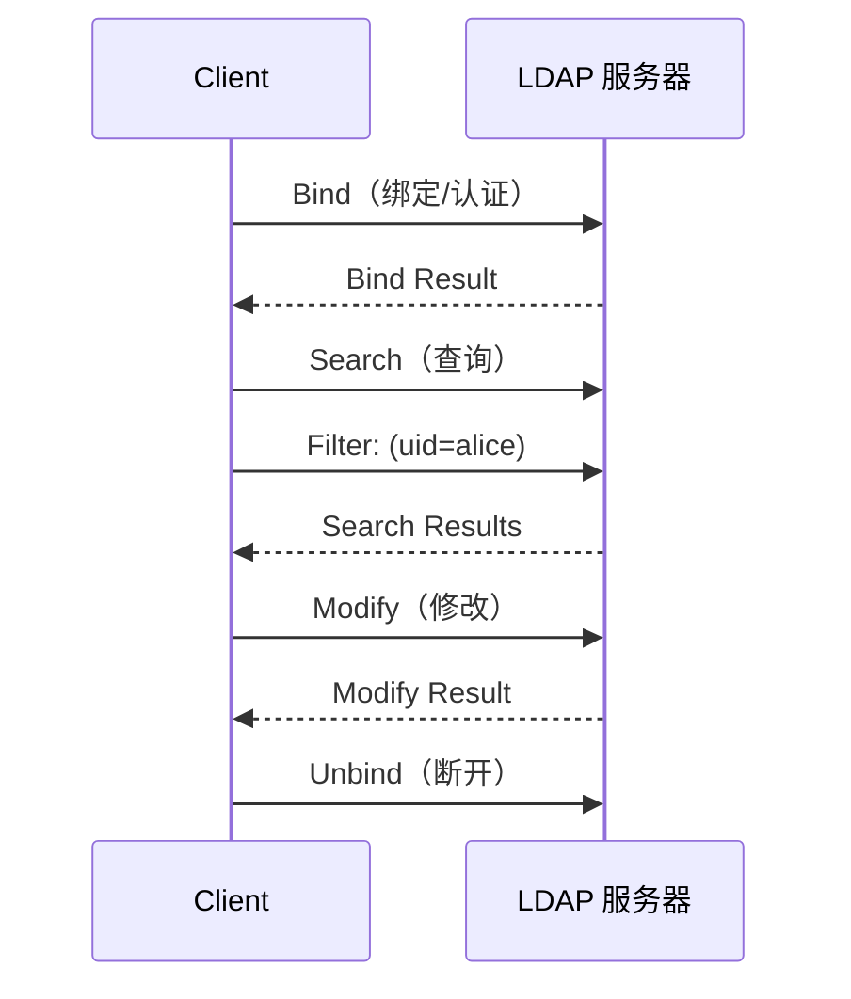
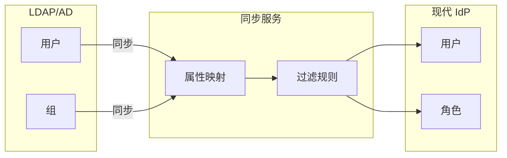

大多数技术人员第一次接触 LDAP，是在入职第一天登录公司电脑时。输入用户名密码，电脑验证通过，内网邮箱、代码仓库、VPN 系统自动放行——这个「一次登录，处处通行」的体验背后，是 LDAP 在默默工作。

但 LDAP 诞生于 1988 年，那时的网络环境和今天完全不同。在云原生、SaaS 普及的今天，LDAP 还有一席之地吗？答案是肯定的——但需要正确理解它的定位。

## 一、LDAP 协议基础

### 什么是 LDAP

LDAP（Lightweight Directory Access Protocol，轻量级目录访问协议）是一种用于访问目录服务的协议。目录服务是一种专门优化过的数据库，擅长处理「读多写少」的查询场景——正好符合用户账户管理的需求。

### 目录服务模型

LDAP 使用层次化的目录结构，与传统关系型数据库的表结构完全不同：

```
                    dc=example,dc=com
                           │
           ┌───────────────┼───────────────┐
           │               │               │
        ou=users       ou=groups      ou=computers
           │               │               │
      uid=alice      cn=admins      cn=server1
      uid=bob        cn=developers  cn=server2
      uid=charlie    cn=qa
```

**基本概念**：

| 概念 | 全称 | 说明 |
|---|---|---|
| DC | Domain Component | 域名组件，如 `example.com` 表示为 `dc=example,dc=com` |
| DN | Distinguished Name | 唯一标识目录中条目的名称 |
| CN | Common Name | 通用名称，如用户名或组名 |
| OU | Organizational Unit | 组织单元，用于分组 |
| UID | User ID | 用户唯一标识符 |

### DN 与 RDN

DN 是目录中条目的完整路径：

```
uid=alice,ou=users,dc=example,dc=com
```

其中 `uid=alice` 是 RDN（Relative Distinguished Name），相对于父节点的唯一标识。

### LDAP 操作类型



**常用操作**：

| 操作 | 说明 | 用途 |
|---|---|---|
| Bind | 绑定/认证 | 验证用户凭据 |
| Search | 搜索 | 查询用户/组信息 |
| Add | 添加 | 创建新条目 |
| Modify | 修改 | 更新现有条目 |
| Delete | 删除 | 删除条目 |
| Compare | 比较 | 检查属性值 |

## 二、LDAP 认证流程

### Bind 操作详解

LDAP 认证的核心是 Bind 操作，有两种模式：

**简单绑定（Simple Bind）**

```java title="LdapAuthentication.java"
import javax.naming.Context;
import javax.naming.directory.DirContext;
import javax.naming.directory.InitialDirContext;
import java.util.Hashtable;

public class LdapAuthentication {

    public boolean authenticate(String username, String password) {
        Hashtable<String, String> env = new Hashtable<>();
        env.put(Context.INITIAL_CONTEXT_FACTORY, "com.sun.jndi.ldap.LdapCtxFactory");
        env.put(Context.PROVIDER_URL, "ldap://ldap.example.com:389");
        env.put(Context.SECURITY_AUTHENTICATION, "simple");

        // 构造用户 DN
        String userDn = "uid=" + username + ",ou=users,dc=example,dc=com";
        env.put(Context.SECURITY_PRINCIPAL, userDn);
        env.put(Context.SECURITY_CREDENTIALS, password);

        try {
            DirContext ctx = new InitialDirContext(env);
            ctx.close();
            return true; // 认证成功
        } catch (javax.naming.AuthenticationException e) {
            return false; // 认证失败
        } catch (Exception e) {
            // 连接失败
            return false;
        }
    }
}
```

**SASL 绑定（支持更多认证机制）**

```java
env.put(Context.SECURITY_AUTHENTICATION, "DIGEST-MD5");
// 或
env.put(Context.SECURITY_AUTHENTICATION, "GSSAPI"); // Kerberos
```

### 匿名绑定与限制

```java title="LdapSearch.java"
public class LdapSearch {

    public List<String> searchUsers() {
        Hashtable<String, String> env = new Hashtable<>();
        env.put(Context.INITIAL_CONTEXT_FACTORY, "com.sun.jndi.ldap.LdapCtxFactory");
        env.put(Context.PROVIDER_URL, "ldap://ldap.example.com:389");

        // 匿名绑定（如果服务器允许）
        env.put(Context.SECURITY_AUTHENTICATION, "none");

        try {
            DirContext ctx = new InitialDirContext(env);

            // 搜索配置
            SearchControls controls = new SearchControls();
            controls.setSearchScope(SearchControls.SUBTREE_SCOPE);
            controls.setReturningAttributes(new String[]{"uid", "cn", "mail"});

            // 执行搜索
            NamingEnumeration<SearchResult> results = ctx.search(
                "ou=users,dc=example,dc=com",
                "(objectClass=inetOrgPerson)",
                controls
            );

            List<String> users = new ArrayList<>();
            while (results.hasMore()) {
                SearchResult result = results.next();
                users.add(result.getNameInNamespace());
            }

            ctx.close();
            return users;
        } catch (Exception e) {
            throw new RuntimeException(e);
        }
    }
}
```

## 三、OpenLDAP 部署与配置

### Docker 部署

```yaml title="docker-compose.yml"
version: '3.8'

services:
  openldap:
    image: osixia/openldap:1.5.0
    container_name: openldap
    environment:
      LDAP_ORGANISATION: Example Inc
      LDAP_DOMAIN: example.com
      LDAP_ADMIN_PASSWORD: admin_secret
      LDAP_CONFIG_PASSWORD: config_secret
    ports:
      - "389:389"
      - "636:636"
    volumes:
      - ldap_data:/var/lib/ldap
      - ldap_config:/etc/ldap/slapd.d
    healthcheck:
      test: ["CMD", "ldapwhoami", "-x", "-H", "ldap://localhost", "-w", "admin_secret"]
      interval: 30s
      timeout: 10s
      retries: 3

  phpldapadmin:
    image: osixia/phpldapadmin:0.9.0
    container_name: phpldapadmin
    environment:
      PHPLDAPADMIN_LDAP_HOSTS: openldap
      PHPLDAPADMIN_HTTPS: "false"
    ports:
      - "8080:80"
    depends_on:
      - openldap

volumes:
  ldap_data:
  ldap_config:
```

### LDIF 数据导入

```text title="users.ldif"
# 创建组织单元
dn: ou=users,dc=example,dc=com
objectClass: organizationalUnit
ou: users

# 创建组
dn: ou=groups,dc=example,dc=com
objectClass: organizationalUnit
ou: groups

# 创建管理员组
dn: cn=admins,ou=groups,dc=example,dc=com
objectClass: groupOfNames
cn: admins
member: uid=alice,ou=users,dc=example,dc=com

# 创建用户
dn: uid=alice,ou=users,dc=example,dc=com
objectClass: inetOrgPerson
objectClass: posixAccount
objectClass: shadowAccount
uid: alice
cn: Alice Zhang
sn: Zhang
givenName: Alice
mail: alice@example.com
userPassword: {SSHA}xxxxxxxxxxxxxxxxxxxxxxxx
uidNumber: 1000
gidNumber: 1000
homeDirectory: /home/alice

# 创建普通用户
dn: uid=bob,ou=users,dc=example,dc=com
objectClass: inetOrgPerson
objectClass: posixAccount
objectClass: shadowAccount
uid: bob
cn: Bob Wang
sn: Wang
givenName: Bob
mail: bob@example.com
userPassword: {SSHA}yyyyyyyyyyyyyyyyyyyyyyyy
uidNumber: 1001
gidNumber: 1000
homeDirectory: /home/bob
```

```bash
# 导入 LDIF 数据
ldapadd -x -H ldap://localhost:389 -D "cn=admin,dc=example,dc=com" -W -f users.ldif
```

### 密码策略（ppolicy）

```text title="password-policy.ldif"
dn: cn=module{0},cn=config
cn: module{0}
objectClass: olcModuleList
olcModuleLoad: ppolicy.la

dn: olcOverlay={0}ppolicy,olcDatabase={1}mdb,cn=config
objectClass: olcPPolicyConfig
olcPPolicyDefault: cn=default,ou=policies,dc=example,dc=com
olcPPolicyForwardUpdates: FALSE
olcPPolicyHashCleartext: TRUE
```

## 四、Active Directory

### AD 与 LDAP 的关系

Active Directory（活动目录）是 Microsoft 实现的目录服务，基于 LDAP v3 协议，但增加了很多 Windows 特有的扩展：

```mermaid
flowchart TB
    subgraph AD["Active Directory"]
        ADDS["AD DS<br/>(Active Directory Domain Services)"]
        ADCS["AD CS<br/>(Certificate Services)"]
        ADRMS["AD RMS<br/>(Rights Management)"]
        AD LDS["AD LDS<br/>(Lightweight Services)"]
    end

    subgraph LDAP["标准 LDAP"]
        OpenLDAP["OpenLDAP"]
        389DS["389 Directory Server"]
    end

    ADDS -->|基于| LDAP
    AD LDS -->|基于| LDAP
```

### 核心概念

**AD DS（Active Directory Domain Services）**

| 概念 | 说明 |
|---|---|
| Domain | 域，AD 的基本管理单元 |
| Forest | 森林，多个域的集合 |
| Tree | 树，多个有信任关系的域 |
| OU | 组织单元，容器对象 |
| Container | 容器，与 OU 类似但不可链接 GPO |
| Global Catalog | 全局编录，存储森林中所有对象的部分属性 |

**对象类别**：

| 对象类 | 说明 |
|---|---|
| user | 用户账户 |
| computer | 计算机对象 |
| group | 安全组/分发组 |
| organizationalUnit | 组织单元 |
| container | 容器 |

### AD 认证协议

AD 支持多种认证协议：

| 协议 | 说明 | 适用场景 |
|---|---|---|
| NTLM | 较老的认证协议 | 兼容旧系统 |
| Kerberos | 现代默认协议 | AD 域内认证 |
| LDAP Simple Bind | 基本 LDAP 认证 | 应用集成 |
| LDAPS | LDAP + SSL/TLS | 安全认证 |

```java title="AdAuthentication.java"
import javax.naming.Context;
import javax.naming.directory.DirContext;
import javax.naming.directory.InitialDirContext;
import java.util.Hashtable;

public class AdAuthentication {

    // 使用 LDAP 认证 AD 用户
    public boolean authenticateWithLdap(String username, String password) {
        Hashtable<String, String> env = new Hashtable<>();
        env.put(Context.INITIAL_CONTEXT_FACTORY, "com.sun.jndi.ldap.LdapCtxFactory");
        env.put(Context.PROVIDER_URL, "ldap://ad.example.com:389");
        env.put(Context.SECURITY_AUTHENTICATION, "simple");

        // AD 用户 DN 格式
        String userDn = username + "@example.com";
        env.put(Context.SECURITY_PRINCIPAL, userDn);
        env.put(Context.SECURITY_CREDENTIALS, password);

        try {
            DirContext ctx = new InitialDirContext(env);
            ctx.close();
            return true;
        } catch (Exception e) {
            return false;
        }
    }

    // 使用 Kerberos 认证（推荐）
    public boolean authenticateWithKerberos(String username, String password) {
        // 需要配置 krb5.conf 和 login.conf
        // 使用 GSSAPI 机制
        return false; // 示意
    }
}
```

### AD LDS（AD Lightweight Directory Services）

AD LDS 是 AD 的精简版，不依赖域控制器，适合应用程序使用：

```java
// AD LDS 连接示例
env.put(Context.PROVIDER_URL, "ldap://adlds.example.com:50000");
env.put(Context.SECURITY_AUTHENTICATION, "simple");
env.put("java.naming.ldap.attributes.binary", "objectGUID");
```

## 五、LDAP 安全配置

### LDAPS（LDAP over SSL/TLS）

```bash
# 生成自签名证书
openssl req -x509 -newkey rsa:2048 -keyout ldap.key -out ldap.crt -days 365 -nodes

# 配置 OpenLDAP 使用证书
ldapmodify -H ldap://localhost:389 -Y EXTERNAL -f /path/to/tls-config.ldif
```

```text title="enable-tls.ldif"
dn: cn=config
add: olcTLSCertificateFile
olcTLSCertificateFile: /etc/ldap/ssl/ldap.crt
-
add: olcTLSCertificateKeyFile
olcTLSCertificateKeyFile: /etc/ldap/ssl/ldap.key
```

### 匿名绑定限制

```text title="disable-anonymous.ldif"
dn: olcDatabase={1}mdb,cn=config
add: olcAccess
olcAccess: to attrs=userPassword
  by self =xw
  by anonymous auth
  by * none

olcAccess: to *
  by users read
  by * none
```

### 入侵检测与锁定

```text title="ppolicy-config.ldif"
dn: ou=policies,dc=example,dc=com
objectClass: top
objectClass: organizationalUnit
ou: policies

dn: cn=default,ou=policies,dc=example,dc=com
objectClass: top
objectClass: pwdPolicy
cn: default
pwdAttribute: userPassword
pwdMinLength: 12
pwdInHistory: 5
pwdMaxFailure: 5
pwdLockout: TRUE
pwdLockoutDuration: 1800
pwdFailureCountInterval: 900
pwdMaxAge: 7776000
pwdGraceAuthNLimit: 3
```

## 六、现代 IAM 集成

### LDAP 作为身份源

现代 IAM 系统（如 Keycloak、Auth0）可以将 LDAP 作为身份源：

```yaml title="Keycloak LDAP 配置"
# 连接到公司 LDAP/AD
kc.db=postgres
kc.hostname=auth.example.com

# LDAP 用户存储配置
# 通过管理控制台配置
```

### 同步策略



```java title="LdapSyncService.java"
@Service
public class LdapSyncService {

    @Autowired
    private UserRepository userRepository;

    @Autowired
    private LdapTemplate ldapTemplate;

    public void syncUsers() {
        // 从 LDAP 搜索所有用户
        List<User> ldapUsers = ldapTemplate.search(
            query()
                .base("ou=users,dc=example,dc=com")
                .where("objectClass").is("inetOrgPerson"),
            (ctx) -> {
                User user = new User();
                user.setUsername((String) ctx.getAttribute("uid").get());
                user.setEmail((String) ctx.getAttribute("mail").get());
                user.setFullName((String) ctx.getAttribute("cn").get());
                user.setEmployeeId((String) ctx.getAttribute("employeeNumber").get());
                return user;
            }
        );

        // 增量同步：只同步变更的用户
        for (User ldapUser : ldapUsers) {
            User existing = userRepository.findByUsername(ldapUser.getUsername());
            if (existing == null) {
                // 新用户：创建
                userRepository.save(ldapUser);
            } else if (hasChanges(existing, ldapUser)) {
                // 变更用户：更新
                existing.setEmail(ldapUser.getEmail());
                existing.setFullName(ldapUser.getFullName());
                userRepository.save(existing);
            }
        }
    }
}
```

## 七、云时代的局限性

LDAP 在云环境下面临的挑战：

| 挑战 | 影响 | 应对方案 |
|---|---|---|
| 防火墙限制 | 云服务难以访问本地 LDAP | LDAPS over Internet / 复制到云 |
| 延迟问题 | 跨地域查询慢 | 就近部署 LDAP 副本 |
| 高可用复杂 | 云+本地混合架构复杂 | 云托管目录服务 |
| 管理复杂度 | 传统 LDAP 配置复杂 | 使用托管服务 |

### 替代方案

| 方案 | 适用场景 | 示例 |
|---|---|---|
| 云托管目录 | 云原生应用 | AWS Directory Service, Azure AD |
| 身份即服务 | SaaS 应用 | Okta, Auth0, Keycloak |
| LDAP 云代理 | 混合架构 | Azure AD Connect |

---

## 思考题

**问题 1**：某公司计划将本地 LDAP 目录服务扩展到云环境，同时需要支持本地应用和云 SaaS 应用。请设计一个混合云目录架构，并分析关键的技术选型。

<details>
<summary>参考答案</summary>

**架构设计**：

```
┌─────────────────────────────────────────────────────────────────┐
│                         云端                                     │
│  ┌─────────────────┐   ┌─────────────────┐   ┌─────────────────┐ │
│  │  Azure AD /    │   │   云 LDAP       │   │  SaaS 应用      │ │
│  │  Okta           │   │   代理服务      │   │  (Salesforce)   │ │
│  └────────┬────────┘   └────────┬────────┘   └────────┬────────┘ │
│           │                     │                     │          │
│           └─────────────────────┴─────────────────────┘          │
│                              │                                   │
│                    ┌─────────▼─────────┐                        │
│                    │   身份同步服务     │                        │
│                    │  (Azure AD Sync) │                        │
│                    └─────────┬─────────┘                        │
└──────────────────────────────┼───────────────────────────────────┘
                               │ 同步
┌──────────────────────────────┼───────────────────────────────────┐
│                         本地                                     │
│                    ┌─────────▼─────────┐                        │
│                    │   主 LDAP/AD     │                        │
│                    │   (Windows AD)   │                        │
│                    └─────────┬─────────┘                        │
│           ┌─────────────────┼─────────────────┐                │
│  ┌────────▼────────┐  ┌────────▼────────┐  ┌────────▼────────┐ │
│  │ 内部应用 A      │  │ 内部应用 B      │  │ 内部应用 C      │ │
│  │ (直连 LDAP)    │  │ (直连 LDAP)    │  │ (LDAPS)        │ │
│  └─────────────────┘  └─────────────────┘  └─────────────────┘ │
└─────────────────────────────────────────────────────────────────┘
```

**关键组件说明**：

1. **主目录**：Windows AD 作为主身份源，管理本地所有用户
2. **云同步**：使用 Azure AD Connect 同步用户到 Azure AD
3. **云 LDAP 代理**：Azure AD Domain Services 提供云端 LDAP 兼容接口
4. **SaaS 集成**：SaaS 应用通过 SAML/OIDC 集成 Azure AD
5. **内部应用**：通过 LDAPS 直接连接本地 AD

**技术选型建议**：

| 场景 | 方案 | 理由 |
|---|---|---|
| 用户 < 500 | Azure AD Connect | 免费同步，功能完整 |
| 用户 > 500 | Azure AD Connect + Staging | 测试同步配置 |
| 复杂 OU 结构 | Azure AD Connect + 自定义规则 | 支持复杂同步逻辑 |
| 高安全要求 | Azure AD Connect + PHS | 密码哈希同步 |

**注意事项**：

1. **延迟同步 vs 实时同步**：Azure AD Connect 默认 30 分钟同步，可调整为增量同步
2. **密码策略**：云端密码策略独立于本地 AD
3. **MFA 统一**：云端 MFA 统一在 Azure AD 层处理

</details>

**问题 2**：LDAP 的 ACL 机制（olcAccess）与关系型数据库的 RBAC 相比有哪些特点？在什么场景下 LDAP 的权限模型更适用？

<details>
<summary>参考答案</summary>

**LDAP ACL vs 数据库 RBAC 对比**：

| 维度 | LDAP ACL | 数据库 RBAC |
|---|---|---|
| 权限粒度 | 条目级别、属性级别 | 行级别、列级别 |
| 继承机制 | 基于 DN 层级继承 | 基于角色继承 |
| 配置方式 | LDIF 静态配置 | 运行时动态配置 |
| 审计能力 | 有限 | 完整审计日志 |
| 适用场景 | 目录查询优化 | 事务性操作 |

**LDAP ACL 语法示例**：

```text
# 语法：to <what> by <who> <access_level>
# 权限级别：none < compare < auth < search < read < write < manage

# 用户只能修改自己的密码
olcAccess: to attrs=userPassword
  by self =xw          # 自己可写
  by anonymous =x      # 匿名可认证
  by * none            # 其他无权限

# 组内成员可读取公开属性
olcAccess: to attrs=cn,sn,givenName,mail
  by self r
  by group.exact="cn=employees,ou=groups,dc=example,dc=com" r
  by * none

# 管理员可写所有
olcAccess: to *
  by dn.exact="cn=admin,dc=example,dc=com" write
  by * none
```

**LDAP 更适用的场景**：

**场景一：组织架构驱动的权限模型**

LDAP 的 DN 层级天然支持组织架构继承：

```text
# OU 层级自动继承权限
dn: ou=engineering,dc=example,dc=com
olcAcIs: to *
  by group.exact="cn=engineering-managers,ou=groups,dc=example,dc=com" write

# 子 OU 自动继承父 OU 的权限
dn: ou=backend,ou=engineering,dc=example,dc=com
# 自动继承 engineering 的权限
```

**场景二：属性级别的细粒度控制**

```text
# HR 可以读取员工薪资，但普通员工不行
olcAccess: to attrs=salary
  by group.exact="cn=hr-managers,ou=groups,dc=example,dc=com" read
  by * none

# 所有人都可以读取姓名和邮箱
olcAccess: to attrs=cn,mail,telephoneNumber
  by * read
```

**场景三：跨系统统一身份**

LDAP 作为中央身份存储，多个应用共享同一套权限模型：

```
┌─────────────────────────────────────────────┐
│           LDAP/AD（中央身份）                │
│  ┌─────────────────────────────────────┐   │
│  │ ou=users,dc=example,dc=com          │   │
│  │   uid=alice (memberOf: cn=engineers)│   │
│  └─────────────────────────────────────┘   │
└─────────────────────────────────────────────┘
        │                 │
        ▼                 ▼
┌───────────────┐   ┌───────────────┐
│ VPN 系统      │   │ 代码仓库      │
│ LDAP 认证     │   │ LDAP 认证     │
│ 工程师组可 VPN │   │ 工程师组可读  │
└───────────────┘   └───────────────┘
```

**不适用的场景**：

1. **复杂业务权限逻辑**：如「部门经理只能管理本部门员工」这类动态计算
2. **高频写入场景**：LDAP 优化方向是读，频繁写入性能差
3. **细粒度数据权限**：如「用户只能看到自己创建的订单」

</details>
