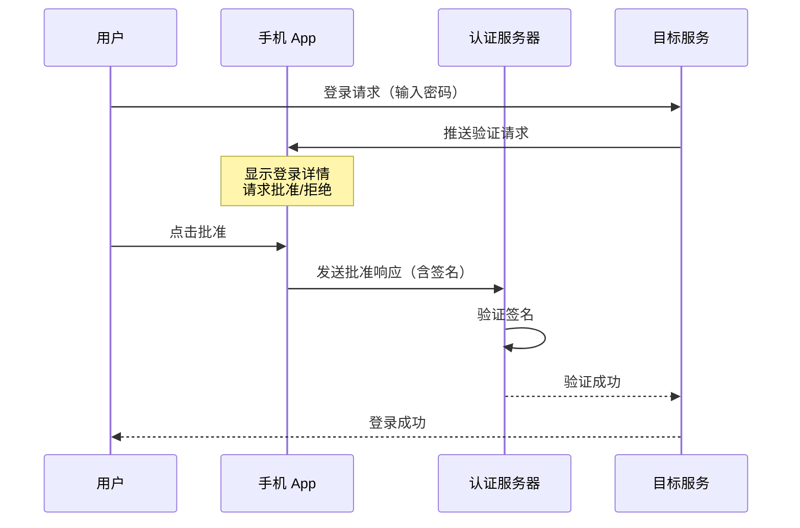
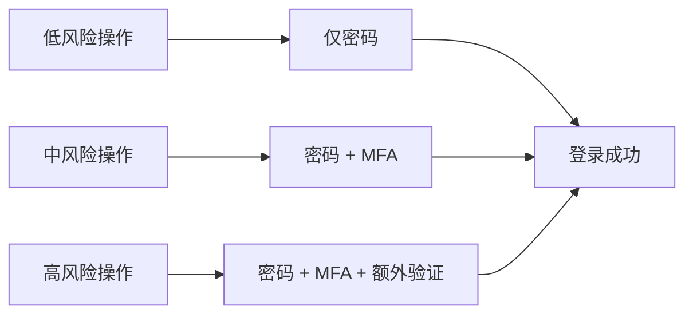
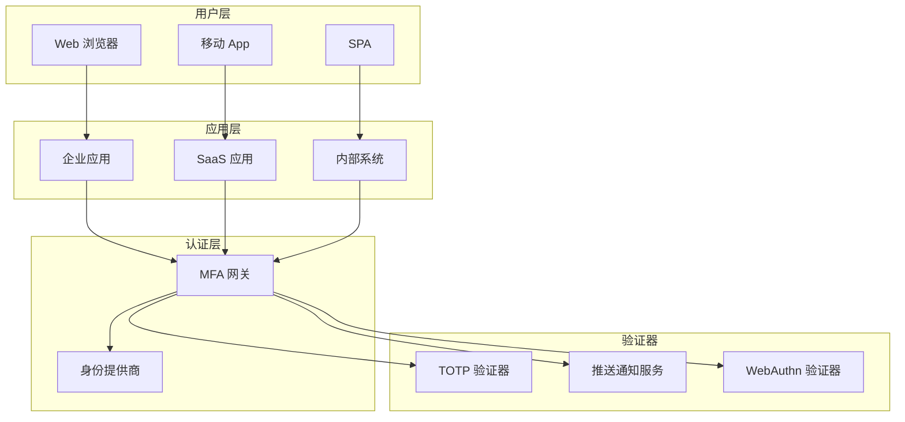
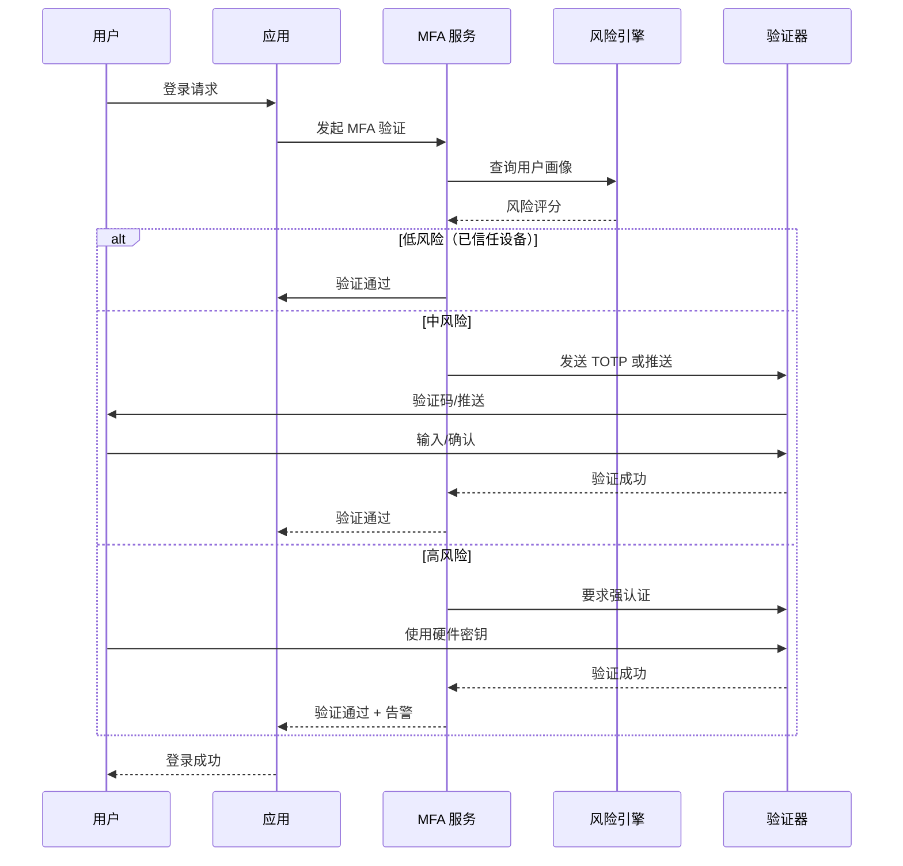

2019 年，某科技公司 CEO 的手机卡被攻击者通过「SIM 卡交换」攻击盗取。攻击者利用手机号码重置了 Twitter 账号的密码，发布了一系列不当言论，导致公司股价在 15 分钟内下跌了 6%。这起事件让整个行业重新审视了一个问题：**仅仅依赖密码的认证，真的够安全吗？**

多因素认证（MFA）不是万能的，但它是目前最务实的安全加固方案。本文将深入剖析 MFA 的设计原理与实现路径。

## 一、多因素认证的定义

多因素认证要求用户同时提供**两个及以上**的认证因素才能完成身份验证。与之对比的是单因素认证（SFA），即只使用密码或只使用指纹。

**三个认证因素类别**：

| 因素类别 | 定义 | 示例 |
|----------|------|------|
| **知识因素**（Something You Know） | 只有用户知道的秘密 | 密码、PIN、安全问题 |
| **持有因素**（Something You Have） | 只有用户拥有的物品 | 手机、硬件令牌、智能卡 |
| **内在因素**（Something You Are） | 用户自身的生物特征 | 指纹、面部、虹膜、声纹 |

:::tip
**常见误解**：MFA 不是「多步认证」

有些系统要求用户输入密码后，再回答一个安全问题。这看起来像两步认证，但实际上是单因素认证——因为密码和安全问题都属于「知识因素」。

真正的 MFA 必须是**跨类别的因素组合**，例如：密码（知识）+ 指纹（内在），或密码（知识）+ 手机验证码（持有）。
:::

## 二、三类认证因素详解

### 知识因素

知识因素是最广泛使用的认证方式，但也最容易受到攻击：

**密码的局限性**：
- 用户倾向于使用弱密码或重复使用密码
- 密码泄露渠道多（钓鱼、数据泄露、键盘记录器）
- 即使密码强度高，也有社会工程学攻击风险

**PIN 码**：通常用于补充其他因素，如解锁设备或确认交易。PIN 码的暴力破解风险较高，建议配合锁定策略。

**安全问题**：曾经流行，但现已不推荐——安全问题往往基于公开信息（母亲 maiden name、出生城市），容易通过社交工程或公开数据猜测。

### 持有因素

持有因素依赖于用户物理持有一件物品，攻击难度更高：

**手机**：最常见的持有因素载体。通过 SMS 验证码、推送通知或 TOTP 应用提供第二因素。

**硬件令牌**：专用设备，安全性更高。YubiKey、 RSA SecurID、谷歌 Titan Key 等。

**智能卡**：内置芯片的卡片，常用于企业环境和物理门禁。

### 内在因素

生物特征认证提供了一种「不需要记忆」的用户体验：

| 生物特征 | 优点 | 缺点 | 精度 |
|----------|------|------|------|
| 指纹 | 采集方便，设备普及 | 可被指纹膜复制，皮肤状态影响 | 高 |
| 面部识别 | 非接触，用户体验好 | 双胞胎、照片攻击风险 | 中高 |
| 虹膜识别 | 精度极高，难以伪造 | 设备成本高，光线影响 | 极高 |
| 声纹识别 | 可远程验证 | 录音攻击、噪音干扰 | 中 |
| 静脉识别 | 内部特征，难以伪造 | 设备成本高 | 高 |

## 三、TOTP 算法原理与实现

### TOTP 的工作原理

TOTP（Time-based One-Time Password）基于 RFC 6238 标准，是一种基于时间的一次性密码算法。

**核心原理**：

```
TOTP = HOTP(Secret, floor(Unix_Time / 30))

其中 HOTP 定义为：
HOTP(K, C) = Truncate(HMAC-SHA1(K, C))
```

步骤分解：
1. 将当前 Unix 时间戳除以 30（时间步长），向下取整
2. 将步长值转换为 8 字节大端序
3. 使用 HMAC-SHA1 计算消息认证码
4. 取认证码的最后 4 位作为偏移量
5. 取偏移量指定的 4 字节，转换为 31 位整数
6. 对 1,000,000 取模，得到 6 位数字

### Java 实现

```java title="TotpGenerator.java"
import javax.crypto.Mac;
import javax.crypto.spec.SecretKeySpec;
import java.nio.ByteBuffer;
import java.nio.charset.StandardCharsets;

public class TotpGenerator {
    
    private static final int TIME_STEP = 30;
    private static final int PASSWORD_LENGTH = 6;
    private static final String ALGORITHM = "HmacSHA1";
    
    /**
     * 生成 TOTP 密码
     * @param secret Base32 编码的密钥
     * @param time 当前 Unix 时间戳（秒）
     * @return 6 位数字 TOTP
     */
    public static String generateTotp(String secret, long time) {
        byte[] key = base32Decode(secret);
        long counter = time / TIME_STEP;
        
        // 将计数器转换为 8 字节大端序
        byte[] counterBytes = ByteBuffer.allocate(8)
            .putLong(counter)
            .array();
        
        // 计算 HMAC-SHA1
        byte[] hash = hmacSha1(key, counterBytes);
        
        // 动态截断
        int offset = hash[hash.length - 1] & 0x0F;
        int binary = ((hash[offset] & 0x7F) << 24)
                | ((hash[offset + 1] & 0xFF) << 16)
                | ((hash[offset + 2] & 0xFF) << 8)
                | (hash[offset + 3] & 0xFF);
        
        // 取模得到 6 位数字
        int otp = binary % (int) Math.pow(10, PASSWORD_LENGTH);
        return String.format("%0" + PASSWORD_LENGTH + "d", otp);
    }
    
    private static byte[] hmacSha1(byte[] key, byte[] data) {
        try {
            Mac mac = Mac.getInstance(ALGORITHM);
            mac.init(new SecretKeySpec(key, ALGORITHM));
            return mac.doFinal(data);
        } catch (Exception e) {
            throw new RuntimeException("HMAC-SHA1 计算失败", e);
        }
    }
    
    private static byte[] base32Decode(String input) {
        // 简化的 Base32 解码实现
        // 实际应使用 Apache Commons Codec 或 Google Guava
        return new byte[0];
    }
    
    /**
     * 验证 TOTP
     * 考虑前后一个时间窗口的偏移，允许时间偏差
     */
    public static boolean verifyTotp(String secret, String token, long time) {
        // 检查前后各 1 个时间窗口
        for (int i = -1; i <= 1; i++) {
            String expected = generateTotp(secret, time + i * TIME_STEP);
            if (constantTimeEquals(token, expected)) {
                return true;
            }
        }
        return false;
    }
    
    // 常数时间比较，防止时序攻击
    private static boolean constantTimeEquals(String a, String b) {
        if (a.length() != b.length()) return false;
        int result = 0;
        for (int i = 0; i < a.length(); i++) {
            result |= a.charAt(i) ^ b.charAt(i);
        }
        return result == 0;
    }
}
```

### TOTP 的安全性分析

**优势**：
- 动态密码，每次不同，无法重放
- 不依赖网络（离线可用）
- 算法公开，经过广泛审查

**劣势**：
- 手机丢失或更换需要重新配置
- 种子密钥（Secret）需要安全存储
- 仍有钓鱼风险（攻击者实时转发到真实网站）

## 四、HOTP 算法原理

HOTP（HMAC-based One-Time Password）基于 RFC 4226，是 TOTP 的前身。

**与 TOTP 的区别**：HOTP 使用递增计数器而不是时间戳，用户每验证一次，计数器就增加 1。

```
HOTP(K, C) = Truncate(HMAC-SHA1(K, C))

其中 C 是计数器值
```

**HOTP 的问题**：如果用户不小心多次按下按钮，计数器会与服务器不同步。服务器需要向前搜索多个窗口，增加了暴力猜测的风险。

**实际应用**：HOTP 曾被用于 RSA SecurID 硬件令牌，但由于上述问题，现代应用更倾向于 TOTP。

## 五、SMS OTP 的安全性问题

SMS OTP（短信一次性密码）虽然广泛使用，但存在严重的安全隐患：

### SIM 交换攻击

攻击者联系运营商，谎称手机丢失，申请将号码转移到自己的 SIM 卡。成功后将获得所有 SMS 验证短信。

**2019 年 Twitter 事件**就是 SIM 交换攻击的典型案例。

### SS7 漏洞

七号信令系统（SS7）是电信运营商使用的核心协议，存在设计缺陷，允许攻击者拦截 SMS 消息。

### 钓鱼和社会工程

攻击者通过钓鱼获取用户手机号码，然后等待 SMS 验证码发送后窃取。

### 替代方案

| 方案 | 安全性 | 用户体验 | 成本 |
|------|--------|----------|------|
| SMS OTP | 低 | 好 | 低 |
| TOTP App | 中 | 中 | 低 |
| 推送通知 | 高 | 好 | 中 |
| FIDO2/WebAuthn | 极高 | 好 | 高 |

## 六、推送通知认证

推送通知认证（Push Notification Authentication）将验证请求发送到用户手机，用户只需点击「批准」或「拒绝」。



**优势**：
- 用户体验好，只需点击
- 可以显示登录详情（IP、地点、设备）
- 防止钓鱼（攻击者无法接收推送）

**劣势**：
- 依赖网络连接
- 需要 App 安装和配置
- 服务器端需要维护设备注册信息

## 七、硬件安全密钥（FIDO2/WebAuthn）

FIDO2 是目前最强的第二因素认证方案，详细内容将在 [WebAuthn](/security/iam/webauthn) 专题中展开。

核心优势：
- 公钥密码学，无共享密钥
- 抗钓鱼
- 用户存在验证（指纹/ PIN 在设备本地完成）

## 八、MFA 的用户体验设计

MFA 的最大挑战不是技术，而是用户体验。研究表明，复杂的 MFA 流程会导致用户放弃或寻找绕过方式。

### 渐进式认证策略



**风险因素评估**：
- 登录来源（新设备、异常 IP）
- 交易金额
- 访问的数据敏感级别
- 用户行为异常

### 记住设备策略

对于低风险场景，可以启用「记住此设备」，在 30 天内不需要二次验证。记住设备的依据：
- 设备指纹
- 浏览器 Cookie
- TLS 客户端证书

### 备用恢复机制

MFA 的致命弱点是**账户恢复**。用户丢失了手机且没有备用验证码怎么办？

**方案对比**：

| 恢复方式 | 便利性 | 安全性 |
|----------|--------|--------|
| 备用码（一次性） | 中 | 高 |
| 恢复密钥（长期） | 高 | 中 |
| 信任朋友验证 | 低 | 中 |
| 客服人工验证 | 低 | 低 |

:::warning
**安全警告**：不要使用 SMS 作为唯一恢复方式。如果你的 MFA 是 TOTP，恢复方式却用 SMS，那 SMS 就成了最薄弱的环节。
:::

## 九、MFA 的部署架构

### 集中式 MFA 网关



### MFA 强度矩阵

| 场景 | 推荐 MFA | 说明 |
|------|----------|------|
| 普通用户登录 | TOTP 或推送通知 | 平衡安全与便利 |
| 管理员登录 | 硬件密钥 | 最高安全等级 |
| 高价值交易 | 密码 + 硬件密钥 + 推送确认 | 多重验证 |
| 敏感数据访问 | FIDO2 + 设备健康检查 | 结合零信任 |

### 集成模式

**模式一：嵌入式**

MFA 逻辑直接嵌入应用中，每个应用自行实现 MFA。适用于应用数量少、MFA 需求一致的场景。

**模式二：集中网关**

所有应用通过 MFA 网关进行认证，网关提供统一的 MFA 策略和用户体验。适用于应用数量多、需要集中管控的场景。

**模式三：Identity Provider 集成**

通过 OIDC/SAML 与企业 IdP 集成，利用 IdP 的 MFA 能力。用户在公司 IdP 完成 MFA 后，SP 接收信任断言。

---

## 思考题

**问题 1**：某银行 App 同时支持 SMS OTP 和 TOTP App 认证。用户 A 启用了 SMS OTP，但他的手机号在运营商处被他人通过 SIM 交换盗取。攻击者能否通过这个手机号登录银行 App？

<details>
<summary>参考答案</summary>

**分析**：

是的，攻击者**很可能**能够登录银行 App，但具体取决于银行的实现方式：

**攻击路径**：
1. 攻击者获得用户 A 的手机号控制权
2. 攻击者在银行 App 登录页面输入用户 A 的账号和密码（密码可能通过钓鱼或其他渠道获得）
3. 银行发送 SMS OTP 到该手机号
4. 攻击者收到短信，完成第二因素验证
5. 攻击者成功登录

**为什么 TOTP App 更安全**：
- TOTP 的种子密钥存储在用户手机的 Authenticator App 中，与手机号无关
- 即使攻击者控制了手机号，也无法获取 TOTP 密钥
- 除非攻击者同时获取了用户手机并破解了 App 的安全存储

**风险缓解措施**：

1. **SMS 作为降级手段**：如果用户启用了 TOTP App，则 SMS OTP 应该自动禁用或作为备用
2. **SIM 交换检测**：运营商层面检测异常的 SIM 交换行为并告警
3. **异常行为检测**：检测到从新设备或异常 IP 登录时，要求额外验证
4. **登录通知**：任何登录（包括攻击者的登录）都发送通知给用户

**最佳实践**：
- 高安全场景（如银行）应要求使用 TOTP App 或硬件密钥
- SMS OTP 仅作为最后的恢复手段，且需要额外的安全控制

</details>

**问题 2**：设计一个企业级 MFA 系统，需要满足以下要求：（1）支持多种 MFA 方式（TOTP、推送通知、硬件密钥）；（2）支持设备管理和远程擦除；（3）支持异地登录检测。请给出系统架构设计。

<details>
<summary>参考答案</summary>

**系统架构设计**：

```
┌─────────────────────────────────────────────────────────────┐
│                        MFA 服务层                            │
│  ┌─────────────┐ ┌─────────────┐ ┌─────────────────────┐    │
│  │ TOTP 验证器 │ │ 推送服务    │ │ WebAuthn 验证器   │    │
│  └─────────────┘ └─────────────┘ └─────────────────────┘    │
│  ┌─────────────┐ ┌─────────────┐ ┌─────────────────────┐    │
│  │ 设备管理器   │ │ 策略引擎    │ │ 风险评估引擎       │    │
│  └─────────────┘ └─────────────┘ └─────────────────────┘    │
└─────────────────────────────────────────────────────────────┘
                              │
┌─────────────────────────────────────────────────────────────┐
│                        数据层                                │
│  ┌─────────────┐ ┌─────────────┐ ┌─────────────────────┐    │
│  │ 用户设备注册 │ │ MFA 凭证   │ │ 认证日志/审计       │    │
│  └─────────────┘ └─────────────┘ └─────────────────────┘    │
└─────────────────────────────────────────────────────────────┘
```

**核心组件设计**：

1. **设备管理器**
   - 设备注册时生成唯一 DeviceID
   - 存储设备指纹（型号、操作系统、浏览器指纹）
   - 支持设备撤销和远程擦除
   - 设备与用户的多对多关系

2. **MFA 凭证存储**
   ```json
   {
     "user_id": "user123",
     "credentials": [
       {
         "credential_id": "cred_001",
         "type": "totp",
         "encrypted_secret": "xxx",
         "created_at": "2024-01-01",
         "device_id": "device_001",
         "status": "active"
       },
       {
         "credential_id": "cred_002", 
         "type": "webauthn",
         "public_key": "xxx",
         "sign_count": 100,
         "device_id": "device_002",
         "status": "active"
       }
     ]
   }
   ```

3. **风险评估引擎**
   - **地理位置分析**：IP 地理位置与历史常用位置对比
   - **设备信任评估**：是否注册设备、是否是常用设备
   - **行为分析**：登录时间、操作模式是否异常
   - **威胁情报**：IP 是否在恶意 IP 列表中

4. **异地登录检测**
   ```java
   public class GeoVelocityAnalyzer {
       // 计算两次登录之间的理论最短移动时间
       public boolean detectImpossibleTravel(
           LoginEvent prev, LoginEvent current) {
           
           double distance = haversineDistance(
               prev.latitude, prev.longitude,
               current.latitude, current.longitude
           );
           
           long timeDiff = current.timestamp - prev.timestamp;
           double minTravelTimeHours = distance / MAX_AIRCRAFT_SPEED;
           
           // 如果理论最短时间大于实际时间差，则判定为异常
           return timeDiff < minTravelTimeHours * 3600;
       }
   }
   ```

5. **策略引擎**
   - 基于风险评分的 MFA 策略
   - 不同操作的 MFA 强度要求
   - 设备信任策略（记住设备时长）

**认证流程**：



**安全考量**：

1. **MFA 凭证加密**：使用 AES-256 加密存储
2. **传输安全**：所有 API 使用 TLS 1.3
3. **审计日志**：记录所有 MFA 事件，包括失败尝试
4. **速率限制**：防止暴力猜测验证码
5. **会话管理**：MFA 完成后生成新的会话，避免会话 fixation

</details>
