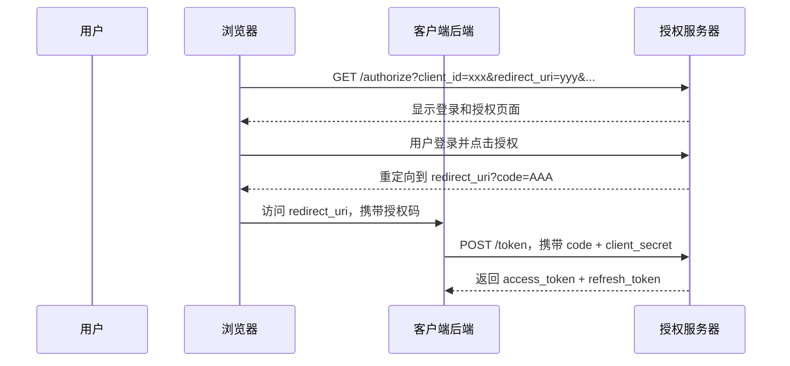
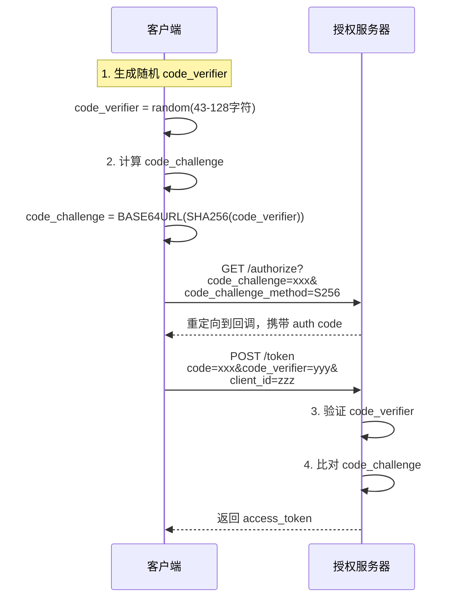

2012 年，Facebook 宣布将淘汰 OAuth 2.0 隐式授权模式在移动端的使用，推荐改用授权码模式配合 PKCE。这一决定在开发者社区引发了广泛讨论：为什么被写入 RFC 的标准模式会被官方「劝退」？这要从隐式模式的设计缺陷说起。

**隐式模式的问题在于：它把安全令牌直接暴露在 URL 中。** 在桌面浏览器中，这或许还能容忍；但在移动 App 中，URL 会经过操作系统多个组件，可能被截获、被记录、被泄露。Facebook 的决定不是创新，而是回归安全的基本原则。

## 一、授权码模式（Authorization Code）

授权码模式是 OAuth 2.0 中最安全、最推荐的授权方式，适用于能够保护客户端密钥的应用。

授权码模式的核心特征是「两次交换」：第一次交换在用户端完成，授权码通过 URL 传递；第二次交换在后端完成，客户端用授权码换取令牌，这个请求携带 `client_secret`，在安全的服务器环境执行。



对于公共客户端（如移动 App），授权码模式需要配合 **PKCE**（Proof Key for Code Exchange）使用。PKCE 原本是为公共客户端设计的安全增强机制，后来也被广泛用于所有类型的客户端。

PKCE 的工作流程：客户端在发起授权请求前先生成一个随机字符串 `code_verifier`，计算其 SHA256 哈希的 Base64URL 编码作为 `code_challenge`；授权服务器保存 `code_challenge`；客户端在兑换授权码时同时提供 `code_verifier`，授权服务器重新计算哈希并比对。不掌握 `code_verifier` 的攻击者即便截获了授权码，也无法换取令牌。

## 二、隐式授权模式（Implicit）

隐式授权模式诞生于 2010 年代初期，当时人们认为纯前端应用（如 SPA）无法安全地保管 `client_secret`，所以设计了一种简化流程：省略授权码交换步骤，授权服务器直接返回访问令牌。

简化意味着安全牺牲。在隐式模式中，访问令牌通过 URL 片段（Fragment，`#access_token=xxx`）返回。URL 片段不会发送到服务器，只会留在浏览器端，看似安全。但实际上，浏览器历史记录、会话存储、日志、Referer 头、浏览器扩展都可能被攻击者利用获取令牌。

RFC 6749 明确标注隐式模式存在已知安全风险，2028 年发布的 RFC 9700 正式将隐式模式标记为「历史遗留」，不再推荐使用。

:::danger 不推荐
隐式授权模式已被官方废弃，所有新项目不应使用此模式。如果应用无法使用 `client_secret`（如纯前端应用），请使用授权码模式 + PKCE。
:::

## 三、客户端凭证模式（Client Credentials）

客户端凭证模式用于**机器对机器（Machine-to-Machine，M2M）**通信。当后端服务需要调用另一个后端服务的 API 时，没有用户参与，无法使用需要用户交互的授权方式。

在客户端凭证模式下，「资源所有者」实际上就是客户端应用本身。客户端使用自己的 `client_id` 和 `client_secret` 向授权服务器认证，直接换取代表自己身份的访问令牌。

```java title="M2MTokenClient.java"
import java.net.URI;
import java.net.http.HttpClient;
import java.net.http.HttpRequest;
import java.net.http.HttpResponse;
import java.nio.file.Files;
import java.nio.file.Paths;
import java.time.Duration;

public class M2MTokenClient {
    
    private final String tokenEndpoint;
    private final String clientId;
    private final String clientSecret;
    private String cachedToken;
    private long tokenExpiry;
    
    public M2MTokenClient(String tokenEndpoint, String clientId, String clientSecret) {
        this.tokenEndpoint = tokenEndpoint;
        this.clientId = clientId;
        this.clientSecret = clientSecret;
    }
    
    public String getAccessToken() throws Exception {
        if (cachedToken != null && System.currentTimeMillis() < tokenExpiry - 60000) {
            return cachedToken;
        }
        
        String body = "grant_type=client_credentials&client_id=" + clientId + "&client_secret=" + clientSecret;
        
        HttpRequest request = HttpRequest.newBuilder()
            .uri(URI.create(tokenEndpoint))
            .header("Content-Type", "application/x-www-form-urlencoded")
            .POST(HttpRequest.BodyPublishers.ofString(body))
            .timeout(Duration.ofSeconds(10))
            .build();
        
        HttpClient client = HttpClient.newHttpClient();
        HttpResponse<String> response = client.send(request, HttpResponse.BodyHandlers.ofString());
        
        if (response.statusCode() == 200) {
            var json = parseJson(response.body());
            cachedToken = json.get("access_token");
            int expiresIn = json.get("expires_in");
            tokenExpiry = System.currentTimeMillis() + expiresIn * 1000L;
            return cachedToken;
        }
        throw new RuntimeException("Failed to get token: " + response.body());
    }
    
    private Map<String, Object> parseJson(String json) {
        // 简化实现，实际应使用 Jackson 或 Gson
        return Map.of(
            "access_token", "cached_token_value",
            "expires_in", 3600
        );
    }
}
```

客户端凭证模式的安全要点：客户端密钥必须严格保密，只能在服务端环境使用，绝不能嵌入前端代码或移动 App；为每个服务分配独立的凭证，便于精确控制权限范围和撤销；使用最短必要权限原则，服务 A 不需要访问资源 X，就不要给服务 A 分配访问资源 X 的 scope。

## 四、资源所有者密码凭证模式（Password Credentials）

资源所有者密码凭证模式（也称密码模式）允许客户端直接接收用户的用户名和密码，用这些凭证换取令牌。这个模式看起来「简单」，但实际上是一种**退步**——它要求用户将密码直接交给客户端应用，违背了 OAuth 2.0「不暴露密码」的核心设计理念。

密码模式只适用于以下场景：客户端是官方第一方应用，不存在信任问题；迁移旧系统到 OAuth 2.0 时，为了兼容无法改密的现有用户不得已而为之。如果不是这两种情况，应优先使用授权码模式。

密码模式的适用场景越来越少，OAuth 2.1（即将发布的 RFC 修订版）计划正式废弃此模式。

## 五、PKCE 机制详解

PKCE（RFC 7636）是对授权码模式的增强，原本为公共客户端设计，现在已成为所有客户端的最佳实践。

PKCE 的完整流程：



PKCE 为什么有效：攻击者即使通过 DNS 欺骗或中间人攻击截获了授权码，由于不知道 `code_verifier`（只有客户端知道），无法换取令牌。`code_verifier` 是客户端本地生成的随机字符串，从不经过网络传输。

## 六、选型指南

| 场景 | 推荐模式 | 说明 |
|---|---|---|
| Web 应用后端 | 授权码模式 | 标准流程，安全性最高 |
| SPA（单页应用） | 授权码模式 + PKCE | 现代浏览器都支持，建议优先选择 |
| iOS/Android 原生 App | 授权码模式 + PKCE | App 的 WebView 可被注入，PKCE 必须启用 |
| 后端服务间调用 | 客户端凭证模式 | M2M 通信的标准方案 |
| 第一方官方应用 | 密码模式（仅限过渡期） | 信任度高的场景可考虑，2028 年后不推荐 |

:::tip 选型建议
除非有充分的理由，否则一律使用授权码模式 + PKCE。这是 OAuth 2.0 当前的最佳安全实践，能够覆盖绝大多数场景。
:::

---

## 思考题

**问题 1**：某团队计划开发一个移动 App，App 需要访问用户在其他平台（如 Google）存储的数据。他们调研后决定使用隐式授权模式，因为「实现简单」「用户不用输入密码」。请分析这个方案的问题，并给出改进建议。

<details>
<summary>参考答案</summary>

问题分析：隐式模式将访问令牌暴露在 URL 片段中，移动端 URL 会经过操作系统多个组件（App Delegate、WebView、网络层），存在被截获的风险。移动 App 没有后端，所有代码都在用户设备上，无法安全存储 `client_secret` 是选择隐式模式的理由，但这恰恰说明应该使用授权码模式 + PKCE。改进方案：App 仍可使用授权码模式 + PKCE，在 App 内部嵌入 Safari View Controller 或使用系统浏览器进行授权流程。PKCE 替代了 `client_secret` 的作用，为公共客户端提供同等安全保障。
</details>

**问题 2**：在客户端凭证模式中，客户端使用自己的凭证（client_id + client_secret）换取访问令牌。这意味着所有后端服务都需要保管自己的密钥。如果有 100 个微服务，每个服务都需要访问其他服务的 API，请问如何管理这些密钥以避免「密钥泄露导致整个系统沦陷」的风险？

<details>
<summary>参考答案</summary>

密钥管理的核心原则是最小化和隔离。具体策略：每个服务使用独立的 `client_id` 和 `client_secret`，而不是共享凭证，这样一个服务被攻破不会影响其他服务；使用密钥管理服务（AWS Secrets Manager、HashiCorp Vault）集中存储和分发密钥，服务运行时从密钥管理服务获取，避免将密钥写入配置文件或环境变量；实施密钥轮转策略，定期更换密钥，服务支持热更新配置而不需要重启；监控密钥使用异常，检测异常访问模式（如某个服务突然开始访问不该访问的资源）；使用 mTLS 替代共享密钥，服务身份通过证书验证，每个服务的证书只能代表自己，无法伪装成其他服务。
</details>
