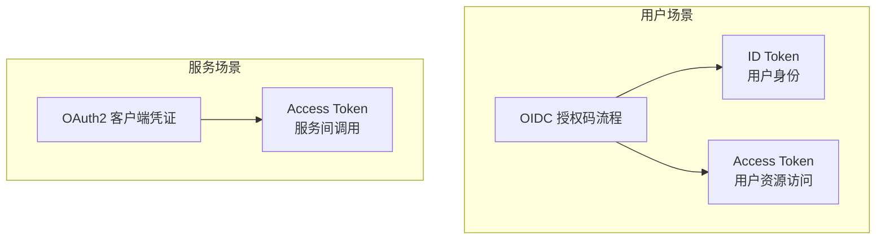

很多开发者对 OAuth 2.0 和 OIDC 的关系存在困惑：是两个完全不同的协议？是竞争关系还是包含关系？什么场景该用哪个？

实际上，**OIDC 是 OAuth 2.0 的扩展**，两者不是竞争而是协作关系。OIDC 在 OAuth 2.0 基础上添加了身份认证层，让 OAuth 2.0 从「授权协议」升级为「身份认证 + 授权协议」。理解这个关系，是掌握现代身份授权体系的关键。

## 一、两个协议的关系

OAuth 2.0（RFC 6749）于 2012 年发布，定义了一套授权框架，允许用户授权第三方应用访问受保护资源。OAuth 2.0 的输出是 Access Token，代表用户授予应用的资源访问权限。

OIDC（OpenID Connect）于 2014 年发布，作为 OAuth 2.0 的扩展层，在授权流程中额外返回 ID Token。ID Token 代表用户的身份信息，让应用知道「当前用户是谁」。

可以用一个比喻理解：OAuth 2.0 像是酒店房卡，你用它可以打开房间门（访问资源），但酒店不知道你是谁（只知道房卡有效）。OIDC 则是酒店在前台登记入住时给你一张「身份证」副本，不仅确认你可以进入房间，还告诉酒店（应用）「这位客人的名字是张三」。

从协议栈角度看：最底层是 OAuth 2.0 授权框架；中间层是 OIDC，在 OAuth 2.0 基础上添加身份层；最顶层是 OIDC Profile，定义具体实现细节。

## 二、能力对比

| 能力 | OAuth 2.0 | OIDC |
|---|---|---|
| 核心目的 | 资源授权 | 身份认证 + 资源授权 |
| 核心产物 | Access Token | Access Token + ID Token |
| 用户身份信息 | 不包含（需要额外 API） | ID Token 直接包含 |
| 标准化身份信息 | 无 | 标准 Claims（sub、name、email） |
| Discovery 机制 | 无 | 有（openid-configuration） |
| 登录状态标准化 | 无 | 有（ID Token 可直接表示登录状态） |
| 适用场景 | API 授权、跨服务调用 | 用户登录、身份验证 |

OAuth 2.0 专注于授权。当后端服务 A 需要调用后端服务 B 的 API 时，使用 OAuth 2.0 的客户端凭证模式。服务 A 拿到 Access Token，服务 B 验证 Token 并决定是否返回数据。服务 A 不需要知道「谁」在调用，只关心「是否有权」访问。

OIDC 专注于身份认证���当用户需要登录应用时，使用 OIDC 的授权码流程。应用拿到 ID Token 后，立即知道用户身份，建立本地会话。不需要额外调用 API 获取用户信息。

## 三、选型场景分析

**选择 OAuth 2.0（不含 OIDC）**：

- 机器对机器通信：后端服务调用后端服务的 API，不需要用户身份
- 资源访问授权：只想授权访问特定资源，不关心用户身份
- 遗留系统集成：已有 OAuth 2.0 实现，迁移成本高

**选择 OIDC（包含 OAuth 2.0）**：

- 用户登录：需要验证用户身份，建立登录状态
- 单点登录：用户使用一套凭证登录多个应用
- 获取用户信息：需要知道用户是谁、邮箱、头像等

**实际项目中，通常两者组合使用**：

```java title="OAuth2AndOidcController.java"
@RestController
public class OAuth2AndOidcController {
    
    @GetMapping("/login")
    public RedirectView oidcLogin() {
        // OIDC 用于用户登录场景
        // 请求包含 openid scope，返回 ID Token
        return new RedirectView(authorizationEndpoint + 
            "?client_id=my-app&redirect_uri=https://myapp.com/callback&" +
            "scope=openid profile email&response_type=code");
    }
    
    @GetMapping("/api/user/data")
    public Object getUserData(@RequestAttribute("accessToken") String token) {
        // OAuth 2.0 用于 API 访问场景
        // 请求不包含 openid scope，只返回 Access Token
        return externalApiClient.call(token);
    }
}
```

## 四、常见误解澄清

**误解一：OIDC 是 OAuth 3.0**

OIDC 不是 OAuth 3.0。两个协议是独立演进的，OAuth 2.0 仍是活跃的标准，OIDC 1.0 仍在使用。两者有明确分工，OAuth 2.0 管授权，OIDC 管身份认证。OIDC 基于 OAuth 2.0 建构，但不会替代它。

**误解二：OIDC 只能用于用户登录**

OIDC 的 ID Token 可以用于多种场景：API 身份验证（与 Access Token 类似）、跨服务的身份传递、服务间调用的身份标识。但 ID Token 通常不用于访问受保护资源，那是 Access Token 的职责。

**误解三：Access Token 和 ID Token 可以互换**

Access Token 和 ID Token 是不同的凭证。Access Token 供资源服务器验证，决定资源访问权限；ID Token 供客户端应用验证，决定用户身份。混淆两者的使用场景会导致安全问题：不要用 ID Token 访问 API（资源服务器不认识 ID Token）；不要用 Access Token 表示用户登录状态（可能没有身份信息）。

**误解四：OIDC 只能用在 Web 应用**

OIDC 设计为协议无关，实际上可用于多种应用类型：Web 应用（传统后端渲染或 SPA）、移动 App（iOS/Android）、桌面应用、命令行工具（CLI 工具的 OAuth 登录）。OIDC 的授权码 + PKCE 流程适用于所有需要用户身份的场景。

## 五、实际项目选型建议

**新项目用户认证**：直接使用 OIDC 授权码流程 + PKCE。这是现代应用的标准做法，兼顾安全性和易用性。Keycloak、Auth0、Okta、Azure AD 都支持 OIDC。

**微服务 API 授权**：使用 OAuth 2.0 客户端凭证模式。服务间调用不需要用户身份，使用服务自己的凭证换取 Access Token。每个微服务都有自己的 Client ID 和 Secret，便于权限管理和撤销。

**混合场景**：同时使用两者。用户登录使用 OIDC 获取 ID Token 和 Access Token（用于用户数据的 API）；服务间调用使用客户端凭证模式获取独立的 Access Token。



---

## 思考题

**问题 1**：某团队在设计一个第三方支付集成功能：用户可以在应用内直接使用支付宝/微信支付。他们讨论是否可以使用 OIDC 实现这个功能。请分析这个需求是否适合使用 OIDC，以及为什么。

<details>
<summary>参考答案</summary>

这个需求不适合使用 OIDC。OIDC 用于身份认证，即「验证用户是谁」。支付集成的核心是「授权访问用户在支付平台的账户」，属于 OAuth 2.0 的资源授权场景而非身份认证场景。正确做法是使用 OAuth 2.0 的授权码流程，让用户授权应用访问支付平台的支付能力，交换的是 Access Token，用于调用支付 API。OIDC 会返回用户身份信息，但支付平台不提供这些信息，且这不是集成的主要目的。如果要在支付前验证用户身份（是否已登录、是否本人操作），那是应用自身的登录系统（可能使用 OIDC），与支付集成（使用 OAuth 2.0）是两个独立的流程。
</details>

**问题 2**：在微服务架构中，有时需要在服务间传递当前发起请求的用户身份。例如：前端调用用户服务获取用户信息，用户服务需要调用订单服务，订单服务需要知道「这个请求是用户 X 发起的」。请设计这个场景的解决方案，并分析 OAuth 2.0 和 OIDC 各自发挥什么作用。

<details>
<summary>参考答案</summary>

方案设计有几种：令牌传播——前端携带 JWT 格式的 Access Token 调用用户服务，用户服务解析 Token 获取用户 ID，将用户 ID 添加到对订单服务的请求头中（如 `X-User-Id`）；Token 转发——用户服务将收到的 Access Token 原封不动转发给订单服务，订单服务验证同一个 Token；用户 Token 换服务 Token——用户服务用用户 Access Token 换取服务自己的 Access Token（通过 Token Exchange 扩展 RFC 8693），调用订单服务。OAuth 2.0 负责服务间调用的授权验证（每个服务的 Token 是否被信任）；OIDC 负责前端到后端的首跳身份验证（用户是谁）。在 JWT 令牌场景下，ID Token 和 Access Token 可能是同一个 Token（有些实现会在一个 Token 中同时包含身份信息和授权信息），这种情况下需要区分使用场景。
</details>
